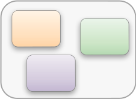
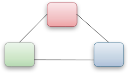
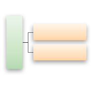

# 2 Fundamentals: what is metadata and what are metadata standards?

<table>
<colgroup>
<col style="width: 6%" />
<col style="width: 93%" />
</colgroup>
<tbody>
<tr class="odd">
<td>🏅</td>
<td><strong>Learning objectives of the chapter</strong></td>
</tr>
<tr class="even">
<td></td>
<td>
You will:

<ul>
<li>
Understand the basics and functions of metadata
</li>
<li>
Learn the characteristics of metadata standards
</li>
<li>
Know the benefits of open standards in the public sphere
</li>
</ul></td>
</tr>
</tbody>
</table>
## 2.1 What is metadata?

Metadata is structured information about other data of any format [@bacaimpdi1998, p. 1], [@caplanmfal2003, p. 1-3], [@gillilandss2016], which can be processed by machines and is contextually interpretable [@caplanmfal2003, p. 2]. The World Wide Web Consortium (W3C) also adds that, as well as being human-readable, a key aspect of metadata is that it is machine-understandable – the latter being achievable by means of a well-defined structure and semantics [@berners-leewam1997], [@swickmrd2001]. Structured metadata thus permits direct machine processing without the need for additional semantic analysis techniques (e.g. text mining) [@barkermlmoescd2010]. To this end, metadata must comply with a documented scheme of a metadata standard [@caplanmfal2003, p. 3], which then functions as an overarching set of rules to make metadata usable based on a shared understanding [@arnoldpmieapuefbvf2003, p. 379]. The following basic terms are distinguished in the context of metadata schemas:

- Metadata fields[\^1] (defined properties or characteristics of the object)
- Values (the content of a metadata field)
- Value range (controlled vocabulary)

Metadata thus also makes informative statements[\^2] about resources (Pomerantz, 2015, p. 26). Formal representations of such statements are covered in the chapter on basic technical principles. Example of a statement about a specific learning resource as a triple (subject, predicate, object):

Resource (subject) metadata field (predicate) value (object)  
{explanatory video} {created by} {person}

**Metadata record**

A metadata record bundles the individual metadata for a specific object. Distinct, conceptually different objects should each be represented by their own, separate metadata record (1:1 principle) \[@pomerantzm2015, p. 55\] \[@stevenopccp2010\], while relationships can indicate possible connections between individual objects. For various reasons, however, the principle is rarely adhered to in practice \[@stevenopccp2010\]. It is also possible for multiple metadata records to be assigned to individual objects, for example, on the basis of different metadata schemas. Furthermore, in the context of an AI- or crowd-based metadata annotation, various procedures with multiple meta data records for separate objects are being investigated. The challenge faced by services that aggregate metadata records across different platforms is that the distribution of objects across different systems can result in the existence of multiple, inconsistent metadata records about these objects. This in turn can lead to an undesirable ambiguity of the metadata (cf. [chapter on data quality](#welche-qualitätskriterien-sind-für-metadaten-relevant)).

**Metadata schema**

A metadata schema defines both the elements of objects and their relationships. It thus provides a prototypical framework for how and which statements about objects can be formulated [@pomerantzm2015, p. 28]. In this case, a controlled vocabulary in form of a value range limits the values that can be used in the respective statements about an object and thus standardises the content-specific aspects of the statements. Requirements that can be defined in a metadata schema:

- Obligation (e.g. optional or mandatory metadata fields)
- Repeatability (e.g. multiple occurrence of metadata fields)
- Required format and encoding schema (e.g. syntax of place/date information)
- Controlled vocabulary (e.g. predefined values for metadata fields)

Through consistent use of metadata schemas, metadata from different sources can be aggregated and indexed without the need for complicated mappings between value ranges and metadata fields \[@barkermlmoescd2010\] \[@wuacrdsso2023\], which could otherwise result in information loss during the [ETL process](#wie-werden-metadaten-ausgetauscht---der-etl-prozess). To ensure that a metadata schema meets the relevant interoperability requirements, it should have the following properties: extensibility, flexibility, modularity, comprehensiveness, sufficiency, simplicity as well as support for data interchange, retrieval, archiving and publication \[@wuacrdsso2023\]. In many cases, metadata schemas are initially kept quite generic to ensure broad applicability. Concretisations and extensions are then defined in metadata profiles.  Examples of metadata schemas:

- DublinCore Terms ([DCMI Metadata Terms](http://dublincore.org/specifications/dublin-core/dcmi-terms/2020-01-20/))
- [Schema.org](https://schema.org/)
- [OERSchema](https://oerschema.org/docs/)
- [DataCite Metadata Schema](https://web.archive.org/web/20231227020750/https://schema.datacite.org/meta/kernel-4.4/doc/DataCite-MetadataKernel_v4.4.pdf)
- [ARIADNE](https://web.archive.org/web/20030203003051/http://ariadne.unil.ch/Metadata/ariadne_metadata_v3final1.htm)

**Metadata profiles**

While metadata schemas are usually more generic in nature, thereby ensuring broad reusability, metadata profiles[\^3] allow application- or domain-specific concretisations and extensions to be standardised or different schemas to be combined with one another [@haynesmimrumiu2018, p. 170] [@najjarilorcg2004]. In a metadata profile, metadata fields are selected as well as syntactically and semantically defined [@dinieapmfelul2005], while value ranges are also specified. Metadata schemas, on the other hand, frequently contain no value specifications. Therefore, due to the more general character of metadata schemas, standards are frequently employed only in the form of concretisations in metadata profiles [@menzeldmpheor2023]. In this case, specialised communities should determine which controlled vocabularies are to be used and how individual values are to be interpreted [@robsonpm2001, p. 216].

Examples of metadata profiles:

- ELIXIER ([metadata profile](https://www.bildungsserver.de/elixier/elixier.pdf), [search engine](https://www.bildungsserver.de/elixier/))
- [General Metadata Profile for Educational Resources](https://w3id.org/kim/amb/latest/) (AMB)

## 2.2 What is metadata used for?

A holistic conceptualisation of metadata goes beyond mere descriptions [@bacaimpdi1998]. Metadata has always been used for different purposes, for example, to identify, describe or document objects, and to define how and for what purpose the object is used and what relationships it has with other objects [@bacaimpdi1998] [@rileyumwmwi2017]. Metadata is thus used to describe the content, format, purpose and structure of the referenced data [@al-khalifaemssea2006]. Metadata helps to verify the authenticity and the context of content and to improve the accessibility of the referenced data [@bacaimpdi1998, p. 2]. Assigning metadata to objects thus facilitates the organisation, management and findability of resources [@al-khalifaemssea2006]. It allows other data to be categorised, sorted, identified and located with greater efficiency [@duvalmswww2001, p. 591f]. Detailed and comprehensive metadata provides essential context for objects and maximises their reusability [@ziedornmfoerohfoehetit2013, p. 8]. Complex objects in particular can be presented in a simpler and more accessible form with the aid of metadata [@stumppesulopb2003, p. 148]. This in turn provides easier access to complex resources such as audiovisual content (e.g. 360° videos, VR), simulations, 3D models and much more besides.

## 2.3 What types of metadata are there?

Although further (sub)types of metadata have been identified in research, three main types of metadata can be distinguished: descriptive metadata, administrative metadata and structural metadata [@rileyumwmwi2017].

**Descriptive metadata**

Descriptive metadata is used to describe or identify resources \[@bacaimpdi1998, p. 3\]. Since it provides information about the specific content of resources, it supports their documentation and reuse by third parties \[@gillilandss2016\]. This type of metadata assists in finding and retrieving relevant resources \[@pomerantzm2015\] \[@rileyumwmwi2017, p. 1\] \[@ruehlekhmm2012, p. 2\], as well as in presenting these resources, for example, in the form of search results. Descriptive metadata also allows users to establish whether a specific resource is suitable for the intended purpose, which again improves its reusability. Usage and interaction metadata about digital objects can also be classified as descriptive metadata. These metrics serve as valuable indicators, which can be used for evaluation purposes by the resource creators and can also provide subsequent users with implicit impressions regarding the popularity and quality of resources. Accessing complex or multimedia resources can be very difficult, which makes descriptive metadata absolutely essential in such cases (Steiner, 2018). Metadata thus systematically abstracts the complexity of such resources \[@steinermuogb2018\]. The use of artificial intelligence can help to simplify and optimise the acquisition of metadata, for example, by automatically transcribing audiovisual media to make the corresponding content accessible to text-based searches (e.g. via [Whisper](https://openai.com/research/whisper), [SpeechBrain](https://speechbrain.github.io/)) and in the [TIB AV-Portal](https://av.tib.eu/) ([blog post)](https://web.archive.org/web/20240228155936/https://blog.tib.eu/2023/12/19/the-tib-av-portal-in-2023-ai-based-speech-recognition-high-definition-and-dynamic-frontend/).

Examples:

- Bibliographical details (titles, authors, keywords, etc.)
- Content information (topics, language(s), etc.)
- Technical properties (playback time, etc.)
- Object quality (reviews, scale-based evaluation, etc.)
- Information regarding modalities of reuse (didactic notes, etc.)
- Metrics for object interaction and usage (accesses, downloads, embeds, etc.); also used as indicators for the popularity of objects or their evaluation

**Administrative metadata**

Administrative metadata is used to organise and manage resources [@bacaimpdi1998, p. 3] [@caplanmfal2003, p. 151] [@gillilandss2016] [@rileyumwmwi2017, p. 1], thereby ensuring that it remains available in the long term and can be used effectively. This category includes metadata about other metadata (meta-metadata), indicating such things as the metadata provenance, licensing of the source data, time and location details as part of the resource life cycle as well as persons associated with the creation and provision of the metadata. Administrative metadata thus enables contextualisation of resources [@gillilandss2016] and increases the transparency of the creation process, which in turn raises trust in the resources and promotes their reuse. Subgroups of this metadata type include technical metadata along with metadata to support the continued storage of objects (*preservation metadata*), which are sometimes distinguished as separate types [@caplanmfal2003, p. 153-157] [@pomerantzm2015].

Examples:

- Provenance/origin (data lineage, trustworthiness, usability, etc.)
- Rights (access authorisation, copyrights, usage rights, etc.)
- Life cycle of the object (data life cycle, stage of development, etc.)
- Creation, editing and distribution history (used software, forks, derivatives, versioning, etc.)
- Legal documentation (acquisition, licensing, etc.)
- Technical metadata (format, size, encoding, etc.)
- Quality of metadata (validity, reliability, etc.)

**Structural metadata**

Structural metadata can represent relationships between different resources (horizontal structure) as well as internal structural information on the resource itself (vertical structure, such as chapter markers; see example below) \[@gillilandss2016\]. Structural metadata is sometimes considered to be a subcategory of administrative metadata \[@pomerantzm2015\]. In the education environment, however, the structural information between and within resources is often essential, resulting in such metadata being defined as a distinct group. The implementation of [Linked Data](#_3.2_Was_sind) principles also requires appropriate differentiation and therefore regards structural information as significant.

Examples:

- Vertical structure: sections within a resource (e.g. chapters in a video or book), navigation or sequence of individual elements within a resource (e.g. ordered pages)
- Horizontal structure: prerequisites, dependencies and other relationships between resources

**Relationships between objects**

Associative, hierarchical and heterarchical relationships can exist between objects such as educational resources that are described by metadata. Associative relationships between resources express, for example, a factual or chronological connection. Hierarchical relationships represent structural connections (e.g. "part of" relation). Examples of heterarchical relationships include networks of coordinated objects with potentially equal status.

Table: *Examples of relationships between objects*

<table>
<colgroup>
<col style="width: 18%" />
<col style="width: 20%" />
<col style="width: 61%" />
</colgroup>
<tbody>
<tr class="odd">
<td><strong>Type</strong></td>
<td><strong>Order</strong></td>
<td><strong>Usage examples</strong></td>
</tr>
<tr class="even">
<td rowspan="2">Associative</td>
<td>Preceding/succeeding</td>
<td>Chronological order of objects (e.g. teaching/learning paths), list structures (predecessor/successor) </td>
</tr>
<tr class="odd">
<td>Ordered by content</td>
<td>Thematic relationship of objects,  collection of objects </td>
</tr>
<tr class="even">
<td>Hierarchical</td>
<td>Superordinated/subordinated</td>
<td>Parent/child objects (e.g. generic and specific concepts), subobjects (&quot;part of&quot; relations), tree structures </td>
</tr>
<tr class="odd">
<td>Heterarchical</td>
<td>Coordinated</td>
<td>Supporting or dependent objects, equal-ranking relationships between entities with different roles, network structures
 

</td>
</tr>
</tbody>
</table>
## 2.4 What are the functions and benefits of metadata?

Metadata should always be defined on the basis of a specific usage scenario so that relevant fields and values can be included in the description. In terms of resources, metadata performs a wide range of functions [@barkermlmoescd2010] [@gillilandss2016] [@haynesmimrumiu2018, p. 9-13] [@menzeldmpheor2023] [@rileyumwmwi2017, p. 1], including:

- Identification and localisation of resources (*resource discovery*), including criteria-based identification of resources (search, filter, sorting)
- Presentation of qualitative and relevant search results
- Consolidation of comparable resources
- Interchangeability of resources, e.g. between repositories
- Distinction between different resources
- Utilisation of complex, multimedia resource types
- Integration and reuse of data
- Administration, documentation and archiving of resources
- Transparency of the creation process
- Establishment of the suitability of resources for the intended purpose
- Quality indicators

A schema-compliant use of metadata produces an extensive network of information that forms an important basis for the development and provision of digital services. These services give rise to a variety of usage scenarios and can offer added value to the addressed parties by using and making metadata accessible at different levels of abstraction. A range of functions offering multifaceted perspectives can thus be offered through and by metadata.

Metadata enables useful services such as:

- Repositories for educational resources and their distribution for effective reuse in learning management systems, didactic tools, materials, etc.
- Specialised (meta)search engines (referatories, metaportals, etc.) to make relevant educational resources discoverable based on (educational) metadata
- Automatic quality control of educational resources to improve both findability and accessibility
- Personalised recommendations for training and education (needs-based suggestion systems)
- Adaptive teaching/learning paths, intelligent tutoring systems (ITS) and resources that use metadata from educational contexts to provide individual and personalised learning experiences
- Learning portfolios and learning diagnostics that use educational metadata from learning environments (learning analytics)

<table>
<colgroup>
<col style="width: 6%" />
<col style="width: 93%" />
</colgroup>
<tbody>
<tr class="odd">
<td>💡</td>
<td><strong>Summary</strong></td>
</tr>
<tr class="even">
<td></td>
<td><ul>
<li>
Different metadata abstraction levels are required for metadata to provide added value to different parties.
</li>
<li>
Different categories of metadata exist, each of which has diverse perspectives with regard to reusability.
</li>
</ul></td>
</tr>
</tbody>
</table>
## 2.5 What are metadata standards?

<table>
<colgroup>
<col style="width: 6%" />
<col style="width: 93%" />
</colgroup>
<tbody>
<tr class="odd">
<td>🏅</td>
<td><strong>Learning objectives of the chapter</strong></td>
</tr>
<tr class="even">
<td></td>
<td>
You will:

<ul>
<li>
Know the different standards and their distinguishing characteristics
</li>
<li>
Learn about the various methods for developing standards
</li>
</ul></td>
</tr>
</tbody>
</table>
A metadata standard is a set of rules that can be used to establish a shared understanding of how to work with metadata, for example, for specific applications or in certain contexts. Such agreements comprise standardised rules for the syntactic and semantic interpretation of data. Both a *top down* and a *bottom up* approach can be employed in developing a standard, and this usually involves the expertise of specialist groups. A metadata schema constitutes an application- or domain-specific implementation of a metadata standard. Standards help to ensure that requirements for products and processes are met.

Figure: *"[Standards](https://xkcd.com/927/)" by Randall Munroe, licensed under [CC-BY-NC 2.5](https://creativecommons.org/licenses/by-nc/2.5/)*

**Format and validation of standards**

The format of standards usually corresponds to a formalised document that describes the correct implementation of the respective standard. Sometimes, opportunities are also provided to test the correct implementation as well as opportunities for accreditation by the publishing institution.[\^4] Pawlowski (2001) sets out the following requirements for standards [@pawlowskieevzecl2001, p. 90f]:

- Recombinability
- Recontextualisation
- Interoperability
- Adaptability
- Flexibility
- Simplicity
- Efficiency

**Types of standards**

The aforementioned requirements are taken into account in the creation of standards. According to Reichow et al. (2021), seven different types of standards can be distinguished:

- Laws and regulations
- Norms
- Specifications
- Committee standards
- Industry standards
- Manufacturer standards
- Guidelines, checklists and recommendations

**Type: laws and regulations \[@reichowsuezudwbbdiri2021]**

As formal standards, laws and regulations prescribe how a specific area is to be regulated. Unlike regulations, laws are subject to a formal legislative process. At EU level, two types of laws exist in the form of EU regulations and EU directives. Regulations are binding legal acts that all EU countries must fully implement and comply with. In contrast to EU regulations, EU directives are not immediately effective and binding, but instead must be implemented through national legal acts in order to become effective.

Examples: [Laws of the German Parliament (Bundestag)](https://www.gesetze-im-internet.de/aktuell.html) or [regulations of the EU](https://eur-lex.europa.eu/DE/legal-content/summary/european-union-regulations.html)

Characteristics:

- State authorised
- Subject to a formalised process
- Broad public participation in the process
- Strictly binding (de jure or de facto)

**Type: norm \[@reichowsuezudwbbdiri2021]**

A norm (or standard) is a publicly accessible document that defines consensual requirements for products, services or processes (DIN EN 45020:2007-03; DIN 820). Norms serve as a reference for establishing a transparent and uniform understanding of rules, guidelines or characteristics for application by all relevant parties (CEN/SS F20 Quality Assurance, 2007). Norms and specifications are created as part of an institutional standardisation process. The starting point for a norm is a standardisation application, which can be submitted by anyone. The need for the norm in the relevant industry is then assessed. If a need is identified, the norm is created within a committee with participating interest groups, based on the principle of consensus. The resulting draft is then presented to the public for comment before being revised again. The norm is reviewed at regular intervals.

Examples: DIN, European Committee for Standardisation (CEN) / Information Society Standardisation System (ISSS), ISO

Characteristics:

- Standardisation institutions are state authorised
- Formalised process
- Public involvement
- Binding if the use of the norm is contractually agreed

**Type: specification \[@reichowsuezudwbbdiri2021]**

A specification is created in a similar way to a norm, except that the process is shorter, requires less coordination and no consensus is required between the parties involved. The goal is to quickly develop a solution in order to bring innovations to market. The specification can later serve as the basis for a norm. Occasionally, the term "specification" is used less strictly to describe the results of non-official standardisation bodies (see "committee standards" below) [@strackekrfeueiu2007, p. 2-3].

Characteristics:

- State authorised (in the case of a DIN specification or similar)
- Formalised process

**Type: committee standard (1EdTech/IMS, IEEE, W3C) \[@reichowsuezudwbbdiri2021]**

Committee standards are created by non-state-authorised institutions. However, these committees usually establish their own formalised processes that regulate the development of a standard. Participation in these committees is regulated in different ways. Some require membership contributions in order to participate in the development of standards (e.g. 1EdTech, IEEE), while others are open to all interested parties (e.g. DCMI, W3C). Although IEEE standards sometimes have to be purchased, other standards are freely accessible following their publication (1EdTech, W3C). Committee standards can serve as the basis for a later norm, such as the Web Content Accessibility Guidelines (WCAG) developed by the W3C. While stakeholders at higher levels implement solutions that are as generally applicable as possible and thus propose generic conditions and structures, institutions and projects build on this to develop domain-specific application profiles that address distinct needs or requirements for software solutions.

Examples: W3C, 1EdTech, IEEE, DCMI, DINI-AG-KIM

Characteristics:

- Formalised process
- Public involvement

**Type: industry standard \[@reichowsuezudwbbdiri2021]**

Industry standards are standards that are created by agreement between several manufacturers. These standards can later serve as the basis for further standardisation efforts on the part of committees or standardisation bodies.

Examples of industry standards: PDF, DVD

Characteristics:

- Binding (in case of agreement between several manufacturers)

**Type: manufacturer standard \[@reichowsuezudwbbdiri2021]**

In contrast to industry standards, manufacturer standards are defined by a single manufacturer. Their validity is dictated by the market power and influence of the manufacturer.

Examples: macOS (Apple) or Windows (Microsoft) as operating systems

Characteristics:

- Binding in the case of a company's corresponding market position

**Type: guidelines, checklists and recommendations \[@reichowsuezudwbbdiri2021]**

Guidelines, checklists or recommendations are sometimes used if no appropriate standards exist. These can serve as the basis for initial orientation and later standardisation.

<table>
<colgroup>
<col style="width: 6%" />
<col style="width: 93%" />
</colgroup>
<tbody>
<tr class="odd">
<td>💡</td>
<td><strong>Summary</strong></td>
</tr>
<tr class="even">
<td></td>
<td><ul>
<li>
Seven different types of standards can be distinguished:

<ul>
<li>
Laws and regulations
</li>
<li>
Norms
</li>
<li>
Specifications
</li>
<li>
Committee standards
</li>
<li>
Industry standards
</li>
<li>
Manufacturer standards
</li>
<li>
Guidelines, checklists and recommendations
</li>
</ul></li>
<li>
The distinction lies mainly in the way the standards are developed and the authority they gain from the committees and institutes that create them.
</li>
</ul></td>
</tr>
</tbody>
</table>
## 2.6 Why are metadata standards needed?

The definition and distribution of resources, for example via web-based repositories, requires the development and establishment of metadata standards, particularly for the exchange of metadata across the boundaries of individual platforms. The inadequate use of uniform schemas hinders the integration of resources into higher-level systemic structures, such as referatories or metaportals [@dietzeierwdsca2013] [@steinermuogb2018], which serve as a valuable means of orientation.

With metadata standards, data can be exchanged to ensure future usability of resources [@haynesmimrumiu2018, p. 49]. Without such standards, searching for resources would only be possible to a very limited extent, meaning that teaching/learning offers, for example, would be hard to find and difficult to access [@wannemacherobaoi2023]. The provision of central search facilities [@arndtdkpfpcql2023, p. 13] by means of suitable infrastructural measures [@deutscherbildungsservermaubob2016] [@heinenrichardfrsoie2020] improves the needs-optimised findability of resources.

Particularly in distributed systems, metadata standards can help to harmonise the vast amount of rather heterogeneous content[\^5]. Therefore, the networking of portals based on metadata standards and controlled vocabularies continues to be a key challenge [@dietzeierwdsca2013], [@wannemacherobaoi2023]. In particular, it is recommended to reuse existing vocabularies in order to ensure interoperability[\^6] of the data [@heathldewgds2011].

Only standardised metadata structures enable reliable processing and reuse of data [@heathldewgds2011]. One of the main benefits of documented metadata standards is the ability to communicate conventions and intentions to subsequent users and thereby increase the consistency of metadata [@haynesmimrumiu2018, p. 49f].

**Reasons and objectives for the usage and development of metadata standards**

The reasons for using standards relate to their cooperative and simplifying effect (Genschel, 1995 in [@reichowsuezudwbbdiri2021]). The basic need of users to generally define characteristics of objects in advance and to exchange objects during their life cycle leads to the formation of standards. A necessity for developing standards also arises from the desire to systematise the growing data sets and to implement technological innovations for future usage scenarios. Therefore, later reuse is a primary focus in the development of metadata standards. In particular, five factors are crucial for the widespread establishment and future adaptation of a standard [@rogersdi1983]:

1) Relative advantage: A standard should offer an advantage over previous solutions.
2) Compatibility: A standard should represent a consistent development that builds on previous solutions and establishes (partial) compatibility.
3) Complexity: A standard should be easy to understand and manage; its complexity should be as low as possible.
4) Trialability: It should be possible to test a standard in practice in advance.
5) Observability: The effects of using a standard should be clearly visible.

The standardisation itself can occur in three ways:

1. De facto
2. Institutional
3. Legislative \[@genschelsiiwis1995, p. 32]

The use of standards aims to improve interoperability. The defined rules of a metadata standard facilitate the management of metadata in various areas, such as during specification and cross-platform exchange. The resulting interoperability enables a seamless user experience.

The binding nature of standards gives rise to reliable expectations regarding data quality and thus also increases trust in the quality of the information, especially due to the possibility of validation, which is facilitated by a schema. Such metadata schemas permit the implementation of rules and standards for automated verification of data validity.

For publicly funded institutions and projects, another aspect may also come into play: To meet the key demand of the "[Public Money, Public Code](https://publiccode.eu/de/)" campaign, established and open standards should be used in publicly financed projects wherever possible. This enables reuse of the relevant infrastructure (components), data and interfaces while also ensuring sustainable interoperability beyond the funded project period \[@fsfepmpc2024\], as past prototypes have already successfully demonstrated \[@arndtdkpfpcql2023\] \[@oellersavb2023\].

<table>
<colgroup>
<col style="width: 6%" />
<col style="width: 93%" />
</colgroup>
<tbody>
<tr class="odd">
<td>💡</td>
<td><strong>Summary</strong></td>
</tr>
<tr class="even">
<td></td>
<td><ul>
<li>
Metadata standards enhance the quality, consistency and interoperability of data and thereby improve their reusability.
</li>
<li>
Publicly funded projects should place a particularly high focus on reusability so that the data can continue to be used after project completion.
</li>
</ul></td>
</tr>
</tbody>
</table>
## 2.7 Which quality criteria are relevant for metadata?

<table>
<colgroup>
<col style="width: 6%" />
<col style="width: 93%" />
</colgroup>
<tbody>
<tr class="odd">
<td>❓</td>
<td><strong>Questions</strong></td>
</tr>
<tr class="even">
<td></td>
<td><ul>
<li>
What do we mean by data quality?
</li>
<li>
How can we ensure reusability of data?
</li>
</ul></td>
</tr>
</tbody>
</table>
**Limited availability of data about content**

The quantity and quality of search results provided by traditional search engines is limited by the lack of data about the listed content. The selection and ranking of the resources returned in the hit list are influenced by the mechanisms employed by the search engines \[@cooperdmitslrbcpd2020, p. 363\], which are often not transparent to users. This includes the specific functioning of the algorithms used to evaluate the individual metadata of the digital resources and thus create the presented ranking. The same discussion is also taking place in the context of social media platforms since users have no insight into the algorithms that determine their media feed. As a result, they frequently do not know why some content appears or is not actually shown. These practices can lead to the formation of unbalanced [filter bubbles](https://web.archive.org/web/20231130201221/https://www.lmz-bw.de/medienbildung/themen-von-f-bis-z/hatespeech-und-fake-news/fake-news/filterblasen-wenn-man-nur-das-gezeigt-bekommt-was-man-eh-schon-kennt). This discussion can be transferred to educational search engines. Although suggestion systems are beneficial, the creation of filter bubbles should be avoided. The functioning of traditional search engines thus indirectly influences the quality and design of curricula (neutrality, balance, integrity) \[@cooperdmitslrbcpd2020\], as the specific effects on the ranking of search results remain non-transparent. In addition, search engines that employ a generic approach hinder targeted searches for different aspects of learning resources and thus limit the findability of suitable resources, not least due to the lack of effective filtering options.

Accurate metadata is an essential requirement when it comes to providing quality services, including search engines or suggestion systems [@tavakoliqpoerma2020]. Metadata standards help to meet requirements for adequate data quality. In this case, the necessary standardisations are often developed collaboratively in specialist groups, thereby ensuring quality, consistency and interoperability [@gillilandss2016].

Establishing a uniform metadata schema ensures data consistency between different resources and systems, thus allowing it to be described coherently, plausibly and without contradiction [@rohdeduqdgphsiabfwukbtsd2022] [@wangawdqmdc1996]. This in turn enables a seamless exchange of data between systems. The use of standards thus also supports the goals of the Federal Office for Information Security (BSI) for safeguarding data integrity [@bundesamtfuersicherheitinderinformationstechniki2023].

Metadata schemas also contribute to the correctness of data by providing simplified validation options. Specifications that focus on metadata quality thus provide information about the expected accuracy, reliability and completeness of compliant information. In this context, adherence to metadata standards represents a valuable indicator of the quality of resources [@camillerisarqiroero2014].

As a rule, a range of requirements and restrictions are defined for metadata fields, for example, regarding the permitted value ranges. Completeness can be achieved by specifying obligations in the schema (e.g. mandatory fields), while adherence to the schema increases reliability by ensuring compliance with the rules stipulated in a standard.

In practice, a variety of obstacles can arise with regard to data quality. Along with missing and incomplete data, values of metadata fields can also lead to quality problems [@furberdqmst2016, p. 23-30] [@haynesmimrumiu2018, p. 175] if they:

- Contain invalid characters (e.g. unexpected alphanumeric characters)
- Do not meet the specified format (e.g. the required date format)
- Are missing despite a defined obligation (e.g. mandatory fields)
- Are incorrect (e.g. a wrong DOI)
- Should be considered meaningless in terms of the respective field (e.g. placeholders)
- Are outdated or obsolete
- Go beyond the intended scope of the field (e.g. contain additional information that belongs to other metadata fields)
- Are outside the permissible value range (e.g. vocabularies)
- Are imprecise (e.g. unexpected abbreviations)
- Result in undesired ambiguousness (e.g. if the same DOI is used multiple times for different resources)
- Violate cardinality rules (e.g. if a metadata field contains multiple values but only one value is expected)

**Data requirements**

Three types of data quality can generally be distinguished:

1. **Syntactic data quality** (form or structure of the data, e.g. data formats) [@furberdqmst2016, p. 51] \[@rohdeduqdgphsiabfwukbtsd2022, p. 24-26]

> For attribute values, restrictions for permitted characters or special encoding requirements can be defined, which must be met so that syntactic data quality can be ensured. For example, international notations can be standardised:

- Date format according to ISO 8601 (YYYY-MM-DD) (ISO)

- Language abbreviations according to [RFC 5646](https://www.rfc-editor.org/rfc/rfc5646) (IETF, IANA)

2. **Semantic data quality** (content and meaning of the data) [@furberdqmst2016, p. 51] \[@rohdeduqdgphsiabfwukbtsd2022, p. 24-26]

> Completeness, metadata fields can contain invalid values.

3. **Pragmatic data quality** (suitability for purpose / usability) [@furberdqmst2016, p. 51] \[@rohdeduqdgphsiabfwukbtsd2022, p. 24-26]

> Similarly, data subject rights, such as the right to data portability in accordance with Art. 20 of the European GDPR, can be safeguarded through standardised formats, encodings and rules for interpretation when exporting and importing metadata.

**What are the benefits of using quality standards?**

Standardised metadata contributes to a smooth exchange of information between services, thereby increasing the reusability of resources by different parties and in other contexts. Further advantages of quality standards in the e-learning sector can be found, for example, in Stracke (2006) [@strackebqfee2006, p. 12].

**Five-star model for the quality of linked data**

In the field of [Linked Data](#_3.2_Was_sind), the five-star model devised by Tim Berners-Lee serves as an important reference. This multi-level model is cumulative, meaning that each additional star presumes that the data meets the criteria of the previous step(s) \[@w3cldg2013\]. The model provides orientation on how data should be made available to ensure optimum compatibility with linked data principles (see table "Quality levels and properties of linked data").

Table: *Quality levels and properties of linked data*

<table>
<colgroup>
<col style="width: 19%" />
<col style="width: 80%" />
</colgroup>
<tbody>
<tr class="odd">
<td>Quality index</td>
<td>Linked (Open) Data properties [@w3cldg2013]</td>
</tr>
<tr class="even">
<td>★ (1)</td>
<td>The data is made available in any format (e.g. PDF, JPEG). Open data must come with an open license to grant the relevant rights.</td>
</tr>
<tr class="odd">
<td>★★ (2)</td>
<td>The data is made available in a structured, machine-readable format (e.g. <a href="http://www.w3.org/TR/xml/">XML</a>, <a
href="https://datatracker.ietf.org/doc/html/rfc8259">JSON</a>).</td>
</tr>
<tr class="even">
<td>★★★ (3)</td>
<td>The data is made available in a documented, non-proprietary format (e.g. <a
href="https://datatracker.ietf.org/doc/html/rfc4180">CSV</a>).</td>
</tr>
<tr class="odd">
<td>★★★★(4)</td>
<td>The data is made available in a structured format and using a potential serialisation of the Resource Description Framework (RDF) (e.g. <a
href="https://www.w3.org/TR/turtle">Turtle</a>, <a
href="http://www.w3.org/TR/rdfa-core/">RDFa</a>, <a
href="https://www.w3.org/TR/rdf-syntax-grammar/">RDF/XML</a>, <a
href="http://www.w3.org/TR/rdf-json/">RDF/JSON</a>, <a
href="https://json-ld.org/">JSON-LD</a>, <a
href="http://www.w3.org/TR/sparql11-overview/">SPARQL</a>).</td>
</tr>
<tr class="even">
<td>★★★★★ (5)</td>
<td>The identifiers within the RDF serialisation represent links (HTTP URIs) that provide standardised access to useful information and contexts (<a
href="#_m1x6n2do6gdh">RDF-star</a>).</td>
</tr>
</tbody>
</table>
**FAIR principle for the provision and exchange of data**

The FAIR principle aims to improve the findability, accessibility, interoperability and reusability of datasets \[@wilkinsonfgpsdms2016\] (see also table "Indicators of the FAIR principle" below). In publicly financed projects, the provision of data according to this principle often serves as a requirement for receiving the relevant funding, thereby ensuring the reusability of data in other contexts. The EU tool [Metadata Quality Assessment](https://web.archive.org/web/20240303101721/https://data.europa.eu/mqa/methodology) (MQA) provides an evaluation of metadata quality based on the indicators of the FAIR principle.

Table: *Indicators of the FAIR principle* \[@wilkinsonfgpsdms2016]

<table>
<colgroup>
<col style="width: 33%" />
<col style="width: 33%" />
<col style="width: 33%" />
</colgroup>
<tbody>
<tr class="odd">
<td><strong>FAIR principle</strong></td>
<td><strong>Description</strong></td>
<td><strong>Indicators</strong></td>
</tr>
<tr class="even">
<td><strong>F</strong>indability</td>
<td>Ease with which data can be found</td>
<td>- Unique, persistent identification via PID<a href="#fn1"
class="footnote-ref" id="fnref1" role="doc-noteref">1</a> (e.g. DOI, ISBN, ISSN, ORCID)  - Enrichment with standardised metadata and controlled vocabularies</td>
</tr>
<tr class="odd">
<td><strong>A</strong>ccessibility</td>
<td>Data can be accessed with minimal obstacles</td>
<td>- Use of standardised, open interfaces and protocols</td>
</tr>
<tr class="even">
<td><strong>I</strong>nteroperability</td>
<td>Exchange of data with minimal loss of information between different systems and strictures</td>
<td>- Use of shared semantics (controlled vocabularies, ontologies)</td>
</tr>
<tr class="odd">
<td><strong>R</strong>eusability</td>
<td>Ability to reuse the data</td>
<td>- Open licensing    - Documentation and contextualisation of the data (provenance)</td>
</tr>
</tbody>
</table>
<aside id="footnotes" class="footnotes footnotes-end-of-document"
role="doc-endnotes">

<ol>
<li id="fn1">
Persistent identifiers (PID) enable unique, long-lasting identification of resources.<a href="#fnref1"
class="footnote-back" role="doc-backlink">↩︎</a>
</li>
</ol>
</aside>
<table>
<colgroup>
<col style="width: 6%" />
<col style="width: 93%" />
</colgroup>
<tbody>
<tr class="odd">
<td>💡</td>
<td><strong>Summary</strong></td>
</tr>
<tr class="even">
<td></td>
<td><ul>
<li>
Three types of data quality can be distinguished:

<ul>
<li>
Syntactic
</li>
<li>
Semantic
</li>
<li>
Pragmatic
</li>
</ul></li>
<li>
Using metadata schemas helps to improve data quality and facilitates data reusability by accurately describing the requirements for the data.
</li>
<li>
A range of reusable quality metrics are available (e.g. five-star model, FAIR).
</li>
</ul></td>
</tr>
</tbody>
</table>
## 2.8 How are standards maintained and developed?

The preceding sections highlight that different types of standardisation and different types of standards exist. De facto standardisation occurs through the selection or development of a standard by market participants.

In the case of institutional standardisation, the development of standards is organised by committees (e.g. W3C, 1EdTech, DublinCore, DINI-AG-KIM), standardisation organisations (e.g. CEN/ISSS, ISO) or nationally recognised standardisation institutes (e.g. DIN). Legislative standardisation is achieved by passing laws or regulations. However, it is also possible for the different types of standards to overlap. For example, a standard may initially be established as a de facto standard by market participants before being transferred to an institutional committee and subsequently becoming binding in the form of a law.

**Participation in standardisation**

Depending on the manner of standardisation and the resulting standard type, participation in the creation of a standard is possible to varying degrees. The most promising participation opportunities for institutions, projects and people in the public sector lie in the area of institutionally developed standards, and committee standards in particular. Unlike legislative standards, which are created and implemented by political bodies, or de facto standards, which in many cases are initially developed in closed circles, committee standards offer more transparency, greater sustainability and low-threshold opportunities for participation.

[1EdTech](https://www.1edtech.org/) (formerly IMS Global) makes its standards available to the public free of charge, though participation is only possible for members who are required to pay annual fees, something which is often not financially viable for time-limited projects. The situation is somewhat different in committees such as the [W3C](https://www.w3.org/), the [DCMI](https://dublincore.org/), the [Common Education Data Standards](https://ceds.ed.gov/) project (CEDS) or the [OER metadata group of the DINI-AG-KIM](https://wiki.dnb.de/display/DINIAGKIM/OER-Metadatengruppe). These open committees enable collaboration and participation without requiring membership fees. Yet their published standards, which are subject to a formalised process, also possess a high level of authority and quality (see, for example, [StöberSpecs](https://web.archive.org/web/20240227135914/https://dini-ag-kim.github.io/stoeberspecs/) for the OER metadata group and Curricula group of the DINI-AG-KIM). Involving the public makes the development process transparent \[@kimswuvzsm2024\], and a high level of acceptance and adaptation can be expected since many stakeholders and perspectives have been involved in the development. In funded projects, it is advisable to work in open groups. Not only are the means for participating in standardisation committees frequently unavailable, but this approach also ensures that the created standards are made available to the public upon project completion. In addition, bundling expertise will usually give rise to synergy effects.

**References to working groups**

- List of [ADL working groups](https://adlnet.gov/governance/working-groups/)
- List of [W3C working groups](https://www.w3.org/groups/wg/)
- List of [DCMI/LRMI working groups](https://www.dublincore.org/themes/community/)
- List of the IEEE [Standards Committee](https://cis.ieee.org/committees/standards-committee) and [working groups](https://sagroups.ieee.org/ltsc/workgroups/), list of [former working groups](https://www.ieeeltsc.org/working-groups/)
- List of [expert/working groups of the Committee for Library Standards](https://wiki.dnb.de/display/STAC/STA-Community) (STA)
- List of [DINI-AG-KIM groups](https://wiki.dnb.de/display/DINIAGKIM/Gruppen)
- [P92741.1 xAPI Work Group](https://sagroups.ieee.org/9274-1-1/), [xAPI Cohort](https://www.learningguild.com/online-conferences/content/7072/xapi-cohort--home/)

**Desired properties of a metadata standard:**

- **Simplicity, comprehensibility**: a standard should be understandable to humans and machines and support automated processing

- **Unambiguousness and shared semantics**: common understanding of elements of the standard, e.g. through well-defined meanings, definitions and notes

- **Flexibility, extensibility**: usability of the standard for different types of resources and in different contexts, sufficient freedom for use (e.g. optional fields where possible, enabling repetition and user-defined order of fields)

- **Conformity, interoperability**: promotion of cooperation and integration

- **Compatibility, practicability (national, international)**: support for migrations or compatibility between standards at different levels

<table>
<colgroup>
<col style="width: 6%" />
<col style="width: 93%" />
</colgroup>
<tbody>
<tr class="odd">
<td>💡</td>
<td><strong>Summary</strong></td>
</tr>
<tr class="even">
<td></td>
<td><ul>
<li>
For some committees, participation in the development of standards for the educational sector is associated with high membership fees.
</li>
<li>
Since these fees often cannot be paid by projects with a limited duration, participation in committees such as LRMI, DCMI (international) or KIM working groups (national) is recommended since these have a more open structure yet still possess a high level of authority while also following formalised, documented processes.
</li>
</ul></td>
</tr>
</tbody>
</table>
[\^1]: Sometimes referred to as elements, attributes, terms, predicates or properties.

[\^2]: Also referred to as metadata statements.

[\^3]: Also referred to as application profiles.

\[\^4\]: The [General Metadata Profile for Educational Resources (AMB)](https://dini-ag-kim.github.io/amb/latest/), for example, provides JSON schemas for validating the information. [1EdTech](https://www.1edtech.org/) allows own LTI implementations to be certified.

[\^5]: The process of harmonisation is sometimes also referred to as normalisation.

\[\^6\]: Interoperability refers to the ability to exchange data with minimal loss of information \[@rileyumwmwi2017, p. 2] (cf. [chapter on data exchange](3_technische_grundlagen?id=_35-wie-gelingt-der-datenaustausch-in-einer-vernetzten-bildungslandschaft)).