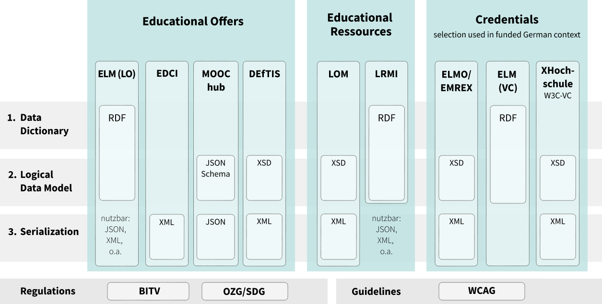
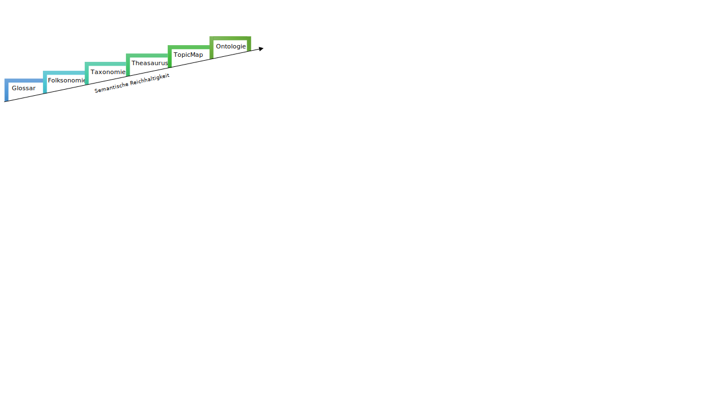
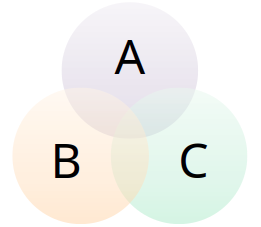
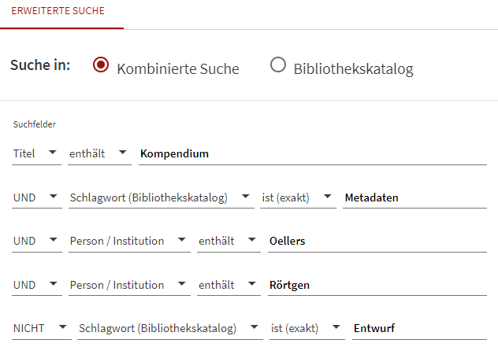
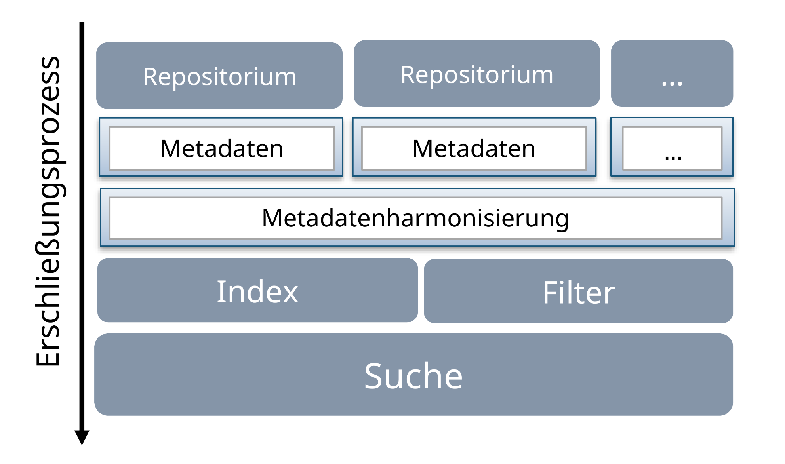

# 3 Basic technical principles of a digital education hub

When data is to be exchanged within a digital education hub, two basic technical requirements have to be met:

- **Use of standards** so that the data can be processed correctly
- **Interfaces** via which the data can be exchanged

This chapter starts by introducing metadata standards for various object types. It shows that various current standards (e.g. Europass, Learning Metadata Terms, Learning Resource Metadata Initiative) are based on semantic technologies such as the Resource Description Framework (RDF) and the Simple Knowledge Organisation Systems (SKOS)\[^7\]. These technologies are therefore covered in a separate section. We then go on to address the topics of interoperability and interfaces.

## 3.1 What metadata standards are there?

One of the first steps required when tackling the subject of metadata standards is to search for an overview of existing and established standards. In this section, we therefore list current and relevant standards for the following object types\[^8\]: learning content, learning opportunities and courses, credentials, content distribution, users, tests/quizzes and tool integrations. Standards include data models (conceptual and content-related standards, e.g. domain modelling), serialisations (structured data formats) and protocols (data exchange). A list of standards, schemas and profiles can also be found, for example, in the [Metadata Standards Catalog](https://rdamsc.bath.ac.uk/), in the [Digital Curation Centre](https://www.dcc.ac.uk/guidance/standards/metadata/list) and at [FAIRsharing.org](https://fairsharing.org/search?fairsharingRegistry=Standard).

### 3.1.1 Standards for content

Learning materials are individual objects that exist in digital or non-digital form and can be used for educational purposes. Metadata standards relating to such objects provide attributes to describe the material, for example, with regard to the subject area, target audience and other categories. In addition, these standards can also describe teaching/learning processes.

Standards:

- [Dublin Core Metadata Terms](https://www.dublincore.org/specifications/dublin-core/dcmi-terms/) (ISO 15836-1:2017/-2:2019, [RFC 5013](https://datatracker.ietf.org/doc/html/rfc5013), [ANSI/NISO Z39.85](http://groups.niso.org/higherlogic/ws/public/download/10258/Z39-85-2012_dublin_core.pdf))
- [Learning Resource Metadata Innovation](https://www.dublincore.org/groups/lrmi/) (LRMI) (DCMI, 2024)
- [Metadata for learning resources](https://www.iso.org/standard/81950.html) (ISO/IEC 19788-1)
- [Information and documentation – Records management](https://www.iso.org/standard/62542.html) (ISO 15489-1:2016)
- Educational Modelling Language (EML), in particular: EML-OU ([archive](https://web.archive.org/web/20170809144414/http://www.ifets.info/journals/10_1/21.pdf)) (Giesbers et al., 2007; Koper, 2001)
- [(IMS) Learning Resource Meta-data Specification](https://www.imsglobal.org/metadata/index.html) (1EdTech)
- [(IMS) Learning Design](https://www.imsglobal.org/learningdesign/index.html) (1EdTech)
- [Learning Object Metadata](https://ieeexplore.ieee.org/document/9262118) (LOM)\[^9\] (IEEE, 2020a)
- [Learning Metadata Terms](https://opensource.ieee.org/lmt/lmt) (LMT) (IEEE, 2024)

**Dublin Core Metadata Terms (DCMI Terms)**

- Committee standard
- Current version: [Dublin Core Metadata Terms](https://www.dublincore.org/specifications/dublin-core/dcmi-terms/)
- Publication date: 2020-01-20
- Publisher: [Dublin Core Metadata Initiative](https://www.dublincore.org/)

The earlier Dublin Core Metadata Element Set ([DCMES](https://dublincore.org/specifications/dublin-core/dces/)) and its newer version DCMI Metadata Terms ([DCMI Terms](https://www.dublincore.org/specifications/dublin-core/dcmi-terms/)) were created to describe and improve the findability of web-based resources. However, the elements are also used as a basis for metadata in other domains, for example libraries \[Haynes ([2018](#ref-haynesmimrumiu2018)), p. 51f\]. The namespace contains generic attributes that enable broad application, i.e. without being restricted to the markup of learning materials.

**Learning Resource Metadata Innovation (LRMI)**

- Committee standard
- Current version: [LRMI Terms (RDF) 2020-11-12](https://www.dublincore.org/specifications/lrmi/lrmi_terms/2020-11-12/)
- Publication date of current version: 2020-11-12
- Publisher: [Dublin Core Metadata Initiative](https://www.dublincore.org/)

The Learning Resource Metadata Innovation standard (LRMI) is devised, maintained and continuously developed by the [LRMI Task Group](https://www.dublincore.org/groups/lrmi-task-group/) as part of the Dublin Core Metadata Initiative. The group convenes on a monthly basis to discuss current developments and topics, create vocabularies and explore emerging issues. The meetings are held publicly and can be attended without prior registration. A mailing list also exists, which is used to send out information on and between the meetings.

LRMI models classes (e.g. [learning resources](https://schema.org/LearningResource)) and attributes (e.g. properties of learning resources) using the Resource Description Framework (RDF). Values that are assigned to attributes are modelled by LRMI in SKOS.\[^10\] The LRMI Task Group pursues the goal of integrating all relevant attributes and classes into schema.org. Schema.org is a solution that supports the semantic markup of web content to improve both the presentation of search results and the findability of content. This ensures that the elements employed can also be “understood” by search engines and embedded in web pages as machine-readable microdata. Microdata forms part of a process of the [WHATWG](https://html.spec.whatwg.org/#toc-microdata)\[^11\] [HTML standard](https://html.spec.whatwg.org/#toc-microdata) for embedding small, machine-readable information units (key-value pairs) in web pages as structured metadata. This enables the semantic annotation of website content via markup, e.g. using [microformats](https://microformats.org/wiki/Main_Page) or [schema.org microdata](https://web.archive.org/web/20240229212240/https://schema.org/docs/gs.html). The vocabularies of schema.org are made available as microdata and in various other formats, such as [RDFa](https://rdfa.info/) or [JSON-LD](https://json-ld.org/). The vocabulary is kept as generic as possible in order to describe general data, meaning that concrete use cases are more likely to be defined in application profiles.

\*Application profiles  
\*The LRMI standard also permits the creation of application profiles. A particular example in German-speaking countries is the “General Metadata Profile for Educational Resources” (AMB), which is also developed and maintained by the [OER metadata group](https://wiki.dnb.de/display/DINIAGKIM/OER-Metadatengruppe) of the DINI-AG-KIM:

[General Metadata Profile for Educational Resources](https://dini-ag-kim.github.io/amb/latest/) ([Git repo](https://github.com/dini-ag-kim/amb), [entry in Metadata Standards Catalog](https://rdamsc.bath.ac.uk/msc/m126)): This profile uses some attributes that require an entry from a controlled value list. Corresponding vocabularies are also maintained and published by this group.

**Educational Modelling Language (EML)**

Various languages for modelling educational materials and pedagogical scenarios can be classified as EML ([Martinez-Ortiz et al. 2007](#ref-martinez-ortizemlcihc2007)) ([Stumpp 2003, 151–53](#ref-stumppesulopb2003)). These are usually based on the generic metamodel EML-OU developed by the Open University of the Netherlands (OU). It facilitates the pedagogical modelling of learning environments by describing the embedding of resources (learning objects) in educational contexts ([Baumgartner, Häfele, and Maier-Häfele 2002, 7](#ref-baumgartnerepalmff2002)).

The model comprises teaching/learning theories, the model for learners (interactions in learning situations), content/application domains and a modularisation of the learning units. It formalises elements of learning processes, such as learning activities, roles, content and methodology. Educational scenarios can thus be modelled.

**(IMS) Learning Design (1EdTech)**

The Learning Design Framework is used to describe teaching/learning processes based on the didactic “Educational Modelling Language” (EML) ([Stracke 2007, 14](#ref-strackekrfeueiu2007)). While theoretical foundations have been defined for this ([Dalziel et al. 2016](#ref-dalzielldld2016)), they have not yet resulted in any further development of the standard.

Related: didactic design patterns \[Kohls and Wedekind ([2008](#ref-kohlsdeelmdp2008))\] \[Rensing ([2013](#ref-rensingsflulmiubl2013))\] (see also [PatternPool](https://www.patternpool.de/finden/)), process-oriented didactic-methodical scenarios (templates), best practices (methodical structures)

**Learning Object Metadata (LOM)**

- Committee standard
- Current version: [1484.12.1-2020 – IEEE Standard for Learning Object Metadata](https://ieeexplore.ieee.org/document/9262118)
- Publication date of current version: 2020
- Publisher: IEEE

The aim of this standard is to describe resources that are used for teaching and learning purposes. The standard was developed by the standards committee of the [Institute of Electrical and Electronics Engineers](https://en.wikipedia.org/wiki/Institute_of_Electrical_and_Electronics_Engineers) (IEEE). The standard is not openly available from IEEE, but instead requires a corresponding subscription. However, application profiles can be created from the standard and made openly available. To ensure compatibility with LOM Core, application profiles can add attributes and make optional attributes mandatory, but must never declare mandatory attributes as optional. Internationally, an unfinished [list of application profiles](https://en.wikipedia.org/wiki/Learning_object_metadata#Application_profiles) is available along with the Educational Metadata Profile (EMP) (Solomou et al., 2015). In German-speaking countries, the LOM-DE profile ([archive](https://www.bildungsserver.de/elixier/)) was developed in the context of the German Education Server and [ELIXIER](https://www.bildungsserver.de/elixier/). However, a finalised version of the profile has not been published \[Menzel ([2023](#ref-menzeldmpheor2023)), p. 265\], and little is known about its practical usage and distribution.

Two application profiles are particularly significant in German-speaking countries:

- [LOM-CH](https://www.educa.ch/de/taetigkeiten/online-dienste/lom-ch): the Swiss application profile of LOM. In particular, LOM-CH includes attributes that enable linking to regional-language and level-specific curricula.
- [LOM for Higher Education OER Repositories](https://w3id.org/kim/hs-oer-lom-profil/latest/): application profile developed as part of the [OER metadata group](https://wiki.dnb.de/display/DINIAGKIM/OER-Metadatengruppe) of the DINI-AG-KIM. This profile is used by various German universities to exchange data between repositories. For certain attributes, e.g. for specifying the “learningresourcetype”, this application profile requires defined values from “[Higher Education Resource Types](https://w3id.org/kim/hcrt/scheme)”, a vocabulary modelled with SKOS.

The LOM-based exchange of data between systems usually employs the [OAI-PMH](https://en.wikipedia.org/wiki/OAI-PMH) protocol.

While LOM has been subject to criticism due to its great complexity ([Barker and Campbell 2010](#ref-barkermlmoescd2010)) ([Neumann 2013](#ref-neumannoero2013)), Pawlowski (2001) adds that the standard lacks essential didactic attributes for practical applications, including effective identification of the suitability of resources for specific didactic methods, pedagogical planning details (communication structure, evaluation, etc.) ([Pawlowski 2001, 107](#ref-pawlowskieevzecl2001)) and information on didactic-methodical decisions ([Arnold, Kilian, and Thillosen 2003, 382](#ref-arnoldpmieapuefbvf2003)). From this perspective, LOM places greater emphasis on the specific content than on the relevant methods and underlying didactic principles.

Note: The 1EdTech Consortium (formerly IMS Global) played a key role in developing LOM and remains heavily involved to this day. While there were some discrepancies in version 1.2 of the IMS model, these have since been rectified.

**Learning Metadata Terms (LMT)**

- Committee standard
- Latest draft: [https://opensource.ieee.org/lmt/lmt](https://opensource.ieee.org/lmt/lmt/)
- Publication date of current version: 2020
- Publisher: IEEE

IEEE set up the [P2881 working group](https://development.standards.ieee.org/myproject-web/public/view.html#pardetail/8290) with the aim of developing a successor to LOM. Despite being well known and widely adopted, IEEE considers LOM to be outdated \[IEEE ([2020](#ref-ieeeppd2020))\]. The INVITE project comes to a similar conclusion in this regard \[Goertz et al. ([2023](#ref-goertzmiiiwswfwzebimudirii2023)), p. 7\]. In particular, the taxonomies used in LOM are seen as outdated. In addition, new metadata concepts have since been devised that should be included in the subsequent standard \[IEEE ([2020](#ref-ieeeppd2020))\]. The working group made a first [draft](https://opensource.ieee.org/lmt/lmt/-/tree/main) available for public comment at the end of 2023. It is clear from this draft that RDF is now also used as the basic data model. In addition, the set of attributes has been greatly reduced, with many attributes from LRMI and schema.org being reused.

*Communities of practice* are encouraged to create their own application profiles and extend the basic schema. Another significant enhancement is that the standard can also be used to describe *learning events* that relate to a learning activity or experience. Such a learning event is *ephemeral* and, in the current draft version, has a start and end date as well as a duration. In other contexts, learning events are described with extensive metadata (cf. learning analytics and standards such as xAPI, cmi5, [1EdTech Caliper Analytics](https://www.1edtech.org/standards/caliper)), which also offers relevant didactic functions for both teachers and learners.

Overall, this development follows the trend of basing metadata standards on the RDF data model, as was also demonstrated in the recent revision of the Europass schema (see below).

**Excursus: libraries**

The standards and data models used in the library world include Machine-Readable Cataloging 21 (MARC 21), Encoded Archival Description (EAD), Metadata Object Description Schema (MODS), Metadata Authority Description Standard (MADS), Metadata Encoding and Transmission Standard (METS), Preservation Metadata: Implementation Strategies (PREMIS), Publishing Requirements for Industry Standard Metadata (PRISM), Online Information eXchange (ONIX), [BIBFRAME](https://www.dnb.de/DE/Professionell/ProjekteKooperationen/Projekte/BIBFRAME/bibframe_node.html), IFLA Library Reference Model (LRM), Resource Description and Access ([RDA](https://www.dnb.de/DE/Professionell/Standardisierung/Standards/_content/rda.html?nn=58044)) and [Bib Extend](https://www.w3.org/community/schemabibex/wiki/Main_Page) (W3C, schema.org) \[Haynes ([2018](#ref-haynesmimrumiu2018)), p. 54-62\]. The German National Library, for instance, uses a [Creative Commons Zero](https://creativecommons.org/publicdomain/zero/1.0/deed.de) license to make data available in a number of export formats and serialisations via various delivery channels (e.g. OAI-PMH). These include: MARC 21, RDF/XML, RDF/JSON-LD, RDF/Turtle, HDT, N-Triples, CSV, DNB Casual; MODS-xml, PDF and PicaPlus/XML \[DNB ([2023](#ref-dnbbue2023))\].

Examples of controlled vocabularies: [list from the Library of Congress](https://web.archive.org/web/20240301135921/https://www.loc.gov/librarians/controlled-vocabularies/).

**Summary and outlook**

While LOM is widely adopted, we are increasingly witnessing the establishment (or development) of standards that ensure a better semantic representation of structures, for example, by building on the RDF data model. This enables the implementation of technologies that form inferences between the various structures, e.g. [semantic reasoners](https://en.wikipedia.org/wiki/Semantic_reasoner).

Examples of metadata profiles in the context of repositories for describing and exchanging digital teaching and learning resources (see table “LOM-based profiles” and table “LRMI-based profiles, compatible with Linked (Open) Data”).

Table: *LOM-based profiles*

<table style="width:100%;">

<colgroup>

<col style="width: 52%" />

<col style="width: 21%" />

<col style="width: 26%" />

</colgroup>

<thead>

<tr class="header">

<th>

Designation
</th>

<th>

Context
</th>

<th>

References
</th>

</tr>

</thead>

<tbody>

<tr class="odd">

<td>

<a
href="https://www.educa.ch/de/taetigkeiten/online-dienste/lom-ch">LOM-CH</a> (<a
href="https://web.archive.org/web/20240226225633/https://www.educa.ch/sites/default/files/2020-11/applikationsprofil-lom-ch-v2.1-de.pdf">archive</a>)
</td>

<td>

Different areas of education
</td>

<td>

<a
href="https://joinup.ec.europa.eu/collection/eu-semantic-interoperability-catalogue/solution/eun-learning-resource-exchange-metadata-application-profile">EUN</a>
</td>

</tr>

<tr class="even">

<td>

LOM for Higher Education (<a
href="https://w3id.org/kim/hs-oer-lom-profil/latest/">HS-OER-LOM</a>) (<a
href="https://github.com/dini-ag-kim/hs-oer-lom-profil/">repo</a>)
</td>

<td>

Higher education
</td>

<td>

XML, XSD
</td>

</tr>

<tr class="odd">

<td>

<a
href="https://web.archive.org/web/20240227154209/http://agmud.de/eaf-erweitertes-austauschformat/">LOM-EAF</a> (<a
href="https://web.archive.org/web/20220120184549/https://sodis.de/lom-eaf/LOM-EAF_v0.3.pdf">archive</a>)
</td>

<td>

Media centres
</td>

<td>

XML, XSD
</td>

</tr>

<tr class="even">

<td>

<a href="https://edoc.hu-berlin.de/handle/18452/2133">ELAN</a> (DINI & ELAN, 2005) (<a
href="https://web.archive.org/web/20240227144518/https://edoc.hu-berlin.de/bitstream/handle/18452/2133/6-de.pdf">archive</a>)
</td>

<td>

Higher education
</td>

<td>

Z39.50, OAI-PMH, XML
</td>

</tr>

</tbody>

</table>

Table: *LRMI-based profiles, compatible with Linked (Open) Data*

<table>

<colgroup>

<col style="width: 52%" />

<col style="width: 20%" />

<col style="width: 26%" />

</colgroup>

<thead>

<tr class="header">

<th>

Designation
</th>

<th>

Context
</th>

<th>

References
</th>

</tr>

</thead>

<tbody>

<tr class="odd">

<td>

General Metadata Profile for Educational Resources (<a
href="https://w3id.org/kim/amb/latest/">AMB</a>) (<a
href="https://github.com/dini-ag-kim/amb">repo</a>)
</td>

<td>

Different areas of education
</td>

<td>

schema.org, SKOS, JSON Schema, JSON-LD
</td>

</tr>

<tr class="even">

<td>

Learning Metadata Terms (LMT) (<a
href="https://opensource.ieee.org/lmt/lmt">repo</a>)
</td>

<td>

Different areas of education
</td>

<td>

LRMI, schema.org, SKOS
</td>

</tr>

</tbody>

</table>

### 3.1.2 Standards for courses and learning opportunities

Courses (educational offerings) are structured, thematically focused learning opportunities. They can have a specific start and end date, or they can be completed by users themselves at a time of their choosing. They often consist of a range of materials, such as videos, handouts or worksheets, which must be completed in a specific order. A certificate (*credential*) may be awarded upon completion of a course.

Standards:

- MOOChub
- Europass Learning Model (ELM)
- Data Exchange for Training Information Systems (DEfTIS)

**MOOChub**

- Committee standard
- Current version: MOOChub schema ([repo](https://github.com/MOOChub/schema))
- Publication date: 2020
- Publisher: MOOChub

The specification is used to exchange course data (MOOCs) between the [MOOChub](https://moochub.org/) members \[Ebner et al. ([2023](#ref-ebnermiemmip2023))\]. The specification builds on the [work](https://github.com/openHPI/mooc-standards) completed by the openHPI team. A JSON schema is available that allows information about the courses and the organisations providing them to be shared along with other data. The number of mandatory attributes was deliberately kept to a minimum so that new parties can easily get to grips with the schema. As of v3, the specification also supports information in multiple languages. In addition to the JSON schema, an API specification is also provided. It is used to describe the interface via which the data can be accessed.

**European Learning Model (ELM)**

- Committee standard
- Current version: [European Learning Model v3](https://github.com/european-commission-empl/European-Learning-Model)
- Publication date: 2023 (v3), archived since February 2024
- Publisher: European Commission

The “European Learning Model” represents a further development of the data model created as part of the European Digital Credentials Infrastructure (EDCI). It supports the uniform mapping and presentation of credentials, learning opportunities and qualifications. The model is based on and expands the W3C Verifiable Credentials Data Model. The data format uses XML/XSD and is aligned with the ELMO and EMREX standards.

The standard has since been revised, with version 3 published in April 2023. Any further development of the standard currently appears unlikely, as the project was designated as archived in February 2024. The current version uses RDF as a data model. ELM is based on the W3C Verifiable Credentials Data Model and also concerns the mapping of “learning opportunities”. The standard thus represents a data model for describing the following concepts:

- Verifiable credentials
- Verifiable presentation
- Learning opportunity

**Data Exchange for Training Information Systems (DEfTIS)**

- Specification (PAS-DIN) (PAS = Publicly Available Specification)

- Current version: [DIN PAS 1045](https://www.iwwb.de/information/DIN-PAS-1045-Weiterbildungsdatenbanken-und-Weiterbildungsinformationssysteme-Inhaltliche-Merkmale-und-Formate-zum-Datenaustausch-weiterbildung-55.html)

- Publication date: 2002, as DIN since 2004

- Publisher: [InfoWeb Weiterbildung](https://www.iwwb.de/kurssuche/startseite.html)

The standard has been developed since 2002 as part of [DIN PAS 1045](https://www.iwwb.de/information/DIN-PAS-1045-Weiterbildungsdatenbanken-und-Weiterbildungsinformationssysteme-Inhaltliche-Merkmale-und-Formate-zum-Datenaustausch-weiterbildung-55.html) in collaboration with the [InfoWeb Weiterbildung](https://www.iwwb.de/kurssuche/startseite.html) (IWWB) project (funded by the BMBF). The publicly available standard includes an XML specification for mapping information content from further education databases. Version 5.07 of the [technical specification](https://web.archive.org/web/20231226234408/https://projekt.iwwb-files.de/PAS/DEfTIS_zu_PAS1045_Ver_5_07.pdf) was published in 2007. XSD files for validation can also be found [here](https://web.archive.org/web/20240118011347/https://www.iwwb.de/information/DIN-PAS-1045-Weiterbildungsdatenbanken-und-Weiterbildungsinformationssysteme-Inhaltliche-Merkmale-und-Formate-zum-Datenaustausch-weiterbildung-55.html). As at 2011, recommendations from numerous further education portals have been implemented \[IWWB - InfoWeb Weiterbildung ([2023](#ref-iwwb-infowebweiterbildungdp1wuwimufd2023))\]. An [Excel table](https://web.archive.org/web/20160325075633/http://projekt.iwwb-files.de/AG_Infostandards/Empfehlungen%20zu%20Inhalten%20von%20Weiterbildungsdatenbanken%20-%20Version%201_4.xls) containing recommendations regarding the significance of the individual elements can be found on the same page.

### 3.1.3 Standards for credentials

To allow learners to submit their certificates and educational qualifications to other institutions or bodies both securely and efficiently, suitable standards and infrastructures are required to enable this exchange of data. As a result, a number of standards have been established at international and European level.

Standards:

- European Learning Model (ELM) (see above)
- Europass Digital Credentials Infrastructure (EDCI)
- ELMO and EMREX
- Credential Transparency Description Language (CTDL)
- Verifiable Credentials Data Model (VC, W3C)
- Hochschulforum Digitalisierung certificates ([HFDcert](https://hfdnetzwerk.de/hfdcert))
- Open Badges

\*\*  
Europass Digital Credentials Infrastructure (EDCI)\*\*

*Qualification Dataset Register ([QDR](https://europa.eu/europass/de/stakeholders/qdr/documentlibrary))*

- Application profile for accreditation (EDC)
- Application profile for learning opportunities and qualifications (LOQ)

**ELMO and EMREX**

- Committee standard
- Current version: [Technical Guide](https://github.com/emrex-eu/standard/blob/master/binary/Technical-Guide-to-EMREX.pdf)
- Publication date: 2015
- Publisher: EMREX user group
- Links:
  - [EMREX glossary](https://github.com/emrex-eu/glossary)
  - [EMREX.eu](https://emrex.eu/)

EMREX is a procedure for the electronic exchange of student data between universities and potential employers. ELMO represents the underlying data model in this exchange. Originally the result of an EU project, EMREX has been self-sustaining since the funding phase. The European Learning Model (ELM) is aligned with the ELMO model. The standard is XML-based. Ongoing development takes place within the EMREX user group. The project aims to promote the implementation of two CEN standards:

- EN 15981 European Learner Mobility – Achievement information \[EuroLMAI\]
- EN 15982 Metadata for Learning Opportunities – Advertising \[MLO-AD\]

ELMO is an XML format that supports assessment information in diplomas, transcripts of records and diploma supplements. It also includes descriptions of the qualifications, programmes, courses and modules for these assessments. This information is needed in admission and recognition procedures.

The model’s distribution and use within Europe varies greatly. While it has been widely adopted in some countries (Netherlands, Norway, Finland), only a limited number of institutions are participating in other countries (Germany, Italy, Denmark).

Although the European Commission has stated that ELMO and Europass Learning Model (ELM) standards are coordinated with one another, the question remains of how both will coexist in the future.

**Verifiable credentials**

- Committee standard
- Current version: [specification](https://www.w3.org/TR/vc-data-model/)
- Publication date: 2019
- Publisher: W3C

The “Verifiable Credentials” standard concerns the mapping and presentation of certificates and credentials. The term “credential”, in this case, must be interpreted broadly and can apply as much to a passport or driver’s license as it can to a school report or university certificate.

The use of digital signatures ensures protection of credentials and provides tamper-evident proof of their existence. Three types of entities are defined within the standard:

- Issuer: The issuer is responsible for issuing and digitally signing the credentials, which are then transferred to the holder.
- Holder: The holder receives their credentials and stores them. They can then compile their credentials to present them to a person or organisation, i.e. the verifier.
- Verifier: The verifier can verify the authenticity of the certificates based on the contained information provided by the issuer or by means of a verifiable data registry.

The European Learning Model (ELM) [builds on and expands this standard](https://github.com/european-commission-empl/European-Learning-Model/#alignment-with-other-standards). The data model uses RDF and thus does not require a specific serialisation format. The standard includes examples that use JSON-(LD), though [other serialisation formats (e.g. XML, YAML, CBOR) are also possible](https://www.w3.org/TR/vc-data-model/#syntaxes).

**Open Badges**

- Committee standard
- Current version: [current specification](https://www.imsglobal.org/spec/ob/v2p1)
- Publication date: 2011; version 2.1 was published in 2019
- Publisher: 1EdTech

The “Open Badges” standard was originally developed by the Mozilla Foundation as a means of issuing digital certificates. The certificates are embedded in image files as metadata, thus allowing them to be placed and read anywhere on the web. The Open Badge contains the relevant information about the issuer, the recipient and the certificate itself. Since version 1.1, JSON-LD has been used to represent the Open Badge data. Open Badges can also be easily extended by means of “extensions”.

To ensure compatibility with xAPI, a [vocabulary](https://web.archive.org/web/20160412151300/https://openbadgespec.org/xapi/) has been developed to allow Open Badges to be integrated into xAPI activity streams. The process for acquiring an Open Badge can thus be defined in xAPI. However, the vocabulary is in the draft stage and its current status is unclear.

1EdTech has since assumed responsibility for the ongoing development of the Open Badge standard. Open Badges can be used in the learning systems Moodle, Mahara and ILIAS.

Other example implementations of Open Badges:

- OpenVM, BeuthBonus, pMOOCs, INTEGRAL \[Buchem, Orr, and Brunn ([2019](#ref-buchemksmmobahcwgk2019))\]
- kosLearningLab based on DigCompEdu \[Keindorf et al. ([2021](#ref-keindorfkfladke2021))\]

### 3.1.4 Standards for the distribution of content

These standards describe means of packaging learning materials or entire courses and making them available in other learning management systems (LMS). Furthermore, these standards define how user activities are reported in a uniform manner within an LMS. Therefore, the standards can be used to prevent vendor lock-ins on specific LMS. They also allow information to be collected regarding the learning activities of system users (learning analytics). In addition, the standards are particularly relevant for authoring tools and ensure that the created resources can be shared and used across different LMS.

Standards:

- Aviation Industry Computer-Based Training Committee (AICC)
- Shareable Content Object Reference Model (SCORM) \[ADL; IEEE\]
- Experience API (xAPI)
- cmi5: an xAPI profile
- (IMS) Content Packaging (CP) \[1EdTech\]
- (IMS) Common Cartridge (CC) \[1EdTech\]
- (IMS) Simple Sequencing (SSQ) \[1EdTech\]

**Aviation Industry Computer-Based Training Committee (AICC)**

- Publisher: Aviation Industry Computer-Based Training Committee
- Publication date: 1988

This early e-learning standard enables the integration of content into learning management systems. It paved the way for standards such as SCORM (see below). In 2014, the [AICC committee dissolved](https://www.docebo.com/glossary/aicc/) due to a lack of members.

**Shareable Content Object Reference Model (SCORM)**

- Committee standard
- Current version: [https://adlnet.gov/projects/scorm](https://adlnet.gov/projects/scorm/)
- Publication date: 2000 (1.0), most recent 4th edition published in 2009
- Publisher: Advanced Distributed Learning Initiative (ADL)

The “Shareable Content Object Reference Model” (SCORM) describes a standard for sharing units of learning materials across different systems in a compatible manner. It thus represents a packaging format, but also serves as a data exchange format that communicates with the LMS at runtime and describes which data it wants to receive from or send to the LMS. SCORM is a “reference model” because it does not itself constitute a standard but is instead based on a range of established standards (e.g. LOM, QTI). SCORM thus describes how these individual standards can be used in combination. xAPI is considered the successor to SCORM since it enables more flexible tracking and does not require SCORM’s runtime component.

**Note:** Although several successors to SCORM 1.2 already exist, it still remains the most widely used model and should therefore be supported by e-learning providers. See also: appendix “Comparison of e-learning standards for content distribution”.

**Experience API (xAPI)**

- Committee standard (IEEE, [P92741.1 xAPI Work Group](https://sagroups.ieee.org/9274-1-1/))
- Current version: [IEEE 9274.1.1-2023](https://standards.ieee.org/ieee/9274.1.1/7321/) ([repo](https://github.com/adlnet/xAPI-Spec)) ([IEEE repo](https://opensource.ieee.org/xapi))
- Publication date: 2013, updated by IEEE in 2020
- Publisher: Advanced Distributed Learning Initiative (ADL), Rustici Software, IEEE
- Links: [ADLnet xAPI](https://adlnet.gov/projects/xapi/), [xAPI overview](https://xapi.com/overview/)

The xAPI standard defines the communication between learning management systems (LMS) and learning content. The implementation of the standard allows learning content to be imported or exported to and from different LMS. xAPI facilitates the collection of a wide variety of learning activity data. This data is stored in a Learning Record Store (LRS), the structure of which is also defined in the standard. xAPI is considered the successor to SCORM, with xAPI being able to collect extensive information on learning activities in a more flexible manner, including in offline learning situations. xAPI uses standard REST interfaces and JSON as a data format. xAPI profiles can be created and used to define shared vocabularies, which ensure that different systems can interpret data in the same way. An excellent example for the usage of vocabularies is cmi5, which aims to accelerate the adoption of xAPI by implementing controlled vocabularies.

Registries (profiles, vocabularies):

- TinCan Registry: [https://registry.tincanapi.com](https://registry.tincanapi.com/)
- xAPI Profile Server: [https://profiles.adlnet.gov](https://profiles.adlnet.gov/)
- Common Education Data Standards: [Learner Action Type](https://ceds.ed.gov/element/000934)

Metrics and indicators: [OpenLAIR EduTec Tool](https://edutec-tool.github.io)

**cmi5: an xAPI profile**

- Industry standard
- Current version: [cmi5 Project](https://aicc.github.io/CMI-5_Spec_Current/) ([repo](https://github.com/AICC/CMI-5_Spec_Current))
- Publication date: 2018
- Publisher: Advanced Distributed Learning Initiative (ADL), Rustici Software
- Links: [xAPI.com/cmi5](http://xapi.com/cmi5), [ADLnet.gov cmi5](https://adlnet.gov/projects/cmi5-specification/)

“cmi5” is an xAPI profile that aims to bridge the gap between xAPI and SCORM. This is achieved by defining interoperability rules regarding content retrieval, authorisation, data reporting and course structures. Fundamentally, the LMS is provided with the rules for processing and reporting xAPI data.

**(IMS) Content Packaging (CP)**

- Committee standard
- Current version: [Content Packaging Specification](http://www.imsglobal.org/content/packaging/index.html) (IEEE LTSC P1484.17)
- Publication date: 2001, last version (v1.1.2, 2004; v1.2 Public Draft v2.0, 2007)
- Publisher: 1EdTech

Content Packaging describes a data format for e-learning that standardises the structure of materials to ensure interoperability between learning systems. The standard defines import and export functions for exchanging material. The standard was adapted in SCORM.

**(IMS) Common Cartridge (CC)**

- Committee standard
- Current version: [Common Cartridge Specification](https://www.imsglobal.org/cc/index.html)
- Publication date: 2009, v1.3 2013 and Common Cartridge Profile 2015
- Publisher: 1EdTech
- Links:
  - [Common Cartridge (CC)](https://www.imsglobal.org/activity/common-cartridge) @ IMS Global
  - [What is the Common Cartridge standard?](https://ed.link/community/common-cartridge/)

Common Cartridge is a set of standards developed by 1EdTech (formerly IMS Global) to enable interoperability of content in different systems (LMS). The format is extremely flexible and supports the description and porting of activities and tests, digital content, courses and other elements. For the specific context and differences to SCORM, see below.

**(IMS) Simple Sequencing Specification (SSQ)**

- Committee standard
- Current version: [Simple Sequencing Specification](https://www.imsglobal.org/simplesequencing/index.html) ([archive](https://web.archive.org/web/20231210144921/https://www.imsglobal.org/simplesequencing/index.html))
- Publication date: 2003 (v. 1.0)
- Publisher: 1EdTech

This standard defines the sequencing of learning experiences to ensure consistency across different platforms. SCORM (version 2004) is derived from this standard (further details: [scorm.com/scorm-explained/technical-scorm/sequencing](https://web.archive.org/web/20231207143333/https://scorm.com/scorm-explained/technical-scorm/sequencing/)).

### 3.1.5 Standards for users

As well as learning content, the learners themselves are particularly relevant. The profiles of learners and their transferability between systems are crucial for the realisation of personalised learning content and paths, meaning that a need for standardisation also exists in this area.

Standards:

- XBildung (XHochschule, XSchule, XBerufsbildung)
- Ed-Fi Core Student API
- Public and Private Information (PAPI) \[IEEE\]
- (IMS) Learner Information Package (1EdTech)

**XBildung**

- State standard
- Current version: [XBildung](https://www.xbildung.de/)
- Publication date: 2020, continuously updated
- Publisher: federal state of Saxony-Anhalt

Exchanging data between management systems requires the data in the different systems to be compatible. The aim of the XBildung project is to define a uniform standard to support the implementation of the German Online Access Act (OZG).

XBildung is a comprehensive data exchange standard for the education sector. The standard serves to enable the standardised exchange of electronic data between stakeholders in the education sector, thereby ensuring faster procedures. XBildung takes into account the requirements of the Online Access Act (OZG) and the Single Digital Gateway (SDG). In addition, the standard is being developed in continuous exchange with committees for ELMO/EMREX and the Europass Learning Model. XSchule and XHochschule are two specialised modules of the basic module XBildung. The specifications are openly available, and comments and requests can be submitted on GitHub.

**Ed-Fi Core Student API**

This standard describes an interface for the data of students in K-12 education. This also includes data relating to student performance. The data model is based on the Ed-Fi Unifying Data Model (UDM).

** **

 

**Public and Private Information (PAPI) \[IEEE\]**

- Publication date: 2000

The aim of this standard is to describe various categories of learners so that, for example, individual learning profiles and preferences (learning style, learning location, available technology) as well as the learning outcomes (portfolio) of learners can be exchanged and made available in learning environments ([Pawlowski 2001, 107f](#ref-pawlowskieevzecl2001)). The process of transferring between education providers can thus be standardised, which makes it easier for individuals to exercise their rights, such as the right to data portability in accordance with Art. 20 GDPR. While the standard enables the personalisation of learning environments and processes as well as the reuse of learning and performance data across different courses and resources, it also raises similar data protection issues ([Baumgartner, Häfele, and Maier-Häfele 2002](#ref-baumgartnerepalmff2002)), to approaches for implementing learning analytics.

**(IMS) Learner Information Package (1EdTech)**

- Publication date: 2003

This standard is based on PAPI and defines the basic model of a learner. The standard describes characteristics of learners, such as demographic data, qualifications, (learning) goals, competencies and accessibility (language skills, disabilities and learning preferences – specifically cognitive, physical and technological preferences).

### 3.1.6 Standards for tests and quizzes

A range of standards have been developed to ensure the portability of tests and quizzes (“*assessments*”) between different systems. In this case, the use of standards can once again prevent vendor lock-ins.

Standards:

- bitmark
- (IMS) Question and Test Interoperability (QTI) \[1EdTech\]
- Accessible Portable Item Protocol (APIP)

**bitmark**

- Industry standard
- Current version: [https://docs.bitmark.cloud](https://docs.bitmark.cloud/)
- Publication date: 2020
- Publisher: [bitmark Association](https://www.bitmark-association.org/)

[According to bitmark](https://docs.bitmark.cloud/), its standard is sometimes described as a “content- and mobile-first standard for digital and interactive textbooks”. The standard defines a JSON-based data model as well as the bitmark markup language. Based on the need to digitize textbooks and make them interactive, bitmark developed a standard to support the digital representation of content and quizzes. In this case, the visual representation of the content is strictly separated from the modelling level. Development of the standard is [supported by Cornelsen](https://www.bitmark-association.org/blog/why-we-need-open-standards-to-enable-successful-digital-teaching), among others.

**(IMS) Question and Test Interoperability (QTI) \[1EdTech\]**

- Committee standard
- Current version: <http://www.imsproject.org/question/index.html>
- Publication date: 1999, latest version (v3.0) released in 2020
- Publisher: 1EdTech

1EdTech Question and Test Interoperability is a 1EdTech specification that defines a data format for using tests and assessments in different LMS or other applications. The test content and formats as well as the corresponding answers can be stored along with the relevant marking scheme. In the current version 3.0, the work of QTI and APIP has been merged so that accessibility components are now also implemented in QTI.

**Accessible Portable Item Protocol (APIP)**

- Committee standard
- Current version: http://www.imsglobal.org/apip/index.html
- Publication date: 2014
- Publisher: 1EdTech

The Accessible Portable Item Protocol (APIP) is a standard of the 1EdTech consortium and concerns the exchange and interoperability of test objects between different systems. The standard is based on QTI. In addition to QTI, APIP defines “access features” to make the test objects accessible for students with a variety of disabilities and special needs. In the current release of QTI (version 3.0), the work of QTI and APIP has been merged so that accessibility components are now also implemented in QTI.

### 3.1.7 Standards for tool integration

The LTI standard can be used to ensure seamless interoperability between tools and services. It also allows information such as achieved scores to be transferred from one system to another for subsequent reuse.

Standards:

- Learning Tools Interoperability (LTI) \[1EdTech\]

**Learning Tools Interoperability (LTI)**

- Committee standard
- Current version: <https://www.imsglobal.org/activity/learning-tools-interoperability>
- Publication date: 2010, current version 1.3 released in 2019
- Publisher: 1EdTech

Learning Tools Interoperability (LTI) is a standard developed by 1EdTech (formerly IMS Global). LTI allows external tools to be connected to an LMS so that users do not have to log into each individual tool. The standard ensures secure data exchange, which can be used, for example, to transmit the scores achieved in a particular tool back to the LMS. A peculiarity in the versioning of the standard is that v1.3 is the current version even though v2.0 was also released.

 Figure: *Application areas of different metadata standards* \[Rörtgen et al. ([2023](#ref-rortgenmsneidectea2023)), p. 147\]

## 3.2 What is Linked Data and the Resource Description Framework?

<table>

<colgroup>

<col style="width: 6%" />

<col style="width: 93%" />

</colgroup>

<tbody>

<tr class="odd">

<td>

❓
</td>

<td>

<strong>Questions</strong>
</td>

</tr>

<tr class="even">

<td>

</td>

<td>

<ul>

<li>

What is Linked Data and the Resource Description Framework?

</li>

<li>

What are the benefits of these technologies?

</li>

</ul>

</td>

</tr>

</tbody>

</table>

In the preceding sections, we have frequently referred to “Linked Data” and the “Resource Description Framework (RDF)”. The use of these technologies and standards promotes the interoperability of metadata and, consequently, its distribution and acceptance ([Zeng and Chan 2009](#ref-zengsi2009)). This leads not only to harmonisation but also to desirable synergy effects within the market ([Golub et al. 2014](#ref-golubtrkosfua2014)). Since these technologies are clearly playing an increasingly important role in metadata standards, we will explain them briefly below.

**Linked Data**

Linked Data is a concept in Semantic Web technology that aims to structure and link data such that it can be more easily read and understood by machines. It is based on the principle that data is interconnected by links, similar to hyperlinks on the World Wide Web. These links allow complex relationships to be established between different data sets and presented in a way that is understandable to both humans and machines.

One of the key features of Linked Data is the use of URIs (Uniform Resource Identifiers) to uniquely identify resources. Each resource in a Linked Data set has a unique URI that is used as a link to connect it to other resources. This enables the merging and integration of data from different sources without necessitating any changes to the original data.

When it comes to implementing Linked Data, the Resource Description Framework (RDF) is frequently employed to describe data in a structured form. RDF is a language that allows information about resources to be stored in a machine-readable format. RDF allows data to be represented as subject-predicate-object triplets, which facilitates the modelling of relationships between different data points (see below).

Tim Berners-Lee formulates four basic principles of Linked Data:

1.  Use URIs (Uniform Resource Identifiers) to uniquely identify resources
2.  Use HTTP URIs to make the information accessible
3.  Present this information using the relevant standards (RDF, SPARQL)
4.  Use HTTP URIs to interlink different data sets and improve the findability of data \[Berners-Lee ([2006](#ref-berners-leelddi2006))\]

The choice of metadata standards is crucial when it comes to adapting the Linked (Open) Data principles ([Berners-Lee 2006](#ref-berners-leelddi2006)) ([Bizer et al. 2008](#ref-bizerldwl2008)) ([Petz 2023](#ref-petzlodzs2023)). Taking these principles into account allows resources and services to be interlinked and recurring challenges to be addressed. This includes:

- Integration and interconnection of resources from distributed systems, such as heterogeneous datasets from repositories
- Mapping of resource life cycles, for example, anticipated frequent changes, particularly in the context of open educational practices (OEP)
- Exchange and harmonisation of metadata through mapping in ETL processes
- Establishment of controlled vocabularies to standardise semantics
- Automated enrichment of resources with metadata to support contextualisation

Properties of Linked Data with regard to digital objects:

- Unique, citable and stable referencing \[Petz ([2023](#ref-petzlodzs2023))\]
- Vocabularies that contain attributes of the objects \[Petz ([2023](#ref-petzlodzs2023))\]

**Resource Description Framework**

The Resource Description Framework (RDF) is a data model that was created by the World Wide Web Consortium (W3C) as a standard for describing data on the web, for example, using [RDFa](https://rdfa.info/), [JSON-LD](https://json-ld.org/) or [Turtle](https://www.w3.org/TR/turtle/). It allows metadata to be made available in a manner that is understandable to both humans and machines. This approach is compatible with Linked (Open) Data principles (see above), which use RDF to publish structured metadata and thus link different resources and data sources while also enriching these resources with further metadata \[Bizer et al. ([2008](#ref-bizerldwl2008))\] \[Dietze et al. ([2013](#ref-dietzeierwdsca2013))\]. A particular benefit of the RDF approach is that it uses unique and persistent Uniform Resource Identifiers (URIs, such as URLs) to identify resources. These URIs can be referenced as globally unique identifiers, even in distributed systems. RDF is used to model data and possible statements about this data \[W3C ([2024a](#ref-w3crcas2024))\] \[W3C ([2024b](#ref-w3crs2024))\]. In the RDF model, each statement consists of three components: subject, predicate and object \[Pomerantz ([2015](#ref-pomerantzm2015)), p. 140f\]. A particular feature of RDF, and also the characteristic of the model’s reference to the web, is that the subject (resource), predicate (attribute) and object (attribute value) are represented by URIs. The object can also appear as a “literal”, which can have a character string (e.g. “Alice”) or a number (e.g. “42”) as its value.

Table: *Example of a statement in the RDF model*

<table>

<colgroup>

<col style="width: 23%" />

<col style="width: 76%" />

</colgroup>

<tbody>

<tr class="odd">

<td>

<strong>Statements</strong>
</td>

<td>

<strong>RDF triple</strong> <a href="#fn1" class="footnote-ref"
id="fnref1" role="doc-noteref">1</a>
</td>

</tr>

<tr class="even">

<td>

<strong>My pet  is  a dog.</strong>
</td>

<td>

<strong>http://example.org/my_dog  <a
href="http://www.w3.org/1999/02/22-rdf-syntax-ns#type">http://www.w3.org/1999/02/22-rdf-syntax-ns#type</a>  <a
href="https://www.wikidata.org/entity/Q144">https://www.wikidata.org/entity/Q144</a>.</strong>
</td>

</tr>

<tr class="odd">

<td>

<strong>My pet  has the name  Lica.</strong>
</td>

<td>

<strong>http://example.org/my_dog  <a href="http://schema.org/name">http://schema.org/name</a>  "Lica".</strong>
</td>

</tr>

<tr class="even">

<td>

<strong>My pet  knows  Bella.</strong>
</td>

<td>

<strong>http://example.org/my_dog  <a
href="http://xmlns.com/foaf/spec/#term_knows">http://xmlns.com/foaf/spec/#term_knows</a> http://example.org/neighboursDog.</strong>
</td>

</tr>

</tbody>

</table>

<aside id="footnotes" class="footnotes footnotes-end-of-document" role="doc-endnotes">

<ol>

<li id="fn1">

The above "example.org" URIs do not resolve since they merely represent examples. The other URIs, however, do resolve and provide useful information such as definitions, examples and further links.<a href="#fnref1" class="footnote-back"
role="doc-backlink">↩︎</a>

</li>

</ol>

</aside>

RDF thus serves as a flexible means of explicitly modelling the existence and significance of concrete relationships between different resources ([Heath and Bizer 2011](#ref-heathldewgds2011)). This creates a web of knowledge and allows new insights to be gained through inference mechanisms.

As well as representing simple data, RDF can also be used to create complex ontologies (see “semantic staircase” below). Since the data is interlinked, it can be modelled as a graph, thus creating a network between the resources (nodes of the graph), their properties and the individual relationships (edges of the graph). As a graph-based data format, RDF enables the formal representation of such an ontology (see also “Knowledge Graphs”).

**RDF-star**  
RDF-star is an extension of the RDF model and can be used to make statements about the individual relationships between concepts in a simplified manner. Metadata can thus be linked not only to concepts but also to the corresponding relationships.

Due to the use of HTTP URIs as well as the linking and structured representation of data, the data modelled in RDF can be easily processed by machines. Current metadata standards at international, European and national level (LMT, Europass, AMB) use RDF as a base technology because the standard is well documented, easily extendible and highly interoperable.

<table>

<colgroup>

<col style="width: 6%" />

<col style="width: 93%" />

</colgroup>

<tbody>

<tr class="odd">

<td>

💡
</td>

<td>

<strong>Summary</strong>
</td>

</tr>

<tr class="even">

<td>

</td>

<td>

<ul>

<li>

Linked Data refers to the principle of interlinking data, similarly to hyperlinks on the World Wide Web.

</li>

<li>

The Resource Description Framework (RDF) is a graph-based data model that is particularly suitable for data exchange on the web and follows the Linked Data principles.

</li>

<li>

As a highly interoperable data model, RDF is ideal for integrating heterogeneous data.

</li>

</ul>

</td>

</tr>

</tbody>

</table>

## 3.3 What are vocabularies?

<table>

<colgroup>

<col style="width: 6%" />

<col style="width: 93%" />

</colgroup>

<tbody>

<tr class="odd">

<td>

❓
</td>

<td>

<strong>Questions</strong>
</td>

</tr>

<tr class="even">

<td>

</td>

<td>

<ul>

<li>

Why are vocabularies needed during data exchange?

</li>

<li>

What technologies can I use when working with vocabularies?

</li>

</ul>

</td>

</tr>

</tbody>

</table>

Knowledge Organisation Systems (KOS) exist in different levels of complexity. The semantic staircase depicts variants for the representation of concepts in ascending order of semantic richness ([Blumauer and Pellegrini 2006](#ref-blumauerswustzbuu2006)). The higher the level, the more flexibly the semantic networks – which become increasingly complex – can be used in automated evaluations ([Blumauer and Pellegrini 2006](#ref-blumauerswustzbuu2006)).

<figure>

<figcaption aria-hidden="true">Expanded semantic staircase (according to Blumauer &amp; Pellegrini, 2006, p. 16)</figcaption>
</figure>

Figure: *Expanded semantic staircase* (according to ([Blumauer and Pellegrini 2006, 16](#ref-blumauerswustzbuu2006)))

**Semantic staircase**

- **Glossary**, e.g. in form of a non-hierarchical list of terms or words to standardise the spelling of concepts, without structural representation.
- **Folksonomy,** e.g. in form of user-generated keywords for different content (social tagging) ([Gaiser, Hampel, and Panke 2008](#ref-gaisergtbtstw2008)) \[Haynes ([2018](#ref-haynesmimrumiu2018)), p. 199\]
- **Typology/taxonomy,** e.g. in form of a classifying collection of terms and their hierarchical relationships (superordinate and subordinate, e.g. broader/narrower terms), but without further relationships between the individual elements ([Ullrich, Maier, and Angele 2003, 3f](#ref-ullrichtttmov2003)). While typologies tend to be derived conceptually, deductively and qualitatively, taxonomies are usually formed empirically, inductively and quantitatively ([Bailey 1994](#ref-baileyttict1994)) ([Hasler 2015, 24](#ref-haslergdhkmfat2015)). The terms are often used interchangeably and generally referred to as classifications.
- **Thesaurus**, e.g. in form of a systematic collection of descriptors and the structural representation of relationships such as hierarchies. In addition, there can also be similarity, synonym or antonym relations between concepts ([Haynes 2018, 190f](#ref-haynesmimrumiu2018)) ([Ullrich, Maier, and Angele 2003, 4](#ref-ullrichtttmov2003)) (see also DIN 1463-1:1987-11, DIN 1463-2:1993-10 and ISO 25964-1:2011-08, ISO 25964-2:2013-03).
- **Topic Map**, consisting of abstract concepts, associations and scopes ([Ullrich, Maier, and Angele 2003, 4f](#ref-ullrichtttmov2003)) (ISO/IEC 13250)
- **Ontology**, which, as a formal representation of knowledge, can model complex properties and relations between concepts of one or more domains in a rule-based manner ([Borst 2006](#ref-borstozsadl2006)) ([Gruber 1993](#ref-grubertapos1993)) ([Pomerantz 2015, 46f](#ref-pomerantzm2015)) so that these can be interpreted by machines ([Ehrig, Hartmann, and Schmitz 2004](#ref-ehrigowm2004)). This representation is based on a common understanding of concepts ([Gruber 2004](#ref-grubereotiswissais2004)) and enables logical reasoning – ideally at the ontology level and not just within a software application ([Blumauer and Pellegrini 2006](#ref-blumauerswustzbuu2006)). Based on such inference mechanisms, new statements about objects can be formed and evaluated so that this newly gained knowledge can, for example, be integrated directly into software applications. Ontologies can also be used to model domain knowledge.

**Why are controlled vocabularies used?**

- Quality assurance when describing data (consistency)
- Standardised terminology improves searchability, e.g. by harmonising the variety of terms, including preferred terms for synonyms
- More reliable data exchange (interoperability)
- (Lexical) ambiguity of natural language is resolved, e.g. through precise meanings (including homonymy, polysemy)
- Modelling of relationship structures

When compiling data from different sources, it can sometimes be the case that the same things are referred to in different ways, for example due to the use of acronyms (“Deutsch Als Zweitsprache”, “DaZ” for “German as a foreign language”, “DaF”) or different spellings for gender-inclusive terms (e.g. the German terms “Schüler:innen”, “Schüler\*innen” or “SchülerInnen” for school pupils). Regional differences can also apply – for example, school subjects may have different names in individual Federal states despite covering the same content (e.g. “Sachunterricht” and “Heimatunterricht” for general studies in primary school) ([Rörtgen 2023](#ref-rortgenhkpsmzhi2023)).

To address these challenges, the [use of controlled vocabularies during data harmonisation](https://doi.org/10.25625/DN1X3A) is recommended \[Rörtgen ([2021](#ref-rortgenmemsipw2021))\].

The following (slightly modified) excerpt is taken from [Einführung in SKOS am Beispiel von Open Educational Resources (OER)](https://w3id.org/kim/skos-einfuehrung/) \[Introduction to SKOS using the example of Open Educational Resources (OER)\] by [Felix Lohmeier](https://felixlohmeier.de), [Adrian Pohl](https://lobid.org/team/ap) and [Jakob Voß](https://www.wikidata.org/wiki/Q15303972) and gives a brief insight into this topic \[Lohmeier, Pohl, and Voß ([2023](#ref-lohmeieresaboero2023))\]:

> Generally speaking, all metadata consists of elements and corresponding values.
>
> Example:
>
> **title**: Example
>
> **creator**: Anne
>
> **date**: 2020-04-21
>
> **language**: en
>
> **subject**: Civil engineering
>
> A metadata schema is defined to ensure that this human-readable description is mapped consistently within a technical system. This schema specifies which elements exist, whether they are mandatory or optional, and which content types they can have. A simplified schema could look like this:
>
> **mandatory**:
>
> \- **title**: string
>
> \- **creator**: string
>
> **optional**:
>
> \- **date**: ISO8601
>
> \- **language**: ISO639-1
>
> \- **subject**: string
>
> In this case, the date is formatted according to ISO 8601 (YYYY-MM-DD) and the language is specified according to ISO 639-1 (two-digit language code). If incorrect entries such as “2020-21-04” (month and day swapped) or “dd” (non-existent language code) are made, these are recognised by the system and acknowledged with an error message. Any character string is permitted in the “subject” element, meaning that spelling mistakes such as “civil enginering” or a similar term such as “structural engineering” are not recognised as problematic by the system. Let’s assume that we want to clearly define the discipline on a university publications server so that it can be used as a search filter and the various publications can be counted by discipline in internal statistics. In this case, it is useful to define a word list for the “subject” element in the metadata schema. This should contain all disciplines available at the university. This conceptual control avoids spelling errors and an excessive variety of meanings and names. The resulting uniformity enhances the findability, machine readability and reusability of the metadata.

Such word lists are known as “controlled vocabularies”. For more details on this subject, we recommend reading the referenced introduction to SKOS and the associated tutorial.

**Standards for ontologies**

- Web Ontology Language ([OWL 2](http://www.w3.org/TR/owl-overview), [OWL-S](http://www.w3.org/submissions/OWL-S)) (previously: [DAML+OIL](https://www.w3.org/TR/daml+oil-reference/))
- Web Service Modelling Ontology ([WSMO](http://www.w3.org/submissions/WSMO/)*)*
- Simple Knowledge Organisation System ([SKOS](http://www.w3.org/TR/skos-reference))

### 3.3.1 Standards for vocabularies

A range of standards exist for controlled vocabularies.\[^12\] The ANSI/NISO standard provides guidelines and conventions for monolingual vocabularies (NISO, 2010). The international standard for thesauri and interoperability with other vocabularies ([ISO 25964](https://www.niso.org/schemas/iso25964)) provides a generic data model, a schema for data exchange as well as guidelines for the creation and maintenance of thesauri.

The ISO standard is compatible with SKOS ([De Smedt 2013](#ref-desmedtci2ssxm2013)), which supplements the standard with, for example, porting recommendations for thesauri for web-based applications. In particular, SKOS provides means of describing and organising relations between resources published on the web. SKOS comprises different knowledge organisation systems since they possess similar structures and are used in comparable applications ([Miles and Bechhofer 2009](#ref-milessskosr2009)).

**Expressivity**

The ISO standard and SKOS support the representation of:

- Concepts, concept schemes and concept collections
- Hierarchical and associative relations (see chapter “Types of metadata: structural metadata”) as well as equivalence relations
- Descriptors (preferred terms) and non-descriptors (non-preferred terms)
- Definitions, scope notes and editorial notes

**SKOS**

The Simple Knowledge Organisation System (SKOS) is a description language for controlled vocabularies (thesauri, classifications, taxonomies, etc.). The standard facilitates the publication and usage of controlled vocabularies as [Linked Open Data](#_3.2_Was_sind). SKOS was [released by the W3C as a recommendation](https://www.w3.org/TR/2009/REC-skos-reference-20090818/) in 2009 and has since become increasingly widely adopted as an exchange format:

- Important, generally applicable controlled vocabularies (e.g. the [UNESCO Thesaurus](https://vocabularies.unesco.org/browser/thesaurus/en/) or that of the EU) and numerous subject-specific vocabularies (e.g. the [thesaurus of the Education Resources Information Center](https://eric.ed.gov/?ti=all) (ERIC), the [STW Thesaurus for Economics](https://zbw.eu/stw/version/latest/about.de.html) published by the Leibniz Information Centre for Economics (ZBW), the [THESOZ Thesaurus](https://lod.gesis.org/thesoz/de/) developed by [GESIS](https://lod.gesis.org/de/) and ontologies for the [biological sciences](https://obofoundry.org/)) have already been published as SKOS.
- Most of the thesaurus management systems currently in use support SKOS. In addition, numerous tools exist that simplify the publication and usage of vocabularies as SKOS.

SKOS is encoded using the graph-based data model [Resource Description Framework](#_3.2_Was_sind) (RDF) and supports the RDF Schema ([RDFS](https://www.w3.org/TR/rdf12-schema/)). This type of encoding makes the vocabulary machine-readable and web-compatible. SKOS supports multilingualism, while each term is assigned a unique identifier (URI), and links to external vocabularies on the web are possible. The available data formats include the same serialisations offered by RDF, e.g. [RDF/XML](http://www.w3.org/TR/rdf-syntax-grammar/), [N-Triples](https://format.gbv.de/rdf/ntriples), [Turtle](https://format.gbv.de/rdf/turtle) and [JSON-LD](https://format.gbv.de/rdf/json-ld).

### 3.3.2 Publishing vocabularies with SKOS

There are various ways of publishing vocabularies created with SKOS ([Poolparty](https://www.poolparty.biz/), [SKOSMOS](https://skosmos.org/), [iQvoc](https://iqvoc.net/)). However, the installation and operation of these options is quite complex and elaborate. As an alternative, the North Rhine-Westphalian Library Service Centre developed the [SkoHub Vocabs](https://skohub.io/) software (Rörtgen, 2021b; Rörtgen & Pohl, 2023), which allows SKOS vocabularies to be published as lightweight, static HTML pages. It is even possible for users to make vocabularies available without their own server. This is done using GitHub functionality that allows users to [host their own static websites](https://github.com/skohub-io/skohub-pages).

In addition, the Institute for Educational Quality Improvement (IQB) has recently started publishing its education standards with SKOS and SkoHub Vocabs in a [GitHub repository](https://github.com/iqb-vocabs). The [Bavarian Test Archive](https://mediathek.mebis.bayern.de/archiv.php) has also set up a corresponding [SKOS vocabulary](https://jakjkga.github.io/skohub-docker-vocabs/index.de.html), which it uses to describe the various tests and exams. Other networking projects in the education sector, such as the Open Educational Resource Search Index (OERSI) or WirLernenOnline, also develop and use SKOS vocabularies in their profiles or for data harmonisation and publish these with SkoHub Vocabs:

- [Vocabularies in the General Metadata Profile for Educational Resources](https://dini-ag-kim.github.io/amb/draft/)
- [Vocabularies in the Open Edu Hub / WirLernenOnline project](http://vocabs.openeduhub.de)

**Best practice recommendations for publishing controlled vocabularies**

A detailed description of the development and publication of a vocabulary goes beyond the scope of this compendium. The [introduction to SKOS using the example of Open Educational Resources (OER)](https://dini-ag-kim.github.io/skos-einfuehrung/#/) provides a good general overview in this regard. In general, the following best practices are recommended:

- Persistent namespace as URI (e.g. self-managed domain as namespace or resolver such as W3ID, PURL, DOI)
- Documentation of the vocabulary with basic metadata, e.g. creator(s), license, date (creation, publication, revision)
- Representations for humans and machines via the same URL
- Vocabulary contains basic metadata, multilingual if necessary (labels, descriptions, definitions, notes, etc.)
- Reuse of and linking to other vocabularies, where possible
- Mapping to other vocabularies

**Vocabulary databases** (terminology registries)

Vocabulary databases contain descriptions and links to controlled vocabularies in various forms of representation. These knowledge representations, which are organised with varying degrees of complexity (Knowledge Organisation Systems), are also sometimes used to list the relevant concepts and their relationships:

- Basic Register of Thesauri, Ontologies & Classifications ([BARTOC.org](https://bartoc.org/)),  
  which also contains other vocabulary registries as a metaregistry
- [TIB Terminology Service](https://terminology.tib.eu/ts) as a metaregistry (incl. collection for educational resources)
- Linked Open Vocabularies ([LOV](https://lov.linkeddata.es/dataset/lov/))
- Ontology archive for OWL ([Archivo](https://archivo.dbpedia.org/list))
- Data hub for norm data and terminologies ([DANTE](https://dante.gbv.de/search))
- [NFDI4Ing Terminology Service](https://terminology.nfdi4ing.de/ts/ontologies) (engineering sciences)
- OBO Library ([OBO Foundry](https://obofoundry.org/))
- Getty Vocabularies: LOD ([GVP](https://vocab.getty.edu/))
- [EU vocabularies](https://op.europa.eu/en/web/eu-vocabularies/controlled-vocabularies), such as code lists, taxonomies and thesauri
- [Wikidata](https://www.wikidata.org/wiki/Wikidata:Main_Page)
- Authoritative vocabulary, e.g. integrated authority file (IAF) ([GND Explorer](https://explore.gnd.network/), [Lobid-GND](https://lobid.org/gnd/search?q=), [DNB catalogue](https://portal.dnb.de/opac.htm))

**Mapping of vocabularies**

The following tools can be used to link or create mappings between different vocabularies and to make use of the further annotations of (SKOS) vocabularies:

- [Cocoda](https://coli-conc.gbv.de/cocoda/) (Rörtgen, 2021a)
- [Voclink](https://www.dnb.de/DE/Professionell/Metadatendienste/Metadaten/Voclink/voclink_node.html) (IAF)

**Publication of vocabularies**

The following tools can be used to publish (SKOS) vocabularies:

- [SkoHub](https://skohub.io/)
- [Poolparty](https://www.poolparty.biz/)
- [Skosmos](https://skosmos.org/)
- [iqvoc](https://iqvoc.net/)

**Explicit and implicit use of values of controlled vocabularies**

It should be noted that, in practice, metadata fields are not used only in strict accordance with the respective field definition. Rather, the use of controlled vocabularies is frequently accompanied by subjective expectations for specific values, e.g. regarding the interpretation or use of values for initially unintended purposes (see, for example, [implicit levels](#niveaustufe)). Users may also assume implicit connections with other criteria, e.g. context-dependent (see, for example, [didactic contextualisation](#didaktische-kontextualisierung-settings-und-szenarien)). Therefore, the intended use partially differs from the intended function and the defined, stricter semantics of the associated field. Other models for describing the intended use of metadata also take into account the distinction between actual use and the intrinsic properties of the metadata in a comparable manner \[Haynes ([2018](#ref-haynesmimrumiu2018))\].

<table>

<colgroup>

<col style="width: 6%" />

<col style="width: 93%" />

</colgroup>

<tbody>

<tr class="odd">

<td>

💡
</td>

<td>

<strong>Summary</strong>
</td>

</tr>

<tr class="even">

<td>

</td>

<td>

<ul>

<li>

Vocabularies are fixed value lists that define which values can be entered for a metadata attribute.

</li>

<li>

The "Simple Knowledge Organisation System" (SKOS) has become the established standard for the publication of vocabularies.

</li>

</ul>

</td>

</tr>

</tbody>

</table>

### 3.3.3 Vocabularies for filtering search results

**Logical links within and between filters**

A common way of filtering search results within a portal involves the use of an *adjunction* ('OR' operator) for the selected values <em>within the same filter category</em> and a *conjunction* ('AND' operator) to combine the individual <em>filter categories</em>. Therefore, of all the selected values in the same filter category, only a single criterion has to apply to the search result (e.g. either A or B or C as a minimum). As a result, resources that intersect with these characteristics are also included as search results. However, this common filter functionality also means that users cannot apply stricter filtering by selecting an explicit combination of characteristics that would have to appear together in a search result.(e.g. A+B, A+C, B+C, A+B+C). By using the 'OR' logic within a filter category, users can search for several criteria and obtain results that meet at least one of these criteria. The 'AND' logic between the filter categories ensures that the search returns only those entries that meet at least one selected criterion from each filter category. This also limits the usage scenarios of the filters. This is usually done to create a balanced UI/UX design or to simplify technical implementations.

Examples:

- Table “Example links within and between filter categories”
- Appendix “Example operators for implementing a filter logic”

Table: *Example links within and between filter categories*

<table>

<colgroup>

<col style="width: 17%" />

<col style="width: 17%" />

<col style="width: 64%" />

</colgroup>

<tbody>

<tr class="odd">

<td>

Filter category "Colour"
</td>

<td>

Filter category "Size"
</td>

<td>

Expected properties of search results
</td>

</tr>

<tr class="even">

<td>

24) green  (x) blue  ( ) yellow
    </td>

    <td>

    24) small  (x) medium  ( ) large
        </td>

        <td>

        The filtered search results have either the value "green", "blue" or both values for the "Colour" category. In addition, the results for the "Size" category possess either the value "small", "medium" or both values.
        </td>

        </tr>

        <tr class="odd">

        <td colspan="3">

        Find search results that meet the following criteria: (green OR blue) AND (small OR medium)
        </td>

        </tr>

        <tr class="even">

        <td colspan="3">

        Due to the logical link defined within and between the filters, it is not immediately possible to return only search results that have both "green" and "blue" as colours.
        </td>

        </tr>

        </tbody>

        </table>

        *Approaches to more flexible filtering*

To support the usage scenario of exclusive feature combination, the [ComeIn portal](https://comein.nrw/portal/ressourcen/) offers both a “keyword” and a “keyword combination” filter, thus allowing search results to be filtered by a combination of features (A+B). However, simply duplicating all filters X number of times hardly represents a satisfactory UI/UX solution. To make the process easier, users could be given the option of choosing the logical link between the selected values separately for each filter (see graphic “Filter with selection of logical link”). In some circumstances, however, such a solution could overload the UI or be perceived as overly complex by users.

 Figure: *Filter with selection of logical link*

*Source: author’s screenshot ([KatalogPlus](https://hbz-ulbms.primo.exlibrisgroup.com/discovery/search?vid=49HBZ_ULM:VU2)), UI © 2024 ULB Münster, ExLibris Primo Discovery Service*

**Filter logic: expanding and narrowing the search results**

We can thus distinguish between filter solutions in which the selection of additional values within the same filter either:

- Further restricts the search results by requiring all criteria to be met at the same time (logical operators: “AND”, “NOT”)

Or

- Expands the search results by stipulating less strict search conditions in which only one selected criterion has to be met (logical operator: “OR”).

## 3.4 Where does metadata come from?

The existence of specific metadata cannot simply be taken for granted. In principle, it can be assumed that the amount of metadata catalogued for resources is rather low and that the available metadata, despite automated enrichment, initially remains incomplete, especially with regard to educational metadata – as has been demonstrated in a number of projects ([Abdel-Qader et al. 2022](#ref-abdel-qaderesdbolvl2022)) ([Arndt et al. 2023](#ref-arndtdkpfpcql2023)). Metadata can be generated in a number of different ways ([Haynes 2018, 170](#ref-haynesmimrumiu2018)):

- **Individually**, for example, by individuals using metadata forms or editors

- **Editorially**, for example, by specialist communities of practice

- **Algorithmically**, for example, by means of inference systems or based on rules (e.g. logical dependencies between metadata), by means of automatic tagging ([Koutsomitropoulos 2019](#ref-koutsomitropoulossahfsduo2019)) ([Kushwaha and Prabhakar 2019](#ref-kushwahahmoersaoec2019)) \[Vallejo-Figueroa et al. ([2018](#ref-vallejo-figueroautmlodamer2018))\]

- **AI-assisted**, for example, by analysing text, image or video content using machine learning methods for the automatic cataloguing of resources and generation of metadata (related projects: [X5GON](https://www.x5gon.org/about/overview/), [EADTU](https://eadtu.eu/), [IT’s JOINTLY](https://its.jointly.info/), [Annif](https://annif.org/))

- **Crowd-based (social tagging)**, for example, based on approaches for submitting or assessing content proposals for metadata (e.g. web of trust) \[Cooper, Olsher, and Yerushalmy ([2020](#ref-cooperdmitslrbcpd2020))\]

The challenges posed by this undertaking, especially when it comes to individual metadata generation, are attributable to its complexity and the sheer amount of time involved ([Abdel-Qader et al. 2022](#ref-abdel-qaderesdbolvl2022)) ([Tischler, Heck, and Rittberger 2022](#ref-tischlernunmbsubob2022)).

**Metadata and consolidation service**

Working with metadata is both complex and time-consuming, rendering familiarisation with the topic unfeasible for many education and content providers. This has resulted in the establishment of metadata and consolidation services. A particular example in the German-speaking education sector is WirLernenOnline / Open Edu Hub. Here, providers can enter their content manually or with technical assistance. Technical support functions generate metadata and check the content quality. Editors help to create, check and compile collections for specific target groups and designated purposes. Metadata is provided by such services in standardised formats and transferred to educational networks and learning systems.

## 3.5 Data exchange in a digital education landscape

<table>

<colgroup>

<col style="width: 6%" />

<col style="width: 93%" />

</colgroup>

<tbody>

<tr class="odd">

<td>

❓
</td>

<td>

<strong>Questions</strong>
</td>

</tr>

<tr class="even">

<td>

</td>

<td>

<ul>

<li>

What is interoperability and what role does it play in a digital education landscape?

</li>

</ul>

</td>

</tr>

</tbody>

</table>

Interoperability refers to the ability to exchange data between distributed systems with minimal loss of information ([Riley 2017, 2](#ref-rileyumwmwi2017)), thus allowing objects to be used in different contexts and in other ways that are as automated as possible ([Duval 2001a, 592](#ref-duvalmswww2001)). It also describes the standardisation of processes and architectures ([Blumauer and Pellegrini 2006, 18f](#ref-blumauerswustzbuu2006).). To establish interoperability, the stakeholders who wish to exchange data must agree on the use of standards and make their data available accordingly. A standard permits different implementations and thus promotes competition and collaboration between different groups. Interoperable procedures are an effective means of avoiding data silos[^13](Data%20silos%20are%20collections%20of%20data%20that%20are%20not%20intended%20for%20data%20exchange,%20meaning%20that%20the%20data%20remains%20sequestered%20in%20proprietary%20systems,%20for%20example,%20and%20is%20therefore%20inaccessible%20or%20that%20related%20data%20remains%20spread%20across%20distributed%20systems%20and%20is%20therefore%20unlinked%20and%20incompatible.), thereby ensuring reliable data exchange and providing opportunities for reuse. This makes standardisation a prerequisite for the widespread use of educational resources, as it prevents users from being tied to proprietary systems (vendor lock-in) and thus creates an open educational infrastructure ([Duval 2001b, 458](#ref-duvalsmesr2001)).

**Aims of interoperability**

- Improved exchangeability of (distributed) data (e.g. by using shared data models)
- Preservation of the autonomy and authority of distributed services
- Data exchange with as little information loss as possible
- Increased visibility of data
- Automation of exchange processes
- Safeguarding the integrability of data (e.g. in different applications, system exports/imports)

In this context, different types and levels of interoperability can be distinguished. By way of example, Berger et al. classify technical, semantic, organisational and legal interoperability from the perspective of stakeholders ([Berger, Galati, and Witteler 2023](#ref-bergerihzhulfweh2023)).

**Types of interoperability** (according to Weibel (1998) in \[Haynes ([2018](#ref-haynesmimrumiu2018)), p. 171f\])

- **Structural**: The standards are based on a shared data model, common metadata schemas are used, data can be found and retrieved (e.g. via open interfaces)
- **Syntactic**: Metadata is encoded in a suitable format, e.g. XML or JSON(-LD). Transfer and exchange processes are agreed. The structural configuration of values is standardised.
- **Semantic**: The metadata elements employed have the same meaning in different systems. To this end, connections are established between concepts or content-specific domains (“bridging”). Standardised technologies (e.g. RDF) are used to facilitate this semantic transfer.

**Levels of interoperability** (Nilsson, Baker & Johnston (2009) in ([Haynes 2018, 171](#ref-haynesmimrumiu2018)) \[Nilsson ([2010](#ref-nilssonihmsdefmh2010))\]):

- Level 1: common terminology
- Level 2: semantic interoperability
- Level 3: syntactic interoperability of metadata sets
- Level 4: interoperability of metadata profiles

**Practical examples** for the use of interoperable technologies:

- Learning content should be compatible with different learning platforms, ideally without restriction of presentation or function. It must be possible to present the content to learners with the same sequencing and structural formatting. E-learning standards support this type of interoperability.

- Certificates are usable across different services.

- User interactions (likes, lists, social contacts) are possible across different platforms.

**Approaches to implementing this interoperability**

Within the education landscape, numerous repositories containing vast resources from specialised domains have developed over time. The use of interoperable technologies is essential when it comes to navigating the often very local specifications of individual repositories. This is the only way to link these data silos efficiently and effectively. OER repositories in particular have brought about transparent standardisation in different areas so that the contained data can be exchanged with minimal loss of information. By establishing common metadata groups and applying common metadata standards or profiles (including [controlled vocabularies](#was-sind-vokabulare)), the repositories are working towards lossless mapping as a means of achieving interoperability.

To ensure interoperability, metadata groups are establishing:

- Formalised processes (e.g. [tools/procedures for standardising metadata](https://dini-ag-kim.github.io/stoeberspecs/))
- Metadata profiles ([General Metadata Profile for Educational Resources (AMB)](https://dini-ag-kim.github.io/amb/draft/), [LOM for Higher Education OER Repositories](https://dini-ag-kim.github.io/hs-oer-lom-profil/20210909/))
- Controlled vocabularies (e.g. [Hochschulfächersystematik](https://w3id.org/kim/hochschulfaechersystematik/scheme) – classification for subject groups, study areas and study subjects)
- Mappings between vocabularies (e.g. with [Cocoda - coli-conc](https://coli-conc.gbv.de/cocoda/))

**Referatories**

Referatories collect data from different repositories, thereby acting as metaportals which provide access to universal services such as search functions. They thus serve as “testers” for the desired level of interoperability. To this end, they gather content from different sources and harmonise the data during the transfer process (see [ETL process](#wie-werden-metadaten-ausgetauscht---der-etl-prozess) below). This increases the findability of resources and users benefit from a systematic, universal search function.

The below list of referatories represents an example and covers only a small part of the market. In particular, the use of universal open-source software, such as [edu-sharing](https://edu-sharing.com/) \[Klebl and Krämer ([2010](#ref-klebldrecpimec2010))\] \[Klebl et al. ([2010](#ref-klebldrecpt2010))\] \[Krämer and Klebl ([2011](#ref-krameroerrne2011))\], is producing more and more decentralised metadata hubs, which can also function as repositories. Referatories usually list their various sources, which in turn provides access to a large number of repositories.

Table: *List of example referatories*

<table>

<colgroup>

<col style="width: 19%" />

<col style="width: 5%" />

<col style="width: 39%" />

<col style="width: 17%" />

<col style="width: 17%" />

</colgroup>

<tbody>

<tr class="odd">

<td colspan="2">

<strong>Focus</strong>
</td>

<td>

<strong>Provider</strong>
</td>

<td>

<strong>Repository</strong>
</td>

<td>

<strong>Referatory</strong>
</td>

</tr>

<tr class="even">

<td>

KITA / Kindergarten
</td>

<td>

<em>BY</em>
</td>

<td>

<a href="https://materialkiste.kita.bayern/">KITA Hub Materialkiste</a>
</td>

<td>

x
</td>

<td>

x
</td>

</tr>

<tr class="odd">

<td rowspan="3">

School
</td>

<td>

</td>

<td>

<a href="http://wirlernenonline.de">WirLernenOnline.de</a><a
href="#fn1" class="footnote-ref" id="fnref1"
role="doc-noteref">1</a>
</td>

<td>

x
</td>

<td>

x
</td>

</tr>

<tr class="even">

<td>

</td>

<td>

<a href="https://mundo.schule/">MUNDO</a>
</td>

<td>

x
</td>

<td>

x
</td>

</tr>

<tr class="odd">

<td>

</td>

<td>

<a href="http://bildungsserver.de/elixier">Elixier</a>
</td>

<td>

</td>

<td>

x
</td>

</tr>

<tr class="even">

<td rowspan="7">

Higher education
</td>

<td>

</td>

<td>

<a href="https://oersi.org">OERSI</a>
</td>

<td>

</td>

<td>

x
</td>

</tr>

<tr class="odd">

<td>

<em>NW</em>
</td>

<td>

<a href="http://orca.nrw">ORCA.nrw</a>
</td>

<td>

x
</td>

<td>

x
</td>

</tr>

<tr class="even">

<td>

<em>SH</em>
</td>

<td>

<a href="https://futureskills-sh.de/">futureskills-sh.de</a>
</td>

<td>

</td>

<td>

x
</td>

</tr>

<tr class="odd">

<td>

<em>NI</em>
</td>

<td>

<a href="http://twillo.de">Twillo</a>
</td>

<td>

x
</td>

<td>

x
</td>

</tr>

<tr class="even">

<td>

<em>BW</em>
</td>

<td>

<a href="https://www.zoerr.de/">Central OER Repository</a>
</td>

<td>

x
</td>

<td>

x
</td>

</tr>

<tr class="odd">

<td>

<em>HE</em>
</td>

<td>

<a href="https://oer.hessenhub.de/">HessenHub</a>
</td>

<td>

</td>

<td>

x
</td>

</tr>

<tr class="even">

<td>

<em>BY</em>
</td>

<td>

<a href="http://oer.vhb.org">Virtual University of Bavaria</a>
</td>

<td>

x
</td>

<td>

x
</td>

</tr>

<tr class="odd">

<td>

Vocational training
</td>

<td>

</td>

<td>

<a href="https://hubbs.schule/search/mediathek">HubbS</a>
</td>

<td>

x
</td>

<td>

x
</td>

</tr>

<tr class="even">

<td rowspan="2">

Teacher training
</td>

<td>

</td>

<td>

<a href="https://unterrichtsvideos.net/metaportal/">Meta-video-portal unterrichtsvideos.net</a>
</td>

<td>

</td>

<td>

x
</td>

</tr>

<tr class="odd">

<td>

<em>NW</em>
</td>

<td>

<a href="https://comein.nrw/portal/ressourcen/">ComeIn.nrw</a>
</td>

<td>

x
</td>

<td>

x
</td>

</tr>

<tr class="even">

<td rowspan="2">

General
</td>

<td>

</td>

<td>

<a href="https://openverse.org/de">OpenVerse</a>
</td>

<td>

</td>

<td>

x
</td>

</tr>

<tr class="odd">

<td>

</td>

<td>

<a href="https://moochub.org/">MOOChub</a>
</td>

<td>

</td>

<td>

x
</td>

</tr>

</tbody>

</table>

<aside id="footnotes" class="footnotes footnotes-end-of-document" role="doc-endnotes">

<ol>

<li id="fn1">

The WirLernenOnline portal also aggregates educational materials from other areas of education. However, the primary focus of the portal is currently on the school sector.<a href="#fnref1"
class="footnote-back" role="doc-backlink">↩︎</a>

</li>

</ol>

</aside>

<table>

<colgroup>

<col style="width: 6%" />

<col style="width: 93%" />

</colgroup>

<tbody>

<tr class="odd">

<td>

💡
</td>

<td>

<strong>Summary</strong>
</td>

</tr>

<tr class="even">

<td>

</td>

<td>

<ul>

<li>

Interoperable systems aim to ensure data exchange with minimal loss of information and involve a number of different aspects, such as:

<ul>

<li>

Metadata profiles

</li>

<li>

Vocabularies

</li>

<li>

Interfaces

</li>

</ul>

</li>

</ul>

</td>

</tr>

</tbody>

</table>

## 3.6 How metadata is exchanged – the ETL process

<table>

<colgroup>

<col style="width: 6%" />

<col style="width: 93%" />

</colgroup>

<tbody>

<tr class="odd">

<td>

🏅
</td>

<td>

<strong>Learning objectives of the chapter</strong>
</td>

</tr>

<tr class="even">

<td>

</td>

<td>

<ul>

<li>

You have a basic understanding of the subject of "data exchange".

</li>

<li>

You are familiar with various challenges presented by data exchange.

</li>

</ul>

</td>

</tr>

</tbody>

</table>

The interoperability of data is an important prerequisite for the provision of universal services such as referatories. But how do we obtain the data in the first place?

 Figure: *Representation of the metadata acquisition process. The metadata from various repositories is harmonised during the ETL process. It is then made available in the relevant service via an index with filter options in a cross-source search function.*

**Data exchange procedures**

Two basic procedures can be distinguished when it comes to exchanging data in a networked infrastructure: push and pull.\[^14\]

- **Pull**: The pull approach (also known as polling) is particularly prevalent on the internet. A client – such as a user, web browser or application – requests information, and the server responds with the required information. Consider the process for checking the score of last night’s football match: the necessary information is static, and there is no need for frequent – or potentially any – updates. The client requests the information, the server provides it, and the data exchange is over.
- **Push**: With this architecture, the data is “pushed” to an interested party as soon as it is available. This represents one of the foundations of the real-time web and is also the technology that underpins many popular chat services and other real-time platforms. Push communication is also commonly found on mobile phones, with special offers, notifications and match updates sent directly to the user’s device.

Neither approach is ideal in all cases, and the right choice instead depends on the requirements of the respective architecture and the intervals at which new data is required. If datasets are to be updated every minute or even every second, a push-based architecture is definitely the preferred option, as receiving the required data would otherwise necessitate multiple pull requests. In the case of a push-based architecture, the individual portals are responsible for sending the data, which may require more implementation effort at this end.

If, on the other hand, the datasets can be updated at greater intervals, a pull-based approach would be the better choice, as this requires less implementation on the part of the individual data sources. The latter merely have to provide the interfaces via which the data can be retrieved. A referatory then fetches the data at regular intervals and subsequently updates its dataset. This approach reduces the technical burden on the data sources, while also making it easier for other interested parties to query the required data.

**The ETL process**

Transferring data from data sources to a user’s own platform (classic pull approach) requires ETL processes. The ETL (extract, transform, load) process converts the data sets from external sources, which exist in a wide range of formats and structures, into a uniform data format that is used within the relevant service.

In the first step (**extract**), the respective source is queried and a list of all data records is retrieved (in the source format). The data records are then converted into a uniform data format (**transform**). As well as standardising the individual texts (title, description), this can also involve the application of a shared vocabulary (see above) so that the retrieved content can later be catalogued according to specific subjects, educational levels, etc. In the final step (**load**), the data records are imported into a content management system for permanent storage. The information can then be accessed from here by other parties.

Examples of metadata provision and aggregation:

- Markup on websites (e.g. HTML with AMB-based JSON-LD (hbz & TIB, 2024); RDFa, Standard Generalised Markup Language – SGML)
- Scraping of websites
- Structured data collection (e.g. JSON, XML/DTD, CSV)
- Interfaces, e.g. XML via [OAI-PMH](https://openarchives.org/pmh/), JSON-API, Open API, Simple Query Interface (SQI), RDF / SPARQL / GraphQL / RDQL, Apache Jena

<table>

<colgroup>

<col style="width: 6%" />

<col style="width: 93%" />

</colgroup>

<tbody>

<tr class="odd">

<td>

💡
</td>

<td>

<strong>Summary</strong>
</td>

</tr>

<tr class="even">

<td>

</td>

<td>

<ul>

<li>

Data is exchanged via interfaces as part of an ETL process  (extract, transform, load)

</li>

<li>

<strong>Extract:</strong> data is queried from the relevant source

</li>

<li>

<strong>Transform:</strong> data is converted into a target format

</li>

<li>

<strong>Load:</strong> converted data is imported into the target system

</li>

</ul>

</td>

</tr>

</tbody>

</table>

\[^7\]: [Introduction to SKOS](https://web.archive.org/web/20240227140146/https://dini-ag-kim.github.io/skos-einfuehrung/#/) (DINI-AG KIM), [repo](https://github.com/dini-ag-kim/skos-einfuehrung)

\[^8\]: Some of the information on standards was previously published by Steffen Rörtgen in various wikis ([OER Contentbuffet](https://wiki.oer-contentbuffet.info/), [OEde](https://kurzelinks.de/oede-wiki)). For the purposes of this compendium, the information has been updated and, in some cases, expanded by the authors.

\[^9\]: Now considered outdated by IEEE (IEEE, 2020b). For a similar assessment, see: INVITE project ([Goertz et al. 2023, 7](#ref-goertzmiiiwswfwzebimudirii2023)).

\[^10\]: See section “[Basic technical principles](3_technische_grundlagen?id=_35-wie-gelingt-der-datenaustausch-in-einer-vernetzten-bildungslandschaft)”

\[^11\]: The Web Hypertext Application Technology Working Group (WHATWG) is a community for developing web-based standards.

\[^12\]: Also: structured vocabularies ([BS 8723-2:2005](https://knowledge.bsigroup.com/products/structured-vocabularies-for-information-retrieval-guide-thesauri?version=standard)), value vocabularies ([W3C LLDIG](https://www.w3.org/2005/Incubator/lld/XGR-lld-vocabdataset-20111025/#Published_value_vocabularies)), semantic assets ([ADMS](http://www.w3.org/TR/vocab-adms/)), concept schemes ([SKOS](http://www.w3.org/TR/skos-reference)), classification ([ISO/IEC 11179-3:2023](https://www.iso.org/standard/78915.html))

\[^14\]: Parts of the following section were previously covered by Steffen Rörtgen in ([Rörtgen 2023](#ref-rortgenhkpsmzhi2023)).

Abdel-Qader, Mohammad, Atezaz Ahmad, Tamara Heck, Ahmed Saleh, Gianna Scharnberg, Nadine Schröder, and Laura Peters. 2022. “EduArc. Schlussbericht. Digitale Bildungsarchitekturen. Offene Lernressourcen in Verteilten Lerninfrastrukturen,” August. <https://doi.org/10.17605/OSF.IO/RMFK3>.

Arndt, Lara, Michael Beißwenger, Torsten Brinda, Inga Gryl, Manfred Holodynski, Matthias Kramer, Charlyn Lipke, and Manuel Oellers. 2023. “Digitalisierungsbezogene Kompetenzen phasenübergreifend fördern: Das Projekt ComeIn in der Qualitätsoffensive Lehrerbildung.” *Zeitschrift SEMINAR* 30 (September): 9–24. <https://doi.org/10.3278/SEM2302W002>.

Arnold, Patricia, Lars Kilian, and Anne Thillosen. 2003. “Pädagogische Metadaten im E-Learning. Allgemeine Problemfelder und exemplarische Fragestellungenam Beispiel der Virtuellen Fachhochschule.” In *Digitaler Campus: Vom Medienprojekt zur nachhaltigen Mediennutzung auf dem Digitalen Campus*, 379–90. Münster: Waxmann : Münster ; New York ; München ; Berlin. <https://doi.org/10.25656/01:12269>.

Bailey, Kenneth D. 1994. *Typologies and Taxonomies: An Introduction to Classification Techniques.* Vol. 102. Typologies and Taxonomies: An Introduction to Classification Techniques. Thousand Oaks, CA, US: Sage Publications, Inc. <https://web.archive.org/web/20220622024401/https://www.researchgate.net/profile/Costas-Drossos/post/What-is-the-difference-between-a-typology-and-a-taxonomy/attachment/59d63753c49f478072ea4bf1/AS%3A273684877512704%401442262968252/download/%5BKenneth_D._Bailey%5D_Typologies_and_Taxonomies_An_Introduction_to_Classification_Techniques.pdf>.

Barker, Phil, and Lorna M. Campbell. 2010. “Metadata for Learning Materials: An Overview of Existing Standards and Current Developments,” Technology, Instruction, Cognition and Learning, no. 7: 225–43.

Baumgartner, Peter, Hartmut Häfele, and Kornelia Maier-Häfele. 2002. *E-Learning Praxishandbuch: Auswahl von Lernplattformen ; Marktübersicht - Funktionen - Fachbegriffe*. Innsbruck Wien München Bozen: StudienVerl.

Berger, Florian, Nadia Galati, and Sebastian Witteler. 2023. “Interoperabilität in der Hochschulbildung. Zentrale Herausforderungen und Lösungsansätze für die Weiterentwicklung europäischer Hochschulallianzen.” 72. Hochschulforum Digitalisierung (HFD). <https://web.archive.org/web/20231203093359/https://hochschulforumdigitalisierung.de/wp-content/uploads/2023/09/HFD_Arbeitspapier_Nr.72_Interoperabilitaet.pdf>.

Berners-Lee, Tim. 2006. “Linked Data - Design Issues.” <https://web.archive.org/web/20231229164457/http://www.w3.org/DesignIssues/LinkedData.html>.

Bizer, Christian, Tom Heath, Kingsley Idehen, and Tim Berners-Lee. 2008. “Linked Data on the Web (LDOW2008).” In *Proceedings of the 17th International Conference on World Wide Web*, 1265–66. Beijing China: ACM. <https://doi.org/10.1145/1367497.1367760>.

Blumauer, Andreas, and Tassilo Pellegrini. 2006. “Semantic Web und semantische Technologien: Zentrale Begriffe und Unterscheidungen.” In *Semantic Web: Wege zur vernetzten Wissensgesellschaft*, edited by Tassilo Pellegrini and Andreas Blumauer, 9–25. X.media.press. Berlin Heidelberg: Springer.

Borst, Timo. 2006. “Ontologien Zur Semantischen Auszeichnung Digitaler Lernmaterialien.” 3. Forschungsberichte Des Fachbereichs Elektrotechnik & Informationstechni. <https://web.archive.org/web/20221221100326/https://www.fernuni-hagen.de/imperia/md/content/fakultaetfuermathematikundinformatik/forschung/berichteetit/forschungsbericht_3_2006.pdf>.

Buchem, Ilona, Dominic Orr, and Christine Brunn. 2019. “Kompetenzen Sichtbar Machen Mit Open Badges. Abschlussbericht Der HFD Community Working Group Kompetenz-Badges.” 48. Hochschulforum Digitalisierung (HFD). <https://web.archive.org/web/20230621171401/https://hochschulforumdigitalisierung.de/sites/default/files/dateien/HFD_AP_Nr48_Open_Badges_Bericht_2019_DE_web.pdf>.

Cooper, Jason, Shai Olsher, and Michal Yerushalmy. 2020. “Didactic Metadata Informing Teachers’ Selection of Learning Resources: Boundary Crossing in Professional Development.” *Journal of Mathematics Teacher Education* 23 (4): 363–84. <https://doi.org/10.1007/s10857-019-09428-1>.

Dalziel, James, Grainne Conole, Sandra Wills, Simon Walker, Sue Bennett, Eva Dobozy, Leanne Cameron, Emil Badilescu-Buga, and Matt Bower. 2016. “The Larnaca Declaration on Learning Design.” *Journal of Interactive Media in Education* 2016 (1): 7. <https://doi.org/10.5334/jime.407>.

De Smedt, Johan. 2013. “Correspondence Between ISO 25964 and SKOS/SKOS‐XL Models.” <https://web.archive.org/web/20231005220400/https://groups.niso.org/higherlogic/ws/public/download/12351/Correspondence%20ISO25964-SKOSXL-MADS-2013-12-11.pdf>.

Dietze, Stefan, Salvador Sanchez‐Alonso, Hannes Ebner, Hong Qing Yu, Daniela Giordano, Ivana Marenzi, and Bernardo Pereira Nunes. 2013. “Interlinking Educational Resources and the Web of Data: A Survey of Challenges and Approaches.” *Program: Electronic Library and Information Systems* 47 (1): 60–91. <https://doi.org/10.1108/00330331211296312>.

DNB. 2023. “Bezugswege Und Exportformate.” <https://web.archive.org/web/20240205102408/https://www.dnb.de/DE/Professionell/Metadatendienste/Datenbezug/metadatenBezugUndFormate.html>.

Duval, Erik. 2001a. “Metadata Standards: What, Who & Why.” *Journal of Universal Computer Science* 7 (7): 591–601. <https://web.archive.org/web/20221013051642/https://www.jucs.org/jucs_7_7/metadata_standards_what_who/Duval_E.pdf>.

———. 2001b. “Standardized Metadata for Education: A Status Report.” *ED-MEDIA 2001 World Conference on Educational Multimedia, Hypermedia & Telecommunications. Proceedings (13th, Tampere, Finland, June 25-30, 2001)*, 458–63. <https://web.archive.org/web/20220617195250/http://files.eric.ed.gov/fulltext/ED466155.pdf>.

Ebner, Martin, Markus Koschutnig-Ebner, Florian Rampelt, Sebastian Serth, Thomas Staubitz, Alexander von Stetten, Max Thomas, and Andreas Wittke. 2023. “A Metastandard for the International Exchange of MOOCs – the MOOChub as an Initial Prototype.” *Zeitschrift Für Hochschulentwicklung* 18 (1): 17–35. <https://doi.org/10.3217/ZFHE-18-01/02>.

Ehrig, Marc, Jens Hartmann, and Christoph Schmitz. 2004. “Ontologie-Basiertes Web Mining.” <https://web.archive.org/web/20220119200944/https://www.kde.cs.uni-kassel.de/wp-content/uploads/schmitz/publ/2004-gi-crawler_v3.0.pdf>.

Gaiser, Birgit, Thorsten Hampel, and Stefanie Panke, eds. 2008. *Good Tags - Bad Tags: Social Tagging in Der Wissensorganisation*. Vol. 47. Medien in Der Wissenschaft. <https://web.archive.org/web/20200626054238/https://www.pedocs.de/volltexte/2017/12758/pdf/Gaiser_Hampel_Panke_2008_Good_tags_bad_tags.pdf>.

Goertz, Lutz, Sheikh Faisal Rashid, Elke Vogel-Adham, Andrea Vogt, and Arno Wilhelm-Weidner. 2023. “Metadatenstandards im Innovationswettbewerb INVITE. Welche Standards werden für welchen Zweck eingesetzt? Ein Beitrag von INVITE Meta und der Digitalbegleitung im Rahmen des Innovationswettbewerbs INVITE.” <https://doi.org/10.25656/01:27177>.

Golub, Koraljka, Douglas Tudhope, Marcia Lei Zeng, and Maja Žumer. 2014. “Terminology Registries for Knowledge Organization Systems: Functionality, Use, and Attributes.” *Journal of the Association for Information Science and Technology* 65 (9): 1901–16. <https://doi.org/10.1002/asi.23090>.

Gruber, Thomas. 1993. “A Translation Approach to Portable Ontology Specifications.” *Knowledge Acquisition* 5 (2): 199–220. <https://doi.org/10.1006/knac.1993.1008>.

———. 2004. “Every Ontology Is a Treaty. Interview for Semantic Web and Information Systems SIG of the Association for Information Systems.” SIGSEMIS Bulletin, 1 (3). <https://web.archive.org/web/20230921233201*/http://tomgruber.org:80/writing/sigsemis-2004.pdf>.

Hasler, Daniel. 2015. *Geschäftsmodelle der Datenindustrie Herleitung eines Klassifizierungsansatzes mit Fallbeispielen aus der Telematik*. Hamburg: Diplomica-Verl.

Haynes, David. 2018. *Metadata for Information Management and Retrieval: Understanding Metadata and Its Use*. 1st ed. Facet. <https://doi.org/10.29085/9781783302161>.

Heath, Tom, and Christian Bizer. 2011. *Linked Data: Evolving the Web into a Global Data Space*. 1st ed. Synthesis Lectures on the Semantic Web: Theory and Technology. Cham: Springer International Publishing. <https://doi.org/10.1007/978-3-031-79432-2>.

IEEE. 2020. “P2881 - Project Definition.” 2020. <https://development.standards.ieee.org/myproject-web/public/view.html#pardetail/8290>.

IWWB - InfoWeb Weiterbildung, ed. 2023. “DIN PAS 1045 - Weiterbildungsdatenbanken Und Weiterbildungsinformationssysteme - Inhaltliche Merkmale Und Formate Zum Datenaustausch.” <https://web.archive.org/web/20230930231636/https://www.iwwb.de/information/DIN-PAS-1045-Weiterbildungsdatenbanken-und-Weiterbildungsinformationssysteme-Inhaltliche-Merkmale-und-Formate-zum-Datenaustausch-weiterbildung-55.html>.

Keindorf, Sophie, Lisa Kammerer, Kathrin Kochseder, and Maximilian Welter. 2021. “Kompetenz-Badges Für Das k.o.s LearningLab. Anerkennung Digitaler Kompetenzen in Der Erwachsenenbildung.” <https://web.archive.org/web/20220702042243/https://weitergelernt.de/wp-content/uploads/2022/05/2021_Badges-kLL_Konzept.pdf>.

Klebl, Michael, and Bernd J. Krämer. 2010. “Distributed Repositories for Educational Content. Part 1: Information Management for Educational Content.” *Eleed* 7 (1). <http://nbn-resolving.de/urn:nbn:de:0009-5-27716>.

Klebl, Michael, Bernd J. Krämer, Annett Zobel, Matthias Hupfer, and Christian Lukaschik. 2010. “Distributed Repositories for Educational Content. Part 2: Technology.” *Eleed* 7 (1). <http://nbn-resolving.de/urn:nbn:de:0009-5-27748>.

Kohls, Christian, and Joachim Wedekind. 2008. “Die Dokumentation erfolgreicher E-Learning-Lehr-/ Lernarrangements mit didaktischen Patterns.” In *Offener Bildungsraum Hochschule. Freiheiten und Notwendigkeiten*, edited by Sabine Zauchner, Peter Baumgartner, Edith Blaschitz, and Andreas Weissenbäck, 48:217–27. Medien in der Wissenschaft. Waxmann : Münster ; New York ; München ; Berlin. <https://doi.org/10.25656/01:3265>.

Koutsomitropoulos, Dimitrios A. 2019. “Semantic Annotation and Harvesting of Federated Scholarly Data Using Ontologies.” *Digital Library Perspectives* 35 (3/4): 157–71. <https://doi.org/10.1108/DLP-12-2018-0038>.

Krämer, Bernd J, and Michael Klebl. 2011. “Open Educational Resources and the Repository Network Edu-Sharing.” <https://doi.org/10.13140/2.1.4503.1365>.

Kushwaha, Vijendra, and T.V Prabhakar. 2019. “Harvesting Metadata from Open Educational Resources for Semantic Annotation of Online Educational Content.” Https://web.archive.org/web/20240307112832/https://oasis.col.org/server/api/core/bitstreams/5afdcd46-e690-467f-8237-3762d9bb8447/content. <http://hdl.handle.net/11599/3269>.

Lohmeier, Felix, Adrian Pohl, and Jakob Voß. 2023. “Einführung in SKOS Am Beispiel von Open Educational Resources (OER).” 2023. <https://web.archive.org/web/20240227140146/https://dini-ag-kim.github.io/skos-einfuehrung/>.

Martinez-Ortiz, I., P. Moreno-Ger, J.L. Sierra, and B. Fernandez-Manjon. 2007. “Educational Modeling Languages: A Conceptual Introduction and a High-Level Classification.” In *Computers and Education*, edited by Baltasar Fernández-Manjón, Juan Manuel Sánchez-Pérez, Juan Antonio Gómez-Pulido, Miguel Angel Vega-Rodríguez, and José Bravo-Rodríguez, 27–40. Dordrecht: Springer Netherlands. <https://doi.org/10.1007/978-1-4020-4914-9_3>.

Menzel, Michael. 2023. “Developing a Metadata Profile for Higher Education OER Repositories.” In *Distributed Learning Ecosystems*, edited by Daniel Otto, Gianna Scharnberg, Michael Kerres, and Olaf Zawacki-Richter, 263–78. Wiesbaden: Springer Fachmedien Wiesbaden. <https://doi.org/10.1007/978-3-658-38703-7_14>.

Miles, Alistair, and Sean Bechhofer. 2009. “SKOS Simple Knowledge Organization System Reference.” <https://web.archive.org/web/20240307140634/https://www.w3.org/TR/skos-reference/>.

Neumann, Jan. 2013. “Open Educational Resources (OER).” *Bibliotheksdienst* 47 (11): 805–19. <https://doi.org/10.1515/bd-2013-0094>.

Nilsson, Mikael. 2010. *From interoperability to harmonization in metadata standardization designing an evolvable framework for metadata harmonization*. Stockholm: Skolan för datavetenskap och kommunikation, Kungliga Tekniska högskolan. <https://web.archive.org/web/20221013051438/https://kmr.dialectica.se/papers/SemanticWeb/FromInteropToHarm-MikaelsThesis.pdf>.

Pawlowski, Jan Martin. 2001. “Essener-Lern-Modell (ELM): Ein Vorgehensmodell zur Entwicklung computerunterstützter Lernumgebungen.” <https://nbn-resolving.org/urn:nbn:de:hbz:465-miless-010262-1>.

Petz, Georg. 2023. “Linked Open Data. Zukunftsweisende Strategien.” *Bibliothek Forschung und Praxis* 47 (2): 213–22. <https://doi.org/10.1515/bfp-2023-0006>.

Pomerantz, Jeffrey. 2015. *Metadata*. The MIT Press. <https://doi.org/10.7551/mitpress/10237.001.0001>.

Rensing, Christoph. 2013. “Standards für Lehr- und Lerntechnologien. Metadaten, Inhaltsformate und Beschreibung von Lernprozessen.” In *Lehrbuch für Lernen und Lehren mit Technologien*, edited by Martin Ebner and Sandra Schön, 2nd ed. Berlin: :null. <https://doi.org/10.25656/01:8336>.

Riley, Jenn. 2017. *Understanding metadata: what is metadata, and what is it for?* Baltimore, MD: NISO Press. <https://web.archive.org/web/20240212204238/http://groups.niso.org/higherlogic/ws/public/download/17446/Understanding%20Metadata.pdf>.

Rörtgen, Steffen. 2021. “Metadatenharmonisierung in ETL-Prozessen Mit SkoHub Im Projekt WirLernenOnline.” Göttingen Research Online / Data. <https://doi.org/10.25625/DN1X3A/NWIZQA>.

———. 2023. “Handreichung: ‘Kooperation von Portalen: Sondierung von Metadaten zur Herstellung von Interoperabilität’.” Zenodo. <https://doi.org/10.5281/zenodo.8354164>.

Rörtgen, Steffen, Ronald Brenner, Holger Zimmermann, Matthias Hupfer, Annett Zobel, Ulrike Lucke, René Röpke, and Ulrik Schroeder. 2023. “Metadata Standards in National Education Infrastructure: Development of Evaluation Criteria and Their Exemplary Application.” In *Lecture Notes in Informatics (LNI)*, 143–54. Bonn: Gesellschaft für Informatik e.V. <https://doi.org/10.18420/DELFI2023-24>.

Stracke, Christian M. 2007. “Kategoriales Referenzmodell Für E-Learning-Standards Und E-Learning-Standardisierung Im Überblick,” zeitschrift für e-learning. lernkultur und bildungstechnologie, no. 2: 8–20. <https://duepublico2.uni-due.de/servlets/MCRFileNodeServlet/duepublico_derivate_00033370/Referenzmodell_Stracke_ZfE_2007-02.pdf>.

Stumpp, Bettina. 2003. “E-Learning Standards und Learning Objects – eine problematische Beziehung.” In *Lernplattformen in der Praxis*, edited by Katja Bett and Joachim Wedekind, 137–56. Medien in der Wissenschaft 20. Münster Berlin München: Waxmann.

Tischler, Friedhelm, Tamara Heck, and Marc Rittberger. 2022. “Nützlichkeit und Nutzbarkeit von Metadaten bei der Suche und Bereitstellung von offenen Bildungsressourcen.” *Information – Wissenschaft & Praxis* 73 (5-6): 253–63. <https://doi.org/10.1515/iwp-2022-2238>.

Ullrich, Mike, Andreas Maier, and Jürgen Angele. 2003. “Taxonomie, Thesaurus, Topic Map, Ontologie - Ein Vergleich (V.1.3).” <https://web.archive.org/web/20060925070352/http://www.ontoprise.de/content/e1276/e1358/e1362/TaxonomieThesaurusTopicMapOntologiev13_ger.pdf>.

Vallejo-Figueroa, Santa, Miguel Rodriguez-Artacho, Manuel Castro-Gil, and Elio San Cristobal. 2018. “Using Text Mining and Linked Open Data to Assist the Mashup of Educational Resources.” In *2018 IEEE Global Engineering Education Conference (EDUCON)*, 1606–11. Tenerife: IEEE. <https://doi.org/10.1109/EDUCON.2018.8363427>.

W3C. 2024a. “RDF 1.2 Concepts and Abstract Syntax.” <https://www.w3.org/TR/rdf12-concepts/>.

———. 2024b. “RDF 1.2 Semantics.” <https://www.w3.org/TR/rdf12-semantics/>.

Zeng, Marcia Lei, and Lois Mai Chan. 2009. “Semantic Interoperability.” In *Encyclopedia of library and information sciences*, 3rd ed., 1:4645–62. New York: Taylor & Francis. <https://doi.org/10.1081/E-ELIS3-120043711>.

