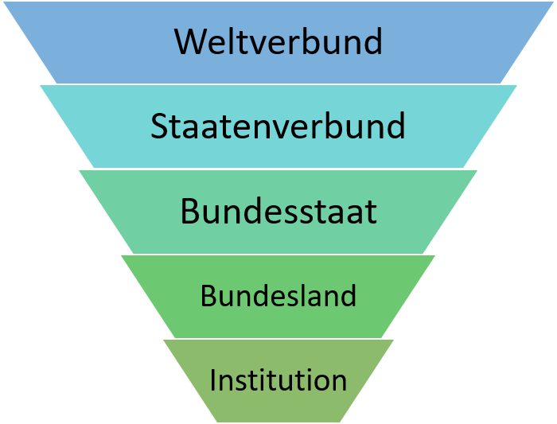
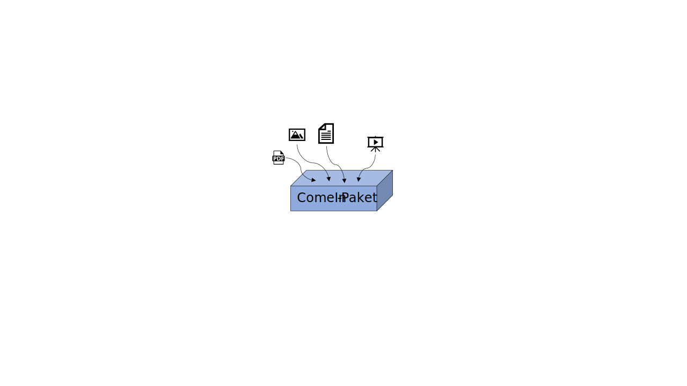
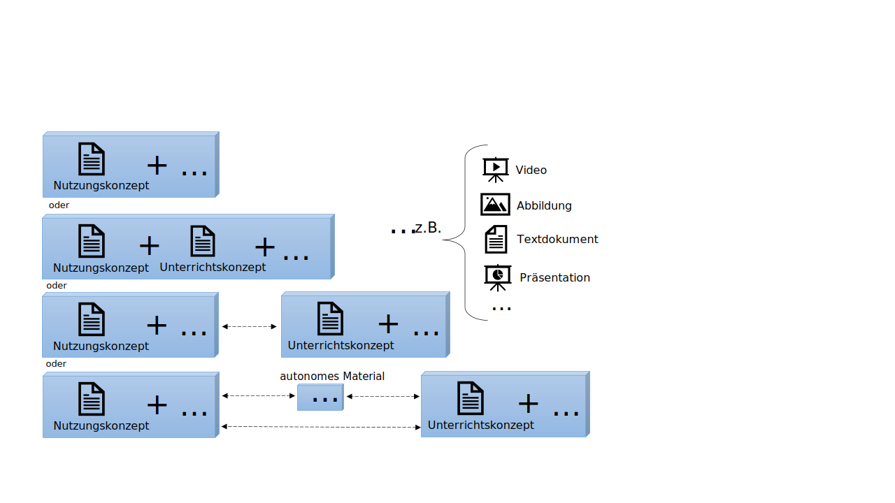
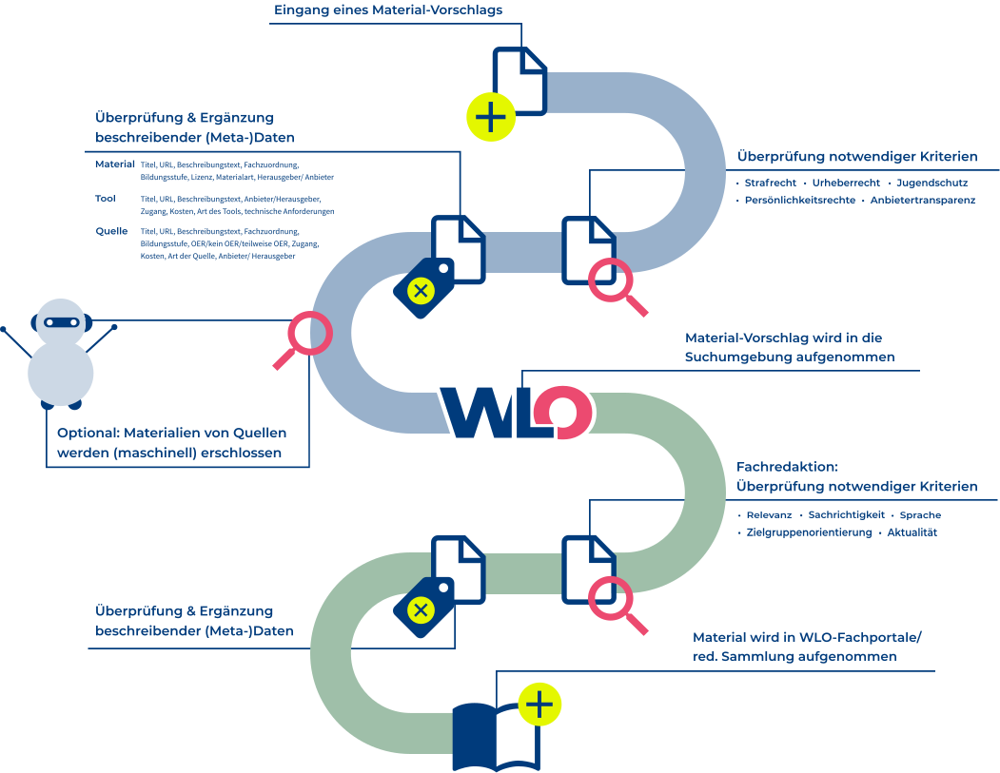
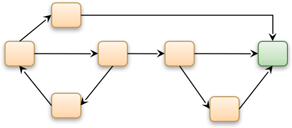

# 4 Didaktische Metadaten

## 4.1 Was sind didaktische Metadaten?

<table>
<colgroup>
<col style="width: 6%" />
<col style="width: 93%" />
</colgroup>
<tbody>
<tr class="odd">
<td>
❓
</td>
<td>
<strong>Fragestellung</strong>
</td>
</tr>
<tr class="even">
<td>
</td>
<td>
<ul>
<li>

Was genau sind eigentlich didaktische Metadaten?

</li>
<li>

Welche Potenziale und Herausforderungen bieten didaktische Metadaten?

</li>
</ul>
</td>
</tr>
</tbody>
</table>

Didaktische Metadaten dienen der Charakterisierung sowie Kontextualisierung, wie von Bildungsressourcen und deren intendierter Nachnutzung in Lernkontexten, Lernumgebungen und den damit verbundenen Lernprozessen. Sie umfassen vielseitige, relevante Aspekte für die Gestaltung der Lehre und des Lernens. So können Bildungsressourcen etwa durch Metadaten-Statements[^1] beschrieben werden, die Merkmale von Lernprozessen oder Lernumgebungen kennzeichnen und mit der intendierten Nutzung einhergehen ([Sutton 2004](#ref-suttonmes2004), S. 145).

Diese weite Definition erlaubt es, sowohl bildungswissenschaftliche, pädagogische, psychologische, als auch methodische sowie (fach-/medien-)didaktische Perspektiven auf Bildungsressourcen und deren Kontexte interdisziplinär als Metadaten-Kategorie zusammenzufassen, sodass “Bildungsmetadaten” oder “pädagogischen Metadaten” hierunter ebenfalls subsumiert werden. Im internationalen Raum sind die Begriffe *educational metadata (*Bildungsmetadaten*)*, *pedagogic metadata* (pädagogische Metadaten) und *didactic metadata* (didaktische Metadaten) verbreitet, die definitorisch verwandt und kaum voneinander abzugrenzen sind, sodass in diesem Kompendium diese Konzepte von der Bezeichnung “Didaktische Metadaten” ebenfalls umfasst werden. Didaktische Metadaten sind besonders relevant für Lehrende, Lernende, Bildungsforscher\*innen und Multiplikator\*innen im Aus- und Fortbildungssystem sowie darüber hinaus für Personen, die an der Konzeption und Realisierung von Bildungsdiensten beteiligt sind.

Primär werden in diesem Kapitel deskriptive didaktische Metadaten herausgestellt, die als Attribute für Bildungsressourcen fungieren. Dabei ist zu berücksichtigen, dass darüber hinaus auch anderweitige deskriptive, strukturelle oder administrative Metadaten in Lehr-/Lernkontexten und -prozessen wichtige didaktische Funktionen erfüllen können, wie in diesem Kompendium exemplarisch aufgezeigt wird. Somit wird hier zugleich eine Unterscheidung zwischen didaktischen und anderweitigen Metadaten, die in bestimmten Nutzungsszenarien eine didaktische Funktion erfüllen, getroffen. Die letztgenannte Kategorie kann aufgrund facettenreicher Anwendungsfälle äußerst umfangreich sein, sodass hier nur einige Beispiele erwähnt werden. Auch didaktische Metadaten können dabei inhalts-, kontext- und strukturbezogene Attribuierungen vornehmen (vgl. [Typen von Metadaten](#was-sind-typen-von-metadaten)).

Wissensorganisationssysteme, wie beispielsweise didaktische Taxonomien, Typologien und Ontologien ([Norbert Meder 2006](#ref-mederwndwvl2006)) ([Ohly, Rahmstorf, and Sigel 2000](#ref-ohlyguwnafwwuiptdsigfwh22s12000)) ([Jan M. Pawlowski 2002](#ref-pawlowskimdk2002)) ([Schmiech 2006](#ref-schmiechdozodoal2006)) ([Swertz 2004](#ref-swertzddlfahlmw2004)) ([Swertz 2005](#ref-swertzwdop2005a)), können als Basis verwendet werden, um Lernobjekte durch didaktische Kategorien zu beschreiben, beispielsweise über eine Zuordnung von [Sachthemen](#fach--und-themenzuordnung), [Lernzielen](#lernvoraussetzungen-lernziele-und-lernkontrollen), zugehörigen Wissensarten (bspw. deklarativ, prozedural, situativ, sensomotorisch), medialen Präsentationsformen (vgl. auch [Ressourcentypen](#ressourcentyp-medientyp)) oder auch fach- und sachlogischen Beziehungen zwischen Themen, welche zugleich eine intendierte Progression der Lerninhalte abbilden (Wissenssequenzierungen). Somit existieren nicht nur Beschreibungsansätze für die Gestalt und Struktur der Lerninhalte, sondern vielmehr auch für Zusammenhänge von Inhalten, didaktischen Einsatzszenarien und der Einbettung der Inhalte in verschiedene Bildungskontexte.

Dabei können vielfältige didaktische Kategorien erfasst werden, wie:

- Lehr-/Lernmodelle (z. B. Instruktionsmodelle mit Phasierungen des Unterrichts)
- Lehr-/Lerntheorien (z. B. Konnektivismus, Konstruktivismus, Kognitivismus, Behaviorismus)
- Lehr-/Lernziele (z. B. zu fördernde Kompetenzen)
- Lern-/Lernniveaus (z. B. Kompetenzstufenmodelle, Differenzierungsmodelle)
- Lehr-/Lerngruppen (z. B. Personengruppen, für die eine Ressource didaktisiert wurde)
- Lehr-/Lernformen (z. B. selbstgesteuerte oder fremdgesteuerte Lernprozesse)
- Lehr-/Lernkontexte (z. B. zeitlicher, organisatorischer und räumlicher Kontext)
- Lehr-/Lernszenarien (z. B. Sequenzierung von Lernaktivitäten)
- Lehr-/Lernmethoden (z. B. Didaktische Prinzipien, Interaktionsarten)

**Heterogenität der Nutzungskontexte von Bildungsressourcen**

Wenngleich die Entwicklung des Bildungsmarktes stetig voranschreitet, ist weiterhin zu konstatieren, dass, aus Sicht von Lehrenden und Lernenden, relevante didaktische Merkmale von Ressourcen nicht oder nur unzureichend erfasst werden ([Tavakoli et al. 2020](#ref-tavakoliqpoerma2020), S. 1). Die Vielzahl der möglichen Verwendungskontexte erhöht die Bedarfe an Ressourcen und spezifischen Metadaten, damit Suchen überhaupt zielgerichtet durchführbar sind, um die relevanten Ressourcen in der zunehmenden Vielfalt auffinden zu können. Die Relevanz von Ressourcen ergibt sich für Lernende und Lehrende dabei aus zahlreichen Faktoren, wie insbesondere dem jeweiligen Kontext der intendierten Nachnutzung. So können für die erfolgreiche Nutzung einer Ressource unter Umständen die jeweilige Lernumgebung, Bildungsstufe, sprachlichen Hintergründe, verfügbare Lernzeit, technologischen und rechtlichen Anforderungen und viele weitere Kriterien bedeutsam sein. Ebenso haben orts- und zeitunabhängiges Lernen sowie selbstgesteuerte Lernprozesse durch die Digitalisierung an Relevanz gewonnen.

**Attribute und Werte zur Bereitstellung und Austausch von Daten: One size fits all?**

Im Folgenden werden einige Attribute vorgestellt und beschrieben, die sich entweder bereits in Metadatenstandards finden, von Fachexpert\*innen teilweise konzeptualisiert wurden oder von Lehrenden und Lernenden erwünscht sind, jedoch bislang keine flächendeckende Verbreitung oder keinen Konsens aufweisen. Dabei wird zudem auf Wertelisten verwiesen, die bereits in verschiedenen Stadien der Entwicklung zur Nachnutzung vorliegen oder von Expert\*innen als relevant eingestuft werden, jedoch unter Umständen bisher nicht unmittelbar als kontrolliertes Vokabular tauglich sind. Dabei muss beachtet werden, dass einige der genannten Wertelisten zum Teil eher dem Datenaustausch zwischen verteilten Systemen dienen und weniger der Bereitstellung elaborierter Metadaten in lokalen Repositorien oder Bildungsdiensten. Damit können die erwähnten Wertelisten eventuell unterspezifiziert sein, je nachdem wie heterogen die Gruppe derjenigen ist, die sich auf die Attribute und Wertelisten zum Austausch geeinigt haben. Innerhalb konkreter Dienste ist es unter Umständen sinnvoll, wesentlich umfangreichere Attribute und Wertelisten zu nutzen, beispielsweise um spezifische Empfehlungsfunktionen zu ermöglichen oder um Sammlungen für verschiedene Bedürfnisse von Zielgruppen zusammenzustellen. Diese Vielfalt lokaler Ausprägungen kann in einem Datenaustausch jedoch nicht immer abgebildet werden. So müsste zum Beispiel das elaborierte, service-interne [Vokabular der Lernressourcentypen von WirLernenOnline](http://w3id.org/openeduhub/vocabs/new_lrt/) beim Austausch der Daten auf ein Vokabular abgebildet werden, wie es in einem der Metadatenprofile LOM-HS-OER oder AMB genutzt wird.

Die zunächst naheliegende Forderung, dass jeder Dienst einfach die gleichen Attribute und Wertelisten verwendet, würde funktional einschränkend wirken und den Wettbewerb sowie Innovationen hemmen. Nur standardisierte Wertelisten in einem Service zu verwenden, führt kaum zur besten Usability und User Experience, da diese Wertelisten oft ein gewisses Abstraktionsniveau aufweisen. Das steht jedoch nicht der Möglichkeit im Wege, diese spezifischen Attribute und Werte auf standardkonforme Daten zu mappen und sie über offene Schnittstellen bereitzustellen. Um den Informationsverlust möglichst zu minimieren, sollten der Transfer und die Harmonisierung von Metadaten zwischen verschiedenen Systemen bereits frühzeitig mitgedacht werden.

<table>
<colgroup>
<col style="width: 6%" />
<col style="width: 93%" />
</colgroup>
<tbody>
<tr class="odd">
<td>
💡
</td>
<td>
<strong>Zusammenfassung</strong>
</td>
</tr>
<tr class="even">
<td>
</td>
<td>
<ul>
<li>

Didaktische Metadaten umfassen vielseitige Aspekte von Bildungsressourcen und Bildungskontexten (z. B. Lernumgebungen), die für Lehr-/Lernprozesse relevant sind.

</li>
<li>

Es kann zwischen didaktischen Metadaten und Metadaten, die in bestimmten Nutzungsszenarien eine didaktische Funktion erfüllen, unterschieden werden.

</li>
<li>

(Elaborierte) Vokabulare und Harmonisierung für den interoperablen Datenaustausch sollten frühzeitig mitgedacht werden.

</li>
</ul>
</td>
</tr>
</tbody>
</table>

## 4.2 Didaktische Metadatenfelder - Welche gibt es schon?

<table>
<colgroup>
<col style="width: 6%" />
<col style="width: 93%" />
</colgroup>
<tbody>
<tr class="odd">
<td>
❓
</td>
<td>
<strong>Fragestellung</strong>
</td>
</tr>
<tr class="even">
<td>
</td>
<td>
<ul>
<li>

Welche didaktischen Metadatenfelder existieren bereits in den vorhandenen Standards und wie werden sie eingesetzt?

</li>
</ul>
</td>
</tr>
</tbody>
</table>

### 4.2.1 Fach- und Themenzuordnung

Die Zuordnung eines Objektes zu einem Fach ist im institutionellen Bildungsbereich essenziell und häufig einer der ersten Suchzugänge ([Tischler, Heck, and Rittberger 2022](#ref-tischlernunmbsubob2022), S. 259). In der Untersuchung von Tischler et al. wird die Zuordnung des Studienfaches von den Befragten als relevant und leicht beschreibbar identifiziert ([Tischler, Heck, and Rittberger 2022](#ref-tischlernunmbsubob2022), S. 258). Bei einer früheren Befragung durch Arbeitsgruppen der LRMI galt die Angabe von Inhalts- und Themenbereichen bei mehr als 80 % der befragten Lehrenden als eine der hilfreichsten Angaben ([Winter Group 2014](#ref-wintergrouplsrj2umoo2014)), wenngleich zu berücksichtigen ist, dass das damalige Spektrum zur Verfügung stehender geschlossener Antwortmöglichkeiten sich von der heutigen Marktsituation unterscheidet. Bei einer Umfrage von JOINTLY.info empfanden nur ca. 46 % (n = 46 Antworten) eine Filterung nach dem “Fach” mindestens “etwas hilfreich” ([JOINTLY.info 2021](#ref-jointly.infosuinuo2021)). Dies kann mehrere Ursachen haben. So musste etwa die Einschätzung in dieser Umfrage für die Kombination der beiden Felder “Fach” und “Klassenstufe” getroffen werden und konnte nicht getrennt erfolgen. Auch unterscheiden sich womöglich die jeweiligen Suchintentionen, Vokabulare, Gestaltung der Oberflächen und präsentierte Inhalte sowie deren Verschlagwortung, vor deren Hintergrund die Antworten in der Umfrage anzunehmend erfolgten.

Aus den dargelegten Gründen sind Attribute zur Zuordnung eines Faches oder Themenbereichs auch in den weitverbreiteten Metadatenstandards vorhanden. Das Attribut fokussiert die Inhaltsstruktur des Unterrichts. Es gibt bereits verschiedene maschinenlesbare Fachsystematiken für den Schul- und Hochschulbereich.

**Sachlogische Beziehungen**

Durch Modellierung sachlogischer Beziehungen innerhalb und zwischen Sachgebieten (sowie Themen) wird die intendierte Progression, unter anderem die Sequenzierung der Lerninhalte, vorstrukturiert. Wissenszusammenhänge können dadurch vernetzt werden, was beispielsweise bei der Implementierung von Vorschlagssystemen relevant ist. Sachlogische Beziehungen können Sachanalysen von Unterrichtsplanungen und Unterrichtsentwürfen unterstützen.

Beispiel: [Graph-basierte Suche von GeoGebra](https://www.geogebra.org/materials)

**Interdisziplinarität und Querschnittsthemen**

Eine Herausforderung bleibt die Zuordnung interdisziplinärer Materialien ([Tischler, Heck, and Rittberger 2022](#ref-tischlernunmbsubob2022), S. 260). Wenn dazu tendiert wird, bei einem Objekt eine große Anzahl an Fächern zuzuordnen, weist dies womöglich darauf hin, dass die Systematik eine geringe Passgenauigkeit aufweist. Häufig handelt es sich dabei um Objekte, die fächerübergreifende Querschnittsthemen oder -kompetenzen betreffen (vgl. auch die [Diskussion zur Hochschulfächersystematik](https://github.com/dini-ag-kim/hochschulfaechersystematik/issues/26) oder zur [disziplinübergreifenden Erfassung](https://gitlab.com/oersi/oersi-etl/-/issues/251)). Je nach Anwendungsfall ist es sinnvoll, hier den Wert “fachübergreifend” in einem kontrollierten Vokabular zu verwenden, einen dedizierten Katalog als Werteliste zu hinterlegen oder ein alternatives Metadatum, wie [Lernvoraussetzungen, -ziele und -kontrollen](#lernvoraussetzungen-lernziele-und-lernkontrollen), ersatzweise zu verwenden. Der Suchindex OERSI verwendet den Wert “fachübergreifend” ersatzweise, wenn mehr als drei Kategorien der ersten Ebene der Fächersystematik verwendet werden ([hbz and TIB 2024](#ref-hbzocos2024)). Dabei sollte eine Entscheidung die einhergehenden Implikationen für die Filterlogik in einem Portal berücksichtigen (vgl. Kapitel “[Vokabulare zur Filterung von Suchergebnissen](#vokabulare-zur-filterung-von-suchergebnissen)”).

Beispiele für Querschnittsthemen und Interdisziplinarität:

- Innovationsprozesse an Bildungseinrichtungen
- Medienbezogene (Hoch-)Schulentwicklung
- Informatische Grundbildung (IGB)
- Bildungswissenschaften
- Bildung für nachhaltige Entwicklung (BNE); Nachhaltigkeit
- Digitalisierung und Medienkompetenzen
- Inklusion/(Umgang mit) Heterogenität (bspw. als medienpädagogisches / förderpädagogisches Konzept, welches in verschiedenen Fächern in Verbindung mit fachwissenschaftlichen Perspektiven greift)
- Fachübergreifender Unterricht, Kombinationsfächer wie Mathematik, Informatik, Naturwissenschaft und Technik (MINT) bzw. Science, technology, engineering, and mathematics (STEM) (unterschiedliche Kombination von Fächern)

**Gestufte und multidisziplinäre Studiengänge**

Eine weitere Herausforderung etablierter Fachsystematiken besteht bei Studiengängen, die über mehrere Phasen konzipiert sind, unter anderem multidisziplinäre Lehramtsstudiengänge, die das Zusammenspiel von Fachwissenschaften, Fachdidaktik und Bildungswissenschaften involvieren.

*Praxisbeispiel: Lehramtsstudiengänge*

Die Zuweisung des Fachs “Mathematik” zu einer Ressource wäre demnach als einziges Kriterium unzureichend, um zwischen Fachwissenschaft und Fachdidaktik differenzieren zu können, da nicht unterschieden werden kann, ob die Ressource eher für fachwissenschaftliche oder fachdidaktische Zielgruppen (z. B. Lehramtsstudierende) relevant ist, sofern nicht ohnehin beides zutrifft. Zudem gibt es derzeit sechs verschiedene Lehramtstypen (vgl. Tabelle “KMK-Lehramtstypen” im Abschnitt [Abschlüsse](#abschlüsse)) ([KMK 2023](#ref-kmkaa2023)), sodass auch die Zielgruppe der Lehramtsstudierenden nochmals differenzierter zu betrachten ist. Wenngleich anzumerken ist, dass seit 2022 der Lehramtstyp 2 für “Lehrämter der Primarstufe und aller oder einzelner Schularten der Sekundarstufe I” kaum noch eine Relevanz hat, da dieser in keinem Land mehr angeboten wird (Centrum für Hochschulentwicklung, 2024a). Um nun jedoch Fächersystematiken nicht zu überfrachten, wird in der Regel auf eine dortige Unterscheidung zwischen Fachwissenschaft und -didaktik verzichtet, somit beispielsweise auf separate Werte für “Mathematik” als Fachwissenschaft und “Mathematikdidaktik”.

Doch wie finden Personen mit Bezug zur Lehrkräfteaus- und -fortbildung relevante, fachdidaktische Ressourcen?

Sofern die Differenzierung nicht aus der Zuweisung konkreter didaktischer Themen hervorgeht, wird diese teils über die Benennung von [Zielgruppen](#zielgruppen), Ausweisung von [Lernzielen](#lernziele), die Zuordnung der entsprechenden [Abschlüsse](#abschlüsse) (Bachelor of Science; Bachelor of Education; Lehramtstypen), oder auch Curricula (z. B. KMK Standards für die Lehrkräftebildung), vorgenommen.

**Attribute in Metadatenstandards**

- LRMI/schema.org: [about](https://schema.org/about)
- AMB: [about](https://dini-ag-kim.github.io/amb/20231019/#about)
- LOM: 9.1 discipline
- Learning Metadata (LMT): [dct:subject](https://www.dublincore.org/specifications/dublin-core/dcmi-terms/#http://purl.org/dc/terms/subject) (DCMI Metadata Terms)
- [dfnEduPerson](https://web.archive.org/web/20231215062855/https://doku.tid.dfn.de/de:elearning_attributes)
  - vier Attribute, drei mit Destatis-Wertebereich: “Fächergruppe”, “Studienbereich”, “Studienfach”, “Studienfachbezeichnung laut Hochschule”
  - zwei kombinierte Attribute mit Destatis-Wertebereich: “Studienfach und Abschluss”, “Studienfach und Studienfachart”

**Wertelisten**

Folgende Wertelisten bieten sich zur Einbindung oder Nachnutzung an:

- Schulfächer:

  - [Schulfächer](http://w3id.org/kim/schulfaecher/), DINI-AG-KIM, [Repo](https://github.com/dini-ag-kim/schulfaecher)
  - [Schulfächer](http://w3id.org/openeduhub/vocabs/discipline/), WirLernenOnline, [Repo](https://github.com/openeduhub/oeh-metadata-vocabs)
  - [Schulfächer](https://mundo.schule/search), Sodix/Sodis
  - [Sachgebietssystematik](https://vocabs.sodix.de/index.de.html), Sodix/Sodis
  - [Schulfächer](https://digitallearningtools.de/api/subjects?q=), Digital Learning Lab / Tools
  - [EUN Subject Values](http://europeanschoolnet-vbe.lexaurus.net/vbe/browse), European Schoolnet Vocabulary

- Ausbildungsberufe:

  - [Verzeichnis der anerkannten Ausbildungsberufe 2023 (BIBB)](https://www.bibb.de/dienst/publikationen/de/19128)

- Hochschulfächer:

  - Statistisches Bundesamt (Destatis): [Fächergruppen, Studienbereiche und Studienfächer](https://www.destatis.de/DE/Methoden/Klassifikationen/Bildung/studenten-pruefungsstatistik.pdf) (KIM [Repo-Mirror](https://github.com/dini-ag-kim/destatis-schluesseltabellen) der offiziellen Schlüsseltabellen (CSV))
  - [Destatis-Systematik der Fächergruppen, Studienbereiche und Studienfächer](https://w3id.org/kim/hochschulfaechersystematik/scheme), DINI-AG-KIM, [Repo](https://github.com/dini-ag-kim/hochschulfaechersystematik), ebenfalls als “[Hochschulfächersystematik](http://w3id.org/openeduhub/vocabs/hochschulfaechersystematik/)” durch Open Edu Hub / WirLernenOnline bereitgestellt

- Sachgebietssystematiken

  - [ELIXIER-Systematik](https://web.archive.org/web/20221006161235/https://www.bildungsserver.de/elixier/elixiersystematikliste.php)
  - [LOM-EAF](http://agmud.de/eaf-erweitertes-austauschformat/) (AG MuD) ([Repo-Mirror](https://github.com/openeduhub/oeh-metadata-eaf-sachgebietssystematiken))
    - [Sachgebietssystematik](https://web.archive.org/web/20240222094846/http://agmud.de/wp-content/uploads/2021/09/eafsys.txt) (txt)
    - [Sachgebietssystematik (](https://web.archive.org/web/20240227120643/http://agmud.de/sachgebietssystematik/)Excel, PDF)

- Unterrichtsthemen zu Schulfächern:

  - [Taxonomie von Lehrplanthemen](http://w3id.org/openeduhub/vocabs/oeh-topics/5e40e372-735c-4b17-bbf7-e827a5702b57), WirLernenOnline, [Repo](https://github.com/openeduhub/oeh-metadata-vocabs)

- Bildungsbereichsübergreifende Fächer & Themen:

  - [Subjects](https://www.re3data.org/browse/by-subject/): Re3Data.org

  - [Subjects](http://id.loc.gov/authorities/subjects): MARC 21

  - [EuroVoc](https://eur-lex.europa.eu/browse/eurovoc.html): Mehrsprachiger und multidisziplinärer Thesaurus der EU

  - [LRE Thesaurus](http://europeanschoolnet-vbe.lexaurus.net/vbe/browse) (European Schoolnet Vocabulary),

  - [UNESCO Thesaurus](https://vocabularies.unesco.org/browser/thesaurus/en/) zur thematischen Analyse und Auffinden von Dokumenten anhand multidisziplinärer Terminologie, bspw. auch: [Wissenschaftsdisziplinen](https://vocabularies.unesco.org/browser/thesaurus/en/page/?uri=http%3A%2F%2Fvocabularies.unesco.org%2Fthesaurus%2Fdomain2), u.a. verfügbar als JSON-LD, Turtle, RDF/XML.

  - Skosmos: Wissenschafts-/Kunstzweige, (historische) Studienrichtungen:

    - [Wissenschafts-/Kunstzweige](https://voc.uni-ak.ac.at/skosmos/disciplines/de/)
    - [Study Programmes](http://base.uni-ak.ac.at/vocabulary/study_programmes)
    - [Historic Study Programmes](https://voc.uni-ak.ac.at/skosmos/basevoc/en/page/historic_study_programmes)

### 4.2.2 Lernvoraussetzungen, Lernziele und Lernkontrollen

Die Einführung der Bildungsstandards und Bologna-Reformen markiert einen Paradigmenwechsel im Bildungssystem, hin zur Kompetenzorientierung. Damit rücken verstärkt Lernziele und Kompetenzen der Lernenden in den Fokus. Es geht somit nun nicht länger einzig um eine Standardisierung von Lerninhalten, sondern vielmehr darum, welche Kompetenzen Lernende am Ende einer Lerneinheit aufweisen, sowohl im Hinblick auf theoretische Kenntnisse (kognitive Perspektive) als auch deren praktischen Umsetzung (funktionale Perspektive) ([Kopf, Leipold, and Seidl 2010](#ref-kopfkluphfl2010)).

Nach den Ergebnissen internationaler Vergleichsstudien (bspw. TIMMS, PISA) hat sich das institutionelle Bildungswesen sukzessive auf eine lernzielorientierte und kompetenzorientierte Didaktik umgestellt. Um diese Kompetenzorientierung in den Metadaten zu Objekten abbilden zu können, bieten sich die Attribute “Lernvoraussetzungen”, “Lernziele” und “Lernkontrollen” an[^2].

Die Zuordnung von Bildungsstandards ist für 57 % der Lehrenden eines der hilfreichsten Kriterien bei der Suche nach Ressourcen ([Winter Group 2014](#ref-wintergrouplsrj2umoo2014), S. 8). Eine Zuordnung kann durch Kompetenzstruktur- oder Kompetenzstufenmodelle erfolgen (Beispiel: Lesekompetenzstufenmodell in IGLU). Die Attribute fokussieren die Zielstruktur des Unterrichts und wurden, auch früher bereits, als fundamental für Bildungsressourcen bezeichnet ([Sutton 2004](#ref-suttonmes2004), S. 145), wie auch eine Orientierung an operationalisierbaren Lernzielen oder die Adaption von Lernumgebungen an Lernvoraussetzungen der Lernenden ([Schulmeister 2000](#ref-schulmeisterdahl2000), S. 40f).

Lernziel-orientierte Attribute sind darüber hinaus zur Umsetzung adaptiver Lernpfade relevant. Besonders vielversprechend ist dabei die Verknüpfung mit offiziellen Lehrplänen oder anderen Kompetenzkatalogen, sofern diese maschinenlesbar vorliegen. Dies ist zum jetzigen Zeitpunkt bislang nicht der Regelfall. Im institutionellen Bildungsbereich sind Kompetenzrahmen häufig die Arbeitsgrundlage von Lehrenden. Eine Verknüpfung von Objekten mit diesen Katalogen kann daher die Arbeit der Lehrenden unmittelbar unterstützen und ermöglicht zugleich kompetenzorientierte Suchzugänge.

Dabei ist zu berücksichtigen, dass nicht alle Ressourcen mit Hinblick auf konkrete Kompetenzkataloge entwickelt wurden und eine nachträgliche Zuweisung unter Umständen nicht immer zweckdienlich ist. Recht allgemeine Kompetenzkataloge bergen zudem die Gefahr, dass es zu einer häufigen Zuweisung kommt, da viele Kompetenzen von Ressourcen auch implizit oder indirekt gefördert werden können. Bei der Zuweisung sollten daher die intendierten Lernergebnisse der Ressourcen stehen, welche primär adressiert werden.

**Exemplarische Grundlagen der Wertebereiche**

**International**

[OERCommons](https://oercommons.org/browse) erlaubt die Filterung nach Bildungsstandards, beispielsweise “[Standards for the 21st-Century Learner](https://web.archive.org/web/20240126221501/https://standards.aasl.org/wp-content/uploads/2017/11/AASL-Standards-Framework-for-Learners-pamphlet.pdf)” der American Association of School Librarians (AASL). Auch die [Educational CAD Model Library](https://www.cadlibrary.org/) verwendet die Angabe exemplarischer Lernziele sowie die Orientierung an Bildungsstandards (z. B. [Common Core State Standards](https://corestandards.org/)) als Metadatum ([Bull et al. 2023](#ref-bullmseo2023)).

*Common Education Data Standards (CEDS)*

Das Projekt [Common Education Data Standards](https://ceds.ed.gov/) (CEDS) ist ein Projekt der Vereinigten Staaten zur Entwicklung freiwilliger, gemeinsamer Standards für Bildungsdaten, um den Austausch und die Semantik von Daten zwischen Bildungseinrichtungen und -sektoren zu harmonisieren. CEDS publiziert ein umfangreiches Datenmodell für Bildungsdaten. Die CEDS-Gemeinschaft entwickelt die Standards weiter. Im Februar 2024 erschien Version 1.2.

**Norwegen**

Ein Beispiel für die institutionelle Bereitstellung von Lehrplänen im Schulbereich in maschinenlesbarer Form findet sich in Norwegen. Dort können die Pläne über eine [REST-Schnittstelle oder eine SPARQL-Abfrage](https://www.udir.no/om-udir/data/kl06-grep) ([Archiv](https://web.archive.org/web/20240304115600/https://www.udir.no/om-udir/data/kl06-grep)) erhalten werden.

**Europa**

*ESCO  
*Im europäischen Kontext ist ein weiterer Katalog relevant, der von der Europäischen Kommission mit Hinblick auf den europäischen Arbeitsmarkt und die berufliche Bildung gepflegt wird: [European Skills, Competencies and Occupations (ESCO).](https://esco.ec.europa.eu/en/classification/skill_main) Dieser Katalog liegt in maschinenlesbarer Form (RDF) vor und kann über eine API-Schnittstelle genutzt werden.

*Europass*

Das Europass-Werkzeug soll als Portfolio, einschließlich digitaler Kompetenznachweise, dienen, welches vorhergehende Entwicklungen berücksichtigt, wie das Qualification Dataset Register ([QDR](https://europa.eu/europass/de/stakeholders/qdr/documentlibrary)) und dazugehörige Applikationsprofile:

- European Digital Credentials for Learning (EDC):  
  Applikationsprofil für die Akkreditierung
- Learning Opportunities and Qualifications (LOQ):  
  Applikationsprofil für Lernmöglichkeiten und Qualifikationen

*European Qualifications Framework* ([EQF](https://europa.eu/europass/en/europass-tools/european-qualifications-framework), [EQR](https://europa.eu/europass/de/europass-tools/europaeischer-qualifikationsrahmen))

Der Europäische Qualifikationsrahmen soll die Vergleichbarkeit von Qualifikationen gewährleisten, räumliche und berufliche Mobilität fördern und lebenslanges Lernen ermöglichen.

**Schweiz**

Das [Schweizer Lehrplan-Portal](https://www.lehrplan21.ch/) stellt Lehrpläne für die verschiedenen Kantone bereit, die beispielsweise vom [Portal zebnis.ch](https://www.zebis.ch/unterrichtsmaterial) zur Verschlagwortung von Lernmaterialien verwendet werden.

**Deutschland**

Standardisierungen von Kompetenzen und Lehrplänen werden häufig zunächst auf einer größeren Strukturebene entwickelt und dann auf kleineren Ebenen adaptiert, beispielsweise von einzelnen Teilstaaten oder auf institutioneller Ebene.

<em>Beispiele für Strukturebenen:</em>

<ul>
<li>
Weltverbund
</li>
<li>
Staatenverbund (z. B. Europäische Union)
</li>
<li>
Bundesstaat
</li>
<li>
(z. B. bundesweit gültige Rahmen)
</li>
<li>
Teilstaat, Bundesland
</li>
<li>
(z. B. bundeslandspezifische Rahmen)
</li>
<li>
Institution (z. B. für schulinterne Rahmen)
</li>
</ul>

*EU-Standards*

Werden auf europäischer Ebene beispielsweise verschiedene Referenzrahmen entwickelt, die dann auf nationaler Ebene oder in einem bildungsföderalistischen System auf Ebene der Bundesländer in eigenen Ausprägungen zu adaptieren sind, hat diese Fragmentierung Auswirkungen auf die Verwendung von Metadaten.

*Qualifikationsrahmen für Lebenslanges Lernen*

Der Deutsche Qualifikationsrahmen für Lebenslanges Lernen ([DQR](https://www.dqr.de/dqr/de/home/home_node.html)) als nationaler Qualifikationsrahmen ([NQR](https://europa.eu/europass/de/europass-tools/europaeischer-qualifikationsrahmen/nationalen-qualifikationsrahmen)) steht im Zusammenhang mit dem europäischen Qualifikationsrahmen für Lebenslanges Lernen ([EQR](https://europa.eu/europass/de/europass-tools/europaeischer-qualifikationsrahmen)), um die Anerkennung von Abschlüssen und den Wechsel zwischen den verschiedenen Bildungssystemen zu ermöglichen (vgl. [europass](https://europa.eu/europass/)). Die Qualifikationsrahmen beinhalten jeweils Qualifikationsziele (z. B. Kompetenzen als Learning Outcomes).

*KMK-Standards*  
Die nationalen Bildungsstandards der KMK definieren, welche Kompetenzen Schüler\*innen bis zu einer bestimmten Jahrgangsstufe erwerben sollten. Die länderspezifischen Rahmenlehrpläne präzisieren diese nationalen Vorgaben schulart- und jahrgangsstufenbezogen, bereiten diese für die Anforderungssituationen im Unterricht auf und ergänzen länderspezifische Vorgaben. Anschließend werden die Vorgaben des Rahmenlehrplans in ein pädagogisches Handlungskonzept überführt (schulinternes Curriculum).

*Maschinenlesbare Lehrpläne*

Da es keinen Standard für die Darstellung von Curricula gibt, jedoch von verschiedenen Seiten der Bedarf an der Entwicklung eines Standards geäußert wurde, hat sich die [DINI-AG-KIM Curricula](https://wiki.dnb.de/display/DINIAGKIM/Curricula-Gruppe) als Arbeitsgremium verschiedener Institutionen dieses Themas angenommen. Ein (prototypisches) [Datenmodell zur Abbildung von Lehrplänen](https://github.com/dini-ag-kim/modell_lehrplaene) im Schulbereich wurde entwickelt und wird momentan in Form einer [Curriculum Ontology](https://w3id.org/curriculum/) von Teilen der Gruppe weiterentwickelt. Verwandte Vorhaben finden sich im [Curriculum Navigator](https://curriculum.schulcampus-rlp.de/navigators/1) ([Schulcampus](https://cloud.schulcampus-rlp.de/edu-sharing/components/search) RLP) oder auch im internationalen Raum im Projekt [K-12 Open Content Exchange](https://k12ocx.github.io/k12ocx-specs/). Ziel ist es, strukturierte Daten für Lehrpläne bereitzustellen, um curriculare Beziehungen zwischen Bildungsressourcen herzustellen und die Vernetzung zwischen verschiedenen Lehrplänen zu ermöglichen.

*Zuordnung von Lernzielen und Kompetenzen*

Die Zuordnung einer Kompetenz kann dabei auf zwei Arten erfolgen:

1)  Zuweisung einer *Referenz*, z. B. indem die Kompetenz in einem geschlossenen Vokabular mit eindeutiger Bezeichnung definiert ist
2)  Zuweisung eines konkreten *Wertes*, z. B. indem die Beschreibung der Kompetenz als Text in den Metadaten hinterlegt wird

Während der zweite Ansatz zunächst simpler erscheint, ist es durchaus lohnenswert die Mehrwerte der ersten Variante zu berücksichtigen, wie zum Beispiel die gewonnene referentielle Integrität, einschließlich der Konsistenz der Metadaten, insbesondere bei Veränderungen oder Aktualisierung der Kompetenzen in den Quellrahmen. Weiterhin bietet die erste Variante die Möglichkeit, Kompetenzen verschiedener Rahmen miteinander in Beziehung zu setzen und den Suchkontext durch diese Vernetzung der Rahmen zu erweitern.

Um eine Angleichung von inhaltlichen Abweichungen zwischen Standards vorzunehmen, können semantische Beziehungen verwendet werden. Solche Mappings werden auch metaphorisch als Crosswalk bezeichnet ([Sutton 2004](#ref-suttonmes2004), S. 148-149). Das Metadatum ist vor allem auch für die Erstellung von adaptiven Lernpfaden von Bedeutung.

Es lassen sich generelle Anforderungen an die Erfassung von Kompetenzen finden, darunter exemplarisch die allgemeine Beschreibung der Kompetenz, die Art der Kompetenz (Wissen, Fähigkeit, Einstellung, …), die Beziehungen zwischen einzelnen Kompetenzen, ein messbares Kompetenzniveau sowie eine Taxonomie oder Ontologie zur Strukturierung der Kompetenzen ([Sitthisak and Gilbert 2011](#ref-sitthisakiabcm2011), S. 22).

*Weitere Praxisbeispiele für die Nutzung von Kompetenzrahmen*

Die Projekte [WirLernenOnline](https://suche.wirlernenonline.de/), [ComeIn](https://comein.nrw/portal/ressourcen/) und auch einige Kompetenzverbünde von [lernen.digital](https://lernen.digital/) nutzen den Europäischen Rahmen für die Digitale Kompetenz von Lehrenden (DigCompEdu) sowie den bundesweiten Rahmen “Kompetenzen in der digitalen Welt” der Kultusministerkonferenz (KMK) zur Erfassung von Lernzielen bei Bildungsressourcen.

Zusätzlich werden auch bundeslandspezifische Ausprägungen des DigCompEdu, wie beispielsweise der “Orientierungsrahmen für die Lehrerausbildung und Lehrerfortbildung in NRW” (Eickelmann, 2020) verwendet. Damit die Ressourcen nun auch bundesweit sinnvoll auffindbar werden, wurden die einzelnen Kompetenzen aus dem Orientierungsrahmen über Beziehungen mit dem EU-Framework auf der übergeordneten Strukturebene in Verbindung gesetzt. Darüber hinaus gibt es solche Mappings der Kompetenzen auch zwischen dem bundesweiten Rahmen der KMK und der bundeslandspezifischen Ausprägung im “Medienkompetenzrahmen NRW” ([Blodau et al. 2019](#ref-blodaumn2019)).

Wenngleich somit Ressourcen in einem bildungsföderalistischen System mit bundeslandspezifischen Werten ausgezeichnet werden, ist die grundlegende Idee hinter dieser Aufbereitung, die Vernetzung mit übergeordneten Rahmen, sodass Ressourcen auch auf größeren Strukturebenen sinnvoll auffindbar sind.

Ein vergleichbares Prinzip wird bei der Umsetzung maschinell-verarbeitbarer Lehrpläne intendiert, um Ressourcen, die für ein bundeslandspezifisches Curriculum entwickelt oder mit diesem verknüpft wurden, auch in anderen Bundesländern besser auffindbar zu machen, da sich die Zugänge jeweils aufgrund der unterschiedlichen Lehrpläne unterscheiden. So werden die artifiziellen strukturellen Grenzen des Bildungssystems in gewisser Hinsicht aufgelöst und Ressourcen können in vergleichbaren Kontexten einfacher nachgenutzt werden.

**Weitere Hinweise zur Verwendung**

Es empfiehlt sich eine weitergehende Spezifizierung der Attribute für das jeweilige Nutzungsszenario. Aussichtsreich ist die Verbindung von Kompetenzen mit Zertifikaten. Voraussetzung ist die autorisierte Veröffentlichung entsprechender Kompetenzkataloge und eine entsprechende Einbindung dieser mit ausstellenden Autoritäten.

Wie sich in der Untersuchung von Tavakoli et al. bei der Gegenüberstellung des Vorhandenseins von Metadatenattributen vor und nach einer Qualitätskontrolle zeigt, scheint das dort untersuchte Attribut “Level”, welches sich hier auf [Voraussetzungen und Vorwissen](#lernvoraussetzungen-und-vorwissen) oder [Abschlüsse](#abschlüsse) beziehen kann, für die Ersteller\*innen oder Erfasser\*innen schwierig zuzuordnen. Ein Indiz dafür ist, dass dieses Attribut häufig nur nach einer “Qualitätskontrolle” vorhanden ist, andernfalls jedoch meist fehlt ([Tavakoli et al. 2021](#ref-tavakolimaoer2021), S. 628).

**Mit Kompetenzen assoziierte Standards:**

- [CASE](https://www.imsglobal.org/activity/case): Format für die Darstellung und den Austausch von Kompetenzrahmen und Lernzielen (1EdTech)
- [Datenmodell zur Abbildung von Lehrplänen](https://github.com/dini-ag-kim/modell_lehrplaene) (DINI AG KIM) und die darauf aufbauende [Curriculum Ontology](https://w3id.org/curriculum/)
- [Ed-Fi Assessment API und Unifying Data Model](https://techdocs.ed-fi.org/display/EFDSRFC/ED-FI+RFC+15+-+ASSESSMENT+OUTCOMES+API) (UDM): Datenmodell und Schnittstelle zum Austausch von Bewertungsmetadaten
- [Datenmodell zur Beschreibung und Referenzierung von Kompetenzdefinitionen](https://ieeexplore.ieee.org/document/4445693) (Standard for Learning Technology-Data Model; IEEE 1484.20.1-2007) (IEEE, 2008)

**Wertebereiche in der Praxis**

Wenngleich verschiedene Taxonomien für Lernziele auf Basis lerntheoretischer Modelle existieren (bspw. Gagné, Ausubel, Bloom, Anderson, Krathwohl) ([Mayer, Hertnagel, and Weber 2009](#ref-mayerlie2009), S. 29–59), werden diese in der Regel nicht als Werte für dieses Feld verwendet, sondern eher für theoretische Überlegungen zur Operationalisierung einer [Niveaustufe](#niveaustufe).

Lernziele können …

- … anhand von Operatoren formuliert werden (vgl. auch [Niveaustufe](#niveaustufe)).
- … aus verschiedenen Dimensionen des Wissens stammen (bspw. Faktenwissen, Konzeptionelles Wissen, Prozedurales Wissen, Metakognitives Wissen) ([Anderson and Krathwohl 2001](#ref-andersontltarbteo2001)) (vgl. auch [Niveaustufe](#niveaustufe)).
- … als Advance Organizer zur Orientierung im Lernprozess dienen.
- … unterschiedlich abstrakt sein (Richtziele, Grobziele, Feinziele) ([Möller 1976](#ref-moellertlmupl1976), S. 80)
- … die eigenständige Kontrolle des Lernerfolgs unterstützen.
- … kategorial unter anderem in kognitive, affektive, psychomotorische und soziale Lernziele unterschieden werden ([Jan Martin Pawlowski 2001](#ref-pawlowskieevzecl2001), S. 47).

In der Praxis finden sich als Werte der Felder “Lernvoraussetzungen”, “Lernziele” und “Lernkontrollen” häufig auch Freitextbeschreibungen. Erst in jüngster Zeit werden hier vermehrt kontrollierte Vokabulare aufgegriffen. Die Verwendung von Referenzen auf Kompetenzen verbessert die zielorientierte Zugänglichkeit, Vergleichbarkeit und Selektion geeigneter Ressourcen und vereinfacht das Erstellen von Lehr-/Lernpfaden, indem Ressourcen anhand der jeweiligen Lernvoraussetzungen, Lernziele und Lernkontrollen in Beziehung stehen.

**Wertelisten zur Einbindung oder Nachnutzung**

*Allgemein*

- [European Skills Competencies, and Occupations (ESCO)](https://esco.ec.europa.eu/de)
- Sprachfähigkeiten/-Kenntnisse
  - [Sprachniveaustufen](http://w3id.org/openeduhub/vocabs/languageLevel/), Open Edu Hub / WirLernenOnline nach dem nach dem Gemeinsamen Europäischen Referenzrahmen ([GER](https://www.europaeischer-referenzrahmen.de/))
- Lumina Foundation’s Degree Qualifications Profile (DQP) (Categories of Learning) als Teil der [Common Education Data Standards](https://ceds.ed.gov/elements.aspx): Specialized Knowledge, Broad and Integrative Knowledge, Intellectual Skills, Applied and Collaborative Learning, Civic and Global Learning
- 4K–Modell des Lernens (4Cs of 21st Century Learning) ([P21 2019](#ref-p21f2cld2019)) ([Pfiffner, Sterel, and Hassler 2021](#ref-pfiffner4udkcuh2021))

*Digitalisierungsbezogene Kompetenzen*

- [Digital Competence Framework for Educators](http://w3id.org/openeduhub/vocabs/digCompEdu/) (DigCompEdu) als europäischer Rahmen für die Digitale Kompetenz von Lehrenden ([European Commission. Joint Research Centre., Redecker, and Punie 2017](#ref-europeancommission.jointresearchcentre.efdced2017)), Open Edu Hub / WirLernenOnline / ComeIn

  - [Orientierungsrahmen für die Lehrerausbildung und Lehrerfortbildung in NRW](http://w3id.org/openeduhub/vocabs/orientierungsrahmenNRW/), Open Edu Hub/WirLernenOnline/ComeIn ([Eickelmann 2020](#ref-eickelmannldwofluln2020))

- [4D Competencies Framework](https://curriculumredesign.org/framework/) (Center for Curriculum Redesign) ([CCR 2020](#ref-ccrrc2ce2020)), welches Kompetenzen im Zeitalter der KI definiert, v1.2 erschien im Januar 2024 ([xlsx Download](https://web.archive.org/web/20240312154129/https://curriculumredesign.org/wp-content/uploads/4D-Competencies-Framework-1.2.xlsx))

- TPACK-Modell ([Herring, Mishra, and Koehler 2016](#ref-herringhtpckte2016))

  - [UDE-Modell: Ein integratives Modell digitalisierungsbezogener Kompetenzen für die Lehramtsausbildung](https://w3id.org/comein/vocabs/ude-modell/) ([Beißwenger et al. 2020](#ref-beisswengerimdkfl2020))

- [Kompetenzen in der digitalen Welt (KMK)](http://w3id.org/openeduhub/vocabs/digitalCompetencies/), Open Edu Hub/WirLernenOnline

> [Kompetenzen in der digitalen Welt (KMK)](http://w3id.org/kim/kmk-vocabs/digitalisierungsbezogene-kompetenzen/), KIM
>
> [Kompetenzen in der digitalen Welt (KMK)](https://vocabs.sodix.de/index.de.html), SODIX

- [Medienkompetenzrahmen NRW](http://w3id.org/openeduhub/vocabs/medienkompetenzrahmenNRW/), Open Edu Hub/WirLernenOnline/ComeIn
- [DaZKom: Ein Modell professioneller Kompetenzen angehender Lehrkräfte im Bereich Deutsch als Zweitsprache](http://w3id.org/comein/vocabs/dazkom/), ComeIn

*Bildungsstandards sowie Lehrplan-/Curricula-orientierte Wertelisten*

- Schule: Lehrpläne der Länder
  - Bildungsstandards (IQB) ([Repo](https://github.com/iqb-vocabs/iqb-vocabs.github.io)) Das IQB veröffentlicht die Bildungsstandards als kontrollierte Vokabulare in SKOS auf Github
  - [Schulcampus RLP](https://cloud.schulcampus-rlp.de/edu-sharing/components/search), [Curriculum-Navigator](https://curriculum.schulcampus-rlp.de/navigators/1) – Digitale Lehr- und Rahmenpläne
  - [Kompetenzbrowser](https://kompetenzbrowser.de/) des Instituts für Schulqualität der Länder Berlin und Brandenburg e. V. (ISQ)
  - [Medienkompetenz-Navigator](https://mk-navi.mebis.bycs.de/mctool/schooltypes) (LehrPlan Plus, mebis, Bayern)
- Hochschule: Standards und Modulkataloge
  - [Hochschulkompass](https://www.hochschulkompass.de/)
  - [KMK: Standards für die Lehrerbildung: Bildungswissenschaften (vom 16.12.2004 i.d.F. vom 16.05.2019)](http://w3id.org/kim/kmk-vocabs/bildungswissenschaften/), KIM
- Elementarbereich: Erziehungs-/Bildungspläne:
  - [Sammlung von Plänen verschiedener Länder](https://www.kindergartenpaedagogik.de/fachartikel/bildung-erziehung-betreuung/1951/)
- Curriculare Strategien für MINT/STEM-Schulen ([Jimenez Iglesias et al. 2018](#ref-jimeneziglesiasessrkec2018)) (z. B. verwendet im Portal [Scientix](https://www.scientix.eu/resources))
- [NextGeneration Science Standards](https://www.nextgenscience.org/) (z. B. verwendet im [TeachEngineering Portal](https://www.teachengineering.org/curriculum/browse))
- Didaktische Basismodelle (vgl. Anlage “Didaktische Basismodelle des Lernens als lernzielorientierter Ansatz der Gestaltung von Unterricht”)

#### 4.2.2.1 Lernvoraussetzungen und Vorwissen

Dieses Attribut listet die Kenntnisse, Fähigkeiten oder Lernvoraussetzungen auf, die für einen effektiven Umgang mit der Ressource erforderlich sind. Die Angabe hilft Lehrenden und Lernenden bei der Auswahl von Ressourcen, die dem aktuellen Lernstand entsprechen. Das Attribut unterstützt daher die Bedingungsanalyse der Unterrichtsplanung.

Bei den Befragten von Tischler et al. wird dieses Attribut als relevant und einfach zu beschreiben eingestuft ([Tischler, Heck, and Rittberger 2022](#ref-tischlernunmbsubob2022), S. 258). Diese Einschätzung ist jedoch zunächst kritisch zu betrachten, da einerseits praxiserprobte Wertebereiche und maschinenlesbare Abbildungen fehlen und andererseits das Attribut in bekannten Repositorien bislang kaum Verwendung findet. Es ist anzunehmen, dass sich die Antwort auf eine Angabe im Freitextformat bezieht, welche hinsichtlich eines spezifischen Faches und Themas einfacher festzulegen ist, in Bezug auf Interoperabilität und Maschinenlesbarkeit jedoch schwieriger nachnutzbar bleibt. Bezüglich der allgemeinen Relevanz des Feldes sind sich auch andere Expert\*innen einig, jedoch wird auch dort darauf hingewiesen, dass entsprechende maschinenlesbare Abbildungen noch fehlen ([Pohl, Mausch, and Henning 2017](#ref-pohlwhwdoeriwam2017), S. 66).

Die konkrete Umsetzung und Einbindung kann daher mit Herausforderungen verbunden sein: Welche konkreten Kompetenzen werden beispielsweise für einen Mathematikvorkurs in der Hochschule vorausgesetzt? Sollen alle Kompetenzen von der Addition, zur Subtraktion, natürlichen Zahlen bis 10, natürliche Zahlen bis 100, usw. aufgelistet werden? Müssen auch Sprachkompetenzen berücksichtigt werden? Schließlich werden Aufgaben in einer bestimmten Sprache auf einem gewissen Niveau gestellt. Sinnvoll scheint zunächst, dass für Bildungsressourcen bestimmte Lernvoraussetzungen (bspw. Mindeststandards für die niedrigste, zugewiesene Bildungsstufe) als erreicht gelten können, so dass diese nicht aufgeführt werden sollten.

Ein speziellerer Katalog, der fakultative und notwendige Kompetenzen für Berufe unterscheidet, findet sich in [European Skills Competencies, and Occupations (ESCO)](https://esco.ec.europa.eu/de).

**Attribute in Metadatenstandards**

- LRMI, schema.org, AMB: [competencyRequired](https://schema.org/competencyRequired)
- LOM: 9.1 Classification / Purpose: prerequisite

**Wertelisten zur Einbindung oder Nachnutzung**

- [European Skills Competencies, and Occupations (ESCO)](https://esco.ec.europa.eu/de)
- Weitere Wertelisten: siehe [einführendes Kapitel](#lernvoraussetzungen-lernziele-und-lernkontrollen)

#### 4.2.2.2 Lernziele

Die Angabe der Lernziele bietet eine Zusammenfassung der Kenntnisse, Fertigkeiten, Einstellungen oder Kompetenzen, die die Lernenden durch die Nutzung der Ressource erwerben oder fördern. Die Angabe hilft den Lernenden, den Nutzen der Ressource zu verstehen und leitet ihre Lernerwartungen. Die Angabe nützt Lehrenden bei der zielgerichteten Auswahl und der Einschätzung der Eignung für die jeweilige Zielgruppe in einem bestimmten Lehr-/Lernkontext. Es unterstützt die didaktische Analyse von Unterrichtsplanungen und Unterrichtsentwürfen.

Im Hinblick auf die Kompetenzen, die mit Bildungsabschlüssen verbunden sind, unterstützt dieses Attribut beispielsweise bei horizontalen und vertikalen Bewegungen im Bildungssystem. Vor dem Hintergrund des Alignments von Lernzielen mit Bildungsstandards, die im Schulbereich durch das [IQB nun auch maschinenlesbar veröffentlicht werden](https://github.com/iqb-vocabs), kann dieses Attribut auch abschlussorientiert eingesetzt werden. Auf diese Weise werden Bildungsabschlüssen verschiedene Lernziele zugewiesen. Für ein Attribut, das sich auf institutionelle Bildungsabschlüsse bezieht, siehe [Abschlüsse](#abschlüsse).

Im institutionellen Kontext erleichtert dieses Attribut die Lehrplangestaltung, ermöglicht es Lehrkräften, relevante Ressourcen zu identifizieren, und hilft den Lernenden, den Bildungskontext von Ressourcen zu verstehen.

**Attribute in Metadatenstandards**

- LRMI/schema.org: [teaches](https://schema.org/teaches)
- AMB: [teaches](https://dini-ag-kim.github.io/amb/20231019/#teaches)
- LOM: ~ 9.1 Classification / Purpose: objective
- Learning Metadata (LMT): [teaches](https://schema.org/teaches)

**Wertelisten zur Einbindung oder Nachnutzung**

- Siehe [einführendes Kapitel](\l)4.2.2.3 Lernkontrollen

Über das Attribut können Lernziele oder Kompetenzen referenziert werden, deren Erreichen oder Erwerb mit dieser Ressource überprüft werden können. Ressourcen werden somit als Lernkontrollen verwendet, um den Fortschritt der Lernenden rückzumelden oder zu bewerten, beispielsweise eine Prüfung des Textverständnisses. Häufig sind die dazugehörigen Lernobjekte beispielsweise Quizze, Feedback- / Bewertungsaktivitäten oder geeignete Aufgabentypen aus dem Bereich des E-Assessments (vgl. Anlage: “Zusammenstellung additiver Wertelisten”). Dieses Attribut unterstützt Lehrende bei der Auswahl und Gestaltung von Lernkontrollen und Constructive Alignment ([Wildt and Wildt 2011](#ref-wildtlpica2011), S. 9). Es hilft Lernenden beim Auffinden von Selbst- oder Eignungstests und für die Vorbereitung auf Beurteilungen. Von Nutzer\*innen wird häufig in Verbindung mit diesem Attribut auch die Verknüpfung mit entsprechenden Lösungs- und Begleitmaterialien gewünscht.

Verwandtes Tool: [Assessment Toolbox](https://assessment.unibe.ch/TestingFormats)

Verwandte Themen:

formatives Assessment, summatives Assessment, Self-Assessment, Online-Assessment, Studienorientierung, Eignungs- und Eingangstests, [Credentials](#standards-für-credentials) (im Hochschulkontext insbesondere auch die Angabe des Workloads und Nachweis von Studienleistungen, beispielsweise durch das [ECTS](https://web.archive.org/web/20240304111912/https://education.ec.europa.eu/de/education-levels/higher-education/inclusive-and-connected-higher-education/european-credit-transfer-and-accumulation-system)), Constructive Alignment

**Attribute in Metadatenstandards**

- LRMI/schema.org: [assesses](https://schema.org/assesses)
- AMB: [assesses](https://dini-ag-kim.github.io/amb/20231019/#assesses)
- LOM: ~ 9.1 classification / Purpose: skill level
- Learning Metadata (LMT): [assesses](https://schema.org/assesses)
- [MERLOT](https://www.merlot.org/merlot/materials.htm): binäres Attribut “hat Lernkontrollen” (ja/nein) (hasAssignments)

**Wertelisten zur Einbindung oder Nachnutzung**

- Siehe [einführendes Kapitel](#lernvoraussetzungen-lernziele-und-lernkontrollen)
- Spezifisch für Lernkontrollen:
  - Common Education Data Standards:
    - [Assessment Type](https://ceds.ed.gov/element/000029), [Assessment Type Administered](https://ceds.ed.gov/element/000415)
    - [Assessment Purpose](https://ceds.ed.gov/element/000026)

### 4.2.3 Niveaustufe

Die Erfassung einer Niveaustufe ist ein wiederkehrendes Unterfangen in der Bildungslandschaft. Aus didaktischer Perspektive gibt es einige Nutzungsszenarien, die mit diesem Attribut verbunden sind. Die Niveaustufe ist ein sehr facettenreiches Attribut, das recht divergent operationalisiert wird und sich in verschiedenster Ausprägung auf unterschiedliche Differenzierungsaspekte eines Objektes beziehen kann. Die Erfassung einer Niveaustufe eignet sich, um heterogenen Lerngruppen passende Lernressourcen vorzuschlagen und sie so auf ihrer individuellen Bildungsreise zu unterstützen. In den etablierten Metadatenstandards finden sich entsprechende Attribute, um diesen Aspekt auszudrücken.

Exemplarische Nutzungsszenarien für Niveaustufen:

*Angestrebtes Lernniveau*

- Selektion geeigneter Ressourcen anhand des Lernniveaus
- Heterogenität: Binnendifferenzierung anhand des Lernniveaus
- Vorschlagssysteme für individuelle Bildungsreisen

*Erreichtes Lernniveau*

- Ausstellen von Zertifikaten (Bildungsnachweise) (vgl. [Credentials](#standards-für-credentials))
- Lerndiagnostik: Bewertung des Lernerfolgs von E-Learning Angeboten

**Skalenbasierte Operationalisierung der Niveaustufe**

Eine verbreitete Ausgestaltung des Feldes ist die skalenbasierte Abstufung des Niveaus. So existiert in LOM beispielsweise das Attribut “difficulty” (5.8.), welches mit einer fünfstufigen Skala (“sehr leicht”, “leicht”, “mittel”, “schwierig”, “sehr schwierig”) hinsichtlich der erwarteten Zielgruppe die Schwierigkeit des zu bearbeitenden Materials einordnen soll. Eine solche Einschätzung des Niveaus hat sich als wenig praktikabel erwiesen, da ein Objekt für mehrere Zielgruppen geeignet sein kann und damit auch unterschiedliche Schwierigkeitsgrade zugeordnet werden könnten. Die Komplexität dieser Mehrfachzuordnung wird jedoch in den aktuellen Repositorien technisch in der Regel nicht abgebildet, sodass diese Dienste von einer solchen Erfassung nicht profitieren.

Ferner wird häufig kritisiert, dass die fünfstufige Zuordnung zu subjektiv und ungenau sei ([Abdel-Qader et al. 2022](#ref-abdel-qaderesdbolvl2022)) ([Tischler, Heck, and Rittberger 2022](#ref-tischlernunmbsubob2022)), auch da die Zuschreibung eines einzelnen Wertes die Annahme einer eher homogenen Zielgruppe beinhaltet ([Arnold, Kilian, and Thillosen 2003](#ref-arnoldpmieapuefbvf2003), S. 382). Dies deckt sich mit den Aussagen in der Studie von Tischler et al., bei denen die Befragten das Attribut “Schwierigkeit” (difficulty) aus LOM ebenfalls als eher nicht so nützlich und schwierig beschreibbar empfinden ([Tischler, Heck, and Rittberger 2022](#ref-tischlernunmbsubob2022)). Gleichzeitig wird auf gegebenenfalls besser geeignete Attribute, wie [Voraussetzungen und Vorwissen](#lernvoraussetzungen-und-vorwissen), oder präzisere Angaben, wie das [Sprachniveau](#sprache-und-sprachniveau), verwiesen ([Tischler, Heck, and Rittberger 2022](#ref-tischlernunmbsubob2022), S. 260). Auch die CanCore-Empfehlungen zur Implementation von LOM raten von einer Verwendung in verteilten Systemen ab, sehen jedoch auch mögliche künftige Potenziale ([Fisher et al. 2003](#ref-fishercgvec2003), S. 18).

*Weitere Erfassungsarten von Niveaustufen finden sich in den Wertelisten unten.*

**Implizite Niveaustufen: Bildungsstufe, Alter, Abschluss und Sprache**

Neben dem Versuch, die Niveaustufe direkt zu operationalisieren, sind auch Varianten auszumachen, die andere Attribute implizit zur Angabe eines Niveaus verwenden. In der Praxis finden sich daher zur impliziten Angabe der Niveaustufe häufig auch pragmatische Nachnutzungen anderweitiger Metadatenfelder, deren Semantik eigentlich abweichend definiert ist. In Abhängigkeit der zugrundeliegenden Wertelisten erschwert dies jedoch eine KI-gestützte Generierung von Metadaten, da die Maschinen in diesem Fall die Bedeutung der Werte in den Feldern aufgrund der Mehrfachverwendung eines Feldes oder der Kombination von Werten verschiedener Felder unter Umständen missverständlich erlernen. Anderweitige Metadatenfelder als Indikatoren für ein erwartbares Lernniveau zu verwenden, stellt für viele Portale jedoch einen pragmatischen Ansatz dar, auch um die Anzahl zu erfassender Attribute zu reduzieren. In Abhängigkeit von subjektiven Erwartungen Lehrender und Lernender können daher verschiedene Metadatenfelder und Werte als Indikatoren des Niveaus dienen, unter anderem die Bildungsstufe, das Alter, der Abschluss oder die Sprache.

*Niveauindikator: Bildungsstufe*

Es finden sich Verwendungen des Feldes “[Bildungsstufe](#bildungsstufe-bildungskontext)” als implizite Kennzeichnung einer Niveaustufe, indem auf eine Umgebung verwiesen wird, in welcher die Nutzung des Lernobjekts intendiert ist und mit diesem Kontext subjektive Erwartungen an ein Lernniveau verbunden werden. So ist sicherlich erwartbar, dass ein Thema wie “Magnetismus” in der Bildungsstufe “Primarbereich” didaktisch anders aufbereitet ist, als bei einer Ressource, die im “Sekundarbereich II” oder im Hochschulkontext verortet würde. Die niedrigste, zugewiesene Bildungsstufe wird daher in der Nachnutzung teils als Indikator für das Lernniveau verwendet, da eine didaktische Reduktion der Lerninhalte erwartet wird.

So betitelt das Portal twillo das Metadatum “[Zielgruppe](#zielgruppen)” in den häufigen Fragen (FAQ) in der Kategorie “Didaktische Metadaten” unmittelbar als “Niveau” ([twillo 2024a](#ref-twillotffm2024)). Die Argumentation ist dahingehend vergleichbar: Wird eine differenzierte Werteliste von Personengruppen verwendet, die typischerweise einer bestimmten Bildungsstufe zugeordnet werden können, gilt der Wert implizit als Niveauindikator. Die Werteliste von twillo unterscheidet zum Beispiel unter anderem “Studierende in der Studieneingangsphase” und “fortgeschrittene Studierende im Bachelor”. Dies impliziert eine mögliche Bildungsstufe “Bachelor”, einen entsprechend assoziierten “Abschluss” oder auch eine “Semesterzahl” (vergleichbar mit einer “Jahrgangsstufe”) und zugleich somit auch subjektive Erwartungen an ein mögliches Lernniveau, auf das die didaktische Vermittlung der Inhalte ausgerichtet ist. Da twillo eher den Hochschulkontext fokussiert, werden hier sicherlich aus pragmatischen Gründen mehrere Metadaten als Wert für das Feld “Zielgruppe” verschmolzen. Auch die [SESAM-Mediathek](https://sesam.lmz-bw.de/search) vermischt Bildungsstufen und Schularten als Werte im Feld “Zielgruppen”, bspw. “Außerschulische Jugendbildung” und “Sekundarstufe I” (vgl. untige Wertelisten). Vergleichbar erfolgt dies auch bei der [Materialsuche der Bundeszentrale für politische Bildung](https://www.bpb.de/lernen/materialsuche/) (bpb), die derzeit für das Feld “Zielgruppe” beispielsweise Personengruppen (“Journalist/innen”), Schularten (“Berufsschule”) oder auch Bildungsstufen (“Sekundarstufe I”) listet.

*Niveauindikator: Abschlüsse*

Ähnlich dem Bildungskontext kann im institutionellen Bildungsbereich auch eine Differenzierung anhand der [Abschlüsse](#abschlüsse) erfolgen. Je nach Nutzungsszenario können damit erworbene oder anvisierte Bildungsabschlüsse ausgezeichnet werden. Da mit unterschiedlichen Abschlüssen zumeist auch andere Lehrpläne verbunden werden, die wiederum andere Mindeststandards festlegen können, ergibt sich eine bestimmte Erwartung an das Niveau in Abhängigkeit des anvisierten Bildungsabschlusses.

*Niveauindikator: Sprachniveau*

Als weitere Ausprägung der Niveaustufe kann das [Sprachniveau](#sprache-und-sprachniveau) gelten, welches für die erfolgreiche Nutzung einer Bildungsressource notwendig ist.

**Weitere Hinweise zur Verwendung**

Aufgrund subjektiver Erwartungen sind sicherlich auch weitere Indikatoren für die Niveaustufe vorstellbar, die über die zuvor genannten Metadaten hinausgehen. Bei der Realisierung von Niveaustufen empfiehlt sich unter Umständen eine Differenzierung der verschiedenen bislang erwähnten Aspekte, die durch das Attribut ausgedrückt werden können. Beim Datenaustausch geht diese Differenzierung bisweilen verloren, sofern kein spezifisches Profil gebildet wird. Indirekt kann eine Differenzierung durch die Verwendung der entsprechenden Vokabulare und Relationen ausgedrückt werden, sofern diese standardisiert abgebildet werden, z. B. mit SKOS.

Besonders bei einer großen Heterogenität von Lerngruppen kann dieses Attribut hilfreich sein, um passende Angebote bereitzustellen. Die Herausforderung für Implementierende liegt in der genauen Ausdifferenzierung der Aspekte der gewünschten Niveaustufe und der damit verbundenen Auswahl geeigneter Wertelisten. Der Wunsch, dieses Attribut in Verbindung mit anderen Attributen für Such- und Filtermöglichkeiten zu nutzen, ist eine technische Herausforderung, die Bildungsangeboten einen Wettbewerbsvorteil und Suchenden einen Mehrwert bieten könnte.

**Attribute in Metadatenstandards**

- LRMI/schema.org: [educationalLevel](https://schema.org/educationalLevel)
- LOM: Bildungsstufe (context) (5.6), Anforderungsgrad (difficulty) (5.8)
- Learning Metadata: [dct:educationalLevel](https://www.dublincore.org/specifications/dublin-core/dcmi-terms/#educationLevel)

**Mögliche Wertelisten für Niveaustufen**

Nachfolgend gelistete Wertelisten bieten sich zur Einbindung oder Nachnutzung an. Spezifische Wertelisten von Niveauindikatoren (Bildungsstufen, Abschlüsse und Sprachniveaus) finden sich in den entsprechenden Unterabschnitten.

Als Wertelisten können auch verschiedene Kompetenzstufenmodelle oder Operatoren verwendet werden, da letztere jeweils Anforderungsbereichen zugeordnet werden können und auf diese Weise ein Aufgabenniveau ausdrücken. Die Zuordnung sowie die verwendeten Operatoren sind in der Regel jedoch fach-, bundesland- und lehrplanspezifisch sowie zum Teil sogar aufgaben-/materialspezifisch, sodass sich einzelne Zuordnungen von Operatoren zu Anforderungsbereichen teils unterscheiden. Die Fiete.ai-Community sammelt Referenzen zu Operatorenlisten in einer [kollaborativen Liste](https://www.taskcards.de/#/board/bd30eeff-164a-4e8f-8055-8a5443ae56a3/view?token=b36196af-1a7e-46d5-8c3a-7196c8b9171a). Ebenfalls werden für die Niveaustufe häufig abgestufte Einschätzungen wie “Einsteiger”, “Fortgeschrittene”, “Experten” verwendet.

**Niveaustufen (DQR/EQR)**

Den acht Niveaustufen des DQR/EQR werden jeweils Qualifikationstypen oder Qualifikationen zugeordnet (vgl. [Liste der zugeordneten Qualifikationen](https://www.dqr.de/dqr/de/service/downloads/downloads_node.html)) ([Archiv: 2023](https://web.archive.org/web/20240202153304/https://www.dqr.de/dqr/shareddocs/downloads/media/content/2023_dqr_liste_zugeordnete_qualifik_01082023.pdf?__blob=publicationFile&v=4)) (BMBF, 2024; BMBF & KMK, 2023). Somit sind diese vergleichbar mit [Abschlüssen](#abschlüsse) und den acht Stufen der Internationalen Standardklassifikation des Bildungswesens ([ISCED](https://web.archive.org/web/20240305160030/https://www.datenportal.bmbf.de/portal/de/G293.html)). Open Edu Hub / WirLernenOnline stellt die Kompetenzniveaus gemäß dem DQR als Vokabular maschinenlesbar bereit: [dqrCompetenceLevels](http://w3id.org/openeduhub/vocabs/dqrCompetenceLevels/).

**Taxonomien zu Lernprozessen und Differenzierungsmöglichkeiten**

- [Pädagogisches Rad nach Carrington](https://designingoutcomes.com/english-speaking-world-v5-0/),  
  basierend auf Blooms Taxonomie und dem SAMR Modell
  - Blooms Taxonomie ([Bloom and Engelhart 1976](#ref-bloomtlikb1976)), enthalten als [Actions](http://europeanschoolnet-vbe.lexaurus.net/vbe/browse) (Bloom) im European Schoolnet Vocabulary
  - SAMR Modell ([Puentedura 2013](#ref-puentedurasmet2013))
- Lernen als dynamisches Entwicklungsmodell nach Dreyfus (Novizen, fortgeschrittene Person, kompetente Person, Gewandtheit, Experten)
- Lernstrukturgitter nach Kutzer ([Kutzer 2002](#ref-kutzermeuvk2002))
- Differenzierungsmatrix nach Sasse ([Sasse 2014](#ref-sasseuuligu2014))
- Differenzierung nach Wember ([Wember 2013](#ref-wemberhipomsluvzbiu2013))
- Lernaktivitäten nach Laurillard ([Laurillard 2012](#ref-laurillardtdsbpplt2012), S. 96)
- Didaktische Taxonomie und Taxonomie von Lernzielen ([Peter Baumgartner 2014](#ref-baumgartnertupfdv2014))
- Wissensarten nach Anderson & Krathwohl in Verbindung mit kognitiven Prozessen (Faktenwissen, Konzeptuelles Wissen, Prozedurales Wissen, Metakognitives Wissen), basierend auf Blooms Taxonomie ([Anderson and Krathwohl 2001](#ref-andersontltarbteo2001)) \[vgl. auch Anlage: “Niveaustufenmodell und Wissensarten” (nach Anderson & Krathwohl)\]

Tabelle: *Vergleich verschiedener Niveaustufenmodelle (3-stufig, 6-stufig)*

<table style="width:100%;">
<colgroup>
<col style="width: 19%" />
<col style="width: 9%" />
<col style="width: 11%" />
<col style="width: 11%" />
<col style="width: 10%" />
<col style="width: 10%" />
<col style="width: 9%" />
<col style="width: 7%" />
<col style="width: 10%" />
</colgroup>
<tbody>
<tr class="odd">
<td>
<strong>Quelle</strong>
</td>
<td colspan="2">
<strong>Mindeststandards</strong>
</td>
<td colspan="2">
<strong>Regelstandards</strong>
</td>
<td colspan="4">
<strong>Expertenstandards</strong>
</td>
</tr>
<tr class="even">
<td>
Anforderungs-  bereich / Bildungs-  standards (KMK)
</td>
<td colspan="2">

A: Wiedergeben

(Anforderungs-  bereich I)

</td>
<td colspan="2">
B: Zusammenhänge herstellen (Anforderungs-  bereich II)
</td>
<td colspan="2">
C: Reflektieren und Beurteilen (Anforderungs-  bereich III)
</td>
<td colspan="2" rowspan="3">
</td>
</tr>
<tr class="odd">
<td>
Lernzieltaxonomie (kognitive Lernziele),  Bloom (Bloom & Engelhart, 1976)
</td>
<td>
1:  Wissen
</td>
<td>
2:  Verstehen
</td>
<td>
3: Anwenden
</td>
<td>
4:  Analyse
</td>
<td>
5:  Synthese
</td>
<td>
6: Bewer-  ten
</td>
</tr>
<tr class="even">
<td>
“A Taxonomy for Teaching, Learning, and Assessment”,  Anderson & Krathwohl (Anderson & Krathwohl, 2001)
</td>
<td>
1: Erinnern
</td>
<td>
2: Verstehen
</td>
<td>
3: Anwenden
</td>
<td>
4:  Analy-  sieren
</td>
<td>
5:  Bewer-  ten
</td>
<td>
6: Er-  stellen
</td>
</tr>
<tr class="odd">
<td>
“Levels of processing”  Marzano & Kendall (Marzano & Kendall, 2007)
</td>
<td>
Level 1: Abrufen
</td>
<td>
Level 2: Verstehen
</td>
<td>
</td>
<td>
Level 3: Analyse
</td>
<td>
Level 4: Wissens-  nutzung
</td>
<td>
</td>
<td>
Level 5: Meta-  kogni-  tion
</td>
<td>
Level 6: Kritisches Selbst
</td>
</tr>
<tr class="even">
<td rowspan="2">
Referenzrahmen GERS (Europarat) (Trim et al., 2010)
</td>
<td colspan="2">
Elementar
</td>
<td colspan="2">
Selbstständig
</td>
<td colspan="2">
Kompetent
</td>
<td colspan="2" rowspan="4">
</td>
</tr>
<tr class="odd">
<td>
A1
</td>
<td>
A2
</td>
<td>
B1
</td>
<td>
B2
</td>
<td>
C1
</td>
<td>
C2
</td>
</tr>
<tr class="even">
<td>
Astleitner (Astleitner, 2009)
</td>
<td colspan="2">
Leicht
</td>
<td colspan="2">
Mittel
</td>
<td colspan="2">
Schwer
</td>
</tr>
<tr class="odd">
<td>
Ziener (Ziener, 2006)
</td>
<td colspan="2">
Reproduktion
</td>
<td colspan="2">
Rekonstruktion
</td>
<td colspan="2">
Transfer
</td>
</tr>
<tr class="even">
<td>
Metzger (Metzger et al., 1993)
</td>
<td colspan="2">
Erinnerung
</td>
<td colspan="2">
Verarbeitung
</td>
<td colspan="2">
Erzeugung
</td>
<td colspan="2">
</td>
</tr>
</tbody>
</table>

**Weitere exemplarische Wertelisten**

- [OpenHPI](https://open.hpi.de/courses): Beginner, Junior, Advanced, Expert
- [fobizz](https://plattform.fobizz.com/fortbildungen): Einsteiger (Beginner), Fortgeschrittene (Advanced)
- [Unterrichtsmaterial.ch](https://www.unterrichtsmaterial.ch/arbeitsblaetter): erweitert (A), mittel (B), grundlegend (C), ohne Schwierigkeitsgrad
- [OpenLearn Create](https://www.open.edu/openlearncreate/local/ocwfreecourses/freecourse.php): Beginner (0), Introductory (1), Intermediate (2), Advanced (3)
- [Common Education Data Standards](https://ceds.ed.gov/):
  - Lexile Framework for Reading: [Textkomplexität](https://ceds.ed.gov/element/000929)
  - National Assessment of Educational Progress: [Mathematical Complexity Level](https://ceds.ed.gov/element/001088)

#### 4.2.3.1 Bildungsstufe, Bildungskontext

Das Metadatum erfasst die Verortung des Lernenden (vgl. [Zielgruppen](#zielgruppen)) in den Zeitpunkt der Aus-/Fort-/Weiterbildung und somit in das Lernumfeld bzw. den Lehr-/Lernkontext, in welchem die Nutzung der zu beschreibenden Ressource primär intendiert wird. Die Werte stellen üblicherweise eine Stufe in Bezug auf das sukzessive Fortschreiten in einem Bildungssystem dar und enthalten somit implizit Annahmen über das übliche bzw. erwartbare Niveau oder (Mindest-)Alter der Lernenden, sodass sich ein Bezug zum Feld „typisches Alter der Zielgruppe“ ergibt (vgl. Tabelle “Zusammenhänge zwischen Lehr-/Lernkontexten und anderen Metadaten”).

Durch solche typischen Zusammenhänge bietet es sich an, Metadaten automatisiert zu generieren. Dies beschleunigt und vervollständigt Erfassungsprozesse und kann auch zum Ergänzen bestehender Ressourcen verwendet werden. So könnten beispielsweise, je nach erwünschtem Detailgrad, die Werte für das Feld „typisches Alter“ in Abhängigkeit zur Auswahl des Feldes „Bildungsstufen“ gesetzt werden.

Tabelle: *Zusammenhänge zwischen Lehr-/Lernkontexten und anderen Metadaten*

<table>
<colgroup>
<col style="width: 11%" />
<col style="width: 7%" />
<col style="width: 7%" />
<col style="width: 23%" />
<col style="width: 20%" />
<col style="width: 11%" />
<col style="width: 17%" />
</colgroup>
<tbody>
<tr class="odd">
<td>
<strong>Klassen-  stufe</strong>
</td>
<td colspan="2">
<strong>Typisches  Alter</strong>
</td>
<td>
<strong>Bildungsstufe  </strong>(WLO:<a
href="http://w3id.org/openeduhub/vocabs/educationalContext/">ccm:educationalcontext</a>)
</td>
<td>
<strong>Lehr-/Lernkontext  </strong>(KIM:<a
href="https://w3id.org/kim/educationalLevel/">educationalLevel</a>)
</td>
<td>
<strong>ISCED-P/-A  </strong>(Bildungs-bericht-erstattung, 2022)
</td>
<td>
<strong>LOM-CH v2.1  </strong><a
href="https://web.archive.org/web/20240226225633/https://www.educa.ch/sites/default/files/2020-11/applikationsprofil-lom-ch-v2.1-de.pdf">educationalLevel</a> (educa.ch, 2020)
</td>
</tr>
<tr class="even">
<td>
</td>
<td colspan="2">
1–5
</td>
<td>
Elementarbereich
</td>
<td>
Elementarbereich
</td>
<td>
<mark>0</mark>
</td>
<td>
<mark>Frühbereich</mark>
</td>
</tr>
<tr class="odd">
<td>
1
</td>
<td>
6–7
</td>
<td rowspan="4">
6–10
</td>
<td rowspan="4">
Primarstufe
</td>
<td rowspan="4">
Primarbereich
</td>
<td rowspan="4">
1
</td>
<td rowspan="4">
Obligatorische Schule
</td>
</tr>
<tr class="even">
<td>
2
</td>
<td>
7–8
</td>
</tr>
<tr class="odd">
<td>
3
</td>
<td>
8–9
</td>
</tr>
<tr class="even">
<td>
4
</td>
<td>
9–10
</td>
</tr>
<tr class="odd">
<td>
5
</td>
<td>
10–11
</td>
<td rowspan="6">
11–16
</td>
<td rowspan="6">
Sekundarstufe I
</td>
<td rowspan="6">
Sekundarbereich I
</td>
<td rowspan="6">
2
</td>
<td rowspan="6">
Obligatorische Schule
</td>
</tr>
<tr class="even">
<td>
6
</td>
<td>
11–12
</td>
</tr>
<tr class="odd">
<td>
7
</td>
<td>
12–13
</td>
</tr>
<tr class="even">
<td>
8
</td>
<td>
13–14
</td>
</tr>
<tr class="odd">
<td>
9
</td>
<td>
14–15
</td>
</tr>
<tr class="even">
<td>
10
</td>
<td>
15–16
</td>
</tr>
<tr class="odd">
<td>
11
</td>
<td>
16–17
</td>
<td rowspan="3">
16–19
</td>
<td rowspan="3">
Sekundarstufe II
</td>
<td rowspan="3">
Sekundarbereich II
</td>
<td rowspan="3">
3
</td>
<td rowspan="3">
Sekundarstufe II
</td>
</tr>
<tr class="even">
<td>
12
</td>
<td>
17–18
</td>
</tr>
<tr class="odd">
<td>
13
</td>
<td>
18–19
</td>
</tr>
<tr class="even">
<td>
</td>
<td colspan="2">
16–20
</td>
<td>
Berufliche Bildung
</td>
<td>
Postsekundärer nicht-tertiärer Bereich
</td>
<td>
4
</td>
<td>
Tertiärstufe
</td>
</tr>
<tr class="odd">
<td>
</td>
<td colspan="2">
</td>
<td>
</td>
<td>
Kurzes tertiäres Bildungsprogramm
</td>
<td>
5
</td>
<td>
Tertiärstufe
</td>
</tr>
<tr class="even">
<td>
</td>
<td colspan="2">
</td>
<td rowspan="4">
Hochschule
</td>
<td>
Hochschule
</td>
<td>
</td>
<td rowspan="4">
Tertiärstufe
</td>
</tr>
<tr class="odd">
<td>
</td>
<td colspan="2">
18–24 \*
</td>
<td>

- Bachelor oder äquivalent
  </td>
  <td>
  6
  </td>
  </tr>
  <tr class="even">
  <td>
  </td>
  <td colspan="2">
  22–28 \*
  </td>
  <td>

  - Master oder äquivalent
    </td>
    <td>
    7
    </td>
    </tr>
    <tr class="odd">
    <td>
    </td>
    <td colspan="2">
    24–34 \*
    </td>
    <td>

    - Promotion oder äquivalent
      </td>
      <td>
      8
      </td>
      </tr>
      <tr class="even">
      <td>
      </td>
      <td colspan="2">
      </td>
      <td>
      </td>
      <td>
      Vorbereitungsdienst
      </td>
      <td>
      </td>
      <td>
      </td>
      </tr>
      <tr class="odd">
      <td>
      </td>
      <td colspan="2">
      </td>
      <td>
      Fortbildung
      </td>
      <td>
      Fortbildung
      </td>
      <td>
      </td>
      <td>
      </td>
      </tr>
      <tr class="even">
      <td>
      </td>
      <td colspan="2">
      </td>
      <td>
      Förderschule
      </td>
      <td>
      </td>
      <td>
      </td>
      <td>
      </td>
      </tr>
      <tr class="odd">
      <td>
      </td>
      <td colspan="2">
      </td>
      <td>
      </td>
      <td>
      </td>
      <td>
      </td>
      <td>
      Sonderpädagogik
      </td>
      </tr>
      <tr class="even">
      <td>
      </td>
      <td colspan="2">
      </td>
      <td>
      Erwachsenenbildung
      </td>
      <td>
      </td>
      <td>
      </td>
      <td>
      </td>
      </tr>
      <tr class="odd">
      <td>
      </td>
      <td colspan="2">
      </td>
      <td>
      Fernunterricht
      </td>
      <td>
      </td>
      <td>
      </td>
      <td>
      Fernunterricht
      </td>
      </tr>
      <tr class="even">
      <td>
      </td>
      <td colspan="2">
      </td>
      <td>
      </td>
      <td>
      </td>
      <td>
      </td>
      <td>
      Weiterbildung
      </td>
      </tr>
      <tr class="odd">
      <td>
      </td>
      <td colspan="2">
      </td>
      <td>
      </td>
      <td>
      </td>
      <td>
      <mark></mark>
      </td>
      <td>
      <mark>Stufenunabhängig</mark>
      </td>
      </tr>
      <tr class="even">
      <td>
      </td>
      <td colspan="2">
      </td>
      <td>
      </td>
      <td>
      </td>
      <td>
      </td>
      <td>
      Nicht definiert
      </td>
      </tr>
      <tr class="odd">
      <td colspan="7">

      - angelehnt an Durchschnittsalter (Statistisches Bundesamt) (Statistisches Bundesamt (Destatis), 2021, S. 157f)
        </td>
        </tr>
        </tbody>
        </table>

Die Angabe einer konkreten Bildungsstufe (z. B. Jahrgangs- bzw. Klassenstufe) wird von Lehrenden als äußerst hilfreich für die Suche nach Bildungsressourcen eingestuft ([Winter Group 2014](#ref-wintergrouplsrj2umoo2014)). Sie ermöglicht nicht nur die präzisere Eingrenzung von Ressourcen im Hinblick auf die aktuelle Progression Lernender im Bildungssystem, sondern enthält auch implizite Kriterien, wie beispielsweise das erwartete Niveau, auf welchem ein Lernziel oder Thema vermittelt wird. So wird in der Praxis angenommen, dass sich das Niveau der Vermittlung bei Ressourcen unterscheidet, wenn diese als Bildungsstufe beispielsweise die Eignung für die “Hochschule” oder eben den “Elementarbereich” ausweisen. Aufgrund dessen wird über die Angabe des jeweiligen Bildungskontexts in der Praxis zugleich implizit die Didaktisierung der Ressource für eine bestimmte Zielgruppe kommuniziert, die für diese Bildungsstufe typischerweise erwartbar ist. Damit verbunden sind Erwartungen an das typische Alter der Zielgruppe.

Dieses Attribut wird häufig als Substitut für die nicht vorhandenen maschinenlesbaren Abbildungen von Lehr- und Modulkatalogen genutzt, um den Suchenden eine Filterung der Ergebnisse in ihren relevanten Bildungsbereichen zu ermöglichen.

**Bildungsstufen in Metadatenstandards**

In LOM wird das Attribut “context” verwendet, um Bildungsstufen zu erfassen. Die sehr generische Werteliste für Kontexte, die in LOM auch außerschulische Lernumgebungen einschließt (vgl. [Lernort](#lernorte-lernräume)), ist von den Applikationsprofilen LOM-DE und LOM-CH auf das jeweilige Schulsystem angepasst worden.

Der LRMI-Standard beinhaltet das Attribut “[educationalLevel](http://purl.org/dc/terms/educationLevel)”, mit welchem ebenfalls Niveaustufen differenzierbar sind. Eine Werteliste wird in LRMI nicht spezifiziert, die Werte können jedoch aus einem kontrollierten Vokabular stammen. Damit umgeht LRMI die fachliche Einordnung und ermöglicht die Einbindung verschiedener Wertebereiche. Diesem Beispiel folgt aktuell auch der Learning Metadata Standard (vgl. [Inhaltsstandards](#standards-für-inhalte)), wenngleich dort das gleichnamige Attribut “[educationalLevel](https://www.dublincore.org/specifications/dublin-core/dcmi-terms/#educationLevel)” aus den DCMI Metadata Terms verwendet wird. Während LOM, LOM-DE und LOM-CH hier somit explizite Wertebereiche vorgeben, obliegen diese im LRMI-Standard dem jeweiligen Implementierungsvorhaben.

**Grundlagen der Wertebereiche**

Gängige Wertebereiche sind an die ISCED-2011 Klassifikation der UNESCO ([UNESCO 2012](#ref-unescoiscei22012)) und die Zuordnung nationaler Bildungsgänge angelehnt. Zudem wird mitunter eine lehramtsspezifische Stufe „Vorbereitungsdienst“ (Referendariat) integriert, die an die universitäre Ausbildungsphase anschließt. Auch eine generische Stufe wie „Fortbildung“ oder die Ausweichoption “Sonstige” finden sich in einigen Wertebereichen.

Tavakoli et al. stellen in ihrer Analyse fest, dass Materialien, denen ein “level” zugewiesen wurde, eine vergleichsweise höhere Qualität aufweisen ([Tavakoli et al. 2020](#ref-tavakoliqpoerma2020)), ([Tavakoli et al. 2021](#ref-tavakolimaoer2021)). Das in der Analyse von Tavakoli et al. verwendete Attribut “level” des untersuchten “[SkillsCommons](https://www.skillscommons.org/)”-Datensatzes entspricht den hier beschriebenen Attributen “[Voraussetzungen und Vorwissen](#lernvoraussetzungen-und-vorwissen)” und der Erfassung der “[Abschlüsse](#abschlüsse)”. Dieses Metadatum scheint eher dann vorzuliegen, wenn die Inhalte eine “Qualitätskontrolle” durchlaufen haben ([Tavakoli et al. 2021](#ref-tavakolimaoer2021), S. 628f), was auf die Komplexität und Schwierigkeiten hindeuten kann, die Ersteller\*innen oder Erfasser\*innen bei der initialen Attribuierung haben. In “Learning Metadata”, dem Nachfolger von LOM, existiert dieses Attribut nicht mehr, da stattdessen das LRMI-Attribut “educationalLevel” genutzt wird.

**Unterschiede in der Feldnutzung durch Selektion der Wertebereiche**

Die Praxisnutzung des Feldes unterscheidet sich in Abhängigkeit vom verwendeten Wertebereich.

*Beispiel: Schularten als Wertebereich*

Durch die Zuweisung einer Schulart zu Ressourcen kann die Zugehörigkeit zu curricularen Vorgaben oder einer spezifischen didaktischen Aufbereitung für eine bestimmte Schulart gekennzeichnet werden. Darüber lassen sich Nutzungsszenarien realisieren, die darauf abzielen, systematisierte Materialien zu finden, beispielsweise zur Differenzierung zwischen Thema, Kompetenzen, Niveau anhand der jeweiligen spezifischen Lehrpläne, die für eine Schulart gelten. Eine vergleichbare Systematisierung findet sich bei Schulbüchern und im Verlagswesen. Auf diese Weise wird eine Anschlussfähigkeit hergestellt. Schularten werden bisweilen auch als Schultypen oder Schulformen bezeichnet.

Die Intention dieses Nutzungsszenarios ist, dass Lehrkräfte schnell und in gewohnter Weise Ressourcen finden, die für sie als Lehrkraft einer bestimmten Schulart geeignet und relevant sind, beispielsweise indem curriculare Vorgaben für die jeweilige Schulart erfüllt werden. Dies umfasst auch spezifische Aufgaben(-typen), Erwartungshorizonte für Lernkontrollen, Unterschiede der Komplexität und Anforderungen (Niveaustufe) und weitere Merkmale, die zwischen Schularten unter Umständen zur Differenzierung verwendet werden.

Eine grundlegende, reformpädagogische Kritik an dieser Systematisierung, vor dem Hintergrund einer inklusiven Bildung, ist die generelle Unterteilung des Schulsystems in Schularten. Daran schließt die Frage an, inwiefern sich verschiedene Schularten zwischen den Bundesländern überhaupt unterscheiden, auch im Hinblick auf sich ändernde Lehr-/Lernkulturen (bspw. konstruktivistische Ansätze, eher lernbegleitende Rolle von Lehrkräften, Öffnung des Unterrichts, selbstgesteuerte Lernprozesse).

Zum Vergleich der Ausprägungen in Ländern, siehe auch die folgenden Anlagen:

- “Matrix der Lehramtstypen: Bundesländer - Schularten (Lehramtsstudiengänge)”
- “Allgemeinbildende Schularten nach Ländern”
- “Berufsbildende Schularten nach Ländern”

Zum jetzigen Zeitpunkt nutzen unter anderem die Portale [Mundo](https://mundo.schule/), [QUA-LiS Materialdatenbank](https://www.schulentwicklung.nrw.de/materialdatenbank/), [lehrer-online](https://www.lehrer-online.de/), [lehrerbüro](https://www.lehrerbuero.de/suche.html), [meinUnterricht](https://meinunterricht.de/), [fobizz](https://tools.fobizz.com/gallery) und [schulportal.de](https://schulportal.de/?cmd=suche), die Kategorie “Schularten” als gängigen Sucheinstieg und Filter für Lehrkräfte. Auch das [Meta-Videoportal unterrichtsvideos.net](https://unterrichtsvideos.net/) nutzt dieses Metadatum. Auf letzterem Portal erfolgt die Zuordnung zusätzlich zu dokumentarischen Zwecken, beispielsweise als Kennzeichnung einer konkreten Schulart, an denen die dort gelisteten videobasierten Bildungsressourcen aufgezeichnet wurden, darunter beispielsweise authentische Unterrichtsvideos ([Junker et al. 2022](#ref-junkermunfl2022)).

Eine mögliche Systematisierung von Ressourcen bezieht sich somit auf “Schularten“, die jedoch bundesweit nicht einheitlich sind. Dennoch sind Akteur\*innen im Lehrkräfteaus- und -fortbildungssystem diese Art Aufbereitung gewohnt, da zum Beispiel Lehrkräfte an konkreten Schularten tätig sind und Lehrpläne für diese Schularten ausgewiesen werden, sodass sich hier ggf. eine automatisierte Zuordnung basierend auf der Bildungsstufe oder anderen Metadaten empfiehlt, sofern Schularten nicht eigenständig erfassbar sind.

Die Zuordnung von Bildungseinrichtungen zu den Bildungsstufen kann anhand der ISCED-2011 Klassifikation erfolgen ([Bildungsberichterstattung 2022](#ref-bildungsberichterstattungbd2ibmab2022), S. XII). Hier sind jedoch insbesondere bei Schulen mit mehreren Bildungsgängen und größeren Spannen an Klassenstufen etwaige Mehrfachzuordnungen festzustellen, welche die Präzision der Zuweisungen schmälern. Gesamtzusammenhänge zwischen den Metadatenfeldern Bildungsstufe, Klassenstufe und Schulart sind in der Abbildung „Bildungsorte und Lernwelten in Deutschland“ ([Bildungsberichterstattung 2022](#ref-bildungsberichterstattungbd2ibmab2022), S. XIV) im Bildungsbericht dargestellt.

Grundsätzlich scheint jedoch, je nach Kontext, eine Systematisierung nach Abschlüssen unter Umständen für einige Nutzungsszenarien perspektivisch geeigneter, da diese ebenfalls Lehrplänen zugeordnet werden können und darüber hinaus anschlussfähig über die Bundesländer und Schularten sind (vgl. [Abschlüsse](#abschlüsse)).

Tabelle: *Zusammenhänge zwischen Bildungsstufen und Schularten*

<table>
<colgroup>
<col style="width: 23%" />
<col style="width: 76%" />
</colgroup>
<tbody>
<tr class="odd">
<td>
<strong>Bildungsstufe</strong>
</td>
<td>
<strong>Schularten</strong> (DINI-AG KIM, 2022d) <strong>-</strong> Zuordnung nach (Bildungsberichterstattung, 2022, S. XII), um atypische Mehrfachzuordnungen bereinigt
</td>
</tr>
<tr class="even">
<td>
Elementarbereich
</td>
<td>
Vorschule
</td>
</tr>
<tr class="odd">
<td>
Primarbereich
</td>
<td>
Grundschule
</td>
</tr>
<tr class="even">
<td>
Sekundarbereich I
</td>
<td>
Hauptschule, Realschule, Gesamtschule, Gymnasium, Sekundarschule
</td>
</tr>
<tr class="odd">
<td>
Sekundarbereich II
</td>
<td>
Gymnasium, Gemeinschaftsschule, Gesamtschule, Oberschule, Berufliches Gymnasium
</td>
</tr>
<tr class="even">
<td>
Postsekundärer nicht-tertiärer Bereich
</td>
<td>
Berufsfachschule, Berufsschule, Fachoberschule
</td>
</tr>
</tbody>
</table>

**Attribute in Metadatenstandards**

- LOM: context (5.6), difficulty (5.8)
- AMB: [educationalLevel](https://dini-ag-kim.github.io/amb/20231019/#educationallevel)
- LRMI: [educationalLevel](https://schema.org/educationalLevel)
- Learning Metadata: [educationalLevel](https://schema.org/educationalLevel)

**Mögliche Wertelisten**

**Bildungsstufen**

- [Bildungsstufen](https://w3id.org/kim/educationalLevel/), KIM (UNSECO ISCED-2011), [Repo](https://github.com/dini-ag-kim/educationalLevel)
- [Bildungsstufe](http://w3id.org/openeduhub/vocabs/educationalContext/), Open Edu Hub / WirLernenOnline
- International Standard Classification of Education (ISCED) (UNESCO):
  - [1997](https://w3id.org/kim/isced-1997/scheme), [2011](https://w3id.org/kim/isced-2011/scheme), [2013](https://w3id.org/kim/isced-2013/scheme), [Repo](https://github.com/dini-ag-kim/vocabs-edu)
- LOM-CH: 5.6 Bildungsstufe | Educational Context
  - Frühbereich, Obligatorische Schule, Sekundarstufe II, Stufenunabhängig, Sonderpädagogik, Tertiärstufe, Weiterbildung, Fernunterricht, Nicht definiert
  - pre-school, compulsory education, special education, vocational education, higher education, distance education, continuing education, professional development, library, educational administration, policy making, other
- Common Education Data Standard: [Learning Resource Education Level](https://ceds.ed.gov/element/001246)
- European Schoolnet Vocabulary
  - [EUN Educational Context Values](http://europeanschoolnet-vbe.lexaurus.net/vbe/browse): college/university, lower secondary school, post-secondary institution other than university, pre-primary school, primary level school, university granting advanced degrees, upper secondary school
  - [LRE Educational Learning Context](http://europeanschoolnet-vbe.lexaurus.net/vbe/browse): compulsory education, continuing education, distance education, educational administration, higher education, library, other, policy making, pre-school, professional development, special education, vocational education
- Educational Context (LOM-DE) ([Archiv](https://web.archive.org/web/20220120213540/https://sodis.de/lom-de/LOM-DE_v0.9_1.pdf)) (FWU, 2010):

<table>
<colgroup>
<col style="width: 25%" />
<col style="width: 15%" />
<col style="width: 34%" />
<col style="width: 25%" />
</colgroup>
<tbody>
<tr class="odd">
<td>
<strong>LOM-DE value</strong>
</td>
<td>
<strong>Binding</strong>
</td>
<td>
<strong>LOM-DE expression (de)</strong>
</td>
<td>
<strong>LRE-LOM value</strong>
</td>
</tr>
<tr class="even">
<td>
pre-school
</td>
<td>
LREv3.0
</td>
<td>
Elementarbildung
</td>
<td>
pre-school
</td>
</tr>
<tr class="odd">
<td>
compulsory education
</td>
<td>
LREv3.0
</td>
<td>
Allgemeinbildende Schule
</td>
<td>
compulsory education
</td>
</tr>
<tr class="even">
<td>
special education
</td>
<td>
LREv3.0
</td>
<td>
Sonderpädagogische Förderung
</td>
<td>
special education
</td>
</tr>
<tr class="odd">
<td>
vocational education
</td>
<td>
LREv3.0
</td>
<td>
Berufliche Bildung
</td>
<td>
vocational education
</td>
</tr>
<tr class="even">
<td>
higher education
</td>
<td>
LREv3.0
</td>
<td>
Hochschule
</td>
<td>
higher education
</td>
</tr>
<tr class="odd">
<td>
distance education
</td>
<td>
LREv3.0
</td>
<td>
Fernunterricht
</td>
<td>
distance education
</td>
</tr>
<tr class="even">
<td>
continuing education
</td>
<td>
LREv3.0
</td>
<td>
Erwachsenenbildung
</td>
<td>
continuing education
</td>
</tr>
<tr class="odd">
<td>
professional development
</td>
<td>
LREv3.0
</td>
<td>
Fortbildung
</td>
<td>
professional development
</td>
</tr>
<tr class="even">
<td>
Library
</td>
<td>
LREv3.0
</td>
<td>
Bibliothek
</td>
<td>
Library
</td>
</tr>
<tr class="odd">
<td>
educational administration
</td>
<td>
LREv3.0
</td>
<td>
Schulverwaltung
</td>
<td>
educational administration
</td>
</tr>
<tr class="even">
<td>
policy making
</td>
<td>
LREv3.0
</td>
<td>
Schulpolitik
</td>
<td>
policy making
</td>
</tr>
<tr class="odd">
<td>
Other
</td>
<td>
LREv3.0
</td>
<td>
anderer Bereich
</td>
<td>
Other
</td>
</tr>
<tr class="even">
<td>
</td>
<td>
LOM-DE1.0
</td>
<td>
Vorschule
</td>
<td>
pre-school
</td>
</tr>
<tr class="odd">
<td>
primary school
</td>
<td>
LOM-DE1.0
</td>
<td>
Grundschule
</td>
<td>
compulsory education
</td>
</tr>
<tr class="even">
<td>
lower secondary school
</td>
<td>
LOM-DE1.0
</td>
<td>
Sekundarstufe I
</td>
<td>
compulsory education
</td>
</tr>
<tr class="odd">
<td>
upper secondary school
</td>
<td>
LOM-DE1.0
</td>
<td>
Sekundarstufe II
</td>
<td>
compulsory education
</td>
</tr>
<tr class="even">
<td>
</td>
<td>
LOM-DE1.0
</td>
<td>
Orientierungsstufe
</td>
<td>
compulsory education
</td>
</tr>
<tr class="odd">
<td>
</td>
<td>
LOM-DE1.0
</td>
<td>
Hauptschule
</td>
<td>
compulsory education
</td>
</tr>
<tr class="even">
<td>
</td>
<td>
LOM-DE1.0
</td>
<td>
Realschule
</td>
<td>
compulsory education
</td>
</tr>
<tr class="odd">
<td>
</td>
<td>
LOM-DE1.0
</td>
<td>
Mittelschule
</td>
<td>
compulsory education
</td>
</tr>
<tr class="even">
<td>
</td>
<td>
LOM-DE1.0
</td>
<td>
Sekundarschule
</td>
<td>
compulsory education
</td>
</tr>
<tr class="odd">
<td>
</td>
<td>
LOM-DE1.0
</td>
<td>
Gesamtschule SEK I
</td>
<td>
compulsory education
</td>
</tr>
<tr class="even">
<td>
</td>
<td>
LOM-DE1.0
</td>
<td>
Gesamtschule SEK II
</td>
<td>
compulsory education
</td>
</tr>
<tr class="odd">
<td>
</td>
<td>
LOM-DE1.0
</td>
<td>
Gymnasium SEK I
</td>
<td>
compulsory education
</td>
</tr>
<tr class="even">
<td>
</td>
<td>
LOM-DE1.0
</td>
<td>
Gymnasium SEK II
</td>
<td>
compulsory education
</td>
</tr>
</tbody>
</table>

**Klassenstufen, Jahrgangsstufen oder Fachsmester**

- Open Edu Hub / [WirLernenOnline](https://wirlernenonline.de/): [Klassenstufe](http://w3id.org/openeduhub/vocabs/educationalLevel/)
- [XSchule](https://www.xschule.digital/): [Jahrgangsstufe](https://web.archive.org/web/20240210154653/https://xschule.digital/def/xschule/1.0/spec/xsc_spezifikation_1.0.pdf)
- [Meta-Videoportal unterrichtsvideos.net](https://unterrichtsvideos.net) ([Repo](https://github.com/unterrichtsvideos/vocabs)): [Jahrgangsstufen](https://w3id.org/unterrichtsvideos.net/vocabs/grade/)
- [dfnEduPerson](https://doku.tid.dfn.de/de:elearning_attributes): Fachsemester ([dfnEduPersonTermsOfStudy](https://web.archive.org/web/20231215062855/https://doku.tid.dfn.de/de:elearning_attributes#a14))

**Schularten, Schultypen, Schulformen**

- [KIM](https://wiki.dnb.de/display/DINIAGKIM/OER-Metadatengruppe): [Schularten-Vokabular](https://w3id.org/kim/schularten/), [Repo](https://github.com/dini-ag-kim/schularten)
- Open Edu Hub / [WirLernenOnline](https://wirlernenonline.de/): [Schularten-Vokabular](http://w3id.org/openeduhub/vocabs/schoolType/) (Open Edu Hub)
- [Mundo.schule](https://mundo.schule/search), FWU: Kindergarten, Grundschule, Mittel- / Hauptschule, Realschule, Gymnasium, Förderschule, Berufsschule
- [XBildung](https://xbildung.de/): [Art der Schule](https://web.archive.org/web/20240210154500/https://xbildung.de/def/xbildung/1.0/spec/xbd_spezifikation_1.0.pdf), basierend auf Kerndatensatz der Länder für schulstatistische Individualdaten
- [Schularten](https://www.datenportal.bmbf.de/portal/de/K231.html), Datenportal (BMBF)
- [Fobizz](https://plattform.fobizz.com/fortbildungen): Grundschule, Weiterführende Schule, Berufliche Schule, Förderschule
- [Meta-Videoportal unterrichtsvideos.net](https://unterrichtsvideos.net/metaportal/) ([Repo](https://github.com/unterrichtsvideos/vocabs)): Vorschule, Grundschule, Hauptschule, Realschule, Gesamtschule, Gymnasium, Förderschule, Privat- und Ersatzschulen, Sekundarschule, Berufliche Bildung, Sonstige Schulformen
- [meinUnterricht](https://www.meinunterricht.de/): Berufliche Schule, Förderschule/Inklusion, Gesamtschule, Grundschule, Gymnasium, Hauptschule, Mittlere Schule, Realschule
- [DigitalLearningLab](https://digitallearninglab.de/unterrichtsbausteine) ([API](https://digitallearninglab.de/api/schoolTypes)): Förderschule, Gemeinschaftsschule, Gesamtschule, Grundschule, Gymnasium, Hauptschule, Integrierte Gesamtschule, Integrierte Sekundarschule (ISS), Mittelschule, Mittelstufenschule, Oberschule, Realschule, Realschulen plus, Regelschule, Regionale Schule, Sekundarschule, Stadtteilschule, Vorschule, Werkrealschule, Werkschule
- [SIF Data Model](https://data.a4l.org/sif-specifications/) (UK, AU, NZ, NA), School Type / Organisation Type innerhalb der [Schools Interoperability Framework Implementation Specification](https://data.a4l.org/)

**Sonstige oder eher gemischte Wertelisten**

- [SESAM-Mediathek](https://sesam.lmz-bw.de/search): Grundschule, Sekundarstufe I, Sekundarstufe II, Elementarbereich, Sonderschulen, Berufliche Schulen, Außerschulische Jugendbildung, Pädagogische Aus- und Weiterbildung, Erwachsenenbildung
- [Materialsuche der bpb](https://www.bpb.de/lernen/materialsuche/): Außerschulische Bildung, Berufsschule, Erwachsenenbildung, Hochschule, Journalist/innen, Lernen, Multiplikatoren/innen, Primarstufe, Sekundarstufe I, Sekundarstufe II
- [Wikiwijs](https://zoeken.wikiwijs.nl/search/), Lernniveau (niederländisch, übersetzt): Vorschulbildung, Neulinge, Spezialisierte Ausbildung, Grundschule, Sekundarschulbildung, höhere Berufsausbildung, Wissenschaftliche Ausbildung
- [Bildungsmediathek NRW](https://nrw.edupool.de/?pid=fnodv5er6v9hfjr0cefjtiicm7), u.a.: Berufsbildende Schule, Elementarbereich, Jugendbildung, Grundschule, Erwachsenenbildung, Sekundarstufe I, Sekundarstufe II, Sonderpädagogische Förderung, Lehrerfort- und -weiterbildung

#### 4.2.3.2 Typisches Alter

Das Metadatenfeld “Typisches Alter” beschreibt die Altersspanne, für die eine Bildungsressource am besten geeignet ist. Es wird häufig als Bereich mit zwei Werten angegeben, z. B. als numerisches Intervall \[6;10\] für eine Altersspanne von 6 bis 10 Jahren. Die Angabe unterstützt Lehrende, altersgerechte Bildungsressourcen effizient zu finden, die den Bedürfnissen der Zielgruppe entsprechen. Es ermöglicht eine Filterung von Ressourcen, die für bestimmte Altersgruppen zu einfach oder zu komplex sein könnten (implizite Niveaustufe). Das typische Alter kann unter Umständen durch Zuweisung der Bildungsstufe automatisch empfohlen werden (vgl. [Bildungsstufe](#bildungsstufe-bildungskontext)).

Verwandt: FSK, PEGI, USK (empfohlenes Mindestalter, Altersfreigabe gemäß JuSchG) (vgl. [Einsatzkontext und -voraussetzungen](#einsatzkontext-und--voraussetzungen))

**Attribute in Metadatenstandards**

- LOM: 5.7:Educational.TypicalAgeRange
- LRMI: [typicalAgeRange](https://schema.org/typicalAgeRange)
- Learning Metadata: [educationalLevel](https://schema.org/educationalLevel)

#### 4.2.3.3 Abschlüsse

Das Metadatenfeld weist den Ressourcen Werte zu, die einem anvisierten, bereits erworbenen oder mit der Ressource in Zusammenhang stehenden Abschluss entsprechen.

**Praxisbeispiel Lehrkräftebildung: Gestufte und polyvalente Studiengänge**

Um gemischte Sammlungen von Lehr-/Lernmaterialien zu systematisieren, ist die Unterscheidung von fachwissenschaftlichen zu fachdidaktischen Ressourcen sinnvoll, damit relevante Ressourcen im Bereich der Lehrkräftebildung mit entsprechender Passung zum Abschluss gefunden werden können.

Für ein Studium mit erstem Abschlussziel „Bachelor of Education“ sind womöglich andere oder weitere Ressourcen relevant, verglichen mit dem Abschlussziel „Bachelor of Arts“. Das Attribut “Abschlüsse” ermöglicht somit die Differenzierung zwischen fachwissenschaftlichen und fachdidaktischen Ressourcen. Insbesondere im Hochschulkontext ist dies bislang unzureichend möglich.

So ist in gängigen Wertelisten, wie der Hochschulfächersystematik, beispielsweise „Mathematik“ als Auswahl vorhanden, jedoch nicht „Mathematikdidaktik“ oder ein vergleichbarer Term. Gleichzeitig wäre jedoch eine Doppelung jedes Fachs zur Kennzeichnung der dazugehörigen Didaktik nicht sinnvoll. Durch eine Angabe des Abschlusses können Ressourcen für „Lehramtsstudiengänge“ daher gegenüber „fachwissenschaftlichen Studiengängen“ abgegrenzt werden. Je nach Spezifität der Werteliste wäre auch eine unmittelbare Unterscheidung zwischen verschiedenen Lehramtsstudiengängen denkbar, um beispielsweise Material für die Lehrkräftebildung mit Bezug zu Grundschulen von Material mit Bezug zu beruflichen Schulen abzugrenzen. Dabei gibt es verschiedene Herausforderungen bei der Erfassung von Abschlüssen in der Lehrkräftebildung:

1)  **Gestufte Studienstruktur**

Die gestufte Struktur der Lehramtsstudiengänge (Bachelor, Master) war 2022 in neun Bundesländern vorgeschrieben. In einem Bundesland gab es eine grundständige Struktur (Staatsexamen) und sechs Bundesländer realisierten eine Mischung (gestuft und grundständig) ([Centrum für Hochschulentwicklung 2024a](#ref-centrumfurhochschulentwicklungmllvzs2024)).

2)  **Polyvalente Studiengänge (Zwei-Fach-Bachelor)**

Die Lehramtsstudiengänge sind als Zwei-Fach-Bachelor zum Teil polyvalent. Aus der Erfassung des Abschlusses würde somit zunächst nicht unmittelbar hervorgehen, ob es sich um ein Lehramtsstudium handelt. Bei einer Befragung des Monitor Lehrerbildung im Jahr 2022 gaben 33 von 55 Universitäten an, polyvalente Lehramtsstudiengänge zumindest für einige Lehramtstypen anzubieten ([Centrum für Hochschulentwicklung 2024b](#ref-centrumfurhochschulentwicklungmlpb2024)).

3)  **Studiengänge für unterschiedliche Lehrämter**

Die Strukturierung des Schulwesens anhand von Schularten spiegelt sich auch in der Vielfalt der Studiengänge wider. So gibt es unter Umständen in den Bundesländern spezielle Studiengänge für das Lehramt, beispielsweise an Grundschulen (Lehramtstyp 1) den Abschluss „Bachelor G“. Sowohl die Existenz als auch die Bezeichnungen von Schularten und Studiengängen unterscheiden sich dabei jedoch zwischen den Bundesländern \[vgl. Anhang “Matrix der Lehramtstypen: Bundesländer - Schularten (Lehramtsstudiengänge)”\]. Neben den Unterschieden zwischen den Bundesländern wandelt sich zudem das Schulwesen, sodass Schularten wegfallen oder neue entstehen. In der Praxis wird den Ressourcen häufig dennoch eine Schulart als Metadatum zugewiesen. Dies hat unterschiedliche Gründe, sei es zu dokumentarischen Zwecken, um einen Wiedererkennungswert und Bezugspunkt für die Lehrenden zu schaffen, oder schlicht, da das Schulwesen aus Sicht der Bundesländer und somit einzelner Akteur\*innen des Aus- und Fortbildungssystems in Schularten strukturiert ist.

Die KMK-Lehramtstypen lösen die obig benannten Herausforderungen auf, da es sich um eine bundesweit gültige Systematisierung der Lehrkräftebildung handelt, die zudem bereits seit den 90ern besteht und auch heute weiterhin als bundeslandübergreifendes Kategoriensystem gilt ([KMK 2023](#ref-kmkaa2023)). Durch Zuweisung des Lehramtstypen für eine Ressource kann eine Zuordnung zu Abschlüssen der Lehramtsausbildung sowie auch den Schularten bundesweit anschlussfähig hergestellt werden. Somit ergibt sich in Kombination mit anderen Metadatenfeldern jeweils die spezifische Bedeutung für einzelne Ressourcen.

Tabelle: *KMK-Lehramtstypen*

<table>
<colgroup>
<col style="width: 100%" />
</colgroup>
<tbody>
<tr class="odd">
<td>
DINI-AG-KIM: <a
href="http://w3id.org/kim/kmk-vocabs/lehramtstypen/"><strong>KMK-Lehramtstypen</strong></a> (KMK, 2023)
</td>
</tr>
<tr class="even">
<td>
Lehramtstyp 1: Lehrämter der Grundschule bzw. Primarstufe
</td>
</tr>
<tr class="odd">
<td>
Lehramtstyp 2: Übergreifende Lehrämter der Primarstufe und aller oder einzelner Schularten der Sekundarstufe I
</td>
</tr>
<tr class="even">
<td>
Lehramtstyp 3: Lehrämter für alle oder einzelne Schularten der Sekundarstufe I
</td>
</tr>
<tr class="odd">
<td>
Lehramtstyp 4: Lehrämter der Sekundarstufe II \[allgemeinbildende Fächer\] oder für das Gymnasium
</td>
</tr>
<tr class="even">
<td>
Lehramtstyp 5: Lehrämter der Sekundarstufe II \[berufliche Fächer\] oder für die beruflichen Schulen
</td>
</tr>
<tr class="odd">
<td>
Lehramtstyp 6: Sonderpädagogische Lehrämter
</td>
</tr>
</tbody>
</table>

\*\*  
Attributvorschläge zur Erfassung von Abschlüssen\*\*

- Aus dem [ComeIn-Projekt](https://comein.nrw): educationalCredential  
  Ein neues Feld “educationalCredential”, angelehnt an den schema.org-Typ “[EducationalOccupationalCredential](https://schema.org/EducationalOccupationalCredential)”, der jedoch keine Entsprechung als Eigenschaft des schema.org-Typs “LearningResource” hat. Unter Umständen ist jedoch auch die Nutzung des schema.org-Attributs “[credentialCategory](https://schema.org/credentialCategory)” möglich.
- [DFN-AAI](https://doku.tid.dfn.de/de:aai:about): dfnEduPersonFinalDegree, dfnEduPersonBranchAndDegree  
  Im Hochschulkontext wurde das Schema “[dfnEduPerson](https://web.archive.org/web/20231129013938/https://doku.tid.dfn.de/de:attributes#e-learning_und_dfn-spezifische_erweiterungen)” entwickelt ([Deutschmann et al. 2008](#ref-deutschmanndtuovafbe2008)). Das Schema basiert auf den Objektklassen organizationalPerson (RFC 4519), inetOrgPerson (RFC 2798), [SCHAC](https://wiki.refeds.org/display/STAN/SCHAC) (SCHema for ACademia). Es erweitert das international verbreitete [eduPerson Schema](https://web.archive.org/web/20231004160344/https://wiki.refeds.org/display/STAN/eduPerson) der Research and Education FEDerations group ([REFEDS](https://refeds.org/)) um E-Learning- und DFN-spezifische Attribute und Wertelisten. Im Attribut “[dfnEduPersonFinalDegree](https://web.archive.org/web/20231215062855/https://doku.tid.dfn.de/de:elearning_attributes#a12)” wird der entsprechende numerische Wert aus der Liste des statistischen Bundesamtes erfasst. Das Attribut “[dfnEduPersonBranchAndDegree](https://web.archive.org/web/20231215062855/https://doku.tid.dfn.de/de:elearning_attributes#a15)” enthält fachbezogene Abschlüsse.

**Mögliche Wertelisten**

- **Schule**
  - [XSchule](https://xschule.digital/def/xschule/0.3/code/urn-xbildung-de-destatis-codeliste-artdesschulabschlusses.xml) mit ISCED-Mapping (vgl. [Bildungsstufe](#bildungsstufe-bildungskontext))
  - KIM: [Schulabschlüsse](https://w3id.org/kim/schulabschluesse/) mit Mappings zu Wikidata und DNB
- **Hochschule**
  - [XHochschule](https://xhochschule.de/def/xhochschule/0.92/spec/spezifikation_0.92.pdf) mit ISCED-Mapping (vgl. [Bildungsstufe](#bildungsstufe-bildungskontext)) \*\*  
    \*\*(*alle Abschlüsse, zusätzlich Erststudium, Zweitstudium*)
  - Destatis Schlüsseltabellen für Abschlüsse im [Erhebungsportal](https://erhebungsportal.estatistik.de/Erhebungsportal/informationen/statistik-der-studenten-372) ([Repo-Mirror](https://github.com/dini-ag-kim/destatis-schluesseltabellen))
  - [Hochschulkompass](https://www.hochschulkompass.de/) (Abschlüsse): Abschlussprüfung, Bachelor/Bakkalaureus, Diplom, Diplom (FH), Fakultätsexamen, Kirchlicher Abschluss, Konzertexamen, Lizentiatenprüfung, Magister, Master, Staatsexamen, Theologische Prüfung
- **Lehrkräfteaus-/-fortbildung: Lehramtsbezogene Abschlüsse,  
  ***bundesweite Systematisierung der Lehramtsabschlüsse über KMK-Lehramtstypen*
  - KIM: [Lehramtstypen](http://w3id.org/kim/kmk-vocabs/lehramtstypen/)
- **Ausbildungsberufe**
  - Verzeichnis der anerkannten Ausbildungsberufe des Bundesinstitut für Berufsbildung (BIBB) ([Publikationen](https://www.bibb.de/dienst/publikationen/de/suche?publication_search_result_voe%5Bseries%5D=verzeichnis%20der%20anerkannten%20ausbildungsberufe&publication_search_result_voe%5BentriesPerPage%5D=10&publication_search_result_voe%5Bsorting%5D=newest_desc))

  - [HubbS](https://hubbs.schule/search/mediathek) (Berufsfeld, Beruf)

  - [Netzwerk Q4.0](https://netzwerkq40.de/learning-nuggets-lernmedien-fuer-ausbilderinnen/) (Thema/Trainings)
- **Bildungsstufenübergreifend**
  - WirLernenOnline: Abschluss ([graduation),](http://w3id.org/openeduhub/vocabs/graduation/) verwandt mit [Bildungsstufen](#bildungsstufe-bildungskontext)
  - European Schoolnet Vocabulary: [Ed Level/Degree Earned Values](http://europeanschoolnet-vbe.lexaurus.net/vbe/browse):  
    bachelor’s degree, doctoral degree, lower secondary level, master’s degree, post-secondary non-tertiary education, primary level, short-cycle tertiary education, upper secondary level

#### 4.2.3.4 Sprache und Sprachniveau

Seit jeher gibt es Migrationsbewegungen und auch die Globalisierung und Digitalisierung tragen dazu bei, dass die Welt näher zusammenrückt. Ein wesentliches Attribut ist somit die Kennzeichnung der Sprache(n) von Bildungsressourcen. Dabei geht es um mehr als die Auszeichnung, in welcher Sprache die Inhalte der Ressource verfügbar sind. Die Vielfalt der Sprachen und möglichen Sprachbarrieren beim Erlernen von Erstsprachen, Zweitsprachen oder Fremdsprachen sind bei der Auswahl von Bildungsressourcen zu berücksichtigen.

Neben der grundlegenden Fähigkeit eine Sprache zu verstehen, ist dabei auch das Niveau entscheidend, beispielsweise hinsichtlich verschiedener Kompetenzbereiche, wie dem Hören, Lesen, Schreiben, der sprachlichen Interaktion und Produktion.

Das Attribut “Sprachniveau” beschreibt das formalisierte Niveau eines Objektes hinsichtlich einer bestimmten Sprache. Auf europäischer Ebene formalisiert der [Gemeinsame Europäische Referenzrahmen](https://www.europaeischer-referenzrahmen.de/) ([GER](https://www.daad.de/de/studieren-und-forschen-in-deutschland/studium-planen/gers/)) sechs Sprachniveaustufen. Dabei liegen z. B. für die Sprachen Englisch, Französisch, Spanisch und Deutsch anerkannte Zertifikate vor, die das Erreichen eines Sprachniveaus bestätigen.

**Weitere Hinweise zur Verwendung**

Das Sprachniveau ist für die Passung von Lernmaterialien an die sprachlichen Fähigkeiten der Lernenden relevant, auch außerhalb des Fremdsprachenunterrichts, beispielsweise wenn einem inklusiven pädagogischen Ansatz gefolgt wird und die Lerngruppen sprachlich heterogen sind. Es ermöglicht die Suche von Lerninhalten entsprechend den sprachlichen Kompetenzen der Lernenden. Die Verwendung von mehrsprachigen Ressourcen kann zur Differenzierung genutzt werden. Im Schulgesetz oder in Schulordnungen kann eine individuelle Förderung durch Lehrkräfte und Schulen vorgeschrieben sein. Lehrkräfte können mithilfe dieses Attributs passende Materialien auswählen, die zum sprachlichen Niveau des Lernenden passen und eine stufenweise Verbesserung der Sprachfähigkeiten fördern. Zudem ermöglicht die Verwendung internationaler Standards eine vergleichbare Bewertung der Sprachkompetenzen, wie durch den Gemeinsamen Europäischen Referenzrahmen für Sprachen.

**Mögliche Wertelisten für Sprachniveaustufen**

- [Sprachniveaustufen](http://w3id.org/openeduhub/vocabs/languageLevel/), veröffentlicht durch WLO, basierend auf dem Gemeinsamen Europäischen Referenzrahmen für Sprachen ([DAAD 2024](#ref-daadsufdgerfs2024)) ([Glaboniat and Europarat 2010](#ref-glaboniatpdgerlkkmnaabbcc2010)) ([Trim et al. 2010](#ref-trimgerfsllbnaabbcc2010)) / Common European Framework of Reference for Languages ([CEFR](https://www.coe.int/en/web/common-european-framework-reference-languages)), herausgegeben vom Europarat
- [ACTFL-Leitlinien zur Sprachbeherrschung](https://www.actfl.org/educator-resources/actfl-proficiency-guidelines) ([Tests](https://www.actfl.org/assessments): AAPPL, OPI, WPT, TEP, ALIRA)

**Mögliche Wertelisten für Sprachen**

- [Sprachthesaurus gemäß ISO 639-1](https://voc.uni-ak.ac.at/skosmos/languages/de/) (Skosmos)
- [MARC](http://id.loc.gov/vocabulary/languages), [ISO 639-1](http://id.loc.gov/vocabulary/iso639-1), [ISO 639-2](http://id.loc.gov/vocabulary/iso639-2), [ISO-6395](http://id.loc.gov/vocabulary/iso639-5) (MARC/LC)

**Attribute in Metadatenstandards zur Kennzeichnung der Sprache,**

*für ein Attribut zur Kennzeichnung des Sprachniveaus, siehe: [Lernvoraussetzungen](#lernvoraussetzungen-und-vorwissen)*

- LRMI: [inLanguage](https://schema.org/inLanguage)
- LOM: 1.3 Language
- Learning Metadata: [dct:language](https://www.dublincore.org/specifications/dublin-core/dcmi-terms/#http://purl.org/dc/terms/language)

Weiterführende Themen in diesem Kontext:  
[Deutsches Sprachdiplom](https://web.archive.org/web/20240301183117/https://www.kmk.org/themen/deutsches-sprachdiplom-dsd.html) (KMK), Leichte Sprache, individuelle Förderung, Binnendifferenzierung, Mehrsprachigkeit, Deutsch als Zweitsprache, Deutsch als Fremdsprache, Bildungsgerechtigkeit: Grundgesetz Art. 3 (3) “Niemand darf wegen \[…\] seiner Sprache \[…\] benachteiligt oder bevorzugt werden.” (BRD, 2022, S. 2).

### 4.2.4 Zielgruppen

Dieses Attribut ermöglicht die Angabe von Personengruppen oder Rollen, für die das Objekt erstellt wurde. Es ist, je nach Ausprägung der Wertebereiche, inhaltlich verwandt mit dem Attribut [Niveaustufe](#niveaustufe), da Zielgruppen einen Indikator für die Didaktisierung der Ressource darstellen können, insbesondere, wenn die Werte des Feldes zum Beispiel ein typisches Alter oder eine Bildungsstufe implizieren.

Das Attribut ermöglicht Lehrenden die Auswahl geeigneter Ressourcen im Hinblick auf die Zielgruppe und Bedürfnisse der Lernenden. Auch für Lernende ist das Attribut hilfreich, um die Relevanz von Ressourcen für sich selbst einschätzen zu können. Das Attribut wird von den Befragten bei Tischler et al. als nützlich und nutzbar gewertet ([Tischler, Heck, and Rittberger 2022](#ref-tischlernunmbsubob2022), S. 259). Auch Sutton erachtet Attribute, die explizit oder implizit Zielgruppen charakterisieren, für welche eine Ressource intendiert oder nützlich ist, als fundamental für Bildungsressourcen ([Sutton 2004](#ref-suttonmes2004), S. 145).

**Vergleich der Felddefinitionen in Metadatenstandards**

1.  schema.org: “An intended audience, i.e. a group for whom something was created.” ([schema.org 2024b](#ref-schema.orgav2024))
2.  LRMI: “A concept scheme that defines the primary or intended roles of the audience (beneficiary) of the resource being described” ([LRMI Task Group (DCMI) 2017](#ref-lrmitaskgroupdcmilitv2017))
3.  DCMI: “A class of agents for whom the resource is intended or useful.” ([DCMI 2023](#ref-dcmidmta2023))
4.  LOM: “Principal user(s) for which this learning object was designed, most dominant first.” ([IEEE 2020](#ref-ieee111islom2020))
5.  LOM-CH: „Bezeichnung der Nutzenden, für welche die Ressource entworfen wurde“ ([Educa 2020](#ref-educaal2020), S. 14)

**Exemplarische Verwendungsszenarien des Feldes**

*Kennzeichnung der didaktischen Ausrichtung*

- Angabe, die eine didaktische Ausrichtung, Aufbereitung oder Eignung der Ressource für bestimmte Personengruppen (als Lernende) kennzeichnet.

*Realisierung einer rollenbasierten Suche*

- Eine lehrende Person möchte Material für ihre Zielgruppe (z. B. eines Seminars/Kurses) finden und wählt diese als Zielgruppe aus. Die Suche erfolgt in der Rolle der Zielgruppe.
- Eine Person möchte Material für die eigene Aus-/Fortbildung finden. Die Suche erfolgt in der eigenen Rolle.
- Eine lehrende Person möchte Unterrichtsideen (z. B. Planungen, Konzepte) für ihre eigene Lehre finden. Die Suche erfolgt ggf. in der Rolle der anvisierten Zielgruppe, je nachdem, welche Beschreibungs- und Suchstrategien verwendet werden.

**Attribute in Metadatenstandards**

- LRMI: [educationalRole](http://purl.org/dcx/lrmi-terms/educationalRole) (Typ: [educationalAudience](http://purl.org/dcx/lrmi-terms/EducationalAudience))
- schema.org: [audience](https://schema.org/audience), [educationalRole](https://schema.org/educationalRole)
- AMB: [audience](https://dini-ag-kim.github.io/amb/20231019/#audience)
- LOM: 5.5 intendedEndUserRole
- Learning Metadata: [dct:audience](https://www.dublincore.org/specifications/dublin-core/dcmi-terms/#http://purl.org/dc/terms/audience) (DCMI Metadata Terms)

**Mögliche Wertelisten (Zielgruppen, Personengruppen, Rollen)**

**Eher generische Zielgruppen und Rollen**

- LRMI, [educationalAudienceRole](https://www.dublincore.org/specifications/lrmi/concept_schemes/educationalAudienceRole/): Administrator, General Public, Mentor, Parent, Peer Tutor, Professional, Student, Teacher
- LOM, intendedEndUserRole: teacher, author, learner, manager
- Open Edu Hub / WirLernenOnline ([intendedEndUserRole](http://w3id.org/openeduhub/vocabs/intendedEndUserRole/)): Autor/in, Berater/in, Lerner/in, Verwaltung, Eltern, Lehrer/in, andere
- [EUN Target Groups](http://europeanschoolnet-vbe.lexaurus.net/vbe/browse), European Schoolnet Vocabulary: counsellors, educational authorities, general public, industry, learners, NGOs, other, parents, policy makers, researchers, teachers, youth, youth panel
- Library of Congress ([intended Audience](http://id.loc.gov/vocabulary/maudience)), LC: Adolescent, Adult, General, Juvenile, Pre-adolescent, Preschool, Primary, Specialized
- [Schulflix](https://www.schulflix.com/kurskatalog/), Rollen: Lehrkraft, Berufseinsteiger:in, schulische Führungskraft, Fortbildungs- oder Medienbeauftragte, pädagogische Fachkraft

**Eher differenzierte Personengruppen**

- ComeIn ([educationalAudienceRole](https://w3id.org/comein/vocabs/educationalAudienceRole/)): Studieninteressent/-in, Student/-in, Schüler/-in, Lehrer/-in, Hochschullehrer/-in, Seminarleiter/-in, Fortbildner/-in, Lehramtsanwärter/-in, Studienreferendar/-in
- [BIRD-spezifische Zielgruppen](http://w3id.org/openeduhub/vocabs/intendedEndUserRole_BIRD/): Schüler/in, Student/in, Studieninteressierte/r, Promotionsinteressent/in, PASCH-Schüler/in, Eltern, Lehrer/in
- Twillo (Zielgruppen): Studieninteressierte, Studierende in der Studieneingangsphase, fortgeschrittene Studierende im Bachelor, Studierende im Master, Promovierende, Lehrende, Andere Zielgruppe

**Diskussion: Generische Rollen vs. Didaktisierung für bestimmte Personengruppen**

Die meisten Vokabulare orientieren sich hinsichtlich des Wertebereiches an Konventionen mit eher generischen Rollen wie „Lernende“ und “Lehrende“. Während beispielsweise das verbreitete LOM- und LRMI-Vokabular mit diesen Rollen operiert, unterscheiden sich die Ansätze von Twillo, BIRD und ComeIn bezüglich der Angabe der Zielgruppen dahingehend, dass die Werte dieser kontrollierten Vokabulare jeweils eine konkrete Gruppe von Personen darstellen, für welche die Ressource (didaktisch) konzipiert wurde (siehe Wertelisten). Somit beschreibt die dortige Angabe der Zielgruppe die (didaktische) Ausrichtung und Eignung der Ressource für bestimmte Personengruppen als Lernende bzw. Endnutzer\*innen.

Die generischen Rollen „Lernender“ und „Lehrender“ können unzureichend für die Kennzeichnung der Zielgruppe von Ressourcen geeignet sein, da Personengruppen die Rolle der „Lernenden“ oder „Lehrenden“ flexibel einnehmen können (z. B. in Fort- und Weiterbildungskontexten) oder bei bestimmten Ressourcentypen (z. B. didaktische Konzepte). Neben der eher klassischen Rollenverteilung (= Lehrer\*innen lehren, Schüler\*innen lernen), finden sich zudem auch Beispiele für alternierende Rollen (vgl. Tabelle “Alternierende Rollen”).

Auch die CanCore-Empfehlungen stellten bereits verschiedene Nutzungsszenarien heraus, bei welchen die Werteliste aus LOM mit weiteren Rollen erweitert werden sollte. Zur Verbesserung der Interoperabilität wird dabei zumindest die additive Zuweisung der generischen Rollen aus dem LOM-Vokabular ([Fisher et al. 2003](#ref-fishercgvec2003), S. 12) oder auch LRMI-Vokabular empfohlen.

Tabelle: *Alternierende Rollen in Lehr-/Lernkontexten*

<table>
<colgroup>
<col style="width: 28%" />
<col style="width: 11%" />
<col style="width: 59%" />
</colgroup>
<tbody>
<tr class="odd">
<td>
<strong>Zielgruppe</strong>
</td>
<td>
<strong>Rolle</strong>
</td>
<td>
<strong>Kontexte (Beispiele)</strong>
</td>
</tr>
<tr class="even">
<td>
Lehrer*in, Dozent*in, Fortbildner\*in, Eltern, o.ä.
</td>
<td>
Lernende
</td>
<td>
Fort- und Weiterbildung
</td>
</tr>
<tr class="odd">
<td>
Schüler*in, Student*in, o.ä.
</td>
<td>
Lehrende
</td>
<td>
Peer-Tutoring, Unterrichtsmethode „Lernen durch Lehren“
</td>
</tr>
</tbody>
</table>

**Ressourcentypen mit dualer Perspektive zur Beschreibung von Metadaten**

Es werden im Folgenden exemplarische Ressourcentypen diskutiert, bei denen die Zuweisung von Metadaten aus zwei Perspektiven erfolgen kann, beispielsweise mit Fokus auf (1) den Inhalt der Ressource oder (2) die Nachnutzung der Ressource.

*Ressourcentyp: Didaktische Konzepte, z. B. Unterrichtsentwürfe, Unterrichtsplanungen*

Bei diesem Ressourcentyp gibt es mehrere Perspektiven, aus welchen Metadaten beschrieben werden können. Einerseits richtet sich das didaktische Konzept an Lehrende oder Multiplikator\*innen, die dieses in ihrer Lehre implementieren sollen, womit als Metadaten zum Beispiel als Bildungsstufe “Fortbildung” und Zielgruppe “Lehrkräfte” zugewiesen werden könnten. In diesem Fall würde das didaktische Konzept somit als Lerngegenstand der Fortbildung betrachtet. Andererseits ist es für Lehrende und Multiplikator\*innen wiederum wichtig, dass Metadaten zum Klientel der Lehre angegeben werden, die das didaktische Konzept inhaltlich fokussiert, also beispielsweise die Bildungsstufe “Sekundarstufe I” und Zielgruppe “Schüler\*innen”, die im didaktischen Konzept die Rolle der Lernenden einnehmen. Diese Diskrepanz drückt sich auch in den zuvor skizzierten Felddefinitionen der Metadatenstandards aus.

*Ressourcentyp: Unterrichtsvideos*

Eine ähnliche duale Perspektive ergäbe sich bei der Erfassung von Metadaten zu Unterrichtsvideos, da hier einerseits das Video als Lerngegenstand für die Aus- und Fortbildung beschrieben und andererseits jedoch auch der Inhalt des Videos in Metadaten abgebildet würde.

Beispiel: Die Unterrichtsvideographie …

- … zeigt Sachunterricht einer dritten Klasse an einer Grundschule (Inhalt)
- … ist ein Fortbildungsgegenstand für die Hochschule (Nachnutzung)

*Zusammenhänge zwischen Beschreibungsstrategien und Suchstrategien*

Wäre es überhaupt sinnvoll, dass z. B. Schüler\*innen ein didaktisches Konzept für Lehrkräfte als Suchtreffer angezeigt würde, wenn sie in ihrer Rolle nach Bildungsressourcen suchen? In und zwischen Repositorien gibt es dahingehend häufig keine konsistente Beschreibungslogik für Metadaten, beispielsweise eine konkrete Vorgabe einer einheitlichen Perspektivierung der Beschreibung, wie:

- Wer (Adressaten des Lernprozesses oder Multiplikator\*innen) soll wann (Bildungsstufe der Adressaten), was (Lernziele), womit (Ressourcentyp) lernen oder vermitteln?

Hier kann es somit zu Inkonsistenzen bei der Zuweisung von Metadaten in verschiedenen Feldern kommen, beispielsweise zwischen Werten für die Zielgruppe und Bildungsstufe. So könnte in einem Feld der Zielgruppe bspw. einerseits die Rolle der Multiplikator\*innen angegeben (z. B. Lehrende), bei der Bildungsstufe jedoch die Perspektive der Zuweisung von Metadaten auf die Endnutzer\*innen (Lernende) wechseln. Häufig werden auch einfach mehrfache Zuweisungen vorgenommen.

Die Perspektivierung der Beschreibung hat daher Auswirkungen auf das Konzept und das zu vermittelnde Verständnis möglicher Suchstrategien von Ressourcen in den Portalen.

**Didaktisierung von Ressourcen**

Es ist anzunehmen, dass sich Ressourcen für bestimmte Zielgruppen voneinander konzeptuell in Hinblick auf die Didaktisierung unterscheiden, z. B. für Schüler\*innen, Student\*innen oder Lehrer\*innen. Aus diesem Grund scheint eine Differenzierung der Werte für Zielgruppen gegenüber der generischen Rolle “Lernende” zur Präzisierung der didaktischen Aufbereitung von Ressourcen sinnvoll, insbesondere für Portale, die bildungsbereichsübergreifende Ressourcen listen.

Da mit dieser Annahme die Zuweisung von Zielgruppen implizit den Ressourcen zugleich verschiedenste didaktische Eigenschaften zuschreibt, wäre eine alternative Realisierung über eine Kombination mit anderweitigen didaktischen Feldern (bspw. Bildungsstufe, Niveaustufe, semantische Dichte aus LOM, Alter, Voraussetzungen o.ä.) grundsätzlich als Alternative zur Differenzierung der Zielgruppen denkbar.

In manchen Fällen wäre dies jedoch nur bedingt praxistauglich, aufgrund der Vielzahl der zusätzlich erforderlichen Metadaten, der Heterogenität der Ressourcen und der geringeren Wahrscheinlichkeit diese additiven Metadaten ebenfalls in vollem Umfang aggregieren zu können, sofern die Hürde der Anforderungen an die Deskription von Ressourcen weiterhin möglichst niedrigschwellig angesetzt werden soll.

Auch Sutton stellt verschiedene Eigenschaften von Zielgruppen heraus, die sich unter Umständen in separaten Attributen erfassen lassen, darunter beispielsweise: Leistungsniveau (im Sinne einer Klassenstufe oder Bildungsstufe), Eignung (im Sinne der Leistung oder Begabung von Lernenden), kulturelle oder sprachliche Zugehörigkeit oder Fähigkeiten (z. B. Mehrsprachigkeit, Zweitsprachen), physische oder emotionale Bedürfnisse und Einschränkungen (z. B. Sehvermögen) oder auch grundlegende demographische Eigenschaften (Geschlecht, Alter, beruflicher/fachlicher Status) ([Sutton 2004](#ref-suttonmes2004), S. 146).

### 4.2.5 Didaktische Kontextualisierung (Settings und Szenarien)

Wenngleich in der Vergangenheit komplexe Modelle didaktischer Konzepte zur Verbindung von Inhalten und Methoden entwickelt wurden ([Jan M. Pawlowski 2002](#ref-pawlowskimdk2002), S. 373), scheint es zunächst unwahrscheinlich, dass solche eine breite Akzeptanz oder Anwendung finden, da Ressourcen und deren Beziehungen untereinander und vor allem die methodischen Zugänge und Nutzungsmöglichkeiten äußerst vielseitig sein können. Dennoch bleibt zumindest das Bedürfnis zur Erfassung kontextueller Hinweise und exemplarischen Nutzungshinweisen existent, zum Beispiel zu didaktischen Rahmenbedingungen für den Einsatz einer Ressource oder möglichen didaktischen Nutzungsszenarien. Didaktische Szenarien sind strukturierte Beschreibungen und Darstellungen zur Organisation von Lehr- und Lernprozessen, darunter Empfehlungen zur Planung der Instruktion, Phasierung, Handlungsabläufe, Methoden, Lernmittel und Unterrichtsaktivitäten, oder auch Unterrichtsschritte, die zur Vermittlung von Lerninhalten und zum Erreichen von Lernzielen verwendet werden können und bieten damit eine Orientierungshilfe für Lehrende zur Umsetzung von Lehr-/Lernkonzepten.

Didaktischen Szenarien werden dabei mit verschiedensten Merkmalen klassifiziert (Virtualisierungsgrad, Zeit, Sozialform, Interaktionsform, Medien, Raum, Aktionsform, Art des Wissens, Inhalt, Organisation, Rollen, Phasen, Lehr-/Lernziele) ([Heyer 2006](#ref-heyerdsudvl2006), S. 4-6).

Den Szenarien wird dabei definitorisch teilweise ein präskriptiver Charakter zugeschrieben ([Peter Baumgartner 2006a](#ref-baumgartnerevdt2006), S. 239), der in diesem Kompendium eher als exemplarisch und deskriptiv verstanden wird, insbesondere da die Aufgabe von Lehrenden darin besteht, didaktische Szenarien für ihren Nutzungskontext zu adaptieren.

Es gibt zahlreiche Ansätze zur Beschreibung der didaktischen Kontextualisierung. Ziel der Erfassung ist es meist, Kriterien abzubilden, die es Lehrenden ermöglichen, die praktische Verwendbarkeit von Ressourcen in ihrem Kontext zu prüfen oder eine exemplarische Verwendung als didaktisches Szenario aufzuzeigen. Die Verwendbarkeit hängt dabei auch von technischen und rechtlichen Faktoren ab (vgl. “[Technische Voraussetzungen](#section-3)” sowie “[Einsatzkontext und -voraussetzungen](#einsatzkontext-und--voraussetzungen)”). Im Folgenden werden einige Attribute vorgestellt, die unter die Kategorie der didaktischen Kontextualisierung subsumiert werden können.

*Didaktische Funktion des Materials*

Das Portal [twillo](https://www.twillo.de/oer/web/) verwendet das LOM-Metadatum “context” im Sinne einer “didaktischen Funktion” des Materials, um den intendierten Verwendungszweck eines Objektes in einer Lehr-/Lernaktivität zu beschreiben (Vermittlung, Vertiefung, Einübung, etc.). Die Werteliste von twillo ist dabei mit Vokabularen zur Erfassung von [Unterrichtsphasen](#lernphasen-unterrichtsphasen-unterrichtsschritte), [Lern-/Unterrichtsaktivitäten](#lehr-lernaktivitäten-unterrichtsaktivitäten) oder [Niveaustufen](#niveaustufe) verwandt (siehe auch Tabelle “Vergleich verschiedener Niveaustufenmodelle”).

Hierbei ist herauszustellen, dass sich diese Art der Verwendung des Metadatenfeldes jedoch von der Definition im LOM-Standard unterscheidet (vgl. [Bildungsstufe](#bildungsstufe-bildungskontext)), was zu Konflikten bei der Interoperabilität im Metadatenaustausch führen kann. Eine solche Redefinition von standardisierten Feldern ist in der Praxis auch bei anderen Diensten zu beobachten. Eine mögliche Ursache besteht darin, dass die verwendeten Datenmodelle unter Umständen nur ein limitiertes Set von Metadatenfeldern eines einzelnen Standards (z. B. LOM) bereitstellen, sodass zur Umgehung dieser Limitation versucht wird, spezifische Nutzungsszenarien in den vorhandenen Feldern abzubilden, auch wenn dazu eine Redefinition der Semantik einzelner Felder erforderlich ist.

*Didaktische Hinweise, Gebrauchsanweisungen und Anleitungen*

Bei Tischler et al. (2022) wird das Attribut “Anleitung zum Gebrauch von OER” im Hochschulkontext diskutiert, jedoch als weniger nützlich und nutzbar bewertet, da sich Einsatzmöglichkeiten und Verwendungen stark unterscheiden können. Außerdem sei der Zeitaufwand für diese Art von Angabe unverhältnismäßig hoch ([Tischler, Heck, and Rittberger 2022](#ref-tischlernunmbsubob2022), S. 258-261).[^3] Oftmals entstehen didaktische Hinweise jedoch beiläufig beim regulären Gebrauch, zum Beispiel zur Vorbereitung der Lehrtätigkeit. Auch in geförderten Projekten besteht eher die Möglichkeit, solche Hinweise bereitzustellen.

Didaktische und methodische Hinweise zur Implementierung von Ressourcen in Lehr-/Lernkontexten werden mangels fehlender Erfassbarkeit als Metadatum teilweise auch außerhalb eines Metadatenmodells festgehalten ([Arnold et al. 2018](#ref-arnoldhelulmdm2018), S. 428), beispielsweise als additive, beigefügte Ressourcen, wie auch im Beispiel des “Nutzungskonzepts” im Projekt ComeIn ([AG Imedibi 2023c](#ref-agimedibinfauf2023)). Didaktische Hinweise werden dabei grundsätzlich als relevante Informationen für Lehrende, Lernende und Entwickelnde erachtet ([Arnold, Kilian, and Thillosen 2003](#ref-arnoldpmieapuefbvf2003), S. 381).

*Praxisbeispiel: Nutzungskonzept und Paketisierungen (ComeIn) ([Arndt et al. 2023](#ref-arndtdkpfpcql2023))*

Das Nutzungskonzept im Projekt ComeIn adressiert Multiplikator\*innen im Aus- und Fortbildungssystem. Verantwortliche sollen in die Lage versetzt werden, Ressourcen einzuschätzen, zur Implementierung zu empfehlen und Auskunft zur Umsetzung geben.

Das Konzept soll Lehrenden (z. B. den Dozierenden der Kompetenzteams, Fachseminarleiter\*innen oder Hochschullehrer\*innen) hilfreiche didaktische und methodische Hinweise für die Konzeption und Durchführung von Fortbildungs- oder Lehrveranstaltungen mittels der dazugehörigen Ressourcen bieten.

Dabei schränkt ein solches Konzept nicht die Flexibilität der Lehrenden ein, da es die exemplarische Nachnutzung aufzeigt und zudem alternative Einsatzszenarien aufzeigen kann, beispielsweise für die unterschiedlichen Lernvoraussetzungen der Teilnehmer\*innen. Insbesondere durch die Einräumung von Rechten (z. B. aufgrund einer Lizenzierung als OER) kann eine flexible Anpassung für die spezifische Nachnutzung erfolgen.

Die jeweiligen Pakete werden in ComeIn mit einem Metadatenschema beschrieben. Somit wird zugleich deutlich, dass nicht-standardisierte didaktische Metadaten, wie beispielsweise der Einsatzkontext und die Voraussetzungen für den Einsatz, als eigenständige Ressource (“Didaktisches Konzept”, “Nutzungskonzept”) den Paketen beigefügt oder mit diesen über Relationen in Beziehung gesetzt werden.

<figure>

<figcaption aria-hidden="true">Grafik: <em>Exemplarische Paketisierungen von Ressourcen im ComeIn-Projekt</em></figcaption>
</figure>

Die Educational CAD Model Library nutzt einen vergleichbaren Ansatz, indem ein Lehrmittelpaket zu den Ressourcen hinzugefügt wird, welches bspw. Entwürfe für Unterrichtsplanungen, Hintergrundwissen, Beispielaufgaben oder auch Lehrbücher beinhalten kann ([Bull et al. 2023](#ref-bullmseo2023), S. 514) sowie ein optionales Paket mit Lehrvideos. Dieser Ansatz ähnelt der Aufteilung von Bildungsressourcen in Informationsobjekte und didaktischen Objekte ([Peter Baumgartner 2006a](#ref-baumgartnerevdt2006)), die hier über Relationen miteinander verknüpft werden.

*PatternPool*

Das Projekt [PatternPool](https://www.patternpool.de/) ([van den Berk and Schultes 2023](#ref-vandenberkp2023)) widmet sich explizit diesem Thema und ordnet anhand von Wirkungsbereichen (bspw. Aufmerksamkeit, Blended Learning, kritisches Denken) didaktische Entwurfsmuster zu. Diese Pattern sind ausführliche Beschreibungen, um eine bestimmte didaktische Methode durchzuführen. Dabei sind die Patterns oft nicht an eine bestimmte Ressource gekoppelt, sondern behandeln übergreifende Kompetenzen oder lassen sich auf verschiedene Themen oder Ressourcen anwenden. Die Patterns sind daher eher als eigener Objekttyp zu verstehen. Je nach Use Case kann jedoch eine Verknüpfung von Ressourcen mit einem Pattern sinnvoll sein.

**Attribute in Metadatenstandards**

- LOM: 8 Annotation
- schema.org: [educationalUse](https://schema.org/educationalUse) als Verwendungszweck in einem Bildungskontext (z. B. kontrollierte Vokabulare wie “Aufgabe”, “Gruppenarbeit” oder Freitext)

**Mögliche Wertelisten**

- Twillo: Vermittlung von Lehrinhalten, Erarbeitung / Vertiefung von Lehrinhalten, Einübung spezifischer Inhalte, Herstellung eigener Inhalte / Artefakte, Reflexion der (Lern-)Prozesse (vgl. auch [Unterrichtsphasen](#lernphasen-unterrichtsphasen-unterrichtsschritte), sowie [Niveaustufe](#niveaustufe))
- [OERCommons](https://oercommons.org/browse): Curriculum/Instruction, Informal Education, Professional Development, Assessment, Other
- Exemplarische Verwendung eines Materials in einem Bildungskontext: Material zum …
  - … Lernen: Vermittlung von Wissen und Fähigkeiten,
  - … Üben: Anwenden von Wissen und Fähigkeiten,
  - … Prüfen: Beurteilen von Wissen und Fähigkeiten,
  - … Motivieren: Anregen zum Lernen,
  - … Zusammenarbeiten: Interagieren mit anderen Lernenden

### 4.2.6 Praxiserfahrungen

Praxiserfahrungen liefern relevante Informationen über die praktische Evaluation von Ressourcen in verschiedenen Nutzungsszenarien. Sie sind daher sowohl für Ressourcenersteller\*innen als auch für die Nachnutzung relevant, beispielsweise um die Materialien zu verbessern und anzupassen oder die Eignung für bestimmte Kontexte zu prüfen. Sofern keine standardisierten, qualitativen Instrumente zur Evaluation genutzt werden (vgl. [Qualitätsattribute](#qualitätsattribute)), handelt es sich um subjektive Erfahrungsberichte, die häufig als offene Leitfragen und dazugehörige Freitextantworten erfasst werden. Sofern nicht vor oder während des Veröffentlichungsprozesses eine Evaluation stattgefunden hat, wird das Metadatum unter Umständen erst nachgelagert erfasst, beispielsweise durch nachnutzende Personen. Solche Erfahrungsberichte werden beispielsweise von den Projekten [Twillo](https://www.twillo.de/) und [ComeIn](https://comein.nrw/) verwendet, um die Nachnutzung von Materialien zu erleichtern. Bei Twillo werden darunter verschiedene Attribute in einem Freitextfeld subsumiert, wie [Vorwissen](#lernvoraussetzungen-und-vorwissen), [Lernziel](#lernziele), verwendeter oder potenzieller Lehr-/Lernkontext. Twillo verwendet dabei folgende Leitfragen ([twillo 2024a](#ref-twillotffm2024)):

1.  Setzt die Bildungsressource Vorwissen bei Lernenden voraus?
2.  Was ist das Lernziel?
3.  In welchem Lehr- bzw. Lernkontext haben Sie das Material bereits verwendet?
4.  In welchem Lehr- bzw. Lernkontext könnte das Material noch verwendet werden?

Das Projekt ComeIn verwendet für die Erfassung der Praxiserfahrungen folgende Leitfragen im Kernschema für die Beschreibung ComeIn-relevanter Ressourcen ([AG Imedibi 2023a](#ref-agimedibikfbcirhzh2023)):

- Welche Praxiserfahrungen liegen vor? Gibt es Grenzen des Einsatzes?
- Worauf sollte bei der Nutzung der Ressource geachtet werden?
- Welche Evaluationsergebnisse zur Ressource liegen in der Praxis vor?

**Freitext vs. kontrollierte Vokabulare**

Für Lehrende sind solche Freitextformen sicherlich geeignet, um einen entsprechenden Erfahrungsbericht zu erfassen. Da die maschinenlesbaren Abbildungen zur Angabe des Vorwissens und der Lernziele häufig fehlen, ist es mitunter auch gar nicht anders möglich, entsprechende Angaben zu machen. So ist eine entsprechende Freitextangabe sicherlich hilfreicher, als auf eine Auszeichnung in den Metadaten zu verzichten. Hinsichtlich der Interoperabilität und Maschinenlesbarkeit ist ein solches Feld jedoch unter Umständen schwierig auszuwerten. Ein mögliches Forschungsvorhaben könnte den Sucherfolg in Abhängigkeit der Form der Angabe (dedizierte Attribute vs. Freitext) bei Nutzenden von Portalen unter Berücksichtigung verschiedener UI-/UX-Konzepte untersuchen.

Die Praxiserfahrungen können darüber hinaus als Qualitätsindikator dienen, beispielsweise durch Einordnung der Ressourcen mittels Reviews durch Fachexpert\*innen (Peer-Reviews, User-Reviews) ([Steiner 2018](#ref-steinermuogb2018)) oder der Erfassung von Evaluationsergebnissen ([AG Imedibi 2023a](#ref-agimedibikfbcirhzh2023))

**Attribute in Metadatenstandards**

- schema.org (Typ: [Review](https://schema.org/Review))
  - reviewAspect (z. B. Bewertungskriterium, ggf. standardisierte Schlagwörter)
  - reviewBody (z. B. Freitextangaben als Bewertung)
  - reviewRating (z. B. eine standardisierte Bewertung, z. B. 0-5 Sterne)

### 4.2.7 Ressourcentyp, Medientyp

Bildungsressourcen sind auf zahlreiche Orte verteilt und liegen in vielfältigsten Ausführungen vor. Taxonomien zu Ressourcentypen ([Menzel 2020](#ref-menzellheor2020)) versuchen diese Vielfalt abzubilden und pädagogische Inhalte, Formate sowie Medien des Materials als Ressourcentypen zu klassifizieren, beispielsweise ob es sich um einen Test, einen Graphen oder eine Vorlesung handelt. Der Ressourcentyp wird in einer Umfrage von 81% der Befragten (n = 54 Antworten) mindestens als “etwas hilfreich” bei der Suche nach Ressourcen empfunden ([JOINTLY.info 2021](#ref-jointly.infosuinuo2021)). In einer Befragung im Kontext der LRMI gaben 60% den Ressourcentyp als eines der nützlichsten Kriterien für die Suche an ([Winter Group 2014](#ref-wintergrouplsrj2umoo2014)).

**Wertelisten**

**LOM(-DE, -CH, HS-OER-LOM)**

Die im deutschsprachigen Raum verwendeten Wertelisten basieren größtenteils auf der Werteliste, die im LOM-Standard mit 15 Items 2002 veröffentlicht wurde.

Im deutschsprachigen Raum wurde diese mit dem Applikationsprofil LOM-DE übersetzt und auf 37 Einträge erweitert ([FWU 2010](#ref-fwuslpgmev22010), S. 23f). Diese Erweiterungen stammen aus dem [Learning Resource Exchange](http://www.eun.org/resources/learning-resource-exchange)-Vokabular ([European Schoolnet 2017](#ref-europeanschoolnetlrees2017)), welches in der Datenbank “[Vocabulary Bank for Education](http://europeanschoolnet-vbe.lexaurus.net/vbe/browse)” ([Knowledge Integration 2024](#ref-knowledgeintegrationvbees2024)) abgerufen werden kann.

Die CanCore-Empfehlungen zur Implementation von LOM sehen sowohl Typen und Formate von Inhalten als auch deren didaktische Verwendung vor. Dabei wird kritisch betrachtet, dass das originäre Vokabular von LOM wesentliche Inhaltstypen und didaktische Verwendungen von Ressourcen unberücksichtigt lässt ([Fisher et al. 2003](#ref-fishercgvec2003), S. 5).

Während sich das ursprünglich in LOM entwickelte Vokabular noch hauptsächlich auf didaktische Aspekte hinsichtlich des Ressourcentyps konzentrierte, wurden mit LOM-DE auch Werte wie “Bild”, “Daten”, “Video” oder “Text” eingeführt. Diese Aspekte beschreiben eher Formate oder technische Aspekte des Materials, die sich auch durch den Dateityp (MIME-Type) identifizieren lassen. Die LOM-DE Werteliste hat im DACH-Raum weite Verbreitung gefunden und wird auch mit wenigen Anpassungen im Hochschulkontext verwendet, wenngleich LOM-DE ursprünglich für den Schulbereich konzipiert worden ist.

LOM-CH grenzt als [LOM-Applikationsprofil in der Version 2.1](https://web.archive.org/web/20221025111407/https://www.educa.ch/sites/default/files/2020-11/applikationsprofil-lom-ch-v2.1-de.pdf) bei den Ressourcentypen zwei Unterkategorien voneinander ab:

1)  Dokumentarischer Typ

> Mit dem dokumentarischen Ressourcentyp steht das Format und Medium eher im Fokus, beispielsweise mit Werten wie “Bild/Grafik”, “Video” oder “Textdokument”.

2)  Pädagogischer Typ

> Der pädagogische Ressourcentyp fokussiert eher die didaktische Methode oder Funktion der Ressource innerhalb des Lehr-/Lernkontextes, beispielsweise mit Werten wie “Experiment”, “Übung” oder “Rollenspiel”.

**LRMI**

LRMI hat das Attribut 2022 nach langwieriger Ausarbeitung mit einem neuen Vokabular versehen. Ein Grund für die lange Dauer der Ausarbeitung ist die Schwierigkeit, sich auf eine entsprechende Werteliste und Definitionen zu einigen, da prinzipiell alles eine “Lernressource” sein könne. Vor diesem Hintergrund ließe sich beispielsweise auch ein herkömmliches “Rezept” in didaktischen Kontexten als eine Lernressource behandeln, beispielsweise als Textsorte im Deutschunterricht. Sollte nun “Rezept” auch ein Lernressourcentyp sein? Letztlich wurde eine Definition festgelegt, die explizit einen didaktischen Kontext für eine Lernressource voraussetzt. Es wurde dahingehend eine sehr reduzierte Werteliste empfohlen, jedoch mit der ausdrücklichen Empfehlung, spezifische, eigene Wertelisten zu entwickeln. Parallel wurde in dieser Zeit bei schema.org ein Typ “[Learning Resource](https://schema.org/LearningResource)” eingeführt, um Objekte entsprechend typisieren zu können. Phil Barker, der Leiter der LRMI-Gruppe, hat die Entwicklungen zu dem Lernressourcentyp in einem [Blog-Post](https://web.archive.org/web/20231205192236/https://blogs.pjjk.net/phil/learning-resource-types-in-lrmi/) veröffentlicht.

**Relevanz und Zuweisung von Ressourcentypen zu Ressourcen**

Das Attribut wird in der Studie von Tischler et al. (2022) von den Befragten als wichtigstes Kriterium hinsichtlich der untersuchten Metadatenfelder identifiziert ([Tischler, Heck, and Rittberger 2022](#ref-tischlernunmbsubob2022), S. 258). Die Zuordnung von Ressourcentypen unterliegt bei demselben Material dabei jedoch deutlichen Schwankungen, wie Tischler et al. (2022) zeigen ([Tischler, Heck, and Rittberger 2022](#ref-tischlernunmbsubob2022), S. 258f.).

Die Wertelisten werden oft in Gänze innerhalb von Benutzungsoberflächen angezeigt, was bei Erfasser\*innen von Metadaten zu Verwirrungen führen kann, da viele Auswahlmöglichkeiten zutreffend sind. Beispiel: Eine Person erfasst aus didaktischer Sicht einen “Test” als Ressource, jedoch ist dieser zugleich auch ein “Text” im Hinblick auf das Format, welcher sich wiederum auf einer “Webseite” befindet. Müssen nun alle drei Typen ausgewählt werden? Andere moderne Ressourcentypen, wie Virtual- und Augmented-Reality stehen hingegen oft gar nicht zur Verfügung.

**Beispiele aus der Praxis**

*WirLernenOnline  
*Bei WirLernenOnline hat die Überarbeitung des Vokabulars mit Lehrenden aus der Praxis zu einer Liste mit ca. [100 Ressourcentypen](http://w3id.org/openeduhub/vocabs/new_lrt/) geführt. Dies kann zu einer präziseren Beschreibung des Objektes führen, erfordert aber ein gewisses Onboarding bei denjenigen, die die Metadaten bereitstellen sollen.

*SODIX*

Das Projekt [SODIX](https://www.sodix.de/) arbeitet an einer Überarbeitung des Vokabulars. Der vorläufige Entwurf findet sich in der [Übersicht der SODIX-Vokabulare](https://vocabs.sodix.de/index.de.html), die mit [SkoHub](https://skohub.io/) publiziert wurde.

**Verwendungszwecke von Ressourcentypen**

Art und Anzahl von Ressourcentypen werden immer wieder kontrovers diskutiert. Es gibt Bestrebungen, die Ressourcentypen zu harmonisieren (siehe [dini-ag-kim:hcrt:1](https://github.com/dini-ag-kim/hcrt/issues/1)). Das Verständnis der Art und Anzahl von Typen unterscheidet sich je nach Wertebereich. So werden Ressourcentypen insbesondere zu folgenden Zwecken genutzt:

1)  Beschreibung des Inhalts und der Funktion der Ressource im Einsatz
    - Welche Funktion hat der Inhalt? (z. B. auch didaktisch oder methodisch)  
      Was ist die Art, Beschaffenheit oder das Wesen des Inhalts?
2)  Beschreibung der Form, eher mit einem Fokus auf das Medium
    - In welcher, eher technischen, Formatkategorie liegt die Ressource vor?
    - Beispiel: Mimetypes (Multipurpose Internet Mail Extensions). Mimetypes sind technische Bezeichner für Dateiformate. Sie geben an, wie Daten interpretiert werden können. Beispiele für Mimetypes:
      - text/html: HTML-Dokument
      - image/png: PNG-Bild
      - video/mp4: MP4-Video
      - audio/mp3: MP3-Audiodatei
      - application/pdf: PDF-Dokument

In der Vergangenheit gab es bereits Zusammenstellungen für mögliches Vokabular und Erweiterungen, beispielsweise anhand einer [Befragung im Rahmen der CanCore Empfehlungen](https://web.archive.org/web/20230125222802/http://cancore.athabascau.ca/guidelines/CanCore_Guidelines_Appendix_A_2.0.pdf) oder [Erhebung der Wirtschaftsuniversität Wien](https://web.archive.org/web/20180920112615/https://nm.wu-wien.ac.at/e-learning/lr-types.htm). Auch die LRMI hat 2022 eine [Überarbeitung des LRT-Vokabulars](https://github.com/dcmi/lrmi/tree/b1b223693d4c5122e9fd015c21b52349a7c58427/lrmi_vocabs/learningResourceType) publiziert.

Frühe Vokabulare orientierten sich an didaktischen Konstruktionsprinzipien, an dem interaktionsorientierten Grad der Kontrolle des Lernprozesses durch Lernende ([Schulmeister 2007](#ref-schulmeisterghltdd2007), S. 62-64). Darunter wird zum Teil die Bestimmung des Lerninhalts oder der Lernstrategie verstanden. Dies ist verwandt mit selbstregulierten Lernprozessen, die beispielsweise über den [Interaktivitätstyp](#lehr-lernform-interaktivitätstyp) definiert werden können.

Im Kontext der DINI-AG KIM wird ebenfalls an Revisionen und Harmonisierungen gängiger Vokabulare gearbeitet, bspw. im Zusammenhang mit den Hochschulcampusressourcentypen ([HCRT](https://github.com/dini-ag-kim/hcrt/issues/1)). So hat die [AGMuD](http://agmud.de/) mit einigen weiteren Akteuren die verschiedenen Vokabulare (LOM-DE, SODIX, LOM-CH, OEH, EAF) und redaktionelle Wünsche zusammengetragen. Aus den Arbeiten ist eine vorläufige [Community-Mindmap](https://www.mindmeister.com/app/map/2885585512) ([Archiv](https://github.com/dini-ag-kim/hcrt/issues/1)) entstanden.

**Attribute in Metadatenstandards**

- LRMI: [learningResourceType](https://schema.org/learningResourceType)
- AMB: [type](https://dini-ag-kim.github.io/amb/20231019/#type)
- DublinCore Metadata Terms: [Type](http://purl.org/dc/terms/type)
- LOM: 5.2:Educational.LearningResourceType
- Learning Metadata: [lrmi:learningResouceType](http://purl.org/dcx/lrmi-terms/learningResourceType)

**Mögliche Wertebereiche:**

- LOM: exercise, simulation, questionnaire, diagram, figure, graph, index, slide, table, narrative text, exam, experiment, problem, statement, self assessment, lecture
- LOM-DE: application, assessment, broadcast, case study, course, demonstration, drill and practice, educational game, enquiry-oriented activity, experiment, exploration, glossary, guide, learning asset (kein token) \[audio, data, image, model, text, video\], lesson plan, open activity, presentation, project, reference, role play, simulation, tool, web resource (kein token) \[weblog, web page, wiki, other web resource\], other ([Archiv](https://web.archive.org/web/20220120213540/https://sodis.de/lom-de/LOM-DE_v0.9_1.pdf))
- HS-OER-LOM, AMB: [Hochschulcampus Ressourcentypen (HCRT)](https://w3id.org/kim/hcrt/scheme), KIM
- LOM-EAF: [Medienarten, Medienklassifikationen](http://agmud.de/eaf-erweitertes-austauschformat/)
- WirLernenOnline/Open Edu Hub:
  - “[Neuer” Lernressourcentyp](http://w3id.org/openeduhub/vocabs/new_lrt/)
  - [“Alter” Lernressourcentyp](http://w3id.org/openeduhub/vocabs/learningResourceType/)
- SODIX: [Typ der Lernressource](https://vocabs.sodix.de/index.de.html)
- DCMI: [Type](https://www.dublincore.org/specifications/dublin-core/dcmi-terms/#DCMIType)
- LRMI: [learningResourceType](http://purl.org/dcx/lrmi-vocabs/learningResourceType/); [Repo](https://github.com/dcmi/lrmi/tree/b1b223693d4c5122e9fd015c21b52349a7c58427/lrmi_vocabs/learningResourceType)
- Datacite: [resourceTypeGeneral](https://schema.datacite.org/meta/kernel-4.4/doc/DataCite-MetadataKernel_v4.4.pdf)
- Common Education Data Standard
  - [Digital Media Type](https://ceds.ed.gov/element/001397)
  - [Physical Media Type](https://ceds.ed.gov/element/001401)
  - [Educational Use](https://ceds.ed.gov/element/001002)
- Meta-Videoportal unterrichtsvideos.net: [Materialtypen](https://w3id.org/unterrichtsvideos.net/vocabs/materialTypes/), [Videotypen](https://w3id.org/unterrichtsvideos.net/vocabs/videoTypes/) ([Repo](https://github.com/unterrichtsvideos/vocabs))
- ORCA.nrw: [Medientypen](https://w3id.org/orca.nrw/medientypen/)
- OERTX: [Materialtypen](https://web.archive.org/web/20231211175418/https://oertx-help.highered.texas.gov/support/solutions/articles/42000077612-material-types)
- [MERLOT](https://www.merlot.org/merlot/materials.htm) ([Auszug](https://web.archive.org/web/20221203081203/https://info.merlot.org/merlothelp/MERLOT_Collection.htm)): Animation, Assessment Tool, Assignment, Case Study, Collection, Development Tool, Drill and Practice, ePortfolio, H5P Interactive, Hybrid or Blended Course, Immersive Technologies / AR-VR, Learning Object Repository, Online Course, Online Course Module, Open, Open, Presentation, Quiz/Test, Reference Material, Simulation, Social Networking Tool, Syllabus, Tutorial, Workshop and Training Material
- euroCRIS (Current Research Information Systems):
  - [OutputTypes](https://w3id.org/cerif/vocab/OutputTypes), [ActivityTypes](https://w3id.org/cerif/vocab/ActivityTypes), [ActivitySubtypes](https://w3id.org/cerif/vocab/ActivitySubtypes)
- SKOSMOS
  - Portfolio [Taxonomie](https://voc.uni-ak.ac.at/skosmos/potax/de/) und [Vokabular](https://voc.uni-ak.ac.at/skosmos/povoc/de/)
  - [Publikationstypen](https://voc.uni-ak.ac.at/skosmos/publikationstypen/de/)
  - [Angewandte Schlagwörter](https://voc.uni-ak.ac.at/skosmos/basekw/de/)
- LC/MARC
  - [encoding Format](http://id.loc.gov/vocabulary/mencformat)
  - [file type](http://id.loc.gov/vocabulary/mfiletype)
  - [media types](http://id.loc.gov/vocabulary/mediaTypes)
- Sonstige
  - [contentTypes](http://id.loc.gov/vocabulary/contentTypes) (LC/MARC)
  - [Work type](https://web.archive.org/web/20231219115237/https://info.orcid.org/ufaqs/what-work-types-does-orcid-support/) (ORCID)
  - [content type](https://www.re3data.org/browse/by-content-type/) (Re3data)
  - [media types](https://www.iana.org/assignments/media-types/media-types.xhtml) (IANA)
  - [Item types](https://www.zotero.org/support/kb/item_types_and_fields) (Zotero)
  - ICOPER Learning Resource Types (European Schoolnet Vocabulary)
  - LRE Learning Resource Types (European Schoolnet Vocabulary)
  - NSDL Resource Type Values (European Schoolnet Vocabulary)

### 4.2.8 Zugänglichkeit und Barrierearmut

Dieses Attribut beschreibt Ressourcen hinsichtlich Zugänglichkeitskriterien oder unterstützenden Zugänglichkeitsfunktionen, die eine Inklusion von Lernenden mit unterschiedlichen Bedürfnissen gewährleisten können und Lehrende bei der Suche nach geeigneten Ressourcen unterstützen.

**Potenziale von Metadaten zur Barrierearmut**

Metadaten unterstützen das Ziel der Barrierefreiheit, indem sie beispielsweise anderweitige Zugänge zu Inhalten multimedialer Ressourcen bieten ([Steiner 2018](#ref-steinermuogb2018)). Zudem kann die Kompatibilität mit assistiven Technologien (z. B. Screenreadern, Braillezeile, Tastatur-Navigation, Spracherkennung) ausgewiesen oder es können entsprechende Formatalternativen bereitgestellt werden, darunter:

- Audiodeskription für audiovisuelle Inhalte
- Alternativtext für Bilder
- Kontrast- oder Größenverändernde Funktionen
- Bereitstellung verschiedener Zugriffsmodi (Textuell, Visuell, Auditiv)

**Barrierefreiheit in Metadatenstandards**

Das Attribut wurde in LOM-CH als Kategorie 11 “Barrierefreiheit” integriert ([Educa 2020](#ref-educaal2020), S. 6) und bietet ein umfassendes Set unterschiedlicher Attribute inklusive definierter Wertelisten an ([Educa 2020](#ref-educaal2020), S. 27-31). Viele der aufgeführten Attribute sind mit einem obligatorischen Verpflichtungsgrad gekennzeichnet.

**Verordnungen und Richtlinien**

Auf EU-Ebene wurde mit der [EU-Richtlinie 2016/2102](https://web.archive.org/web/20231128120706/https://eur-lex.europa.eu/legal-content/DE/TXT/PDF/?uri=CELEX:32016L2102) der barrierefreie Zugang zu Webseiten öffentlicher Einrichtungen geregelt. In Deutschland wird dies durch die “Barrierefreie-Informationstechnik-Verordnung” ([BITV 2.0](https://www.gesetze-im-internet.de/bitv_2_0/index.html)) geregelt. Dort werden ebenfalls die anzuwendenden Standards genannt. Soweit bekannt, beziehen sich diese Verordnungen jedoch nicht auf Materialien, die durch öffentliche Gelder finanziert wurden (vgl. [§2 BITV 2.0](https://www.gesetze-im-internet.de/bitv_2_0/__2.html)). Sofern diese Materialien jedoch in Form von Webanwendungen vorliegen, sollten sie der Verordnung genügen. Bei Tests und Prüfungen bietet der Standard [Accessible Portable Item Protocol (APIP)](http://www.imsglobal.org/apip/index.html) Möglichkeiten, Informationen zur Barrierefreiheit in den Testobjekten zu transportieren ([1EdTech 2023](#ref-1edtechapipa2023)).

**Herausforderungen bei der Bezeichnung und Zuweisung von Werten**

Neben den öffentlichen Verordnungen und in Standards etablierten Vokabularen kann jedoch noch ein weiterer Punkt unter dem Aspekt Zugänglichkeit betrachtet werden: Die Bezeichnung der Attribute sowie der verwendeten Vokabulare.

Bei der Bezeichnung sollte darauf geachtet werden, dass Nutzende die Begriffe und Werte verstehen können und sie nicht nur aus einer Perspektive von Expert\*innen beschrieben wurden. Vokabular-Technologien wie SKOS ermöglichen dazu beispielsweise, sogenannte “Alternativbezeichnungen” (alternative Labels) oder “versteckte Bezeichnungen” (hidden Labels) anzugeben. Damit können Synonyme oder auch häufige Schreibfehler hinterlegt werden. Aber auch die Präferenzbezeichnung sollte dem Begriff entsprechen, den Nutzende tatsächlich verstehen.

Tavakoli et al. verdeutlichen, dass die Zuordnung der Attribute nicht trivial ist. Von denjenigen Ressourcen, die im analysierten Datensatz keine Qualitätskontrolle aufweisen, besitzen nur äußerst wenige entsprechende Attribute. Aber auch bei den Ressourcen mit entsprechender Kontrolle besitzen viele keine entsprechende Attribuierung ([Tavakoli et al. 2021](#ref-tavakolimaoer2021), S. 628).

Die Beurteilung von Barrierefreiheit ist für die Entwickler\*innen oder Erfasser\*innen von Ressourcen ein aufwändiges Unterfangen, nicht zuletzt aufgrund der Heterogenität von Ressourcen und einer Vielzahl von Kriterien, die geprüft werden können. Das dreistufige Konformitätsranking gemäß [WCAG 2.2](https://www.w3.org/TR/WCAG22/) (A, AA, AAA) kann als Orientierung für eine Einschätzung dienen, wenngleich sich dieses eher für webbasierte Ressourcen eignet. Die nachfolgende Version [WCAG 3.0](https://www.w3.org/TR/wcag-3.0/) (Bronze, Silber, Gold) ist nicht abwärtskompatibel und enthält als alternatives Konformitätsmodell verschiedene Tests und Bewertungsmechanismen, die über webbasierte Ressourcen hinausgehen, sodass der Anwendungsbereich der Leitlinien zur Zugänglichkeit breiter ist. Während WCAG 2.2 eher binäre Bewertungen für Kriterien aufweist (erfüllt/nicht erfüllt), wird in der derzeitigen Entwurfsversion von WCAG 3.0 eine fünfstufige Skala zur Bewertung einzelner Kriterien verwendet.

**Verwendungsbeispiele aus der Praxis**

*SkillsCommons*

[Skillscommons.org](https://www.skillscommons.org/) stellt die eigenen [Empfehlungen, um Inhalte auf Barrierearmut hin zu überprüfen](https://support.skillscommons.org/home/contribute-manage/prepare-materials/ada-requirements/), frei zur Verfügung (SkillsCommons, 2023). Darunter finden sich Checklisten und Handbücher, die bei einer Evaluierung unterstützen. Außerdem finden sich dort auch weitere Handreichungen, die beschreiben, wie Word, PowerPoint oder PDF-Dokumente barrierearm gestaltet werden können ([beispielhafte Beschreibung](https://web.archive.org/web/20231218123749/https://www.skillscommons.org/handle/taaccct/7115)). Skillscommons hat sich verpflichtet, alle geförderten Materialien auf Level AA der [Web Content Accessibility Guidelines 2.0](https://www.w3.org/TR/WCAG20/) zur Verfügung zu stellen

*PhET Interactive Simulations*

Im [Portal PhET](https://phet.colorado.edu/en/simulations/filter?type=html) werden assistive Funktionen von interaktiven Simulationen als Metadatum mit Ikonographie hinterlegt.

Tabelle: *Assistive Funktionen im Portal PhET* ([PhET 2024](#ref-phetidf2024))

<table>
<colgroup>
<col style="width: 23%" />
<col style="width: 76%" />
</colgroup>
<tbody>
<tr class="odd">
<td>
<strong>Feld</strong>
</td>
<td>
<strong>Beschreibung</strong>
</td>
</tr>
<tr class="even">
<td>
Alternative Input
</td>
<td>
Alternative Input enables learners to use many different input methods like keyboards, switches, and joysticks.
</td>
</tr>
<tr class="odd">
<td>
Camera Input
</td>
<td>
Use your camera to recognize hand movements or colored objects placed within camera view to interact with the simulation objects and make changes.
</td>
</tr>
<tr class="even">
<td>
Interactive Description
</td>
<td>
Accessed using screen reader software, Interactive Description provides an interactive described experience that dynamically updates and responds to learners actions.
</td>
</tr>
<tr class="odd">
<td>
Interactive Description on Mobile Devices
</td>
<td>
Accessed using mobile VoiceOver on iPhones and iPads, this feature provides an interactive described experience that dynamically updates and responds to a learner’s swipes and taps.
</td>
</tr>
<tr class="even">
<td>
Sound and Sonification
</td>
<td>
Sound and Sonifications are non-speech sounds that create an immersive and meaningful soundscape for learners. All sounds are optional.
</td>
</tr>
<tr class="odd">
<td>
Voicing
</td>
<td>
Enable Voicing in the Audio tab of the Preferences menu and choose the information you want to hear spoken aloud as you navigate and interact.
</td>
</tr>
<tr class="even">
<td>
Pan and Zoom
</td>
<td>
Pan and Zoom allows anyone to zoom in for a closer look. On touch devices, pinch-to-zoom or drag to pan. Using a keyboard, zoom in and out with standard keyboard shortcuts and use arrow keys to pan. The sim auto pans to the focused object.
</td>
</tr>
<tr class="odd">
<td>
Interactive Highlights
</td>
<td>
Bright pink Interactive Highlights, like the ones for Alternative Input, can be enabled for mouse and touch in the Visual tab of Preferences menu.
</td>
</tr>
</tbody>
</table>

*WirLernenOnline*

Um Redaktionen bei der Zuweisung von Accessibility Attributen zu unterstützen, hat WirLernenOnline ein Set von Micro-Services entwickelt, die entsprechende Attribute mittels automatisierter Prüfung ermitteln ([Meissner and Rückl 2022](#ref-meissnerme2022)). Grundlage bildet das Open Source Werkzeug [Lighthouse](https://github.com/GoogleChrome/lighthouse) zur Verbesserung der Qualität von Webseiten.

*IQOER (Instrument zur Erfassung der Qualität von OER) ([Müskens, Zawacki-Richter, and Dolch 2022](#ref-mueskensizqoie12022))*

Im IQOER werden verschiedene Items verwendet, um die Barrierefreiheit von Ressourcen zu beurteilen. Die Items sind an die WCAG angelehnt:

- Die Textinhalte können in der Größe verändert werden, um die Lesbarkeit zu erhöhen.
- Für Inhalte (z. B. Bilder) stehen Format-Alternativen zur Verfügung.
- Alle Funktionalitäten sind per Tastatur oder alternative (sic) Bedienmöglichkeiten erreichbar.
- Nutzer haben stets ausreichend Zeit, um alle Inhalte zu lesen bzw. zu bearbeiten.
- Die Inhalte können im Design angepasst werden, ohne dass die Struktur oder Informationen verloren gehen.

*eduCheck (FWU)*

Im eduCheck Projekt (FWU) werden Prüfkriterien digitaler Angebote hinsichtlich der Barrierefreiheit und Usability erstellt. Die Kriterien orientieren sich an dem [BIK BITV-Test](https://web.archive.org/web/20231201152445/https://www.bitvtest.de/bitv_test.html). Die vorläufige Checkliste beinhaltet im Bereich Barrierefreiheit & Usability ([FWU 2024](#ref-fwuekgjp2024)):

- Allgemein
  - Erklärung zur Barrierefreiheit vorhanden
  - Aktivierung von Barrierefreiheitsfunktionen möglich
  - Barrierefreiheitsinformationen bleiben bei Konvertierung erhalten
  - Benutzerdefinierte Einstellungen möglich
- auditiv
  - Wiedergabe von Untertiteln
  - Synchrone Untertitel
  - Audiodeskription oder Volltext-Alternative für Videos
  - Auflösung bei Videotelefonie
- visuell
  - HTML-Strukturelemente vorhanden
  - Alternativtexte vorhanden
  - Bereiche überspringbar
  - Audiodeskription oder Volltext-Alternative für Videos
- motorisch
  - Bewegte Inhalte abschaltbar
  - Konsistente Navigation
  - HTML-Strukturelemente vorhanden
  - Bereiche überspringbar
- kognitiv
  - Bewegte Inhalte abschaltbar
  - Konsistente Navigation
  - Fehlererkennung
  - Fehlervermeidung wird unterstützt

*ComeIn*

Der Ansatz in ComeIn verwendet kein aggregiertes Ranking, sondern nutzt ebenfalls Items für die Ressourcen. Diese orientieren sich den WCAG und können unmittelbar in den Metadaten mittels *accessibilityFeature* oder *accessibilityControl* ausgewiesen werden. Auszug aus dem Projekt-Beschreibungsstandard ([AG Imedibi 2023a](#ref-agimedibikfbcirhzh2023)):

> *Durch welche Maßnahmen ist es sichergestellt, dass Menschen mit Beeinträchtigungen die Ressource so weit wie möglich nutzen können?*

- Es gibt keine oder kaum störende Hintergrundgeräusche (auditive Sprache).
- Textinhalte können in der Größe verändert werden (zur Erhöhung der Lesbarkeit).
- Es stehen Formatalternativen für Inhalte (z. B. Bilder) zur Verfügung.
- Inhalte können ohne Struktur-/Informationsverlust im Design (z. B. Farben) angepasst werden.
- Es stehen Untertitel zur Verfügung (audiovisuelle Inhalte).
- Es steht ein Transkript zur Verfügung (auditive Inhalte).
- Alle Funktionalitäten sind per Tastatur bedienbar

> *Welcher Zugriffsmodus*[^4] *ist hinreichende Voraussetzung, um mit der Ressource arbeiten zu können?*

- Auditive Wahrnehmung
- Taktile Wahrnehmung
- Visuelle Wahrnehmung

Metadaten dieser Kategorie könnten, in Abhängigkeit der verwendeten Werteliste, zudem zur Erfassung möglicher Förderbedarfe bei heterogenen, inklusiven Lerngruppen verwendet werden, beispielsweise zur Kennzeichnung der Unterstützung sonderpädagogischer Förderbedarfe nach Ausbildungsordnungen (bspw. [AO-SF NRW](https://web.archive.org/web/20231129085537/https://www.schulministerium.nrw/ausbildungsordnung-sonderpaedagogische-foerderung-ao-sf)) oder dem Schulgesetz (bspw. [§ 19 SchulG NRW](https://web.archive.org/web/20240229140243/https://recht.nrw.de/lmi/owa/br_bes_detail?sg=0&menu=0&bes_id=7345&anw_nr=2&aufgehoben=N&det_id=633579)), etwa die Förderschwerpunkte:

- Lernen,
- Sprache,
- Emotionale und soziale Entwicklung,
- Hören und Kommunikation,
- Sehen,
- Geistige Entwicklung,
- Körperliche und motorische Entwicklung

**Erfassung und Bereitstellung von Attributen zur Zugänglichkeit**

Die Ansätze unterscheiden sich insbesondere in der Prämisse, von wem und wie Ressourcen beurteilt werden und zu welchem Zweck. Es ist bei einer Beurteilung durch Menschen sicherlich empfehlenswert, verlässliche und verständliche Items zu verwenden, jedoch sollte die Abbildung dieser Items in Metadaten bereits mitgedacht werden, um die Beurteilung auch für Maschinen zugänglich zu machen.

Die didaktische Nutzung von Metadatenattributen zur Zugänglichkeit und Barrierearmut ist für Lehrende relevant, die Besonderheiten ihrer Zielgruppe berücksichtigen müssen sowie für Lernende, die bestimmte Anforderungen an Ressourcen hinsichtlich der Zugänglichkeit und Barrierearmut erwarten, um diese im erdachten Sinne nutzen zu können.

Weiterführende Themen in diesem Kontext:

Inklusion, Bildungsteilhabe, Bildungschancen, Bildungsgerechtigkeit, insbesondere in Bezug auf Grundgesetz Art. 3 (3) “Niemand darf wegen seiner Behinderung benachteiligt werden.”

**Attribute in Metadatenstandards**

- LOM-CH: 11 Barrierefreiheit
- schema.org bietet außerdem verschiedene Attribute an, um Barrierearmut zu kennzeichnen:
  - [accessibilityAPI](https://schema.org/accessibilityAPI)
  - [accessibilityControl](https://schema.org/accessibilityControl)
  - [accessibilityFeature](https://schema.org/accessibilityFeature)
  - [accessibilityHazard](https://schema.org/accessibilityHazard)
  - [accessibilitySummary](https://schema.org/accessibilitySummary)
- [MERLOT](https://www.merlot.org/merlot/materials.htm): binäres Attribut (hat Zugänglichkeitsinformationen) \[hasAccessibilityForm\]
- [Common Education Data Standard](https://ceds.ed.gov/elements.aspx):
  - Learning Resource Access API Type
  - Learning Resource Access Hazard Type
  - Learning Resource Access Mode Type
  - Learning Resource Media Feature Type
- Weitere Referenzen
  - [AccessForAll](https://www.imsglobal.org/activity/accessibility) (1EdTech)
  - Inclusive Design Research Centre (Handbook, Design Guide)
  - [Inclusive Design Institute](https://inclusivedesign.ca/)

**Mögliche Wertelisten**

- [Barrierefreie-Informationstechnik-Verordnung 2.0 (BITV)](https://web.archive.org/web/20240303113437/https://www.barrierefreiheit-dienstekonsolidierung.bund.de/Webs/PB/DE/gesetze-und-richtlinien/bitv2-0/bitv2-0-node.html) (BRD, 2011)
- Web Content Accessibility Guidelines
  - [WCAG 2.1](https://www.w3.org/TR/WCAG21/) ([Kirkpatrick et al. 2023](#ref-kirkpatrickwcagw2023))
  - [WCAG 3.0](https://www.w3.org/TR/wcag-3.0/) (Entwurf)
- European Schoolnet Vocabulary (SEN Access Mode Values)
- [Open Edu Hub (Barrierefreiheit)](http://w3id.org/openeduhub/vocabs/accessibilitySummary/) (im Metadatenfeld *accessibilitySummary)*
- Schema.org Accessibility Properties for Discoverability Vocabulary
- [Common Education Data Standards](https://ceds.ed.gov/) (CEDS), Zugänglichkeitsformat ([Accessible Format Type](https://ceds.ed.gov/elements.aspx)) (v12, veröffentlicht 02/2024)
- [PBSLearningMedia](https://www.pbslearningmedia.org/search/) (Anpassungsarten: Audiodeskription, Untertitel, Auditive Beschreibung, Flexibilität der Steuerung: Vollständige Tastatursteuerung, vollständige Maussteuerung)
- AccessibleOCW Ontology ([Elias, Lohmann, and Auer 2018](#ref-eliasoraos2018))

### 4.2.9 Lehr-/Lernform (Interaktivitätstyp)

In gängigen Standards wird dieses Attribut auch mit “Interaktivität” oder “Interaktivitätstyp” (interactivityType) bezeichnet und beinhaltet häufig die Werte *aktiv*, *passiv* oder *gemischt*. Das Feld bezieht sich damit in der Regel auf die Lehr-/Lernform, die beim Einsatz der Ressource im Wesentlichen vorherrscht. Zwischen den Polen des fremdbestimmten und selbstbestimmten Lernens kann so beispielsweise zwischen eher selbstgesteuerten oder auch eher fremdgesteuerten Lehr- und Lernformen differenziert werden. Im Zuge einer Handlungsorientierung und konstruktivistischen sowie konnektivistischen Lerntheorien gewinnt das Attribut an Bedeutung.

**Vergleich der Feldkonzepte: Verwendung, Interpretation und Nützlichkeit**

Von den Befragten bei Tischler et al. (2022) erhält dieses Attribut im Vergleich eher verhaltenere Bewertungen hinsichtlich Nützlichkeit und Nutzbarkeit. Dies liege vor allem an dem Wertebereich, der entweder als unklar oder als unzureichend bezeichnet wird ([Tischler, Heck, and Rittberger 2022](#ref-tischlernunmbsubob2022), S. 261).

Diese Einschätzung deckt sich mit Beobachtungen aus der Praxis, bei denen sich zeigt, dass zwischen Metadatenstandards, die den gleichen Wertebereich verwenden, auch unterschiedliche Interpretationen vorliegen, wie folgende Definitionen und die Gegenüberstellungen in der Tabelle widerspiegeln:

1)  DublinCore LRMI: “The predominant mode of learning supported by the learning resource. Acceptable values are ‘active’, ‘expositive’, or ‘mixed’.” ([schema.org 2024a](#ref-schema.orgiv2024))
2)  LOM: “Predominant mode of learning supported by this learning object” ([IEEE 2020](#ref-ieee111islom2020), S. 31).
3)  AMB: “Kennzeichnet die vorherrschende Lehr-/Lernform der Bildungsressource und gibt an, ob Lehr-/Lernprozesse mit dieser Ressource eher fremdgesteuert (expositive), selbstgesteuert (active) oder in einer Mischform (mixed) im Hinblick auf die primären Lernziele der Bildungsressource stattfinden.” ([Pohl et al. 2023](#ref-pohlamfba2023))

Tabelle: *Vergleich der Felddefinitionen für die Lehr-/Lernform*

<table>
<colgroup>
<col style="width: 20%" />
<col style="width: 32%" />
<col style="width: 27%" />
<col style="width: 19%" />
</colgroup>
<tbody>
<tr class="odd">
<td>
<strong>Wert / Standard</strong>
</td>
<td>
<strong>active</strong>
</td>
<td>
<strong>expositive</strong>
</td>
<td>
<strong>mixed</strong>
</td>
</tr>
<tr class="even">
<td>
<strong>LOM:interactivityType  </strong>(IEEE, 2020a, S. 31)
</td>
<td>

<strong>Lernen durch Handeln</strong>

im weiteren Sinn auch

<strong>eher aktiv produzierende /</strong>

<strong>entscheidende Tätigkeiten</strong>

(z. B. etwas Verfassen in einer Übung/Aufgabe, Simulation, Fragebogen, …)

</td>
<td>

<strong>eher rezeptive Tätigkeiten</strong>

(bspw. das Lesen, Hören oder Anschauen von Text/Audio/Video)

</td>
<td>
Kombination der aktiven und expositiven Interaktionstypen
</td>
</tr>
<tr class="odd">
<td>

<strong>DCMI/LRMI:  interactivityType</strong>

(LRMI Task Group (DCMI), 2017)

</td>
<td>
Learning that engages and challenges the learner’s thinking using real-life and/or imaginary situations taking advantage of the opportunities for learning presented by investigating, exploring, events, and life experiences.
</td>
<td>
<strong>Use of a subject-matter expert</strong> to explain a concept or give clear and concise information in a purposeful way to the passive learner.
</td>
<td>
Instructional interactions comprised of a mix of active learning and expositive approaches.
</td>
</tr>
<tr class="even">
<td>
<strong>ComeIn:  interactivityType</strong> „Lehr-/Lernform“ (AG Imedibi, 2023a, 2023b)
</td>
<td>

<strong>aktiv (eher selbstgesteuert)</strong>

Im weiteren Sinne entspricht dies der LRMI-Spezifikation, im näheren Sinne wird hiermit <strong>eher selbstgesteuertes Lernen</strong> ausgewiesen.

</td>
<td>

<strong>erklärend (eher fremdgesteuert)</strong>

Notwendigkeit eines Lehrenden zur Erklärung eines Konzepts oder zur zielgerichteten Vermitt-lung von Informationen an den Lernenden.

</td>
<td>

<strong>gemischt</strong>

Interaktionen, die aus einer Mischung aus aktiven und erklärenden Ansätzen bestehen

</td>
</tr>
<tr class="odd">
<td>
<strong>ZOERR BW</strong> (Universität Tübingen, 2024)
</td>
<td>
<strong>Aktiv (eher selbstgesteuert)</strong>, wenn die Inhalte die Lernenden direkt unterstützen, produktive Handlungen zu ergreifen. Ein aktives Lernobjekt fordert den Lernenden zu einer semantisch sinnvollen Eingabe oder zu einer anderen Art von produktiver Handlung oder Entscheidung auf \[…\]
</td>
<td>
<strong>Erklärend (eher fremdgesteuert)</strong>,  wenn die Aufgabe des Lernenden hauptsächlich darin besteht, die vorliegenden Materialien oder Inhalte aufzunehmen. \[…\]
</td>
<td>
<strong>Gemischt</strong>,  wenn beide Interaktivitäts-  typen sich in einem Objekt vereinen.
</td>
</tr>
</tbody>
</table>

**Vergleich und Implikationen der verschiedenen Feldkonzepte**

Durch die Verwendung unterschiedlicher Standards, Felddefinitionen und Inter-pretationen, ist die Semantik der Werte nicht eindeutig definiert, was zu Hürden in der Nachnutzung führt. Auch die CanCore Empfehlungen zur Implementierung von LOM betrachten die Verwendung dieses Feldes in verteilten Systemen kritisch ([Fisher et al. 2003](#ref-fishercgvec2003)).

Eine frühe Konzeptualisierung dieses Feldes findet sich im ARIADNE Projekt, bei welchem eine Unterscheidung in drei verschiedene Typen von Bildungsressourcen erfolgte ([EPFL and KUL 1999](#ref-epflaemr1999)) ([Forte, Wentland Forte, and Duval 1997](#ref-forteappkpctcode1997)):

- *expositive*, eher rezeptive Interaktion mit der Ressource (Lesen, Betrachten, Zuhören, ggf. zusätzlich Navigation), Beispiele: Texte oder Videos.
- *active*, selbstständige Tätigkeiten, wie beispielsweise die Absolvierung von Multiple-Choice-Aufgaben, einer Simulation, einer Evaluation usw.
- *interactive*, darunter Ressourcen, die eine Interaktion zwischen Menschen (Lernenden und/oder Lehrenden) erfordern, synchron oder asynchron, sowohl in Präsenz oder auch in Distanz.

Im LOM-Standard dient das Feld eher zur Charakterisierung der Interaktionen während der Verwendung der Ressource durch Endnutzer\*innen, die sich insbesondere auf die Tätigkeiten der Lernenden während der Arbeit mit der Ressource beziehen. In den LRMI-Spezifikationen wird hingegen die individuelle Lernerfahrung stärker und die konkrete Tätigkeit der Lernenden weniger stark betont. Verglichen mit der Feldspezifikation aus ComeIn, die sich im Wesentlichen an der LRMI-Spezifikation orientiert, gibt es semantische Unterschiede zwischen den jeweiligen Definitionen. Insbesondere sind die in den Spezifikationen verwendeten Konzepte wie „selbstgesteuertes Lernen“, „Tätigkeiten/Aktivitäten der Lernenden“ oder individuellen „Lernerfahrungen“ (z. B. Embodiment) nicht unmittelbar verwandt oder gar identisch, wenngleich Bezüge zwischen den Konzepten existieren.

Inhaltlich umfasst die Kontroverse der LOM-Definition dabei, inwiefern rezeptive Tätigkeiten (expositive) nicht ebenfalls eine kognitiv aktive Verarbeitungstätigkeit beinhalten (active). Insgesamt scheint daher die LRMI-Definition und die daran angelehnte Definition von ComeIn unter Umständen plausibler. Eine Evaluation konkreter Wertzuweisungen zu erfassten Ressourcen ist zu einem späteren Zeitpunkt empfehlenswert, insbesondere falls anhand des Wertes „*active*“ auch „Selbstlernmodule“ erfasst werden sollen, wie dies in ComeIn erfolgt.

**Verwendungszwecke und -intentionen**

Eingesetzt wird dieses Attribut beispielsweise bei der Kennzeichnung und Differenzierung zwischen Materialien, die einer Lehrkraft bedürfen, z. B. Material, das vermittelt werden muss (und bspw. ohne Erläuterungen einer Lehrperson ungeeignet wäre zum Erreichen der Lernziele) und Material, das zur eigenständigen Aus- und Fortbildung verwendet werden kann (Selbstlernkurse, Selbstlernmodule etc.). Auch beim Filtern nach Material, das eigenständig verwendet werden kann oder eher selbstgesteuertes Lernen ermöglicht, kann das Feld genutzt werden. Fraglich ist jedoch, ob die Wertebereiche auch von den Nutzenden entsprechend korrekt interpretiert werden.

**Alternative Realisierungen**

Als Alternative bietet sich beispielsweise ein Feld “Selbstlernmaterial” oder entsprechend aussagekräftige Ressourcentypen an, die einen ähnlichen Use Case abdecken und unter Umständen eindeutiger und verständlicher sind. Dies ist ebenfalls Bestandteil der CanCore-Empfehlungen ([Fisher et al. 2003](#ref-fishercgvec2003), S. 3). Bei einer Ergänzung eines entsprechenden Wertes im Feld der [Ressourcentypen](#ressourcentyp-medientyp) sollte berücksichtigt werden, dass die meisten Filter mit der “ODER”-Logik arbeiten (vgl. Exkurs “[Logische Verknüpfungen innerhalb und zwischen Filtern](#vokabulare-zur-filterung-von-suchergebnissen)”) und damit eventuell nicht die gewünschten Treffer erzielt werden, wenn verschiedene Werte des Feldes zur Filterung kombiniert werden.

Für das verwandte Attribut “Interaktivitätsgrad” verwendet LOM eine fünfstufige Skala zur Einschätzung des Interaktivitätsniveaus. Die Einschätzung wird jedoch als subjektiv erachtet, da unklar ist, ob Erfassende darunter beispielsweise die Häufigkeit, Intensität oder Qualität der Interaktion verstehen oder darüber eher den medialen Charakter von Ressourcen kennzeichnen ([Schulmeister 2002](#ref-schulmeistertmciccmd2002)) ([Schulmeister 2003](#ref-schulmeistertmciccmd2003)). Die Empfehlungen von CanCore betrachten dabei den Zusammenhang von Interaktivitätsniveaus mit Ressourcentypen.

Tabelle: *CanCore: Zusammenhang zwischen exemplarischer Ressourcentypen, Interaktivitätstyp gemäß LOM und Interaktivitätsniveau* ([Fisher et al. 2003](#ref-fishercgvec2003), S. 10)

<table>
<colgroup>
<col style="width: 15%" />
<col style="width: 13%" />
<col style="width: 15%" />
<col style="width: 17%" />
<col style="width: 17%" />
<col style="width: 19%" />
</colgroup>
<tbody>
<tr class="odd">
<td>
Interaktivitäts-niveau / -typ
</td>
<td>
Sehr niedrig
</td>
<td>
Niedrig
</td>
<td>
Mittel
</td>
<td>
Hoch
</td>
<td>
Sehr hoch
</td>
</tr>
<tr class="even">
<td>
Active
</td>
<td>
Testfragen zum Ausdrucken formatiert
</td>
<td>
Links mit Anweisungen für ihre Nutzung
</td>
<td>
Online-Multiple-Choice-Übung mit Feedback
</td>
<td>
Simulation mit Vor- und Nach-  bereitungs-  tests
</td>
<td>
Immersive 3-D-Simulation mit vorgegebener Schritten
</td>
</tr>
<tr class="odd">
<td>
Expositive
</td>
<td>
Aufsatz für den Druck formatiert
</td>
<td>
Videoclip mit Steuerelementen zum Abspielen, Anhalten und Wiedergeben
</td>
<td>
Hypertext,  bei dem die Nutzenden  die Aktivität eigens beenden
</td>
<td>
Simulation ohne Bewertungs-  komponenten
</td>
<td>
Immersive 3-D-Umgebung zur Erkundung entlegener Orte
</td>
</tr>
</tbody>
</table>

**Attribute in Metadatenstandards**

- LRMI/schema.org: [interactivityType](https://schema.org/interactivityType,)
- AMB: [interactvitityType](https://dini-ag-kim.github.io/amb/20231019/#interactivitytype)
- LOM: 5.1:interactivityType
- Learning Metadata: derzeit nicht vorhanden

**Mögliche Wertebereiche:**

- Differenzierung zwischen selbst- und fremdgesteuertem Lernen, wie bspw. im AMB, LRMI, LOM, ComeIn:
  - active, expositive, mixed (s.o.)
- [Lernmodus](http://w3id.org/openeduhub/vocabs/learningMode/) (Open Edu Hub / WirLernenOnline): selbstbestimmt (self paced), betreut (guided), gemischt (mixed)
- Taxonomien von Interaktivität, bspw. eine sechsstufige Differenzierung des Interaktivitätsniveaus nach Schulmeister, 2002:
  - Stufe I: Objekte betrachten und rezipieren
  - Stufe II: Multiple Darstellungen betrachten und rezipieren
  - Stufe III: Die Repräsentationsform variiert
  - Stufe IV: Den Inhalt der Komponente modifizieren
  - Stufe V: Das Objekt bzw den Inhalt der Repräsentation konstruieren
  - Stufe VI: Den Gegenstand bzw Inhalt der Repräsentation konstruieren und durch manipulierende Handlungen intelligente Rückmeldung vom System erhalten
- Common Education Data Standards (Learning Resource Interaction Mode)
  - Asynchron: Lehren und Lernen, das nicht darauf ausgerichtet ist, dass die Teilnehmenden zur gleichen Zeit oder im gleichen Raum interagieren.
  - Synchron: Lehren und Lernen, bei dem die Teilnehmer zur gleichen Zeit und im gleichen Raum interagieren.
- [Medieneigenschaften](https://web.archive.org/web/20230929165323/https://www.e-teaching.org/community/digital-learning-map/faq#characteristics) (Praxisbeispiele, e-teaching.org): Interaktivität, Adaptivität, Synchronizität, Selbststeuerung
- Lehraktionsform (Rolle der Lehrenden): Instruktoren, Tutoren, Mentoren oder Coach ([Euler and Wilbers 2002](#ref-eulersmnmdg2002))
- [Organisationsform](https://digitaledu.ro/activitati-de-invatare-digitala/) (Digitaledu, rumänisch): In Zusammenarbeit, Einzelperson
- Weitere mögliche und erwartbare Wertebereiche, aufgrund unterschiedlicher Ansätze zur Definition und Erfassung von Lehr-/Lernformen und Lehr-/Lernprinzipien:
  - Lernformen, wie situatives/situiertes Lernen (bspw. fallbasiertes oder problemorientiertes Lernen), forschendes Lernen (entdeckend/explorativ, experimentell)
  - Lernansätze, wie behavioristisches, konstruktivistisches, konnektivistisches, kognitivistisches Lernen
  - Arten des Lernens, wie formales Lernen, informelles Lernen
  - Formen der Zusammenarbeit, wie Sozialformen, kooperatives Lernen, kollaboratives Lernen, offenes Lernen (vgl. selbstreguliertes Lernen)
  - Studienform ([Hochschulkompass](https://www.hochschulkompass.de/)): Ausbildungsintegrierend, Berufsbegleitend, Berufsintegrierend, Duales Studium, Fernstudium, Internationaler Studiengang, Praxisintegrierend, Teilzeitstudium, Vollzeitstudium

### 4.2.10 Lehrformat, Veranstaltungsformat, Lehrmodus

*Twillo*

Das Projekt [Twillo](https://www.twillo.de/oer/web/) nutzt das Attribut “Veranstaltungsformat”, um Ressourcen einem Format im hochschulpädagogischen Kontext zuzuweisen. Dies soll es Suchenden erleichtern, passendes Material für den jeweiligen Einsatzzweck zu finden.

*HubbS (SODIX)*

Der Hub für berufliche Schulen (Teil der SODIX-Infrastruktur) verwendet das Attribut “Lernformat” für eine besondere Kennzeichnung von Ressourcen. Die Werte des Feldes sind dabei verwandt mit den [Lernressourcentypen](#ressourcentyp-medientyp), die dort zusätzlich separat erfasst werden.

*Fortbildungsplattformen*

Es gibt eine Reihe exemplarischer Plattformen für die Fortbildung, welche verschiedene Veranstaltungsformate als Wertebereich anbieten.

Die Wertebereiche sind mit den [Ressourcentypen](#ressourcentyp-medientyp) verwandt.

**Mögliche Wertebereiche:**

- [Twillo](https://web.archive.org/web/20240131102059/https://www.twillo.de/oer/web/faq/#accordion_accordion_nr-3_item_9): Praktikum / Hospitation / Assistenz, Selbststudium, Seminar, Studienprojekt, Übung, Vorkurs, Vorlesung, Workshop, Anderes Format
- [Hubbs](https://hubbs.schule/search/mediathek): Curriculare Analyse, Didaktische Planung, Handreichung, Lernsituation
- [Lernformat](http://w3id.org/openeduhub/vocabs/learningFormat/) (Open Edu Hub / WirLernenOnline): Präsenz, Online (Selbstlernkurs), Blended Learning mit festen Präsenz-Gruppenterminen, Online mit festen Online-Gruppenterminen, Massive Open Online Course (MOOC)
- [Fobizz](https://plattform.fobizz.com/fortbildungen), Kurstyp: Fortbildungen, Webinare, Impulse, Online-Fortbildung, Live-Webinar
- [Schulflix](https://www.schulflix.com/kurskatalog/), Lernformat: Kurs, Impuls, Webinar-Aufzeichnung
- [Futureskills](https://futureskills-sh.de/kurse) (SH): Online-Kurs, Webinar, Präsenzveranstaltung, Präsenzveranstaltungsreihe, Selbstlernkurs, Kurspaket, Blended Learning
- [Patternpool](https://www.patternpool.de/finden/):
  - Lehrformat: Vorlesung, Seminar, Übung, Projekt, Praktikum, Prüfung, Selbststudium, Vorkurs, Sonstiges
  - Filter: “Digitale Medien” spielen…
    - Keine nennenswerte Rolle (bspw. primär Präsenzlehre).
    - Eine gewisse bzw. mäßige Rolle (bspw. hybrides Lehrformat).
    - Eine zentrale Rolle (bspw. reine Online-Lehre).
- [LERNEN.cloud](https://lernen.cloud/courses), Kategorie: Fortbildung, Impulse, Informationen, Journalismus, Nachrichten, Reporting_Brandenburg, Seminar, Workshop, Zeitung
- Aktivitätsformen: Selbstgesteuertes E-Learning (asynchrones Format), Live E-Learning (synchrones Format, wie virtuelle Klassenräume, Webcast, E-Lectures), Präsenzlehre [Alonso et al. ([2005](#ref-alonsoimwbleblpa2005)), S. 231f](Alonso%20et%20al.,%202005,%20S.%20231f)
- [InfoWeb Weiterbildung](https://www.iwwb.de/kurssuche/erweiterte_suche.html) (IWWB): Seminare / Präsenzangebote, Fernunterricht / Fernstudium, CBT/WBT/E-Learning
- [Harvard Kurse](https://pll.harvard.edu/catalog) (Veranstaltungsmodalität): In-Person, Blended, Online, Online Live
- [FAU.tv](https://www.fau.tv/search.html) (Veranstaltungstyp): Anleitung, Antritts- / Abschiedsvorlesung, Eröffnungen, Festveranstaltung, Forum, Informationsveranstaltung, Kolloquium, Kongress, Tagung, Seminar, Übung, universitäre Vorlesung, Veranstaltung für die Öffentlichkeit, Wettbewerb, \[…\]
- [TIB-AV](https://av.tib.eu/search) (Genre): Konferenz/Talk, Vorlesung, Dokumentation/Report, Workshop/Interaktives, Forschungsdaten, Experiment/Modell, Webinar/Tutorial, Interview \[…\]
- [Lehre-Navi](https://www.uni-hamburg.de/lehre-navi.html) (UHH):
  - Lehrformat: Vorlesung, Seminar, Projekt, Tutorium, Übung, Sprachkurs, Kolloquium, Exkursion, Praktikum, Selbststudium
  - Modus: Präsenz, Hybrid, Online
- [meinUnterricht](https://www.meinunterricht.de/): Exkursion, Freiarbeit, Projektarbeit, Stationenlernen, Werkstattarbeit
- Netzwerk Q4.0 (Lernform): Blended Learning, Event, Onlinekurs, Vortrag, Workshop
- [LehreNavi](https://www.uni-hamburg.de/lehre-navi.html) (Universität Hamburg): Vorlesung, Seminar, Projekt, Tutorium, Übung, Sprachkurs, Kolloquium, Exkursion, Praktikum, Selbststudium
- [eTeach](https://web.archive.org/web/20240306152459/https://www.eteach-thueringen.de/gpp/lehrkonzept-finden/):
  - Veranstaltungsformat: Vorlesung, Seminar, Übung, E-Learning
  - Veranstaltungsmodus: Präsenz, Virtuell, Hybrid, Synchron, Asychron
  - Lehrveranstaltungsphase: Einstieg, Hauptteil, Abschluss, Selbststudium, Prüfung
- e-teaching.org, Digital Learning Map
  - [Lehr-/Lernszenarien](https://web.archive.org/web/20230925201407/https://www.e-teaching.org/lehrszenarien/): Vorlesung, Seminar, Übung / Tutorium, Selbststudium, Praktikum, Projektarbeit, Betreuung, Prüfung, Weiterbildung, Forschendes Lernen, Blended Learning, Open Course, MOOC
  - [Virtualisierungsgrad](https://web.archive.org/web/20230929165323/https://www.e-teaching.org/community/digital-learning-map/faq#virtualization): Anreicherung (z. B. Präsenzveranstaltungen), Integration (z. B. Flipped Classroom), Virtualisierung (z. B. E-Lectures)
    - Zum Teil auch als Prozentanteile ([Heyer 2006](#ref-heyerdsudvl2006), S. 5)

### 4.2.11 Qualitätsattribute

Die Qualität von Bildungsmaterialien, besonders von OER, steht immer wieder im Fokus von Diskussionen ([Bedenlier and Marín 2022](#ref-bedenlieroerdtghe2022)) ([bpb 2017](#ref-bpbwwqos2017)) ([Commonwealth of Learning 2017](#ref-commonwealthoflearningoergr22017), S. 2) ([Muuß-Meerholz 2019](#ref-muuss-meerholzosnfq1douw2019)).

Im Bildungsverlagswesen wird eine Qualitätskontrolle von Materialien durch geschulte Fachredaktionen übernommen. Die Qualität der veröffentlichten Materialien wird dabei nicht gesondert ausgezeichnet, sondern ergibt sich durch die Autorität der veröffentlichenden Institution. Bei freien Bildungsmaterialien wird hingegen häufig eine entsprechende Qualitätskontrolle eingefordert, mit entsprechend gewünschter Auszeichnung in den Metadaten. Die Autorität der erstellenden Personen scheint in manchen Kontroversen nicht zu genügen[^5], wenngleich es auch konträre Meinungen gibt, bei welchen ein hoher Anteil von Lehrenden durchaus die Vertrauenswürdigkeit von Individuen als Ansatz zur Einschätzung der Qualität verwendet ([Bedenlier and Marín 2022](#ref-bedenlieroerdtghe2022)). Aufgrund der kollektiven Praxis bei der Erstellung von OER werden jedoch auch Modelle diskutiert, die [Praxiserfahrungen](#_wxqfar26ml31) von Lehrenden stärker involvieren ([Bedenlier and Marín 2022](#ref-bedenlieroerdtghe2022)).

**Workflows und Prozesse zur Qualitätssicherung**

In der Praxis haben sich verschiedene Prozesse von Repositorien etabliert, um eine Qualitätssicherung bei Bildungsmaterialien zu gewährleisten.

*ZUM*

Die [Zentrale für Unterrichtsmedien im Internet e.V. (ZUM)](https://www.zum.de/) stellt als eine der ältesten Plattformen freie Unterrichtsmaterialien bereit und nutzt dafür ein Wiki und damit verbundene Bearbeitungsfunktionen für Revisionen als ein möglicher **crowd-basierter** Ansatz.

*Twillo  
*Andere Projekte, wie beispielsweise [Twillo](https://www.twillo.de/oer/web/), geben den Lehrenden eher allgemeine Hinweise zur Qualitätssicherung an die Hand ([Wannemacher, Lübcke, and Bodmann 2021](#ref-wannemacherqfflulkuueiqfpt2021)). Hierbei liegt das Vertrauen primär auf der Eigenverantwortung und Kompetenz der Nutzer\*innen bei der Bereitstellung und Qualitätsprüfung von Ressourcen. Um diese zu unterstützen, werden sieben Kriterien genannt ([twillo 2024b](#ref-twillotq2024)), basierend auf den anderweitigen Qualitätsinstrumenten ([Mayrberger, Zawacki-Richter, and Müskens 2018](#ref-mayrbergerqovzeqfoabhoousfs2018)) ([Müskens, Zawacki-Richter, and Dolch 2022](#ref-mueskensizqoie12022)) ([Zawacki-Richter and Mayrberger 2017](#ref-zawacki-richterqoibizqoerosdmabhoousfs2017)):

- Fachwissenschaftliche Fundierung
- Wiederverwertbarkeit (teils bedingt durch die Lizenz)
- Anwendung und Transfer
- Hilfestellung und Support
- Motivation und Didaktik
- Struktur, Navigation und Orientierung
- Design, Lesbarkeit und Barrierearmut

*WirLernenOnline*

Einen umfangreichen [redaktionellen Prüfprozess besitzt das Portal “WirLernenOnline”](https://web.archive.org/web/20231219092753/http://web.archive.org/screenshot/https://wirlernenonline.de/qualitaetssicherung/). Neben automatisierten Verfahren verwendet WLO darüber hinaus Skalen und Items zur redaktionellen Einschätzung der Qualität, Der Prozess wird in der folgenden Grafik schematisch dargestellt und in einem [Redaktionsstatut](https://web.archive.org/web/20231219093214/https://wirlernenonline.de/redaktionsstatut/) beschrieben, welches sich am [Statut der Informationsplattform iRights.info](https://web.archive.org/web/20231127094942/https://irights.info/was-ist-irights-info-redaktionsstatut) orientiert.

Grafik: *Der redaktionelle Prüfprozess ([WLO 2023](#ref-wloq2023)).*

Sechsstufige Skalen, die bei WLO verwendet werden:

- Sachrichtigkeit: sachlich falsch (0) bis wissenschaftlich belegt (5)
- Aktualität: veralteter Inhalt (0) bis neuester Wissensstand (5)
- Neutralität: manipulativ (0) bis neutrale Formulierung/unabhängiger Ersteller (5)
- Sprachlich: unangemessen (0) bis zielgruppengerechte Sprache (5)
- Medial passend: Medial unpassend (0) bis Medial hervorragend (5)
- Didaktik/Methodik: Methodik unangemessen (0) bis moderne, sehr gute Methodik (5)
- Anbieter Renommee: keine Angabe oder unseriös (0) bis renommierter Anbieter, korrekte Kontaktangaben (5)

Weiteres Metadatum:

- [Werbefreiheit](http://w3id.org/openeduhub/vocabs/containsAdvertisement/) (Ja/Nein), insbesondere im Einklang mit Schulgesetzen

*eduCheck digital (EDCD)*

Das Projekt [eduCheck](https://educheck.schule/) der FWU entwickelt Prüfverfahren für digitale Medien, die im schulischen Unterricht eingesetzt werden. Dabei werden verschiedene Kriterien (Recht & Datenschutz, Barrierefreiheit & Usability, Technik & IT-Sicherheit) berücksichtigt. Geprüfte Medien werden mit einem Siegel ausgezeichnet. Eine erste Version des [Kriterienkatalogs](https://educheck.schule/der-kriterienkatalog-grundlage-jeder-pruefung/) kann öffentlich eingesehen werden ([FWU 2024](#ref-fwuekgjp2024)).

*EduScanPro*

Das Online-Tool [EduScanPro](https://weitergelernt.de/eduscanpro/) der Koordinierungsstelle Qualität (kos) adressiert Multiplikator\*innen in der Aus- und Fortbildung sowie Lehrkräfte in der Erwachsenenbildung und der beruflichen Weiterbildung. Es evaluiert digitale Lernangebote mit den folgenden elf Bausteine mit jeweils vier Items, auf einer 10-stufigen Skala (“trifft gar nicht zu” bis “trifft voll zu”):

- Didaktische Konzeption
  1.  Zielgruppe und Lernbedarf
  2.  Lernziele und Lerninhalte
  3.  Lernprozesse und Lernformen
  4.  Lernumgebung
  5.  Lernmaterialien und digitale Medien
  6.  Monitoring und Erfolgsmessung
  7.  Anerkennung und Zertifizierung
- Rolle der Lehrenden und Lernenden
  1.  Lernbegleitung
  2.  Lernende
- Information und Organisation
  1.  Angebotsbeschreibung
  2.  Ressourcen

Dabei ist zu berücksichtigen, dass sich keine Angaben zur Qualität der Skalen finden lassen (interne Konsistenz, Inter-Rater-Reliabilität, Konstruktvalidität o.ä.). Siehe auch: Anlage “EduScanPro - Skalen und Items”.

*MERLOT*

Das Portal MERLOT verwendet zwei aggregierte, fünfstufige Skalen (0-5 Sterne) als Bewertungen, die auf dem Feedback von Nutzenden oder der Evaluation von Peers basieren. Darüber hinaus werden freitextbasierte Kommentare als Bewertungen ermöglicht, vergleichbar mit [Praxiserfahrungen](#praxiserfahrungen).

Die Skalen sind dabei:

- Content Quality/Qualität des Inhalts
- Effectiveness/Effektivität:
- Ease of Use/Nutzungsfreundlichkeit (Bedienfreundlichkeit)

*Unterrichtsmaterial.ch*

Neben MERLOT verwendet beispielsweise auch das Portal [Unterrichtsmaterial.ch](https://www.unterrichtsmaterial.ch/arbeitsblaetter) einen crowd-basierten Bewertungsansatz auf einer fünfstufigen Skala (0-5 Sterne: genügend, befriedigend, gut, sehr gut, hervorragend).

*Encore+*

Auf EU-Ebene befasst sich das Projekt [encore+](https://encoreproject.eu/) in den Arbeitspaketen D5.2 und D5.3 mit den Qualitätsdimensionen von freien Bildungsmaterialien und hat dazu zwei Positionspapiere veröffentlicht ([Ehlers and Kunze 2021](#ref-ehlersoerrrqcqrfo2021)) ([Ehlers and Schmidbauer 2022](#ref-ehlersoerrrqtpgwmbcqf2022)). Während in dem ersten Papier konstatiert wird, dass Qualität ein relevantes Thema ist, werden in dem zweiten Papier fünf Problemfelder von OER-Repositorien identifiziert:

- **Verständnis von Qualität**: Oft sei nicht klar, worauf sich die Qualität beziehe (den Inhalt, das Repositorium Nutzer\*innenfreundlichkeit etc.)
- **Community und Kommunikation**: Die Community habe sich noch nicht auf ein einheitliches Qualitätsframework geeinigt
- **Qualitätssicherungsprozess**: Es sei unklar, wie die Qualität von OER überhaupt gesichert werden sollte, weil die Möglichkeiten für Reviews beschränkt seien. Peer-Review Prozesse werden gefordert.
- **Einbeziehung der Nutzer\*innen**: OER Repositorien müssten mehr auf Wünsche der Nutzer\*innen achten.
- **Auffindbarkeit und Sichtbarkeit**: Die Suche nach passendem Material sei immer noch langwierig und mühsam.

Der Bericht “[Piloting the ENCORE+ Quality Framework](https://encoreproject.eu/2023/12/01/piloting-the-encorequality-framework/)” gibt eine Übersicht über sechs Repositorien und ihre Qualitätssicherungsprozesse. Von den sechs Repositorien stammen zwei aus Deutschland (WirLernenOnline, ORCA.nrw)[^6]. Interessanterweise ermöglichen nur zwei der sechs Repositorien “User ranking/rating” von OER (NDLA, Digital-edu), keines der untersuchten Repositorien sammelt User Feedback in seinem Repositorium ([Griffiths, Burgos, and Aceto 2023](#ref-griffithspeqfep2023), S. 8). Damit entbehren die untersuchten OER-Repositorien grundlegend einer sozialen Komponente, die in vielen anderen Themenbereichen fest dazu gehört (beispielsweise Online-Marktpläte, Filmbewertungsplattformen, o. Ä.).

*Bildung für nachhaltige Entwicklung (BNE)*

Auf Grundlage des [UNESCO-Programms zur BNE](https://web.archive.org/web/20240223202346/https://www.unesco.de/bildung/bildung-fuer-nachhaltige-entwicklung/unesco-programm-bne-2030) wurden Leitlinien und Gütekriterien digitaler Materialien für Bildung für nachhaltige Entwicklung entwickelt, die anhand der Kategorien “Inhalt”, “Methodik” und “Gestaltung” Materialien bewerten ([Archiv](https://web.archive.org/web/20240306162228/https://www.bne-portal.de/bne/shareddocs/downloads/files/beschluss-np-guetekriterien-bne-materialien.pdf?__blob=publicationFile&v=2)).

*Der IQOer – Ein Instrument zur Erfassung der Qualität von OER*

Insgesamt wurden 16 Skalen als Qualitätsmodell für OER entwickelt ([Mayrberger, Zawacki-Richter, and Müskens 2018](#ref-mayrbergerqovzeqfoabhoousfs2018)) ([Zawacki-Richter and Mayrberger 2017](#ref-zawacki-richterqoibizqoerosdmabhoousfs2017)). Das [Instrument zur Erfassung der Qualität von OER](https://web.archive.org/web/20230610014020/https://open-educational-resources.de/der-iqoer-instrument-zur-erfassung-der-qualitaet-von-oer/) besteht aus sieben allgemein-anwendbaren Kernskalen (rot markiert) der pädagogisch-didaktischen (Inhalt, Didaktisches Design) und technischen Dimension (Usability), fünf spezifischen Skalen (in der gelben Markierung enthaltene Subskalen, ohne Kernskalen) und vier eher technisch-orientierten Skalen (Zugänglichkeit).

Grafik: *[Instrument zur Qualitätssicherung von OER - IQOer](http://dx.doi.org/10.13140/RG.2.2.16987.03363/1) - V17 ([Müskens, Zawacki-Richter, and Dolch 2022](#ref-mueskensizqoie12022)); rot: allgemein-anwendbare Kernskalen, gelb: validierte Skalen (Kernskalen inkl. spezifische Skalen)*

**Lizenzen**

Lizenzen kennzeichnen, welche Rechte die Urheber\*innen den Nachnutzenden einräumen. In vielen Diensten gilt die Lizenz daher als relevantes Merkmal für das Ranking und die Qualität von Ressourcen. Lizenzen besitzen darüber hinaus durchaus eine relevante didaktische Funktion, denn sie sind ein Indikator, ob Lehrende beispielsweise Materialien auf ihre Zielgruppen anpassen dürfen oder das Material nur unverändert eingesetzt werden darf. Bei einer Umfrage mit Personen, die überwiegend für den beruflichen Kontext Ressourcen suchen (in der Regel somit Lehrende in Aus- und Fortbildung), gaben etwa 83% an, dass die Lizenz ein etwas bis sehr hilfreiches Kriterium bei der Suche ist (n = 52 Antworten) ([JOINTLY.info 2021](#ref-jointly.infosuinuo2021)).

*Beispiel: Bildungsressourcen (Educational Resources)*

Open Educational Resources (OER) stellen eine besondere Teilmenge der Bildungsressourcen dar, die gemäß Definition der UNSECO gemeinfrei oder offen lizenziert sind (UNESCO, 2019). Eine solche Lizenzierung räumt entsprechende Rechte für die Nachnutzung ein, wie die Möglichkeit zur Verarbeitung oder Vermischung von Inhalten sowie ein möglicher Verzicht auf Zweckbindungen bei der Nachnutzung ([Muuß-Meerholz 2015](#ref-muuss-meerholzzdooerrndwadav2015)).

Während OER in der Regel frei zugänglich sind, gibt es bei anderweitigen Bildungsressourcen unter Umständen etwaige Restriktionen (z. B. Anmelde- oder Lizenzpflicht, rechtliche Beschränkungen aufgrund § 60a UrhG, Datenschutz oder Persönlichkeitsrechte) ([Arndt et al. 2023](#ref-arndtdkpfpcql2023)). Ebenso kann es didaktische Gründe geben, wenn die Zugänglichkeit auf bestimmte Zielgruppen eingeschränkt wird, beispielsweise für Lernkontrollen beziehungsweise Testfragen und dazugehörige Lösungen, die unter Umständen nur Lehrenden zugänglich gemacht werden sollen.

Für die Berücksichtigung der Lizenz als Qualitätsindikator müssen somit verschiedene Perspektiven abgewogen werden. Aus einer pragmatischen Perspektive genügt Lehrenden unter Umständen bereits die Gewährleistung der Zugänglichkeit und Nachnutzbarkeit von Ressourcen, ohne dass umfängliche weitere Rechte eingeräumt werden müssten.

**Attribute für Lizenzen**

- AMB: [license](https://dini-ag-kim.github.io/amb/20231019/#license)
- DCMI: [license](http://purl.org/dc/terms/license)
- schema.org: [license](https://schema.org/license)
- LRMI: [useRightsURL](http://purl.org/dcx/lrmi-terms/useRightsUrl)
- LOM: 6 - Urheberrechte

**Wertelisten für Lizenzen**

- [Liste der Lizenzen](https://www.dcat-ap.de/def/licenses/) (DCAT-AP.de) (Repo)
- [SPDX License List](https://spdx.org/licenses/) ([Repo](https://github.com/spdx/license-list-data), u.a. RDFa, HTML, JSON)
- [Lizenzliste der OpenSource Initiative](https://opensource.org/license)
- [Skosmos Lizenzen](https://voc.uni-ak.ac.at/skosmos/licenses/de/index)
- Das AMB Applikationsprofil verwendet reguläre Ausdrücke zur Einschränkung und Validierung ([JSON-Schema](https://dini-ag-kim.github.io/amb/20231019/schemas/license.json)) der erlaubten Lizenzangaben, darunter:
  - Creative Commons License or Public Domain
  - GNU License
  - Apache License
  - MIT License
  - BSD License

Lizenzübersichten und -assistenten:

- [Creative Commons](https://creativecommons.org/choose)
- [EU Lizenz-Assistent](https://data.europa.eu/de/training/licensing-assistant)
- [Lizenzcenter des ifrOSS](https://ifross.github.io/ifrOSS/Lizenzcenter)
- [Vergleichsübersicht von Lizenzen](https://en.wikipedia.org/wiki/Comparison_of_free_and_open-source_software_licenses)

Tabelle: *Empfehlungen für Lizenzen nach Ressourcentyp*

<table>
<colgroup>
<col style="width: 43%" />
<col style="width: 56%" />
</colgroup>
<tbody>
<tr class="odd">
<td>
<strong>Ressourcentyp</strong>
</td>
<td>
<strong>Lizenzempfehlung</strong>
</td>
</tr>
<tr class="even">
<td>
Allgemeine Ressourcen (freie Inhalte)
</td>
<td>
<a href="https://de.creativecommons.net/">Creative Commons</a>-Lizenzen
</td>
</tr>
<tr class="odd">
<td>
Schriftarten
</td>
<td>
Vom <a href="https://openfontlicense.org/">Summer Institute of Linguistics</a> empfohlene Lizenz (SIL Open Font)
</td>
</tr>
<tr class="even">
<td>
Softwareprodukte (freie Software)
</td>
<td>
Von der <a href="https://opensource.org/licenses/">Open Source Initiative</a> empfohlene Lizenzen
</td>
</tr>
</tbody>
</table>

**Weitere Bestrebungen zur Erfassung und Evaluation der Qualität**

Metadaten sind indikativ für die Qualität von Ressourcen ([Atenas and Havemann 2013](#ref-atenasqaoeor2013)). Eine automatische Prüfung der Qualität von Ressourcen (OER) kann mittels Bewertungs- und Vorhersagemodellen von Metadaten erfolgen ([Ochoa and Duval 2009](#ref-ochoaaemqdr2009)) ([Tavakoli et al. 2020](#ref-tavakoliqpoerma2020)) ([Tavakoli et al. 2021](#ref-tavakolimaoer2021)).

Durch die informative Natur von Metadaten tragen diese zur Evaluation der Qualität von Ressourcen bei, indem sie beispielsweise Lehrenden ermöglichen, die Eigenschaften einer Ressource vorab zu prüfen (Steiner, 2018). Aus didaktischer Sicht können insbesondere auch Einflussfaktoren auf den Lernerfolg als Qualitätsmerkmal relevant sein, beispielsweise wenn Ressourcen bestimmte Lehr- oder Lernstrategien unterstützen (vgl. [Visible Learning MetaX](https://www.visiblelearningmetax.com/influences), [Lehr-/Lernmethoden](#lehr-lernmethoden)).

**Weitere Attribute mit Bezug zur Qualität in Metadatenstandards**

*Bewertungen*

- schema.org:
  - [aggregateRating](https://schema.org/aggregateRating) (Typ: [AggregateRating](https://schema.org/AggregateRating))
  - [review](https://schema.org/review) (Typ: [Review](https://schema.org/Review))

*Qualitätssicherungsprozess*

- Webseite zum Qualitätssicherungsprozess ([dcatde:qualityProcessURI](https://www.dcat-ap.de/def/dcatde/2.0/implRules/#webseite-mit-beschreibung-des-qualitatssicherungsprozesses))  
  Das für Deutschland adaptierte Profil zum Datenaustausch [DCAT-AP.de](https://www.dcat-ap.de/def/dcatde/2.0/spec/) ([Repo](https://github.com/GovDataOfficial/DCAT-AP.de)) mit dem Datenportal [GovData](https://www.govdata.de/) nutzt das europäische Applikationsprofil [DCAT-AP](https://semiceu.github.io/DCAT-AP/releases/3.0.0) ([Repo](https://github.com/SEMICeu/DCAT-AP/releases)) des Standards [DCAT](https://w3c.github.io/dxwg/dcat/) zur Erfassung der Qualitätssicherungsprozesse.

**Wertelisten mit Bezug zur Qualität**

- Vokabular zur Datenqualität: [Data Quality Vocabulary](https://www.w3.org/TR/vocab-dqv/) (DQV)
- Vokabular zur Publikationsqualität: euroCRIS: [OutputQualityLevels](https://w3id.org/cerif/vocab/OutputQualityLevels)

### 4.2.12 (Typische) Lerndauer

Über dieses Metadatenfeld kann eine geschätzte Dauer angegeben werden, die für die Bewältigung der Ressource oder Aktivität zum Erreichen der Lernziele zeitlich benötigt wird. Wenngleich Zusammenhänge bestehen, gibt dieses Attribut hingegen *nicht* die reine Abspiel- oder Betrachtungsdauer an, also nicht etwa die Länge eines Videos oder Audios, wofür ein anderweitiges Metadatum, wie [duration](https://dini-ag-kim.github.io/amb/20231019/#duration), verwendet werden kann.

Das Attribut hilft Lehrenden bei der Planung von Unterrichtsstunden oder Unterrichtseinheiten, die für einen bestimmten Zeitrahmen ausgelegt sind. Es hilft den Lernenden, die nötige Zeit für die erfolgreiche Arbeit mit Bildungsressourcen besser einzuschätzen. Lernende können gezielt nach kurzen Lerneinheiten[^7] suchen, die sich beispielsweise besser in einen geschäftigen Alltag einfügen (Mikrolernen).

Die Angabe der typischen Lerndauer wird von den Befragten bei Tischler et al. (2022) als weniger nützlich eingestuft. Das Attribut erhält sehr niedrige Bewertungen hinsichtlich der Nutzbarkeit, bedingt vorwiegend durch die Herausforderung, das Arbeitstempo der Gruppe sowie die Komplexität des Materials einzuschätzen ([Tischler, Heck, and Rittberger 2022](#ref-tischlernunmbsubob2022), S. 261). Dies deckt sich mit der These von Arnold et al. ([Arnold, Kilian, and Thillosen 2003](#ref-arnoldpmieapuefbvf2003), S. 382), dass die Abbildung didaktischer Kategorien schwierig ist, da sie eine homogene Lerngruppe voraussetze, die in der Realität jedoch selten existiere. Bei Tavakoli et al. wird ebenfalls deutlich, dass die Zuordnung schwierig ist: Nur bei wenigen Materialien, die keiner Qualitätskontrolle unterlagen, war dieses Attribut vorhanden. Häufig ist dieses Attribut aber auch nicht vorhanden, wenn die Materialien qualitätsgesichert wurden ([Tavakoli et al. 2021](#ref-tavakolimaoer2021), S. 628). Dies deckt sich mit der Einschätzung der Befragten bei Tischler et al. (2022), dass die Zuordnung schwierig ist. Relevant kann das Attribut im institutionellen Kontext in der Verbindung mit ECTS-Punkten sein.

Verwandte Themen: Microlearning, Learning Nuggets, Learning Snacks, [Credentials](#standards-für-credentials) (im Hochschulkontext insbesondere auch die Angabe des Workloads und Nachweis von Studienleistungen, beispielsweise durch das [ECTS](https://web.archive.org/web/20240304111912/https://education.ec.europa.eu/de/education-levels/higher-education/inclusive-and-connected-higher-education/european-credit-transfer-and-accumulation-system))

**Attribute in Metadatenstandards**

- LRMI: [timeRequired](https://schema.org/timeRequired)
- LOM: 5.9 Typical Learning Time
- Learning Metadata: [timeRequired](https://schema.org/timeRequired) (Nachnutzung des LRMI-Elements)

**Wertelisten zur Einbindung oder Nachnutzung**

- LOM-CH (Lernzeit 5.9.2)
  - Weniger als eine Lektion
  - Eine bis fünf Lektionen
  - Mehr als fünf Lektionen
  - Nicht definiert
- eduki
  - Seitenzahl für textbasierte Inhalte
    - \<5 Seiten
    - 5 — 20 Seiten
    - 20+ Seiten

### 4.2.13 Technische Voraussetzungen

Um die Einsetzbarkeit einer Ressource in der Nachnutzung schnell beurteilen zu können, erfasst dieses Feld eine Beschreibung möglicher Hard- und/oder Software-voraussetzungen, die für den Einsatz der Ressource obligatorisch sind. So ist die Konformität zu E-Learning-Standards ebenso relevant wie die Kompatibilität von Ressourcen zu den Umgebungen, in denen sie implementiert werden sollen.

Mit diesem Attribut können notwendige technische Voraussetzungen zur erfolgreichen Nutzung einer Ressource angegeben werden. Einige Ressourcen benötigen gegebenenfalls bestimmte Endgeräte (AR- / VR-Brillen) oder bezüglich der Software ein dediziertes Betriebssystem. Das Attribut kann damit als Filtermöglichkeit eingesetzt werden, um nur tatsächlich im jeweiligen Umfeld nutzbare Ressourcen anzuzeigen.

LOM besitzt umfassende Möglichkeiten, entsprechende Informationen zu hinterlegen, die von der Angabe der Versionsnummern bis zu Installationshinweisen reichen, oft in Verbindung mit kontrollierten Vokabularen ([IEEE 2020](#ref-ieee111islom2020), S. 27-30). Modernere Applikationsprofile wie LOM-CH verwenden diese Attribute nicht mehr, sondern empfehlen nur noch die Angabe technischer Anforderungen in Form eines Kommentars ([Educa 2020](#ref-educaal2020), S. 13). Auch die Educational CAD Model Library verwendet ein Freitextfeld zur Erfassung unterstützter Software und eine Reihe spezifischer Angaben im Kontext von CAD-Modellen, darunter die benötigte Ausrüstung, um die 3D Modelle herzustellen, bspw. 3D-Drucker, Stanzmaschinen ([Bull et al. 2023](#ref-bullmseo2023)).

Im eduCheck Projekt (FWU) werden Prüfkriterien digitaler Bildungsangebote entwickelt, die den Bereich “Technik und IT-Sicherheit” umfassen, darunter Kriterien der vorläufigen Checkliste ([FWU 2024](#ref-fwuekgjp2024)), wie:

- Technik
  - Standard-SLAs definiert
  - IT-Prozesse: ITSM, IT Change Management, Asset Management o.ä.
  - Skalierbarkeit der Gesamtarchitektur
- Interoperabilität
  - Benutzerdaten bei Schulwechsel portierbar
  - API-Schnittstelle vorhanden
  - Metadatenstandards unterstützt
  - LTI-Standard unterstützt
- IT-Sicherheit
  - Single-Sign-On wird unterstützt
  - Incident Response Plan vorhanden
  - Sicherheitsprozesse definiert
  - 2-Faktor-Authentifizierung möglich
  - Endgeräte durch Firewall und Virenschutz gesichert
  - Verschlüsselung
  - Netzwerksicherheit

**Attribute in Metadatenstandards**

- LOM: 4 Technische Voraussetzungen
- LOM-CH: 4.6 Andere technische Voraussetzungen

**Mögliche Wertelisten:**

Insbesondere Werteliste für Softwaretypen sind vergleichbar mit Ansätzen zur Erfassung der [Ressourcentypen](#ressourcentyp-medientyp).

Tabelle: *Hard- und Softwarevoraussetzungen*

<table>
<colgroup>
<col style="width: 21%" />
<col style="width: 79%" />
</colgroup>
<tbody>
<tr class="odd">
<td>
<strong>Werteliste</strong>
</td>
<td>
<strong>Werte</strong>
</td>
</tr>
<tr class="even">
<td>
<a
href="https://digitallearninglab.de/api/operatingSystems?q=">DigitalLearningLab:OS</a>
</td>
<td>
Android, BlackBerry OS, iOS, Linux, macOS, Windows, Windows Phone
</td>
</tr>
<tr class="odd">
<td>
ComeIn:Software
</td>
<td>
Moodle, ILIAS, Bildbearbeitung (z. B. GIMP), Textverarbeitung (z. B. LibreOffice), Videobearbeitung (z. B. Shotcut), Audiobearbeitung (z. B. Audacity)
</td>
</tr>
<tr class="even">
<td>
ComeIn:Hardware
</td>
<td>
Webcam, Mikrofon, Beamer/Projektor, Internetzugang, Kamera, WLAN, Drucker, Scanner, Maus, Tastatur, (Multi-)Touchscreen, USB-Stick, Speicherkarte, Monitor, Whiteboard, Notebook, Tablet, Desktop-PC, Smartphone
</td>
</tr>
<tr class="odd">
<td>
ComeIn:Sensoren
</td>
<td>
Umgebungslichtsensor, Beschleunigungssensor, Pulsmesser, Näherungssensor, Rotationssensor, Satellitennavigation (z. B. GPS, Galileo, Beidou, …), Fingerabdrucksensor, Barometer, Magnetometer, Thermometer, Pulsmesser
</td>
</tr>
<tr class="even">
<td>
European Schoolnet <a
href="http://europeanschoolnet-vbe.lexaurus.net/vbe/browse">“Software Type”</a>
</td>
<td>
blog hosting service, blog software, bulletin board system, classroom management software, concept-mapping software, content management system, courseware, e-mail program, FTP client, hypermedia, image editor software, instant messaging service, interactive whiteboard software, learner response software, learning content management system, management information system, other, PDF software, photo sharing site, podcast software, presentation graphics software, search engine, simulation software, social bookmarking site, social networking site, social networking software, spreadsheet software, syndication feed, video editor software, virtual reality, VLE, VoIP, Web authoring software, Web browser, Wiki, Wiki tool, word processing software
</td>
</tr>
<tr class="odd">
<td>
European Schoolnet <a
href="http://europeanschoolnet-vbe.lexaurus.net/vbe/browse">“Hardware Type”</a>
</td>
<td>
amplification system, audio capture tool, audio conference tool, desktop computer, document reader, games console, interactive multi-touch table, interactive overlay, interactive whiteboard, laptop computer, learner response tool, mobile device, netbook computer, other, photo camera, projector, scanner, server, smartphone, tablet, video capture tool, video conference tool, wireless slate
</td>
</tr>
<tr class="even">
<td>
<a href="https://edulabs.de/oer/">EduLabs</a>
</td>
<td>
ohne Internetzugang, PC / Laptop, Tablet / Smartphone, Hardware / Basteln
</td>
</tr>
<tr class="odd">
<td>
<a
href="https://www.merlot.org/merlot/materials.htm">MERLOT</a>
</td>
<td>
Android, Blackberry, iOS (Apple), Windows Mobile
</td>
</tr>
<tr class="even">
<td>
<a
href="https://hack-the-summer.de/material-finder">Material-Finder</a> (Hack the Summer)
</td>
<td>
Bastelmaterialien, Beamer, Calliope mini, Internetzugang, Kamera, Laptop/PC, Mit technischen Zubehör, Ohne technisches Zubehör, Scratch, senseBox, Smartphone, Stift und Papier, Tablet, VR-Brille
</td>
</tr>
</tbody>
</table>

Veraltete Wertelisten

- LOM-EAF: [Systemvoraussetzungen](http://agmud.de/eaf-erweitertes-austauschformat/),
- Softwaretypen nach Gibbs und Tschiritzis (1994), Software-Kategorien mit Fokus auf deren didaktische Konstruktion nach Gloor (1990), Klassifikationen hinsichtlich der Interaktion mit Software nach Bodendorf (1990) ([Schulmeister 2007](#ref-schulmeisterghltdd2007), S. 61-64)

### 4.2.14 Didaktische Relationen

Gegenüber einer eher linearen Organisation von Lerninhalten und -prozessen (bspw. in analogen Schulbüchern) führen granulare Lernbausteine und veränderte Lernprozesse dazu, dass Lernen flexibilisiert wird und komplexere Strukturen hinsichtlich der Sequenzierung und Präsentation der Lerninhalte sowie Navigation innerhalb und zwischen verschiedenen Bildungsressourcen entstehen. Didaktische Relationen werden für die Vernetzung verschiedener, modularisierter Bildungsressourcen verwendet.

<figure>

<figcaption aria-hidden="true">Grafik: <em>Exemplarische Organisationsstruktur von Lernprozessen (Lehr-/Lernpfade)</em></figcaption>
</figure>

Metadaten können Relationen zwischen verschiedenen Objekten abbilden, beispielsweise kompetenzbezogene Bezüge wie [Voraussetzungen und Vorwissen](#lernvoraussetzungen-und-vorwissen), [Lernziele](#lernziele) oder [Lernkontrollen](#_4.2.2.3_Lernkontrollen), Teil-Ganzes Zusammenhänge (ist Teil von, enthält), Provenienzinformationen (basiert auf, wird referenziert von) oder zeitbezogene Angaben zum Arrangement der Lerninhalte. Die Angabe didaktischer Relationen ermöglicht die Erzeugung (adaptiver) Lernpfade. Auch andere Systeme können solche Angaben nachnutzen, um darauf basierend entsprechende Empfehlungen von Bildungsressourcen für Nutzer\*innen zu geben.

**Attribute in Metadatenstandards**

- LOM, LOM-CH, HS-OER-LOM:
  - Relationen, basierend auf Dublin Core: is part of, has part, is version of, has version, is format of, has format, references, is referenced by, is based on, is basis for, requires, is required by ([IEEE 2020](#ref-ieee111islom2020))
- LRMI:
  - [isBasedOnUrl](https://www.dublincore.org/specifications/lrmi/lrmi_terms/2022-06-14/#isBasedOnUrl), [teaches](https://www.dublincore.org/specifications/lrmi/lrmi_terms/2022-06-14/#teaches), [assesses](https://www.dublincore.org/specifications/lrmi/lrmi_terms/2022-06-14/#assesses)
- schema.org:
  - [isPartOf](https://schema.org/isPartOf), [hasPart](https://schema.org/hasPart), [isBasedOn](https://schema.org/isBasedOn), [competencyRequired](https://schema.org/competencyRequired)
- L3-Projekt (Meder, 2003, S. 170f)
  - “didaktisch-vor” (Prerequisit)
  - “gehört-zu” (Belongs to)

**Mögliche Wertebereiche zur Nachnutzung**

- LOM, LOM-CH: Vokabular zu Beziehungen ([Educa 2020](#ref-educaal2020), S. 25-25) ([IEEE 2020](#ref-ieee111islom2020), S. 38)

### 4.2.15 Granularität

Ressourcen können unterschiedlich granular bereitgestellt werden.

*Wiederverwendbarkeit* ←*→ Kontextualisierung*

Die Wiederverwendbarkeit von Ressourcen hängt von verschiedenen Faktoren ab ([Sanz et al. 2008](#ref-sanzalore2008), S. 2f) und stellt ein wichtiges Merkmal von Lernobjekten dar ([Sicilia and Garcia 2003](#ref-siciliacurlo2003), S. 3). Die Granularität der Bereitstellung von Ressourcen beeinflusst die Wiederverwendbarkeit ([Heyer 2005](#ref-heyervlnpg2005)) ([Hodgins 2002](#ref-hodginsflo2002)) ([Krämer 2005](#ref-kramerrlolgiat2005)) ([Norber Meder 2003](#ref-mederalvhl2003), S. 158f). Lehr-/Lernbausteine, die sich beliebig kombinieren und somit entsprechend den Bedarfen und didaktischen Voraussetzungen in die Lehre integrieren lassen, begünstigen eine flexible Nachnutzung ([Arndt et al. 2023](#ref-arndtdkpfpcql2023), S. 12) ([Peter Baumgartner 2004](#ref-baumgartnerdurlor2004)) ([Ehlers 2003](#ref-ehlerseispoeutllibz2003), S. 52f) ([Grunwald and Reddy 2007](#ref-grunwaldcgrloaswes2007)). Eine stärkere Kontextualisierung verringert somit zwar die Wiederverwendbarkeit aufgrund der hohen Vorstrukturierung und spezifischen Aufbereitung, bietet zugleich jedoch unter Umständen eine geschlossene Struktur zum Erreichen von Lernzielen mit einem höheren Abstraktionsgrad, zum Beispiel von Richtzielen ([Mayer, Hertnagel, and Weber 2009](#ref-mayerlie2009), S. 8-10). Aus Sicht der Lernenden ist eine passende Kontextualisierung wünschenswert ([Frantiska 2016](#ref-frantiskacrlo2016), S. 3f) ([Yassine, Kadry, and Sicilia 2016](#ref-yassinelalorofd2016)). Das Vorhandensein einer Kontextualisierung kann eine Zeitersparnis bedeuten, sofern die Ressource sich ohne grundlegende Modifikation für den didaktischen Kontext eignet.

Ressourcen geringerer Granularität eignen sich potenziell eher für eine unmittelbare Einbettung in eigene Lehr-/Lernkontexte, sodass diese in der Nachnutzung besonders für Lehrende von Interesse sind ([Kerres et al. 2019](#ref-kerreseizhndl2019)). Auch im ComeIn Projekt wird konstatiert:

> “Die mögliche Integration und Kombinierbarkeit einzelner OER-Bausteine in die eigene Lehre, entsprechend den individuellen Bedarfen und didaktischen Voraussetzungen, begünstigt eine flexible Nachnutzung und bietet somit Potenziale, sie an die unterschiedlichen Lehr-/Lernkontexte anzupassen.“ ([Arndt et al. 2023](#ref-arndtdkpfpcql2023), S. 12)

Das Prinzip ist vergleichbar mit einem frühen Konzept der Reusable Learning Objects, bei dem komplexere Ressourcen (z. B. umfangreiche Kurse) in kleinere, sinnvolle, kombinierbare Lerneinheiten zerlegt werden, um eine flexible Nachnutzung zu begünstigen ([P. Baumgartner, Häfele, and Maier-Häfele 2002](#ref-baumgartneresadp2002)). Fernandes et al. unterteilen die Granularität in sechs Kategorien: pedagogical assets, information, entities, context and schema ([Fernandes et al. 2005](#ref-fernandesslmflor2005)).

**Weitere Verwendungshinweise**

In LOM findet sich ebenfalls das Attribut “Aggregation Level” (LOM 1.7), welches genutzt wird, um die Granularität eines Objektes zu beschreiben. Dieses Level wird dort in vier Stufen unterteilt, wobei die niedrigste Stufe die kleinste sinnvoll annehmbare Einheit beschreibt (bspw. ein einzelnes Bild) und die darüber liegenden Einheiten jeweils die darunter liegenden umfassen. Level 4 beschreibt die größte Einheit, bspw. eine Reihe von Kursen, die zu einem Zertifikat führen. Theoretisch könnte dieses Attribut in der Verbindung mit dem Ressourcentyp eine sehr zielgerichtete Suche ermöglichen, um zum Beispiel passendes Material für den eigenen Kurs zu finden. Faktisch hat sich das Attribut nicht durchgesetzt, da diese Information implizit häufig bereits über Ressourcentypen kommunizierbar ist, die unter Umständen sogar hierarchisch strukturiert sind.

*Granularität im Kontext von EduArc ([Kerres et al. 2019](#ref-kerreseizhndl2019)) ([Kerres and Heinen 2015](#ref-kerresoiemlsre2015))*

1.  einzelne Dokumente (z. B. Übungsblatt, Schaubild, Simulation, Video), die einem Thema zugeordnet sind
2.  Lehrwerke und Kollektionen von Dokumenten, die Lernaktivitäten organisieren und in Kurse eingebettet werden (z. B. H5P- oder SCORM-Objekte)
3.  Vollständige Kurse, die auf den Erwerb einer Kompetenz ausgerichtet sind

**Attribute in Metadatenstandards**

- LOM: Aggregation Level 1.7

**Mögliche Wertebereiche:**

- [WirLernenOnline](https://wirlernenonline.de/): [aggregationLevel](http://w3id.org/openeduhub/vocabs/aggregationLevel/), spezifisch für schulische Ressourcen  
  Unterrichtsbaustein (Aktivitäten in einer Stunde), Unterrichtsstunde, Unterrichtseinheit (mehrere Unterrichtsstunden), Unterrichtsreihe (6-8 Wochen), Kurs (Halbjahr oder Schuljahr), Kursreihe)
- [meinUnterricht](https://www.meinunterricht.de/) (Materialumfang): Test/Prüfung, Unterrichtseinheit, Unterrichtselement (Arbeitsblatt etc.), Unterrichtsstunde
- [eduLabs](https://edulabs.de/oer/) (Dauer): Unterrichtsreihe, Doppelstunde, 45 minuten, Übung (bis zu 20 min), flexibel

Verwandt: [(Typische) Lerndauer](#typische-lerndauer), [Ressourcentypen](#ressourcentyp-medientyp)

## 4.3 Weitere didaktische Metadatenfelder

Im Folgenden werden weitere Metadatenfelder oder auch Themen aufgeführt und kurz beschrieben, die häufiger in fachlichen Communitys erwähnt und gewünscht werden. Sie sind in der Regel nicht vollständig konzeptualisiert, standardisiert oder finden keine breite Anwendung.

### 4.3.1 Lernphasen, Unterrichtsphasen, Unterrichtsschritte

Ähnlich wie die Angabe des [Veranstaltungsformates](#lehrformat-veranstaltungsformat-lehrmodus) kann die Angabe dieses Attributs genutzt werden, um die Passung eines Objektes zu einer bestimmten Phase des Unterrichts zu bestimmen. Das Attribut fokussiert die Prozessstruktur des Unterrichts. Dabei ist die traditionelle Phasierung des Unterrichts nicht unumstritten, insbesondere bei eher selbstbestimmten, individualisierten Lernprozessen, die eventuell nicht in strikten Phasen organisiert sind. Unterrichtsphasen werden zum Teil auch als Unterrichtsschritte bezeichnet. Unterrichtsphasen sind eine spezifische Ausprägung einer [didaktischen Kontextualisierung](#didaktische-kontextualisierung-settings-und-szenarien), indem Material bestimmten Lernaktivitäten einer Phasierung zugeordnet wird. Das Metadatum wird unter anderem von den Videoportalen [ViU: Early Science](https://www.uni-muenster.de/Koviu/video/) und [ProVision](https://www.uni-muenster.de/ProVision/video/) der Universität Münster verwendet (Einstieg, Erarbeitung, Reflexion). Die Methoden-Kartothek differenziert die Lernphasen “Einsteigen”, “Erarbeiten”, “Integrieren” und “Auswerten” ([Papenkort et al. 2015](#ref-papenkortwdme2015)). Die [Materialdatenbank QUA-LiS NRW](https://www.schulentwicklung.nrw.de/materialdatenbank/) verwendet dazu eine verwandte Kategorie “Position im Unterricht” mit folgenden Werten: Anwenden, Diagnose (Selbsteinschätzung, Selbstüberprüfung), Einführung, Wiederholen/Üben.

Mögliche Unterrichtsphasen und -schritte ([Meyer 2020](#ref-meyerlu2020), S. 39f):

- Einstieg (z. B. problemorientiert)
- Erarbeitung
- Vertiefung
- Übergang
- Reflexion
- Ergebnissicherung
- Zusammenfassung

Verwandt: [Lern-/Unterrichtsaktivitäten](#lehr-lernaktivitäten-unterrichtsaktivitäten), 5E-Lehrmodell

### 4.3.2 Lehr-/Lernaktivitäten, Unterrichtsaktivitäten

Dieses Attribut beschreibt die Arten von Aktivitäten oder Aufgaben, die die Lernenden bei der Nutzung der Ressource durchführen. Damit bietet es Lehrenden einen Eindruck, wie die Ressource in den Unterricht integriert werden kann, und hilft den Lernenden zu verstehen, wie sie mit dem Inhalt interagieren können. Das Attribut fokussiert die Handlungsstruktur des Unterrichts.

Beispiele für Wertelisten

- Unterrichtsaktivitäten
  - [ProVision](https://www.uni-muenster.de/ProVision/video/), [KoViU](https://www.uni-muenster.de/Koviu/video/): Lehrerinstruktion, Lehrerdemonstration, Schülerdemonstration, Stillarbeit, Einzelarbeit, Unterrichtsgespräch, Gruppenarbeit, Partnerarbeit, Exkursion, Stationsarbeit, Experiment, Übergang
  - [PatternPool](https://www.patternpool.de/finden/): Rezeptive Aktivitäten (dienen dem Lesen, Anschauen, Zuhören), Übende Aktivitäten (dienen dem Ausprobieren, der Routinebildung etc.) , Produktive Aktivitäten (dienen der Schaffung eigener Inhalte), Organisatorische Aktivitäten (dienen der Koordination, Vernetzung u.ä.)
  - [meinUnterricht](https://www.meinunterricht.de/): Experimentieren, Gespräch führen, Gestalten, Gruppenarbeit / Partnerarbeit, Kontrollieren/prüfen, Konzentrieren / meditieren / entspannen, Lernspiel spielen, Recherchieren / dokumentieren, Sich bewegen, Simulationsspiel durchführen, Still arbeiten, Szenisch arbeiten, Vortragen / präsentieren
- Didaktische Aktivitäten im Unterricht und Lehr-/Lernszenarien
  - [ProVision](https://www.uni-muenster.de/ProVision/video/) (Universität Münster), u. a.: Klassenführung, Allgemeine Lernunterstützung, Sprachsensible Lernunterstützung, Gleichberechtigte Teilhabe, Kognitiv aktivierende Lehr-Lern-Kultur
  - [Szenarien@FAU](https://web.archive.org/web/20231128095015/https://www.ili.fau.de/digitalisierung/szenarien/): aktivieren, motivieren, betreuen, prüfen, verarbeiten, anwenden, vermitteln
  - [Lehre-Navi](https://www.uni-hamburg.de/lehre-navi.html) (UHH): Vermitteln, Aktivieren, Betreuen, Prüfen, Interaktion anregen
  - [Digitaliada](https://www.digitaliada.ro/econtinut) (Rumänien): Lehre, Vertiefung des Wissens, Bewertung
  - [LRE Learning Principles](http://europeanschoolnet-vbe.lexaurus.net/vbe/browse): activate prior knowledge, analogical reasoning, collaboration, expert guidance, metacognition, multiple representations, skill training, support conceptual change, support for complex learning, visualisation of thinking
- Verwandte Wertebereiche:
  - Aktionsform ([Heyer 2006](#ref-heyerdsudvl2006)), Sozialformen, bspw.: Plenumsunterricht, Frontalunterricht, Gruppenarbeit, Tandemarbeit, Einzelarbeit ([Meyer 2020](#ref-meyerlu2020), S. 41)

Die Wertelisten enthalten somit zum Teil auch Sozialformen oder [Lernorte](#lernorte-lernräume). Das Feld ist ebenfalls verwandt mit Aufgabenformaten/-typen.

Siehe zusätzlich Anlage “Zusammenstellung additiver Wertelisten”.

### 4.3.3 Lehr-/Lernmethoden

Lehr-/Lernmethoden sind Formen und Verfahren zur Aneignung von Wissen und Fähigkeiten. Darüber hinaus sind verschiedene Konzeptionen von Methoden auszumachen ([Peter Baumgartner 2006b](#ref-baumgartneruahvdtfe2006)). Das Attribut fokussiert die Handlungsstruktur des Unterrichts. In der Literatur werden eine Vielzahl von Methoden benannt ([Peter Baumgartner 2014](#ref-baumgartnertupfdv2014)) ([Meyer and Junghans 2021](#ref-meyeruip2021)). Die Methoden-Kartothek differenziert Methoden gemäß ihrer Eignung bezüglich Lernziel (kognitiv, affektiv, motorisch), [Lernphase](#lernphasen-unterrichtsphasen-unterrichtsschritte), Sozialform, Aktivierung (darbietend, interaktiv, erarbeitend), Konkretisierung (sprachlich, bildhaft, unmittelbar), Teilnehmendenzahl, Zeitaufwand ([Papenkort et al. 2015](#ref-papenkortwdme2015)).

Das Attribut wird aufgrund der Vielzahl von Methoden gar nicht oder nur selten in Portalen für Bildungsressourcen genutzt, zumindest wenn die Methoden nicht selbst als Inhalte im Fokus stehen, wie beim [Methodenpool für sprachsensiblen Fachunterricht](https://www.mercator-institut-sprachfoerderung.de/de/publikationen/material-fuer-die-praxis/methodenpool/). Die [Materialdatenbank QUA-LiS](https://www.schulentwicklung.nrw.de/materialdatenbank/+) und unter Umständen perspektivisch das Portal [Lehrideen vernetzen](https://www.lehrideen-vernetzen.de/lehrideen/) (“methodischer Ansatz”) verwenden Methoden als Metadatum. Die mangelnde Realisierung ist eventuell auch darauf zurückzuführen, dass Methoden nicht als Selbstzweck verwendet werden sollten, sondern unter Umständen bestimmte Handlungsmuster zur Realisierung lernförderlicher Situationen eher von Interesse sind (vgl. [didaktische Kontextualisierung](#didaktische-kontextualisierung-settings-und-szenarien)) ([Peter Baumgartner 2006b](#ref-baumgartneruahvdtfe2006)).

Siehe auch: Anlage: “Zusammenstellung additiver Wertelisten”.

Verwandt: Lehrstrategien / “Teaching strategies” ([Visible Learning MetaX](https://www.visiblelearningmetax.com/influences?domain=8)), [Lehr-/Lernform](#lehr-lernform-interaktivitätstyp), didaktische Prinzipien (z. B. Kompetenzorientierung, Handlungsorientierung, Prozessorientierung, Lernendenorientierung, …), methodische Analyse (Unterrichtsplanung, Unterrichtsentwurf)

**Attribute in Metadatenstandards**

- Dublin Core Metadata Terms (DCMI): [instructionalMethod](http://purl.org/dc/terms/instructionalMethod)

### 4.3.4 Lernorte, Lernräume

Dieses Attribut dient zur Angabe von Lernorten, an welchen eine Ressource genutzt werden kann oder sollte. Didaktische Konzepte unterscheiden sich bezüglich der Beschaffenheit und den Möglichkeiten zur Gestaltung des Lernraums.

*Distanz- und Präsenzunterricht*

Mit Zunahme des Distanzunterrichts (bspw. während der COVID-19-Pandemie) haben sich Lehrende eine einfache Möglichkeit gewünscht, Materialien unterscheiden zu können, die in digitalen Lernumgebungen für einen Distanzunterricht (beispielsweise in E-Learning-Szenarien), im Klassenzimmer, für Präsenzunterricht oder auch hybrid (zum Beispiel in Blended Learning-Szenarien) eingesetzt werden können.

*Formale, non-formale und informelle Lernorte*

Formale Lernorte zeichnen sich durch einen strukturierten und institutionalisierten Rahmen aus. Sie sind in der Regel an bestimmte Lernziele und -inhalte curricular gebunden und werden von pädagogischem Personal begleitet.

Non-formale Lernorte hingegen sind weniger stark strukturiert und bieten häufig einen größeren Freiraum für selbstbestimmtes Lernen. Sie können an formale Lernorte angegliedert sein, aber auch unabhängig davon existieren.

Informelle Lernorte sind alltägliche Orte, an denen Lernen beiläufig und ungeplant stattfindet. Hier findet kein expliziter Unterricht statt, aber es gibt vielfältige Möglichkeiten, Wissen und Kompetenzen zu erwerben.

Durch die Digitalisierung und die damit verbundenen neuen Möglichkeiten des Lernens werden die Grenzen zwischen formalen, non-formalen und informellen Lernorten zunehmend durchlässiger.

*Zeit- und ortsunabhängige Lernprozesse*

Durch zeit- und ortsunabhängige Lernprozesse gewinnt dieses Attribut an Bedeutung. Die Nutzungsszenarien hängen dabei von den konkreten Wertelisten ab, die für das Attribut verwendet werden. Unter Umständen eignen sich andere Attribute besser, wie die [Lehr-/Lernform](#lehr-lernform-interaktivitätstyp) in Kombination mit dem [Ressourcentyp](#ressourcentyp-medientyp). Die Auszeichnung von Ressourcen mit Lernorten kann auch dafür genutzt werden, außerschulische und informelle Lernprozesse anzustoßen und zu begleiten, beispielsweise durch pädagogisches Personal in der Jugend-/Ferien-/Freizeitbetreuung, von Eltern oder für die Planung von Exkursionen durch Lehrkräfte. Ein verwandtes Konzept ist die Unterscheidung non-formaler, informeller Bildung und formaler Bildung, insbesondere in Bezug auf [ganzheitliche Ansätze](https://web.archive.org/web/20240218134718/https://www.bne-portal.de/bne/de/einstieg/bildungsbereiche/whole-institution-approach/whole-institution-approach_node.html) zur [Bildung für nachhaltige Entwicklung](https://web.archive.org/web/20230305021117/https://www.bne-portal.de/bne/de/einstieg/bildungsbereiche/non-formale-informelle-bildung/non-formale-informelle-bildung.html) (BNE).

**Exemplarische Lernorte**

*Eher formale und non-formale Lernorte*

- Unterrichtsräume (Klassenzimmer, Fachräume, Hörsäle, Kurs-/Seminarräume), Labore, Werkstätten, Bibliothek, Schulgarten, Betriebe (z. B. Bauernhof)

*Eher informelle Lernorte*

- Zuhause (Kinderzimmer, Arbeitszimmer, Küche), Bibliothek (Lesesaal, Arbeitsbereiche), Zoo und Museum (Ausstellungen, Führungen), Theater und Kino, Religiöse Einrichtungen und Gedenkstätten, öffentliche Einrichtungen, Natur (Wald, Wiese, Berg, Park, See), Freizeit (Vereine, Jugendzentren)

*Digitale und virtuelle Lernorte*

- Lernplattformen \[Learning Management System (LMS), Virtual Learning Environments (VLE), Personal Learning Environments (PLE)\], Lern-Apps, Virtuelle Welten (virtuelle Exkursionen, digitale Welten von Videospielen, Simulationen, AR/VR), Massive Open Online Courses (MOOCs), Computer Based Training (CBT) oder Web Based Training (WBT), Serious Games

**Wertelisten**

- [QUA-LiS NRW Materialdatenbank](https://www.schulentwicklung.nrw.de/materialdatenbank/): Distanzunterricht, außerschulischer Lernort, Computerraum, Fachraum, Klassenraum, Selbstlernzentrum der Schule

- [Netzwerk Q4.0](https://netzwerkq40.de/vortraege-und-workshops/) (Lernort): Online, Online und Präsenz

- Lernort-orientierte Suche, bspw. [Lernort Kompass](https://www.lernort-kompass.de/)

Verwandt: [Lehr-/Lernformate](#lehrformat-veranstaltungsformat-lehrmodus)

### 4.3.5 Lerntypen, Lernstile

Lerntypen und Lernstile beschreiben die individuellen Präferenzen von Lernenden, Informationen aufzunehmen und zu verarbeiten. Lernende bevorzugen Lernerfahrungen, die ihren Stärken, Bedürfnissen und Herangehensweisen entsprechen und interagieren entsprechend mit ihren Lernumgebungen.

Das Attribut verweist beispielsweise auf Präferenzen bezüglich der Wahrnehmung und Verarbeitung von Informationen, z. B. angelehnt an die verschiedenen Sinne des Menschen (Sinnesmodalität):

- visuelle Wahrnehmung, z. B. Bilder, Grafiken, Animationen, Videos
- auditive Wahrnehmung, z. B. Vorträge, Podcasts
- haptische und taktile Wahrnehmung, z. B. Experimente, praktische Erfahrungen
- kinästhetische Wahrnehmung, z. B. durch Motorik, Theaterpädagogik, Embodiment

Die Beispiele verdeutlichen, dass sich diese Eigenschaft alternierend auch durch die Beschreibung der [Methodik](#lehr-lernmethoden), [Lernaktivitäten](#lehr-lernaktivitäten-unterrichtsaktivitäten) oder [Ressourcentypen](#ressourcentyp-medientyp) ausdrücken lässt und Zusammenhänge mit diesen Attributen bestehen.

Für die verschiedenen Arten des Lernens wurden unterschiedliche Typologien entwickelt. So werden Lernstile auch beschrieben als:

- aktiv, reflektiv, theoretisch, pragmatisch
- induktiv, deduktiv
- sequentiell, global

Exemplarische Lernstilinventare und -modelle: - Kolb Learning Style Inventory 4.0 (LSI, KLSI 4.0): - Kolb Experiential Learning Profile (KELP) ([Kolb and Kolb 2021](#ref-kolbkelpgeltkprv2021)) - Experiential Learning Theory (ELT) - Felder-Soloman Index of Learning Styles (ILS) - Felder-Silverman-Lernstilmodell (FSLSM) - Conversational Framework: Lernen durch Wissensübernahme, Lernen durch Recherche, Lernen durch Anwenden, Lernen durch Produktion, Lernen durch Diskussion, Lernen durch Zusammenarbeit ([Laurillard 2012](#ref-laurillardtdsbpplt2012), S. 96)

Das Attribut hilft bei der Auswahl von Ressourcen, die den verschiedenen Lernpräferenzen entsprechen und so den Lernerfolg der Lernenden durch bessere Passung verbessern können. In der Praxis ist dieses Attribut kaum verbreitet.

Weitere verwandte Konzepte:

Operatoren für Aufgaben und Anforderungsbereiche (vgl. [Niveaustufe](#niveaustufe)), Sonderpädagogischer Förderbedarf (vgl. [Zugänglichkeit und Barrierearmut](#zugänglichkeit-und-barrierearmut)). Lerntempo und damit verbundene Aufgabentypen (z. B. Sprintaufgaben, Lernsprints) \[vgl. auch [Lernniveau](#niveaustufe) (Niveaustufen)\].

### 4.3.6 Einsatzkontext und -voraussetzungen

Es gibt zahlreiche Ansätze zur Beschreibung des Einsatzkontextes und der -voraussetzungen. Ziel der Erfassung ist es, Kriterien abzubilden, die es Lehrenden ermöglichen, die tatsächliche Verwendbarkeit in ihrem Kontext zu prüfen. Die Verwendbarkeit hängt dabei von technischen und rechtlichen Faktoren ab. Im Folgenden werden einige Attribute vorgestellt, die unter diese Kategorie subsumiert werden können.

Mögliche Kriterien zur Prüfung der Verwendbarkeit von Ressourcen in der Praxis:

1)  Soft-/Hardwarevoraussetzungen (vgl. [Technische Voraussetzungen](#technische-voraussetzungen))
2)  Zugangsvoraussetzungen
3)  Nutzungsbedingungen (additiv zu Lizenzen)
4)  Kosten, die mit dem Einsatz verbunden sind (z. B. Hardware, Software, Lizenzen, …)
5)  Kinder- und Jugendschutz (z. B. FSK-, USK-, PEGI-Bewertungen, …)
6)  Rechtliche Konformität (z. B. DSGVO, URL zur Datenschutzerklärung, …)

**(1) Soft- und Hardwarevoraussetzungen**

Die Angabe von Soft- und Hardwarevoraussetzungen unterstützt Lehrende bei der Einschätzung, ob Sie diese Ressourcen in ihrer Umgebung verwenden können, vgl. [Technische Voraussetzungen](#technische-voraussetzungen).

**(2) Zugangsvoraussetzungen**

Auch Kriterien für einen Zugang oder die Nutzung einer Ressource spielen eine Rolle. So ist beispielsweise für die Nachnutzung von Ressourcen relevant, ob damit verbundene Dienste eine Anmeldung erfordern, frei zugänglich oder auf bestimmte Personengruppen beschränkt sind (vgl. Nutzungsbedingungen), ob spezielle Authentifikations- oder Autorisationsverfahren notwendig sind oder auch physische Konditionen oder Bildungsnachweise, beispielsweise für ein Hochschulstudium.

- **Zulassungsmodus** ([Hochschulkompass](https://www.hochschulkompass.de/)):  
  zulassungsfrei, ohne NC (ggf. mit Anmelde- oder Auswahlverfahren), örtlich zulassungsbeschränkt, mit NC (ggf. mit Anmelde- oder Auswahlverfahren), bundesweit zulassungsbeschränkt, Auswahlverfahren/Eignungsprüfung

Tabelle: *Vergleich verschiedener Wertelisten für Zugangsvoraussetzungen*

<table>
<colgroup>
<col style="width: 27%" />
<col style="width: 41%" />
<col style="width: 31%" />
</colgroup>
<tbody>
<tr class="odd">
<td>
WLO:oeh_quality_login
</td>
<td>
<a
href="http://w3id.org/openeduhub/vocabs/conditionsOfAccess/">WLO:conditionsOfAccess</a>
</td>
<td>
<a
href="https://w3id.org/kim/conditionsOfAccess/">AMB:conditionsOfAccess</a>
</td>
</tr>
<tr class="even">
<td>
Ohne Login zugänglich
</td>
<td>
ohne Anmeldung
</td>
<td>
Keine Anmeldung erforderlich
</td>
</tr>
<tr class="odd">
<td>
</td>
<td>
Anmeldung erforderlich für erweiterte Funktionen
</td>
<td>
</td>
</tr>
<tr class="even">
<td>
Zugang nur mit Login
</td>
<td>
Anmeldung notwendig
</td>
<td>
Anmeldung erforderlich
</td>
</tr>
</tbody>
</table>

**Attribute in Metadatenstandards**

- DCMI: [accessRights](http://purl.org/dc/terms/accessRights) (Zugriffseinschränkungen (z. B. Datenschutz, Sicherheit, Richtlinien)
- [Common Education Data Standard](https://ceds.ed.gov/elements.aspx): Learning Resource Access Rights URL
- schema.org: [conditionsOfAccess](https://schema.org/conditionsOfAccess)
- AMB: [conditionsOfAccess](https://dini-ag-kim.github.io/amb/20231019/#conditionsofaccess)

**(3) Nutzungsbedingungen** (additiv zu Lizenzen)

Insbesondere digitale Lernumgebungen und Werkzeuge sowie eingebettete Lernobjekte können Nutzungsbedingungen unterliegen, zum Beispiel aufgrund rechtlicher Restriktionen. Dies ist besonders relevant, wenn keine einfacher zugängliche und verständliche Lizenzierung angeboten werden kann, beispielsweise bei Bildungsressourcen, die nicht als OER veröffentlicht werden können oder dürfen (vgl. auch LOM 6.3, [DCMI:Use Rights URL](https://www.dublincore.org/specifications/lrmi/lrmi_terms/2022-06-14/#useRightsUrl)).

Weitere Beispiele: GEMA- / GVL-pflichtige Medien

Exemplarische Wertelisten:

- LOM-EAF: [GEMA-Hinweise](http://agmud.de/eaf-erweitertes-austauschformat/)

**Attribute in Metadatenstandards**

- LOM:
  - 6.2 - Nutzungseinschränkungen
  - 6.3 - Nutzungsbedingungen
- LRMI: [useRightsUrl](http://purl.org/dcx/lrmi-terms/useRightsUrl#+)
- schema.org: [usageInfo](https://schema.org/usageInfo)

**(4) Kosten, die mit dem Einsatz verbunden sind (Hardware, Software, Lizenzen)**

Unter Umständen sind monetäre Aufwendungen für die Nutzung einer Ressource notwendig. Erfordert ein didaktisches Konzept den Einsatz bestimmter Hardware (z. B. VR-Headsets, Kopfhörer, o. Ä.) oder müssen zur Nutzung Lizenzen (z. B. Software-Abonnements) erworben werden, so ist eine frühzeitige Kenntnis essenziell für Lehrende, um bspw. Budget planen oder Erwerbsprozesse initiieren zu können. Nicht selten ist eine ökonomische Planung entscheidend, ob eine Ressource schlussendlich verwendet werden kann. Die Educational CAD Model Library unterscheidet Kosten für Verbrauchsmaterial und Kosten wiederverwendbares Material in Verbindung mit der Nutzung, Herstellung und Montage von CAD-Modellen ([Bull et al. 2023](#ref-bullmseo2023)).

Mögliche exemplarische Operationalisierungen des Feldes:

- Kostenpflichtig: ja/nein
- Kosten: numerische Angabe

**Attribute in Metadatenstandards**

- LOM: 6.1 - Kosten
- schema.org: [isAccessibleForFree](https://schema.org/isAccessibleForFree), [price](https://schema.org/price)
- AMB: [isAccessibleForFree](https://dini-ag-kim.github.io/amb/20231019/#isaccessibleforfree)

**(5) Kinder- und Jugendschutz**

Nicht alle Inhalte sind für sämtliche Altersklassen geeignet. Um altersgerechte Einschätzungen vornehmen zu können, bieten sich gängige Einschätzungen im Bereich des Kinder- und Jugendschutz an, darunter unter anderem FSK-, USK- oder PEGI-Bewertungen.

Exemplarische Wertelisten:

- WirLernenOnline: [FSK-Rating](http://w3id.org/openeduhub/vocabs/fskRating/)
- SODIX: [Freiwillige Selbstkontrolle der Filmwirtschaft](https://vocabs.sodix.de/index.de.html)
- LOM-EAF: [FSK-Vermerke](http://agmud.de/eaf-erweitertes-austauschformat/)

**Attribute in Metadatenstandards**

- schema.org: [contentRating](https://schema.org/contentRating)

**(6) Erfassung der rechtlichen Konformität in der Praxis**

Die Beurteilung des Datenschutzes ist für einige Ressourcen mitunter nicht leicht. Werden Kriterien von Ministerien betrachtet ([Medienberatung NRW 2019](#ref-medienberatungnrwdsnhfs2019)), sind insbesondere Bewertung von Kategorien wie „DSGVO-Konformität“, „Auftragsdaten-verarbeitung“ und „Weitergabe von Daten an Dritte“ ausschlaggebend, ob ein Einsatz der Ressource erfolgen kann oder darf ([MSB 2023](#ref-msbfuad2023)). Gesetze bilden somit eine Grundlage, um mögliche Aspekte für Kriterien auszumachen, anhand derer Lehrende die Einsetzbarkeit in ihrem Kontext evaluieren können.

So würden sich etwa folgende Kategorien anbieten:

- „Verarbeitungszweck“ (z. B. Marktforschung, Personalisierung, …),
- „Speicherdauer“ (z. B. 1 Jahr, …),
- „Datenkategorien“ (z. B. Telefonnummer, E-Mail-Adresse, …),
- „Besondere Datenkategorien“ (vgl. Art. 9 DSGVO)
- „Übermittlung von Daten an Drittstaaten“ (ja/nein)  
  (bzw. eine genaue Erfassung der Übermittlungsorte und/oder Speicherorte)

Der (vorläufige) Ansatz von WirLernenOnline / Open Edu Hub zur Bewertung des Datenschutzes ist vergleichbar mit einem Ansatz des DigitalLearningLab (vgl. Tabelle “Skalen zum Datenschutz”). Die Skalen zum Datenschutz orientieren sich an einer Einschätzung zur Datensparsamkeit und Datenminimierung als ein Grundprinzip des Datenschutzes (BDSG, DSGVO), um Ressourcen zu klassifizieren. Mit der Skala des Digital.learning.lab geht indirekt die pseudonyme bzw. anonyme Nutzbarkeit von Ressourcen einher, welche für Nachnutzende eine praktische Angabe darstellen kann und indirekt ebenfalls Bezug zur Thematik „Datenschutz“ und „Persönlichkeitsrechte“ hat.

Tabelle: *Skalen zum Datenschutz*

<table>
<colgroup>
<col style="width: 45%" />
<col style="width: 54%" />
</colgroup>
<tbody>
<tr class="odd">
<td>
WirLernenOnline / Open Edu Hub Skala
</td>
<td>
Digital.Learning.Lab-Skala
</td>
</tr>
<tr class="even">
<td>
0D: „heimlich unangemessen datensaugend“,  1D: „intransparent unangemessen viel datensaugend“,  2D: „intransparent Daten saugend“,  3D: „transparent unangemessen viel datensaugend“,  4D: „angemessen viele Daten mit Einverständnis“,’  5D: „keinerlei Datenweitergabe“
</td>
<td>

0: „Unbekannt“

1: „Es werden keinerlei Daten erhoben“

2: „Personenbezogene Daten wie z. B. Logins werden geschützt auf dem Server abgelegt. Es greift die EU-Datenschutz-Grundverordnung.“

3: „Personenbezogene Daten werden erhoben. Dritte haben Zugriff auf diese Daten. Es greift die EU-Datenschutz-Grundverordnung.“

4: „Personenbezogene Daten werden erhoben. Es greift NICHT die EU-Datenschutz-Grundverordnung.“

</td>
</tr>
</tbody>
</table>

Die (vorläufige) Skala von WirLernenOnline / Open Edu Hub scheint ohne nähere Operationalisierung möglicherweise zunächst zu subjektiv. Die Schwierigkeit besteht bei dieser Skala in der Erhebung bzw. Einschätzung der „Angemessenheit“, „Transparenz“, „Datenweitergabe“, der Definition von „datensaugend“ sowie der Erhebungsgrundlage „Einwilligung (Einverständnis)“. Letzteres stellt nur eine einzelne Erhebungsgrundlage der DSGVO dar, wenngleich es anderweitige Grundlagen abseits des Einverständnisses geben kann (vgl. Art. 6 DSGVO).

Im ComeIn Projekt wurde das Credo verfolgt, keine Ressourcen zu erfassen oder zu entwickeln, die als „intransparent“ oder „unangemessen“ (eine Einstufung von 0D-3D auf der WLO-Skala) hinsichtlich des Datenschutzes empfunden werden. Die Prüfbarkeit der Kriterien (Un-/Angemessenheit sowie Anzahl/Art der Datenweitergabe) ist jedoch nicht immer unmittelbar gegeben.

Aufgrund der eher statischen Bereitstellung von Metadaten zu einem bestimmten Zeitpunkt und der dazu konträr entgegenstehenden Schnelllebigkeit der Entwicklung von Anwendungen und rechtlichen Rahmenbedingungen scheint ein praktikablerer Weg zur Einschätzung des Datenschutzaspektes nötig.

Während das Digital.learning.lab in den Metadaten eine umfangreiche Skala anbietet, so werden Nutzenden zur Filterung in der Benutzungsoberfläche lediglich zwei Kriterien und eine Ausweichmöglichkeit angeboten:

- Konformität: “DS GVO-Richtlinien werden eingehalten: Nutzung im Unterricht unbedenklich”
- Nicht-Konformität: “DS GVO-Richtlinien werden nicht eingehalten: Nutzung im Unterricht bedenklich”
- Unbekannte Konformität: “DS GVO – Richtlinien sind unbekannt: Nutzung im Unterricht nicht beurteilbar”

Dieser reduzierte Ansatz im Frontend des Digital Learning Lab / Tool ist vergleichbar mit dem Projekt ComeIn und einem Attribut von WirLernenOnline / Open Edu Hub, bei welchem ebenfalls nur eine Konformität bzw. Nicht-Konformität ausgewiesen wird.

***ComeIn:dsgvoCompliance und WirLernenOnline:dataProtectionConformity***

Da es Erfassenden von Metadaten häufig nicht ohne Weiteres möglich ist, die datenschutzrechtliche Unbedenklichkeit eines entsprechenden Angebotes gesichert festzustellen, scheint eine entsprechende Deklaration der Konformität des Bildungsangebots unter Umständen zunächst hinreichend. Somit kann ein Feld, wie [dataProtectionConformity](http://w3id.org/openeduhub/vocabs/dataProtectionConformity/), zur Erfassung der DSGVO-Konformität entsprechend einer möglichen Kennzeichnung durch die Ressource und/oder das Angebot festgelegt werden. Weiterhin besteht hier die Möglichkeit, automatisierte Einschätzungen vorzunehmen, beispielsweise durch Detektion verwendeter Trackingmaßnahmen oder die geographische Verortung eingebetteter Inhalte von Dritten.

***ComeIn:privacyPolicyURL***

Indikatoren für eine Konformität finden sich womöglich auch in der Datenschutzerklärung der Ressource. Anbieter von Tools/Apps weisen in der Regel eine Datenschutzerklärung aus, die als URL erfasst werden kann, was beispielsweise Verantwortlichen oder Nachnutzenden eine Beurteilung entsprechend der aktuell gültigen Kriterien (je nach Institution, Zielgruppe, Bundesland o.ä.) ermöglicht.

Das Verfahren kann Erfasser\*innen von Ressourcen (auch rechtlich) entlasten, indem diese rechtlich komplexe Einschätzung nicht eigenständig erfolgen muss und andererseits dennoch den Nachnutzenden ein Verfahren zur eigenständigen Überprüfung anbietet.

**Anwendungsberechtigungen als Kriterium zur Evaluation des Datenschutzes**

In Abhängigkeit von der Plattform des Tools oder der App sind oftmals Berechtigungsanforderungen relevant. Mobile Endgeräte besitzen eine Reihe von Sensoren, die insbesondere auch besonders schützenswerte personenbezogene Daten (bspw. Gesundheitsdaten) erfassen können (vgl. Art. 9 DSGVO). Daher können nötige Berechtigungsanforderungen eine mögliche Grundlage der Beschreibung von Datenschutzaspekten bilden (vgl. [technische Voraussetzungen](#technische-voraussetzungen)).

Beispiel:

- Android: [Berechtigungen](https://developer.android.com/reference/android/Manifest.permission)
- Apple: [Platform Security](https://web.archive.org/web/20240216225631/https://help.apple.com/pdf/security/en_US/apple-platform-security-guide.pdf)

In einem Frontend könnte beispielsweise via Ikonografie die angeforderte Berechtigung (z. B. Standort, Mikrofon, Kamera, etc.) festgehalten werden, die für den Bereich „Datenschutz“ relevant erscheint.

Dies ist vergleichbar mit „Privacy-Rating/-Grading/-Ranking“-Ansätzen, wie

- PrivacyGrade Apps - Projekt ([Archiv](https://web.archive.org/web/20220929202500/http://privacygrade.org/apps))
- MobilSicher [AppChecker](https://appcheck.mobilsicher.de/)
- CommonSense [Privacy Program](https://privacy.commonsense.org/evaluations/1)
- Open Web Application Security Project (OWASP):  
  [Mobile Application Security Testing Guide](https://mobile-security.gitbook.io/mobile-security-testing-guide/)

oder Projekten, die Webseiten nach Indikatoren scannen (jedoch eher in technischer Hinsicht), wie die Nutzung von Tracking-Diensten (Google Analytics, Matomo/Piwik), die Einbettung von Inhalten Dritter o.ä.

**Weitere Prüfkriterien**

Im Projekt [eduCheck digital](https://educheck.schule) (FWU) werden entsprechende Prüfkriterien für Bildungsangebote entwickelt, die auch einen Bereich “Recht & Datenschutz” beinhalten, beispielsweise mit der vorläufigen Checkliste ([FWU 2024](#ref-fwuekgjp2024)):

- Daten werden nur für Nutzung des Angebots verarbeitet
- Betroffenenrechte werden umgesetzt
- Vollständige und leicht auffindbare Datenschutzerklärung
- Datenschutzkonforme Nutzungsbedingungen/AGBs
- Implementiertes Löschkonzept

Dabei wurden vergleichbare Initiativen berücksichtigt, wie beispielsweise die „[Safer Technologies 4 Schools](https://st4s.edu.au/)“ ([Archiv](https://web.archive.org/web/20240307203816/https://st4s.edu.au/)) aus Australien.

### 4.3.7 Individualisierung und Personalisierung

Dieses Attribut spiegelt den Wunsch von Lernenden und Lehrenden wider, Ressourcen passgenau auf Lernprofile und Präferenzen auszusuchen und abzustimmen. Ohne nähere Betrachtung datenschutzrechtlicher Kritik könnten Profildaten von Lernenden genutzt werden, um genau die Ressourcen individuell auszusuchen, die bestmögliche Passung aufweisen. Dadurch ließen sich Szenarien realisieren, die adaptiv Lernpfade nach Interessen und Kompetenzen ihrer Nutzer\*innen bereitstellen.

Um eine entsprechende Individualisierung zu erreichen, ist es nötig, dass die Informationen mit möglichst hohen rechtlichen und ethischen Standards erhoben und selbst souverän verwaltet werden können. Die Herausforderung liegt auch hier in der nicht vorhandenen maschinenlesbaren Abbildung entsprechender, validierter Modelle zur Abbildung individueller Kompetenzprofile (vgl. Abschnitt “[Lernvoraussetzungen, -ziele und -kontrollen](#lernvoraussetzungen-lernziele-und-lernkontrollen)”).

### 4.3.8 Gruppengröße, Klassengröße

Mit diesem Attribut wird die Größe der Lerngruppe gekennzeichnet, für die eine Ressource konzipiert wurde oder geeignet ist.

Entsprechend möglicher Formen der Unterrichtsorganisation dient das Attribut zur Orientierung und Einschätzung einer Passgenauigkeit für die jeweilige Größe der intendierten Lerngruppe. So erfordern methodische Großformen, wie zum Beispiel ein projektorientierter Unterricht, bestimmte Sozialformen (z. B. Gruppenarbeiten), oder auch kollaborative und kooperative Unterrichtsmethoden (z. B. Gruppenpuzzle) eine bestimmte Anzahl von Personen, damit die Bildungsressourcen verwendet werden können. Dadurch wird deutlich, dass eine Verwandtschaft zu anderen Attributen besteht. Ähnlich wie beim typischen Alter ist die Erfassung einer Spanne der Gruppengröße denkbar (numerisches Intervall). Das Attribut unterstützt die Bedingungsanalyse der Unterrichtsplanung.

Verwandt: Arbeits-/Sozialformen (vgl. auch Anlage “Zusammenstellung additiver Wertelisten”), [Lern-/Unterrichtsaktivitäten](#lehr-lernaktivitäten-unterrichtsaktivitäten), [Lehr-/Lernmethoden](#lehr-lernmethoden).

## 4.4 Diskussion: Heterogenität didaktischer Metadaten und Kontexte

Im Vergleich zu anderen Metadaten sind didaktische Metadaten häufig schwieriger zu fassen. Welche Herausforderungen ergeben sich hinsichtlich der Erfassung und Nutzung didaktischer Metadaten?

**Bildungsföderalismus und Interdisziplinarität didaktischer Metadaten**

Im Gegensatz zu anderen Attributen ist in Deutschland der föderalistische Kontext und die Struktur des Bildungswesens zu berücksichtigen. Im institutionellen Bildungswesen (im Schulbereich) liegt das Thema Bildung in der Hoheit der Länder. Dies führt bei denselben Attributen teils zu gänzlich anderen Wertebereichen, was länderübergreifende Angebote vor große Herausforderungen stellt und eher dazu führt, dass entsprechende Dienste die ursprünglichen Wertebereiche entweder generalisieren und Werte damit abstrakter werden, oder diese didaktischen Attribute sogar gänzlich entfallen, damit eine Zusammenführung möglich wird.

Der Hochschulbereich ist hinsichtlich der Modulkataloge und angestrebten Kompetenzen aus unterschiedlichen Studienbereichen vergleichbar heterogen strukturiert. Modulkataloge ließen sich zwar maschinenlesbar abbilden, jedoch liegen auch diese Daten oft nicht öffentlich zugänglich und entsprechend aufbereitet vor.

Didaktische Metadaten sind interdisziplinär und hängen daher mit einer Vielzahl von Domänen, wie Pädagogik, Sozial- oder Bildungswissenschaften zusammen. So facettenreich die jeweiligen Fachwissenschaften und Fachdidaktiken sind, so differenziert ließen sich auch potenzielle didaktische Metadaten erfassen. Die Herstellung eines Konsenses bindet zeitliche und personelle Ressourcen, falls dieser aufgrund unterschiedlicher Meinungen überhaupt hergestellt werden kann.

Dieser Umstand führt gelegentlich zu der grundsätzlichen These, dass die Entwicklung einheitlicher Felddefinitionen und Wertebereiche für didaktische Metadatenfelder nicht abschließend möglich sei, auch da disparate theoretische Fundierungen einer Standardisierung didaktischer Kategorien entgegenstehen ([Arnold, Kilian, and Thillosen 2003](#ref-arnoldpmieapuefbvf2003), S. 380f). Die Anschlussfähigkeit von Begrifflichkeiten zwischen einzelnen Disziplinen oder gar mit internationaler Perspektive hinsichtlich soziologischer oder kultureller Übertragbarkeit von Konzepten wird dabei kritisch betrachtet ([Arnold, Kilian, and Thillosen 2003](#ref-arnoldpmieapuefbvf2003), S. 383) ([Recker and Wiley 2001](#ref-reckernemofrlo2001), S. 259). Auch von den Ressourcenersteller\*innen wird gelegentlich das Argument angeführt, dass sich didaktische Perspektiven teils nicht in enge kategoriale Standardisierungen einzwängen ließen, wenngleich Metadaten lediglich Ressourcen ergänzen und diese nicht ersetzen.

Darüber hinaus herrscht Unsicherheit, inwiefern Bestrebungen zur Standardisierung zugleich eine reglementierende Wirkung haben ([Arnold et al. 2018](#ref-arnoldhelulmdm2018), S. 425). So gibt es zwar Ansätze für Vokabulare, beispielsweise von Lehr-/Lernformen, Methoden, Lernzielen, Aufgabenformaten, oder ähnlichen Kategorien, jedoch scheint weiterhin eine Normierung kaum möglich ([Arnold, Kilian, and Thillosen 2003](#ref-arnoldpmieapuefbvf2003), S. 381), selbst wenn diese im Hinblick auf die eigentlichen Ressourcen nur einen begleitenden, deskriptiven Charakter hat.

**Expressivität didaktischer Metadaten**

Wie das vorangegangene Kapitel zeigt, lassen sich ähnliche Nutzungsszenarien mittels zahlreicher Attribute durchaus unterschiedlich realisieren. Dabei sind viele didaktische Metadaten miteinander verwandt oder bedingen einander, sodass die Intention der Erfassung bestimmter didaktischer Metadaten durch verschiedene Varianten realisiert werden kann.

**Zeitlicher, struktureller und politischer Wandel des Bildungssystems**

Auf die Diskussion der letzten Jahre (Jahrzehnte) zurückblickend ist anzumerken, dass sich auch nach mehr als 20 Jahren (vgl. die Diskussion in Arnold et al., 2003) kein einheitliches Set an Attributen, geschweige denn Wertelisten, etabliert hat. Die grundlegende Diskussion und derzeitige Datenlage weisen darauf hin, dass sich auch in den nächsten Jahren kein einheitliches Set flächendeckend etablieren wird. Die Gründe dafür sind zahlreich.

So ist der Bildungsbereich ein recht dynamisches Feld, dessen Paradigmen ständig neuen Forschungsergebnissen und einem systemischen sowie politischen Wandel ausgesetzt sind, sodass sich potenziell relevante Aspekte von Ressourcen oder Wertebereiche der Felder fortlaufend ändern. Aktuellere Kontroversen umfassen dabei beispielsweise auch bereits grundlegende Konzepte, wie die Systematisierung von Ressourcen nach Schularten, die als Abbildung der derzeitigen Bildungslandschaft teilweise durch Portale oder Verlage erfolgt, um beispielsweise Material aufgrund von Unterschieden in den Lehrplänen für einzelne Schularten zu differenzieren. Während hingegen postulierte Bildungstrends zur Auflösung eher artifizieller Schularten in dieser Debatte auszumachen sind und sich insbesondere auch durch Inklusion binnendifferenzierende Ansätze in Schulen durchsetzen, steht die Systematisierung nach Schularten teils grundlegend in der Kritik, auch aufgrund der selektiven Konnotation von Begrifflichkeiten oder des womöglich indirekt implizierten Unterschieds hinsichtlich der Niveaustufe, wenn eine Kategorisierung von Ressourcen nach Schularten vorgenommen würde. Ein struktureller Wandel des Bildungssystems führt zugleich dazu, dass derzeit im Vokabular “Schulart” noch enthaltene Werte wie “Hauptschule” anderen Werten weichen müssen oder die Systematisierung dieser Ressourcen perspektivisch grundsätzlich anders erfolgt. Dahingehend wird beispielsweise eine eher abschlussorientierte Systematisierung von Ressourcen als vielversprechender und unter Umständen stabiler betrachtet.

**Multiperspektivität der Zuweisung von Metadaten**

Eine weitere Herausforderung didaktischer Metadaten besteht in der Zeitlichkeit und Perspektivierung der jeweiligen Wertzuweisungen für Attribute in Anbetracht der heterogenen und zukünftigen Nutzungskontexte von Ressourcen.

Aus welcher Perspektive sollten die Metadaten zugeordnet werden?

Aus der Sicht der Lernenden, Lehrenden oder beiden Gruppen?

So finden sich in LOM-CH beispielsweise zwei Attribute zur Lernzeit, nämlich einerseits für die Zielgruppe (z. B. Lehrende) (LOM-CH 5.9) und andererseits für die Endnutzer\*innen (z. B. Lernende) (LOM-CH 5.9.2) ([Educa 2020](#ref-educaal2020)). Auch bei den Zielgruppen selbst werden die unterschiedlichen Perspektiven deutlich. So wird im Projekt “Gateway to Educational Materials (GEM)” die Frage gestellt, wem die Ressource als Werkzeug dient (Lehrende) und wer die letztlich Begünstigten dieses Werkzeuges sind (Lernende) ([Caplan 2003](#ref-caplanmfal2003), S. 120). Auch im ComeIn Projekt wird versucht die Beschreibung konsistenter zu gestalten, indem im [Beschreibungsschema](https://comein.nrw/portal/wp-content/uploads/2023/08/Imedibi_Kernschema-fuer-die-Beschreibung-von-ComeIn-relevanten-Ressourcen.pdf) und den dazugehörigen [Hinweisen zur Handhabung](https://comein.nrw/portal/wp-content/uploads/2023/08/Imedibi_Kernschema_Hinweise-zur-Handhabung.pdf) für Ressourcenersteller\*innen oder -erfasser\*innen der explizite Fokus auf Lernende gelegt wird ([AG Imedibi 2023b](#ref-agimedibik2023)) ([AG Imedibi 2023a](#ref-agimedibikfbcirhzh2023)). Hierbei ist zu berücksichtigen, dass viele Projekte mit generischen Rollen aus Metadatenstandards arbeiten (Lehrende und Lernende), bei ComeIn jedoch konkrete Personengruppen benannt werden.

Daraus ergeben sich weiterführende Fragen:

Wie sollen Attribute wie Schwierigkeit oder Lerndauer sinnvoll zugeordnet werden, wenn die Gruppe der potenziell Nutzenden eventuell noch unbekannt ist? Stehen dabei eher die Inhalte im Fokus der Beschreibungen oder die didaktische Implementation der Ressourcen durch Lehrende?

**Didaktische Konzepte**

Didaktische Anmerkungen und Beschreibungstexte unterscheiden sich womöglich inhaltlich, je nachdem, welche Gruppe von Personen angesprochen werden soll (z. B. Eltern, Schüler\*innen, Lehrende als Multiplikator\*innen). Wenn es zudem entsprechender Expertise zur Beschreibung didaktischer Metadaten von Lernressourcen bedarf ([Arnold et al. 2018](#ref-arnoldhelulmdm2018), S. 427), so ist fraglich, inwiefern Lernende überhaupt befähigt sind, entsprechende didaktische Kriterien für die Suche und Filter zielführend zu nutzen ([Arnold, Kilian, and Thillosen 2003](#ref-arnoldpmieapuefbvf2003), S. 384). Die Entwicklungen im Bereich des maschinellen Lernens können hier sicherlich Hilfestellungen geben, um die vorhandenen Metadaten im Hintergrund zu nutzen (z. B. kontextualisierte Suchen), ohne die Nutzenden des Dienstes mit womöglich zahlreichen und umfangreichen Filterangeboten zu überfordern.

Didaktische Konzepte (Anmerkungen, Beschreibungstexte, …) sind ein exemplarischer Typ von Ressourcen, der eine duale Perspektive auf die Beschreibung mit didaktischen Metadaten einfordert. Die Konsistenz der Zuweisungen konkreter Werte in den jeweiligen Metadatenfeldern wirkt sich dabei auf das intendierte und durch Nutzer\*innen realisierbare Such- und Filterverhalten aus.

*Nutzungsszenarien einer rollenbasierten Suche - Eine Frage der Abwägung*

Lehrende möchten für ihre anvisierte Zielgruppe, z. B. Schüler\*innen einer neunten Klasse, ein geeignetes didaktisches Lehrkonzept finden, welches sie dann im Unterricht verwirklichen. Würde nun für ein didaktisches Konzept die Zielgruppe “Lehrende” und die Bildungsstufe “Fortbildung” als Metadaten zugewiesen, da das didaktische Konzept sich beispielsweise an Lehrkräfte an einem Gymnasium richtet und zu Fortbildungszwecken verwendet werden kann, so würde diese Beschreibung in den Metadaten zunächst nicht beinhalten, wer die “eigentliche” Zielgruppe ist, in diesem Beispiel: Die Schüler\*innen der neunten Klasse als Lernende.  
Würde hingegen die Zielgruppe “Schüler\*in” und “neunte Klasse” als Bildungsstufe gewählt, so wäre durch diese Beschreibung zwar das genannte Nutzungsszenario möglich, bei Suchen von Schüler\*innen nach Lernmaterial zum eigenständigen Lernen würde dann jedoch unter Umständen ein Lehrkonzept für Lehrkräfte gelistet, welches eigentlich nicht unmittelbar für die Nachnutzung durch Schüler\*innen bestimmt ist, da es für die Vermittlung der Inhalte einer Lehrkraft bedarf.

Vergleichbare Schwierigkeiten gibt es bei Lernmaterialien: So bedarf es bei einigen Ressourcen sicherlich einer didaktischen Rahmung, z. B. wenn Tabellen und Diagramme als Suchergebnisse gelistet würden, diese jedoch ohne Aufgabenstellung, Interpretationshinweise oder einen didaktischen Kontext für das eigenständige Lernen womöglich nicht unmittelbar genutzt werden können. Ein Lösungsansatz ist die Verwendung weiterer didaktischer Felder wie die [Lehr-/Lernform](#lehr-lernform-interaktivitätstyp) zur Kennzeichnung von Material, das sich zum selbstständigen Lernen anbietet (z. B. Selbstlernmodule).

Didaktische Konzepte sind somit einerseits für Lehrende bestimmt, die diese als Lehre realisieren und andererseits werden in einem solchen Konzept Zielgruppen angesprochen, die bei der Umsetzung eines solchen Konzeptes in der Rolle der Lernenden partizipieren.

Wie lässt sich dieser Konflikt auflösen?

In der Praxis finden sich dazu verschiedene Varianten. Es wird im Wesentlichen versucht, entweder (1) einen Konsens zu finden, aus welcher Perspektive einzelne Metadatenfelder beschrieben werden, oder (2) eine doppelte Zuweisung von Metadaten vorzunehmen. Bei Metadaten-Hubs, die Metadaten verschiedener Portale aggregieren, ist es schwierig, die unterschiedlichen Ansätze der Beschreibung von Metadaten aufzulösen.

Beispiel: [WirLernenOnline](https://suche.wirlernenonline.de/de/search?filters=%7B%22oehLrtAggregated%22:%5B%22http:%2F%2Fw3id.org%2Fopeneduhub%2Fvocabs%2Fnew_lrt_aggregated%2F8526273b-2b21-46f2-ac8d-bbf362c8a690%22%5D,%22intendedEndUserRole%22:%5B%22http:%2F%2Fw3id.org%2Fopeneduhub%2Fvocabs%2FintendedEndUserRole%2Flearner%22,%22http:%2F%2Fw3id.org%2Fopeneduhub%2Fvocabs%2FintendedEndUserRole%2Fteacher%22%5D%7D&pageIndex=0#keep)

Bei einer exemplarischen Suche nach dem Ressourcentyp “Unterrichtsplan” und der ausschließlichen Berücksichtigung der Zielgruppen “Lernende” und “Lehrende”, wurden für 1744 Ergebnisse bei 276 Ressourcen die Zielgruppe “Lernende” zugewiesen und bei 1737 die Zielgruppe “Lehrende”. Bei der Bildungsstufe finden sich überwiegend Zuweisungen von schulischen Stufen, was eine Perspektivierung der Bildungsstufe im Hinblick auf die Lernenden-Zielgruppe impliziert. Lediglich 81 Ressourcen wurde mindestens eine der Bildungsstufen “Fortbildung” oder “Erwachsenenbildung” zugewiesen. Daraus ergeben sich Schlussfolgerungen der Nutzung von Metadaten bei WirLernenOnline. Dem Ressourcentyp “Unterrichtsplan” wurde überwiegend “Lehrenden” als Zielgruppe zugewiesen, jedoch Bildungsstufen der Lernenden-Zielgruppe zugewiesen. Es scheint jedoch auch einige Inkonsistenzen zu geben.

**Pragmatische Lösungsansätze**

Das Bestreben, didaktische Metadaten zu konzeptualisieren, lässt sich auch aus einer anderen Perspektive adressieren: Der Wunsch, Objekte mit didaktischen Metadaten zu beschreiben, entspringt selten dem reinen Selbstzweck, denn meist stehen konkrete Anforderungen hinter diesem Vorhaben. Diese ergeben sich aus intendierten Nutzungsszenarien im Bildungsbereich oder konkreten Use Cases, die mit einem Dienst realisiert werden sollen. Um diese Herausforderung anzugehen, stellt sich zu Beginn des Vorhabens die Frage: Welche Metadaten werden benötigt, um einen konkreten Dienst im Bildungsbereich bestmöglich zur Verfügung stellen zu können?

Die Beantwortung dieser Frage führt womöglich zu einer wesentlich zielgerichteten Suche nach passenden Attributen und Wertelisten. Entsteht eine Bildungssuchmaschine im schulischen Bereich für Lehrkräfte in Niedersachsen? Inwiefern wären Schularten anderer Bundesländer dann überhaupt relevant? Aufgrund der präzisen Abgrenzung der Zielgruppe können unter Umständen andere Herausforderungen vernachlässigt werden, wie auch divergierende Fachsystematiken zwischen verschiedenen Bundesländern nicht mehr von Interesse wären. Je umfassender ein Dienst werden soll, desto vielfältiger und damit komplexer werden hingegen auch die benötigten Attribute und Wertelisten. Eine Bildungssuchmaschine für den deutschsprachigen Raum wird sich daher mit der Diversität der Fachsystematiken und Schularten auseinandersetzen müssen, insbesondere, wenn eine große Zielgruppe angesprochen werden soll.

Auch technologische Ansätze helfen, diese Herausforderungen zu lösen. Wie in den vorigen Abschnitten beschrieben, gibt es Technologien, die eine Vernetzung und das Mapping verschiedener Wertelisten realisieren können. Die größere Herausforderung liegt dann in dem Design und der User Experience solcher umfassenden Plattformen. Um auch diese Herausforderung zu lösen, ist eine Kontextualisierung der Nutzung hilfreich. Ein Beispiel aus der Suchmaschinentechnologie: Die Ergebnisse identischer Suchanfragen in populären Suchmaschinen unterscheiden sich, je nachdem, wer sucht, welche demografischen Merkmale die Person hat, aus welchem Land sie kommt oder von welchem Standort sie zugreift und anhand vieler weiterer Eigenschaften. Diesen Dienst, erwünscht oder nicht, kann der Suchmaschinenanbieter anbieten, da zusätzliche Informationen für eine Suchanfrage erhoben werden, ohne dass Nutzende diese angeben müssen.

Die Initiative “Mein Bildungsraum” geht einen ähnlichen Weg in der Implementierung ihrer Wallet-Technologie. Mit der Wallet können die Nutzenden ihre Daten souverän verwalten und mit verschiedenen Diensten teilen, sofern erwünscht. Anhand dieser Daten können Dienste adaptive Anpassungen der Funktionalitäten vornehmen. Dies entbindet die Dienstanbieter\*innen jedoch nicht von der Herausforderung, die relevanten Attribute und Wertelisten zu identifizieren und mit den entsprechenden Objekten zu verknüpfen, die für die Nutzung ihres Dienstes entscheidend sind.

1EdTech, ed. 2023. “Accessible Portable Item Protocol (APIP).” <http://www.imsglobal.org/apip/index.html>.

Abdel-Qader, Mohammad, Atezaz Ahmad, Tamara Heck, Ahmed Saleh, Gianna Scharnberg, Nadine Schröder, and Laura Peters. 2022. “EduArc. Schlussbericht. Digitale Bildungsarchitekturen. Offene Lernressourcen in Verteilten Lerninfrastrukturen,” August. <https://doi.org/10.17605/OSF.IO/RMFK3>.

AG Imedibi. 2023a. “Kernschema Für Die Beschreibung von Come In-Relevanten Ressourcen: Hinweise Zur Handhabung.” <https://web.archive.org/web/20231004172307/https://comein.nrw/portal/wp-content/uploads/2023/08/Imedibi_Kernschema_Hinweise-zur-Handhabung.pdf>.

———. 2023b. “Kernschema (v. 1.0.1).” <https://web.archive.org/web/20240207083809/https://comein.nrw/portal/wp-content/uploads/2023/08/Imedibi_Kernschema-fuer-die-Beschreibung-von-ComeIn-relevanten-Ressourcen.pdf>.

———. 2023c. “Nutzungskonzepte Für Aus- Und Fortbildungen.” <https://web.archive.org/web/20240306105906/https://comein.nrw/portal/ags/ag-imedibi/>.

Alonso, Fernando, Genoveva López, Daniel Manrique, and José M. Viñes. 2005. “An Instructional Model for Web‐based e‐learning Education with a Blended Learning Process Approach.” *British Journal of Educational Technology* 36 (2): 217–35. <https://doi.org/10.1111/j.1467-8535.2005.00454.x>.

Anderson, Lorin W., and David R. Krathwohl, eds. 2001. *A Taxonomy for Learning, Teaching, and Assessing: A Revision of Bloom’s Taxonomy of Educational Objectives*. New York: Longman.

Arndt, Lara, Michael Beißwenger, Torsten Brinda, Inga Gryl, Manfred Holodynski, Matthias Kramer, Charlyn Lipke, and Manuel Oellers. 2023. “Digitalisierungsbezogene Kompetenzen phasenübergreifend fördern: Das Projekt ComeIn in der Qualitätsoffensive Lehrerbildung.” *Zeitschrift SEMINAR* 30 (September): 9–24. <https://doi.org/10.3278/SEM2302W002>.

Arnold, Patricia, Lars Kilian, and Anne Thillosen. 2003. “Pädagogische Metadaten im E-Learning. Allgemeine Problemfelder und exemplarische Fragestellungenam Beispiel der Virtuellen Fachhochschule.” In *Digitaler Campus: Vom Medienprojekt zur nachhaltigen Mediennutzung auf dem Digitalen Campus*, 379–90. Münster: Waxmann : Münster ; New York ; München ; Berlin. <https://doi.org/10.25656/01:12269>.

Arnold, Patricia, Lars Kilian, Anne Maria Thillosen, and Gerhard M. Zimmer. 2018. *Handbuch E-Learning: Lehren und Lernen mit digitalen Medien*. 5. Auflage. utb Pädagogik 4965. Bielefeld: W. Bertelsmann Verlag.

Atenas, Javiera, and Leo Havemann. 2013. “Quality Assurance in the Open: An Evaluation of OER Repositories.” *INNOQUAL: International Journal for Innovation and Quality in Learning* 2 (November): 22–34.

Baumgartner, Peter. 2004. “Didaktik und Reusable Learning Objects (RLOs).” In *Campus 2004: kommen die digitalen Medien an den Hochschulen in die Jahre?*, edited by Doris Carstensen and Gesellschaft für Medien in der Wissenschaft, 309–25. Medien in der Wissenschaft, Bd. 29. Münster München Berlin: Waxmann.

———. 2006a. “E-Learning-Szenarien. Vorarbeiten zu einer didaktischen Taxonomie.” Edited by Eva Seiler Schiedt, Siglinde Kälin, and Christian Sengstag. *E-Learning - alltagstaugliche Innovation?*, Medien in der Wissenschaft, 38: 238–47. <https://doi.org/10.25656/01:11191>.

———. 2006b. “Unterrichtsmethoden Als Handlungsmuster - Vorarbeiten Zu Einer Didaktischen Taxonomie Für E-Learning.” In *4. E-Learning Fachtagung Informatik - Proceedings*, edited by M. Mühlhäuser, G. Rößling, and R. Steinmetz, 51–62. Darmstadt. <https://web.archive.org/web/20221208171606/https://peter.baumgartner.name/wp-content/uploads/2012/12/Baumgartner_2006_Unterrichtsmethoden-als-Handlungsmuster.pdf>.

———. 2014. *Taxonomie von Unterrichtsmethoden: ein Plädoyer für didaktische Vielfalt*. 2., aktualisierte und korrigierte Auflage. Münster New York München Berlin: Waxmann.

Baumgartner, P., H. Häfele, and K. Maier-Häfele. 2002. “E-Learning Standards aus didaktischer Perspektive.” In *Campus 2002: die virtuelle Hochschule in der Konsolidierungsphase*. Medien in der Wissenschaft, Band 18. Münster New York München Berlin: Waxmann.

Bedenlier, Svenja, and Victoria I. Marín. 2022. “Open Educational Resources Within the Digital Transformation of German Higher Education.” In *(Open) Educational Resources Around the World: An International Comparison. EdTech Books.*, 182–236. <http://hdl.handle.net/10459.1/83805>.

Beißwenger, Michael, Swantje Borukhovich, Torsten Brinda, Björn Bulizek, Veronika Burovikhina, Katharina Cyra, Inga Gryl, and David Tobinski. 2020. “Ein integratives Modell digitalisierungsbezogener Kompetenzen für die Lehramtsausbildung.” In *Digitale Innovationen und Kompetenzen in der Lehramtsausbildung*, edited by Michael Beißwenger, Björn Bulizek, Inga Gryl, and Florian Schacht. <https://doi.org/10.17185/duepublico/73330>.

Berk, Ivo van den, and Konstantin Schultes, eds. 2023. “PatternPool.” <https://www.patternpool.de/>.

Bildungsberichterstattung, ed. 2022. *Bildung in Deutschland 2022. Ein indikatorengestützter Bericht mit einer Analyse zum Bildungspersonal*. Bielefeld: wbv Publikation. <https://web.archive.org/web/20240213064713/https://www.bildungsbericht.de/de/bildungsberichte-seit-2006/bildungsbericht-2022/pdf-dateien-2022/bildungsbericht-2022.pdf>.

Blodau, Jan, Kathrin Gade, Karin Nachtigall, and Manuela Peschen. 2019. “Medienkompetenzrahmen NRW.” Edited by Medienberatung NRW. Https://medienkompetenzrahmen.nrw/fileadmin/pdf/LVR_ZMB_MKR_Broschuere_2019_06_Final.pdf. <https://web.archive.org/web/20240228193340/https://medienkompetenzrahmen.nrw/fileadmin/pdf/LVR_ZMB_MKR_Broschuere_2019_06_Final.pdf>.

Bloom, Benjamin Samuel, and Max D. Engelhart, eds. 1976. *Taxonomie von Lernzielen im kognitiven Bereich*. 5th ed. Beltz-Studienbuch 35. Weinheim: Beltz.

bpb. 2017. “Wie wird die Qualität von OER sichergestellt?” <https://web.archive.org/web/20230929213313/https://www.bpb.de/lernen/digitale-bildung/oer-material-fuer-alle/248209/wie-wird-die-qualitaet-von-oer-sichergestellt/>.

Bull, Glen, Steven Greenstein, Joshua Ellis, Sumreen Asim, Ryan Novitski, Elizabeth Whitewolf, and Sherry Lake. 2023. “Metadata Standards for Educational Objects.” *Contemporary Issues in Technology and Teacher Education* 23 (3): 508–17. <https://web.archive.org/web/20231204200648/https://citejournal.org/wp-content/uploads/2023/08/v23i3Objects1.pdf>.

Caplan, Priscilla. 2003. *Metadata fundamentals for all librarians*. Chicago, Ill: American Library Association.

CCR. 2020. “Redesigning the Curriculum for a 21st Century Education.” <https://web.archive.org/web/20240116063051/https://curriculumredesign.org/wp-content/uploads/CCRFoundationalPaper-rev2-Oct.-2020.pdf>.

Centrum für Hochschulentwicklung. 2024a. “Monitor Lehrerbildung. Landesweite Vorgaben Zur Studienstruktur.” <https://web.archive.org/web/20240207141122/https://www.monitor-lehrerbildung.de/diagramme/landesweite-vorgaben-zur-studienstruktur-absolute-nennungen/>.

———. 2024b. “Monitor Lehrerbildung. Polyvalenz Der Bachelor-Studiengänge.” <https://web.archive.org/web/20240207142603/https://www.monitor-lehrerbildung.de/diagramme/polyvalenz-der-bachelor-studiengaenge-absolute-nennungen/>.

Commonwealth of Learning. 2017. *Open Educational Resources: Global Report 2017*. Commonwealth of Learning (COL). <http://hdl.handle.net/11599/2788>.

DAAD, ed. 2024. “Studieren Und Forschen in Deutschland. Gemeinsamer Europäischer Referenzrahmen Für Sprachen.” <https://web.archive.org/web/20231209025326/https://www.daad.de/de/studieren-und-forschen-in-deutschland/studium-planen/gers/>.

DCMI, ed. 2023. “DCMI Metadata Terms. Audience.” <https://web.archive.org/web/20231020183243/https://www.dublincore.org/specifications/dublin-core/dcmi-terms/terms/audience/>.

Deutschmann, Jörg, Peter Gietz, Wolfgang Hommel, Renate Schroeder, Jens Schwendel, and Tobias Thelen. 2008. “DFN-AAI. Technische Und Organisatorische Voraussetzungen. Attribute Für Den Bereich E-Learning.” <https://web.archive.org/web/20230615075441/https://doku.tid.dfn.de/_media/de:dfn-aai_e-learning-attribute_v.1.0.pdf>.

Educa. 2020. “Applikationsprofil LOM-CH.” <https://web.archive.org/web/20240205092135/https://www.educa.ch/sites/default/files/2020-11/applikationsprofil-lom-ch-v2.1-de.pdf>.

Ehlers, Ulf-Daniel, ed. 2003. *E-Learning-Services im Spannungsfeld von Pädagogik, Ökonomie und Technologie: L3-lebenslanges Lernen im Bildungsnetzwerk der Zukunft*. Bielefeld: Bertelsmann. <https://www.researchgate.net/publication/260423297_E-Learning-Services_im_Spannungsfeld_von_Padagogik_Okonomie_und_Technologie>.

Ehlers, Ulf-Daniel, and Katharina Kunze. 2021. “Open Educational Resources and Repositories: The Role of Quality. Towards a Community-Oriented Quality Review Framework for OER,” ENCORE+ OER Quality Circle Position Paper, no. 1. <https://web.archive.org/web/20230324084030/https://encoreproject.eu/wp-content/uploads/2021/11/ENCORE-Quality-Position-paper-No.1.pdf>.

Ehlers, Ulf-Daniel, and Fiona Schmidbauer. 2022. “Open Educational Resources and Repositories: The Role of Quality. Thematic Peer Group Workshops as a Method for Building a Community-Oriented Quality Framework.” ENCORE+ OER Quality Circle Position Paper, no. 2. <https://web.archive.org/web/20240303112605/https://encoreproject.eu/wp-content/uploads/2022/04/ENCORE-Position-paper-2-Quality.pdf>.

Eickelmann, Birgit. 2020. “Lehrkräfte in Der Digitalisierten Welt. Orientierungsrahmen Für Die Lehrerausbildung Und Lehrerfortbildung in NRW.” <https://web.archive.org/web/20240131074653/https://www.medienberatung.schulministerium.nrw.de/media/layout/relaunch_2022/pdf/publikation/Lehrkraefte_Digitalisierte_Welt_2020.pdf>.

Elias, Mirette, Steffen Lohmann, and Sören Auer. 2018. “Ontology-Based Representation for Accessible OpenCourseWare Systems.” *Information* 9 (12). <https://doi.org/10.3390/info9120302>.

EPFL, and KUL, eds. 1999. “ARIADNE Educational Metadata Recommendation.” <https://web.archive.org/web/20030203003051/http://ariadne.unil.ch/Metadata/ariadne_metadata_v3final1.htm>.

Euler, Dieter, and Karl Wilbers. 2002. *Selbstlernen mit neuen Medien didaktisch gestalten*. Hochschuldidaktische Schriften 1. Sankt Gallen.

European Commission. Joint Research Centre., Christine Redecker, and Yves Punie. 2017. *European framework for the digital competence of educators: DigCompEdu.* LU: Publications Office. <https://data.europa.eu/doi/10.2760/159770>.

European Schoolnet. 2017. “Learning Resource Exchange (European Schoolnet).” 2017. <https://web.archive.org/web/20230924184746/http://www.eun.org/resources/learning-resource-exchange>.

Fernandes, Emmanuel, Hend Madhour, Maia Wentland Forte, and Sami Miniaoui. 2005. “Towards a Semantic Learning Model Fostering Learning Object Reusability.” In *International Conference on Human System Learning (ICHSL) 2005*. Marrakesh, Morocco. <https://telearn.hal.science/hal-00190205>.

Fisher, Sue, Scott Habkirk, Norm Friesen, and Anthony Roberts. 2003. “CanCore Guidelines Version 2.0: Educational Category.” <https://web.archive.org/web/20240226220358/http://cancore.athabascau.ca/guidelines/CanCore_Guidelines_Educational_2.0.pdf>.

Forte, Eddy N., Maria H. K. Wentland Forte, and Erik Duval. 1997. “The ARIADNE Project (Part 1): Knowledge Pools for Computer-Based and Telematics-Supported Classical, Open and Distance Education.” *European Journal of Engineering Education* 22 (1): 61–74. <https://doi.org/10.1080/03043799708923438>.

Frantiska, Joseph. 2016. *Creating Reusable Learning Objects*. SpringerBriefs in Educational Communications and Technology. Cham: Springer International Publishing. <https://doi.org/10.1007/978-3-319-32889-8>.

FWU, ed. 2010. “Specification of a LOM Profile for German Metadata Exchange Version 0.9 / 2010-05-11.” <https://web.archive.org/web/20220120213540/https://sodis.de/lom-de/LOM-DE_v0.9_1.pdf>.

FWU. 2024. “eduCheck: Der Kriterienkatalog: Grundlage Jeder Prüfung.” <https://web.archive.org/web/20240218122831/https://educheck.schule/der-kriterienkatalog-grundlage-jeder-pruefung/>.

Glaboniat, Manuela, and Europarat, eds. 2010. *Profile deutsch: gemeinsamer europäischer Referenzrahmen ; Lernzielbestimmungen, Kannbeschreibungen, kommunikative Mittel ; Niveau A1 - A2, B1 - B2, C1 - C2*. Nachdr. Berlin: Langenscheidt.

Griffiths, Daniel, David Burgos, and Stefania Aceto. 2023. “Piloting the ENCORE+Quality Framework - Encore+ Project.” <https://doi.org/10.5281/ZENODO.10184200>.

Grunwald, Sabine, and Konda Reddy. 2007. “Concept Guide on Reusable Learning Objects with Application to Soil, Water and Environmental Sciences,” January. <https://web.archive.org/web/20230702050304/https://ecolearnit.ifas.ufl.edu/documentation/concept_guide.pdf>.

hbz, and TIB. 2024. “OERSI. Connecting OER Sources.” <https://web.archive.org/web/20240205105827/https://oersi.org/resources/pages/de/docs/sources/>.

Herring, Mary C., Punya Mishra, and Matthew J. Koehler, eds. 2016. *Handbook of Technological Pedagogical Content Knowledge (TPACK) for Educators*. Second edition. New York, NY: Routledge.

Heyer, Susanne. 2005. “Vergleich von Lernobjektmodellen Nach Pädagogischen Gesichtspunkten.” 9. Forschungsberichte Des Fachbereichs Elektrotechnik & Informationstechnik. <https://web.archive.org/web/20170809112117/https://www.fernuni-hagen.de/imperia/md/content/fakultaetfuermathematikundinformatik/forschung/berichteetit/forschungsbericht_9_2005.pdf>.

———. 2006. “Didaktische Szenarien Und Deren Verhältnis Zu Lernmaterialien.” 1. Forschungsberichte Des Fachbereichs Elektrotechnik & Informationstechnik. <https://web.archive.org/web/20170809110721/https://www.fernuni-hagen.de/imperia/md/content/fakultaetfuermathematikundinformatik/forschung/berichteetit/forschungsbericht_1_2006.pdf>.

Hodgins, H. Wayne. 2002. “The Future of Learning Objects.” In *E-Technologies in Engineering Education: Learning Outcomes Providing Future Possibilities*, edited by Jack R. Lohmann and Michael L. Corradini. ECI Symposium Series. Davos, Schweiz. <https://web.archive.org/web/20230509070915/https://dc.engconfintl.org/cgi/viewcontent.cgi?referer=&httpsredir=1&article=1012&context=etechnologies>.

IEEE. 2020. “1484.12.1-2020 - IEEE Standard for Learning Object Metadata.” <https://doi.org/10.1109/IEEESTD.2020.9262118>.

Jimenez Iglesias, M., M. Faury, E. Iuliani, N. Billon, and A. Gras-Velazquez. 2018. *European STEM Schools Report: Key Elements and Criteria*. European Schoolnet. Brüssel. <https://web.archive.org/web/20220120094830/https://files.eun.org/STEMSchoolLabel/STEM-School-elements_and_critera_full_report.pdf>.

JOINTLY.info. 2021. “Such- Und Informationsmöglichkeiten Nach Und Zu OER.” <https://web.archive.org/web/20240205145638/https://jointly.eduloop.de/loop/Such-_und_Informationsm%C3%B6glichkeiten_nach_und_zu_OER>.

Junker, Robin, Manuel Oellers, Sabrina Konjer, Till Rauterberg, Verena Zucker, Nicola Meschede, and Manfred Holodynski. 2022. “Das Meta-Videoportal unterrichtsvideos.net für die Lehrkräftebildung.” In *Lehren und Forschen mit Videos in der Lehrkräftebildung*, edited by Robin Junker, Verena Zucker, Manuel Oellers, Till Rauterberg, Sabrina Konjer, Nicola Meschede, and Manfred Holodynski. Waxmann Verlag GmbH. <https://doi.org/10.31244/9783830995111>.

Kerres, Michael, and Richard Heinen. 2015. “Open Informational Ecosystems: The Missing Link for Sharing Resources for Education.” *The International Review of Research in Open and Distributed Learning* 16: 24–39. <http://www.irrodl.org/index.php/irrodl/article/view/2008>.

Kerres, Michael, Tobias Hölterhof, Gianna, and Nadine Schröder. 2019. “EduArc. Eine Infrastruktur zur hochschulübergreifenden Nachnutzung digitaler Lernmaterialien.” Edited by Kerstin Mayrberger, Synergie. Fachmagazin für Digitalisierung in der Lehre, no. 07. <https://doi.org/10.25592/ISSN2509-3096.007.014>.

Kirkpatrick, Andrew, Joshue Connor, Alastair Campbell, and Michael Cooper. 2023. “Web Content Accessibility Guidelines (WCAG) 2.1.” 2023. <https://web.archive.org/web/20240317002639/https://www.w3.org/TR/WCAG21/>.

Klaus, Bernd, and David del Alamo. 2018. “Talent Identification at the Limits of Peer Review: An Analysis of the EMBO Postdoctoral Fellowships Selection Process.” bioRxiv. <https://doi.org/10.1101/481655>.

KMK. 2023. “Anerkennung Der Abschlüsse.” <https://web.archive.org/web/20240130091905/https://www.kmk.org/themen/allgemeinbildende-schulen/lehrkraefte/anerkennung-der-abschluesse.html>.

Knowledge Integration. 2024. “Vocabulary Bank for Education (European Schoolnet).” 2024. <http://europeanschoolnet-vbe.lexaurus.net/vbe/home>.

Kolb, Alice Y., and David A. Kolb. 2021. “The Kolb Experiential Learning Profile. A Guide to Experiential Learning Theory, KELP Psychometrics and Research on Validity.” <https://web.archive.org/web/20240219091956/https://learningfromexperience.com/downloads/research-library/kelp-2021-technical-specifications.pdf>.

Kopf, Martina, Jana Leipold, and Tobias Seidl. 2010. *Kompetenzen in Lehrveranstaltungen und Prüfungen: Handreichung für Lehrende*. Mainzer Beiträge zur Hochschulentwicklung 16. Mainz: Zentrum für Qualitätssicherung und -entwicklung (ZQ). <https://web.archive.org/web/20230528222951/https://www.zq.uni-mainz.de/files/2018/04/Band16.pdf>.

Krämer, Bernd. 2005. “Reusable Learning Objects: Let’s Give It Another Trial.” 4. Forschungsberichte Des Fachbereichs Elektrotechnik & Informationstechni. <https://web.archive.org/web/20221205201917/https://www.fernuni-hagen.de/imperia/md/content/fakultaetfuermathematikundinformatik/forschung/berichteetit/forschungsbericht_4_2005.pdf>.

Kutzer, R. 2002. *Mathematik entdecken und verstehen: Kommentarband 2*. Kutzer Verlag.

Laurillard, Diana. 2012. *Teaching as a Design Science. Building Pedagogical Patterns for Learning and Technology*. New York: Routledge. <https://doi.org/10.4324/9780203125083>.

LRMI Task Group (DCMI). 2017. “LRMI Interact Type Vocabulary.” <https://web.archive.org/web/20240210152022/https://www.dublincore.org/vocabs/interactivityType.ttl>.

Mayer, Horst Otto, Johannes Hertnagel, and Heidi Weber. 2009. *Lernzielüberprüfung Im eLearning*. Oldenbourg Wissenschaftsverlag. <https://doi.org/10.1524/9783486848984>.

Mayrberger, Kerstin, Olaf Zawacki-Richter, and Wolfgang Müskens. 2018. *Qualitätsentwicklung von OER – Vorschlag zur Erstellung eines Qualitätssicherungsinstrumentes für OER am Beispiel der Hamburg Open Online University: Sonderband zum Fachmagazin Synergie*. PDF. <https://doi.org/10.25592/978.3.924330.67.5>.

Meder, Norber. 2003. “Anforderungen an Lernplattformen vor dem Hintergrund des L3-Projektes.” In *Lernplattformen in der Praxis: die in diesem Band gesammelten Beiträge dokumentieren den Workshop “Lernplattformen in der Praxis,” der am 15. und 16. Mai 2002 am Institut für Wissensmedien in Tübingen stattfand*, edited by Katja Bett and Joachim Wedekind, 157–72. Medien in der Wissenschaft 20. Münster Berlin München: Waxmann. <https://web.archive.org/web/20211108135339/https://www.waxmann.com/index.php?eID=download&buchnr=1215>.

Meder, Norbert. 2006. *Web-Didaktik: eine neue Didaktik webbasierten, vernetzten Lernens*. Wissen und Bildung im Internet 2. Bielefeld: Bertelsmann.

Medienberatung NRW. 2019. “Datenschutz an Schulen in NRW. Handreichung Für Schulen.” <https://web.archive.org/web/20240218103708/https://www.medienberatung.schulministerium.nrw.de/media/layout/relaunch_2022/pdf/publikation/Datenschutz_Schulen_NRW_2019.pdf>.

Meissner, Robert, and Martin Rückl. 2022. “Merkmale & Extraktoren.” 2022. <https://github.com/openeduhub/metalookup/blob/ede58b8057063181102102575209765d5f806b18/docs/acceptance.md>.

Menzel, Michael. 2020. “LOM for Higher Education OER Repositories.” *o-bib. Das offene Bibliotheksjournal / Herausgeber VDB*, April, 1–10 Seiten. <https://doi.org/10.5282/O-BIB/5579>.

Meyer, Hilbert. 2020. *Leitfaden Unterrichtsvorbereitung*. 10. Auflage. Berlin: Cornelsen.

Meyer, Hilbert, and Carola Junghans. 2021. *Unterrichtsmethoden II - Praxisband*. 17., komplett überarbeitete Neuauflage. Cornelsen Pädagogik.

Möller, Christine. 1976. *Technik der Lernplanung: Methoden und Probleme der Lernzielerstellung*. 5th ed. Beltz-Studienbuch 7. Weinheim: Beltz.

MSB. 2023. “Fragen Und Antworten Zum Datenschutz.” <https://web.archive.org/web/20231206101912/https://www.schulministerium.nrw/fragen-und-antworten-zum-datenschutz>.

Müskens, Wolfgang, Olaf Zawacki-Richter, and Carina Dolch. 2022. “Instrument zur Qualitätssicherung von OER - IQOer – Entwicklungsversion 17.” <https://doi.org/10.13140/RG.2.2.16987.03363/1>.

Muuß-Meerholz, Jöran. 2015. “Zur Definition von „Open“ in „Open Educational Resources“ – die 5 R-Freiheiten nach David Wiley auf Deutsch als die 5 V-Freiheiten.” *OERinfo – Informationsstelle OER* (blog). 2015. <https://web.archive.org/web/20230607030953/https://open-educational-resources.de/5rs-auf-deutsch/>.

———. 2019. “„Das ‘O’ in ‘OER’ steht nicht für ‘Qualität’!“ 10 Dinge, die OER untergeschoben werden.” *OERinfo – Informationsstelle OER* (blog). March 19, 2019. <https://web.archive.org/web/20231219091331/https://open-educational-resources.de/das-o-in-oer-steht-nicht-fuer-qualitaet-10-dinge-die-oer-untergeschoben-werden/>.

Ochoa, Xavier, and Erik Duval. 2009. “Automatic Evaluation of Metadata Quality in Digital Repositories.” *International Journal on Digital Libraries* 10 (2-3): 67–91. <https://doi.org/10.1007/s00799-009-0054-4>.

Ohly, H. Peter, Gerhard Rahmstorf, and Alexander Sigel, eds. 2000. *Globalisierung Und Wissensorganisation: Neue Aspekte Für Wissen, Wissenschaft Und Informationssysteme: Proceedings Der 6. Tagung Der Deutsche Sektion Der Internationalen Gesellschaft Für Wissensorganisation, Hamburg, 23.-25. September 1999*. Fortschritte in Der Wissensorganisation, Bd. 6. Würzburg: Ergon.

P21. 2019. “Framework for 21st Century Learning Definitions.” <https://web.archive.org/web/20240307235641/https://www.battelleforkids.org/wp-content/uploads/2023/11/P21_Framework_DefinitionsBFK.pdf>.

Papenkort, Ulrich, Ulrich Iberer, Martin Alsheimer, and Ulrich Müller. 2015. “Ein Wegweiser Durch Den Methoden-Dschungel in Der Erwachsenenbildung.” Edited by Josef Schrader. *Lehren Lernen/Können*, DIE Zeitschrift für Erwachsenenbildung, 3: 44–45. <https://doi.org/10.3278/DIE1503W>.

Pawlowski, Jan M. 2002. “Modellierung Didaktischer Konzepte.” In *Informatik Bewegt: Informatik 2002 - 32. Jahrestagung Der Gesellschaft Für Informatik e.v. (GI)*, 369–74. Bonn: Gesellschaft für Informatik e.V. <https://web.archive.org/web/20240130165932/https://cs.emis.de/LNI/Proceedings/Proceedings19/GI-Proceedings.19-56.pdf>.

Pawlowski, Jan Martin. 2001. “Essener-Lern-Modell (ELM): Ein Vorgehensmodell zur Entwicklung computerunterstützter Lernumgebungen.” <https://nbn-resolving.org/urn:nbn:de:hbz:465-miless-010262-1>.

Pfiffner, Manfred, Saskia Sterel, and Dominic Hassler. 2021. *4K und digitale Kompetenzen: Chancen und Herausforderungen*. 1. Auflage. 4K kompakt, Band 1. Bern: hep.

PhET. 2024. “Inclusive Design: Features.” <https://phet.colorado.edu/en/inclusive-design/features>.

Pohl, Adrian, Axel Klinger, Boris Hartmann, Carl Schuurbiers, Fabian Steeg, Manuel Kummerländer, Manuel Oellers, et al. 2023. “Allgemeines Metadatenprofil Für Bildungsressourcen (AMB).” <https://dini-ag-kim.github.io/amb/20231019/>.

Pohl, Adrian, Martin Mausch, and Peter Henning. 2017. “„Was Haben Wir Denn Da?“ Open Educational Resources Im Web Auffindbar Machen.” Edited by Kerstin Mayrberger, Synergie. Fachmagazin für Digitalisierung in der Lehre, no. 04. <https://web.archive.org/web/20231209120958/https://www.synergie.uni-hamburg.de/de/media/ausgabe04/synergie04-beitrag15-pohl-mandausch-henning.pdf>.

Puentedura, Ruben R. 2013. “SAMR: Moving from Enhancement to Transformation.” 2013. <https://web.archive.org/web/20240118075307/http://www.hippasus.com/rrpweblog/archives/2013/05/29/SAMREnhancementToTransformation.pdf>.

Recker, Mimi M., and David A. Wiley. 2001. “A Non-Authoritative Educational Metadata Ontology for Filtering and Recommending Learning Objects.” *Interactive Learning Environments* 9 (3): 255–71. <https://doi.org/10.1076/ilee.9.3.255.3568>.

Sanz, Javier, Juan Manuel Dodero, Sistemas Informáticos, and Salvador Sánchez-Alonso. 2008. “Aprioristic Learning Object Reusability Evaluation.” In. <https://web.archive.org/web/20130801000000*/https://www.cc.uah.es/ssalonso/papers/SIIE2008.pdf>.

Sasse, Ada. 2014. “Unterrichtsvorbereitung Und Leistungseinschätzung Im Gemeinsamen Unterricht.” In *Gemeinsam Unterwegs Zur Inklusiven Schule*. Frankfurt am Main: Grundschulverband.: S. Peters & U. Widmer-Rockstroh. <https://web.archive.org/web/20240318102005/http://gu-thue.de/material/itag14/Unterrichtsvorbereitung_Leistungseinschaetzung_GU.pdf>.

schema.org. 2024a. “interactivityType V24.0.” <https://web.archive.org/web/20240113064553/https://schema.org/interactivityType>.

———. 2024b. “Audience V25.0.” <https://web.archive.org/web/20240208131856/https://schema.org/audience>.

Schmiech, Michael. 2006. “Didaktische Ontologien Zur Organisation Digitaler Objekte in Der Arbeit von Lehrkräften.” <https://web.archive.org/web/20240303171519/https://www.zhb-flensburg.de/fileadmin/content/spezial-einrichtungen/zhb/dokumente/dissertationen/schmiech/schmiech-2006-didaktische-ontologien-zur-organisation-digitaler-objekte-in-der-avl.pdf>.

Schulmeister, Rolf. 2000. “Didaktische Aspekte Hypermedialer Lernsysteme.” In *Computerunterstütztes Lernen*, edited by Rudolf Kammerl, 40–52. DE GRUYTER. <https://doi.org/10.1515/9783486803846>.

———. 2002. “Taxonomy of Multimedia Component Interactivity: A Contribution to the Current Metadata Debate.” *It - Information Technology* 44 (4): 193–99. <https://doi.org/10.1524/itit.2002.44.4.193>.

———. 2003. “Taxonomy of Multimedia Component Interactivity. A Contribution to the Current Metadata Debate.” Edited by Eddo Rigotti and Peter Schulz. *Studies in Communication Sciences*, New Media in Education, 3 (2): 61–80. <https://doi.org/10.5169/seals-823704>.

———. 2007. *Grundlagen Hypermedialer Lernsysteme: Theorie - Didaktik - Design*. Oldenbourg Wissenschaftsverlag. <https://doi.org/10.1524/9783486594096>.

Sicilia, Miguel-Angel, and Elena Garcia. 2003. “On the Concepts of Usability and Reusability of Learning Objects.” *The International Review of Research in Open and Distributed Learning* 4 (2). <https://doi.org/10.19173/irrodl.v4i2.155>.

Sitthisak, Onjira, and Lester Gilbert. 2011. “Interoperable Assessment Based on Competency Modelling.” In *Handbook of Research on E-Learning Standards and Interoperability: Frameworks and Issues*, 21–40. IGI Global. <https://doi.org/10.4018/978-1-61692-789-9>.

Steiner, Tobira. 2018. “Metadaten und OER: Geschichte einer Beziehung,” August. <https://doi.org/10.25656/01:15741>.

Sutton, Stuart A. 2004. “Metadata in the education sector.” In *Metadata applications and management*, edited by G. E. Gorman and D. Dorner, 141–60. International yearbook of library and information management 2003/2004. London: Facet.

Swertz, Christian. 2004. *Didaktisches Design: ein Leitfaden für den Aufbau hypermedialer Lernsysteme mit der Web-Didaktik*. Wissen und Bildung im Internet 4. Bielefeld: Bertelsmann. <https://web.archive.org/web/20230923111943/https://homepage.univie.ac.at/christian.swertz/texte/2004_webdidaktik/6001_330_Gesamtdokument.pdf>.

———. 2005. “Web-Didaktik. Eine didaktische Ontologie in der Praxis.” *MedienPädagogik: Zeitschrift für Theorie und Praxis der Medienbildung* 10 (Medien in der Erz.-wiss. II): 1–24. <https://doi.org/10.21240/mpaed/10/2005.09.12.X>.

Tavakoli, Mohammadreza, Mirette Elias, Gabor Kismihok, and Soren Auer. 2020. “Quality Prediction of Open Educational Resources A Metadata-Based Approach.” In *2020 IEEE 20th International Conference on Advanced Learning Technologies (ICALT)*, 29–31. Tartu, Estonia: IEEE. <https://doi.org/10.1109/ICALT49669.2020.00007>.

Tavakoli, Mohammadreza, Mirette Elias, Gábor Kismihók, and Sören Auer. 2021. “Metadata Analysis of Open Educational Resources.” <https://doi.org/10.48550/ARXIV.2101.07735>.

Tischler, Friedhelm, Tamara Heck, and Marc Rittberger. 2022. “Nützlichkeit und Nutzbarkeit von Metadaten bei der Suche und Bereitstellung von offenen Bildungsressourcen.” *Information – Wissenschaft & Praxis* 73 (5-6): 253–63. <https://doi.org/10.1515/iwp-2022-2238>.

Trim, J. L. M., Marion Butz, Rat für Kulturelle Zusammenarbeit, and Goethe-Institut Inter Nationes, eds. 2010. *Gemeinsamer europäischer Referenzrahmen für Sprachen: lernen, lehren, beurteilen: Niveau A1, A2, B1, B2, C1, C2*. 9. Nachdr. Berlin München Wien Zürich: Langenscheidt.

twillo. 2024a. “Twillo. FAQ. Fragen Zu Den Metadaten.” <https://web.archive.org/web/20240131102059/https://www.twillo.de/oer/web/faq/#accordion_accordion_nr-3_item_9>.

———. 2024b. “Twillo. Qualität.” <https://web.archive.org/web/20240202155534/https://www.twillo.de/oer/web/qualitaet/>.

UNESCO. 2012. *International standard classification of education: ISCED 2011*. Montreal, Quebec: UNESCO Institute for Statistics. <https://web.archive.org/web/20231015222459/https://uis.unesco.org/sites/default/files/documents/international-standard-classification-of-education-isced-2011-en.pdf>.

Wannemacher, Klaus, Maren Lübcke, and Laura Bodmann. 2021. “Qualitätsentwicklung Für Freie Lehr- Und Lernmaterialien. Konzeptionelle Überlegungen Und Entwurf Eines Instruments Der Qualitätssicherung Für Das Portal Twillo.” 2. HIS-HE:Projektbericht. <https://web.archive.org/web/20231203105245/https://medien.his-he.de/fileadmin/user_upload/Publikationen/Forum_Hochschulentwicklung/FHE_2021-02_Q-OER_WEB.pdf>.

Wember, Franz B. 2013. “Herausforderung Inklusion: Ein Präventiv Orientiertes Modell Schulischen Lernens Und Vier Zentrale Bedingungen Inklusiver Unterrichtsentwicklung.” *Zeitschrift Für Heilpädagogik*.

Wildt, J., and B. Wildt. 2011. “Lernprozessorientiertes Prüfen Im „Constructive Alignment”.” In *Neues Handbuch Hochschullehre, Teil H: Prüfungen Und Leistungskontrollen. Weiterentwicklung Des Prüfungssystems in Der Konsequenz Des Bologna-Prozesses*, 1–46. Berlin: Raabe. <https://web.archive.org/web/20220125100514/https://www.hrk-nexus.de/fileadmin/redaktion/hrk-nexus/07-Downloads/07-03-Material/pruefen.pdf>.

Winter Group. 2014. “LRMI Survey Report. July 2014 Update. Momentum. Opportunity. Outreach.” <https://web.archive.org/web/20240203134714/https://www.dublincore.org/resources/lrmi/499-002-LRMI-2014-Education-Survey-Web.pdf>.

WLO. 2023. “Qualitätssicherung.” *Wir lernen online* (blog). 2023. <https://web.archive.org/web/20231208071251/https://wirlernen.online/qualitaetssicherung/>.

Yassine, S., S. Kadry, and M. A. Sicilia. 2016. “Learning Analytics and Learning Objects Repositories: Overview and Future Directions.” In *Learning, Design, and Technology*, edited by Michael J Spector, Barbara B Lockee, and Marcus D. Childress, 1–29. Cham: Springer International Publishing. <https://doi.org/10.1007/978-3-319-17727-4_13-1>.

Zawacki-Richter, Olaf, and Kerstin Mayrberger. 2017. “Qualität von OER: Internationale Bestandsaufnahme von Instrumenten Zur Qualitätssicherung von Open Educational Resources (OER) – Schritte Zu Einem Deutschen Modell Am Beispiel Der Hamburg Open Online University Sonderband Zum Fachmagazin Synergie.” <https://doi.org/10.25592/978.3.924330.61.3>.

[^1]: vgl. Kapitel “<a href="/#/./2_inhaltliche_grundlagen?id=_21-was-sind-metadaten">Was sind Metadaten?</a>” zum Begriff der Metadaten-Statements.

[^2]: Das von LRMI eingeführte Attribut “educationalAlignment” hat sich in der Nutzung als zu kompliziert erwiesen und wurde durch die Attribute “teaches” und “assesses” ersetzt.

[^3]: Im Gegensatz dazu wird eine allgemeine Beschreibung von Ressourcen, die hier nicht als didaktisches Metadatum angesehen wird, jedoch als nützlich gewertet.

[^4]: Der Zugriffsmodus (*accessMode*) beschreibt die Art und Weise, wie zum Erreichen der Lernziele notwendige Lerninhalte kodiert sind.

[^5]: Muuß-Merholz weist [in seinem Meinungsbeitrag](https://web.archive.org/web/20231219091331/https://open-educational-resources.de/das-o-in-oer-steht-nicht-fuer-qualitaet-10-dinge-die-oer-untergeschoben-werden/) (Muuß-Meerholz, 2019) darauf hin, dass die gleichen Qualitätsprobleme bei nicht-offenen Materialien vorliegen, wie [Klaus und Alamo](https://www.biorxiv.org/content/10.1101/481655v2) zeigen ([Klaus and Alamo 2018](#ref-klaustilpraepfsp2018)).

[^6]: Im Befragungszeitraum waren die Qualitätsprozesse von ORCA.nrw noch nicht finalisiert.

[^7]: Kurze Lerneinheiten werden auch als Lernnuggets, Lernhäppchen oder Lernsnacks bezeichnet.
