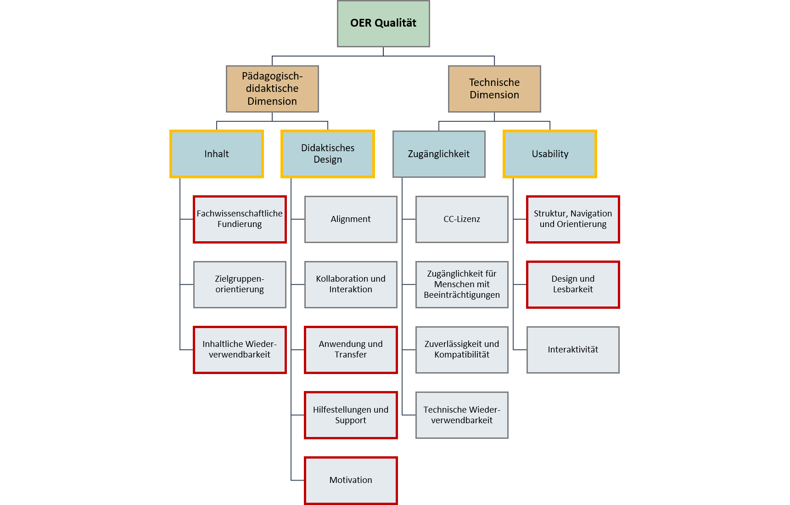

# 4 Educational metadata

## 4.1 What is educational metadata?

<table>

<colgroup>

<col style="width: 6%" />

<col style="width: 93%" />

</colgroup>

<tbody>

<tr class="odd">

<td>

❓
</td>

<td>

<strong>Questions</strong>
</td>

</tr>

<tr class="even">

<td>

</td>

<td>

<ul>

<li>

What exactly is educational metadata?

</li>

<li>

What is the potential and what are the challenges presented by educational metadata?

</li>

</ul>

</td>

</tr>

</tbody>

</table>

Educational metadata serves to characterise and contextualise, for example, educational resources and their intended reuse in learning contexts, learning environments and the associated learning processes. It comprises diverse aspects relevant to the shaping of both teaching and learning. For example, educational resources can be described by metadata statements\[^15\] that identify characteristics of learning processes or learning environments and are associated with their intended use ([Sutton 2004, 145](#ref-suttonmes2004)).

This broad definition allows educational, pedagogical, psychological, methodological and (subject/media-specific) didactic perspectives of educational resources and their contexts to be summarised in an interdisciplinary manner as a metadata category, which thus also includes “didactic metadata” or “pedagogic metadata”. In fact, the terms *educational metadata*, *pedagogic metadata* and *didactic metadata* are frequently used interchangeably and their definitions are so similar as to render them virtually indistinguishable. The term “educational metadata” is therefore used collectively for all of these concepts within this compendium. Educational metadata is particularly relevant for teachers, learners, educational researchers and multipliers in the training and education system, as well as for people who are involved in the creation and implementation of educational services.

This chapter primarily covers descriptive educational metadata that functions as attributes for educational resources. It should be noted that other descriptive, structural or administrative metadata can also fulfil important didactic functions in teaching/learning contexts and processes, as is demonstrated in this compendium by way of examples. Therefore, a distinction is also made here between educational metadata and other metadata that fulfils a didactic function in specific usage scenarios. Since the latter category can be quite extensive due to the multifaceted applications, only a few examples are mentioned here. Educational metadata, however, can also make content-, context- and structure-related attributions (cf. [Types of metadata](#was-sind-typen-von-metadaten)).

Knowledge organisation systems, such as didactic taxonomies, typologies and ontologies \[Norbert Meder ([2006](#ref-mederwndwvl2006))\] \[Ohly, Rahmstorf, and Sigel ([2000](#ref-ohlyguwnafwwuiptdsigfwh22s12000))\] \[Jan M. Pawlowski ([2002](#ref-pawlowskimdk2002))\] \[Schmiech ([2006](#ref-schmiechdozodoal2006))\] \[Swertz ([2004](#ref-swertzddlfahlmw2004))\] \[Swertz ([2005](#ref-swertzwdop2005a))\], can be used as a basis to describe learning objects based on didactic categories – for example, by assigning [subjects](#fach--und-themenzuordnung), [learning objectives](#lernvoraussetzungen-lernziele-und-lernkontrollen), associated knowledge types (e.g. declarative, procedural, situational, sensorimotor), media presentation forms (see also [resource types](#ressourcentyp-medientyp)) or even subject-related and logical relationships between topics, which also reflect an intended progression of the learning content (knowledge sequencing). We thus have description approaches not only for the shape and structure of the learning content, but also for the relationships between content, didactic usage scenarios and the embedding of content in different educational contexts.

A wide range of didactic categories can be described, such as:

- Teaching/learning models (e.g. instruction models with phasing of lessons)
- Teaching/learning theories (e.g. connectivism, constructivism, cognitivism, behaviourism)
- Teaching/learning objectives (e.g. skills to be developed)
- Teaching/learning levels (e.g. competency level models, differentiation models)
- Teaching/learning groups (e.g. groups of persons for which a resource has been didacticised)
- Teaching/learning formats (e.g. self-directed or guided learning processes)
- Teaching/learning contexts (e.g. temporal, organisational and spatial context)
- Teaching/learning scenarios (e.g. sequencing of learning activities)
- Teaching/learning methods (e.g. didactic principles, types of interaction)

**Heterogeneity of the usage contexts of educational resources**

Although the education market is continuously developing, it is still the case that, from the point of view of teachers and learners, relevant didactic characteristics of resources are not or only inadequately described ([Tavakoli et al. 2020, 1](#ref-tavakoliqpoerma2020)). The vast number of possible usage contexts increases the need for resources and specific metadata so that targeted searches can be performed to identify relevant resources among the ever-increasing diversity of information. The relevance of resources for learners and teachers is dictated by numerous factors, with the respective context of the intended reuse being one particular example. For instance, the specific learning environment, level of education, linguistic backgrounds, available learning time, technological and legal requirements and many other criteria can be crucial to the successful use of a resource. In addition, location- and time-independent learning as well as self-directed learning processes have become increasingly relevant as a result of the ongoing digitalisation.

**Attributes and values for the provision and exchange of data: one size fits all?**

In the following, a number of attributes are presented and described that are either already covered in metadata standards, have been partially conceptualised by subject matter experts, or are desired by teachers and learners but have yet to be widely adopted or be subject to any broad consensus. Reference is also made to value lists that are already available for reuse in various stages of development or have been deemed relevant by experts without yet being suitable for use as a controlled vocabulary. It is important to note that some of the value lists specified below are designed more for data exchange between distributed systems and less for the provision of elaborated metadata in local repositories or educational services. The value lists may therefore be underspecified, depending on the heterogeneity of those parties who have agreed on the attributes and value lists for exchange purposes. Within specific services, it may be expedient to use much more extensive attributes and value lists – for example, to enable specific recommendation functions or to compile collections that address the diverse needs of different target groups. However, it is not always possible to reflect this variety of local characteristics in a data exchange. For instance, when exchanging data, the elaborated, service-internal [vocabulary for the learning resource types of WirLernenOnline](http://w3id.org/openeduhub/vocabs/new_lrt/) would need to be mapped onto a vocabulary such as that used in one of the metadata profiles LOM-HS-OER or AMB.

While it might seem obvious to simply have every service use the same attributes and value lists, this would actually be functionally restrictive and inhibit both competition and innovation. Using only standardised value lists in a service would be to the detriment of usability and the user experience as whole since these value lists frequently possess a certain level of abstraction. However, this does not rule out the possibility of mapping these specific attributes and values onto standard-compliant data and making them available via open interfaces. To minimise the loss of information, the transfer and harmonisation of metadata between different systems should be considered at an advanced stage.

<table>

<colgroup>

<col style="width: 6%" />

<col style="width: 93%" />

</colgroup>

<tbody>

<tr class="odd">

<td>

💡
</td>

<td>

<strong>Summary</strong>
</td>

</tr>

<tr class="even">

<td>

</td>

<td>

<ul>

<li>

Educational metadata encompasses diverse aspects of educational resources and contexts (e.g. learning environments) that are relevant to teaching/learning processes.

</li>

<li>

A distinction can be made between educational metadata and metadata that fulfils a didactic function in specific usage scenarios.

</li>

<li>

(Elaborated) vocabularies and harmonisation to support interoperable data exchange should be considered at an advanced stage.

</li>

</ul>

</td>

</tr>

</tbody>

</table>

## 4.2 Existing educational metadata fields

<table>

<colgroup>

<col style="width: 6%" />

<col style="width: 93%" />

</colgroup>

<tbody>

<tr class="odd">

<td>

❓
</td>

<td>

<strong>Questions</strong>
</td>

</tr>

<tr class="even">

<td>

</td>

<td>

<ul>

<li>

Which educational metadata fields already exist in the present standards and how are they used?

</li>

</ul>

</td>

</tr>

</tbody>

</table>

### 4.2.1 Subject and topic assignment

In the institutional education sector, the assignment of an object to a subject is essential and is frequently one of the first search approaches employed ([Tischler, Heck, and Rittberger 2022, 259](#ref-tischlernunmbsubob2022)). In the study conducted by Tischler et al., the assignment of the subject of study is identified by those surveyed as relevant and easy to describe ([Tischler, Heck, and Rittberger 2022, 258](#ref-tischlernunmbsubob2022)). In an earlier survey on the part of LRMI working groups, more than 80% of the teachers surveyed named the specification of content and subject areas as one of the most helpful pieces of information ([Winter Group 2014](#ref-wintergrouplsrj2umoo2014)). It should be noted, however, that the closed answer options available at that time do not reflect the current market situation. In a survey conducted by JOINTLY.info, only around 46% (n = 46 responses) found filtering by “subject” at least “slightly helpful” ([JOINTLY.info 2021](#ref-jointly.infosuinuo2021)). There are several possible reasons for this. For example, answers in this survey had to be provided for a combination of the two fields “subject” and “class” and could not be separated. The respective search intentions, vocabulary, interface design, as well as the presented content and its tagging, which presumably served as the background against which the answers in the survey were made, may also have differed.

For the reasons outlined above, attributes for assigning a subject or subject area also exist in the widely adopted metadata standards. In this case, the attribute focuses on the content structure of the lesson. A range of machine-readable subject classifications already exist for schools and universities.

**Logical relationships**

By modelling logical relationships within and between subject areas (and topics), the intended progression, including the sequencing of learning content, is prestructured. This facilitates the interconnection of knowledge, which is relevant, for example, when implementing recommender systems. Logical relationships can support factual analyses of lesson plans and teaching concepts.

Example: [Graph-based search from GeoGebra](https://www.geogebra.org/materials)

**Interdisciplinarity and cross-discipline topics**

The assignment of interdisciplinary materials remains a particular challenge \[Tischler, Heck, and Rittberger ([2022](#ref-tischlernunmbsubob2022)), p. 260\]. When there is a tendency to assign a large number of subjects to an object, this may indicate a low accuracy of the corresponding classification system. The objects in such cases frequently relate to cross-discipline topics or competencies (see also the related discussions regarding the [Hochschulfächersystematik (classification for subject groups, study areas and study subjects)](https://github.com/dini-ag-kim/hochschulfaechersystematik/issues/26) and the [description of cross-discipline core competencies](https://gitlab.com/oersi/oersi-etl/-/issues/251)). Depending on the specific application, it makes sense to use the value “interdisciplinary” in a controlled vocabulary, to store a dedicated catalogue as a value list or to use alternative metadata, such as [learning prerequisites, objectives and controls](#lernvoraussetzungen-lernziele-und-lernkontrollen). The OERSI search index substitutes the value “interdisciplinary” if more than three categories on the first level of the subject classification are used \[hbz and TIB ([2024](#ref-hbzocos2024))\]. Any decision should take into account the resulting implications for the filter logic within a portal (see chapter “[Vocabularies for filtering search results](#vokabulare-zur-filterung-von-suchergebnissen)”).

Examples of cross-discipline topics and interdisciplinarity:

- Innovation processes at educational institutions
- Media-related (higher) education development
- Basic IT education
- Educational sciences
- Education for Sustainable Development (ESD), sustainability
- Digitalisation and media skills
- Inclusion/heterogeneity (e.g. as a media/special education concept that applies to various subjects in conjunction with specialist scientific perspectives)
- Interdisciplinary teaching, combination subjects such as mathematics, IT, natural sciences and technology (MINT) or science, technology, engineering and mathematics (STEM) (i.e. different combinations of subjects)

**Tiered and multidisciplinary study programmes**

A further challenge encountered with established subject classification systems is presented by study programmes that encompass several phases, including multidisciplinary teacher training programmes that involve a combination of subject-specific studies, subject didactics (i.e. teaching methodology) and educational sciences.

*Practical example: teacher training programmes*

Therefore, assigning the subject “mathematics” to a resource would be insufficient as the sole criterion for differentiating between subject-specific studies and subject didactics, since it is impossible to differentiate whether the resource is more relevant for subject-specific studies or subject didactics target groups (e.g. teacher training students) – unless both cases are true anyway. In addition, there are currently six different types of teaching careers (see table “KMK teaching careers” in the [Degrees](#abschlüsse) section) \[KMK ([2023](#ref-kmkaa2023))\], meaning that the target group of teacher training students must also be considered in more detail. It should be noted that teaching career type 2 for “general teaching careers at primary level and all or individual lower secondary level school types” has lost virtually all relevance since 2022, as it is no longer offered in any German state (Centre for Higher Education, 2024a). However, to avoid any overloading of the individual subject classifications, a distinction between subject-specific studies and didactics is usually omitted, and separate values, for example, for “mathematics” as a field of study and “mathematics didactics” are used instead.

But how do people involved in teacher study programmes and training find relevant, subject-specific didactic resources?

If no differentiation arises from the allocation of concrete didactic topics, it is partly achieved by specifying [target groups](#zielgruppen), designating [learning objectives](#lernziele) and allocating the relevant [degrees](#abschlüsse) (Bachelor of Science, Bachelor of Education, teaching career types) or by means of curricula (e.g. KMK standards for teacher training).

**Attributes in metadata standards**

- LRMI/schema.org: [about](https://schema.org/about)
- AMB: [about](https://dini-ag-kim.github.io/amb/20231019/#about)
- LOM: 9.1 discipline
- Learning Metadata Terms (LMT): [dct:subject](https://www.dublincore.org/specifications/dublin-core/dcmi-terms/#http://purl.org/dc/terms/subject) (DCMI Metadata Terms)
- [dfnEduPerson](https://web.archive.org/web/20231215062855/https://doku.tid.dfn.de/de:elearning_attributes)
  - Four attributes, three with a Destatis value range: group of study branches, group of field of studies, single field of study, field of study as it is named at the local institution
  - Two combined attributes with Destatis value range: field of study in correlation with the final degree, type of a study branch

**Value lists**

The following value lists are suitable for inclusion or reuse:

- School subjects:

  - [School subjects](http://w3id.org/kim/schulfaecher/), DINI-AG-KIM, [repo](https://github.com/dini-ag-kim/schulfaecher)
  - [School subjects](http://w3id.org/openeduhub/vocabs/discipline/), WirLernenOnline, [repo](https://github.com/openeduhub/oeh-metadata-vocabs)
  - [School subjects](https://mundo.schule/search), Sodix/Sodis
  - [Subject area classification](https://vocabs.sodix.de/index.de.html), Sodix/Sodis
  - [School subjects](https://digitallearningtools.de/api/subjects?q=), Digital Learning Lab / Tools
  - [EUN subject values](http://europeanschoolnet-vbe.lexaurus.net/vbe/browse), European Schoolnet Vocabulary

- Training occupations:

  - [Directory of recognised training occupations 2023 (BIBB)](https://www.bibb.de/dienst/publikationen/de/19128)

- Higher education subjects:

  - Federal Statistical Office (Destatis): [classification for subject groups, study areas and study subjects](https://www.destatis.de/DE/Methoden/Klassifikationen/Bildung/studenten-pruefungsstatistik.pdf) (KIM [repo mirror](https://github.com/dini-ag-kim/destatis-schluesseltabellen) of the official key tables (CSV))
  - [Destatis classification for subject groups, study areas and study subjects](https://w3id.org/kim/hochschulfaechersystematik/scheme), DINI-AG-KIM, [repo](https://github.com/dini-ag-kim/hochschulfaechersystematik), also provided by Open Edu Hub / WirLernenOnline as the “[Hochschulfächersystematik](http://w3id.org/openeduhub/vocabs/hochschulfaechersystematik/)” (subject classification system for higher education)

- Subject area classification systems:

  - [ELIXIER classification](https://web.archive.org/web/20221006161235/https://www.bildungsserver.de/elixier/elixiersystematikliste.php)
  - [LOM-EAF](http://agmud.de/eaf-erweitertes-austauschformat/) (AG MuD) ([repo mirror](https://github.com/openeduhub/oeh-metadata-eaf-sachgebietssystematiken))
    - [Subject area classification](https://web.archive.org/web/20240222094846/http://agmud.de/wp-content/uploads/2021/09/eafsys.txt) (txt)
    - [Subject area classification](https://web.archive.org/web/20240227120643/http://agmud.de/sachgebietssystematik/) (Excel, PDF)

- Teaching topics for school subjects:

  - [Taxonomy of curricular topics](http://w3id.org/openeduhub/vocabs/oeh-topics/5e40e372-735c-4b17-bbf7-e827a5702b57), WirLernenOnline, [repo](https://github.com/openeduhub/oeh-metadata-vocabs)

- Cross-educational subjects & topics:

  - [Subjects](https://www.re3data.org/browse/by-subject/): Re3Data.org

  - [Subjects](http://id.loc.gov/authorities/subjects): MARC 21

  - [EuroVoc](https://eur-lex.europa.eu/browse/eurovoc.html): Multilingual and multidisciplinary thesaurus of the EU

  - [LRE Thesaurus](http://europeanschoolnet-vbe.lexaurus.net/vbe/browse) (European Schoolnet Vocabulary),

  - [UNESCO Thesaurus](https://vocabularies.unesco.org/browser/thesaurus/en/) for subject analysis and retrieval of documents based on multidisciplinary terminology, including: [scientific disciplines](https://vocabularies.unesco.org/browser/thesaurus/en/page/?uri=http%3A%2F%2Fvocabularies.unesco.org%2Fthesaurus%2Fdomain2), also available in JSON-LD, Turtle, RDF/XML format.

  - Skosmos: branches of science/art, (historic) study programmes:

    - [Branches of science/art](https://voc.uni-ak.ac.at/skosmos/disciplines/de/)
    - [Study programmes](http://base.uni-ak.ac.at/vocabulary/study_programmes)
    - [Historic study programmes](https://voc.uni-ak.ac.at/skosmos/basevoc/en/page/historic_study_programmes)

### 4.2.2 Learning prerequisites, objectives and controls

The introduction of educational standards and Bologna reforms marks a paradigm shift in the education system towards competence-based learning. The focus is thus increasingly placed on the learning objectives and competencies of learners. As a result, it is no longer just about the standardisation of learning content, but rather about which competencies learners have acquired at the end of a learning unit, both in terms of theoretical knowledge (cognitive perspective) and its practical implementation (functional perspective) ([Kopf, Leipold, and Seidl 2010](#ref-kopfkluphfl2010)).

According to the results of international comparison studies (e.g. TIMMS, PISA), the institutional education system has gradually switched to objective- and competence-oriented didactics. “Learning prerequisites”, “learning objectives” and “learning controls” serve as suitable attributes for mapping this competence orientation in the metadata for objects\[^16\].

For 57% of teachers, the assignment of educational standards is one of the most helpful criteria when searching for resources ([Winter Group 2014, 8](#ref-wintergrouplsrj2umoo2014)). This assignment can be made based on competency structure or competency level models (e.g. reading competency level model in IGLU). The attributes focus on the target structure of lessons and have long been described as fundamental for educational resources ([Sutton 2004, 145](#ref-suttonmes2004)), much like an orientation towards operationalisable learning objectives or the adaptation of learning environments to the learning prerequisites of learners ([Schulmeister 2000, 40f](#ref-schulmeisterdahl2000)).

Attributes that focus on learning objectives are also relevant for the implementation of adaptive learning paths. In this context, the connection with official curricula or other competency catalogues is particularly promising, provided that these exist in machine-readable format – something which is not currently the norm. In the institutional education sector, competency frameworks frequently form the basis for teachers’ work. Therefore, linking objects to these catalogues can directly support the work of teachers, while also enabling competency-oriented searches.

In this regard, it should be noted that not all resources were developed with a view to specific competency catalogues and that any subsequent allocation may not always be expedient. Competency catalogues that are quite general in nature also carry the risk of frequent assignment, since many competencies can also be furthered implicitly or indirectly by different resources. The assignment should therefore focus on the intended learning outcomes of the resources that are primarily addressed.

**Example bases for value ranges**

**International**

[OERCommons](https://oercommons.org/browse) enables filtering according to educational standards, e.g. “[Standards for the 21st-Century Learner](https://web.archive.org/web/20240126221501/https://standards.aasl.org/wp-content/uploads/2017/11/AASL-Standards-Framework-for-Learners-pamphlet.pdf)” of the American Association of School Librarians (AASL). The [Educational CAD Model Library](https://www.cadlibrary.org/) also uses the specification of exemplary learning objectives and the orientation towards educational standards (e.g. [Common Core State Standards](https://corestandards.org/)) as metadata \[Bull et al. ([2023](#ref-bullmseo2023))\].

*Common Education Data Standards (CEDS)*

The [Common Education Data Standards](https://ceds.ed.gov/) (CEDS) initiative is a United States project for the development of voluntary, common standards for educational data. It aims to harmonise the exchange and semantics of data between educational institutions and sectors. CEDS publishes a comprehensive data model for educational data. The standards are subject to continuous development by the CEDS community. Version 1.2 was released in February 2024.

**Norway**

A good example for the institutional provision of school curricula in machine-readable format can be found in Norway. Here, the curricula can be accessed via a [REST interface or a SPARQL query](https://www.udir.no/om-udir/data/kl06-grep) ([archive](https://web.archive.org/web/20240304115600/https://www.udir.no/om-udir/data/kl06-grep)).

**Europe**

\*Within Europe, a catalogue that is of particular relevance is [ESCO (European Skills, Competencies and Occupations)](https://esco.ec.europa.eu/en/classification/skill_main). It is maintained by the European Commission and geared specifically towards the European labour market and vocational training. This catalogue is available in machine-readable format (RDF) and can be accessed via an API interface.

*Europass*

The Europass tool is intended to serve as a portfolio, which also includes digital credentials and certificates of competence. It takes into account previous developments such as the Qualification Dataset Register ([QDR](https://europa.eu/europass/de/stakeholders/qdr/documentlibrary)) and related application profiles:

- European Digital Credentials for Learning (EDC):  
  Application profile for accreditation
- Learning Opportunities and Qualifications (LOQ):  
  Application profile for learning opportunities and qualifications

*European Qualifications Framework* ([EQF](https://europa.eu/europass/en/europass-tools/european-qualifications-framework), [EQR](https://europa.eu/europass/de/europass-tools/europaeischer-qualifikationsrahmen))

The European Qualifications Framework aims to safeguard the comparability of qualifications, promote geographical and professional mobility and facilitate lifelong learning.

**Switzerland**

The [Swiss curriculum portal](https://www.lehrplan21.ch/) provides curricula for the various cantons, which are used to tag learning materials in the [zebis.ch portal](https://www.zebis.ch/unterrichtsmaterial), for example.

**Germany**

In many cases, the standardisation of competencies and curricula first takes place at a wider structural level before being adapted to the smaller levels, for example by individual states or at institutional level.

<em>Examples of structural levels:</em>

<ul>

<li>

World federation
</li>

<li>

Federation of countries (e.g. European Union)
</li>

<li>

Country
</li>

<li>

(e.g. nationwide framework)
</li>

<li>

Federal state
</li>

<li>

(z. B. state-specific framework)
</li>

<li>

Institution (e.g. for internal school frameworks)
</li>

</ul>

*EU standards*

If different reference frameworks are created at European level, for example, and these then have to be adapted at national level or, in the case of a federalist education system, at the level of individual states, this fragmentation has a direct impact on the use of metadata.

*Qualifications frameworks for lifelong learning*

The German Qualifications Framework for Lifelong Learning ([DQR](https://www.dqr.de/dqr/de/home/home_node.html)) as a national qualifications framework ([NQF](https://europa.eu/europass/de/europass-tools/europaeischer-qualifikationsrahmen/nationalen-qualifikationsrahmen)) is linked to the European Qualifications Framework for Lifelong Learning ([EQF](https://europa.eu/europass/de/europass-tools/europaeischer-qualifikationsrahmen)) to support the recognition of qualifications and enable the transfer between different education systems (cf. [Europass](https://europa.eu/europass/)). The qualifications frameworks contain individual qualification objectives (e.g. competencies as learning outcomes).

*KMK standards*  
The national educational standards of the KMK define which skills and competencies students should acquire by a specific year. The state-specific framework curricula further specify these national requirements for individual school types and years, prepare them for the different situations in lessons and add any state-specific requirements. The requirements of the framework curriculum are then applied to a pedagogic action concept (internal school curriculum).

*Machine-readable curricula*

Since no standard exists for the presentation of curricula, but various parties have expressed a need for the development of such a standard, the [DINI-AG-KIM Curricula](https://wiki.dnb.de/display/DINIAGKIM/Curricula-Gruppe), as a working committee of various institutions, has taken up this challenge. A (prototype) [data model for representing curricula](https://github.com/dini-ag-kim/modell_lehrplaene) in the school sector has been created and is currently undergoing further development by parts of the group in the form of a [curriculum ontology](https://w3id.org/curriculum/). Related initiatives include the [Curriculum Navigator](https://curriculum.schulcampus-rlp.de/navigators/1) ([Schulcampus](https://cloud.schulcampus-rlp.de/edu-sharing/components/search) RLP) or, in an international context, the [K-12 Open Content Exchange](https://k12ocx.github.io/k12ocx-specs/) project. The aim is to provide structured data for curricula in order to establish curricular relationships between educational resources as well as connections between different curricula.

*Assignment of learning objectives and competencies*

A competence can be assigned in two ways:

1)  Assignment of a *reference*, e.g. by defining the competence in a closed vocabulary with a unique identifier
2)  Assignment of a specific *value*, e.g. by storing the description of the competence as text in the metadata

While the second approach may initially appear simpler, it is certainly worth considering the added value offered by the first variant, such as the resulting referential integrity, including the consistency of the metadata, particularly in the case of changes or updates to the competencies in the source frameworks. Furthermore, the first variant allows relationships to be established between competencies from different frameworks. Consequently, the search context can be expanded by interconnecting the frameworks in this manner.

Semantic relationships can be used to address the deviations in content between different standards. Such mappings are also metaphorically referred to as crosswalks ([Sutton 2004, 148–49](#ref-suttonmes2004)). The metadata is of particular significance for the creation of adaptive learning paths.

General requirements can be found regarding the definition of competencies, including the general description of the competence, the type of competence (knowledge, ability, attitude, etc.), the relationships between individual competencies, a measurable level of competence as well as a taxonomy or ontology for structuring the competences ([Sitthisak and Gilbert 2011, 22](#ref-sitthisakiabcm2011)).

*Further practical examples for the use of competence frameworks*

The projects [WirLernenOnline](https://suche.wirlernenonline.de/), [ComeIn](https://comein.nrw/portal/ressourcen/) along with some competence networks of [lernen.digital](https://lernen.digital/) use the European Framework for the Digital Competence of Educators (DigCompEdu) as well as the German framework “Competencies in the Digital World” of the Standing Conference of the Ministers of Education and Cultural Affairs (KMK) to define learning objectives for educational resources.

In addition, state-specific versions of DigCompEdu are used, including the “Orientation framework for teacher training in NRW” (Eickelmann, 2020). To improve the findability of resources nationwide, the individual competencies from the orientation framework were linked to the EU framework at the superordinate structural level via relationships. Such mapping of competencies also takes place between the Germany-wide framework of the KMK and the state-specific version in the “Media competence framework NRW” ([Blodau et al. 2019](#ref-blodaumn2019)).

Although resources in a federalist education system are thus described with state-specific values, the basic idea behind this approach is to establish connections to higher-level frameworks so that resources can also be effectively found at wider structural levels.

A similar principle is pursued for the implementation of machine-processable curricula so that resources that were developed for or linked to a state-specific curriculum are easier to find in other states, not least because the means of access differ depending on the different curricula. Thus, the artificial structural boundaries of the education system are, in some respects, broken down and resources can be reused more easily in comparable contexts.

**Further notes on usage**

Further specification of the attributes for each usage scenario is advisable. Linking competencies with certificates is a promising approach. This necessitates the authorised publication of the corresponding competency catalogues and their integration with the issuing authorities.

A study by Tavakoli et al. comparing the presence of metadata attributes before and after a quality control demonstrates that the “level” attribute, which in this case can refer to [prerequisites and prior knowledge](#lernvoraussetzungen-und-vorwissen) or [qualifications](#abschlüsse), seems difficult for the creators or describers to assign. This is indicated by the fact that this particular attribute frequently only exists after a “quality control”, but is otherwise usually missing \[Tavakoli et al. ([2021](#ref-tavakolimaoer2021)), p. 628\].

**Standards associated with competencies:**

- [CASE](https://www.imsglobal.org/activity/case): format for the representation and exchange of competency frameworks and learning objectives (1EdTech)
- [Data model for representing curricula](https://github.com/dini-ag-kim/modell_lehrplaene) (DINI-AG-KIM) and the [curriculum ontology](https://w3id.org/curriculum/) that builds on this model
- [Ed-Fi Assessment API and Unifying Data Model](https://techdocs.ed-fi.org/display/EFDSRFC/ED-FI+RFC+15+-+ASSESSMENT+OUTCOMES+API) (UDM): data model and interface for the exchange of assessment metadata
- [Data model for describing and referencing competency definitions](https://ieeexplore.ieee.org/document/4445693) (Standard for Learning Technology-Data Model; IEEE 1484.20.1-2007) (IEEE, 2008)

**Value ranges in practice**

While various taxonomies exist for learning objectives based on learning theory models (e.g. Gagné, Ausubel, Bloom, Anderson, Krathwohl) \[Mayer, Hertnagel, and Weber ([2009](#ref-mayerlie2009)), pp. 29–59\], these are not generally used as values for this field, but instead support theoretical considerations regarding the operationalisation of a [level](#niveaustufe).

Learning objectives can:

- Be formulated on the basis of operators (see also [level](#niveaustufe)).
- Come from different knowledge dimensions (e.g. factual knowledge, conceptual knowledge, procedural knowledge and metacognitive knowledge) \[Anderson and Krathwohl ([2001](#ref-andersontltarbteo2001))\] (see also [level](#niveaustufe)).
- Serve as advance organisers for orientation in the learning process.
- Have varying degrees of abstraction (target objectives, rough objectives, detailed objectives) \[Möller ([1976](#ref-moellertlmupl1976)), p. 80\]
- Support independent control of learning success.
- Be categorised into cognitive, affective, psychomotor and social learning objectives ([Jan Martin Pawlowski 2001, 47](#ref-pawlowskieevzecl2001)).

In practice, the values in the fields “learning prerequisites,”learning objectives” and “learning controls” frequently take the form of free text descriptions. Only recently have we begun to see an increased use of controlled vocabularies here. The use of references to competencies improves the target-oriented accessibility, comparability and selection of suitable resources and simplifies the creation of teaching/learning paths by establishing relationships between resources based on the individual learning prerequisites, learning objectives and learning controls.

**Value lists for integration or reuse**

*General*

- [European Skills, Competencies and Occupations (ESCO)](https://esco.ec.europa.eu/de)
- Language skills/knowledge
  - [Language levels](http://w3id.org/openeduhub/vocabs/languageLevel/), Open Edu Hub / WirLernenOnline according to the Common European Framework of Reference for Languages ([CEFR](https://www.europaeischer-referenzrahmen.de/))
- Lumina Foundation’s Degree Qualifications Profile (DQP) (Categories of Learning) as part of the [Common Education Data Standards](https://ceds.ed.gov/elements.aspx): Specialized Knowledge, Broad and Integrative Knowledge, Intellectual Skills, Applied and Collaborative Learning, Civic and Global Learning
- 4Cs of 21st Century Learning ([P21 2019](#ref-p21f2cld2019)) \[Pfiffner, Sterel, and Hassler ([2021](#ref-pfiffner4udkcuh2021))\]

*Digitalisation-specific competencies*

- [Digital Competence Framework for Educators](http://w3id.org/openeduhub/vocabs/digCompEdu/) (DigCompEdu)\[European Commission. Joint Research Centre., Redecker, and Punie ([2017](#ref-europeancommission.jointresearchcentre.efdced2017))\], Open Edu Hub / WirLernenOnline / ComeIn

  - [Orientation framework for teacher training in NRW](http://w3id.org/openeduhub/vocabs/orientierungsrahmenNRW/), Open Edu Hub / WirLernenOnline / ComeIn \[Eickelmann ([2020](#ref-eickelmannldwofluln2020))\]

- [4D Competencies Framework](https://curriculumredesign.org/framework/) (Center for Curriculum Redesign) \[CCR ([2020](#ref-ccrrc2ce2020))\], which defines competencies in the age of AI; v1.2 was published in January 2024 ([xlsx Download](https://web.archive.org/web/20240312154129/https://curriculumredesign.org/wp-content/uploads/4D-Competencies-Framework-1.2.xlsx))

- TPACK model \[Herring, Mishra, and Koehler ([2016](#ref-herringhtpckte2016))\]

  - [UDE model:](https://w3id.org/comein/vocabs/ude-modell/)[an integrative model of digitalisation-specific competencies for teacher training](https://w3id.org/comein/vocabs/ude-modell/) \[Beißwenger et al. ([2020](#ref-beisswengerimdkfl2020))\]

- [Competencies in the digital world (KMK)](http://w3id.org/openeduhub/vocabs/digitalCompetencies/), Open Edu Hub / WirLernenOnline

> [Competencies in the digital world (KMK)](http://w3id.org/kim/kmk-vocabs/digitalisierungsbezogene-kompetenzen/), KIM
>
> [Competencies in the digital world (KMK)](https://vocabs.sodix.de/index.de.html), SODIX

- [Media competence framework NRW](http://w3id.org/openeduhub/vocabs/medienkompetenzrahmenNRW/), Open Edu Hub / WirLernenOnline / ComeIn
- [DaZKom:](http://w3id.org/comein/vocabs/dazkom/)[a model of professional competencies of prospective teachers in the field of German as a foreign language](http://w3id.org/comein/vocabs/dazkom/), ComeIn

*Educational standards and curricula-oriented value lists*

- School: curricula of the federal states

  - Educational standards (IQB) ([repo](https://github.com/iqb-vocabs/iqb-vocabs.github.io)); the IQB publishes educational standards on Github as controlled vocabularies in SKOS
  - [Schulcampus RLP](https://cloud.schulcampus-rlp.de/edu-sharing/components/search), [Curriculum Navigator](https://curriculum.schulcampus-rlp.de/navigators/1) – digital curricula and framework plans
  - [Competence browser](https://kompetenzbrowser.de/) of the Institut für Schulqualität der Länder Berlin und Brandenburg e. V. (ISQ)
  - [Media Competence Navigator](https://mk-navi.mebis.bycs.de/mctool/schooltypes) (LehrPlan Plus, mebis, Bavaria)

- Higher education: standards and module catalogues

  - [Higher Education Compass](https://www.hochschulkompass.de/)
  - [KMK standards for teacher training: Educational sciences (16/12/2004, amended on 16/05/2019)](http://w3id.org/kim/kmk-vocabs/bildungswissenschaften/), KIM

- Elementary level: curricula and education plans:

  - [Collection of plans for different states](https://www.kindergartenpaedagogik.de/fachartikel/bildung-erziehung-betreuung/1951/)

- Curricular strategies for MINT/STEM schools \[Jimenez Iglesias et al. ([2018](#ref-jimeneziglesiasessrkec2018))\] (used in the [Scientix](https://www.scientix.eu/resources) portal, for example)

- [NextGeneration Science Standards](https://www.nextgenscience.org/) (used in the [TeachEngineering](https://www.teachengineering.org/curriculum/browse) portal, for example)

- Basic didactic models (see appendix “Basic didactic models of learning as a goal-oriented approach to lesson design”)

#### 4.2.2.1 Learning prerequisites and prior knowledge

This attribute lists the knowledge, skills or learning prerequisites that are required to use the resource effectively. This information helps teachers and learners to select resources that reflect the current learning level. The attribute thus supports the condition analysis of lesson planning.

The respondents to the survey conducted by Tischler et al. consider this attribute to be relevant and easy to describe ([Tischler, Heck, and Rittberger 2022, 258](#ref-tischlernunmbsubob2022)). This assessment should initially be viewed critically, however, not only due to the lack of tried-and-tested value ranges and machine-readable representations but also because the attribute has barely been used in established repositories. It can be assumed that the respondents are referring to a free-text format, which is easier to define with regard to a specific subject and topic, but is more difficult to reuse in terms of interoperability and machine readability. Other experts also agree on the general relevance of the field, but point out that corresponding machine-readable representations are still missing ([Pohl, Mausch, and Henning 2017, 66](#ref-pohlwhwdoeriwam2017)).

The actual implementation and integration can therefore raise some questions: What specific skills, for example, are required for a preliminary mathematics course at university? Should all skills from addition to subtraction, natural numbers up to 10, natural numbers up to 100, etc. be listed? Do language skills also have to be taken into account? After all, exercises are set in a specific language and at a specific level. It seems reasonable that certain learning prerequisites (e.g. minimum standards for the lowest assigned level of education) can be considered to have been met for educational resources, meaning that these should not be listed.

[ESCO (European Skills, Competencies and Occupations)](https://esco.ec.europa.eu/de) serves as a more specialised catalogue and distinguishes between optional and necessary competencies.

**Attributes in metadata standards**

- LRMI, schema.org, AMB: [competencyRequired](https://schema.org/competencyRequired)
- LOM: 9.1 Classification / Purpose: prerequisite

**Value lists for integration or reuse**

- [European Skills, Competencies and Occupations (ESCO)](https://esco.ec.europa.eu/de)
- Other value lists: see the [introductory chapter](#lernvoraussetzungen-lernziele-und-lernkontrollen)

#### 4.2.2.2 Learning objectives

The specification of learning objectives provides a summary of the knowledge, skills, attitudes or competencies that learners will acquire or develop by using the resource. This specification helps learners to understand the usefulness of the resource and guides their learning expectations. The specification helps teachers to make targeted selections and assess the suitability of the resource for the respective target group in a specific teaching/learning context. It supports the didactic analysis of lesson plans and lesson designs.

In terms of the competencies associated with educational qualifications, this attribute supports horizontal and vertical movements within the education system, for example. Against the background of the alignment of learning objectives with educational standards, which the [IQB now also publishes in machine-readable form](https://github.com/iqb-vocabs) for the school sector, this attribute can also be used in a degree-focused manner. Different learning objectives can thus be assigned to educational qualifications. For an attribute that relates to institutional educational qualifications, see [Degrees](#abschlüsse).

In the institutional context, this attribute facilitates curriculum design, allows teachers to identify relevant resources and helps learners understand the educational context of resources.

**Attributes in metadata standards**

- LRMI/schema.org: [teaches](https://schema.org/teaches)
- AMB: [teaches](https://dini-ag-kim.github.io/amb/20231019/#teaches)
- LOM: ~ 9.1 Classification / Purpose: objective
- Learning Metadata Terms (LMT): [teaches](https://schema.org/teaches)

**Value lists for integration or reuse**

- See [introductory chapter](\l)4.2.2.3 Learning controls

This attribute can be used to reference learning objectives or competencies the achievement or acquisition of which can be verified via this resource. Resources are thus used as learning controls to report or assess the progress made by learners – for example, a test of text comprehension. In many cases, the associated learning objects take the form of quizzes, feedback/assessment activities or suitable task types from the field of e-assessment (see appendix: “Collection of additive value lists”). This attribute assists teachers with the selection and design of learning controls and constructive alignment ([Wildt and Wildt 2011, 9](#ref-wildtlpica2011)). It helps learners to find self-tests or aptitude tests and to prepare for assessments. In addition, users frequently request links to corresponding answers and accompanying materials based on this attribute.

Related tool: [Assessment Toolbox](https://assessment.unibe.ch/TestingFormats)

Related topics:

formative assessment, summative assessment, self-assessment, online assessment, study orientation, aptitude and entrance tests, [credentials](#standards-für-credentials) (in particular, specification of workloads and certification of academic achievements in a higher education context, for example via the [ECTS](https://web.archive.org/web/20240304111912/https://education.ec.europa.eu/de/education-levels/higher-education/inclusive-and-connected-higher-education/european-credit-transfer-and-accumulation-system)), constructive alignment

**Attributes in metadata standards**

- LRMI/schema.org: [assesses](https://schema.org/assesses)
- AMB: [assesses](https://dini-ag-kim.github.io/amb/20231019/#assesses)
- LOM: ~ 9.1 Classification / Purpose: skill level
- Learning Metadata Terms (LMT): [assesses](https://schema.org/assesses)
- [MERLOT](https://www.merlot.org/merlot/materials.htm): binary attribute “has learning controls” (yes/no) (hasAssignments)

**Value lists for integration or reuse**

- See [introductory chapter](#lernvoraussetzungen-lernziele-und-lernkontrollen)
- Specific for learning controls:
  - Common Education Data Standards:
    - [Assessment Type](https://ceds.ed.gov/element/000029), [Assessment Type Administered](https://ceds.ed.gov/element/000415)
    - [Assessment Purpose](https://ceds.ed.gov/element/000026)

### 4.2.3 Level

Defining a level is a recurring undertaking in the educational landscape. From a didactic perspective, a number of usage scenarios are associated with this attribute. The level is a very multifaceted attribute characterised by quite divergent operationalisation and can refer to a wide range of differentiating aspects of an object in a variety of ways. Levels can be defined to propose suitable learning resources to heterogeneous learning groups and thus support them on their individual educational journey. The established metadata standards contain suitable attributes to express this aspect.

Example usage scenarios for levels:

*Targeted learning level*

- Selection of suitable resources based on the learning level
- Heterogeneity: internal differentiation based on the learning level
- Recommender systems for individual learning journeys

*Achieved learning level*

- Issuing of certificates (educational qualifications) (cf. [credentials](#standards-für-credentials))
- Learning diagnostics: evaluation of the learning success of e-learning programmes

**Scale-based operationalisation of the level**

A common approach for this field involves the scale-based gradation of the level. In LOM, for example, there is the attribute “difficulty” (5.8.), which classifies the difficulty of the relevant learning material with regard to the expected target group based on a five-level scale (“very easy”, “easy”, “medium”, “difficult”, “very difficult”). Classifying the level in this manner has proven to be somewhat impractical, since an object can be suitable for several target groups and could therefore involve the assignment of different levels of difficulty. As a rule, however, the complexity of such multiple assignments is not technically reflected in the current repositories. As a result, these services do not benefit from this type of definition.

Furthermore, the five-level classification is frequently criticised for being too subjective and imprecise \[Abdel-Qader et al. ([2022](#ref-abdel-qaderesdbolvl2022))\] \[Tischler, Heck, and Rittberger ([2022](#ref-tischlernunmbsubob2022))\], not least because the assignment of a single value assumes the existence of a homogeneous target group \[Arnold, Kilian, and Thillosen ([2003](#ref-arnoldpmieapuefbvf2003)), p. 382\]. This is consistent with the results of the study conducted by Tischler et al., with the respondents rating the “difficulty” attribute from LOM as less useful and difficult to describe \[Tischler, Heck, and Rittberger ([2022](#ref-tischlernunmbsubob2022))\]. At the same time, reference is made to potentially more suitable attributes, including [prerequisites and prior knowledge](#lernvoraussetzungen-und-vorwissen), or more precise information, such as the [language level](#sprache-und-sprachniveau) \[Tischler, Heck, and Rittberger ([2022](#ref-tischlernunmbsubob2022)), p. 260\]. The CanCore recommendations for implementing LOM also advise against the use of the “difficulty” element in distributed environments, but also see some future potential in its application \[Fisher et al. ([2003](#ref-fishercgvec2003)), p. 18\].

*Further level description types can be found in the value lists below.*

**Implicit levels: educational level, age, degree and language**

Along with the attempt to operationalise the level directly, variations exist in which other attributes are used implicitly to indicate a level. In practice, therefore, the implicit indication of a level frequently involves the pragmatic reuse of other metadata fields the semantics of which are actually defined differently. However, depending on the underlying value lists, this can hinder the AI-assisted generation of metadata since, in this case, the machines may misinterpret the meaning of the field values due to the multiple use of a specific field or the combination of values from different fields. Yet using other metadata fields as indicators for an expected learning level represents a pragmatic approach for many portals, not least to reduce the number of attributes to be defined. Therefore, depending on the subjective expectations of teachers and learners, different metadata fields and values can serve as indicators of the level, including the educational level, age, degree or language.

*Level indicator: educational level*

The field “[educational level](#bildungsstufe-bildungskontext)” is used to implicitly indicate a level by referring to an environment in which the learning object is intended to be used and subjective expectations of a learning level are associated with this specific context. In this case, it is to be expected that a topic such as “magnetism” is, from a didactic perspective, prepared differently in the “primary” educational level than for a resource that would be found in the “secondary level II” or in a higher education context. Therefore, the lowest assigned educational level is sometimes used as an indicator for the learning level during reuse, since a didactic reduction in the learning content is to be expected.

The twillo portal, for example, uses the term “level” to refer to the metadata field “target group”, specifically in the portal’s frequently asked questions (FAQ) under “Educational metadata” \[twillo ([2024a](#ref-twillotffm2024))\]. The argumentation is comparable in the following respect: When a differentiated value list is used for groups of people who can typically be assigned to a specific level of education, the value is implicitly considered a level indicator. For example, the value list used by twillo distinguishes, among other things, between “students in the introductory study phase” and “advanced bachelor students”. This implies the existence of a possible education level “bachelor”, a correspondingly associated “degree” or even a “semester number” (comparable to a “year”) and, at the same time, subjective expectations of a possible learning level that serves as the basis for the didactic teaching of the learning content. Since twillo is geared more towards a higher education context, it is clear that several metadata items are combined here to form a single value for the “target group” field for pragmatic reasons. The [SESAM media library](https://sesam.lmz-bw.de/search) also combines educational levels and types of school as values in the “target groups” field, such as “extracurricular youth education” and “secondary level I” (see value lists below). A similar approach is employed in the [material search of the Federal Agency for Civic Education](https://www.bpb.de/lernen/materialsuche/) (bpb), which currently lists groups of people (“journalists”), types of school (“vocational school”) or educational levels (“secondary level I”) for the “target group” field.

*Level indicator: degrees*

Differentiation on the basis of [degrees](#abschlüsse) can also take place in the institutional education sector. Depending on the usage scenario, this enables recognition of acquired or targeted educational qualifications. Since different degrees usually involve different curricula, which in turn can define different minimum standards, a certain expectation of the level arises based on the targeted educational qualification.

*Level indicator: language level*

Another form of level that is necessary for the successful use of an educational resource is the [language level](#sprache-und-sprachniveau).

**Further notes on usage**

Based on subjective expectations, other level indicators that go beyond the metadata listed above are certainly conceivable. When implementing levels, it may be useful to differentiate between the various aforementioned aspects that can be expressed by means of the attribute. However, this differentiation is sometimes lost during data exchange if no specific profile is defined. Differentiation can be expressed indirectly using the relevant vocabularies and relations, provided that these are represented in a standardised manner, e.g. with SKOS.

This attribute can be particularly helpful in providing suitable offers for very heterogeneous learning groups. The main challenge faced when implementing levels lies in the accurate differentiation of the aspects for the desired level and the associated selection of suitable value lists. The wish to use this attribute in conjunction with other attributes for search and filter options presents a technical challenge that could allow different educational offerings to gain a competitive advantage while also delivering added value to those searching for resources.

**Attributes in metadata standards**

- LRMI/schema.org: [educationalLevel](https://schema.org/educationalLevel)
- LOM: Context (5.6), Difficulty (5.8)
- Learning Metadata Terms: [dct:educationalLevel](https://www.dublincore.org/specifications/dublin-core/dcmi-terms/#educationLevel)

**Possible value lists for levels**

The value lists below are suitable for integration or reuse. Specific value lists of level indicators (educational levels, degrees and language levels) can be found in the corresponding subsections.

Different competency level models or operators can also be used as value lists as the latter can be assigned to individual requirement areas and thus express a task level. However, the assignment and the operators employed are usually subject-, state- and curriculum-specific and sometimes even task/material-specific. As a result, individual assignments of operators to requirement areas will sometimes differ. The Fiete.ai community collects references to operator lists in a [collaborative list](https://www.taskcards.de/#/board/bd30eeff-164a-4e8f-8055-8a5443ae56a3/view?token=b36196af-1a7e-46d5-8c3a-7196c8b9171a). In addition, graded assessments such as “beginner”, “advanced” and “expert” are often used for the level.

**Levels (DQR/EQF)**

Qualifications or qualification types are assigned to each of the eight levels of the DQR/EQF (cf. [list of assigned qualifications](https://www.dqr.de/dqr/de/service/downloads/downloads_node.html)) ([archive:](https://web.archive.org/web/20240202153304/https://www.dqr.de/dqr/shareddocs/downloads/media/content/2023_dqr_liste_zugeordnete_qualifik_01082023.pdf?__blob=publicationFile&v=4)[2023](https://web.archive.org/web/20240202153304/https://www.dqr.de/dqr/shareddocs/downloads/media/content/2023_dqr_liste_zugeordnete_qualifik_01082023.pdf?__blob=publicationFile&v=4)) (BMBF, 2024; BMBF & KMK, 2023). They are thus comparable to [degrees](#abschlüsse) and the eight levels of the International Standard Classification of Education ([ISCED](https://web.archive.org/web/20240305160030/https://www.datenportal.bmbf.de/portal/de/G293.html)). Open Edu Hub / WirLernenOnline provides the competence levels according to the DQR as a machine-readable vocabulary: [dqrCompetenceLevels](http://w3id.org/openeduhub/vocabs/dqrCompetenceLevels/).

**Taxonomies for learning processes and differentiation reusability**

- [Pedagogy wheel according to Carrington](https://designingoutcomes.com/english-speaking-world-v5-0/),  
  based on Bloom’s Taxonomy and the SAMR model
  - Bloom’s Taxonomy \[Bloom and Engelhart ([1976](#ref-bloomtlikb1976))\], contained as [Actions](http://europeanschoolnet-vbe.lexaurus.net/vbe/browse) (Bloom) in the European Schoolnet Vocabulary
  - SAMR model \[Puentedura ([2013](#ref-puentedurasmet2013))\]
- Learning as a dynamic development model according to Dreyfus (novice, advanced beginner, competent, proficient, expert)
- Learning structure grid according to Kutzer \[Kutzer ([2002](#ref-kutzermeuvk2002))\]
- Differentiation matrix according to Sasse \[Sasse ([2014](#ref-sasseuuligu2014))\]
- Differentiation according to Wember \[Wember ([2013](#ref-wemberhipomsluvzbiu2013))\]
- Learning activities according to Laurillard \[Laurillard ([2012](#ref-laurillardtdsbpplt2012)), p. 96\]
- Educational taxonomy and taxonomy of learning objectives \[Peter Baumgartner ([2014](#ref-baumgartnertupfdv2014))\]
- Types of knowledge according to Anderson & Krathwohl in connection with cognitive processes (factual knowledge, conceptual knowledge, procedural knowledge, metacognitive knowledge), based on Bloom’s Taxonomy ([Anderson and Krathwohl 2001](#ref-andersontltarbteo2001)) \[see also appendix: “Level model and knowledge types” (according to Anderson & Krathwohl)\]

Table: *Comparison of different level models (3-level, 6-level)*

<table style="width:100%;">

<colgroup>

<col style="width: 19%" />

<col style="width: 9%" />

<col style="width: 11%" />

<col style="width: 11%" />

<col style="width: 10%" />

<col style="width: 10%" />

<col style="width: 9%" />

<col style="width: 7%" />

<col style="width: 10%" />

</colgroup>

<tbody>

<tr class="odd">

<td>

<strong>Source</strong>
</td>

<td colspan="2">

<strong>Minimum standards</strong>
</td>

<td colspan="2">

<strong>Norm standards</strong>
</td>

<td colspan="4">

<strong>Expert standards</strong>
</td>

</tr>

<tr class="even">

<td>

Requirement  area / educational  standards (KMK)
</td>

<td colspan="2">

A: Reproduce

(requirement  area I)

</td>

<td colspan="2">

B: Apply to new contexts (requirement  area II)
</td>

<td colspan="2">

C: Reflect and assess (requirement  area III)
</td>

<td colspan="2" rowspan="3">

</td>

</tr>

<tr class="odd">

<td>

Taxonomy of educational objectives (cognitive learning objectives),  Bloom (Bloom & Engelhart, 1976)
</td>

<td>

1:  Knowledge
</td>

<td>

2:  Comprehension
</td>

<td>

3: Application
</td>

<td>

4:  Analysis
</td>

<td>

5:  Synthesis
</td>

<td>

6: Evaluation
</td>

</tr>

<tr class="even">

<td>

"A Taxonomy for Teaching, Learning, and Assessment",  Anderson & Krathwohl (Anderson & Krathwohl, 2001)
</td>

<td>

1: Remember
</td>

<td>

2: Understand
</td>

<td>

3: Apply
</td>

<td>

4:  Analyse
</td>

<td>

5:  Evaluate
</td>

<td>

6: Create
</td>

</tr>

<tr class="odd">

<td>

"Levels of processing"  Marzano & Kendall (Marzano & Kendall, 2007)
</td>

<td>

Level 1: Retrieval
</td>

<td>

Level 2: Comprehension
</td>

<td>

</td>

<td>

Level 3: Analysis
</td>

<td>

Level 4: Knowledge  utilisation
</td>

<td>

</td>

<td>

Level 5: Meta- cognition
</td>

<td>

Level 6: Critical self-reflection
</td>

</tr>

<tr class="even">

<td rowspan="2">

CEFR reference framework (Council of Europe) (Trim et al., 2010)
</td>

<td colspan="2">

Basic
</td>

<td colspan="2">

Independent
</td>

<td colspan="2">

Proficient
</td>

<td colspan="2" rowspan="4">

</td>

</tr>

<tr class="odd">

<td>

A1
</td>

<td>

A2
</td>

<td>

B1
</td>

<td>

B2
</td>

<td>

C1
</td>

<td>

C2
</td>

</tr>

<tr class="even">

<td>

Astleitner (Astleitner, 2009)
</td>

<td colspan="2">

Easy
</td>

<td colspan="2">

Medium
</td>

<td colspan="2">

Difficult
</td>

</tr>

<tr class="odd">

<td>

Ziener (Ziener, 2006)
</td>

<td colspan="2">

Reproduction
</td>

<td colspan="2">

Reconstruction
</td>

<td colspan="2">

Transfer
</td>

</tr>

<tr class="even">

<td>

Metzger (Metzger et al., 1993)
</td>

<td colspan="2">

Recollection
</td>

<td colspan="2">

Processing
</td>

<td colspan="2">

Creation
</td>

<td colspan="2">

</td>

</tr>

</tbody>

</table>

**Other value list examples**

- [OpenHPI](https://open.hpi.de/courses): Beginner, Junior, Advanced, Expert
- [fobizz](https://plattform.fobizz.com/fortbildungen): Beginner, Advanced
- [Unterrichtsmaterial.ch](https://www.unterrichtsmaterial.ch/arbeitsblaetter): advanced (A), intermediate (B), basic (C), no difficulty level
- [OpenLearn Create](https://www.open.edu/openlearncreate/local/ocwfreecourses/freecourse.php): Beginner (0), Introductory (1), Intermediate (2), Advanced (3)
- [Common Education Data Standards](https://ceds.ed.gov/):
  - Lexile Framework for Reading: [Text Complexity](https://ceds.ed.gov/element/000929)
  - National Assessment of Educational Progress: [Mathematical Complexity Level](https://ceds.ed.gov/element/001088)

#### 4.2.3.1 Educational level, educational context

This metadata field defines the position of the learner (cf. [target groups](#zielgruppen)) within the timeframe of their educational journey and thus in the learning environment or teaching/learning context for which the relevant resource is primarily intended. The values usually represent stages in the gradual progression made by learners in an educational system and thus contain implicit assumptions about the usual or expected level or (minimum) age of the learners, thereby creating a reference to the field “typical age of target group” (see table “Relationships between teaching/learning contexts and other metadata”).

Based on these typical relationships, metadata can be generated automatically. This automation accelerates and completes the description process and can also be used to supplement existing resources. For example, depending on the desired level of detail, the values for the “typical age” field could be set based on the selection for the “educational levels” field.

Table: *Relationships between teaching/learning contexts and other metadata*

<table>

<colgroup>

<col style="width: 11%" />

<col style="width: 7%" />

<col style="width: 7%" />

<col style="width: 23%" />

<col style="width: 20%" />

<col style="width: 11%" />

<col style="width: 17%" />

</colgroup>

<tbody>

<tr class="odd">

<td>

<strong>Class or grade</strong>
</td>

<td colspan="2">

<strong>Typical  age</strong>
</td>

<td>

<strong>Educational level  </strong>(WLO:<a
href="http://w3id.org/openeduhub/vocabs/educationalContext/">ccm:educationalcontext</a>)
</td>

<td>

<strong>Teaching/learning context  </strong>(KIM:<a
href="https://w3id.org/kim/educationalLevel/">educationalLevel</a>)
</td>

<td>

<strong>ISCED-P/-A  </strong>(national education report, 2022)
</td>

<td>

<strong>LOM-CH v2.1  </strong><a
href="https://web.archive.org/web/20240226225633/https://www.educa.ch/sites/default/files/2020-11/applikationsprofil-lom-ch-v2.1-de.pdf">educationalLevel</a> (educa.ch, 2020)
</td>

</tr>

<tr class="even">

<td>

</td>

<td colspan="2">

1–5
</td>

<td>

Elementary level
</td>

<td>

Early childhood education
</td>

<td>

<mark>0</mark>
</td>

<td>

<mark>Frühbereich</mark>
</td>

</tr>

<tr class="odd">

<td>

1
</td>

<td>

6–7
</td>

<td rowspan="4">

6–10
</td>

<td rowspan="4">

Primary school
</td>

<td rowspan="4">

Primary education
</td>

<td rowspan="4">

1
</td>

<td rowspan="4">

Obligatorische Schule
</td>

</tr>

<tr class="even">

<td>

2
</td>

<td>

7–8
</td>

</tr>

<tr class="odd">

<td>

3
</td>

<td>

8–9
</td>

</tr>

<tr class="even">

<td>

4
</td>

<td>

9–10
</td>

</tr>

<tr class="odd">

<td>

5
</td>

<td>

10–11
</td>

<td rowspan="6">

11–16
</td>

<td rowspan="6">

Secondary I
</td>

<td rowspan="6">

Lower secondary education
</td>

<td rowspan="6">

2
</td>

<td rowspan="6">

Obligatorische Schule
</td>

</tr>

<tr class="even">

<td>

6
</td>

<td>

11–12
</td>

</tr>

<tr class="odd">

<td>

7
</td>

<td>

12–13
</td>

</tr>

<tr class="even">

<td>

8
</td>

<td>

13–14
</td>

</tr>

<tr class="odd">

<td>

9
</td>

<td>

14–15
</td>

</tr>

<tr class="even">

<td>

10
</td>

<td>

15–16
</td>

</tr>

<tr class="odd">

<td>

11
</td>

<td>

16–17
</td>

<td rowspan="3">

16–19
</td>

<td rowspan="3">

Secondary II
</td>

<td rowspan="3">

Upper secondary education
</td>

<td rowspan="3">

3
</td>

<td rowspan="3">

Sekundarstufe II
</td>

</tr>

<tr class="even">

<td>

12
</td>

<td>

17–18
</td>

</tr>

<tr class="odd">

<td>

13
</td>

<td>

18–19
</td>

</tr>

<tr class="even">

<td>

</td>

<td colspan="2">

16–20
</td>

<td>

Vocational education
</td>

<td>

Post-secondary non-tertiary education
</td>

<td>

4
</td>

<td>

Tertiärstufe
</td>

</tr>

<tr class="odd">

<td>

</td>

<td colspan="2">

</td>

<td>

</td>

<td>

Short-cycle tertiary education
</td>

<td>

5
</td>

<td>

Tertiärstufe
</td>

</tr>

<tr class="even">

<td>

</td>

<td colspan="2">

</td>

<td rowspan="4">

Higher education
</td>

<td>

University
</td>

<td>

</td>

<td rowspan="4">

Tertiärstufe
</td>

</tr>

<tr class="odd">

<td>

</td>

<td colspan="2">

18–24 \*
</td>

<td>

- Bachelor or equivalent
  </td>

  <td>

  6
  </td>

  </tr>

  <tr class="even">

  <td>

  </td>

  <td colspan="2">

  22–28 \*
  </td>

  <td>

  - Master or equivalent
    </td>

    <td>

    7
    </td>

    </tr>

    <tr class="odd">

    <td>

    </td>

    <td colspan="2">

    24–34 \*
    </td>

    <td>

    - Doctoral or equivalent
      </td>

      <td>

      8
      </td>

      </tr>

      <tr class="even">

      <td>

      </td>

      <td colspan="2">

      </td>

      <td>

      </td>

      <td>

      Preparatory service
      </td>

      <td>

      </td>

      <td>

      </td>

      </tr>

      <tr class="odd">

      <td>

      </td>

      <td colspan="2">

      </td>

      <td>

      Further education
      </td>

      <td>

      Advanced training
      </td>

      <td>

      </td>

      <td>

      </td>

      </tr>

      <tr class="even">

      <td>

      </td>

      <td colspan="2">

      </td>

      <td>

      Special education
      </td>

      <td>

      </td>

      <td>

      </td>

      <td>

      </td>

      </tr>

      <tr class="odd">

      <td>

      </td>

      <td colspan="2">

      </td>

      <td>

      </td>

      <td>

      </td>

      <td>

      </td>

      <td>

      Sonderpädagogik
      </td>

      </tr>

      <tr class="even">

      <td>

      </td>

      <td colspan="2">

      </td>

      <td>

      Continuing education
      </td>

      <td>

      </td>

      <td>

      </td>

      <td>

      </td>

      </tr>

      <tr class="odd">

      <td>

      </td>

      <td colspan="2">

      </td>

      <td>

      Distance learning
      </td>

      <td>

      </td>

      <td>

      </td>

      <td>

      Fernunterricht
      </td>

      </tr>

      <tr class="even">

      <td>

      </td>

      <td colspan="2">

      </td>

      <td>

      </td>

      <td>

      </td>

      <td>

      </td>

      <td>

      Weiterbildung
      </td>

      </tr>

      <tr class="odd">

      <td>

      </td>

      <td colspan="2">

      </td>

      <td>

      </td>

      <td>

      </td>

      <td>

      <mark></mark>
      </td>

      <td>

      <mark>Stufenunabhängig</mark>
      </td>

      </tr>

      <tr class="even">

      <td>

      </td>

      <td colspan="2">

      </td>

      <td>

      </td>

      <td>

      </td>

      <td>

      </td>

      <td>

      Nicht definiert
      </td>

      </tr>

      <tr class="odd">

      <td colspan="7">

      - Based on average age (Federal Statistical Office (Destatis), 2021, p. 157f)
        </td>

        </tr>

        </tbody>

        </table>

        According to teachers, the specification of an educational level (e.g. year or class) is particularly helpful when searching for educational resources ([Winter Group 2014](#ref-wintergrouplsrj2umoo2014)). Not only does the educational level enable more accurate delimitation of resources in terms of the current progression of learners in the educational system, but it also contains implicit criteria, such as the expected level at which a learning objective or topic is taught. For example, it is assumed that the level of teaching differs for resources if they are designated as suitable for “university” or instead intended for the “elementary level”. Therefore, specifying the relevant educational context in practice also implicitly communicates the didactisation of the resource for a specific target group that is typically to be expected for this educational level. This in turn is linked to expectations regarding the typical age of the target group.

This attribute is frequently used as a substitute for the missing machine-readable representations of learning and module catalogues, thereby allowing search results to be filtered according to relevant educational areas.

**Educational levels in metadata standards**

In LOM, the “context” attribute is used to describe educational levels. The very generic value list for contexts, which in LOM also includes extracurricular learning environments (cf. [learning location](#lernorte-lernräume)), has been adapted to the respective school system in the application profiles LOM-DE and LOM-CH.

The LRMI standard contains the “[educationalLevel](http://purl.org/dc/terms/educationLevel)” attribute, which can also be used to differentiate between levels. No value list is specified in LRMI, and the values can come from a controlled vocabulary instead. LRMI thus circumvents any technical classification and allows different value ranges to be used. The Learning Metadata standard (cf. [Standards for content](#standards-für-inhalte)) also currently follows this example, though it uses the identically named “[educationalLevel](https://www.dublincore.org/specifications/dublin-core/dcmi-terms/#educationLevel)” attribute from DCMI Metadata Terms. Therefore, while LOM, LOM-DE and LOM-CH define explicit value ranges, the values used in the LRMI standard are dictated by the relevant implementation project.

**Bases for value ranges**

Common value ranges are based on the ISCED-2011 classification developed by UNESCO ([UNESCO 2012](#ref-unescoiscei22012)) along with the allocation of national educational programmes. The teaching-specific level “preparatory service” (practical training), which follows the university phase, is also sometimes integrated. In addition, some value ranges include a generic level such as “further training” or the alternative option “other”.

In their analysis, Tavakoli et al. found that materials that are assigned a “level” are of comparatively higher quality \[Tavakoli et al. ([2020](#ref-tavakoliqpoerma2020))\], \[Tavakoli et al. ([2021](#ref-tavakolimaoer2021))\]. The “level” attribute of the “[SkillsCommons](https://www.skillscommons.org/)” data set used in the analysis conducted by Tavakoli et al. corresponds to the previously described “[prerequisites and prior knowledge](#lernvoraussetzungen-und-vorwissen)” attributes as well as the description of “[degrees](#abschlüsse)”. This metadata field appears more likely to exist when the content has undergone “quality control” \[Tavakoli et al. ([2021](#ref-tavakolimaoer2021)), p. 628f\], which serves to highlight the complexity and difficulties encountered in the creation and description of attributes. In “Learning Metadata Terms”, the successor to LOM, this attribute no longer exists as the LRMI attribute “educationalLevel” is used instead.

**Differences in field usage based on value range selection**

The practical usage of the field differs depending on the value range employed.

*Example: school types as a value range*

Assigning a school type to resources allows the relevant curricular requirements or specific didactic preparation for a certain school type to be identified. This enables the implementation of usage scenarios that aim to find systematised materials, for example, to differentiate between topics, competencies and levels based on the specific curricula for a school type. A similar systematisation can be found in school books and in the world of publishing. This helps to ensure compatibility. School types are also sometimes referred to as categories or kinds of schools.

The idea behind this usage scenario is for teachers to be able to quickly find resources that are suitable and relevant for them as teachers of a specific school type, for example, by meeting curricular requirements for the relevant type of school. This also includes specific (types of) tasks, expectations for learning controls, differences in complexity and requirements (levels) and other characteristics that may be used to distinguish between different school types.

One of the main criticisms levelled against this systematisation by education reformers, particularly against the background of inclusive education, is the general subdivision of the school system into separate school types. This also raises the question of how different types of schools differ between the federal states, not least with regard to changing teaching/learning cultures (e.g. constructivist approaches, teachers adopting a more supportive role in their teaching, opening up of lessons, self-directed learning processes).

For a comparison between the individual states, see also the following appendices:

- “Teaching career matrix: federal states / school types (teacher training programmes)”
- “General education school types by state”
- “Vocational school types by state”

Currently, the portals [Mundo](https://mundo.schule/), [QUA-LiS Materialdatenbank](https://www.schulentwicklung.nrw.de/materialdatenbank/), [lehrer-online](https://www.lehrer-online.de/), [lehrerbüro](https://www.lehrerbuero.de/suche.html), [meinUnterricht](https://meinunterricht.de/), [fobizz](https://tools.fobizz.com/gallery) and [schulportal.de](https://schulportal.de/?cmd=suche), among others, use the “school types” category as a common search entry and filter for teachers. The [meta-video-portal unterrichtsvideos.net](https://unterrichtsvideos.net/) also uses this metadata field. In the latter case, this assignment is also made for documentary purposes, for example, to identify a specific type of school at which the video-based educational resources listed in the portal were recorded, including, for example, authentic teaching videos \[Junker et al. ([2022](#ref-junkermunfl2022))\].

Any systematisation of resources thus refers to “school types”, which, however, are not uniform across all federal states. Nevertheless, those involved in the teacher training and continuing education system are used to this presentation of resources since, for example, teachers work at specific school types and, consequently, curricula are shown for these exact school types. Therefore, an automated assignment based on the relevant educational level or other metadata may be recommended if school types cannot be described independently.

Educational institutions can be assigned to educational levels based on the ISCED-2011 classification ([Bildungsberichterstattung 2022, XII](#ref-bildungsberichterstattungbd2ibmab2022)). However, particularly in schools with multiple educational programmes and wider ranges of classes, multiple assignments can be identified, and this has a direct impact on the precision of allocations. The interrelationships between the metadata fields “educational level”, “class” and “school type” are shown in the figure “Educational establishments and learning environments in Germany” ([Bildungsberichterstattung 2022, XIV](#ref-bildungsberichterstattungbd2ibmab2022)) in the corresponding national report on education.

Depending on the context, however, a systematisation according to degrees or qualifications may be more suitable for some usage scenarios in the future, since these can also be assigned to curricula. Moreover, such an approach would ensure interoperability between different federal states and school types (cf. [Degrees](#abschlüsse)).

Table: *Relationships between educational levels and school types*

<table>

<colgroup>

<col style="width: 23%" />

<col style="width: 76%" />

</colgroup>

<tbody>

<tr class="odd">

<td>

<strong>Educational level</strong>
</td>

<td>

<strong>School types</strong> (DINI-AG KIM, 2022d) <strong>–</strong> assignment according to national report on education ("Bildungsberichterstattung", 2022, p. XII), adjusted for atypical multiple allocations
</td>

</tr>

<tr class="even">

<td>

Elementary level
</td>

<td>

Vorschule
</td>

</tr>

<tr class="odd">

<td>

Primary education
</td>

<td>

Grundschule
</td>

</tr>

<tr class="even">

<td>

Lower secondary education
</td>

<td>

Hauptschule, Realschule, Gesamtschule, Gymnasium, Sekundarschule
</td>

</tr>

<tr class="odd">

<td>

Upper secondary education
</td>

<td>

Gymnasium, Gemeinschaftsschule, Gesamtschule, Oberschule, Berufliches Gymnasium
</td>

</tr>

<tr class="even">

<td>

Post-secondary non-tertiary education
</td>

<td>

Berufsfachschule, Berufsschule, Fachoberschule
</td>

</tr>

</tbody>

</table>

**Attributes in metadata standards**

- LOM: context (5.6), difficulty (5.8)
- AMB: [educationalLevel](https://dini-ag-kim.github.io/amb/20231019/#educationallevel)
- LRMI: [educationalLevel](https://schema.org/educationalLevel)
- Learning Metadata Terms: [educationalLevel](https://schema.org/educationalLevel)

**Possible value lists**

**Education levels**

- [Educational levels](https://w3id.org/kim/educationalLevel/), KIM (UNSECO ISCED-2011), [repo](https://github.com/dini-ag-kim/educationalLevel)

- [Educational context](http://w3id.org/openeduhub/vocabs/educationalContext/), Open Edu Hub / WirLernenOnline

- International Standard Classification of Education (ISCED) (UNESCO):

  - [1997](https://w3id.org/kim/isced-1997/scheme), [2011](https://w3id.org/kim/isced-2011/scheme), [2013](https://w3id.org/kim/isced-2013/scheme), [repo](https://github.com/dini-ag-kim/vocabs-edu)

- LOM-CH: 5.6 Bildungsstufe | Educational Context

  - Frühbereich, Obligatorische Schule, Sekundarstufe II, Stufenunabhängig, Sonderpädagogik, Tertiärstufe, Weiterbildung, Fernunterricht, Nicht definiert
  - Pre-school, compulsory education, special education, vocational education, higher education, distance education, continuing education, professional development, library, educational administration, policy making, other

- Common Education Data Standard: [Learning Resource Education Level](https://ceds.ed.gov/element/001246)

- European Schoolnet Vocabulary

  - [EUN Educational Context Values](http://europeanschoolnet-vbe.lexaurus.net/vbe/browse): college/university, lower secondary school, post-secondary institution other than university, pre-primary school, primary level school, university granting advanced degrees, upper secondary school
  - [LRE Educational Learning Context](http://europeanschoolnet-vbe.lexaurus.net/vbe/browse): compulsory education, continuing education, distance education, educational administration, higher education, library, other, policy making, pre-school, professional development, special education, vocational education

- Educational.Context (LOM-DE) ([archive](https://web.archive.org/web/20220120213540/https://sodis.de/lom-de/LOM-DE_v0.9_1.pdf)) (FWU, 2010):

<table>

<colgroup>

<col style="width: 25%" />

<col style="width: 15%" />

<col style="width: 34%" />

<col style="width: 25%" />

</colgroup>

<tbody>

<tr class="odd">

<td>

<strong>LOM-DE value</strong>
</td>

<td>

<strong>Binding</strong>
</td>

<td>

<strong>LOM-DE expression (de)</strong>
</td>

<td>

<strong>LRE-LOM value</strong>
</td>

</tr>

<tr class="even">

<td>

pre-school
</td>

<td>

LREv3.0
</td>

<td>

Elementarbildung
</td>

<td>

pre-school
</td>

</tr>

<tr class="odd">

<td>

compulsory education
</td>

<td>

LREv3.0
</td>

<td>

Allgemeinbildende Schule
</td>

<td>

compulsory education
</td>

</tr>

<tr class="even">

<td>

special education
</td>

<td>

LREv3.0
</td>

<td>

Sonderpädagogische Förderung
</td>

<td>

special education
</td>

</tr>

<tr class="odd">

<td>

vocational education
</td>

<td>

LREv3.0
</td>

<td>

Berufliche Bildung
</td>

<td>

vocational education
</td>

</tr>

<tr class="even">

<td>

higher education
</td>

<td>

LREv3.0
</td>

<td>

Higher education
</td>

<td>

higher education
</td>

</tr>

<tr class="odd">

<td>

distance education
</td>

<td>

LREv3.0
</td>

<td>

Distance learning
</td>

<td>

distance education
</td>

</tr>

<tr class="even">

<td>

continuing education
</td>

<td>

LREv3.0
</td>

<td>

Continuing education
</td>

<td>

continuing education
</td>

</tr>

<tr class="odd">

<td>

professional development
</td>

<td>

LREv3.0
</td>

<td>

Fortbildung
</td>

<td>

professional development
</td>

</tr>

<tr class="even">

<td>

Library
</td>

<td>

LREv3.0
</td>

<td>

Bibliothek
</td>

<td>

Library
</td>

</tr>

<tr class="odd">

<td>

educational administration
</td>

<td>

LREv3.0
</td>

<td>

Schulverwaltung
</td>

<td>

educational administration
</td>

</tr>

<tr class="even">

<td>

policy making
</td>

<td>

LREv3.0
</td>

<td>

Schulpolitik
</td>

<td>

policy making
</td>

</tr>

<tr class="odd">

<td>

Other
</td>

<td>

LREv3.0
</td>

<td>

anderer Bereich
</td>

<td>

Other
</td>

</tr>

<tr class="even">

<td>

</td>

<td>

LOM-DE1.0
</td>

<td>

Vorschule
</td>

<td>

pre-school
</td>

</tr>

<tr class="odd">

<td>

primary school
</td>

<td>

LOM-DE1.0
</td>

<td>

Grundschule
</td>

<td>

compulsory education
</td>

</tr>

<tr class="even">

<td>

lower secondary school
</td>

<td>

LOM-DE1.0
</td>

<td>

Secondary I
</td>

<td>

compulsory education
</td>

</tr>

<tr class="odd">

<td>

upper secondary school
</td>

<td>

LOM-DE1.0
</td>

<td>

Secondary II
</td>

<td>

compulsory education
</td>

</tr>

<tr class="even">

<td>

</td>

<td>

LOM-DE1.0
</td>

<td>

Orientierungsstufe
</td>

<td>

compulsory education
</td>

</tr>

<tr class="odd">

<td>

</td>

<td>

LOM-DE1.0
</td>

<td>

Hauptschule
</td>

<td>

compulsory education
</td>

</tr>

<tr class="even">

<td>

</td>

<td>

LOM-DE1.0
</td>

<td>

Realschule
</td>

<td>

compulsory education
</td>

</tr>

<tr class="odd">

<td>

</td>

<td>

LOM-DE1.0
</td>

<td>

Mittelschule
</td>

<td>

compulsory education
</td>

</tr>

<tr class="even">

<td>

</td>

<td>

LOM-DE1.0
</td>

<td>

Sekundarschule
</td>

<td>

compulsory education
</td>

</tr>

<tr class="odd">

<td>

</td>

<td>

LOM-DE1.0
</td>

<td>

Gesamtschule SEK I
</td>

<td>

compulsory education
</td>

</tr>

<tr class="even">

<td>

</td>

<td>

LOM-DE1.0
</td>

<td>

Gesamtschule SEK II
</td>

<td>

compulsory education
</td>

</tr>

<tr class="odd">

<td>

</td>

<td>

LOM-DE1.0
</td>

<td>

Gymnasium SEK I
</td>

<td>

compulsory education
</td>

</tr>

<tr class="even">

<td>

</td>

<td>

LOM-DE1.0
</td>

<td>

Gymnasium SEK II
</td>

<td>

compulsory education
</td>

</tr>

</tbody>

</table>

**Classes, years, grades or semesters**

- Open Edu Hub / [WirLernenOnline](https://wirlernenonline.de/): [educational level](http://w3id.org/openeduhub/vocabs/educationalLevel/)
- [XSchule](https://www.xschule.digital/): [Jahrgangsstufe](https://web.archive.org/web/20240210154653/https://xschule.digital/def/xschule/1.0/spec/xsc_spezifikation_1.0.pdf)
- [Meta-video-portal unterrichtsvideos.net](https://unterrichtsvideos.net) ([repo](https://github.com/unterrichtsvideos/vocabs)): [grades](https://w3id.org/unterrichtsvideos.net/vocabs/grade/)
- [dfnEduPerson](https://doku.tid.dfn.de/de:elearning_attributes): Fachsemester ([dfnEduPersonTermsOfStudy](https://web.archive.org/web/20231215062855/https://doku.tid.dfn.de/de:elearning_attributes#a14))

**Types, categories, kinds of schools**

- [KIM](https://wiki.dnb.de/display/DINIAGKIM/OER-Metadatengruppe): [school type vocabulary](https://w3id.org/kim/schularten/), [repo](https://github.com/dini-ag-kim/schularten)
- Open Edu Hub / [WirLernenOnline](https://wirlernenonline.de/): [school type vocabulary](http://w3id.org/openeduhub/vocabs/schoolType/) (Open Edu Hub)
- [Mundo.schule](https://mundo.schule/search), FWU: Kindergarten, Grundschule, Mittel- / Hauptschule, Realschule, Gymnasium, Förderschule, Berufsschule
- [XBildung](https://xbildung.de/): [Art der Schule](https://web.archive.org/web/20240210154500/https://xbildung.de/def/xbildung/1.0/spec/xbd_spezifikation_1.0.pdf), based on the core data set of the federal states for individual statistical school data
- [School types](https://www.datenportal.bmbf.de/portal/de/K231.html), data portal (BMBF)
- [Fobizz](https://plattform.fobizz.com/fortbildungen): Elementary School, Secondary School, Vocational School, Special School
- [Meta-video-portal unterrichtsvideos.net](https://unterrichtsvideos.net/metaportal/) ([repo](https://github.com/unterrichtsvideos/vocabs)): Vorschule, Grundschule, Hauptschule, Realschule, Gesamtschule, Gymnasium, Förderschule, Privat- und Ersatzschulen, Sekundarschule, Berufliche Bildung, Sonstige Schulformen
- [meinUnterricht](https://www.meinunterricht.de/): Berufliche Schule, Förderschule/Inklusion, Gesamtschule, Grundschule, Gymnasium, Hauptschule, Mittlere Schule, Realschule
- [DigitalLearningLab](https://digitallearninglab.de/unterrichtsbausteine) ([API](https://digitallearninglab.de/api/schoolTypes)): Förderschule, Gemeinschaftsschule, Gesamtschule, Grundschule, Gymnasium, Hauptschule, Integrierte Gesamtschule, Integrierte Sekundarschule (ISS), Mittelschule, Mittelstufenschule, Oberschule, Realschule, Realschulen plus, Regelschule, Regionale Schule, Sekundarschule, Stadtteilschule, Vorschule, Werkrealschule, Werkschule
- [SIF Data Model](https://data.a4l.org/sif-specifications/) (UK, AU, NZ, NA), School Type / Organisation Type within the [Schools Interoperability Framework Implementation Specification](https://data.a4l.org/)

**Other or mixed value lists**

- [SESAM media library](https://sesam.lmz-bw.de/search): Grundschule, Sekundarstufe I, Sekundarstufe II, Elementarbereich, Sonderschulen, Berufliche Schulen, Außerschulische Jugendbildung, Pädagogische Aus- und Weiterbildung, Erwachsenenbildung
- [bpb material search](https://www.bpb.de/lernen/materialsuche/): Außerschulische Bildung, Berufsschule, Erwachsenenbildung, Hochschule, Journalist/innen, Lernen, Multiplikatoren/innen, Primarstufe, Sekundarstufe I, Sekundarstufe II
- [Wikiwijs](https://zoeken.wikiwijs.nl/search/), learning level (translated from Dutch): pre-school education, novices, specialised education, primary school, secondary school, higher vocational education, scientific education
- [Bildungsmediathek NRW](https://nrw.edupool.de/?pid=fnodv5er6v9hfjr0cefjtiicm7), incl.: Berufsbildende Schule, Elementarbereich, Jugendbildung, Grundschule, Erwachsenenbildung, Sekundarstufe I, Sekundarstufe II, Sonderpädagogische Förderung, Lehrerfort- und -weiterbildung

#### 4.2.3.2 Typical age

The metadata field “typical age” describes the age range for which an educational resource is most suitable. It is often specified as a range with two values, e.g. as a numerical interval \[6;10\] for an age range of 6 to 10 years. This information helps teachers to efficiently identify age-appropriate educational resources that meet the needs of the relevant target group. It also allows resources that may be too simple or too complex for specific age groups to filtered out (implicit level). In some cases, it is possible for the typical age to be proposed automatically based on the assignment of an educational level (cf. [Educational level](#bildungsstufe-bildungskontext)).

Related: FSK, PEGI, USK (recommended minimum age, age rating according to German youth protection law – JuSchG) (cf. [Usage context and conditions](#einsatzkontext-und--voraussetzungen))

**Attributes in metadata standards**

- LOM: 5.7:Educational.TypicalAgeRange
- LRMI: [typicalAgeRange](https://schema.org/typicalAgeRange)
- Learning Metadata Terms: [educationalLevel](https://schema.org/educationalLevel)

#### 4.2.3.3 Degrees

The metadata field assigns values to resources that correspond to a targeted or previously acquired degree or another qualification associated with the resource.

**Practical example of teacher training: tiered and polyvalent study programmes**

To systematise mixed collections of teaching/learning materials, it is useful to distinguish between subject-specific and subject-didactic resources so that relevant resources in the field of teacher training can be found that are appropriate to the relevant degree.

For a study programme with a first degree of “Bachelor of Education”, different or additional resources may be relevant than for a “Bachelor of Arts” degree. The “degrees” attribute thus enables differentiation between subject-specific and subject-didactic resources – something which has so far only been possible to a limited extent, particularly in a higher education context.

For example, “mathematics” is available as a selection in established value lists, such as the “Hochschulfächersystematik” (subject classification system for higher education), yet “mathematical didactics” or a comparable term is not. At the same time, however, it would not make sense to duplicate each subject to represent the corresponding didactics. Therefore, specifying a degree allows resources for “teacher training programmes” to be distinguished from “subject-specific courses”. Depending on the specificity of the value list, a direct distinction between different teacher training programmes would also be conceivable, for example, to differentiate between material for teacher training in a primary school context and material relating to vocational schools. Describing degrees in the field of teacher training presents a range of challenges:

1)  **Tiered degree structure**

In 2022, the tiered structure of teacher training programmes (bachelor, master) was prescribed in nine federal states. An undergraduate structure (state examination) existed in one state, while six states implemented a mixture between tiered and undergraduate study ([Centrum für Hochschulentwicklung 2024a](#ref-centrumfurhochschulentwicklungmllvzs2024)).

2)  **Polyvalent degree programmes (dual-subject bachelor)**

Teacher training courses are partially polyvalent as a two-subject bachelor’s degree. The definition of the degree would therefore not immediately indicate whether a study programme constitutes a teacher training course. In a survey conducted by Monitor Lehrerbildung (teacher training monitor) in 2022, 33 out of 55 universities stated that they offer polyvalent teacher training courses for at least some teaching careers ([Centrum für Hochschulentwicklung 2024b](#ref-centrumfurhochschulentwicklungmlpb2024)).

3)  **Degree programmes for different teaching careers**

The structuring of the school system based on school types is also reflected in the diversity of study programmes. For example, special teacher training programmes may exist in the federal states, such as the “Bachelor G” degree for primary schools (teaching career type 1). However, both the existence and the designations of school types and study programmes differ between the individual states \[see appendix “Teaching career matrix: federal states / school types (teacher training programmes)”\]. Along with the differences between the federal states, another factor is the ever-changing landscape of the school system, with school types being discontinued or new ones being created. In practice, however, a school type is often assigned to the resources as metadata. There are various reasons for this – be it for documentary purposes, to ensure recognition and provide a reference point for teachers, or simply because the school system is structured into school types from the perspective of the federal states and, consequently, individual stakeholders in the education and training system.

The KMK teaching career types address the aforementioned challenges by serving as a nationwide systematisation of teacher training – one that has existed since the 1990s and continues to ensure effective categorisation across all federal states to this day ([KMK 2023](#ref-kmkaa2023)). Defining the teaching career types for a resource facilitates the nationwide assignment of both teacher training qualifications and individual school types. In combination with other metadata fields, this produces the specific meaning for individual resources.

Table: *KMK teaching career types*

<table>

<colgroup>

<col style="width: 100%" />

</colgroup>

<tbody>

<tr class="odd">

<td>

DINI-AG-KIM: <a
href="http://w3id.org/kim/kmk-vocabs/lehramtstypen/"><strong>KMK teaching careers</strong></a> (KMK, 2023)
</td>

</tr>

<tr class="even">

<td>

Type 1: Teaching careers at the Grundschule or primary level
</td>

</tr>

<tr class="odd">

<td>

Type 2: General teaching careers at primary level and all or individual lower secondary level school types
</td>

</tr>

<tr class="even">

<td>

Type 3: Teaching careers at all or individual lower secondary level school types
</td>

</tr>

<tr class="odd">

<td>

Type 4: Teaching careers for the general education subjects at upper secondary level or for the Gymnasium
</td>

</tr>

<tr class="even">

<td>

Type 5: Teaching careers in vocational subjects at upper secondary level or at vocational schools
</td>

</tr>

<tr class="odd">

<td>

Type 6: Teaching careers in special education
</td>

</tr>

</tbody>

</table>

\*\*  
Attribute suggestions for describing degrees\*\*

- From the [ComeIn project](https://comein.nrw): educationalCredential  
  A new field “educationalCredential”, which is based on the schema.org type “[EducationalOccupationalCredential](https://schema.org/EducationalOccupationalCredential)” but has no equivalent as a property of the schema.org type “LearningResource”. Use of the schema.org attribute “[credentialCategory](https://schema.org/credentialCategory)” is also possible under certain circumstances.
- [DFN-AAI](https://doku.tid.dfn.de/de:aai:about): dfnEduPersonFinalDegree, dfnEduPersonBranchAndDegree  
  The schema “[dfnEduPerson](https://web.archive.org/web/20231129013938/https://doku.tid.dfn.de/de:attributes#e-learning_und_dfn-spezifische_erweiterungen)” was developed in the higher education context \[Deutschmann et al. ([2008](#ref-deutschmanndtuovafbe2008))\]. The schema is based on the object classes organizationalPerson (RFC 4519), inetOrgPerson (RFC 2798), [SCHAC](https://wiki.refeds.org/display/STAN/SCHAC) (SCHema for ACademia). It extends the internationally established [eduPerson schema](https://web.archive.org/web/20231004160344/https://wiki.refeds.org/display/STAN/eduPerson) of the Research and Education FEDerations group ([REFEDS](https://refeds.org/)) with the addition of e-learning-specific and DFN-specific attributes and value lists. The attribute “[dfnEduPersonFinalDegree](https://web.archive.org/web/20231215062855/https://doku.tid.dfn.de/de:elearning_attributes#a12)” contains the relevant numerical value from the list produced by the Federal Statistical Office. The attribute “[dfnEduPersonBranchAndDegree](https://web.archive.org/web/20231215062855/https://doku.tid.dfn.de/de:elearning_attributes#a15)” contains subject-specific degrees.

**Possible value lists**

- **School**

  - [XSchule](https://xschule.digital/def/xschule/0.3/code/urn-xbildung-de-destatis-codeliste-artdesschulabschlusses.xml) with ISCED mapping (cf. [Educational level](#bildungsstufe-bildungskontext))
  - KIM: [Schulabschlüsse](https://w3id.org/kim/schulabschluesse/) (school leaving certificates) with mappings to Wikidata and DNB

- **Higher education**

  - [XHochschule](https://xhochschule.de/def/xhochschule/0.92/spec/spezifikation_0.92.pdf) with ISCED mapping (cf. [Educational level](#bildungsstufe-bildungskontext)) \*\*  
    \*\*(*All degrees, plus first degree, second degree*)
  - Destatis key tables for degrees in the [survey portal](https://erhebungsportal.estatistik.de/Erhebungsportal/informationen/statistik-der-studenten-372) ([repo mirror](https://github.com/dini-ag-kim/destatis-schluesseltabellen))
  - [Higher Education Compass](https://www.hochschulkompass.de/) (Degree): Baccalaureate/Bachelor, Church degree, Department examination, Diplom, Diplom (university of applied sciences), Extended qualification in music, Final examination, Magister, Magister (Masters degree course), Master, State Examination, Theological Examination

- \*\*Teacher training: teaching degrees  
  \*\**Nationwide systematisation of teaching degrees based on KMK teaching career types*

  - KIM: [teaching career types](http://w3id.org/kim/kmk-vocabs/lehramtstypen/)

- **Training occupations**

  - Directory of recognised training occupations published by the Federal Institute for Vocational Education and Training (BIBB) ([publications](https://www.bibb.de/dienst/publikationen/de/suche?publication_search_result_voe%5Bseries%5D=verzeichnis%20der%20anerkannten%20ausbildungsberufe&publication_search_result_voe%5BentriesPerPage%5D=10&publication_search_result_voe%5Bsorting%5D=newest_desc))

  - [HubbS](https://hubbs.schule/search/mediathek) (Berufsfeld, Beruf)

  - [Netzwerk Q4.0](https://netzwerkq40.de/learning-nuggets-lernmedien-fuer-ausbilderinnen/) (Thema/Trainings)

- **Various educational levels**

  - WirLernenOnline: [Graduation](http://w3id.org/openeduhub/vocabs/graduation/) related to [educational levels](#bildungsstufe-bildungskontext)
  - European Schoolnet Vocabulary: [Ed LevelDegree Earned Values](http://europeanschoolnet-vbe.lexaurus.net/vbe/browse):  
    bachelor’s degree, doctoral degree, lower secondary level, master’s degree, post-secondary non-tertiary education, primary level, short-cycle tertiary education, upper secondary level

#### 4.2.3.4 Language and language level

Migration movements are part and parcel of human history, while globalisation and digitalisation are also causing the world to move ever closer together. Against this background, the labelling of the language(s) of educational resources has become a very important attribute. However, this involves more than merely indicating the language in which the contents of the resource are available. Instead, the diversity of languages and potential language barriers when learning first, second or foreign languages must be taken into account when selecting educational resources.

In addition to the basic understanding of a language, the level is equally crucial, for example, with regard to various competence areas such as listening, reading, writing, linguistic interaction and production.

The attribute “language level” describes the formalised level of an object with regard to a specific language. At European level, the [Common European Framework of Reference for Languages](https://www.europaeischer-referenzrahmen.de/) ([CEFR](https://www.daad.de/de/studieren-und-forschen-in-deutschland/studium-planen/gers/)) has formulated six language levels. For instance, recognised certificates exist for the languages English, French, Spanish and German to confirm that a specific language level has been achieved.

**Further notes on usage**

The language level is relevant for the adaptation of learning materials to the linguistic ability of learners. This also applies outside foreign language lessons, for example, when pursuing an inclusive educational approach involving learning groups that are linguistically heterogeneous. The language level allows learning content to be found based on the language skills of the learners. Multilingual resources can be used as a means of differentiation. School laws or regulations may stipulate individual support by teachers and schools. Teachers can use this attribute to select suitable materials that match the language level of the learner and thus facilitate a gradual improvement in language skills. In addition, the use of international standards enables a comparable assessment of language competencies – for example, the Common European Framework of Reference for Languages.

**Possible value lists for language levels**

- [Language levels](http://w3id.org/openeduhub/vocabs/languageLevel/), published by WLO and based on the Common European Framework of Reference for Languages ([CEFR](https://www.coe.int/en/web/common-european-framework-reference-languages)) \[DAAD ([2024](#ref-daadsufdgerfs2024))\] \[Glaboniat and Europarat ([2010](#ref-glaboniatpdgerlkkmnaabbcc2010))\] \[Trim et al. ([2010](#ref-trimgerfsllbnaabbcc2010))\], which was developed by the Council of Europe.
- [ACTFL Proficiency Guidelines](https://www.actfl.org/educator-resources/actfl-proficiency-guidelines) ([assessments](https://www.actfl.org/assessments): AAPPL, OPI, WPT, TEP, ALIRA)

**Possible value lists for languages**

- [Language thesaurus according to ISO 639-1](https://voc.uni-ak.ac.at/skosmos/languages/de/) (Skosmos)
- [MARC](http://id.loc.gov/vocabulary/languages), [ISO 639-1](http://id.loc.gov/vocabulary/iso639-1), [ISO 639-2](http://id.loc.gov/vocabulary/iso639-2), [ISO-6395](http://id.loc.gov/vocabulary/iso639-5) (MARC/LC)

**Attributes in metadata standards for describing languages**

*For an attribute used to describe the language level, see: [Learning prerequisites](#lernvoraussetzungen-und-vorwissen)*

- LRMI: [inLanguage](https://schema.org/inLanguage)
- LOM: 1.3 Language
- Learning Metadata Terms: [dct:language](https://www.dublincore.org/specifications/dublin-core/dcmi-terms/#http://purl.org/dc/terms/language)

Other topics in this context:  
[German Language Diploma](https://web.archive.org/web/20240301183117/https://www.kmk.org/themen/deutsches-sprachdiplom-dsd.html) (KMK), easy (German) language, individual support, internal differentiation, multilingualism, German as a second language, German as a foreign language, educational equality: Basic Law for the Federal Republic of Germany Art. 3 (3) “No person shall be favoured or disfavoured because of \[…\] language \[…\].” (BRD, 2022, p. 2).

### 4.2.4 Target groups

This attribute can be used to specify groups of people or roles for which the object was created. Depending on the specific value ranges, it is closely related to the [level](#niveaustufe) attribute, since target groups can serve as an indicator of the didactisation of the resource, particularly if the values of the field imply a typical age or level of education, for example.

The attribute allows teachers to select suitable resources based on the individual target group and needs of the learners. The attribute also provides a helpful way for learners to establish the relevance of resources for themselves. The attribute is rated as both useful and usable by the respondents to the survey conducted by Tischler et al. ([Tischler, Heck, and Rittberger 2022, 259](#ref-tischlernunmbsubob2022)). In addition, Sutton considers attributes that explicitly or implicitly characterise target groups for which a resource is intended or useful to be of fundamental importance for educational resources ([Sutton 2004, 145](#ref-suttonmes2004)).

**Comparison of the field definitions in metadata standards**

1.  schema.org: “An intended audience, i.e. a group for whom something was created.” \[schema.org ([2024b](#ref-schema.orgav2024))\]
2.  LRMI: “A concept scheme that defines the primary or intended roles of the audience (beneficiary) of the resource being described.” \[LRMI Task Group (DCMI) ([2017](#ref-lrmitaskgroupdcmilitv2017))\]
3.  DCMI: “A class of agents for whom the resource is intended or useful.” \[DCMI ([2023](#ref-dcmidmta2023))\]
4.  LOM: “Principal user(s) for which this learning object was designed, most dominant first.” \[IEEE ([2020](#ref-ieee111islom2020))\]
5.  LOM-CH: “Designation of the users for which the resource was designed.” \[Educa ([2020](#ref-educaal2020)), p. 14\]

**Example usage scenarios of the field**

*Identification of the didactic orientation*

- Specification indicating a didactic orientation, preparation or suitability of the resource for certain groups of people (as learners).

*Implementation of a role-based search function*

- A teacher wants to find materials for their target group (e.g. a seminar/course) and selects this as the target group. The search is performed in the role of the target group.
- A person wants to find materials for their own training/education. The search is performed in their own role.
- A teacher wants to find teaching ideas (e.g. plans, concepts) for his or her own lessons. The search may be carried out in the role of the relevant target group, depending on which description and search strategies are employed.

**Attributes in metadata standards**

- LRMI: [educationalRole](http://purl.org/dcx/lrmi-terms/educationalRole) (type: [educationalAudience](http://purl.org/dcx/lrmi-terms/EducationalAudience))
- schema.org: [audience](https://schema.org/audience), [educationalRole](https://schema.org/educationalRole)
- AMB: [audience](https://dini-ag-kim.github.io/amb/20231019/#audience)
- LOM: 5.5 intendedEndUserRole
- Learning Metadata Terms: [dct:audience](https://www.dublincore.org/specifications/dublin-core/dcmi-terms/#http://purl.org/dc/terms/audience) (DCMI Metadata Terms)

**Possible value lists (target groups, groups of people, roles)**

**Generic target groups and roles**

- LRMI, [educationalAudienceRole](https://www.dublincore.org/specifications/lrmi/concept_schemes/educationalAudienceRole/): Administrator, General Public, Mentor, Parent, Peer Tutor, Professional, Student, Teacher
- LOM, intendedEndUserRole: teacher, author, learner, manager
- Open Edu Hub / WirLernenOnline ([intendedEndUserRole](http://w3id.org/openeduhub/vocabs/intendedEndUserRole/)): author, counsellor, learner, manager, parent, teacher, other
- [EUN Target Groups](http://europeanschoolnet-vbe.lexaurus.net/vbe/browse), European Schoolnet Vocabulary: counsellors, educational authorities, general public, industry, learners, NGOs, other, parents, policy makers, researchers, teachers, youth, youth panel
- Library of Congress ([intended Audience](http://id.loc.gov/vocabulary/maudience)), LC: adolescent, adult, general, juvenile, pre-adolescent, preschool, primary, specialized
- [Schulflix](https://www.schulflix.com/kurskatalog/), Rolle: Lehrkraft, Berufseinsteiger:in, schulische Führungskraft, Fortbildungs- oder Medienbeauftragte, pädagogische Fachkraft

**Differentiated groups**

- ComeIn ([educationalAudienceRole](https://w3id.org/comein/vocabs/educationalAudienceRole/)): Studieninteressent/-in, Student/-in, Schüler/-in, Lehrer/-in, Hochschullehrer/-in, Seminarleiter/-in, Fortbildner/-in, Lehramtsanwärter/-in, Studienreferendar/-in
- [BIRD-specific target groups](http://w3id.org/openeduhub/vocabs/intendedEndUserRole_BIRD/): pupil, student, prospective student, prospective doctoral, PASCH, parent, teacher
- Twillo (Zielgruppen): Studieninteressierte, Studierende in der Studieneingangsphase, fortgeschrittene Studierende im Bachelor, Studierende im Master, Promovierende, Lehrende, Andere Zielgruppe

**Discussion: Generic roles vs. didactisation for specific groups of people**

In terms of value ranges, most vocabularies are based on conventions involving rather generic roles such as “learners” and “teachers”. While the widely established LOM and LRMI vocabularies, for example, operate with these roles, the approaches employed by Twillo, BIRD and ComeIn differ with regard to the specification of target groups in that the values of these controlled vocabularies each represent a specific group of people for which the resource was (didactically) designed (see value lists). In this case, therefore, the specification of the target group describes the (didactic) orientation and suitability of the resource for certain groups of people as learners or end users.

The generic roles of “learner” and “teacher” may be inadequate for describing the target group of resources since groups of people can flexibly adopt the role of “learners” or “teachers” – e.g. in continuing education and training contexts or for specific types of resources (e.g. didactic concepts). Along with the more traditional distribution of roles (i.e. teachers teach, students learn), there are also examples of alternating roles (see table “Alternating roles”).

The CanCore recommendations have also highlighted various usage scenarios in which the value list from LOM should be supplemented with additional roles. To improve interoperability, the additional assignment of the generic roles from the LOM vocabulary ([Fisher et al. 2003, 12](#ref-fishercgvec2003)) or LRMI vocabulary is recommended as a minimum.

Table: *Alternating roles in teaching/learning contexts*

<table>

<colgroup>

<col style="width: 28%" />

<col style="width: 11%" />

<col style="width: 59%" />

</colgroup>

<tbody>

<tr class="odd">

<td>

<strong>Target group</strong>
</td>

<td>

<strong>Role</strong>
</td>

<td>

<strong>Contexts (examples)</strong>
</td>

</tr>

<tr class="even">

<td>

Teacher, lecturer, educator, trainer, parent, or similar
</td>

<td>

Learners
</td>

<td>

Continuing education and training
</td>

</tr>

<tr class="odd">

<td>

Pupil, student, or similar
</td>

<td>

Teachers
</td>

<td>

Peer tutoring, "learning by teaching" method
</td>

</tr>

</tbody>

</table>

**Resource types with dual perspective for describing metadata**

In the following, some example resource types are discussed for which metadata can be assigned from two perspectives – for example, with a focus on (1) the content of the resource or (2) the reuse of the resource.

*Resource type: didactic concepts, e.g. lesson plans*

With this resource type, metadata can be described from several perspectives. On the one hand, the didactic concept is aimed at teachers or multipliers who are to implement it in their teaching, meaning that the educational level “further training” and target group “teachers”, for example, could be assigned as metadata. In this case, the didactic concept would be viewed as a learning object of the further training. On the other hand, it is important for teachers and multipliers that metadata is provided regarding the target group of their teaching, thereby focusing the didactic concept in terms of its content. In this case, the educational level “lower secondary level” and target group “pupils”, who take on the role of learners in the didactic concept, could be assigned as metadata. This discrepancy is also reflected in the field definitions of the metadata standards described above.

*Resource type: teaching videos*

A similar dual perspective would emerge when describing metadata for teaching videos since, on the one hand, the video would be described as a learning object for training and further education but, on the other hand, the content of the video would also be represented in metadata.

Example: The teaching video library:

- Is used in lessons for the third year of a primary school (content)
- Serves as training material for university (reuse)

*Relationships between description strategies and search strategies*

Is it even useful for school pupils, for example, to receive a didactic concept intended for teachers as a search result when they perform a search for educational resources in their role? Both within and between repositories, there is often no consistent description logic for metadata, for example, an exact specification to ensure a uniform perspectivation of the description, such as:

- Who (recipients of the learning process or multipliers) is to learn or impart what (learning objectives), when (educational level of the recipients) and by what means (resource type)?

This can lead to inconsistencies in the assignment of metadata in different fields, for example, between values for the target group and educational level. For instance, the role of the multipliers (e.g. teachers) could be specified in a field of the target group but, for the educational level, the perspective of the metadata assignment could switch to the end users (learners). In many cases, multiple assignments are simply made.

The perspectivation of the description therefore has a direct impact on the concept as well as the conveyed understanding of possible search strategies for resources in the various portals.

**Didactisation of resources**

It can be assumed that resources for specific target groups differ conceptually in terms of their didactisation, e.g. for pupils, students or teachers. For this reason, it seems expedient to differentiate between the values for target groups and the generic role of “learners”, as this will enable more accurate didactisation of resources, particularly for portals that list resources spanning multiple educational sectors.

Since, with this assumption, the allocation of target groups implicitly attributes a variety of didactic properties to the resources, a combination with other didactic fields (e.g. educational level, level, semantic density from LOM, age, prerequisites, etc.) would be conceivable as an alternative to the differentiation of target groups.

In some cases, however, this would be of limited practical use due to the large amount of additional metadata required, the heterogeneity of the resources and the reduced likelihood of being able to fully aggregate this additional metadata – that is, if the hurdle represented by the requirements for the description of resources is to remain as low as possible.

Sutton also highlights various properties of target groups that can be described in separate attributes, including: level of achievement (in the sense of a class/year or educational level), aptitude (in the sense of the performance or proficiency of learners), cultural or linguistic affiliation or abilities (e.g. multilingualism, second languages), physical or emotional needs and limitations (e.g. eyesight) or even basic demographic characteristics (gender, age, professional/technical status) ([Sutton 2004, 146](#ref-suttonmes2004)).

### 4.2.5 Didactic contextualisation (settings and scenarios)

Although complex models of didactic concepts for linking content and methods have been developed in the past ([Jan M. Pawlowski 2002, 373](#ref-pawlowskimdk2002)), the broad acceptance or application of these models initially seems unlikely, given that resources and their relationships with one another and, above all, the means of access and usage can be extremely diverse. Nevertheless, there remains a need to define contextual information and example usage instructions, for instance, regarding the didactic conditions for using a resource or for possible didactic usage scenarios. Didactic scenarios are structured descriptions and representations for the organisation of teaching and learning processes – including recommendations for planning the instruction, phasing, procedures, methods, learning resources and teaching activities, or even teaching steps that can be used to convey learning content and achieve learning objectives – and thus serve as orientation for teachers when implementing teaching/learning concepts.

Didactic scenarios are classified using a range of characteristics (degree of virtualisation, time, social arrangement, form of interaction, media, space, form of action, type of knowledge, content, organisation, roles, phases, teaching/learning objectives) ([Heyer 2006, 4–6](#ref-heyerdsudvl2006)).

The scenarios are partially ascribed a prescriptive character ([Peter Baumgartner 2006a, 239](#ref-baumgartnerevdt2006)) which, in this compendium, is understood as exemplary and descriptive, particularly since it is the task of teachers to adapt didactic scenarios for their specific usage context.

Numerous approaches exist for describing didactic contextualisation. In most cases, the aim of the description is to represent criteria that allow teachers to determine the practical usability of resources in their context or to demonstrate a usage example as a didactic scenario. The usability also depends on technical and legal factors (see “[Technical requirements](#section-3)” and “[Usage context and requirements](#einsatzkontext-und--voraussetzungen)”). In the following, a number of attributes are introduced that can be subsumed under the category of didactic contextualisation.

*Didactic function of the material*

The [twillo](https://www.twillo.de/oer/web/) portal uses the LOM metadata attribute “context” in the sense of a “didactic function” of the material that describes the intended purpose of an object in a teaching/learning activity (imparting, improving, practising, etc.). The twillo value list is related to vocabularies for describing [lesson phases](#lernphasen-unterrichtsphasen-unterrichtsschritte), [learning/teaching activities](#lehr-lernaktivitäten-unterrichtsaktivitäten) or [levels](#niveaustufe) (see also table “Comparison of different level models”).

It is important to note that this use of the metadata field differs from the definition in the LOM standard (see [educational level](#bildungsstufe-bildungskontext)), which can lead to conflicts in interoperability during metadata exchange. In practice, such a redefinition of standardised fields can also be observed in other services. A possible reason for this is that the data models employed may only provide a limited set of metadata fields from a single standard (e.g. LOM) and, in order to circumvent this limitation, attempts are made to map specific usage scenarios in the existing fields, even if this requires the semantics of individual fields to be redefined.

*Didactic notes, usage instructions and manuals*

Tischler et al. (2022) discuss the attribute “instructions for using OER” in a higher education context, though it is deemed to be of limited use and usability since the potential applications can vary greatly. In addition, the time required for this type of information is rated as disproportionately high ([Tischler, Heck, and Rittberger 2022, 258–61](#ref-tischlernunmbsubob2022)).[^17](In%20contrast,%20a%20general%20description%20of%20resources,%20which%20is%20not%20considered%20educational%20metadata%20in%20this%20case,%20is%20rated%20as%20useful.) However, didactic instructions or notes often arise incidentally during regular use, for example, when preparing teaching activities. Funded projects also provide a better opportunity to make such instructions available.

Due to difficulties presented by their description as metadata, didactic notes and methodological instructions for the implementation of resources in teaching/learning contexts are sometimes defined outside the context of a metadata model ([Arnold et al. 2018, 428](#ref-arnoldhelulmdm2018)), e.g. in the form of additional or supplementary resources, as in the example of the “usage concept” in the ComeIn project ([AG Imedibi 2023c](#ref-agimedibinfauf2023)). Didactic notes are generally considered to be relevant information for teachers, learners and developers ([Arnold, Kilian, and Thillosen 2003, 381](#ref-arnoldpmieapuefbvf2003)).

 *Practical example: usage concept and packaging (ComeIn) \[Arndt et al. ([2023](#ref-arndtdkpfpcql2023))\]*

The usage concept in the ComeIn project addresses multipliers in the training and continuing education system. Responsible persons are to be able to assess resources as well as recommend and provide information on their implementation.

The concept is intended to provide teachers (e.g. lecturers of competence teams, specialist seminar leaders or university professors) with helpful didactic and methodological notes on the conception and implementation of training courses, lectures or seminars using the corresponding resources.

Such a concept does not restrict the flexibility of teachers, as it provides examples for potential reuse and can also show alternative usage scenarios, for example, for the different learning prerequisites of the participants. In particular, specific rights can be granted (e.g. based on licensing as an OER) to enable flexible adaptation for dedicated reuse.

The respective packages are described in ComeIn using a metadata schema. This also makes it clear that non-standardised educational metadata, such as the usage context and conditions of use, is added to the packages as a separate resource (“didactic concept”, “usage concept”) or that such metadata attributes are linked via relations.

<figure>

<figcaption aria-hidden="true">Figure: <em>Example packaging of resources in the ComeIn project</em></figcaption>
</figure>

The Educational CAD Model Library employs a similar approach by adding a package of instructional resources, which can include such things as drafts lesson plans, background knowledge, sample tasks or even textbooks ([Bull et al. 2023, 514](#ref-bullmseo2023)) along with an optional package of instructional videos. This approach is similar to the division of educational resources into information objects and didactic objects ([Peter Baumgartner 2006a](#ref-baumgartnerevdt2006)), which in this case are linked via relations.

*PatternPool*

The [PatternPool](https://www.patternpool.de/) project \[van den Berk and Schultes ([2023](#ref-vandenberkp2023))\] is dedicated to this exact topic and assigns didactic design patterns based on actions with a specific effect (e.g. attention, blended learning, critical thinking). These patterns constitute detailed descriptions for implementing a specific didactic method. In many cases, the patterns are not linked to a specific resource, but instead concern overarching competencies or can be applied to different topics or resources. The patterns should therefore be considered as a separate object type. Depending on the use case, however, it can also be useful to link resources to a pattern.

**Attributes in metadata standards**

- LOM: 8 Annotation
- schema.org: [educationalUse](https://schema.org/educationalUse) as the purpose of work conducted in an educational context (e.g. controlled vocabularies such as “assignment”, “group work” or free text)

**Possible value lists**

- Twillo: Vermittlung von Lehrinhalten, Erarbeitung/Vertiefung von Lehrinhalten, Einübung spezifischer Inhalte, Herstellung eigener Inhalte/Artefakte, Reflexion der (Lern-)Prozesse (see also [lesson phases](#lernphasen-unterrichtsphasen-unterrichtsschritte) and [level](#niveaustufe))
- [OERCommons](https://oercommons.org/browse): Curriculum/Instruction, Informal Education, Professional Development, Assessment, Other
- Example usage of a material in an educational context: Material for:
  - Learning: imparting knowledge and skills
  - Practising: applying knowledge and skills
  - Testing: assessing knowledge and skills
  - Motivating: inspiring to learn
  - Collaborating: interacting with other learners

### 4.2.6 Practical experience

Practical experience provides relevant information concerning the practical evaluation of resources in different usage scenarios. Such experience is therefore relevant both for resource creators and for subsequent reuse, for example, to improve and adapt the materials or to establish their suitability for specific contexts. If no standardised, qualitative instruments are used for evaluation purposes (see [Quality attributes](#qualitätsattribute)), this practical experience takes the form of subjective experience reports, which are frequently defined as open key questions and corresponding free-text answers. If no evaluation took place before or during the publication process, the metadata may only be described at a later stage, for example, by subsequent users. Such experience reports are used, for example, by the [Twillo](https://www.twillo.de/) and [ComeIn](https://comein.nrw/) projects to facilitate the reuse of materials. In the case of Twillo, various attributes are included in a free-text field, such as [prior knowledge](#lernvoraussetzungen-und-vorwissen), [learning objective](#lernziele) and previous or potential teaching/learning context. Twillo uses the following key questions \[twillo ([2024a](#ref-twillotffm2024))\]:

1.  Does the educational resource require prior knowledge on the part of learners?
2.  What is the learning objective?
3.  In what teaching or learning context have you already used the material?
4.  In what other teaching or learning context could the material be used?

To describe practical experience, the ComeIn project uses the following key questions in the core schema for defining ComeIn-relevant resources ([AG Imedibi 2023a](#ref-agimedibikfbcirhzh2023)):

- What practical experiences exist? Are there any limits to the use of the resource?
- What should be taken into account when using the resource?
- What evaluation results exist for the resource in practice?

**Free text vs. controlled vocabularies**

Such free text forms certainly provide teachers with a suitable means of defining a corresponding experience report. Due to the frequent lack of machine-readable representations for specifying prior knowledge and learning objectives, it is sometimes impossible to provide the relevant information in any other way. Therefore, a suitable free text is certainly more helpful than a complete absence of markup in the metadata. However, such a field may be difficult to evaluate with regard to interoperability and machine readability. A potential research project could investigate the success of searches in portals depending on the type of entry (dedicated attributes vs. free text), taking into account different UI/UX concepts.

Practical experience can also serve as a quality indicator, for example, by classifying resources based on reviews by experts (peer reviews, user reviews) ([Steiner 2018](#ref-steinermuogb2018)) or by describing evaluation results ([AG Imedibi 2023a](#ref-agimedibikfbcirhzh2023)).

**Attributes in metadata standards**

- schema.org (type: [Review](https://schema.org/Review))
  - reviewAspect (e.g. review criterion, standardised keywords where applicable)
  - reviewBody (e.g. free text as a review)
  - reviewRating (e.g. a standardised rating, e.g. 0-5 stars)

### 4.2.7 Resource type, media type

Educational resources are spread across numerous locations and exist in a wide range of forms. Taxonomies for resource types ([Menzel 2020](#ref-menzellheor2020)) attempt to reflect this diversity and classify educational content, formats and media of the material as resource types, for example, whether a resource is a test, a graph or a lecture. In a survey ([JOINTLY.info 2021](#ref-jointly.infosuinuo2021)), 81% of respondents (n = 54 responses) found the resource type to be at least “slightly helpful” when searching for resources. In a survey conducted as part of the LRMI project, 60% described the resource type as one of the most useful search criteria ([Winter Group 2014](#ref-wintergrouplsrj2umoo2014)).

**Value lists**

**LOM(-DE, -CH, HS-OER-LOM)**

The value lists used in German-speaking countries are largely based on the value list published in the LOM standard with 15 items in 2002.

In German-speaking countries, this was translated with the LOM-DE application profile and extended to 37 entries \[FWU ([2010](#ref-fwuslpgmev22010)), p. 23f\]. These extensions originate from the [Learning Resource Exchange](http://www.eun.org/resources/learning-resource-exchange) vocabulary \[European Schoolnet ([2017](#ref-europeanschoolnetlrees2017))\], which can be accessed via the “[Vocabulary Bank for Education](http://europeanschoolnet-vbe.lexaurus.net/vbe/browse)” database \[Knowledge Integration ([2024](#ref-knowledgeintegrationvbees2024))\].

The CanCore recommendations for the implementation of LOM provide for both types and formats of content and their use in an educational context. A particular criticism in this case is that the original vocabulary of LOM excludes many important content types and didactic applications of content ([Fisher et al. 2003, 5](#ref-fishercgvec2003)).

While the vocabulary that was originally developed in LOM focused primarily on didactic aspects with regard to the resource type, LOM-DE also introduced values such as “image”, “data”, “video” or “text”. These aspects usually describe formats or technical aspects of the material, which can also be identified based on the file type (MIME type). The LOM-DE value list has found widespread use in the DACH region and, with some adjustments, is also used in a higher education context, even though LOM-DE was originally intended for schools.

As a [LOM application profile with version 2.1](https://web.archive.org/web/20221025111407/https://www.educa.ch/sites/default/files/2020-11/applikationsprofil-lom-ch-v2.1-de.pdf), LOM-CH distinguishes between two subcategories of resource types:

1)  Documentary type

> The documentary resource type focuses primarily on the format and medium, for example, with values such as “image/graphic”, “video” or “text document”.

2)  Pedagogic type

> The pedagogic resource type focuses more on the didactic method or function of the resource within the teaching/learning context, for example, with values such as “experiment”, “exercise” or “role play”.

**LRMI**

After a lengthy development process, LRMI released a new vocabulary for this attribute in 2022. One reason for this long development is the difficulty encountered in agreeing on a corresponding value list and definitions since, in principle, anything can be a “learning resource”. Against this background, a conventional “recipe”, for instance, could also be treated as a learning resource in educational contexts, for example, as a text type in language lessons. Does that mean that “recipe” should now also be a learning resource type? Ultimately, a definition was established that explicitly stipulates a didactic context for a learning resource. Essentially, a very small vocabulary was recommended, but with the express recommendation for parties to develop their own specific value lists. At the same time, a “[LearningResource](https://schema.org/LearningResource)” type was introduced by schema.org to allow objects to be typed accordingly. Phil Barker, the head of the LRMI group, described the development process for the learning resource type in a [blog post](https://web.archive.org/web/20231205192236/https://blogs.pjjk.net/phil/learning-resource-types-in-lrmi/).

**Relevance and assignment of resource types to resources**

In the study conducted by Tischler et al. (2022), the attribute was identified by the respondents as the most important criterion in terms of the metadata fields examined ([Tischler, Heck, and Rittberger 2022, 258](#ref-tischlernunmbsubob2022)). However, the assignment of resource types is subject to significant fluctuations for the same material, as highlighted by Tischler et al. (2022) in their study ([Tischler, Heck, and Rittberger 2022, 258f](#ref-tischlernunmbsubob2022).).

The value lists often appear on user interfaces in their entirety, which can cause confusion among those describing the metadata since multiple selection options apply. For example, a person defines a “test” as a resource from an educational perspective, but this also constitutes a “text” with regard to the format, which in turn is displayed on a “web page”. Do all three types have to be selected in this case? Other modern resource types, such as virtual and augmented reality, do not even exist in many cases.

**Practical examples**

\*WirLernenOnline  
\*WirLernenOnline revised its vocabulary in conjunction with teachers with the relevant practical experience, which resulted in a list of around [100 resource types](http://w3id.org/openeduhub/vocabs/new_lrt/). This can result in a more precise description of the object, but does require some onboarding for those who are to provide the metadata.

*SODIX*

The [SODIX](https://www.sodix.de/) project is working on a revision of its vocabulary. The preliminary draft can be found in the [overview of SODIX vocabularies](https://vocabs.sodix.de/index.de.html), which was published with [SkoHub](https://skohub.io/).

**Purpose of resource types**

The kinds and number of resource types that exist are frequent – and sometimes controversial – topics of conversation. Efforts are being made to harmonise the resource types (see [dini-ag-kim:hcrt:1](https://github.com/dini-ag-kim/hcrt/issues/1)). The specific understanding of the kinds and number of types differs depending on the value range. Resource types are used for the following purposes in particular:

1)  Description of the content and function of the resource in use
    - What is the function of the content? (e.g. didactic or methodological)  
      What is the type, nature or essence of the content?
2)  Description of the form, with a primary focus on the medium
    - In what (usually technical) format category does the resource exist?
    - Example: MIME types (Multipurpose Internet Mail Extensions). MIME types are technical identifiers for file formats. They specify how data can be interpreted. Examples of MIME types:
      - text/html: HTML document
      - image/png: PNG image
      - video/mp4: MP4 video
      - audio/mp3: MP3 audio file
      - application/pdf: PDF document

There have already been past compilations of possible vocabularies and extensions, for example, based on a [survey forming part of the CanCore recommendations](https://web.archive.org/web/20230125222802/http://cancore.athabascau.ca/guidelines/CanCore_Guidelines_Appendix_A_2.0.pdf) or a [survey released by the Vienna University of Economics and Business](https://web.archive.org/web/20180920112615/https://nm.wu-wien.ac.at/e-learning/lr-types.htm). LRMI also published a [revision of its LRT vocabulary](https://github.com/dcmi/lrmi/tree/b1b223693d4c5122e9fd015c21b52349a7c58427/lrmi_vocabs/learningResourceType) in 2022.

Early vocabularies were based on didactic construction principles and on the interaction-oriented degree of control over the learning process on the part of learners \[Schulmeister ([2007](#ref-schulmeisterghltdd2007)), pp. 62-64\]. This is partly understood as the determination of the learning content or of the learning strategy. This is related to self-regulated learning processes, which can be defined, for example, based on the [interactivity type](#lehr-lernform-interaktivitätstyp).

In the context of the DINI-AG KIM, work is also underway to revise and harmonise common vocabularies, for example, in connection with the Higher Education Resource Types ([HCRT](https://github.com/dini-ag-kim/hcrt/issues/1)). By way of example, the [AGMuD](http://agmud.de/) and other stakeholders have compiled the various vocabularies (LOM-DE, SODIX, LOM-CH, OEH, EAF) and editorial requests. This work has resulted in a preliminary [community mind map](https://www.mindmeister.com/app/map/2885585512) ([archive](https://github.com/dini-ag-kim/hcrt/issues/1)).

**Attributes in metadata standards**

- LRMI: [learningResourceType](https://schema.org/learningResourceType)
- AMB: [type](https://dini-ag-kim.github.io/amb/20231019/#type)
- DublinCore Metadata Terms: [type](http://purl.org/dc/terms/type)
- LOM: 5.2:Educational.LearningResourceType
- Learning Metadata Terms: [lrmi:learningResouceType](http://purl.org/dcx/lrmi-terms/learningResourceType)

**Possible value ranges:**

- LOM: exercise, simulation, questionnaire, diagram, figure, graph, index, slide, table, narrative text, exam, experiment, problem, statement, self assessment, lecture

- LOM-DE: application, assessment, broadcast, case study, course, demonstration, drill and practice, educational game, enquiry-oriented activity, experiment, exploration, glossary, guide, learning asset (not a token) \[audio, data, image, model, text, video\], lesson plan, open activity, presentation, project, reference, role play, simulation, tool, web resource (not a token) \[weblog, web page, wiki, other web resource\], other ([archive](https://web.archive.org/web/20220120213540/https://sodis.de/lom-de/LOM-DE_v0.9_1.pdf))

- HS-OER-LOM, AMB: [Higher Education Resource Types (HCRT)](https://w3id.org/kim/hcrt/scheme), KIM

- LOM-EAF: [Medienarten, Medienklassifikationen](http://agmud.de/eaf-erweitertes-austauschformat/)

- WirLernenOnline / Open Edu Hub:

  - [“new” learning resource type](http://w3id.org/openeduhub/vocabs/new_lrt/)
  - [“old” learning resource type](http://w3id.org/openeduhub/vocabs/learningResourceType/)

- SODIX: [Learning Resource Type](https://vocabs.sodix.de/index.de.html)

- DCMI: [type](https://www.dublincore.org/specifications/dublin-core/dcmi-terms/#DCMIType)

- LRMI: [learningResourceType](http://purl.org/dcx/lrmi-vocabs/learningResourceType/); [repo](https://github.com/dcmi/lrmi/tree/b1b223693d4c5122e9fd015c21b52349a7c58427/lrmi_vocabs/learningResourceType)

- Datacite: [resourceTypeGeneral](https://schema.datacite.org/meta/kernel-4.4/doc/DataCite-MetadataKernel_v4.4.pdf)

- Common Education Data Standard

  - [Digital Media Type](https://ceds.ed.gov/element/001397)
  - [Physical Media Type](https://ceds.ed.gov/element/001401)
  - [Educational Use](https://ceds.ed.gov/element/001002)

- Meta-video-portal unterrichtsvideos.net: [Materialtypen](https://w3id.org/unterrichtsvideos.net/vocabs/materialTypes/), [Videotypen](https://w3id.org/unterrichtsvideos.net/vocabs/videoTypes/) ([repo](https://github.com/unterrichtsvideos/vocabs))

- ORCA.nrw: [Resource Types](https://w3id.org/orca.nrw/medientypen/)

- OERTX: [Material Types](https://web.archive.org/web/20231211175418/https://oertx-help.highered.texas.gov/support/solutions/articles/42000077612-material-types)

- [MERLOT](https://www.merlot.org/merlot/materials.htm) ([excerpt](https://web.archive.org/web/20221203081203/https://info.merlot.org/merlothelp/MERLOT_Collection.htm)): Animation, Assessment Tool, Assignment, Case Study, Collection, Development Tool, Drill and Practice, ePortfolio, H5P Interactive, Hybrid or Blended Course, Immersive Technologies / AR-VR, Learning Object Repository, Online Course, Online Course Module, Open, Presentation, Quiz/Test, Reference Material, Simulation, Social Networking Tool, Syllabus, Tutorial, Workshop and Training Material

- euroCRIS (Current Research Information Systems):

  - [OutputTypes](https://w3id.org/cerif/vocab/OutputTypes), [ActivityTypes](https://w3id.org/cerif/vocab/ActivityTypes), [ActivitySubtypes](https://w3id.org/cerif/vocab/ActivitySubtypes)

- SKOSMOS

  - Portfolio [Taxonomy](https://voc.uni-ak.ac.at/skosmos/potax/de/) and [Vocabulary](https://voc.uni-ak.ac.at/skosmos/povoc/de/)
  - [Publication types](https://voc.uni-ak.ac.at/skosmos/publikationstypen/de/)
  - [Keywords](https://voc.uni-ak.ac.at/skosmos/basekw/de/)

- LC/MARC

  - [Encoding Format](http://id.loc.gov/vocabulary/mencformat)
  - [File Type](http://id.loc.gov/vocabulary/mfiletype)
  - [Media Types](http://id.loc.gov/vocabulary/mediaTypes)

- Miscellaneous

  - [contentTypes](http://id.loc.gov/vocabulary/contentTypes) (LC/MARC)
  - [Work type](https://web.archive.org/web/20231219115237/https://info.orcid.org/ufaqs/what-work-types-does-orcid-support/) (ORCID)
  - [content type](https://www.re3data.org/browse/by-content-type/) (Re3data)
  - [media types](https://www.iana.org/assignments/media-types/media-types.xhtml) (IANA)
  - [Item types](https://www.zotero.org/support/kb/item_types_and_fields) (Zotero)
  - ICOPER Learning Resource Types (European Schoolnet Vocabulary)
  - LRE Learning Resource Types (European Schoolnet Vocabulary)
  - NSDL Resource Type Values (European Schoolnet Vocabulary)

### 4.2.8 Accessibility

This attribute describes resources with regard to accessibility criteria or supporting accessibility features that can ensure inclusion of learners with varying needs and assist teachers in identifying suitable resources.

**Accessibility potential of metadata**

Metadata supports the objective of accessibility, for example, by providing alternative means of accessing the content of multimedia resources ([Steiner 2018](#ref-steinermuogb2018)). In addition, compatibility with assistive technologies (e.g. screen readers, Braille display, keyboard navigation, speech recognition) can be specified or suitable format alternatives be provided, including:

- Audio description for audiovisual content
- Alternative text for images
- Contrast- or size-changing functions
- Provision of different access modes (textual, visual, auditory)

**Accessibility in metadata standards**

The attribute was integrated into LOM-CH as category 11 “Accessibility” ([Educa 2020, 6](#ref-educaal2020)) and provides a comprehensive set of attributes including defined value lists ([Educa 2020, 27–31](#ref-educaal2020)). Many of the listed attributes are marked as mandatory requirements.

**Laws and regulations**

At EU level, the [EU Directive 2016/2102](https://web.archive.org/web/20231128120706/https://eur-lex.europa.eu/legal-content/DE/TXT/PDF/?uri=CELEX:32016L2102) regulates the accessibility of websites and mobile applications of public sector bodies. In Germany, this is governed by the “Barrier-Free Information Technology Ordinance” ([BITV 2.0](https://www.gesetze-im-internet.de/bitv_2_0/index.html)), which also specifies the relevant standards to be applied. As far as is known, materials financed with public funds (see [Section 2 BITV 2.0](https://www.gesetze-im-internet.de/bitv_2_0/__2.html)) are not covered by these regulations. However, if these materials exist in the form of web applications, they should meet the requirements of the regulation. For tests and assessments, the [Accessible Portable Item Protocol (APIP)](http://www.imsglobal.org/apip/index.html) standard provides options for including information on accessibility in the test objects \[1EdTech ([2023](#ref-1edtechapipa2023))\].

**Challenges in naming and assigning values**

In addition to the public regulations and vocabularies established in standards, it is important to consider another point when examining the subject of accessibility, that is, the naming of the attributes and the vocabularies employed.

When naming, it must be ensured that users can understand the terms and values and that they are not described solely from an expert perspective. To this end, vocabulary technologies such as SKOS enable the specification of “alternative labels” or “hidden labels”, for example. This allows synonyms or common misspellings to be defined. However, the preferred name should also correspond to the term that users can actually understand.

Tavakoli et al. highlight the fact that the assignment of attributes is far from trivial. Of those resources in the analysed data set that have not undergone quality control, only very few feature corresponding attributes. Yet even among the resources that are subject to appropriate control, many lack the corresponding attribution ([Tavakoli et al. 2021, 628](#ref-tavakolimaoer2021)).

Assessing accessibility is a complex undertaking for those who develop or describe resources, not least due to the heterogeneity of resources and the vast number of criteria that can be checked. The three-level conformance ranking according to [WCAG 2.2](https://www.w3.org/TR/WCAG22/) (A, AA, AAA) can serve as orientation for this assessment, although it is more suitable for web-based resources. The subsequent version [WCAG 3.0](https://www.w3.org/TR/wcag-3.0/) (bronze, silver, gold) is not backward compatible and, as an alternative conformance model, contains various tests and evaluation mechanisms that are not limited to web-based resources, thereby broadening the scope of the accessibility guidelines. While the criteria ratings used in WCAG 2.2 are somewhat binary in nature (met / not met), the current draft version of WCAG 3.0 employs a five-level scale to evaluate individual criteria.

**Practical usage examples**

*SkillsCommons*

[Skillscommons.org](https://www.skillscommons.org/) makes its own [guidelines for checking the accessibility of content](https://support.skillscommons.org/home/contribute-manage/prepare-materials/ada-requirements/) freely available (SkillsCommons, 2023). These include checklists and manuals to support with the necessary evaluation. In addition, guides are available that describe how Word, PowerPoint or PDF documents can be made accessible ([example description](https://web.archive.org/web/20231218123749/https://www.skillscommons.org/handle/taaccct/7115)). SkillsCommons is committed to making all funded materials available according to level AA of the [Web Content Accessibility Guidelines 2.0](https://www.w3.org/TR/WCAG20/).

*PhET Interactive Simulations*

In the [PhET portal](https://phet.colorado.edu/en/simulations/filter?type=html), inclusive features of interactive simulations are provided as metadata with corresponding iconography.

Table: *Inclusive features in the PhET portal* \[PhET ([2024](#ref-phetidf2024))\]

<table>

<colgroup>

<col style="width: 23%" />

<col style="width: 76%" />

</colgroup>

<tbody>

<tr class="odd">

<td>

<strong>Field</strong>
</td>

<td>

<strong>Description</strong>
</td>

</tr>

<tr class="even">

<td>

Alternative Input
</td>

<td>

Alternative Input enables learners to use many different input methods like keyboards, switches, and joysticks.
</td>

</tr>

<tr class="odd">

<td>

Camera Input
</td>

<td>

Use your camera to recognise hand movements or coloured objects placed within camera view to interact with the simulation objects and make changes.
</td>

</tr>

<tr class="even">

<td>

Interactive Description
</td>

<td>

Accessed using screen reader software, Interactive Description provides an interactive described experience that dynamically updates and responds to learners' actions.
</td>

</tr>

<tr class="odd">

<td>

Interactive Description on Mobile Devices
</td>

<td>

Accessed using mobile VoiceOver on iPhones and iPads, this feature provides an interactive described experience that dynamically updates and responds to a learner's swipes and taps.
</td>

</tr>

<tr class="even">

<td>

Sound and Sonification
</td>

<td>

Sound and Sonifications are non-speech sounds that create an immersive and meaningful soundscape for learners. All sounds are optional.
</td>

</tr>

<tr class="odd">

<td>

Voicing
</td>

<td>

Enable Voicing in the Audio tab of the Preferences menu and choose the information you want to hear spoken aloud as you navigate and interact.
</td>

</tr>

<tr class="even">

<td>

Pan and Zoom
</td>

<td>

Pan and Zoom allows anyone to zoom in for a closer look. On touch devices, pinch-to-zoom or drag to pan. Using a keyboard, zoom in and out with standard keyboard shortcuts and use arrow keys to pan. The simulation automatically pans to the focused object.
</td>

</tr>

<tr class="odd">

<td>

Interactive Highlights
</td>

<td>

Bright pink Interactive Highlights, like the ones for Alternative Input, can be enabled for mouse and touch in the Visual tab of the Preferences menu.
</td>

</tr>

</tbody>

</table>

*WirLernenOnline*

To support editorial teams in the assignment of accessibility attributes, WirLernenOnline has developed a set of micro-services that determine corresponding attributes using automated checks \[Meissner and Rückl ([2022](#ref-meissnerme2022))\]. These are based on the open-source tool [Lighthouse](https://github.com/GoogleChrome/lighthouse), which aims to improve the quality of websites.

*IQOER (Instrument for Quality Assurance of OER) \[Müskens, Zawacki-Richter, and Dolch ([2022](#ref-mueskensizqoie12022))\]*

IQOER uses different items to assess the accessibility of resources. The items are based on the WCAG:

- The text content can be resized to aid readability.
- Format alternatives are available for content (e.g. images).
- All functions can be accessed via a keyboard or alternative control options.
- Users always have sufficient time to read or edit all content.
- The design of the content can be changed without losing the corresponding structure or information.

*eduCheck (FWU)*

In the eduCheck project (FWU), test criteria are created to check digital media with regard to accessibility and usability. The criteria are based on the [BIK BITV-Test](https://web.archive.org/web/20231201152445/https://www.bitvtest.de/bitv_test.html). The preliminary checklist includes the following under Accessibility & Usability \[FWU ([2024](#ref-fwuekgjp2024))\]:

- General
  - Accessibility declaration exists
  - Activation of accessibility features possible
  - Accessibility information is retained in case of conversion
  - User-defined settings possible
- Auditory
  - Playback of subtitles
  - Synchronised subtitles
  - Audio description or full-text alternative for videos
  - Resolution for video calls
- Visual
  - HTML structural elements present
  - Alternative texts available
  - Areas can be skipped
  - Audio description or full-text alternative for videos
- Motor
  - Moving content can be switched off
  - Consistent navigation
  - HTML structural elements present
  - Areas can be skipped
- Cognitive
  - Moving content can be switched off
  - Consistent navigation
  - Error detection
  - Error prevention is supported

*ComeIn*

The ComeIn approach does not employ an aggregated ranking, but also uses items for the resources. These are based on the WCAG and can be identified directly in the metadata using *accessibilityFeature* or *accessibilityControl*. Extract from the project description standard ([AG Imedibi 2023a](#ref-agimedibikfbcirhzh2023)):

> *What measures are taken to ensure that people with disabilities can use the resource to as great an extent as possible?*

- There is minimal or no disturbing background noise (auditory speech).
- Text content can be resized (to aid readability).
- Format alternatives are available for content (e.g. images).
- The design of content can be changed without loss of structure/information (e.g. colours).
- Subtitles are available (audiovisual content).
- A transcript is available (auditory content).
- All functions can be operated via a keyboard

> *Which access mode*\[^18\] *is sufficient to be able to work with the resource?*

- Auditory perception
- Tactile perception
- Visual perception

Depending on the value list employed, metadata of this category could also be used to define any special educational needs that exist in heterogeneous, inclusive learning groups – for example, to identify support for special educational needs according to specific training regulations (e.g. [AO-SF NRW](https://web.archive.org/web/20231129085537/https://www.schulministerium.nrw/ausbildungsordnung-sonderpaedagogische-foerderung-ao-sf)) or school laws (e.g. [Section 19 SchulG NRW](https://web.archive.org/web/20240229140243/https://recht.nrw.de/lmi/owa/br_bes_detail?sg=0&menu=0&bes_id=7345&anw_nr=2&aufgehoben=N&det_id=633579)). This could include the following educational focal points:

- Learning
- Speech
- Emotional and social development
- Hearing and communication
- Seeing
- Intellectual development
- Physical and motor development

**Describing and providing accessibility attributes**

The approaches differ particularly with regard to the premise of how and by whom resources are assessed and for what purpose. When resources are assessed by humans, it is certainly advisable to use reliable and comprehensible items, but the mapping of these items in metadata should also be considered so that the assessment is accessible to machines.

The didactic use of metadata attributes for accessibility is relevant for teachers who need to consider the specific characteristics of their target group, as well as for learners who expect resources to meet certain accessibility requirements in order to use them for their intended purpose.

Other topics in this context:

Inclusion, educational participation, educational opportunities, educational equality, particularly with regard to Art. 3 (3) of the Basic Law for the Federal Republic of Germany: “No person shall be disfavoured because of disability.”

**Attributes in metadata standards**

- LOM-CH: 11 Accessibility
- schema.org also offers a range of attributes for indicating accessibility:
  - [accessibilityAPI](https://schema.org/accessibilityAPI)
  - [accessibilityControl](https://schema.org/accessibilityControl)
  - [accessibilityFeature](https://schema.org/accessibilityFeature)
  - [accessibilityHazard](https://schema.org/accessibilityHazard)
  - [accessibilitySummary](https://schema.org/accessibilitySummary)
- [MERLOT](https://www.merlot.org/merlot/materials.htm): binary attribute (has accessibility information) \[hasAccessibilityForm\]
- [Common Education Data Standard](https://ceds.ed.gov/elements.aspx):
  - Learning Resource Access API Type
  - Learning Resource Access Hazard Type
  - Learning Resource Access Mode Type
  - Learning Resource Media Feature Type
- Other references
  - [AccessForAll](https://www.imsglobal.org/activity/accessibility) (1EdTech)
  - Inclusive Design Research Centre (Handbook, Design Guide)
  - [Inclusive Design Institute](https://inclusivedesign.ca/)

**Possible value lists**

- [Barrier-Free Information Technology Ordinance 2.0 (BITV)](https://web.archive.org/web/20240303113437/https://www.barrierefreiheit-dienstekonsolidierung.bund.de/Webs/PB/DE/gesetze-und-richtlinien/bitv2-0/bitv2-0-node.html) (BRD, 2011)
- Web Content Accessibility Guidelines
  - [WCAG 2.1](https://www.w3.org/TR/WCAG21/) \[Kirkpatrick et al. ([2023](#ref-kirkpatrickwcagw2023))\]
  - [WCAG 3.0](https://www.w3.org/TR/wcag-3.0/) (draft)
- European Schoolnet Vocabulary (SEN Access Mode Values)
- [Open Edu Hub (Accessibility)](http://w3id.org/openeduhub/vocabs/accessibilitySummary/) (in the metadata field *accessibilitySummary)*
- Schema.org Accessibility Properties for Discoverability Vocabulary
- [Common Education Data Standards](https://ceds.ed.gov/) (CEDS), [Accessible Format Type](https://ceds.ed.gov/elements.aspx) (v12, published 02/2024)
- [PBSLearningMedia](https://www.pbslearningmedia.org/search/) (Adaptation Types: Audio Description, Descriptive Video, Caption, Transcript; Control Flexibility: Full Keyboard Control, Full Mouse Control)
- AccessibleOCW Ontology \[Elias, Lohmann, and Auer ([2018](#ref-eliasoraos2018))\]

### 4.2.9 Teaching/learning form (interactivity type)

In common standards, this attribute is also referred to as “interactivity” or “interactivity type” (interactivityType) and often has the values *active*, *passive* or *mixed*. Therefore, the field usually refers to the teaching/learning form that is predominantly employed when using the resource. Between the opposing poles of externally determined and self-determined learning, for example, a distinction can thus be made between more self-directed and more externally guided teaching and learning forms. The attribute is gaining in significance in the context of action orientation as well as constructivist and connectivist learning theories.

**Comparison of field concepts: usage, interpretation and usefulness**

The respondents to the survey conducted by Tischler et al. (2022) were somewhat cautious in rating this attribute in terms of its usefulness and usability. This appears to be mainly due to the value range, which is described as either unclear or inadequate ([Tischler, Heck, and Rittberger 2022, 261](#ref-tischlernunmbsubob2022)).

This assessment is consistent with observations made in practice, which show that very different interpretations exist between metadata standards that use the same range of values, as reflected in the definitions below and the comparisons provided in the following table:

1)  DublinCore LRMI: “The predominant mode of learning supported by the learning resource. Acceptable values are ‘active’, ‘expositive’, or ‘mixed’.” \[schema.org ([2024a](#ref-schema.orgiv2024))\]
2)  LOM: “Predominant mode of learning supported by this learning object” ([IEEE 2020, 31](#ref-ieee111islom2020)).
3)  AMB: “Identifies the predominant teaching/learning form of the educational resource and indicates whether teaching/learning processes with this resource are more likely to be guided (expositive), self-directed (active) or use a combination of forms (mixed) with regard to the primary learning objectives of the educational resource.” \[Pohl et al. ([2023](#ref-pohlamfba2023))\]

Table: *Comparison of field definitions for the teaching/learning form*

<table>

<colgroup>

<col style="width: 20%" />

<col style="width: 32%" />

<col style="width: 27%" />

<col style="width: 19%" />

</colgroup>

<tbody>

<tr class="odd">

<td>

<strong>Value/Standard</strong>
</td>

<td>

<strong>Active</strong>
</td>

<td>

<strong>Expositive</strong>
</td>

<td>

<strong>Mixed</strong>
</td>

</tr>

<tr class="even">

<td>

<strong>LOM:interactivityType  </strong>(IEEE, 2020a, p. 31)
</td>

<td>

<strong>Learning by doing</strong>

In a broader sense, this also includes

<strong>predominantly productive or</strong>

<strong>decisive activities</strong>

(e.g. writing something in an exercise/task, simulation, questionnaire, etc.)

</td>

<td>

<strong>Predominantly receptive activities</strong>

(e.g. reading text, listening to audio, watching video)

</td>

<td>

Combination of active and expositive interactivity types
</td>

</tr>

<tr class="odd">

<td>

<strong>DCMI/LRMI:  interactivityType</strong>

(LRMI Task Group (DCMI), 2017)

</td>

<td>

Learning that engages and challenges the learner's thinking using real-life and/or imaginary situations taking advantage of the opportunities for learning presented by investigating, exploring, events, and life experiences.
</td>

<td>

<strong>Use of a subject-matter expert</strong> to explain a concept or give clear and concise information in a purposeful way to the passive learner.
</td>

<td>

Instructional interactions comprised of a mix of active learning and expositive approaches.
</td>

</tr>

<tr class="even">

<td>

<strong>ComeIn:  interactivityType</strong> "teaching/learning form" (AG Imedibi, 2023a, 2023b)
</td>

<td>

<strong>Active (predominantly self-directed)</strong>

In a broader sense, this equates to the LRMI specification. In a narrower sense, this refers to <strong>more self-directed learning</strong>.

</td>

<td>

<strong>Expositive (predominantly guided)</strong>

Indicates the need for a teacher to explain a concept or to convey information to the learner in a targeted manner.

</td>

<td>

<strong>Mixed</strong>

Interactions that involve a mixture of active and expositive approaches

</td>

</tr>

<tr class="odd">

<td>

<strong>ZOERR BW</strong> (Tübingen University, 2024)
</td>

<td>

<strong>Active learning (e.g. learning by doing)</strong> is supported by content that directly induces productive action by the learner. An active learning object prompts the learner for semantically meaningful input or for some other kind of productive action or decision \[…\]
</td>

<td>

<strong>Expositive learning (e.g. passive learning)</strong> occurs when the learner's job mainly consists of absorbing the content exposed to him \[…\]
</td>

<td>

<strong>Mixed</strong>  learning blends the active and expositive interactivity type in one object.
</td>

</tr>

</tbody>

</table>

**Comparison and implications of the different field concepts**

Due to the use of different standards, field definitions and interpretations, the semantics of the values are not clearly defined, which leads to complications during reuse. The CanCore recommendations for implementing LOM actually advise against the use of this field in distributed environments ([Fisher et al. 2003](#ref-fishercgvec2003)).

An early conceptualisation of this field can be found in the ARIADNE project, in which three different types of educational resources were distinguished ([EPFL and KUL 1999](#ref-epflaemr1999)) ([Forte, Wentland Forte, and Duval 1997](#ref-forteappkpctcode1997)):

- *Expositive*: predominantly receptive interaction with the resource (reading, watching, listening, poss. additional navigation), examples: texts or videos.
- *Active*: independent activities, such as completing a multiple-choice task, simulation, evaluation, etc.
- *Interactive*: includes resources that require interaction between people (learners and/or teachers), which can be synchronous or asynchronous, face-to-face or remote.

In the LOM standard, the field is primarily used to characterise the interaction between end users when using the resource. In particular, this relates to the activities of the learners while working with the resource. In the LRMI specifications, on the other hand, the emphasis is more on the individual learning experience and less on the specific activity of the learners. Compared to the field specification from ComeIn, which is essentially based on the LRMI specification, semantic differences exist between the respective definitions. In particular, the concepts used in the specifications – such as “self-directed learning”, “activities of learners” or individual “learning experiences” (e.g. embodiment) – are not directly related or even identical, although there are some links between the concepts.

In terms of the specific content, the controversy surrounding the LOM definition concerns the extent to which receptive activities (expositive) do not also include a cognitively active processing activity (active). Overall therefore, the LRMI and ComeIn definitions appear to be more plausible. An evaluation of specific value assignments to defined resources is advisable at a later stage, particularly if “self-learning modules” are also to be described using the value “*active*”, as is the case in ComeIn.

**Purposes and intentions**

This attribute is used, for example, to identify and distinguish between materials that require a teacher, e.g. material that has to be taught (and would be unsuitable for achieving the learning objectives without corresponding explanations from a teacher) and material that can be used for independent training and further education (self-study courses, modules, etc.). The field can also be used to filter for material that can be used independently or that predominantly supports self-directed learning. It is questionable, however, whether the corresponding value ranges are interpreted correctly by users.

**Alternative implementations**

A suitable alternative would be a “Self-study material” field or similarly meaningful resource types that cover a similar use case and may be clearer and easier to understand. This also forms part of the CanCore recommendations \[Fisher et al. ([2003](#ref-fishercgvec2003)), p. 3\]. When adding a corresponding value to the [resource types](#ressourcentyp-medientyp) field, it should be taken into account that most filters work with “OR” logic (see excursus “[Logical links within and between filters](#vokabulare-zur-filterung-von-suchergebnissen)”), meaning that the desired search results may not be obtained if different values of the field are combined when filtering.

For the related attribute “interactivity level”, LOM uses a five-level scale to assess the degree of interactivity. However, this assessment is considered rather subjective, as it is unclear whether the persons describing the attribute understand it as referring to, for example, the frequency, intensity or quality of interaction or whether they are more likely to use it to indicate the media character of resources ([Schulmeister 2002](#ref-schulmeistertmciccmd2002)) ([Schulmeister 2003](#ref-schulmeistertmciccmd2003)). In this context, CanCore’s recommendations consider the relationship between levels of interactivity and resource types.

Table: *CanCore: Relationship between example resource types, interactivity type acc. to LOM and interactivity level* \[Fisher et al. ([2003](#ref-fishercgvec2003)), p. 10\]

<table>

<colgroup>

<col style="width: 15%" />

<col style="width: 13%" />

<col style="width: 15%" />

<col style="width: 17%" />

<col style="width: 17%" />

<col style="width: 19%" />

</colgroup>

<tbody>

<tr class="odd">

<td>

Interactivity level/type
</td>

<td>

Very low
</td>

<td>

Low
</td>

<td>

Medium
</td>

<td>

High
</td>

<td>

Very high
</td>

</tr>

<tr class="even">

<td>

Active
</td>

<td>

Test questions formatted for printing
</td>

<td>

Links provided with instructions for their exploration
</td>

<td>

Online multiple-choice exercise providing feedback
</td>

<td>

Dissection simulation with pre- and post-tests
</td>

<td>

3-D immersive simulation for completing prescribed series of steps
</td>

</tr>

<tr class="odd">

<td>

Expositive
</td>

<td>

Essay formatted for printing
</td>

<td>

Video clip with play, pause and replay controls
</td>

<td>

Hypertext in which readers choose ending
</td>

<td>

Dissection simulation without evaluation components
</td>

<td>

3-D immersive environment for exploring remote location
</td>

</tr>

</tbody>

</table>

**Attributes in metadata standards**

- LRMI/schema.org: [interactivityType](https://schema.org/interactivityType,)
- AMB: [interactvitityType](https://dini-ag-kim.github.io/amb/20231019/#interactivitytype)
- LOM: 5.1:interactivityType
- Learning Metadata Terms: not currently available

**Possible value ranges:**

- Differentiation between self-directed and guided learning, such as in AMB, LRMI, LOM, ComeIn:
  - active, expositive, mixed (see above)
- [Learning mode](http://w3id.org/openeduhub/vocabs/learningMode/) (Open Edu Hub / WirLernenOnline): self paced, guided, mixed
- Taxonomies of interactivity, e.g. differentiation of six levels of interactivity according to Schulmeister, 2002:
  - Level I: Viewing and receiving objects
  - Level II: Watching and receiving multiple representations
  - Level III: Varying the form of representation
  - Level IV: Manipulating the component content
  - Level V: Constructing the object or contents of the representation
  - Level VI: Constructing the object or contents of the representation and receiving intelligent feedback from the system through manipulative action
- Common Education Data Standards (Learning Resource Interaction Mode)
  - Asynchronous: Teaching and learning which is not organised around participants interacting at the same time and in the same space.
  - Synchronous: Teaching and learning organised around participants interacting at the same time and in the same space.
- [Media properties](https://web.archive.org/web/20230929165323/https://www.e-teaching.org/community/digital-learning-map/faq#characteristics) (practical examples, e-teaching.org): interactivity, adaptivity, synchronicity, self-guidance
- Teaching type (role of teachers): instructor, tutor, mentor or coach \[Euler and Wilbers ([2002](#ref-eulersmnmdg2002))\]
- [Form of organisation](https://digitaledu.ro/activitati-de-invatare-digitala/) (Digitaledu, Romanian): In collaboration, individual
- Other possible and expectable value ranges attributable to different approaches to defining and describing teaching/learning forms and teaching/learning principles:
  - Learning forms such as situational/situated learning (e.g. case-based or problem-oriented learning), research-based learning (exploratory, experimental)
  - Learning approaches such as behaviourism, constructivism, connectivism, cognitivism
  - Types of learning, such as formal learning, informal learning
  - Forms of cooperation, such as social forms, cooperative learning, collaborative learning, open learning (cf. self-regulated learning)
  - Study mode ([Higher Education Compass](https://www.hochschulkompass.de/)): with integrated professional training, part time degree programmes for professionals, with integrated professional experience, dual system, distance studies, international course, including practical semester, part time, full time

### 4.2.10 Teaching format, event format, teaching mode

*Twillo*

The [Twillo](https://www.twillo.de/oer/web/) project uses the attribute “event format” to assign resources to a format in the higher education context. This assists searchers in finding suitable material for their respective purpose.

*HubbS (SODIX)*

The hub for vocational schools (part of the SODIX infrastructure) uses the attribute “learning format” as a special identification of resources. The values of the field are related to the [learning resource types](#ressourcentyp-medientyp), which are also described separately in this case.

*Further education platforms*

A number of example platforms exist for further education, which offer different event formats as a value range.

The value ranges are related to the [resource types](#ressourcentyp-medientyp).

**Possible value ranges:**

- [Twillo](https://web.archive.org/web/20240131102059/https://www.twillo.de/oer/web/faq/#accordion_accordion_nr-3_item_9): Praktikum/Hospitation/Assistenz, Selbststudium, Seminar, Studienprojekt, Übung, Vorkurs, Vorlesung, Workshop, Anderes Format
- [Hubbs](https://hubbs.schule/search/mediathek): Curriculare Analyse, Didaktische Planung, Handreichung, Lernsituation
- [Learning format](http://w3id.org/openeduhub/vocabs/learningFormat/) (Open Edu Hub / WirLernenOnline): Presence, Online (self-paced course), Blended learning with fixed attendance dates, Online with fixed online dates, MOOC
- [Fobizz](https://plattform.fobizz.com/fortbildungen), Course type: Fortbildungen, Webinare, Impulse, Online-Fortbildung, Live-Webinar
- [Schulflix](https://www.schulflix.com/kurskatalog/), Lernformat: Kurs, Impuls, Webinar-Aufzeichnung
- [Futureskills](https://futureskills-sh.de/kurse) (SH): Online-Kurs, Webinar, Präsenzveranstaltung, Präsenzveranstaltungsreihe, Selbstlernkurs, Kurspaket, Blended Learning
- [Patternpool](https://www.patternpool.de/finden/):
  - Lehrformat: Vorlesung, Seminar, Übung, Projekt, Praktikum, Prüfung, Selbststudium, Vorkurs, Sonstiges
  - “Digitale Medien” filter:
    - Keine nennenswerte Rolle (bspw. primär Präsenzlehre).
    - Eine gewisse bzw. mäßige Rolle (bspw. hybrides Lehrformat).
    - Eine zentrale Rolle (bspw. reine Online-Lehre).
- [LERNEN.cloud](https://lernen.cloud/courses), Kategorie: Fortbildung, Impulse, Informationen, Journalismus, Nachrichten, Reporting_Brandenburg, Seminar, Workshop, Zeitung
- Event-based activities: self-paced learning (asynchronous format), live e-learning (synchronous format, e.g. virtual classrooms, webcast, e-lectures), face-to-face classrooms ([Alonso et al. 2005, 231f](#ref-alonsoimwbleblpa2005)) (Alonso et al., 2005, p. 231f)
- [InfoWeb Weiterbildung](https://www.iwwb.de/kurssuche/erweiterte_suche.html) (IWWB): Seminare / Präsenzangebote, Fernunterricht / Fernstudium, CBT/WBT/E-Learning
- [Harvard Kurse](https://pll.harvard.edu/catalog) (Modality): In-Person, Blended, Online, Online Live
- [FAU.tv](https://www.fau.tv/search.html) (Type): how to, inaugural/farewell lecture, ceremonial event, forum, image film, video on research, information session, colloquium, convention, podcast, publication, seminar, none of the above, tutorial, university lecture, public event, contest, all
- [TIB-AV](https://av.tib.eu/search) (Genre): Conference/Talk, Lecture, Documentation/Report, Workshop/Interactive Format, Research Data, Experiment/Model Test, Webinar/Tutorial, Interview \[…\]
- [Lehre-Navi](https://www.uni-hamburg.de/lehre-navi.html) (UHH):
  - Lehrformat: Vorlesung, Seminar, Projekt, Tutorium, Übung, Sprachkurs, Kolloquium, Exkursion, Praktikum, Selbststudium
  - Modus: Präsenz, Hybrid, Online
- [meinUnterricht](https://www.meinunterricht.de/): Exkursion, Freiarbeit, Projektarbeit, Stationenlernen, Werkstattarbeit
- Netzwerk Q4.0 (Lernform): Blended Learning, Event, Onlinekurs, Vortrag, Workshop
- [LehreNavi](https://www.uni-hamburg.de/lehre-navi.html) (University of Hamburg): Vorlesung, Seminar, Projekt, Tutorium, Übung, Sprachkurs, Kolloquium, Exkursion, Praktikum, Selbststudium
- [eTeach](https://web.archive.org/web/20240306152459/https://www.eteach-thueringen.de/gpp/lehrkonzept-finden/):
  - Veranstaltungsformat: Vorlesung, Seminar, Übung, E-Learning
  - Veranstaltungsmodus: Präsenz, Virtuell, Hybrid, Synchron, Asychron
  - Lehrveranstaltungsphase: Einstieg, Hauptteil, Abschluss, Selbststudium, Prüfung
- e-teaching.org, Digital Learning Map
  - [Teaching/learning scenarios](https://web.archive.org/web/20230925201407/https://www.e-teaching.org/lehrszenarien/): lecture, seminar, exercise/tutorial, self-study, practical training, project work, support, examination, further education, research, blended learning, open course, MOOC
  - [Degree of virtualisation](https://web.archive.org/web/20230929165323/https://www.e-teaching.org/community/digital-learning-map/faq#virtualization): enrichment (e.g. in-person teaching), integration (e.g. flipped classroom), virtualisation (e.g. e-lectures)
    - Partly also as percentages \[Heyer ([2006](#ref-heyerdsudvl2006)), p. 5\]

### 4.2.11 Quality attributes

The quality of educational materials, particularly OER, is a frequent focus of discussions ([Bedenlier and Marín 2022](#ref-bedenlieroerdtghe2022)) ([bpb 2017](#ref-bpbwwqos2017)) ([Commonwealth of Learning 2017, 2](#ref-commonwealthoflearningoergr22017)) ([Muuß-Meerholz 2019](#ref-muuss-meerholzosnfq1douw2019)).

In educational publishing, the quality control of materials is performed by specialist editorial teams. The quality of the published materials is not specifically indicated, but instead is determined by the authority of the publishing institution. In the case of free educational materials, however, suitable quality control is often required, and identified accordingly in the metadata. In some controversial situations, the authority of the creating persons does not appear to be sufficient\[^19\], although contrasting opinions also exist in which a high proportion of teachers do use the trustworthiness of individuals as a means of assessing quality ([Bedenlier and Marín 2022](#ref-bedenlieroerdtghe2022)). Due to the collective practice of creating OER, however, models are also being discussed that place greater emphasis on the practical experience of teachers ([Bedenlier and Marín 2022](#ref-bedenlieroerdtghe2022)).

**Workflows and processes for quality assurance**

In practice, various processes of repositories have established themselves as effective means of ensuring the quality of educational materials.

*ZUM*

The [Zentrale für Unterrichtsmedien im Internet eV (ZUM)](https://www.zum.de/) is one of the oldest platforms to provide free teaching materials, for which it uses a wiki and corresponding editing functions for revisions to be made with a possible **crowd-based** approach.

\*Twillo  
\*Other projects, such as [Twillo](https://www.twillo.de/oer/web/), provide teachers with more general notes on quality assurance \[Wannemacher, Lübcke, and Bodmann ([2021](#ref-wannemacherqfflulkuueiqfpt2021))\]. In this case, the trust lies primarily in the personal responsibility and competence of the relevant users when it comes to the provision and quality control of resources. To support these efforts, seven criteria are specified \[twillo ([2024b](#ref-twillotq2024))\], based on the other quality instruments \[Mayrberger, Zawacki-Richter, and Müskens ([2018](#ref-mayrbergerqovzeqfoabhoousfs2018))\] \[Müskens, Zawacki-Richter, and Dolch ([2022](#ref-mueskensizqoie12022))\] \[Zawacki-Richter and Mayrberger ([2017](#ref-zawacki-richterqoibizqoerosdmabhoousfs2017))\]:

- Scientific foundation
- Reusability (partly dependent on licensing)
- Application and transfer
- Assistance and support
- Motivation and didactics
- Structure, navigation and orientation
- Design, readability and accessibility

*WirLernenOnline*

The “WirLernenOnline” portal employs a comprehensive [editorial review process](https://web.archive.org/web/20231219092753/http://web.archive.org/screenshot/https://wirlernenonline.de/qualitaetssicherung/). In addition to automated procedures, WLO also uses scales and items to make an editorial quality assessment. The process is shown schematically in the following figure and described in an [editorial statute](https://web.archive.org/web/20231219093214/https://wirlernenonline.de/redaktionsstatut/), which in turn is based on the [statute of the information platform iRights.info](https://web.archive.org/web/20231127094942/https://irights.info/was-ist-irights-info-redaktionsstatut).

 Figure: *Editorial review process ([WLO 2023](#ref-wloq2023)).*

Six-level scales used by WLO:

- Accuracy: factually incorrect (0) to scientifically proven (5)
- Up to date: outdated content (0) to latest knowledge (5)
- Neutrality: manipulative (0) to neutral formulation / independent creator (5)
- Language: inappropriate (0) to target-group-appropriate language (5)
- Media suitability: unsuitable (0) to extremely suitable (5)
- Didactics/methodology: inappropriate methodology (0) to modern, very good methodology (5)
- Provider reputation: not specified or dubious (0) to reputable provider, correct contact details (5)

Other metadata:

- [Contains Advertisement](http://w3id.org/openeduhub/vocabs/containsAdvertisement/) (Yes/No), particularly in compliance with school laws

*eduCheck digital (EDCD)*

The [eduCheck](https://educheck.schule/) project (FWU) develops testing procedures for digital media used in school lessons. These procedures include a number of different criteria (law & data protection, accessibility & usability, technology & IT security). Successfully tested media are awarded a seal of approval. An initial version of the [criteria catalogue](https://educheck.schule/der-kriterienkatalog-grundlage-jeder-pruefung/) has been made accessible to the public \[FWU ([2024](#ref-fwuekgjp2024))\].

*EduScanPro*

The online tool [EduScanPro](https://weitergelernt.de/eduscanpro/) developed by the Coordinating Office for Quality (k.o.s.) is intended for multipliers in training and further education as well as teachers in adult education and continuing vocational training. It evaluates digital learning opportunities based on the following eleven modules (each with four individual items), using a 10-point scale (“not at all applicable” to “fully applicable”):

- Didactic conception

  1.  Target group and learning needs
  2.  Learning objectives and learning content
  3.  Learning processes and learning forms
  4.  Learning environment
  5.  Learning materials and digital media
  6.  Monitoring and success measurement
  7.  Accreditation and certification

- Role of teachers and learners

  1.  Learning support
  2.  Learners

- Information and organisation

  1.  Description of learning opportunity
  2.  Resources

It is important to note that no information can be found regarding the quality of the scales (internal consistency, inter-rater reliability, construct validity, etc.). See also: appendix “EduScanPro – scales and items”.

*MERLOT*

The MERLOT portal uses two aggregated, five-level scales (0-5 stars) as ratings, which are based on feedback from users or evaluations by peers. In addition, free-text-based comments can be entered as ratings, which in this case is comparable to [practical experience](#praxiserfahrungen).

The relevant scales are:

- Content Quality
- Effectiveness
- Ease of Use

*Unterrichtsmaterial.ch*

In addition to MERLOT, the portal [Unterrichtsmaterial.ch](https://www.unterrichtsmaterial.ch/arbeitsblaetter), for example, also employs a crowd-based review approach based on a five-level scale (0-5 stars: sufficient, satisfactory, good, very good, excellent).

*Encore+*

At EU level, the [encore+](https://encoreproject.eu/) project addresses the quality dimensions of open educational resources in deliverables D5.2 and D5.3 and has published two position papers on this topic \[Ehlers and Kunze ([2021](#ref-ehlersoerrrqcqrfo2021))\] \[Ehlers and Schmidbauer ([2022](#ref-ehlersoerrrqtpgwmbcqf2022))\]. While the first paper highlights that quality remains an important issue, the second paper identifies five specific problem areas of OER repositories:

- **Understanding of quality**: It is often unclear what the term quality refers to (the content, the repository itself, user-friendliness, etc.).
- **Community and communication**: The community has not yet agreed on a uniform quality framework.
- **Quality assurance process**: It is unclear how the quality of OER should be assured as the possibilities for OER reviews are limited. There is a need for peer review procedures.
- **User participation**: OER repositories should pay more attention to the needs of users.
- **Findability and visibility**: Searching for suitable material is still a long and tedious process.

The report “[Piloting the ENCORE+ Quality Framework](https://encoreproject.eu/2023/12/01/piloting-the-encorequality-framework/)” provides an overview of six repositories and their quality assurance processes. Two of the six repositories are from Germany (WirLernenOnline, ORCA.nrw)\[^20\]. Interestingly, only two of the repositories examined enable “user ranking/rating” of OER (NDLA, Digital-edu), and none of the repositories covered in the report collect user feedback \[Griffiths, Burgos, and Aceto ([2023](#ref-griffithspeqfep2023)), p. 8\]. This means that the OER repositories in the report lack any kind of social component, something that is integral to many other areas (e.g. online marketplaces, film rating platforms, etc.).

*Education for Sustainable Development (ESD)*

Based on the [UNESCO programme on ESD](https://web.archive.org/web/20240223202346/https://www.unesco.de/bildung/bildung-fuer-nachhaltige-entwicklung/unesco-programm-bne-2030), guidelines and quality criteria have been developed for digital materials for education for sustainable development. These evaluate materials in terms of the categories “content”, “methodology” and “design” ([archive](https://web.archive.org/web/20240306162228/https://www.bne-portal.de/bne/shareddocs/downloads/files/beschluss-np-guetekriterien-bne-materialien.pdf?__blob=publicationFile&v=2)).

*IQOER – Instrument for Quality Assurance of OER*

A total of 16 scales have been developed as a quality model for OER \[Mayrberger, Zawacki-Richter, and Müskens ([2018](#ref-mayrbergerqovzeqfoabhoousfs2018))\] \[Zawacki-Richter and Mayrberger ([2017](#ref-zawacki-richterqoibizqoerosdmabhoousfs2017))\]. The [Instrument for Quality Assurance of OER](https://web.archive.org/web/20230610014020/https://open-educational-resources.de/der-iqoer-instrument-zur-erfassung-der-qualitaet-von-oer/) consists of seven generally applicable core scales (marked in red) for the didactic (content, didactical design) and technical dimensions (usability), five specific scales (subscales contained in the yellow marking, without core scales) and four technically oriented scales (accessibility).

 Figure: *[Instrument for Quality Assurance of OER – IQOER](http://dx.doi.org/10.13140/RG.2.2.16987.03363/1) - V17 \[Müskens, Zawacki-Richter, and Dolch ([2022](#ref-mueskensizqoie12022))\]; red: generally applicable core scales, yellow: validated scales (core scales incl. specific scales)*

**Licenses**

Licenses indicate the rights granted by authors to the subsequent users of materials. In many services, the license therefore represents a relevant feature for the ranking and quality of resources. In addition, licenses have a relevant didactic function, because they serve as an indicator of whether teachers are permitted to adapt materials to their target groups, for example, or whether the material must remain unchanged. In a survey of people who primarily search for resources in a professional context (usually teachers in training and further education), around 83% of respondents stated that the license is a somewhat to very helpful criterion in this process (n = 52 responses) ([JOINTLY.info 2021](#ref-jointly.infosuinuo2021)).

*Example: educational resources*

Open educational resources (OER) represent a special subset of educational resources which, according to the UNESCO definition (UNESCO, 2019), are in the public domain or openly licensed. Such licensing grants corresponding rights for reuse, such as the possibility of processing or mixing content and a potential waiver of specific purpose limitations during reuse ([Muuß-Meerholz 2015](#ref-muuss-meerholzzdooerrndwadav2015)).

While OER are generally freely accessible, other educational resources may be subject to restrictions (e.g. registration or licensing requirements, legal restrictions based on Section 60a of the German Copyright Act (UrhG), data protection or personal rights) ([Arndt et al. 2023](#ref-arndtdkpfpcql2023)). There may also be didactic reasons for restricting access to specific target groups, for example, for learning controls or test questions and corresponding answers, which should potentially only be made available to teachers.

Therefore, different perspectives must be weighed up if the license is to be used as a quality indicator. From a pragmatic perspective, teachers may be satisfied with resources that are accessible and reusable without the need for extensive additional rights.

**Attributes for licenses**

- AMB: [license](https://dini-ag-kim.github.io/amb/20231019/#license)
- DCMI: [license](http://purl.org/dc/terms/license)
- schema.org: [license](https://schema.org/license)
- LRMI: [useRightsURL](http://purl.org/dcx/lrmi-terms/useRightsUrl)
- LOM: 6 – Rights

**Value lists for licenses**

- [List of licenses](https://www.dcat-ap.de/def/licenses/) (DCAT-AP.de) (repo)
- [SPDX License List](https://spdx.org/licenses/) ([repo](https://github.com/spdx/license-list-data), incl. RDFa, HTML, JSON)
- [License list of the OpenSource Initiative](https://opensource.org/license)
- [Skosmos licenses](https://voc.uni-ak.ac.at/skosmos/licenses/de/index)
- The AMB application profile uses regular expressions for the restriction and validation ([JSON schema](https://dini-ag-kim.github.io/amb/20231019/schemas/license.json)) of permitted license information, including:
  - Creative Commons License or Public Domain
  - GNU License
  - Apache License
  - MIT License
  - BSD License

License overviews and assistants:

- [Creative Commons](https://creativecommons.org/choose)
- [EU licensing assistant](https://data.europa.eu/de/training/licensing-assistant)
- [License centre of the ifrOSS](https://ifross.github.io/ifrOSS/Lizenzcenter)
- [Comparison of free and open-source software licenses](https://en.wikipedia.org/wiki/Comparison_of_free_and_open-source_software_licenses)

Table: *License recommendations by resource type*

<table>

<colgroup>

<col style="width: 43%" />

<col style="width: 56%" />

</colgroup>

<tbody>

<tr class="odd">

<td>

<strong>Resource type</strong>
</td>

<td>

<strong>License recommendation</strong>
</td>

</tr>

<tr class="even">

<td>

General resources (free content)
</td>

<td>

<a href="https://de.creativecommons.net/">Creative Commons</a> licenses
</td>

</tr>

<tr class="odd">

<td>

Fonts
</td>

<td>

License recommended by the <a href="https://openfontlicense.org/">Summer Institute of Linguistics</a> (SIL Open Font)
</td>

</tr>

<tr class="even">

<td>

Software products (free software)
</td>

<td>

Licenses recommended by the <a href="https://opensource.org/licenses/">Open Source Initiative</a>
</td>

</tr>

</tbody>

</table>

**Other efforts to describe and evaluate quality**

Metadata is indicative of the quality of resources ([Atenas and Havemann 2013](#ref-atenasqaoeor2013)). An automated evaluation of the quality of resources (OER) can be performed with the aid of metadata assessment and prediction models ([Ochoa and Duval 2009](#ref-ochoaaemqdr2009)) ([Tavakoli et al. 2020](#ref-tavakoliqpoerma2020)) ([Tavakoli et al. 2021](#ref-tavakolimaoer2021)).

Due to the informative nature of metadata, they facilitate the evaluation of resource quality, for example, by allowing teachers to assess the properties of a resource in advance (Steiner, 2018). From a didactic perspective, influencing factors for learning success can be particularly relevant as a quality characteristic, for example, if resources support specific teaching or learning strategies (see [Visible Learning MetaX](https://www.visiblelearningmetax.com/influences), [Teaching/learning methods](#lehr-lernmethoden)).

**Other quality-related attributes in metadata standards**

*Ratings*

- schema.org:
  - [aggregateRating](https://schema.org/aggregateRating) (type: [AggregateRating](https://schema.org/AggregateRating))
  - [review](https://schema.org/review) (Type: [Review](https://schema.org/Review))

*Quality assurance process*

- Website for the quality assurance process ([dcatde:qualityProcessURI](https://www.dcat-ap.de/def/dcatde/2.0/implRules/#webseite-mit-beschreibung-des-qualitatssicherungsprozesses))  
  The German profile [DCAT-AP.de](https://www.dcat-ap.de/def/dcatde/2.0/spec/) ([repo](https://github.com/GovDataOfficial/DCAT-AP.de)) used for data exchange with the data portal [GovData](https://www.govdata.de/) is adapted from the European application profile [DCAT-AP](https://semiceu.github.io/DCAT-AP/releases/3.0.0) ([repo](https://github.com/SEMICeu/DCAT-AP/releases)) of the [DCAT](https://w3c.github.io/dxwg/dcat/) standard for describing quality assurance processes.

**Value lists relating to quality**

- Vocabulary for data quality: [Data Quality Vocabulary](https://www.w3.org/TR/vocab-dqv/) (DQV)
- Vocabulary for publication quality: euroCRIS: [OutputQualityLevels](https://w3id.org/cerif/vocab/OutputQualityLevels)

### 4.2.12 (Typical) learning time

This metadata field can be used to specify an estimated time required to complete the relevant resource or activity and thus achieve the learning objectives. Although some correlations exist, this attribute does *not* specify the pure playback or viewing time, for example, the length of a video or audio clip, for which another metadata field, such as [duration](https://dini-ag-kim.github.io/amb/20231019/#duration), can be used.

The attribute assists teachers in planning lessons or teaching units that are designed for a specific time frame. It helps learners to better estimate the time required to successfully complete educational resources. Learners can perform targeted searches for short learning units[^21](Short%20learning%20units%20are%20also%20referred%20to%20as%20learning%20nuggets,%20learning%20bites%20or%20learning%20snacks.) that fit better into their busy everyday life (microlearning).

The specification of the typical learning time is deemed to be of limited use by the respondents to the survey conducted by Tischler et al. (2022). The attribute receives very low ratings with regard to usability, primarily due to the challenge of assessing the working pace of the group and the complexity of the material ([Tischler, Heck, and Rittberger 2022, 261](#ref-tischlernunmbsubob2022)). This is consistent with the assumption made by Arnold et al. ([Arnold, Kilian, and Thillosen 2003, 382](#ref-arnoldpmieapuefbvf2003)) that mapping didactic categories is hindered by the need for a homogeneous learning group, which rarely exists in practice. Tavakoli et al. also highlight the difficulty of making an assignment since this attribute existed only in very few materials that were not subject to quality control. In many cases, however, the attribute was still not present even if the materials did undergo quality control ([Tavakoli et al. 2021, 628](#ref-tavakolimaoer2021)). This is consistent with the results of the survey conducted by Tischler et al. (2022), i.e. that making the assignment is difficult. In an institutional context, the attribute can be relevant in connection with ECTS points.

Related topics: microlearning, learning nuggets, learning snacks, [credentials](#standards-für-credentials) (in particular, specification of workloads and certification of academic achievements in a higher education context, for example via the [ECTS](https://web.archive.org/web/20240304111912/https://education.ec.europa.eu/de/education-levels/higher-education/inclusive-and-connected-higher-education/european-credit-transfer-and-accumulation-system))

**Attributes in metadata standards**

- LRMI: [timeRequired](https://schema.org/timeRequired)
- LOM: 5.9 Typical Learning Time
- Learning Metadata Terms: [timeRequired](https://schema.org/timeRequired) (reuse of the LRMI element)

**Value lists for integration or reuse**

- LOM-CH (learning time 5.9.2)
  - Less than one lesson
  - One to five lessons
  - More than five lessons
  - Undefined
- eduki
  - Page number of text-based content
    - \< 5 pages
    - 5 – 20 pages
    - 20+ pages

### 4.2.13 Technical requirements

To enable a rapid assessment of the (re)usability of a resource, this field contains a description of any mandatory hardware and/or software requirements for making use of the resource. Compliance with e-learning standards is just as relevant as the compatibility of resources with the environments in which they are to be implemented.

This attribute can be used to specify necessary technical requirements for the successful use of a resource. Some resources may require specific end devices (AR/VR glasses) or a dedicated operating system with regard to software. The attribute can thus be used as a filter to restrict search results to resources that can actually be used in the respective environment.

LOM offers extensive options for defining relevant information, ranging from version numbers to installation instructions, often in conjunction with controlled vocabularies ([IEEE 2020, 27–30](#ref-ieee111islom2020)). More modern application profiles such as LOM-CH no longer make use of these attributes, but instead recommend specifying technical requirements in the form of comments ([Educa 2020, 13](#ref-educaal2020)). The Educational CAD Model Library also uses a free text field for the description of supported software as well as a range of specific details in the context of CAD models, including the equipment required to produce the 3D models, e.g. 3D printers and die cutters ([Bull et al. 2023](#ref-bullmseo2023)).

The eduCheck project (FWU) is developing test criteria for digital educational offerings that encompass the area of “technology and IT security”. This includes criteria from the preliminary checklist ([FWU 2024](#ref-fwuekgjp2024)), such as:

- Technology
  - Standard SLAs defined
  - IT processes: ITSM, IT change management, asset management, etc.
  - Scalability of the overall architecture
- Interoperability
  - User data portable when changing schools
  - API interface present
  - Metadata standards supported
  - LTI standard supported
- IT security
  - Single sign-on supported
  - Incident response plan in place
  - Security processes defined
  - 2-factor authentication possible
  - End devices secured with firewall and virus protection
  - Encryption
  - Network security

**Attributes in metadata standards**

- LOM: 4 Technical requirements
- LOM-CH: 4.6 Other technical requirements

**Possible value lists:**

In particular, value lists for software types are similar to approaches for describing [resource types](#ressourcentyp-medientyp).

Table: *Hardware and software requirements*

<table>

<colgroup>

<col style="width: 21%" />

<col style="width: 79%" />

</colgroup>

<tbody>

<tr class="odd">

<td>

<strong>Value list</strong>
</td>

<td>

<strong>Values</strong>
</td>

</tr>

<tr class="even">

<td>

<a
href="https://digitallearninglab.de/api/operatingSystems?q=">DigitalLearningLab:OS</a>
</td>

<td>

Android, BlackBerry OS, iOS, Linux, macOS, Windows, Windows Phone
</td>

</tr>

<tr class="odd">

<td>

ComeIn:Software
</td>

<td>

Moodle, ILIAS, image editing (e.g. GIMP), word processing (e.g. LibreOffice), video editing (e.g. Shotcut), audio editing (e.g. Audacity)
</td>

</tr>

<tr class="even">

<td>

ComeIn:Hardware
</td>

<td>

Webcam, microphone, projector, internet access, camera, WLAN, printer, scanner, mouse, keyboard, (multi-)touchscreen, USB stick, memory card, monitor, whiteboard, notebook, tablet, desktop PC, smartphone
</td>

</tr>

<tr class="odd">

<td>

ComeIn:Sensors
</td>

<td>

Ambient light sensor, acceleration sensor, heart rate monitor, proximity sensor, rotation sensor, satellite navigation (e.g. GPS, Galileo, Beidou), fingerprint sensor, barometer, magnetometer, thermometer, heart rate monitor
</td>

</tr>

<tr class="even">

<td>

European Schoolnet <a
href="http://europeanschoolnet-vbe.lexaurus.net/vbe/browse">"Software Type"</a>
</td>

<td>

blog hosting service, blog software, bulletin board system, classroom management software, concept-mapping software, content management system, courseware, e-mail program, FTP client, hypermedia, image editor software, instant messaging service, interactive whiteboard software, learner response software, learning content management system, management information system, other, PDF software, photo sharing site, podcast software, presentation graphics software, search engine, simulation software, social bookmarking site, social networking site, social networking software, spreadsheet software, syndication feed, video editor software, virtual reality, VLE, VoIP, Web authoring software, Web browser, Wiki, Wiki tool, word processing software
</td>

</tr>

<tr class="odd">

<td>

European Schoolnet <a
href="http://europeanschoolnet-vbe.lexaurus.net/vbe/browse">"Hardware Type"</a>
</td>

<td>

amplification system, audio capture tool, audio conference tool, desktop computer, document reader, games console, interactive multi-touch table, interactive overlay, interactive whiteboard, laptop computer, learner response tool, mobile device, netbook computer, other, photo camera, projector, scanner, server, smartphone, tablet, video capture tool, video conference tool, wireless slate
</td>

</tr>

<tr class="even">

<td>

<a href="https://edulabs.de/oer/">edulabs</a>
</td>

<td>

ohne Internetzugang, PC / Laptop, Tablet / Smartphone, Hardware / Basteln
</td>

</tr>

<tr class="odd">

<td>

<a
href="https://www.merlot.org/merlot/materials.htm">MERLOT</a>
</td>

<td>

Android, Blackberry, iOS (Apple), Windows Mobile
</td>

</tr>

<tr class="even">

<td>

<a
href="https://hack-the-summer.de/material-finder">Material-Finder</a> (Hack the Summer)
</td>

<td>

Bastelmaterialien, Beamer, Calliope mini, Internetzugang, Kamera, Laptop/PC, Mit technischen Zubehör, Ohne technisches Zubehör, Scratch, senseBox, Smartphone, Stift und Papier, Tablet, VR-Brille
</td>

</tr>

</tbody>

</table>

Outdated value lists

- LOM-EAF: [System requirements](http://agmud.de/eaf-erweitertes-austauschformat/)
- Software types according to Gibbs and Tschiritzis (1994), software categories with a focus on their didactic construction according to Gloor (1990), classifications regarding the interaction with software according to Bodendorf (1990) \[Schulmeister ([2007](#ref-schulmeisterghltdd2007)), p. 61-64\]

### 4.2.14 Didactic relations

Compared to a more linear organisation of learning content and processes (e.g. in analogue school books), granular learning modules and modified learning processes help to make learning more flexible and give rise to more complex structures with regard to the sequencing and presentation of learning content as well as the navigation both within and between different educational resources. Didactic relations facilitate the interconnection of different, modularised educational resources.

<figure>

<figcaption aria-hidden="true">Figure: <em>Example organisational structure of learning processes (teaching/learning paths)</em></figcaption>
</figure>

Metadata can map relations between different objects, for example, competence-related references such as [prerequisites and prior knowledge](#lernvoraussetzungen-und-vorwissen), [learning objectives](#lernziele) or [learning controls](#_4.2.2.3_Lernkontrollen), part-whole relationships (is part of, has part), provenance information (is based on, is referenced by) or time-related information pertaining to the arrangement of learning content. The specification of didactic relations enables the creation of (adaptive) learning paths. Other systems can also reuse such information to provide users with suitable recommendations for educational resources.

**Attributes in metadata standards**

- LOM, LOM-CH, HS-OER-LOM:
  - Relations, based on Dublin Core: is part of, has part, is version of, has version, is format of, has format, references, is referenced by, is based on, is basis for, requires, is required by \[IEEE ([2020](#ref-ieee111islom2020))\]
- LRMI:
  - [isBasedOnUrl](https://www.dublincore.org/specifications/lrmi/lrmi_terms/2022-06-14/#isBasedOnUrl), [teaches](https://www.dublincore.org/specifications/lrmi/lrmi_terms/2022-06-14/#teaches), [assesses](https://www.dublincore.org/specifications/lrmi/lrmi_terms/2022-06-14/#assesses)
- schema.org:
  - [isPartOf](https://schema.org/isPartOf), [hasPart](https://schema.org/hasPart), [isBasedOn](https://schema.org/isBasedOn), [competencyRequired](https://schema.org/competencyRequired)
- L3-Projekt (Meder, 2003, p. 170f)
  - “didaktisch-vor” (prerequisite)
  - “gehört-zu” (belongs to)

**Possible value ranges for reuse**

- LOM, LOM-CH: Vocabulary for relationships ([Educa 2020, 25](#ref-educaal2020)) \[IEEE ([2020](#ref-ieee111islom2020)), p. 38\]

### 4.2.15 Granularity

Resources can be made available with varying degrees of granularity.

*Reusability* ←*→ contextualisation*

The reusability of resources depends on different factors ([Sanz et al. 2008, 2f](#ref-sanzalore2008)) and is a key property of learning objects ([Sicilia and Garcia 2003, 3](#ref-siciliacurlo2003)). The granularity with which resources are made available influences their reusability ([Heyer 2005](#ref-heyervlnpg2005)) ([Hodgins 2002](#ref-hodginsflo2002)) ([Krämer 2005](#ref-kramerrlolgiat2005)) ([Norber Meder 2003, 158f](#ref-mederalvhl2003)). Teaching/learning modules that can be combined as needed and thus integrated into teaching based on individual needs and didactic requirements encourage flexible reuse ([Arndt et al. 2023, 12](#ref-arndtdkpfpcql2023)) ([Peter Baumgartner 2004](#ref-baumgartnerdurlor2004)) ([Ehlers 2003, 52f](#ref-ehlerseispoeutllibz2003)) ([Grunwald and Reddy 2007](#ref-grunwaldcgrloaswes2007)). While greater contextualisation reduces reusability due to the high degree of pre-structuring and specific preparation, it may also provide a closed structure for achieving learning objectives with a higher level of abstraction, such as target objectives ([Mayer, Hertnagel, and Weber 2009, 8–10](#ref-mayerlie2009)). Appropriate contextualisation is desirable from the learner’s perspective ([Frantiska 2016, 3f](#ref-frantiskacrlo2016)) ([Yassine, Kadry, and Sicilia 2016](#ref-yassinelalorofd2016)). The existence of contextualisation can save time, provided the resource is suitable for the didactic context without requiring significant modification.

Resources with a lower degree of granularity are potentially more suitable for immediate integration into individual teaching/learning contexts, thus making their reuse particularly beneficial to teachers ([Kerres et al. 2019](#ref-kerreseizhndl2019)). The ComeIn project also states:

> “The possibility of integrating and combining individual OER modules in one’s own teaching, according to individual needs and didactic requirements, promotes flexible reuse and thus offers potential for adapting these modules to different teaching/learning contexts.” \[Arndt et al. ([2023](#ref-arndtdkpfpcql2023)), p. 12\]

The principle is comparable to an early concept of reusable learning objects, in which very complex resources (e.g. extensive courses) are broken down into smaller, meaningful and individually combinable learning units to facilitate flexible reuse ([P. Baumgartner, Häfele, and Maier-Häfele 2002](#ref-baumgartneresadp2002)). Fernandes et al. divide this granularity into six categories: pedagogical assets, information, entities, context and schema ([Fernandes et al. 2005](#ref-fernandesslmflor2005)).

**Further notes on usage**

LOM also features the attribute “Aggregation Level” (LOM 1.7), which is used to describe the granularity of an object. This attribute is divided into four levels. The lowest level describes the smallest meaningfully acceptable unit (e.g. a single image), with the units above it each containing the ones below. Level 4 describes the largest unit, e.g. a set of courses that leads to a certificate. Used in conjunction with the resource type, this attribute could theoretically enable very targeted searches, for example, to find suitable material for your own course. The attribute has not caught on in practice, however, as this information can often be communicated implicitly via resource types, which may even be hierarchically structured.

*Granularity in the context of EduArc ([Kerres et al. 2019](#ref-kerreseizhndl2019)) \[Kerres and Heinen ([2015](#ref-kerresoiemlsre2015))\]*

1.  Individual documents (e.g. exercise sheet, diagram, simulation, video) that are assigned to a topic
2.  Textbooks and collections of documents that organise learning activities and are embedded in courses (e.g. H5P or SCORM objects)
3.  Complete courses that are aimed at acquiring a specific competence

**Attributes in metadata standards**

- LOM: Aggregation Level 1.7

**Possible value ranges:**

- [WirLernenOnline](https://wirlernenonline.de/): [aggregationLevel](http://w3id.org/openeduhub/vocabs/aggregationLevel/), specific to school resources  
  Activity, Lesson, Unit, Module, Course, Set of courses
- [meinUnterricht](https://www.meinunterricht.de/) (material scope): Test/Prüfung, Unterrichtseinheit, Unterrichtselement (Arbeitsblatt etc.), Unterrichtsstunde
- [edulabs](https://edulabs.de/oer/) (duration): Unterrichtsreihe, Doppelstunde, 45 minuten, Übung (bis zu 20 min), flexibel

Related: [(typical) learning time](#typische-lerndauer), [resource types](#ressourcentyp-medientyp)

## 4.3 Other educational metadata fields

The following sections contain listings and brief descriptions of additional metadata fields or topics that are frequently mentioned and/or requested in professional communities. As a rule, these are not fully conceptualised, standardised or widely adopted.

### 4.3.1 Learning phases, lesson phases, teaching steps

Similarly to the specification of an [event format](#lehrformat-veranstaltungsformat-lehrmodus), this attribute can be used to establish the suitability of an object for a specific phase of a lesson. The attribute focuses on the process structure of the lesson. The traditional phasing of lessons is not without controversy, particularly in the case of learning processes that are more self-determined and individualised in nature and therefore may not be organised into strict phases. Lesson phases are sometimes also referred to as teaching steps. Lesson phases represent a specific form of [didactic contextualisation](#didaktische-kontextualisierung-settings-und-szenarien) in which material is assigned to specific learning activities within a phasing. The metadata attribute is used, for example, by the video portals [ViU: Early Science](https://www.uni-muenster.de/Koviu/video/) and [ProVision](https://www.uni-muenster.de/ProVision/video/) of the University of Münster (introduction, learning, reflection). Methoden-Kartothek differentiates between the learning phases “introduction”, “learning”, “integration” and “evaluation” \[Papenkort et al. ([2015](#ref-papenkortwdme2015))\]. The materials database [QUA-LiS NRW](https://www.schulentwicklung.nrw.de/materialdatenbank/) uses a related category “Positioning in lesson” with the following values: application, diagnosis (self-assessment, self-examination), introduction, repetition/practice.

Possible lesson phases and teaching steps ([Meyer 2020, 39f](#ref-meyerlu2020)):

- Introduction (e.g. problem-oriented)
- Learning
- Deepening
- Transition
- Reflection
- Consolidation
- Summary

Related: [learning/lesson activities](#lehr-lernaktivitäten-unterrichtsaktivitäten), 5E learning model

### 4.3.2 Teaching/learning activities, lesson activities

This attribute describes the types of activities or tasks that learners perform when using the resource. It gives teachers an impression of how they can integrate the resource into their lessons and helps learners to understand how they can interact with the content. The attribute focuses on the action structure of the lesson.

Value list examples

- Lesson activities

  - [ProVision](https://www.uni-muenster.de/ProVision/video/), [KoViU](https://www.uni-muenster.de/Koviu/video/): Lehrerinstruktion, Lehrerdemonstration, Schülerdemonstration, Stillarbeit, Einzelarbeit, Unterrichtsgespräch, Gruppenarbeit, Partnerarbeit, Exkursion, Stationsarbeit, Experiment, Übergang
  - [PatternPool](https://www.patternpool.de/finden/): Rezeptive Aktivitäten (dienen dem Lesen, Anschauen, Zuhören), Übende Aktivitäten (dienen dem Ausprobieren, der Routinebildung etc.), Produktive Aktivitäten (dienen der Schaffung eigener Inhalte), Organisatorische Aktivitäten (dienen der Koordination, Vernetzung u.ä.)
  - [meinUnterricht](https://www.meinunterricht.de/): Experimentieren, Gespräch führen, Gestalten, Gruppenarbeit / Partnerarbeit, Kontrollieren/prüfen, Konzentrieren / meditieren / entspannen, Lernspiel spielen, Recherchieren / dokumentieren, Sich bewegen, Simulationsspiel durchführen, Still arbeiten, Szenisch arbeiten, Vortragen / präsentieren

- Didactic activities in class and teaching/learning scenarios

  - E.g. [ProVision](https://www.uni-muenster.de/ProVision/video/) (University of Münster): Klassenführung, Allgemeine Lernunterstützung, Sprachsensible Lernunterstützung, Gleichberechtigte Teilhabe, Kognitiv aktivierende Lehr-Lern-Kultur
  - [Szenarien@FAU](https://web.archive.org/web/20231128095015/https://www.ili.fau.de/digitalisierung/szenarien/): aktivieren, motivieren, betreuen, prüfen, verarbeiten, anwenden, vermitteln
  - [Lehre-Navi](https://www.uni-hamburg.de/lehre-navi.html) (UHH): Vermitteln, Aktivieren, Betreuen, Prüfen, Interaktion anregen
  - [Digitaliada](https://www.digitaliada.ro/econtinut) (Romania): teaching, deepening of knowledge, evaluation
  - [LRE Learning Principles](http://europeanschoolnet-vbe.lexaurus.net/vbe/browse): activate prior knowledge, analogical reasoning, collaboration, expert guidance, metacognition, multiple representations, skill training, support conceptual change, support for complex learning, visualisation of thinking

- Related value ranges:

  - Action form ([Heyer 2006](#ref-heyerdsudvl2006)), social forms, e.g.: plenary teaching, teacher-centred approach, group work, tandem work, individual work \[Meyer ([2020](#ref-meyerlu2020)), p. 41\]

In some cases, therefore, the value lists also contain social forms or [learning locations](#lernorte-lernräume). The field is also related to task forms/types.

See also the appendix “Collection of additive value lists”.

### 4.3.3 Teaching/learning methods

Teaching/learning methods are forms and procedures for acquiring knowledge and skills. In addition, different conceptions of methods also exist \[Peter Baumgartner ([2006b](#ref-baumgartneruahvdtfe2006))\]. The attribute focuses on the action structure of the lesson. A great number of methods are named in the relevant literature \[Peter Baumgartner ([2014](#ref-baumgartnertupfdv2014))\] \[Meyer and Junghans ([2021](#ref-meyeruip2021))\]. Methoden-Kartothek differentiates methods according to their suitability, specifically with regard to the learning objective (cognitive, affective, motor), [learning phase](#lernphasen-unterrichtsphasen-unterrichtsschritte), social form, activation (presenting, interactive, developing), concretisation (verbal, pictorial, direct), number of participants, time required \[Papenkort et al. ([2015](#ref-papenkortwdme2015))\].

Due to the vast range of methods that exist, this attribute is used in portals for educational resources only rarely or not at all, unless the methods themselves are the content in focus – as in the case of the [method pool for language-sensitive subject teaching](https://www.mercator-institut-sprachfoerderung.de/de/publikationen/material-fuer-die-praxis/methodenpool/). The materials database [QUA-LiS](https://www.schulentwicklung.nrw.de/materialdatenbank/+) and potentially also the portal [Lehrideen vernetzen](https://www.lehrideen-vernetzen.de/lehrideen/) (“methodological approach”) use methods as metadata. The limited implementation of this attribute may also be attributable to the fact that methods should not be used as an end in themselves. Instead, specific pattern activities for implementing situations that are conducive to learning may actually be of more interest (cf. [didactic contextualistion](#didaktische-kontextualisierung-settings-und-szenarien)) \[Peter Baumgartner ([2006b](#ref-baumgartneruahvdtfe2006))\].

See also: Appendix: “Collection of additive value lists”.

Related: “Teaching strategies” ([Visible Learning MetaX](https://www.visiblelearningmetax.com/influences?domain=8)), [teaching/learning form](#lehr-lernform-interaktivitätstyp), didactic principles (e.g. competence orientation, action orientation, process orientation, learner orientation, etc.), methodological analysis (lesson planning, lesson design)

**Attributes in metadata standards**

- Dublin Core Metadata Terms (DCMI): [instructionalMethod](http://purl.org/dc/terms/instructionalMethod)

### 4.3.4 Learning locations, learning spaces

This attribute is used to specify learning locations where a resource can or should be used. Didactic concepts differ in terms of the nature and possibilities for designing the learning space.

*Distance learning and face-to-face teaching*

With the increased use of distance learning (e.g. during the COVID-19 pandemic), teachers have sought a simple way of distinguishing materials that can be used in digital learning environments for distance learning (e.g. e-learning scenarios), in classrooms, for face-to-face teaching, or even hybrid approaches (e.g. blended learning scenarios).

*Formal, non-formal and informal learning locations*

Formal learning locations are characterised by a structured and institutionalised framework. They are usually tied to specific learning objectives and curricular content and are supported by educational personnel.

Non-formal learning locations, on the other hand, are less structured and, in many cases, offer more freedom for self-determined learning. They can be linked to formal learning locations, but can also exist as independent spaces.

Informal learning locations are everyday spaces where learning can take place casually and unplanned. No explicit teaching takes place here, but such locations provide diverse opportunities for acquiring knowledge and skills.

Due to the ongoing digitalisation and the associated new learning opportunities, the boundaries between formal, non-formal and informal learning locations are becoming increasingly blurred.

*Time and location-independent learning processes*

This attribute is becoming increasingly significant due to the emergence of learning processes that are independent of both time and place. The usage scenarios depend on the specific value lists that are used for the attribute. In some cases, other attributes may be more suitable, such as the [teaching/learning form](#lehr-lernform-interaktivitätstyp) in combination with the [resource type](#ressourcentyp-medientyp). The definition of learning locations for resources can also be used to initiate and support extracurricular and informal learning processes, for example, by educational personnel in youth care, for holiday/recreational activities, by parents or for planning excursions by teachers. A related concept involves the differentiation between non-formal, informal education and formal education, particularly with regard to [holistic approaches](https://web.archive.org/web/20240218134718/https://www.bne-portal.de/bne/de/einstieg/bildungsbereiche/whole-institution-approach/whole-institution-approach_node.html) to [Education for Sustainable Development](https://web.archive.org/web/20230305021117/https://www.bne-portal.de/bne/de/einstieg/bildungsbereiche/non-formale-informelle-bildung/non-formale-informelle-bildung.html) (ESD).

**Example learning locations**

*Predominantly formal and non-formal learning locations*

- Teaching rooms (classrooms, specialist rooms, lecture halls, course/seminar rooms), labs, workshops, libraries, school gardens, businesses (e.g. farms)

*Predominantly informal learning locations*

- At home (children’s room, office, kitchen), library (reading room, workspaces), zoo and museum (exhibitions, guided tours), theatre and cinema, religious institutions and memorials, public institutions, nature (forest, meadow, mountain, park, lake), leisure (clubs, youth centres)

*Digital and virtual learning locations*

- Learning platforms \[learning management system (LMS), virtual learning environment (VLE), personal learning environment (PLE)\], learning apps, virtual worlds (virtual excursions, digital worlds of video games, simulations, AR/VR), massive open online courses (MOOCs), computer-based training (CBT) or web-based training (WBT), serious games

**Value lists**

- [QUA-LiS NRW materials database](https://www.schulentwicklung.nrw.de/materialdatenbank/): Distanzunterricht, außerschulischer Lernort, Computerraum, Fachraum, Klassenraum, Selbstlernzentrum der Schule

- [Netzwerk Q4.0](https://netzwerkq40.de/vortraege-und-workshops/) (learning location): Online, online and face-to-face

- Location-based searches, e.g. [Lernort Kompass](https://www.lernort-kompass.de/)

Related: [Teaching/learning formats](#lehrformat-veranstaltungsformat-lehrmodus)

### 4.3.5 Learning types, learning styles

Learning types and styles describe the individual preferences of learners for absorbing and processing information. Learners prefer learning experiences that match their strengths, needs and approaches, and they interact with their learning environments accordingly.

This attribute refers, for example, to preferences regarding the perception and processing of information, for example, based on the various human senses (sensory modality):

- Visual perception, e.g. images, graphics, animations, videos
- Auditory perception, e.g. lectures, podcasts
- Haptic and tactile perception, e.g. experiments, practical experiences
- kinesthetic perception, e.g. through motor function, theatre pedagogy, embodiment

The examples illustrate that this property can also be expressed by describing the [methodology](#lehr-lernmethoden), [learning activities](#lehr-lernaktivitäten-unterrichtsaktivitäten) or [resource types](#ressourcentyp-medientyp) and that connections exist to these attributes.

Different typologies have been developed for the various types of learning: For example, learning styles are described as:

- Active, reflective, theoretical, pragmatic
- Inductive, deductive
- Sequential, global

Example learning style inventories and models:

- Kolb Learning Style Inventory 4.0 (LSI, KLSI 4.0):
- Kolb Experiential Learning Profile (KELP) \[Kolb and Kolb ([2021](#ref-kolbkelpgeltkprv2021))\]
- Experiential Learning Theory (ELT)
- Felder-Soloman Index of Learning Styles (ILS)
- Felder-Silverman Learning Style Model (FSLSM)
- Conversational Framework: learning through acquisition, learning through inquiry, learning through practice, learning through production, learning through discussion learning through collaboration \[Laurillard ([2012](#ref-laurillardtdsbpplt2012)), p. 96\]

The attribute assists in the selection of resources that satisfy different learning preferences and can thus improve the learning success of the learners through better matching. This attribute is rarely used in practice.

Other related concepts:

Operators for tasks and requirement areas (see [level](#niveaustufe)), special educational needs (see [accessibility](#zugänglichkeit-und-barrierearmut)). Learning speed and associated task types (e.g. sprint tasks, learning sprints) \[see also [learning level](#niveaustufe) (levels)\].

### 4.3.6 Usage context and requirements

There are numerous approaches to describing the usage context and corresponding requirements. The aim of the description is to include criteria that allow teachers to assess the actual usability in their specific context. The usability depends on technical and legal factors. In the following, a number of attributes are introduced that can be subsumed under this category.

Possible criteria for assessing the usability of resources in practice:

1)  Software/hardware requirements (cf. [Technical requirements](#technische-voraussetzungen))
2)  Access requirements
3)  Usage conditions (in addition to licenses)
4)  Costs associated with usage (e.g. hardware, software, licenses)
5)  Child and youth protection (e.g. FSK, USK, PEGI ratings)
6)  Legal compliance (e.g. GDPR, URL to privacy policy)

**(1) Software and hardware requirements**

The specification of software and hardware requirements helps teachers to assess whether they can use the respective resources in their environment (cf. [Technical requirements](#technische-voraussetzungen)).

**(2) Access requirements**

Criteria for accessing or using a resource also play an important role. For the reuse of resources, for example, it is relevant whether associated services require a login or registration, are freely accessible or are restricted to certain groups of people (see terms of use), whether special authentication or authorisation procedures are necessary or whether physical conditions or educational qualifications are required, e.g. for a university degree.

- **Mode of admission** ([Higher Education Compass](https://www.hochschulkompass.de/)):  
  without admission restriction, local admission restriction, nationwide admission restriction, selection procedure / qualifying examination

Table: *Comparison of different value lists for access requirements*

<table>

<colgroup>

<col style="width: 27%" />

<col style="width: 41%" />

<col style="width: 31%" />

</colgroup>

<tbody>

<tr class="odd">

<td>

WLO:oeh_quality_login
</td>

<td>

<a
href="http://w3id.org/openeduhub/vocabs/conditionsOfAccess/">WLO:conditionsOfAccess</a>
</td>

<td>

<a
href="https://w3id.org/kim/conditionsOfAccess/">AMB:conditionsOfAccess</a>
</td>

</tr>

<tr class="even">

<td>

Accessible without login
</td>

<td>

no login
</td>

<td>

no login required
</td>

</tr>

<tr class="odd">

<td>

</td>

<td>

login required for additional features
</td>

<td>

</td>

</tr>

<tr class="even">

<td>

Accessible only with login
</td>

<td>

login required
</td>

<td>

login required
</td>

</tr>

</tbody>

</table>

**Attributes in metadata standards**

- DCMI: [accessRights](http://purl.org/dc/terms/accessRights) (access restrictions (e.g. data privacy, security, other policies))
- [Common Education Data Standard](https://ceds.ed.gov/elements.aspx): Learning Resource Access Rights URL
- schema.org: [conditionsOfAccess](https://schema.org/conditionsOfAccess)
- AMB: [conditionsOfAccess](https://dini-ag-kim.github.io/amb/20231019/#conditionsofaccess)

**(3) Usage conditions** (in addition to licenses)

In particular, digital learning environments and tools as well as embedded learning objects can be subject to conditions of use, for example, due to legal restrictions. This is especially relevant if no easily accessible and comprehensible licensing can be offered, for example, in the case of educational resources that cannot or must not be published as OER (see also LOM 6.3, [DCMI:Use Rights URL](https://www.dublincore.org/specifications/lrmi/lrmi_terms/2022-06-14/#useRightsUrl)).

Other examples: Media subject to GEMA/GVL

Example value lists:

- LOM-EAF: [GEMA information](http://agmud.de/eaf-erweitertes-austauschformat/)

**Attributes in metadata standards**

- LOM:
  - 6.2 – Copyright and other restrictions
  - 6.3 – Description
- LRMI: [useRightsUrl](http://purl.org/dcx/lrmi-terms/useRightsUrl#+)
- schema.org: [usageInfo](https://schema.org/usageInfo)

**(4) Costs associated with usage (hardware, software, licenses)**

In some cases, the use of a resource may involve financial expenditure. If a didactic concept necessitates the use of specific hardware (e.g. VR headsets, headphones, etc.) or if licenses (e.g. software subscriptions) need be acquired, advance knowledge of this is essential for teachers to be able to plan budgets or initiate acquisition processes, for example. Effective economic planning often dictates whether a resource can ultimately be used. The Educational CAD Model Library distinguishes between costs for consumables and costs for reusable materials associated with the use, creation and assembly of CAD models ([Bull et al. 2023](#ref-bullmseo2023)).

Example operationalisation of this field:

- Chargeable: yes/no
- Costs: numerical specification

**Attributes in metadata standards**

- LOM: 6.1 – Cost
- schema.org: [isAccessibleForFree](https://schema.org/isAccessibleForFree), [price](https://schema.org/price)
- AMB: [isAccessibleForFree](https://dini-ag-kim.github.io/amb/20231019/#isaccessibleforfree)

**(5) Child and youth protection**

Not all content is suitable for all age groups. To allow age-appropriate assessments to be made, common guidelines exist in the area of child and youth protection, including FSK, USK or PEGI ratings.

Example value lists:

- WirLernenOnline: [FSK rating](http://w3id.org/openeduhub/vocabs/fskRating/)
- SODIX: [FSK](https://vocabs.sodix.de/index.de.html)
- LOM-EAF: [FSK comments](http://agmud.de/eaf-erweitertes-austauschformat/)

**Attributes in metadata standards**

- schema.org: [contentRating](https://schema.org/contentRating)

**(6) Describing legal compliance in practice**

Assessing data protection criteria is not easy for some resources. Looking at ministry-specific criteria ([Medienberatung NRW 2019](#ref-medienberatungnrwdsnhfs2019)), the assessment of categories such as “GDPR compliance”, “contract data processing” and “transfer of data to third parties” is particularly important when determining whether the resource can or may be used ([MSB 2023](#ref-msbfuad2023)). Laws therefore form a basis for identifying possible aspects for criteria that teachers can use to evaluate the usability of resources in their specific context.

The following categories would be suitable, for example:

- “Purpose of processing” (e.g. market research, personalisation, etc.),
- “Storage period” (e.g. 1 year, etc.)
- “Data categories” (e.g. telephone number, e-mail address, etc.)
- “Special categories of data” (cf. Art. 9 GDPR)
- “Transfer of data to third countries” (yes/no)  
  (or a precise definition of the transfer locations and/or storage locations)

The (provisional) approach of WirLernenOnline / Open Edu Hub for evaluating data protection is comparable to an approach of the DigitalLearningLab (see table “Scales of data protection”). The scales of data protection are based on an assessment of data economy and data minimisation as a basic principle of data protection (BDSG, GDPR) in order to classify resources. The Digital.learning.lab scale indirectly involves the pseudonymous or anonymous usability of resources, which can be a practical indication for (re)users and also indirectly relates to the topic of “data protection” and “personal rights”.

Table: *Scales of data protection*

<table>

<colgroup>

<col style="width: 45%" />

<col style="width: 54%" />

</colgroup>

<tbody>

<tr class="odd">

<td>

WirLernenOnline / Open Edu Hub scale
</td>

<td>

Digital.Learning.Lab scale
</td>

</tr>

<tr class="even">

<td>

0D: "secret collection of data in excessive volumes"  1D: "non-transparent collection of data in excessive volumes"  2D: "non-transparent collection of data"  3D: "transparent collection of data in excessive volumes"  4D: "appropriate collection of data with consent"  5D: "no transfer of data"
</td>

<td>

0: "Unknown"

1: "No data is collected"

2: Personal data, e.g. logins, is stored securely on the server. The EU General Data Protection Regulation applies."

3: "Personal data is collected. Third parties have access to this data. The EU General Data Protection Regulation applies."

4: "Personal data is collected. The EU General Data Protection Regulation does NOT apply."

</td>

</tr>

</tbody>

</table>

Without further operationalisation, the (provisional) scale of WirLernenOnline / Open Edu Hub may initially seem too subjective. The difficulty with this scale lies in the collection or assessment of “appropriateness”, “transparency”, “data transfer”, the definition of “excessive data collection” and “consent” as the basis for collection. The latter constitutes only one basis for collection according to the GDPR, although reasons other than consent may also exist (cf. Art. 6 GDPR).

The approach adopted by the ComeIn project involves not collecting or developing resources that are perceived as “non-transparent” or “inappropriate” (a rating of 0D-3D on the WLO scale) with regard to data privacy. However, the verifiability of the criteria (inappropriateness/appropriateness as well as the volume/manner of data transmission) is not always given.

The somewhat static provision of metadata at a specific point in time compared to the rapid pace of development of applications and legal frameworks raises the need for a more practical means of assessing aspects of data protection.

While the Digital Learning Lab provides a comprehensive scale in the metadata, the user interface offers just two criteria and one alternative for filtering search results:

- Compliance: “GDPR guidelines are complied with: use in lessons is safe”
- Non-compliance: “GDPR guidelines not complied with: use in lessons is questionable”
- Unknown compliance: “GDPR guidelines are unknown: use in lessons cannot be assessed”

This rather minimalist approach in the front end of the Digital Learning Lab/Tool is comparable to the ComeIn project and an attribute of WirLernenOnline / Open Edu Hub, which also only indicates the compliance or non-compliance of resources.

***ComeIn:dsgvoCompliance and WirLernenOnline:dataProtectionConformity***

Since it is often not easy for those describing metadata to establish with certainty that an educational offer complies with data protection laws, a corresponding declaration of the conformity of the offer may initially seem sufficient. Therefore, a field such as [dataProtectionConformity](http://w3id.org/openeduhub/vocabs/dataProtectionConformity/) can be used to define GDPR conformity based on a potential indication of this compliance by the resource and/or the offer. It is also possible to carry out automated assessments, for example, by detecting any tracking measures employed or identifying the geographical location of embedded third-party content.

***ComeIn:privacyPolicyURL***

Indicators of compliance may also be found in the relevant resource’s privacy policy. Providers of tools/apps usually have a privacy policy that can be defined as a URL, which allows the responsible persons or (re)users to make an assessment based on the currently valid criteria (depending on the institution, target group, federal state, etc.).

This procedure relieves the (legal) burden on those describing resources since they no longer have to make this legally complex assessment themselves, while still offering (re)users a means of independent verification.

**Application authorisations as a criterion for evaluating data protection**

Depending on the platform of the tool or app, authorisation requirements are often of particular relevance. Mobile devices feature a number of sensors that can record particularly sensitive personal data (e.g. health data) (cf. Art. 9 GDPR). Therefore, the necessary authorisation requirements can form a possible basis for describing data protection aspects (cf. [Technical requirements](#technische-voraussetzungen)).

Example:

- Android: [permissions](https://developer.android.com/reference/android/Manifest.permission)
- Apple: [platform security](https://web.archive.org/web/20240216225631/https://help.apple.com/pdf/security/en_US/apple-platform-security-guide.pdf)

In a front end, for example, iconography could be used to define the requested authorisation (e.g. location, microphone, camera, etc.) that appears relevant for the subject of “data protection”.

This is comparable to “privacy rating/grading/ranking” approaches, such as:

- PrivacyGrade Apps project ([archive](https://web.archive.org/web/20220929202500/http://privacygrade.org/apps))
- MobilSicher [AppChecker](https://appcheck.mobilsicher.de/)
- CommonSense [Privacy Program](https://privacy.commonsense.org/evaluations/1)
- Open Web Application Security Project (OWASP):  
  [Mobile Application Security Testing Guide](https://mobile-security.gitbook.io/mobile-security-testing-guide/)

Other examples include projects that scan websites for indicators (but more from a technical perspective), such as the use of tracking services (Google Analytics, Matomo/Piwik), embedding of third-party content, etc.

**Other check criteria**

As part of the [eduCheck digital](https://educheck.schule) project (FWU), suitable check criteria for educational offerings are being developed, which also include a “Legal & data protection” section, e.g. in the form of the preliminary checklist \[FWU ([2024](#ref-fwuekgjp2024))\]:

- Data is processed only for use of the service
- Data subject rights are implemented
- Complete and easily accessible privacy policy
- Data-protection-compliant terms of use / general terms and conditions
- Implemented data deletion concept

In this case, comparable initiatives were also taken into account, such as the Australian initiative “[Safer Technologies 4 Schools](https://st4s.edu.au/)” ([archive](https://web.archive.org/web/20240307203816/https://st4s.edu.au/)).

### 4.3.7 Individualisation and personalisation

This attribute reflects the desire of learners and teachers to select and match resources to their exact learning profiles and preferences. Without closer consideration of criticisms relating to data protection law, learners’ profile data could be used to select the exact resources that best fit the individual user. This would allow scenarios to be implemented that adaptively provide learning paths based on the interests and competencies of the users.

To achieve the necessary level of individualisation, it must be possible for the information to be collected with the highest possible legal and ethical standards and managed accordingly. In this case, the challenge once again lies in the lacking machine-readable representation of suitable, validated models for mapping individual competency profiles (see section “[Learning prerequisites, objectives and controls](#lernvoraussetzungen-lernziele-und-lernkontrollen)”).

### 4.3.8 Group size, class size

This attribute is used to specify the size of the learning group for which a resource was designed or is suitable.

Depending on the possible forms of teaching organisation, the attribute serves as orientation so that an assessment can be made as to the resource’s suitability for the respective size of the intended learning group. For example, large-scale methodological forms such as project-oriented teaching, specific social forms (e.g. group work), or collaborative and cooperative teaching methods (e.g. group puzzles) require a certain number of people for the educational resources to be usable. This highlights that a relationship to other attributes exists. Similarly to the typical age, it is conceivable that a range of group sizes could be defined (numerical interval). The attribute supports the condition analysis of lesson planning.

Related: work/social forms (see also appendix “Collection of additive value lists”), [learning/lesson activities](#lehr-lernaktivitäten-unterrichtsaktivitäten), [teaching/learning methods](#lehr-lernmethoden).

## 4.4 Discussion: Heterogeneity of educational metadata and contexts

Compared to other metadata, educational metadata is frequently more difficult to grasp. What challenges arise with regard to the description and use of educational metadata?

**Educational federalism and interdisciplinarity of educational metadata**

In contrast to other attributes, the federalist context and the structure of the education system must be taken into account in Germany. In the institutional education system (i.e. in the school sector), educational responsibility rests with the individual federal states. This can sometimes lead to entirely different value ranges for the same attributes, which poses major challenges for cross-state educational offerings and tends to result in the relevant services either generalising the original value ranges, thus making values more abstract, or even omitting these didactic attributes entirely to facilitate integration.

The higher education sector is comparatively heterogeneous in terms of its module catalogues and desired competencies from different study areas. While module catalogues could be provided in a machine-readable format, the corresponding data is often not publicly accessible and prepared accordingly.

Educational metadata is interdisciplinary and is therefore connected to a wide range of domains, such as pedagogy, social sciences or educational sciences. The individual scientific disciplines and subject didactics are as diverse as the ways in which potential educational metadata can be described. Establishing a consensus requires time and human resources, if such a consensus can be achieved at all due to vastly differing opinions.

This circumstance occasionally gives rise to the basic theory that developing uniform field definitions and value ranges for educational metadata fields is not conclusively possible, not least because disparate theoretical foundations stand in the way of any standardisation of didactic categories ([Arnold, Kilian, and Thillosen 2003, 380f](#ref-arnoldpmieapuefbvf2003)). The compatibility of terminology between individual disciplines is viewed critically, as is the sociological or cultural transferability of concepts on an international scale ([Arnold, Kilian, and Thillosen 2003, 383](#ref-arnoldpmieapuefbvf2003)) ([Recker and Wiley 2001, 259](#ref-reckernemofrlo2001)). Moreover, resource creators occasionally argue that didactic perspectives cannot be forced into narrow categorical standardisations, even though metadata merely supplements resources rather than replacing them.

In addition, there is some uncertainty regarding the extent to which standardisation efforts also have a regulatory effect ([Arnold et al. 2018, 425](#ref-arnoldhelulmdm2018)). There are some approaches for specific vocabularies, for example, of teaching/learning forms, methods, learning objectives, task formats, or similar categories. Yet standardisation still appears to be all but impossible ([Arnold, Kilian, and Thillosen 2003, 381](#ref-arnoldpmieapuefbvf2003)), even if it should possess only an accompanying, descriptive character with regard to the actual resources.

**Expressivity of educational metadata**

As demonstrated in the previous chapter, similar usage scenarios can be implemented in very different ways thanks to numerous attributes. There is great deal of interconnection and interdependency between educational metadata. As a result, the intention of describing specific educational metadata can be realised in many different ways.

**Temporal, structural and political change in the education system**

Looking back at the ongoing debate over the last few years (or decades), it should be noted that even after more than 20 years (see the discussion in Arnold et al., 2003), no uniform set of attributes, let alone value lists, has been established. Based on the fundamental discussion and current data situation, no uniform set is likely to establish itself across the board in the coming years. The reasons for this are manifold.

The education sector is a very dynamic field the paradigms of which are permanently exposed to new research results as well as systemic and political change. As a result, potentially relevant aspects of resources or value ranges of the fields are constantly changing. More recent controversies also include, for example, fundamental concepts such as the systematisation of resources according to school types, which is sometimes carried out by portals or publishers as a reflection of the current educational landscape – for example, to distinguish materials based on differences in the curricula for individual school types. Postulated educational trends towards the dissolution of the more artificial school types are apparent in this debate, and internally differentiated approaches are becoming more widespread in schools, particularly as a result of inclusion. However, the systematisation according to school types is, in part, fundamentally criticised, not least due to the selective connotation of terminology or the potentially indirectly implied differences in levels if resources were to be categorised according to school types. At the same time, a structural change in the education system means that values that are currently included in the “school type” vocabulary, such as “Hauptschule”, have to give way to other values, or the systematisation of these resources will have to take a fundamentally different perspective. In this respect, a systematisation of resources that is more focused on qualifications, for instance, is viewed as a more promising and potentially more stable approach.

**Multiperspectivity in the assignment of metadata**

A further challenge presented by educational metadata is the temporality and perspectivation of the respective value assignments for attributes in view of the heterogeneous and future usage contexts of resources.

From which perspective should the metadata be assigned?

From the perspective of the learners, teachers or both groups?

LOM-CH, for example, contains two attributes for the learning time: one for the target group (e.g. teachers) (LOM-CH 5.9) and the other for the end users (e.g. learners) (LOM-CH 5.9.2) \[Educa ([2020](#ref-educaal2020))\]. The different perspectives are also highlighted by the target groups themselves. For example, the “Gateway to Educational Materials (GEM)” project raises the question of who the resource serves as a tool (teachers) and who the ultimate beneficiaries of this tool are (learners) \[Caplan ([2003](#ref-caplanmfal2003)), p. 120\]. The ComeIn project also attempts to make the description more consistent by focusing explicitly on learners in the [description scheme](https://comein.nrw/portal/wp-content/uploads/2023/08/Imedibi_Kernschema-fuer-die-Beschreibung-von-ComeIn-relevanten-Ressourcen.pdf) and the corresponding [usage notes](https://comein.nrw/portal/wp-content/uploads/2023/08/Imedibi_Kernschema_Hinweise-zur-Handhabung.pdf) for those creating or defining resources \[AG Imedibi ([2023b](#ref-agimedibik2023))\] \[AG Imedibi ([2023a](#ref-agimedibikfbcirhzh2023))\]. It should be noted that many projects work with generic roles from metadata standards (teachers and learners), while ComeIn designates specific groups of people.

This raises further questions:

How should attributes such as difficulty or learning time be meaningfully assigned when the group of potential users may still be unknown? Should the descriptions focus on the content or on the didactic implementation of the resources by teachers?

**Didactic concepts**

Didactic notes and descriptions may differ in content depending on which group of people they are addressed to (e.g. parents, students, teachers as multipliers). If suitable expertise is also required to describe educational metadata of learning resources ([Arnold et al. 2018, 427](#ref-arnoldhelulmdm2018)), it is questionable to what extent learners are even capable of using suitable didactic criteria for targeted searching and filtering ([Arnold, Kilian, and Thillosen 2003, 384](#ref-arnoldpmieapuefbvf2003)). Advancements in the field of machine learning can certainly provide assistance in using the existing metadata in the background (e.g. contextualised searches) without overwhelming service users with numerous and extensive filter options.

Didactic concepts (notes, descriptive texts, etc.) are an example type of resource that requires a dual perspective of the description with educational metadata. The consistency of the assignment of concrete values in the respective metadata fields influences the intended and achievable search and filter behaviour of users.

*Considerations for usage scenarios of a role-based search*

Teachers want to find a suitable didactic teaching concept for their intended target group, e.g. pupils in year 9, which they can then use in their lessons. If the target group “teachers” and the educational level “further education” were to be assigned as metadata for a didactic concept, because the didactic concept is aimed at teachers at a Gymnasium, for example, and can be used for further education purposes, the corresponding description in the metadata would initially not specify who the actual target group is, i.e. in this example: the pupils in year 9 as learners.  
If, on the other hand, the target group “pupil” and “year 9” were selected as the educational level, the aforementioned usage scenario would be enabled by this description. However, when pupils search for materials for independent learning, a teaching concept for teachers may then be returned in the results, and such concepts are not intended for reuse by pupils since they require a teacher to convey the relevant content.

Similar difficulties exist with regard to learning materials: While some resources certainly require a didactic framework, for example, if tables and diagrams are returned as search results, these may not be immediately usable for independent learning without a corresponding task, interpretation instructions or a didactic context. In this case, one solution is to use other didactic fields such as the [teaching/learning form](#lehr-lernform-interaktivitätstyp) to identify materials that are suitable for independent learning (e.g. self-study modules).

On the one hand, therefore, didactic concepts are designed for teachers who implement these in their teaching and, on the other hand, such concepts address target groups who participate in their implementation in the role of learners.

How can this conflict be resolved?

There are different options for this in practice. Essentially, attempts are made to either (1) establish a consensus regarding the perspective from which individual metadata fields are described or (2) perform a double assignment of metadata. In the case of metadata hubs that aggregate the metadata of different portals, it is very difficult to resolve the different approaches to describing metadata.

Example: [WirLernenOnline](https://suche.wirlernenonline.de/de/search?filters=%7B%22oehLrtAggregated%22:%5B%22http:%2F%2Fw3id.org%2Fopeneduhub%2Fvocabs%2Fnew_lrt_aggregated%2F8526273b-2b21-46f2-ac8d-bbf362c8a690%22%5D,%22intendedEndUserRole%22:%5B%22http:%2F%2Fw3id.org%2Fopeneduhub%2Fvocabs%2FintendedEndUserRole%2Flearner%22,%22http:%2F%2Fw3id.org%2Fopeneduhub%2Fvocabs%2FintendedEndUserRole%2Fteacher%22%5D%7D&pageIndex=0#keep)

In an example search for the resource type “lesson plan” and with sole consideration of the target groups “learners” and “teachers”, 1744 results were returned of which 276 resources were assigned the target group “learners” and 1737 were assigned the target group “teachers”. In terms of the educational level, the predominant assignments took the form of school years, which implies a perspectivation of the educational level with regard to the learner target group. A mere 81 resources were assigned at least one of the educational levels “further education” or “adult education”. This allows as to draw some conclusions about the use of metadata by WirLernenOnline. The resource type “lesson plan” was predominantly assigned “teachers” as the target group, while educational levels were assigned to the learner target group. However, some inconsistencies also appear to exist.

**Pragmatic solution approaches**

Efforts to conceptualise educational metadata can also be addressed from another perspective: The desire to describe objects with educational metadata rarely arises purely for its own sake, as there is usually a concrete need for this undertaking. Such needs arise from the intended usage scenarios in the educational sector or specific use cases that are to be implemented with a service. When tackling this challenge, the following question should be considered from the outset: What metadata is needed for a specific service to be made available in the educational sector as effectively as possible?

Answering this question may result in a much more targeted search for suitable attributes and value lists. If an educational search engine were to be created in the school sector for teachers in Lower Saxony, what relevance, if any, would school types in other federal states then have? Due to the precise definition of the target group, other challenges may be neglected, just as diverging subject classifications between different federal states would no longer be of interest. However, the more comprehensive a service is to be, the more diverse and thus more complex the required attributes and value lists become. Consequently, an educational search engine for the German-speaking area will have to contend with the great diversity of subject classifications and school types, especially if it is to address a broad target group.

Technological approaches can also help to address these challenges. As described above, technologies are available that can facilitate the interconnection and mapping of different value lists. The greater challenge then lies in the design and the user experience of such extensive platforms. If we are also to master this challenge, we may consider contextualising the subsequent usage. Taking an example from search engine technology: The results provided by identical search queries in popular search engines differ depending on who is searching, their demographic characteristics, their country of residence or the location from which they are searching, along with many other factors. Whether it is desired or not, the search engine provider can offer this service because additional information is collected for a search query without users needing to provide it.

The “Mein Bildungsraum” initiative is taking a similar path with the implementation of its wallet technology. The wallet allows users to manage their data effectively and share it with different services if desired. Based on this data, services can make adaptive adjustments to the functionality. However, this does not relieve service providers of the challenge of identifying the relevant attributes and value lists and linking them to the corresponding objects that are essential for using their service.

\[^15\]: Refer to the chapter “[What is a metadata?](2_inhaltliche_grundlagen?id=_21-was-sind-metadaten)” for an explanation of metadata statements.

\[^16\]: The “educationalAlignment” attribute introduced by LRMI proved to be too complicated in use and was replaced with the attributes “teaches” and “assesses”.

\[^18\]: The access mode (*accessMode*) describes the way in which learning content that is necessary to achieve the learning objectives is encoded.

\[^19\]: Muuß-Merholz points out in his [opinion piece](https://web.archive.org/web/20231219091331/https://open-educational-resources.de/das-o-in-oer-steht-nicht-fuer-qualitaet-10-dinge-die-oer-untergeschoben-werden/) (Muuß-Meerholz, 2019) that the same quality issues exist with non-open materials, as demonstrated by [Klaus and Alamo](https://www.biorxiv.org/content/10.1101/481655v2) \[Klaus and Alamo ([2018](#ref-klaustilpraepfsp2018))\].

1EdTech, ed. 2023. “Accessible Portable Item Protocol (APIP).” <http://www.imsglobal.org/apip/index.html>.

Abdel-Qader, Mohammad, Atezaz Ahmad, Tamara Heck, Ahmed Saleh, Gianna Scharnberg, Nadine Schröder, and Laura Peters. 2022. “EduArc. Schlussbericht. Digitale Bildungsarchitekturen. Offene Lernressourcen in Verteilten Lerninfrastrukturen,” August. <https://doi.org/10.17605/OSF.IO/RMFK3>.

AG Imedibi. 2023a. “Kernschema Für Die Beschreibung von Come In-Relevanten Ressourcen: Hinweise Zur Handhabung.” <https://web.archive.org/web/20231004172307/https://comein.nrw/portal/wp-content/uploads/2023/08/Imedibi_Kernschema_Hinweise-zur-Handhabung.pdf>.

———. 2023b. “Kernschema (v. 1.0.1).” <https://web.archive.org/web/20240207083809/https://comein.nrw/portal/wp-content/uploads/2023/08/Imedibi_Kernschema-fuer-die-Beschreibung-von-ComeIn-relevanten-Ressourcen.pdf>.

———. 2023c. “Nutzungskonzepte Für Aus- Und Fortbildungen.” <https://web.archive.org/web/20240306105906/https://comein.nrw/portal/ags/ag-imedibi/>.

Alonso, Fernando, Genoveva López, Daniel Manrique, and José M. Viñes. 2005. “An Instructional Model for Web‐based e‐learning Education with a Blended Learning Process Approach.” *British Journal of Educational Technology* 36 (2): 217–35. <https://doi.org/10.1111/j.1467-8535.2005.00454.x>.

Anderson, Lorin W., and David R. Krathwohl, eds. 2001. *A Taxonomy for Learning, Teaching, and Assessing: A Revision of Bloom’s Taxonomy of Educational Objectives*. New York: Longman.

Arndt, Lara, Michael Beißwenger, Torsten Brinda, Inga Gryl, Manfred Holodynski, Matthias Kramer, Charlyn Lipke, and Manuel Oellers. 2023. “Digitalisierungsbezogene Kompetenzen phasenübergreifend fördern: Das Projekt ComeIn in der Qualitätsoffensive Lehrerbildung.” *Zeitschrift SEMINAR* 30 (September): 9–24. <https://doi.org/10.3278/SEM2302W002>.

Arnold, Patricia, Lars Kilian, and Anne Thillosen. 2003. “Pädagogische Metadaten im E-Learning. Allgemeine Problemfelder und exemplarische Fragestellungenam Beispiel der Virtuellen Fachhochschule.” In *Digitaler Campus: Vom Medienprojekt zur nachhaltigen Mediennutzung auf dem Digitalen Campus*, 379–90. Münster: Waxmann : Münster ; New York ; München ; Berlin. <https://doi.org/10.25656/01:12269>.

Arnold, Patricia, Lars Kilian, Anne Maria Thillosen, and Gerhard M. Zimmer. 2018. *Handbuch E-Learning: Lehren und Lernen mit digitalen Medien*. 5. Auflage. utb Pädagogik 4965. Bielefeld: W. Bertelsmann Verlag.

Atenas, Javiera, and Leo Havemann. 2013. “Quality Assurance in the Open: An Evaluation of OER Repositories.” *INNOQUAL: International Journal for Innovation and Quality in Learning* 2 (November): 22–34.

Baumgartner, Peter. 2004. “Didaktik und Reusable Learning Objects (RLOs).” In *Campus 2004: kommen die digitalen Medien an den Hochschulen in die Jahre?*, edited by Doris Carstensen and Gesellschaft für Medien in der Wissenschaft, 309–25. Medien in der Wissenschaft, Bd. 29. Münster München Berlin: Waxmann.

———. 2006a. “E-Learning-Szenarien. Vorarbeiten zu einer didaktischen Taxonomie.” Edited by Eva Seiler Schiedt, Siglinde Kälin, and Christian Sengstag. *E-Learning - alltagstaugliche Innovation?*, Medien in der Wissenschaft, 38: 238–47. <https://doi.org/10.25656/01:11191>.

———. 2006b. “Unterrichtsmethoden Als Handlungsmuster - Vorarbeiten Zu Einer Didaktischen Taxonomie Für E-Learning.” In *4. E-Learning Fachtagung Informatik - Proceedings*, edited by M. Mühlhäuser, G. Rößling, and R. Steinmetz, 51–62. Darmstadt. <https://web.archive.org/web/20221208171606/https://peter.baumgartner.name/wp-content/uploads/2012/12/Baumgartner_2006_Unterrichtsmethoden-als-Handlungsmuster.pdf>.

———. 2014. *Taxonomie von Unterrichtsmethoden: ein Plädoyer für didaktische Vielfalt*. 2., aktualisierte und korrigierte Auflage. Münster New York München Berlin: Waxmann.

Baumgartner, P., H. Häfele, and K. Maier-Häfele. 2002. “E-Learning Standards aus didaktischer Perspektive.” In *Campus 2002: die virtuelle Hochschule in der Konsolidierungsphase*. Medien in der Wissenschaft, Band 18. Münster New York München Berlin: Waxmann.

Bedenlier, Svenja, and Victoria I. Marín. 2022. “Open Educational Resources Within the Digital Transformation of German Higher Education.” In *(Open) Educational Resources Around the World: An International Comparison. EdTech Books.*, 182–236. <http://hdl.handle.net/10459.1/83805>.

Beißwenger, Michael, Swantje Borukhovich, Torsten Brinda, Björn Bulizek, Veronika Burovikhina, Katharina Cyra, Inga Gryl, and David Tobinski. 2020. “Ein integratives Modell digitalisierungsbezogener Kompetenzen für die Lehramtsausbildung.” In *Digitale Innovationen und Kompetenzen in der Lehramtsausbildung*, edited by Michael Beißwenger, Björn Bulizek, Inga Gryl, and Florian Schacht. <https://doi.org/10.17185/duepublico/73330>.

Berk, Ivo van den, and Konstantin Schultes, eds. 2023. “PatternPool.” <https://www.patternpool.de/>.

Bildungsberichterstattung, ed. 2022. *Bildung in Deutschland 2022. Ein indikatorengestützter Bericht mit einer Analyse zum Bildungspersonal*. Bielefeld: wbv Publikation. <https://web.archive.org/web/20240213064713/https://www.bildungsbericht.de/de/bildungsberichte-seit-2006/bildungsbericht-2022/pdf-dateien-2022/bildungsbericht-2022.pdf>.

Blodau, Jan, Kathrin Gade, Karin Nachtigall, and Manuela Peschen. 2019. “Medienkompetenzrahmen NRW.” Edited by Medienberatung NRW. Https://medienkompetenzrahmen.nrw/fileadmin/pdf/LVR_ZMB_MKR_Broschuere_2019_06_Final.pdf. <https://web.archive.org/web/20240228193340/https://medienkompetenzrahmen.nrw/fileadmin/pdf/LVR_ZMB_MKR_Broschuere_2019_06_Final.pdf>.

Bloom, Benjamin Samuel, and Max D. Engelhart, eds. 1976. *Taxonomie von Lernzielen im kognitiven Bereich*. 5th ed. Beltz-Studienbuch 35. Weinheim: Beltz.

bpb. 2017. “Wie wird die Qualität von OER sichergestellt?” <https://web.archive.org/web/20230929213313/https://www.bpb.de/lernen/digitale-bildung/oer-material-fuer-alle/248209/wie-wird-die-qualitaet-von-oer-sichergestellt/>.

Bull, Glen, Steven Greenstein, Joshua Ellis, Sumreen Asim, Ryan Novitski, Elizabeth Whitewolf, and Sherry Lake. 2023. “Metadata Standards for Educational Objects.” *Contemporary Issues in Technology and Teacher Education* 23 (3): 508–17. <https://web.archive.org/web/20231204200648/https://citejournal.org/wp-content/uploads/2023/08/v23i3Objects1.pdf>.

Caplan, Priscilla. 2003. *Metadata fundamentals for all librarians*. Chicago, Ill: American Library Association.

CCR. 2020. “Redesigning the Curriculum for a 21st Century Education.” <https://web.archive.org/web/20240116063051/https://curriculumredesign.org/wp-content/uploads/CCRFoundationalPaper-rev2-Oct.-2020.pdf>.

Centrum für Hochschulentwicklung. 2024a. “Monitor Lehrerbildung. Landesweite Vorgaben Zur Studienstruktur.” <https://web.archive.org/web/20240207141122/https://www.monitor-lehrerbildung.de/diagramme/landesweite-vorgaben-zur-studienstruktur-absolute-nennungen/>.

———. 2024b. “Monitor Lehrerbildung. Polyvalenz Der Bachelor-Studiengänge.” <https://web.archive.org/web/20240207142603/https://www.monitor-lehrerbildung.de/diagramme/polyvalenz-der-bachelor-studiengaenge-absolute-nennungen/>.

Commonwealth of Learning. 2017. *Open Educational Resources: Global Report 2017*. Commonwealth of Learning (COL). <http://hdl.handle.net/11599/2788>.

DAAD, ed. 2024. “Studieren Und Forschen in Deutschland. Gemeinsamer Europäischer Referenzrahmen Für Sprachen.” <https://web.archive.org/web/20231209025326/https://www.daad.de/de/studieren-und-forschen-in-deutschland/studium-planen/gers/>.

DCMI, ed. 2023. “DCMI Metadata Terms. Audience.” <https://web.archive.org/web/20231020183243/https://www.dublincore.org/specifications/dublin-core/dcmi-terms/terms/audience/>.

Deutschmann, Jörg, Peter Gietz, Wolfgang Hommel, Renate Schroeder, Jens Schwendel, and Tobias Thelen. 2008. “DFN-AAI. Technische Und Organisatorische Voraussetzungen. Attribute Für Den Bereich E-Learning.” <https://web.archive.org/web/20230615075441/https://doku.tid.dfn.de/_media/de:dfn-aai_e-learning-attribute_v.1.0.pdf>.

Educa. 2020. “Applikationsprofil LOM-CH.” <https://web.archive.org/web/20240205092135/https://www.educa.ch/sites/default/files/2020-11/applikationsprofil-lom-ch-v2.1-de.pdf>.

Ehlers, Ulf-Daniel, ed. 2003. *E-Learning-Services im Spannungsfeld von Pädagogik, Ökonomie und Technologie: L3-lebenslanges Lernen im Bildungsnetzwerk der Zukunft*. Bielefeld: Bertelsmann. <https://www.researchgate.net/publication/260423297_E-Learning-Services_im_Spannungsfeld_von_Padagogik_Okonomie_und_Technologie>.

Ehlers, Ulf-Daniel, and Katharina Kunze. 2021. “Open Educational Resources and Repositories: The Role of Quality. Towards a Community-Oriented Quality Review Framework for OER,” ENCORE+ OER Quality Circle Position Paper, no. 1. <https://web.archive.org/web/20230324084030/https://encoreproject.eu/wp-content/uploads/2021/11/ENCORE-Quality-Position-paper-No.1.pdf>.

Ehlers, Ulf-Daniel, and Fiona Schmidbauer. 2022. “Open Educational Resources and Repositories: The Role of Quality. Thematic Peer Group Workshops as a Method for Building a Community-Oriented Quality Framework.” ENCORE+ OER Quality Circle Position Paper, no. 2. <https://web.archive.org/web/20240303112605/https://encoreproject.eu/wp-content/uploads/2022/04/ENCORE-Position-paper-2-Quality.pdf>.

Eickelmann, Birgit. 2020. “Lehrkräfte in Der Digitalisierten Welt. Orientierungsrahmen Für Die Lehrerausbildung Und Lehrerfortbildung in NRW.” <https://web.archive.org/web/20240131074653/https://www.medienberatung.schulministerium.nrw.de/media/layout/relaunch_2022/pdf/publikation/Lehrkraefte_Digitalisierte_Welt_2020.pdf>.

Elias, Mirette, Steffen Lohmann, and Sören Auer. 2018. “Ontology-Based Representation for Accessible OpenCourseWare Systems.” *Information* 9 (12). <https://doi.org/10.3390/info9120302>.

EPFL, and KUL, eds. 1999. “ARIADNE Educational Metadata Recommendation.” <https://web.archive.org/web/20030203003051/http://ariadne.unil.ch/Metadata/ariadne_metadata_v3final1.htm>.

Euler, Dieter, and Karl Wilbers. 2002. *Selbstlernen mit neuen Medien didaktisch gestalten*. Hochschuldidaktische Schriften 1. Sankt Gallen.

European Commission. Joint Research Centre., Christine Redecker, and Yves Punie. 2017. *European framework for the digital competence of educators: DigCompEdu.* LU: Publications Office. <https://data.europa.eu/doi/10.2760/159770>.

European Schoolnet. 2017. “Learning Resource Exchange (European Schoolnet).” 2017. <https://web.archive.org/web/20230924184746/http://www.eun.org/resources/learning-resource-exchange>.

Fernandes, Emmanuel, Hend Madhour, Maia Wentland Forte, and Sami Miniaoui. 2005. “Towards a Semantic Learning Model Fostering Learning Object Reusability.” In *International Conference on Human System Learning (ICHSL) 2005*. Marrakesh, Morocco. <https://telearn.hal.science/hal-00190205>.

Fisher, Sue, Scott Habkirk, Norm Friesen, and Anthony Roberts. 2003. “CanCore Guidelines Version 2.0: Educational Category.” <https://web.archive.org/web/20240226220358/http://cancore.athabascau.ca/guidelines/CanCore_Guidelines_Educational_2.0.pdf>.

Forte, Eddy N., Maria H. K. Wentland Forte, and Erik Duval. 1997. “The ARIADNE Project (Part 1): Knowledge Pools for Computer-Based and Telematics-Supported Classical, Open and Distance Education.” *European Journal of Engineering Education* 22 (1): 61–74. <https://doi.org/10.1080/03043799708923438>.

Frantiska, Joseph. 2016. *Creating Reusable Learning Objects*. SpringerBriefs in Educational Communications and Technology. Cham: Springer International Publishing. <https://doi.org/10.1007/978-3-319-32889-8>.

FWU, ed. 2010. “Specification of a LOM Profile for German Metadata Exchange Version 0.9 / 2010-05-11.” <https://web.archive.org/web/20220120213540/https://sodis.de/lom-de/LOM-DE_v0.9_1.pdf>.

FWU. 2024. “eduCheck: Der Kriterienkatalog: Grundlage Jeder Prüfung.” <https://web.archive.org/web/20240218122831/https://educheck.schule/der-kriterienkatalog-grundlage-jeder-pruefung/>.

Glaboniat, Manuela, and Europarat, eds. 2010. *Profile deutsch: gemeinsamer europäischer Referenzrahmen ; Lernzielbestimmungen, Kannbeschreibungen, kommunikative Mittel ; Niveau A1 - A2, B1 - B2, C1 - C2*. Nachdr. Berlin: Langenscheidt.

Griffiths, Daniel, David Burgos, and Stefania Aceto. 2023. “Piloting the ENCORE+Quality Framework - Encore+ Project.” <https://doi.org/10.5281/ZENODO.10184200>.

Grunwald, Sabine, and Konda Reddy. 2007. “Concept Guide on Reusable Learning Objects with Application to Soil, Water and Environmental Sciences,” January. <https://web.archive.org/web/20230702050304/https://ecolearnit.ifas.ufl.edu/documentation/concept_guide.pdf>.

hbz, and TIB. 2024. “OERSI. Connecting OER Sources.” <https://web.archive.org/web/20240205105827/https://oersi.org/resources/pages/de/docs/sources/>.

Herring, Mary C., Punya Mishra, and Matthew J. Koehler, eds. 2016. *Handbook of Technological Pedagogical Content Knowledge (TPACK) for Educators*. Second edition. New York, NY: Routledge.

Heyer, Susanne. 2005. “Vergleich von Lernobjektmodellen Nach Pädagogischen Gesichtspunkten.” 9. Forschungsberichte Des Fachbereichs Elektrotechnik & Informationstechnik. <https://web.archive.org/web/20170809112117/https://www.fernuni-hagen.de/imperia/md/content/fakultaetfuermathematikundinformatik/forschung/berichteetit/forschungsbericht_9_2005.pdf>.

———. 2006. “Didaktische Szenarien Und Deren Verhältnis Zu Lernmaterialien.” 1. Forschungsberichte Des Fachbereichs Elektrotechnik & Informationstechnik. <https://web.archive.org/web/20170809110721/https://www.fernuni-hagen.de/imperia/md/content/fakultaetfuermathematikundinformatik/forschung/berichteetit/forschungsbericht_1_2006.pdf>.

Hodgins, H. Wayne. 2002. “The Future of Learning Objects.” In *E-Technologies in Engineering Education: Learning Outcomes Providing Future Possibilities*, edited by Jack R. Lohmann and Michael L. Corradini. ECI Symposium Series. Davos, Schweiz. <https://web.archive.org/web/20230509070915/https://dc.engconfintl.org/cgi/viewcontent.cgi?referer=&httpsredir=1&article=1012&context=etechnologies>.

IEEE. 2020. “1484.12.1-2020 - IEEE Standard for Learning Object Metadata.” <https://doi.org/10.1109/IEEESTD.2020.9262118>.

Jimenez Iglesias, M., M. Faury, E. Iuliani, N. Billon, and A. Gras-Velazquez. 2018. *European STEM Schools Report: Key Elements and Criteria*. European Schoolnet. Brüssel. <https://web.archive.org/web/20220120094830/https://files.eun.org/STEMSchoolLabel/STEM-School-elements_and_critera_full_report.pdf>.

JOINTLY.info. 2021. “Such- Und Informationsmöglichkeiten Nach Und Zu OER.” <https://web.archive.org/web/20240205145638/https://jointly.eduloop.de/loop/Such-_und_Informationsm%C3%B6glichkeiten_nach_und_zu_OER>.

Junker, Robin, Manuel Oellers, Sabrina Konjer, Till Rauterberg, Verena Zucker, Nicola Meschede, and Manfred Holodynski. 2022. “Das Meta-Videoportal unterrichtsvideos.net für die Lehrkräftebildung.” In *Lehren und Forschen mit Videos in der Lehrkräftebildung*, edited by Robin Junker, Verena Zucker, Manuel Oellers, Till Rauterberg, Sabrina Konjer, Nicola Meschede, and Manfred Holodynski. Waxmann Verlag GmbH. <https://doi.org/10.31244/9783830995111>.

Kerres, Michael, and Richard Heinen. 2015. “Open Informational Ecosystems: The Missing Link for Sharing Resources for Education.” *The International Review of Research in Open and Distributed Learning* 16: 24–39. <http://www.irrodl.org/index.php/irrodl/article/view/2008>.

Kerres, Michael, Tobias Hölterhof, Gianna, and Nadine Schröder. 2019. “EduArc. Eine Infrastruktur zur hochschulübergreifenden Nachnutzung digitaler Lernmaterialien.” Edited by Kerstin Mayrberger, Synergie. Fachmagazin für Digitalisierung in der Lehre, no. 07. <https://doi.org/10.25592/ISSN2509-3096.007.014>.

Kirkpatrick, Andrew, Joshue Connor, Alastair Campbell, and Michael Cooper. 2023. “Web Content Accessibility Guidelines (WCAG) 2.1.” 2023. <https://web.archive.org/web/20240317002639/https://www.w3.org/TR/WCAG21/>.

Klaus, Bernd, and David del Alamo. 2018. “Talent Identification at the Limits of Peer Review: An Analysis of the EMBO Postdoctoral Fellowships Selection Process.” bioRxiv. <https://doi.org/10.1101/481655>.

KMK. 2023. “Anerkennung Der Abschlüsse.” <https://web.archive.org/web/20240130091905/https://www.kmk.org/themen/allgemeinbildende-schulen/lehrkraefte/anerkennung-der-abschluesse.html>.

Knowledge Integration. 2024. “Vocabulary Bank for Education (European Schoolnet).” 2024. <http://europeanschoolnet-vbe.lexaurus.net/vbe/home>.

Kolb, Alice Y., and David A. Kolb. 2021. “The Kolb Experiential Learning Profile. A Guide to Experiential Learning Theory, KELP Psychometrics and Research on Validity.” <https://web.archive.org/web/20240219091956/https://learningfromexperience.com/downloads/research-library/kelp-2021-technical-specifications.pdf>.

Kopf, Martina, Jana Leipold, and Tobias Seidl. 2010. *Kompetenzen in Lehrveranstaltungen und Prüfungen: Handreichung für Lehrende*. Mainzer Beiträge zur Hochschulentwicklung 16. Mainz: Zentrum für Qualitätssicherung und -entwicklung (ZQ). <https://web.archive.org/web/20230528222951/https://www.zq.uni-mainz.de/files/2018/04/Band16.pdf>.

Krämer, Bernd. 2005. “Reusable Learning Objects: Let’s Give It Another Trial.” 4. Forschungsberichte Des Fachbereichs Elektrotechnik & Informationstechni. <https://web.archive.org/web/20221205201917/https://www.fernuni-hagen.de/imperia/md/content/fakultaetfuermathematikundinformatik/forschung/berichteetit/forschungsbericht_4_2005.pdf>.

Kutzer, R. 2002. *Mathematik entdecken und verstehen: Kommentarband 2*. Kutzer Verlag.

Laurillard, Diana. 2012. *Teaching as a Design Science. Building Pedagogical Patterns for Learning and Technology*. New York: Routledge. <https://doi.org/10.4324/9780203125083>.

LRMI Task Group (DCMI). 2017. “LRMI Interact Type Vocabulary.” <https://web.archive.org/web/20240210152022/https://www.dublincore.org/vocabs/interactivityType.ttl>.

Mayer, Horst Otto, Johannes Hertnagel, and Heidi Weber. 2009. *Lernzielüberprüfung Im eLearning*. Oldenbourg Wissenschaftsverlag. <https://doi.org/10.1524/9783486848984>.

Mayrberger, Kerstin, Olaf Zawacki-Richter, and Wolfgang Müskens. 2018. *Qualitätsentwicklung von OER – Vorschlag zur Erstellung eines Qualitätssicherungsinstrumentes für OER am Beispiel der Hamburg Open Online University: Sonderband zum Fachmagazin Synergie*. PDF. <https://doi.org/10.25592/978.3.924330.67.5>.

Meder, Norber. 2003. “Anforderungen an Lernplattformen vor dem Hintergrund des L3-Projektes.” In *Lernplattformen in der Praxis: die in diesem Band gesammelten Beiträge dokumentieren den Workshop “Lernplattformen in der Praxis,” der am 15. und 16. Mai 2002 am Institut für Wissensmedien in Tübingen stattfand*, edited by Katja Bett and Joachim Wedekind, 157–72. Medien in der Wissenschaft 20. Münster Berlin München: Waxmann. <https://web.archive.org/web/20211108135339/https://www.waxmann.com/index.php?eID=download&buchnr=1215>.

Meder, Norbert. 2006. *Web-Didaktik: eine neue Didaktik webbasierten, vernetzten Lernens*. Wissen und Bildung im Internet 2. Bielefeld: Bertelsmann.

Medienberatung NRW. 2019. “Datenschutz an Schulen in NRW. Handreichung Für Schulen.” <https://web.archive.org/web/20240218103708/https://www.medienberatung.schulministerium.nrw.de/media/layout/relaunch_2022/pdf/publikation/Datenschutz_Schulen_NRW_2019.pdf>.

Meissner, Robert, and Martin Rückl. 2022. “Merkmale & Extraktoren.” 2022. <https://github.com/openeduhub/metalookup/blob/ede58b8057063181102102575209765d5f806b18/docs/acceptance.md>.

Menzel, Michael. 2020. “LOM for Higher Education OER Repositories.” *o-bib. Das offene Bibliotheksjournal / Herausgeber VDB*, April, 1–10 Seiten. <https://doi.org/10.5282/O-BIB/5579>.

Meyer, Hilbert. 2020. *Leitfaden Unterrichtsvorbereitung*. 10. Auflage. Berlin: Cornelsen.

Meyer, Hilbert, and Carola Junghans. 2021. *Unterrichtsmethoden II - Praxisband*. 17., komplett überarbeitete Neuauflage. Cornelsen Pädagogik.

Möller, Christine. 1976. *Technik der Lernplanung: Methoden und Probleme der Lernzielerstellung*. 5th ed. Beltz-Studienbuch 7. Weinheim: Beltz.

MSB. 2023. “Fragen Und Antworten Zum Datenschutz.” <https://web.archive.org/web/20231206101912/https://www.schulministerium.nrw/fragen-und-antworten-zum-datenschutz>.

Müskens, Wolfgang, Olaf Zawacki-Richter, and Carina Dolch. 2022. “Instrument zur Qualitätssicherung von OER - IQOer – Entwicklungsversion 17.” <https://doi.org/10.13140/RG.2.2.16987.03363/1>.

Muuß-Meerholz, Jöran. 2015. “Zur Definition von „Open“ in „Open Educational Resources“ – die 5 R-Freiheiten nach David Wiley auf Deutsch als die 5 V-Freiheiten.” *OERinfo – Informationsstelle OER* (blog). 2015. <https://web.archive.org/web/20230607030953/https://open-educational-resources.de/5rs-auf-deutsch/>.

———. 2019. “„Das ‘O’ in ‘OER’ steht nicht für ‘Qualität’!“ 10 Dinge, die OER untergeschoben werden.” *OERinfo – Informationsstelle OER* (blog). March 19, 2019. <https://web.archive.org/web/20231219091331/https://open-educational-resources.de/das-o-in-oer-steht-nicht-fuer-qualitaet-10-dinge-die-oer-untergeschoben-werden/>.

Ochoa, Xavier, and Erik Duval. 2009. “Automatic Evaluation of Metadata Quality in Digital Repositories.” *International Journal on Digital Libraries* 10 (2-3): 67–91. <https://doi.org/10.1007/s00799-009-0054-4>.

Ohly, H. Peter, Gerhard Rahmstorf, and Alexander Sigel, eds. 2000. *Globalisierung Und Wissensorganisation: Neue Aspekte Für Wissen, Wissenschaft Und Informationssysteme: Proceedings Der 6. Tagung Der Deutsche Sektion Der Internationalen Gesellschaft Für Wissensorganisation, Hamburg, 23.-25. September 1999*. Fortschritte in Der Wissensorganisation, Bd. 6. Würzburg: Ergon.

P21. 2019. “Framework for 21st Century Learning Definitions.” <https://web.archive.org/web/20240307235641/https://www.battelleforkids.org/wp-content/uploads/2023/11/P21_Framework_DefinitionsBFK.pdf>.

Papenkort, Ulrich, Ulrich Iberer, Martin Alsheimer, and Ulrich Müller. 2015. “Ein Wegweiser Durch Den Methoden-Dschungel in Der Erwachsenenbildung.” Edited by Josef Schrader. *Lehren Lernen/Können*, DIE Zeitschrift für Erwachsenenbildung, 3: 44–45. <https://doi.org/10.3278/DIE1503W>.

Pawlowski, Jan M. 2002. “Modellierung Didaktischer Konzepte.” In *Informatik Bewegt: Informatik 2002 - 32. Jahrestagung Der Gesellschaft Für Informatik e.v. (GI)*, 369–74. Bonn: Gesellschaft für Informatik e.V. <https://web.archive.org/web/20240130165932/https://cs.emis.de/LNI/Proceedings/Proceedings19/GI-Proceedings.19-56.pdf>.

Pawlowski, Jan Martin. 2001. “Essener-Lern-Modell (ELM): Ein Vorgehensmodell zur Entwicklung computerunterstützter Lernumgebungen.” <https://nbn-resolving.org/urn:nbn:de:hbz:465-miless-010262-1>.

Pfiffner, Manfred, Saskia Sterel, and Dominic Hassler. 2021. *4K und digitale Kompetenzen: Chancen und Herausforderungen*. 1. Auflage. 4K kompakt, Band 1. Bern: hep.

PhET. 2024. “Inclusive Design: Features.” <https://phet.colorado.edu/en/inclusive-design/features>.

Pohl, Adrian, Axel Klinger, Boris Hartmann, Carl Schuurbiers, Fabian Steeg, Manuel Kummerländer, Manuel Oellers, et al. 2023. “Allgemeines Metadatenprofil Für Bildungsressourcen (AMB).” <https://dini-ag-kim.github.io/amb/20231019/>.

Pohl, Adrian, Martin Mausch, and Peter Henning. 2017. “„Was Haben Wir Denn Da?“ Open Educational Resources Im Web Auffindbar Machen.” Edited by Kerstin Mayrberger, Synergie. Fachmagazin für Digitalisierung in der Lehre, no. 04. <https://web.archive.org/web/20231209120958/https://www.synergie.uni-hamburg.de/de/media/ausgabe04/synergie04-beitrag15-pohl-mandausch-henning.pdf>.

Puentedura, Ruben R. 2013. “SAMR: Moving from Enhancement to Transformation.” 2013. <https://web.archive.org/web/20240118075307/http://www.hippasus.com/rrpweblog/archives/2013/05/29/SAMREnhancementToTransformation.pdf>.

Recker, Mimi M., and David A. Wiley. 2001. “A Non-Authoritative Educational Metadata Ontology for Filtering and Recommending Learning Objects.” *Interactive Learning Environments* 9 (3): 255–71. <https://doi.org/10.1076/ilee.9.3.255.3568>.

Sanz, Javier, Juan Manuel Dodero, Sistemas Informáticos, and Salvador Sánchez-Alonso. 2008. “Aprioristic Learning Object Reusability Evaluation.” In. <https://web.archive.org/web/20130801000000*/https://www.cc.uah.es/ssalonso/papers/SIIE2008.pdf>.

Sasse, Ada. 2014. “Unterrichtsvorbereitung Und Leistungseinschätzung Im Gemeinsamen Unterricht.” In *Gemeinsam Unterwegs Zur Inklusiven Schule*. Frankfurt am Main: Grundschulverband.: S. Peters & U. Widmer-Rockstroh. <https://web.archive.org/web/20240318102005/http://gu-thue.de/material/itag14/Unterrichtsvorbereitung_Leistungseinschaetzung_GU.pdf>.

schema.org. 2024a. “interactivityType V24.0.” <https://web.archive.org/web/20240113064553/https://schema.org/interactivityType>.

———. 2024b. “Audience V25.0.” <https://web.archive.org/web/20240208131856/https://schema.org/audience>.

Schmiech, Michael. 2006. “Didaktische Ontologien Zur Organisation Digitaler Objekte in Der Arbeit von Lehrkräften.” <https://web.archive.org/web/20240303171519/https://www.zhb-flensburg.de/fileadmin/content/spezial-einrichtungen/zhb/dokumente/dissertationen/schmiech/schmiech-2006-didaktische-ontologien-zur-organisation-digitaler-objekte-in-der-avl.pdf>.

Schulmeister, Rolf. 2000. “Didaktische Aspekte Hypermedialer Lernsysteme.” In *Computerunterstütztes Lernen*, edited by Rudolf Kammerl, 40–52. DE GRUYTER. <https://doi.org/10.1515/9783486803846>.

———. 2002. “Taxonomy of Multimedia Component Interactivity: A Contribution to the Current Metadata Debate.” *It - Information Technology* 44 (4): 193–99. <https://doi.org/10.1524/itit.2002.44.4.193>.

———. 2003. “Taxonomy of Multimedia Component Interactivity. A Contribution to the Current Metadata Debate.” Edited by Eddo Rigotti and Peter Schulz. *Studies in Communication Sciences*, New Media in Education, 3 (2): 61–80. <https://doi.org/10.5169/seals-823704>.

———. 2007. *Grundlagen Hypermedialer Lernsysteme: Theorie - Didaktik - Design*. Oldenbourg Wissenschaftsverlag. <https://doi.org/10.1524/9783486594096>.

Sicilia, Miguel-Angel, and Elena Garcia. 2003. “On the Concepts of Usability and Reusability of Learning Objects.” *The International Review of Research in Open and Distributed Learning* 4 (2). <https://doi.org/10.19173/irrodl.v4i2.155>.

Sitthisak, Onjira, and Lester Gilbert. 2011. “Interoperable Assessment Based on Competency Modelling.” In *Handbook of Research on E-Learning Standards and Interoperability: Frameworks and Issues*, 21–40. IGI Global. <https://doi.org/10.4018/978-1-61692-789-9>.

Steiner, Tobira. 2018. “Metadaten und OER: Geschichte einer Beziehung,” August. <https://doi.org/10.25656/01:15741>.

Sutton, Stuart A. 2004. “Metadata in the education sector.” In *Metadata applications and management*, edited by G. E. Gorman and D. Dorner, 141–60. International yearbook of library and information management 2003/2004. London: Facet.

Swertz, Christian. 2004. *Didaktisches Design: ein Leitfaden für den Aufbau hypermedialer Lernsysteme mit der Web-Didaktik*. Wissen und Bildung im Internet 4. Bielefeld: Bertelsmann. <https://web.archive.org/web/20230923111943/https://homepage.univie.ac.at/christian.swertz/texte/2004_webdidaktik/6001_330_Gesamtdokument.pdf>.

———. 2005. “Web-Didaktik. Eine didaktische Ontologie in der Praxis.” *MedienPädagogik: Zeitschrift für Theorie und Praxis der Medienbildung* 10 (Medien in der Erz.-wiss. II): 1–24. <https://doi.org/10.21240/mpaed/10/2005.09.12.X>.

Tavakoli, Mohammadreza, Mirette Elias, Gabor Kismihok, and Soren Auer. 2020. “Quality Prediction of Open Educational Resources A Metadata-Based Approach.” In *2020 IEEE 20th International Conference on Advanced Learning Technologies (ICALT)*, 29–31. Tartu, Estonia: IEEE. <https://doi.org/10.1109/ICALT49669.2020.00007>.

Tavakoli, Mohammadreza, Mirette Elias, Gábor Kismihók, and Sören Auer. 2021. “Metadata Analysis of Open Educational Resources.” <https://doi.org/10.48550/ARXIV.2101.07735>.

Tischler, Friedhelm, Tamara Heck, and Marc Rittberger. 2022. “Nützlichkeit und Nutzbarkeit von Metadaten bei der Suche und Bereitstellung von offenen Bildungsressourcen.” *Information – Wissenschaft & Praxis* 73 (5-6): 253–63. <https://doi.org/10.1515/iwp-2022-2238>.

Trim, J. L. M., Marion Butz, Rat für Kulturelle Zusammenarbeit, and Goethe-Institut Inter Nationes, eds. 2010. *Gemeinsamer europäischer Referenzrahmen für Sprachen: lernen, lehren, beurteilen: Niveau A1, A2, B1, B2, C1, C2*. 9. Nachdr. Berlin München Wien Zürich: Langenscheidt.

twillo. 2024a. “Twillo. FAQ. Fragen Zu Den Metadaten.” <https://web.archive.org/web/20240131102059/https://www.twillo.de/oer/web/faq/#accordion_accordion_nr-3_item_9>.

———. 2024b. “Twillo. Qualität.” <https://web.archive.org/web/20240202155534/https://www.twillo.de/oer/web/qualitaet/>.

UNESCO. 2012. *International standard classification of education: ISCED 2011*. Montreal, Quebec: UNESCO Institute for Statistics. <https://web.archive.org/web/20231015222459/https://uis.unesco.org/sites/default/files/documents/international-standard-classification-of-education-isced-2011-en.pdf>.

Wannemacher, Klaus, Maren Lübcke, and Laura Bodmann. 2021. “Qualitätsentwicklung Für Freie Lehr- Und Lernmaterialien. Konzeptionelle Überlegungen Und Entwurf Eines Instruments Der Qualitätssicherung Für Das Portal Twillo.” 2. HIS-HE:Projektbericht. <https://web.archive.org/web/20231203105245/https://medien.his-he.de/fileadmin/user_upload/Publikationen/Forum_Hochschulentwicklung/FHE_2021-02_Q-OER_WEB.pdf>.

Wember, Franz B. 2013. “Herausforderung Inklusion: Ein Präventiv Orientiertes Modell Schulischen Lernens Und Vier Zentrale Bedingungen Inklusiver Unterrichtsentwicklung.” *Zeitschrift Für Heilpädagogik*.

Wildt, J., and B. Wildt. 2011. “Lernprozessorientiertes Prüfen Im „Constructive Alignment”.” In *Neues Handbuch Hochschullehre, Teil H: Prüfungen Und Leistungskontrollen. Weiterentwicklung Des Prüfungssystems in Der Konsequenz Des Bologna-Prozesses*, 1–46. Berlin: Raabe. <https://web.archive.org/web/20220125100514/https://www.hrk-nexus.de/fileadmin/redaktion/hrk-nexus/07-Downloads/07-03-Material/pruefen.pdf>.

Winter Group. 2014. “LRMI Survey Report. July 2014 Update. Momentum. Opportunity. Outreach.” <https://web.archive.org/web/20240203134714/https://www.dublincore.org/resources/lrmi/499-002-LRMI-2014-Education-Survey-Web.pdf>.

WLO. 2023. “Qualitätssicherung.” *Wir lernen online* (blog). 2023. <https://web.archive.org/web/20231208071251/https://wirlernen.online/qualitaetssicherung/>.

Yassine, S., S. Kadry, and M. A. Sicilia. 2016. “Learning Analytics and Learning Objects Repositories: Overview and Future Directions.” In *Learning, Design, and Technology*, edited by Michael J Spector, Barbara B Lockee, and Marcus D. Childress, 1–29. Cham: Springer International Publishing. <https://doi.org/10.1007/978-3-319-17727-4_13-1>.

Zawacki-Richter, Olaf, and Kerstin Mayrberger. 2017. “Qualität von OER: Internationale Bestandsaufnahme von Instrumenten Zur Qualitätssicherung von Open Educational Resources (OER) – Schritte Zu Einem Deutschen Modell Am Beispiel Der Hamburg Open Online University Sonderband Zum Fachmagazin Synergie.” <https://doi.org/10.25592/978.3.924330.61.3>.

