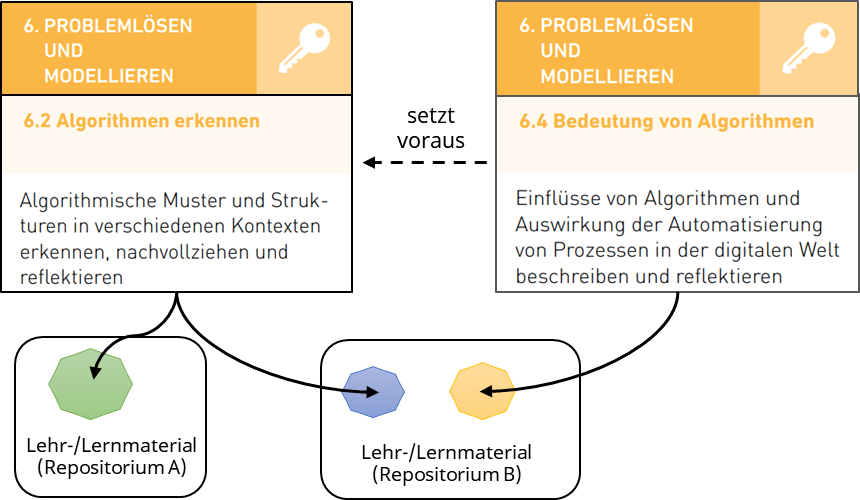
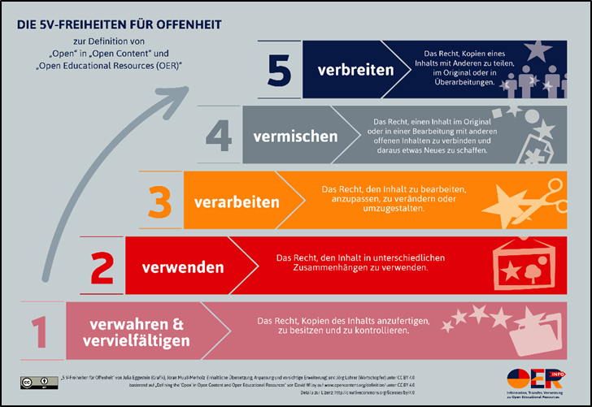
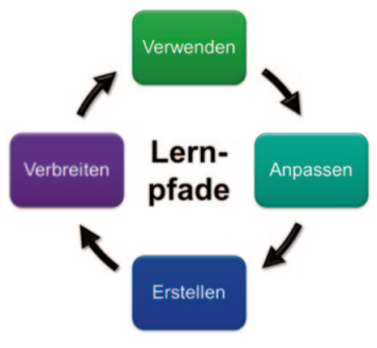
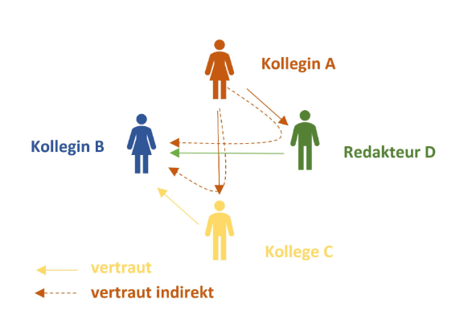

# 5 Anwendungsfälle didaktischer Metadaten

Um Nutzer\*innen hilfreiche Dienste im Bildungsbereich anzubieten, können verschiedene didaktische Metadaten verwendet werden. Im Folgenden werden exemplarische Anwendungsfälle beschrieben und Einsatzmöglichkeiten didaktischer Metadaten aufgezeigt. Wenn vergleichbare Dienste bestehen, werden sie exemplarisch referenziert. Grundsätzlich ist hervorzuheben, dass die Anwendungsfälle einer einzelnen, spezifischen Anwendung unter Umständen andere didaktische Metadaten und insbesondere andere Wertelisten benötigen können, als solche, die bisher Erwähnung gefunden haben.

**Service-interne vs. standardisierte Attribute**

An dieser Stelle sei auf die im Abschnitt “[Was sind didaktische Metadaten?”](#was-sind-didaktische-metadaten) getroffene Unterscheidung zwischen der Verwendung service-interner Attribute und standardisierter Attribute hingewiesen. Die im vorherigen Abschnitt vorgestellten Attribute stammen größtenteils aus etablierten Metadatenstandards. Sie werden explizit zum Datenaustausch verwendet, sodass sie unter Umständen unterspezifiziert sind, abhängig davon, wie heterogen die Gruppe ist, die sich auf Attribute und Wertelisten zum Austausch geeinigt hat. Service-intern können wesentlich detailliertere Attribute und Wertelisten verwendet werden. Eine solche Vielfalt kann in einem Datenaustausch jedoch nicht immer abgebildet werden.

## 5.1 Buddy-Finder: Ich will mich vernetzen!

Im Bildungsbereich dient das Konzept des “Buddy Finders” zur Vernetzung und Kooperation unter Lernenden. Entsprechende Dienste zielen darauf ab, Lernpartner oder Gruppen mit ähnlichen Bildungsinteressen oder -zielen zusammenzuführen. Sie können folgende Funktionalitäten bereitstellen:

- **Förderung der Vernetzung unter Lernenden**: Bildungsdienste bieten eine Plattform, die es ermöglicht, Kontakte zwischen den Lernenden herzustellen, basierend auf gemeinsamen Interessen und Bildungszielen.
- **Gegenseitige Unterstützung und kollaboratives Lernen**: Die Dienste erleichtern die Bildung von Lerngemeinschaften, um Herausforderungen gemeinsam zu bewältigen, Wissen auszutauschen und an Projekten zu arbeiten.
- **Soziale Inklusion:** Besonders in größeren, neuen oder verteilten Lernumgebungen können Bildungsdienste die Lernenden dabei unterstützen, soziale Kontakte zu knüpfen und sich in die Gemeinschaft zu inkludieren.
- **Anpassung an spezifische Lernbedürfnisse**: Einige Buddy-Finder-Systeme bieten personalisierte Suchfunktionen an, die es den Nutzer\*innen ermöglichen, Lernpartner\*innen basierend auf spezifischen Kriterien wie Sprachfähigkeiten oder Studienrichtungen zu finden.
- **Nutzung digitaler Technologien**: Im Kontext des E-Learnings integrieren Buddy-Finder-Systeme digitale Werkzeuge, um die Vernetzung und Zusammenarbeit auch in virtuellen Lernumgebungen zu unterstützen.

Buddy-Finder-Services tragen zur Steigerung der Interaktion, des Austauschs und der Kooperation unter Lernenden bei, was sich positiv auf die Lernerfahrung und die akademische Leistung auswirken kann. Denkbar und bereits umgesetzt sind dabei Dienste für folgende Nutzungsszenarien:

- Miteinander und voneinander lernen (Peer-Learning)
  - Sprachen lernen
    - mit Sprachpartner\*innen
    - mit Service / KI
  - Themenbasiert lernen
    - Lerngruppe finden
    - Austausch von Zusammenfassungen
    - Klausurvorbereitung
- Förderung und Nachhilfe (Tutoring) (online/vor Ort)
  - Beantwortung individueller Einzelfragen
- Bildung des persönlichen sozialen Netzwerks
  - Menschen in ähnlichem Bildungsabschnitten oder Bildungseinrichtungen themenübergreifend kennenlernen
  - informelles Lernen (Freizeit)

**Liste exemplarischer Diensten für die genannten Nutzungsszenarien**

> **Miteinander und voneinander lernen**

- Sprachen lernen
  - [Babbel.com](https://www.babbel.com/), [Duolingo](https://de.duolingo.com/), [Interpals.net](https://www.interpals.net/), [HiLokals.com](https://www.hilokal.com/), [Speaky.com](https://www.speaky.com/), [Lingbe.com](https://www.lingbe.com/), [hellotalk.com](https://www.hellotalk.com/), [MyLanguageExchange.com](https://www.mylanguageexchange.com/), [Fluento](https://www.fluento.com/), [Preply.com](https://preply.com/), uvm.
- Themenbasiert lernen
  - Allgemeine Lernpartner\*innen, Lerngruppen
    - [Peer 2 Peer University](https://www.p2pu.org/en/learning-circles/) (Learning Circles), [StudyTogether](https://www.studytogether.com/), [Lernpartnerbörse KIT](https://lernpartnerboerse.hoc.kit.edu/), [Edukatico - WeLearning](https://www.edukatico.org/de/welearning/about), [Lerngruppen-App (FernUniversität Hagen)](https://www.fernuni-hagen.de/studium/fernstudieren/lerngruppen-app.shtml), uvm.
    - [studyprosc](https://www.studyprosc.de/), [studydrive](https://www.studydrive.net/), [unidog.de](https://www.unidog.de/), [StuDocu](https://www.studocu.com/de), uvm.  
      (inkl. Austausch von Klausurvorbereitungen und Zusammenfassungen o.ä.)
  - Kurse
    - [OpenHPI](https://open.hpi.de/), [LinkedIn Learning](https://de.linkedin.com/learning/), uvm.

> **Förderung und Nachhilfe (Tutoring)**

- Allgemein
  - [GoStudent](https://www.gostudent.org/), [Schülerhilfe](https://www.schuelerhilfe.de/), [Nachhilfe.de - Das Vergleichsportal](http://nachhilfe.de/), [Studienkreis](https://www.studienkreis.de/), [(eBay) Kleinanzeigen](https://www.kleinanzeigen.de/), uvm.
- KI-basierte Systeme, u.a. zur Beantwortung individueller Einzelfragen
  - GPTs von [OpenAI](https://openai.com/)
  - [StuddyBuddy für berufliche Weiterbildung](https://study-buddy-research.de/) (BMBF)

> **Bildung des persönlichen sozialen Netzwerks (Networking)**

- Menschen in ähnlichem Bildungsabschnitten oder Bildungseinrichtungen themenübergreifend kennenlernen
  - XING, LinkedIn, uvm.
- informelles Lernen (Freizeit)
  - [Buddy.me](http://buddy.me), [spontacts](https://spontacts.com/p/freizeitpartner-finden), [friendseek.com](http://friendseek.com), uvm.

Zur Umsetzung der genannten Nutzungsszenarien ist der Einsatz verschiedener didaktischer Metadaten möglich. Dabei muss beachtet werden, dass es sich hierbei um Services handelt, bei denen *nicht* der Datenaustausch im Vordergrund steht. Sie setzen daher auf Attribute und Wertelisten, die sich für ihren Use Case am besten eignen. Diese können an standardisierte Wertelisten angelehnt sein, werden aber zumeist spezifisch an den Dienst angepasst und ausgestaltet. Die gelisteten und etablierten Dienste sind teilweise kommerziell und müssen ihren Nutzer\*innen den bestmöglichen Service sowie verständliche Nutzungsoberflächen zur Verfügung stellen, um sich am Markt zu behaupten. In der Liste exemplarischer Dienste wird deutlich, dass sich die meisten Anbieter qualitativ auf einzelne Nutzungsszenarien spezialisieren und nicht alle vorstellbaren Nutzungsszenarien verwirklichen.

Buddy-Finder-Services agieren im sozialen Bereich, indem sie Menschen miteinander in Kontakt bringen, die gemeinsam oder voneinander lernen wollen.[^1] Die didaktischen Metadaten, die bei Nutzung der Services erhoben werden, sind recht reduziert und beschränken sich überwiegend auf Sprache und Sprachniveau (bei Diensten zum Erlernen einer Sprache), Fach und Thema und bisweilen Bildungskontext oder Abschluss (insbesondere bei Nachhilfe). Die weitere Passung der jeweiligen Buddys wird sodann unter den Nutzer\*innen sondiert. Neben diesen Daten werden oft weitere, personenbezogene Daten erhoben (Name, E-Mail etc.), die jedoch nicht den didaktischen Metadaten zugehörig sind.

**Exemplarische Metadaten**

- Sprachen lernen: Sprache, Sprachniveau, (Ort)
- Lerngruppen / Lernpartner finden: Fach / Thema, (Kurs)
- Nachhilfe: Fach / Thema, Bildungskontext, Abschluss, (Preis)

## 5.2 Persönliche Lernpfade: Wie geht es jetzt weiter?

Empfehlungen zu passenden Lernpfaden helfen Lernenden, ein Lernziel oder Thema systematisch zu durchdringen, um ihre Lernziele zu erreichen ([Raj and Renumol 2024](#ref-rajialprmdrla2024)). Doch woher stammen Lernpfade, was kennzeichnet sie und wie kann eine Empfehlung für einen Lernpfad erfolgen?

### 5.2.1 Bildungsreise: Was ist ein Lernpfad?

Die Metapher der Bildungsreise ermöglicht eine erste Vorstellung der Ausgestaltung von möglichen Lernpfaden: So können auf einer Reise verschiedene Wege an das Ziel führen, Erfahrungen gemacht und Etappenziele erreicht werden, es müssen jedoch womöglich auch Hürden überwunden und Entscheidungen für Routen getroffen werden, die sich je nach persönlichen Voraussetzungen unterschiedlich eignen.

Das Konzept findet sich bereits zu Beginn des E-Learnings: Lernpfade stellen dabei für Lernende und Lehrende eine inhaltlich und zeitlich sinnvolle Strukturierung eines Lernverlaufs innerhalb und zwischen Lernaktivitäten sowie Lernressourcen dar, welche zum Erreichen eines Lernzieles verwendet werden ([Canter, Rivers, and Storrs 1985](#ref-cantercuncds1985)) ([Jih 1996](#ref-jihilplpmcal1996)).

Lernpfade werden dabei besonders im mathematisch-naturwissenschaftlichen Bereich diskutiert ([Goldman 2020](#ref-goldmanlphlco2020)) ([Hillmayr et al. 2017](#ref-hillmayrdmimuseuuw2017)) ([Schmidt 2009](#ref-schmidtsldl2009)). Roth (2014) verweist auf exemplarische Lernpfade, die von Lehrenden für Lernende bereitgestellt wurden, indem einzelne Lernhilfen zu einem zusammenhängenden Gesamtkonzept vereint wurden, um Lernprozesse zu organisieren ([Roth 2014](#ref-rothldguu2014), S. 4-5).

Roth (2014) führt dabei mehrere Definitionen des Lernpfades wie folgt zusammen:

> *“Ein Lernpfad ist eine internetbasierte Lernumgebung, die mit einer Sequenz von aufeinander abgestimmten Arbeitsaufträgen strukturierte Pfade durch interaktive Materialien (z. B. Applets) anbietet, auf denen Lernende handlungsorientiert, selbsttätig und eigenverantwortlich auf ein Ziel hin arbeiten. Da die Arbeitsaufträge eine Bausteinstruktur aufweisen, können die Lernenden jeweils für ihren Leistungsstand geeignete auswählen. Durch individuell abrufbare Hilfen und Ergebniskontrollen sowie die regelmäßigen Aufforderungen zum Formulieren von Vermutungen, Experimentieren, Argumentieren sowie Reflektieren und Protokollieren der Ergebnisse in den Arbeitsaufträgen wird, die eigenverantwortliche Auseinandersetzung mit dem Lernpfad explizit gefördert.” ([Roth 2014](#ref-rothldguu2014), S. 7)*

Kerres & Buntins (2020) verbinden Lernpfade mit dem Instruktionsdesign (*Instructional Design*), das eine Sequenzierung der präsentierten Inhalte, eine Zuordnung von Lernaktivitäten und die Überwachung des Lernfortschritts beinhaltet ([Kerres and Buntins 2020](#ref-kerresralapid2020), S. 101f). Erste Varianten intelligenter Vorschlagssysteme wurden verwendet, um den Lernerfolg zu messen und daran anschließende Lernerfahrungen anzupassen (Kerres & Buntins, 2020) oder Lernpfade dynamisch in Echtzeit zu generieren. Konkrete Versuche zur praktischen Umsetzung eines solchen Ansatzes waren in der Vergangenheit kaum sichtbar, erzielten in Metaanalysen teilweise nur geringe Effekte und galten daher zunächst als wenig aussichtsreich ([Kerres and Buntins 2020](#ref-kerresralapid2020), S. 102). Als Ursache dafür wurde der Mangel validierter Ontologien für die Klassifikation von Lerninhalten und Lernaktivitäten sowie ferner die fehlende Wissensbasis für die Abfolge von Lerneinheiten ausgemacht ([Kerres and Buntins 2020, S.102](#ref-kerresralapid2020)).[^2]

In jüngster Zeit taucht jedoch wieder die Frage auf, inwieweit maschinell generierte Empfehlungen auch Lernende bei der Auswahl von Lernressourcen oder bei der Lernerfahrung unterstützen könnten. Dabei regulieren Empfehlungssysteme (*Recommender Systems*) den Lernprozess nicht direkt, sondern überlassen die Entscheidungen den Lernenden und empfehlen lediglich mögliche Lernpfade ([Kerres and Buntins 2020](#ref-kerresralapid2020), S. 103-104).

### 5.2.2 Linear, adaptiv oder Empfehlungssystem – Wo liegen Herausforderungen für Lernpfade?

Grundsätzlich können drei Aspekte bei Lernpfaden unterschieden werden:

- lineare Lernpfade
- adaptive Lernpfade
- Empfehlungssysteme für Lernpfade

Lineare Lernpfade sind als eher statische Abfolge von Lerneinheiten konzipiert, die sich nicht an den aktuellen Bedürfnissen der Lernenden orientieren. Adaptive Lernpfade bieten daher einen höheren Individualisierungsgrad, indem Lernumgebungen ermöglichen, anderweitige Inhalte oder Schritte vorzuschlagen, abhängig vom individuellen Lernverhalten und Kontext. Zusätzlich entstehen Empfehlungssysteme, die den Lernenden verschiedene mögliche Lernpfade vorschlagen.

**Adaptivität von Lernpfaden**

Während bei Roth (2014) die Adaptivität bei Lernpfaden noch keine Erwähnung findet, ist diese im aktuellen Diskurs um Lernpfade bereits präsenter. Die Adaptivität wird dabei in Bezug auf Maßnahmen zur Unterstützung von Lernprozessen und Interaktionen der Lernenden erforscht und diskutiert ([Delaunay 2022](#ref-delaunayoglfasg2022)) ([Ezzaim et al. 2023](#ref-ezzaimaalsml2023)) ([Jing et al. 2023](#ref-jingrlalebsrp222023)) ([Kabudi, Pappas, and Olsen 2021](#ref-kabudiaalssml2021)) ([Kurilovas, Zilinskiene, and Dagiene 2014](#ref-kurilovasrslsalpisba2014)) ([Kurilovas, Zilinskiene, and Dagiene 2014](#ref-kurilovasrslsalpisba2014)) ([Normann et al. 2023](#ref-normannalpsblsns2023)) ([Pfaffmann and Roth 2022](#ref-pfaffmanneukuluzeundl2022)) ([Rahayu, Ferdiana, and Kusumawardani 2023](#ref-rahayusrlprs2023)) ([Raj and Renumol 2022](#ref-rajslracrple222022)) ([Raj and Renumol 2024](#ref-rajialprmdrla2024)).

Bei der Gestaltung von Lernpfaden können verzweigte Lernwege integriert werden, die es beispielsweise ermöglichen, nachfolgende Aufgaben zu differenzieren, basierend auf der Evaluation des bisherigen Lernerfolgs, des Lernverhaltens oder anderer Faktoren. Um den individuellen Bedürfnissen von Lehrenden und Lernenden gerecht werden zu können, ist die adaptive Bereitstellung von Inhalten eine vielversprechende Strategie.

Einen höheren Grad an Selbstbestimmung bieten womöglich Empfehlungssysteme für (KI-generierte)[^3] Lernpfade, deren Funktionsweise, Möglichkeiten und Grenzen im Bildungsbereich aktuell ausgelotet werden ([Kerres and Buntins 2020](#ref-kerresralapid2020)) ([Reichow et al. 2022](#ref-reichowrbwghuhdiri2022)). Diese Systeme schlagen Lernpfade vor, generieren diese jedoch nicht eigenständig. Ontologie-basierte Methoden sind erfolgsversprechend bezüglich personalisierten Empfehlungssystemen ([Raj and Renumol 2024](#ref-rajialprmdrla2024)).

**Exemplarische Funktionsweisen von Vorschlagssystemen**

Vorschlagssysteme können Lehrende dabei unterstützen, erfolgreiche Lernpfade zu erstellen, um personalisiertes Lernen zu ermöglichen, beispielsweise indem Lernende anhand verschiedener Faktoren gruppiert werden, um diesen adaptiv Feedback bereitzustellen ([Jyothi et al. 2012](#ref-jyothirsaiblppls2012)). Um [Lerntypen](#lerntypen-lernstile) zu klassifizieren, werden verschiedene didaktische Metadaten aus den Lernumgebungen extrahiert ([Felder and Silverman 1988](#ref-felderltsee1988)) ([Jamali and Mohamad 2018](#ref-jamalidlses2018)) ([Jyothi et al. 2012](#ref-jyothirsaiblppls2012)). Vorschlagssysteme für Lernende versuchen bisweilen auch die Lernpräferenzen und Interessen zu berücksichtigen ([Ma et al. 2023](#ref-malrrkglsc2023)). Ebenso ist die Beziehung zwischen den Ressourcen relevant, etwa die semantische Struktur eines Sachgebiets, wie z. B. etwaige Ähnlichkeitsmaße zwischen Inhalten. Ebenso können Lernpfade anderer Lerner berücksichtigt werden, die vergleichbare Merkmale aufweisen ([Jyothi et al. 2012](#ref-jyothirsaiblppls2012)) ([Zhu et al. 2018](#ref-zhumlprabkm2018)). Ursprüngliche Verfahren zur Erhebung von Faktoren zur Bereitstellung von Vorschlagssystemen basieren häufig auf entwickelten Fragebögen zur Charakterisierung des Lernenden. Neuere Verfahren versuchen diese Faktoren unmittelbar aus den Lernumgebungen zu ermitteln (bspw. mittels Learning Analytics).

**Varianten zur Generierung von Lernpfaden**

Die Generierung und Analyse individueller und adaptiver Lernpfade innerhalb digitaler Lernumgebungen wird in zahlreichen Forschungsbestrebungen in unterschiedlichen Kontexten untersucht ([Kabudi, Pappas, and Olsen 2021](#ref-kabudiaalssml2021)) ([Oellers, Junker, and Holodynski 2024](#ref-oellersilpmtpv2024)) ([Rahayu, Ferdiana, and Kusumawardani 2023](#ref-rahayusrlprs2023)) ([Raj and Renumol 2024](#ref-rajialprmdrla2024)) ([Rivera Muñoz, Berríos, and Arias-Gonzáles 2022](#ref-riveramunozsraltlhe2022)), wie auch die etwaigen potenziellen Unterstützungsmaßnahmen auf diesen Lernwegen und die Auswirkungen diverser Faktoren auf den Lernerfolg (vgl. [Visible Learning MetaX](https://www.visiblelearningmetax.com/), [Hattie-Wiki: Faktoren](https://web.fhnw.ch/plattformen/hattie-wiki/begriffe/Kategorie:Faktoren)) ([Hattie 2023](#ref-hattievlss1mra2023)). Eine Lernunterstützung kann neben einer adaptiven Sequenzierung vielfältig ausgestaltet sein, z. B. mittels Scaffolding, Feedback, Prompting oder Cueing im Lernprozess (vgl. auch: [Lernumgebungen: Diagnostik und Förderung](#lernumgebungen-diagnostik-und-förderung)).

Die Generierung von Lernpfaden kann durch Menschen erfolgen, aber auch durch Maschinen, wenngleich die maschinelle Form der Generierung nach Kerres bislang eher bei theoretischen Prototypen geblieben ist ([Kerres and Buntins 2020](#ref-kerresralapid2020), S. 102). Während Lehrende auf ihren Erfahrungsschatz bei der Erstellung von Lernpfaden zurückgreifen können, um einzuschätzen, welcher Arbeitsauftrag auf einen anderen folgt, können Maschinen auf diese Erfahrungen bisher nicht systemisch zugreifen. Eine solche Erfahrung ließe sich zwar durch die Erhebung konkreter Lehr- und Lernmuster gewinnen, ist jedoch in der Praxis mit vielfältigen Hürden verbunden, wie zum Beispiel dem unerwünschten Erlernen unproduktiven, menschlichen Lernverhaltens, etwa beim Training einer künstlichen Intelligenz. Lernförderliche Sequenzierungen durch Lehrende sind daher unter Umständen vielversprechender.

**Voraussetzungen und Herausforderungen für Empfehlungssysteme**

Für eine aussichtsreiche, automatisierte Empfehlung müssen technisch verschiedene Grundbedingungen erfüllt werden, unter anderem eine verlässliche Datengrundlage, auf deren Basis die Maschine lernen kann sowie strukturierte Daten, die die relevanten Datenfelder für eine Empfehlung betreffen ([Reichow et al. 2022](#ref-reichowrbwghuhdiri2022), S. 15-17). Die Schaffung einer entsprechenden Datengrundlage ist dabei nicht trivial, da einerseits die Maschine leicht auch unerwünschtes Verhalten lernen kann, andererseits große Mengen an Daten benötigt werden, um verlässliche Empfehlungen auszusprechen ([Reichow et al. 2022](#ref-reichowrbwghuhdiri2022), S. 6-8, 16).

Aber auch die Bereitstellung qualitativ hochwertiger strukturierter Daten ist mit zahlreichen Herausforderungen verbunden. Die Lernobjekte müssen mit didaktischen Metadaten (z. B. Kompetenzen) verknüpft werden, die ihrerseits entsprechende semantische Beziehungen aufweisen, zum Beispiel Abhängigkeiten wie Kompetenzvoraussetzungen. Ohne die Auszeichnung entsprechender Abhängigkeiten ist eine Umsetzung von adaptiven Eigenschaften schwierig umzusetzen.

Die Verknüpfung von Lernobjekten mit Kompetenzen sowie die technische Abbildung sind in praktischen Implementierungen bisher kaum etabliert. In der Initiative “Mein Bildungsraum” befasst sich das [CoKoMo](https://cokomo-it.de/docs/start/)-Projekt mit diesem Thema und entwickelt ein Wissensmodell sowie eine Anwendung, um Wissen und Kompetenzen zu modellieren und anschließend maschinenlesbar zur Verfügung zu stellen.

Die Verknüpfungen und Abhängigkeiten von Kompetenzen sind elementar für die Erstellung von Lernpfaden und Empfehlungssystemen im Bildungsbereich, da sie anders funktionieren als Empfehlungssysteme, die wir im Alltag nutzen (bspw. Inhaltsempfehlungen von Spotify oder Netflix oder Produktempfehlungen von Amazon) ([Kerres and Buntins 2020](#ref-kerresralapid2020), S. 107).

Nach Verwendung eines Lernobjektes kommt nicht jedes beliebige weitere Objekt in Frage, sondern eines, das auf diesem aufbaut und Lernende einen Schritt näher an das gesetzte Lernziel bringt. Zusätzlich muss beachtet werden, dass durch die reine Verwendung eines Lernobjektes nicht davon ausgegangen werden kann, dass ein Lernziel auch erreicht wurde. Um Lernende auf einem lernförderlichen Pfad zu halten, muss demnach kontinuierlich überprüft werden, ob entsprechende Lernziele erreicht wurden (z. B. Kompetenzen vorhanden sind), auf Grund derer automatisiert entsprechende weitere Lernobjekte (oder Lernpfade) vorschlagen werden.

Die eingesetzten Technologien für Empfehlungssysteme, aber auch für die Erstellung von Lernpfaden, reichen dabei von statistischen Methoden bis zu komplexen neuronalen Netzen. Bei letzterem Vorgehen ist zum Teil nicht mehr konkret nachvollziehbar, weshalb entsprechende Empfehlungen ausgesprochen werden, womit zugleich ethische Herausforderungen einhergehen ([Kerres and Buntins 2020](#ref-kerresralapid2020), S. 108f) ([Reichow et al. 2022](#ref-reichowrbwghuhdiri2022), S. 8f.).

Obwohl Technologien und Theorien vorliegen, um diesen Herausforderungen zu begegnen, ist es nicht trivial einen entsprechenden Service zu entwickeln:

- Die Kompetenzkataloge liegen häufig in keiner maschinenlesbaren Fassung vor.
- Kompetenzkataloge unterscheiden sich aufgrund föderaler oder institutioneller Strukturen teilweise stark. Um übergreifende Services anzubieten, ist ein entsprechendes Mapping nötig.
- Lernobjekte sind nicht mit Kompetenzmetadaten verknüpft.

Grafik: *Zusammenhänge zwischen Kompetenzen mit Elementen aus dem Medienkompetenzramen NRW ([Blodau et al. 2019](#ref-blodaumn2019)). Fachlich sind Zusammenhänge zwischen Kompetenzen definierbar (hier: “setzt voraus”), jedoch liegen diese Informationen meist nicht maschinenlesbar vor, sondern z.B. als Text/Grafik.*

Existierende Implementierungen, wie [Aleks](https://www.aleks.com) oder [Bettermarks](https://de.bettermarks.com/), stammen häufig aus dem MINT-Bereich, da sich die dortigen Kompetenzen gut systematisieren und hierarchisieren lassen. Eine Übertragung in geisteswissenschaftliche Themen wird als herausfordernd betrachtet ([Euler et al. 1987](#ref-eulercu1987), S. 77). Die im [Kapitel zum Buddy-Finder](#buddy-finder-ich-will-mich-vernetzen) vorgestellten tutoriellen Sprachlernapps können als sehr spezialisierte Lernpfadfinder angesehen werden.

**Wirksamkeit adaptiver Lernsysteme**

Hinsichtlich der Wirksamkeit adaptiver Systeme gibt es Kontroversen. Während einige Befunde auf eher kleinere Effekte hindeuten ([Kerres and Buntins 2020](#ref-kerresralapid2020), S. 102), schlussfolgern Hillmayr et al.:

> “Intelligente Tutorensysteme, die eine Anpassung an den individuellen Lernstand der Nutzer sowie differenziertes Feedback zur Aufgabenlösungen ermöglichen, weisen daher eine vergleichsweise hohe Wirksamkeit auf.” ([Hillmayr et al. 2017](#ref-hillmayrdmimuseuuw2017), S. 24).

Das Spektrum der Ergebnisse hinsichtlich der Wirksamkeit macht deutlich, dass das Thema in der Forschung derzeit kontrovers diskutiert wird.

### 5.2.4 Wie kann ein Lernpfad angepasst werden?

Im Folgenden werden lerntheoretische Aspekte, besonders im Hinblick auf die Adaptivität, betrachtet. Anschließend wird auf potenziell einsetzbare didaktische Metadaten eingegangen.

Ein Lernpfad ist zunächst eine strukturierte Sammlung verschiedener Lerneinheiten, die zum Erreichen eines Lernziels verwendet werden. Für adaptive Lernpfade sollten Merkmale der Lernenden, des Lernverhaltens und ihres Kontextes berücksichtigt werden. Adaptives Lernen erfolgt durch die individuelle Anpassung des Lernangebots oder der Lernumgebung. Damit kann die Adaptivität lebenslanges und selbstgesteuertes Lernen fördern und sich an die wandelnden Bedürfnisse Lernender anpassen.

Neben der zunächst vorgestellten Anpassung von Lernpfaden über die didaktische Sequenzierung von verschiedenen Bildungsressourcen, kann auch eine Anpassung innerhalb der einzelnen Lernaktivitäten erfolgen. Eine individuelle Anpassung der Lernpfade kann unter Berücksichtigung verschiedener Merkmale von Lernen und deren Kontext erfolgen, darunter beispielsweise:

- Motivation

- Lernvoraussetzungen (Vorwissen, bisherige Kompetenzen, …)

- persönliche Lernpräferenzen (Format, Zeit, Sprache, Sequenzierung, …)

- bisheriger Lernfortschritt (Erfüllung von Vorbedingungen, z. B. absolvierte Tests)

- Leistungseinschätzung, bei dynamischer Anpassung von Lernpfaden auch anhand der aktuellen Leistung oder des aktuellen Lernverhaltens. Grundlage dafür stellen Vorhersagemodelle aus dem Bereich des prädiktiven Lernens unter Verwendung von Methoden wie Learning Analytics und Educational Data Mining, künstlicher Intelligenz oder maschinellem Lernen dar (vgl. [Lernumgebungen: Diagnostik und Förderung](#lernumgebungen-diagnostik-und-förderung))

Durch die Berücksichtigung von Lerntheorien, -konzepten und -methoden kann der Lernprozess adaptiv angepasst und unterstützt werden, darunter:

- Active Recall und Spaced Repetition, bspw. beim Vokabellernen
- Zone der nächsten Entwicklung (Vygotskij)
- Cognitive Load Theorie beim Lernen (Sweller & Chandler)
- Cognitive Theory of Multimedia Learning (Mayer)
- Metakognition (Flavell)
- Scaffolding, Modelling, Cueing, Prompting, Fading, Feedback
- Conceptual Change-Ansätze (Chi) \[in der Regel in den Naturwissenschaften\]
  - Kontinuierlich: Revision/Erweiterung aktueller Wissensvorstellungen
  - Diskontinuierlich: Konträre Vorstellungen oder Fehlkonzepte revidieren, vgl. dazu auch [kognitive Dissonanz](https://dorsch.hogrefe.com/stichwort/kognitive-dissonanz) (Piaget), “Aha-Erlebnis” (Bühler) sowie Lernen durch Einsicht (Köhler & Wertheimer)

Daten aus adaptiven Lernerfahrungen können darüber hinaus im Kontext folgender Themen genutzt werden:

- optimierte Datenanalyse zur Diagnostik (für Lehrkräfte/Institutionen)
- kompetenzbasierte Diagnostik
- Datengestützte Entscheidungsfindung im Bildungswesen

Lernsysteme können Lernobjekte auf verschiedene Arten anpassen, beispielsweise hinsichtlich der Schwierigkeit, der Instruktion oder dem Format, um verschiedene Zugänge (z. B. textuell, auditiv, visuell) zu ermöglichen (vgl. auch [Barrierearmut](#zugänglichkeit-und-barrierearmut)). Adaptives Testen zur Messung des Lernfortschritts erfolgt durch die dynamische Auswahl und Anpassung des Schwierigkeitsniveaus im Lernprozess.

### 5.2.5 Warum gibt es überhaupt verschiedene Lernwege?

Das Angebot verschiedener Lernwege zum Erreichen der Ziele dient insbesondere der Binnendifferenzierung und der Personalisierung des Lernens. So können beispielsweise weiterführende, vertiefende Aufgaben, Informationen oder Tipps und Hilfestellungen individuell passgenau bereitgestellt und eine Reihenfolge relevanter Ressourcen verschiedener Typen dargeboten werden.

Die Auswahl des Schwierigkeitsniveaus hat dabei unter Umständen Einfluss auf die Lernmotivation. Es sollten vorwiegend keine zu leichten Aufgaben präsentiert werden, um eine Unterforderung zu vermeiden, wohingegen zu schwierige Aufgaben zu vermeiden sind, um einer Überforderung vorzubeugen, da ungelöste Aufgaben ggf. zur Lernfrustration beziehungsweise Abnahme der Lernmotivation führen können. Die Berücksichtigung der individuellen Profile von Lernenden kann die Lernerfahrung und den Erfolg verbessern ([Imran et al. 2016](#ref-imranpplors2016)). Intelligente Vorschlagssysteme berücksichtigen das Schwierigkeitsniveau und wählen Ressourcen aus, die den Fähigkeiten des Lerners am ehesten entsprechen.

Lernpfade können zum Erreichen des angestrebten Lernziels…

- … über den aktuellen Lernstand informieren und die nächsten Schritte aufzeigen: Wo stehe ich im Lernprozess, was liegt noch vor mir, wie und womit geht es weiter?
- … helfen, das eigene Lernverhalten zu reflektieren: Welche vorherigen Schritte habe ich durchgeführt? Welche Ressourcen wurden bereits bearbeitet und betrachtet?

Aus Lehrendensicht können solche Lernpfade auch der Evaluation der Lehre und des Lernerfolgs dienen, um etwa unverständliche Stellen in Materialien zu verbessern.

Lernwege können verschieden ausgestaltet werden, bspw. durch eine …

- … innere Differenzierung: Verschiedene Lernwege innerhalb einer Ressource (bspw. branching scenarios, user flows)
- … äußere Differenzierung: Verschiedene, weiterführende Ressourcen

### 5.2.6 Didaktische Metadaten zur Bereitstellung von Lernpfaden

Didaktische Metadaten sind grundlegende Bausteine zur technischen Realisierung adaptiver Lernpfade und Vorschlagssysteme.

[**Lernziele, deren Voraussetzungen und Testung**](\l)

Hierarchisch strukturierte [Themen und Inhalte](#fach--und-themenzuordnung) bauen aufeinander auf und sind sinnvollerweise sukzessive nacheinander zu erlernen, um systemische Verständnisse in sachlogischer Reihenfolge erfassen zu können. Eine solche Reihenfolge von Inhalten wird häufig in Lehrplänen festgelegt. Hier übernehmen strukturelle Metadaten eine didaktische Funktion und bilden didaktisch relevante assoziative Zusammenhänge zwischen Ressourcen ab (vgl. [strukturelle Metadaten](#was-sind-typen-von-metadaten)), die wiederum in einem Vorschlagssystem verwendet werden, welches individuelle Vorschläge basierend auf dem Lernstand und Lernfortschritt eines Lernenden präsentiert.

**Individuelle Anpassung von Lerninhalten an den Lernenden**

Durch Erfassung von didaktischen Indikatoren als Lernerfolgskontrolle (Anzahl der Versuche, Ergebnisse einer interaktiven Aufgabe wie einem Quiz o.ä.), kann die [Niveaustufe](#niveaustufe) adaptiv angepasst werden. So kann der Kontext sowie das Profil eines Lerners dazu verwendet werden, um unter anderem das [Sprachniveau](#sprache-und-sprachniveau) anzupassen oder Texte durch Strukturierung zugänglicher zu machen, zum Beispiel durch Hervorhebungen oder Verwendung alternativer Formulierungen (Leichte Sprache). Die Anpassung auf individuelle Bedürfnisse der Lernenden kann also mithilfe von didaktischen Metadaten optimiert werden. So können etwa auch spezielle Angebote zur Förderung gewünschter Kompetenzen oder unter Berücksichtigung inklusiver Merkmale bereitgestellt werden.

### 5.2.7 Lebenszyklen von Ressourcen und Lernpfaden

Roth geht davon aus, dass Lernpfade von Lehrkräften erstellt werden und zieht keine automatische Generierung in Betracht. Zu Ende seines Abschnittes hält er ein Plädoyer dafür, dass Lehrkräfte ihre erstellten Lernpfade teilen sollen und entwirft einen

<!--  -->

Hier beginnt Ihr Text, der um das Bild herum fließt. Sie können so viel Text hinzufügen, wie Sie benötigen, und er wird sich entsprechend um das Bild herum anordnen. Dies sorgt für ein ästhetisch ansprechendes Layout, das häufig in Nachrichtenartikeln, Blogs und anderen Medien verwendet wird.

“Lebenszyklus” ([Roth 2014](#ref-rothldguu2014), S. 20), der stark an die 5V-Freiheiten von OER ([Heck et al. 2020](#ref-heckdoiecoer2020)) ([Muuß-Meerholz 2015](#ref-muuss-meerholzzdooerrndwadav2015)) erinnert. OER durchlaufen aufgrund der eingeräumten Freiheiten verschiedene Entwicklungszyklen über die Erstellung hinaus, beispielsweise durch Anpassungs- und Verteilungsprozesse (Verbesserung von Qualität, Anpassung für verschiedene Zielgruppen und Zwecke, Nutzung des OER-Remix-Rechtes, …). Es entstehen verschiedene Versionen und Abspaltungen (Forks, Branches), insbesondere auch durch die Freiheit, Inhalte miteinander zu vermischen und dadurch neue Ressourcen zu erstellen. Bei Bildungsressourcen können Anpassungen darunter die Wiederverwendung von Inhalten in verschiedenen Nutzungsszenarien (Erfassung, Archivierung, Suche usw.), Bildungs- und Niveaustufen (Anpassung an Zielgruppen und der Schwierigkeit), für sprachliche Barrieren und verschiedene Bildungsdienste verstanden werden ([Duval 2001](#ref-duvalsmesr2001), S. 458). Diese Freiheiten bringen die Herausforderung mit sich, Metadaten von Versionen und Varianten derselben Ressource miteinander in Verbindung zu bringen ([JOINTLY.info 2020](#ref-jointly.infokmbos2020)).

Linke Grafik: *“Die 5V-Freiheiten für Offenheit“ von Julia Eggestein, Jöran Muuß-Merholz u. Jörg Lohrer unter CC BY 4.0, basierend auf „Defining the ‘Open’ in Open Content and Open Educational Resources“ von David Wiley unter CC BY 4.0.*  
Rechte Grafik: *Lebenszyklus von Lernpfaden ([Roth 2014](#ref-rothldguu2014), S. 20).*

### 5.2.8 Tools, Services und Projekte rund um Lernpfade

Exemplarische Tools

- [Adaptive Lernpfade](https://docs.moodle.org/403/de/Einsatzszenarien_f%C3%BCr_Voraussetzungen#Adaptive_Lernpfade) bei Moodle, [H5P Branching Szenario](https://h5p.org/branching-scenario), [Bettermarks](https://de.bettermarks.com/), [Aleks](https://www.aleks.com/)

Projekte

- [Adaptive Learning Cloud (ALC) \[FWU](https://fwu.de/projekte/alc/)\] (Projektplan, Umsetzung unbekannt)
- [CoKoMo - Modellierung von Wissen](https://cokomo-it.de/docs/)
- [E365 Maverick](https://web.archive.org/web/20231031223903/https://www.meinbildungsraum.de/vorhaben/foerderprojekte-und-partner/aktuelle-foerderprojekte/e365-maverick-ehem-eagl2-kuenstliche-intelligenz-fuer-die-automatische-generierung-von-lernpfaden):

Mit Künstlicher Intelligenz Lernpfade automatisch generieren

- [ITS – Intelligente Tutorielle Systeme](https://www.kmk.org/de/themen/bildung-in-der-digitalen-welt/laenderuebergreifende-projekte.html)

<table>
<colgroup>
<col style="width: 6%" />
<col style="width: 93%" />
</colgroup>
<tbody>
<tr class="odd">
<td>
💡
</td>
<td>
<strong>Zusammenfassung</strong>
</td>
</tr>
<tr class="even">
<td>
</td>
<td>

Lernpfade ermöglichen …

<ul>
<li>

… selbstgesteuertes, eigenverantwortliches Lernen

</li>
<li>

… eine Binnendifferenzierung und individuelle Förderung

</li>
<li>

… die Anpassung von Aktivitäten und Inhalten an die Bedürfnisse Lernender

</li>
<li>

… die didaktisch vorstrukturierte Sequenzierung eines Lerngegenstands, bspw. zur systematischen Erschließung eines Themen- / Wissensgebietes

</li>
<li>

… das Monitoring des eigenen und fremden Lernfortschrittes

</li>
<li>

… die lernziel-orientierte Empfehlung von Ressourcen basierend auf dem aktuellen Stand eines Lernenden

</li>
</ul>
</td>
</tr>
</tbody>
</table>

## 5.3 Suchen und Finden: Wie kann ich das finden, was ich suche?

Das Suchen und Finden von Lernressourcen gehört zu den wohl am meisten umgesetzten Nutzungsszenarien für didaktische Metadaten. Von internationalen OER-Plattformen wie [Merlot](https://www.merlot.org/merlot/index.htm), bis zu den nationalen Plattformen [OERSI](https://oersi.org/) (Hochschule), [WirLernenOnline](https://www.wirlernenonline.de/) (Schule, zunehmend bildungsbereichsübergreifend) oder [MUNDO](https://mundo.schule/) (Schule) nutzen alle Plattformen didaktische Metadatensets, um Suchende zielgerichtet zu dem relevanten Material zu führen. Auch kommerzielle Plattformen wie [eduki](https://eduki.com/de), [4teacher](https://www.4teachers.de/) oder [meinUnterricht](https://www.meinunterricht.de/) nutzen entsprechende Metadaten, um ihre Inhalte auszuzeichnen.

**Doch wie findet man in der Fülle der Angebote das richtige Material?**

Die genannten Plattformen bieten eine Vielzahl von Materialien an, häufig listen die Plattformen Tausende bis Hunderttausende Einträge. Zur Einschränkung der Ergebnisse bieten die Dienste einige Filtermöglichkeiten an. Doch auch nach dem Setzen mehrerer Filter bleiben oft noch zahlreiche Materialien übrig. So listet [eduki](https://eduki.com/de) für die Filterkombination “Deutsch”, “Lesen”, “1. Klasse”, “Arbeitsblätter”, “5-20 Seiten“ noch über 1500 Ergebnisse. Überraschend wenige der genannten Plattformen bieten Kommentar- oder Bewertungsfunktionen an, um es Nutzenden zu ermöglichen, Feedback zu einem Material zu geben und dieses in der Suche zu nutzen. Auch andere soziale Komponenten sind auf den meisten der genannten Plattformen nicht zu finden, wie exemplarisch das Folgen von Autor\*innen für neue Materialien, was beispielsweise eduki als Funktion anbietet. Eine Funktion, die bei großen kommerziellen Inhalteanbietern essenziell ist (Youtube, Instagram, …), um Content-Erstellende mit ihren Followern in Verbindung zu bringen und zu halten.

Im Folgenden sollen die Aspekte Filtern, Nutzung eines sozialen Graphen sowie semantische Suche beim Suchen und Finden von Materialien genauer beleuchtet und ihre (oft noch ungenutzten) Potenziale aufgezeigt werden.

### 5.3.1 Relevantes Material finden: Filtern, Kompetenzorientierung und Wallet

Um Nutzenden ein besseres Sucherlebnis zu ermöglichen, speichern unter anderem die Suchmaschinen Google oder Bing personalisierte Daten, um diese bei der Suche zu berücksichtigen. Da diese Datennutzung oft intransparent ist, stößt das Verfahren auf Kritik. Allerdings ließe sich ein solches Verfahren auch datensparsam und selbstsouverän gestalten, wie die Wallet-Konzeption der Initiative “Mein Bildungsraum” zeigt. Dort werden die Nutzerdaten auf der Wallet des jeweiligen Nutzers gespeichert und anschließend etwaige Freigaben zur Nutzung mit weiteren Services von dort durch die Nutzenden verwaltet. Für dieses Nutzungsszenario könnten dort unter anderem Daten wie “Fachinteresse”, “Klassenstufe” und weitere gespeichert werden, die dann automatisch in den Filtern der Suche vorausgewählt sind. Würden zusätzlich Verwaltungsdaten gespeichert, könnte für den Suchdienst ersichtlich sein, welche Fächer eine Lehrkraft unterrichtet und entsprechende Materialvorschläge könnten erfolgen. Ebenfalls denkbar ist die Einbindung kompetenzorientierter Daten in das eigene Profil, woraus sich Überschneidungen mit [Lernpfaden](#persönliche-lernpfade-wie-geht-es-jetzt-weiter) ergeben. Ein Suchdienst könnte diese Informationen nutzen, um entsprechende Hinweise anzuzeigen, die auf vorausgesetzte oder zu erwerbende Kompetenzen deuten. Auch im Ranking können diese Attribute genutzt werden, indem Ressourcen niedriger eingeordnet werden, die keine der angestrebten Kompetenzen enthalten oder solche, die Kompetenzen enthalten, die sich in Kompetenzhierarchien über- oder unterhalb der angestrebten Kompetenz befinden.

### 5.3.2 Nutzung des sozialen Graphen zum Ranking und Filtern

Die Fülle an Materialien auf Content-Plattformen verdeutlicht, dass es nicht zwingend ein Angebotsproblem gibt, sondern die Herausforderung darin besteht, die Suchenden zu dem für sie relevanten Material zu führen. Wie findet man also sinnbildlich die Nadel im Heuhaufen?

Lehr-/Lernprozesse finden meist in einem sozialen Kontext statt. Lehrende besitzen Kolleg\*innen, die ähnliche Fächer und Themen unterrichten und tauschen Gedanken zu Ansätzen, Methoden und Materialien aus. Lernende wollen die gleichen Kompetenzen oder Themen lernen oder müssen sich auf die gleiche Prüfung vorbereiten. Der Austausch zwischen und innerhalb der beiden Gruppen funktioniert in analogen Szenarien gut, sei es durch die Materialsammlungen im Klassenzimmer, dem Austausch von Mitschriften unter Lernenden oder auch einfachen persönlichen Empfehlungen wie “Schau dir mal XY an, das hat mir sehr geholfen”.

Diese persönlichen, sozialen Mechanismen sind zum größten Teil bisher nicht auf Bildungsplattformen übertragen worden. Dies liegt vorrangig daran, dass der Aufbau eines sozialen Graphen nicht trivial ist, sowohl für Bereitstellung der Dienste, als auch für die Nutzenden. Für Dienste besteht die größte Schwierigkeit darin, eine Basis von relevanten Nutzer\*innen aufzubauen, mit denen sich andere vernetzen können. Daher gibt es von erfolgreichen Social-Media-Plattformen meist nur einen vergleichbaren “Typ”: ein Facebook, ein Instagram, ein Reddit, ein Twitter/X. Es ist für Nutzende nicht sinnvoll, auf ein Pendant zu wechseln, wenn dort keine Nutzenden und keine Inhalte vorhanden sind. Darin besteht auch die Schwierigkeit für Nutzende: Der Aufbau eines sozialen Graphen ist nicht trivial, relevante Personen müssen gefunden und Kontakte geknüpft werden. Die Konstruktion dieser Graphen ist dabei vorwiegend so gestaltet, dass diese nicht zwischen Diensten übertragbar sind. Die “Freunde” von Facebook, können nicht zu Twitter/X transferiert werden, Instagram-Follower nicht zu Spotify usw. Dies führt zu Lock-In-Effekten, worauf mutmaßlich auch der Erfolg dieser Plattformen basiert.

Aktuell gibt es allerdings zwei relevante Entwicklungen, die diese Herausforderung hinsichtlich der Portabilität angehen:

- dezentrale Social Media Protokolle (ActivityPub, Nostr)
- national zentrale Plattformen mit einheitlichem Identitätsmanagement (bspw. Identitäts- & Zugangsmanagement der Initiative “Mein Bildungsraum” oder auch die Norwegian Digital Learning Arena)

Beide Entwicklungen vereint, dass Dienste sich nicht um das Identitätsmanagement kümmern müssen, da dieses ausgelagert ist: komplett selbstsouverän (ActivityPub, Nostr) oder zentralisiert durch eine zentrale Plattform. Gleichzeitig ermöglichen diese Ansätze auch das Bilden dienstübergreifender sozialer Netzwerke. Auf der norwegischen Bildungsplattform [NDLA](https://ndla.no/) ist ein solches Modell mithilfe eines zentralen Logins, der allen norwegischen Lehrkräften zur Verfügung steht, umgesetzt worden. Dort wurden im Rahmen eines Teilprojektes zum Thema “Qualitätssicherung” sogenannte “Circle of Trust”-Modelle eingeführt. Personen können andere Personen als “vertrauenswürdig” einstufen. Diese Vertrauenswürdigkeit lässt sich dann transitiv übertragen, im Sinne von “Ich vertraue dir und wenn du Person B vertraust, vertraue ich auch Person B”.[^4]

Grafik: *Circle of Trust (Abbildung von Frank Müller) ([Müller 2019](#ref-muellercuhsffvboabpnnnwmi2019), S. 51))*

Solche Modelle lassen sich verwenden, um in sozialen Kontexten das verwendete oder positiv bewertete Material in Suchen höher zu ranken, indem die sozialen Graphen der Suchenden einbezogen werden.

### 5.3.4 Explorative, semantische Suchen

Um Suchen mit Schlagwörtern effektiv nutzen zu können, sollten die Suchenden mit der logischen Struktur und dem Vokabular vertraut sein. Gerade zu Beginn einer Recherche kann daher unzureichendes Hintergrund- oder Domänenwissen (bspw. Fachbegriffe, komplexe Zusammenhänge wie Ursache-Wirkungs-Ketten o.ä.) das Auffinden und den Zugang zu relevanten Ressourcen erschweren, insbesondere, wenn relevante Schlagwörter noch unbekannt sind. Suchanfragen können dann nur unzureichend formuliert werden, wodurch klassische Suchmaschinen kaum in die Lage versetzt werden, relevante Treffer für diese Suchen anzubieten. Explorative, semantische Suchen können dies ändern und unterstützen darüber hinaus das Serendipitätsprinzip, womit zufällige Entdeckungen von Ressourcen möglich werden. Sie beugen zudem dem Relevanzparadoxon vor, welches die Suche nach relevanten Informationen andernfalls bereits vorab einschränkt.

Adressierte Herausforderungen, die bei Suchenden vorliegen können:

- Uneindeutige Suchanfragen (lexikalische oder strukturelle Ambiguität)
- Sprachbarrieren (Orthografie, lexikalische Hierarchie: Hypo-/Hyperonym, Mero-/Holonym)
- Unbekannte Beziehungen zwischen Entitäten

## 5.4 Lernumgebungen: Diagnostik und Förderung

Ein lernanalytischer Ansatz (Learning Analytics) ermöglicht das Sammeln, Aggregieren, Analysieren und Evaluieren von Daten aus pädagogischen Lernkontexten, speziell innerhalb digitaler Lernumgebungen. Der Ansatz ermöglicht, Erkenntnisse über Lernprozesse zu gewinnen, die jeweiligen Inhalte an die Bedürfnisse der Lernenden anzupassen, deren Leistungen zu ermitteln, vorherzusagen und zu verbessern sowie Erfolgsfaktoren von und potenzielle Hindernisse für Bildungsressourcen, Lernaktivitäten oder das individuelle Lernverhalten zu identifizieren ([Chatti et al. 2012](#ref-chattirmla2012)) ([Conole et al. 2011](#ref-conoleml2gpc2011)) ([Hoppe 2017](#ref-hoppecmalkbc2017)) ([Knight and Buckingham Shum 2017](#ref-knighttla2017)) ([Siemens 2013](#ref-siemenslaed2013)) ([Siemens and Baker 2012](#ref-siemenslaedmcc2012)).  
Durch diese Methode werden datengestützte Entscheidungen zur Verbesserung von Lehr-/Lernprozessen und Materialien ermöglicht ([Khor and K 2024](#ref-khorsrrlaspl2024)). Metadaten, die in digitalen Lernumgebungen entstehen, erhalten in diesem Kontext somit eine didaktische Funktion für Lernende und Lehrende. So können die erhobenen Daten aus Lernprozessen für eine adaptive Lernunterstützung oder individuelles Feedback verwendet werden, etwa formativ im Lernprozess oder summativ in einem ePortfolio, welche jeweils ein Monitoring eigener oder fremder Lernprozesse erlauben. Lehrkräfte können durch didaktische Metadaten aus Lernprozessen diagnostische Informationen erhalten (z. B. über Dashboards), um ihre Lehre effektiver zu gestalten. Anhand dieser Daten können verschiedene Maßnahmen den Lernerfolg unterstützen, wie gezieltes individuelles Coaching, Übungen, Scaffolding von Lernumgebungen, Feedback und Rückmeldungen, adaptive Lernunterstützung (Modeling, Prompting, Cueing), uvm.

**Metriken und Indikatoren zur Charakterisierung von Lernprozessen**

Verschiedene Metriken fungieren dabei als Indikatoren zur Charakterisierung von Lernprozessen ([Ahmad, Schneider, Weidlich, et al. 2022](#ref-ahmadwicsyerlair2022)) ([Ahmad, Schneider, Griffiths, et al. 2022](#ref-ahmadcdlrlaildp2022)), darunter unter anderem:

- Anzahl der Aufrufe oder Versuche
- Ergebnisse einzelner Lernerfolgskontrollen (z. B. Test- oder Quizformate)
- Selbsteinschätzung
- Bearbeitungsdauer für einzelne Lerninhalte (z. B. Lesezeit)
- Bearbeitungsfortschritt
- Anzahl verwendeter oder bearbeiteter Ressourcen
- Häufigkeit und Dauer der An- und Abmeldung
- Tastenanschläge (z. B. Freitext-Aufgaben)

Ein umfangreiches Verzeichnis für Lernereignisse, Lernaktivitäten, Metriken und Indikatoren findet sich im [OpenLAIR](https://edutec-tool.github.io/)-Projekt.

Das LMS Moodle basiert auf dem [Modell der Community of Inquiry](https://coi.athabascau.ca/) ([Castellanos-Reyes 2020](#ref-castellanos-reyes2ycif2020)) ([Garisson, Anderson, and Archer 2000](#ref-garissoncitecche2000)), welches drei Bestandteile von Bildungsprozessen identifiziert. Zu diesen Bestandteilen wurden in Abhängigkeit der jeweiligen Lernaktivitäten in Moodle Indikatoren identifiziert ([Moodle 2019](#ref-moodlea2019)) ([Moodle 2022](#ref-moodleaa2022)), die diese Lernprozesse charakterisieren können, darunter:

1.  kognitive Präsenz (Skala: kognitive Tiefe von 0 bis 5)
    - Details der Aktivität wurden betrachtet
    - inhaltliche Beiträge zur Aktivität wurden eingereicht
    - Feedback wurde betrachtet
    - Feedback wurde übermittelt
    - überarbeitete Beiträge zur Aktivität wurden eingereicht
2.  soziale Präsenz (Skala: soziale Breite von 0 bis 5)
    - Interaktionsvarianten mit anderen Lernenden im (Rahmen einer Aktivität)
3.  pädagogische Präsenz

Diese Indikatoren können in Machine-Learning-basierten oder statistischen Modellen verwendet werden, um etwa Vorhersagen zu treffen (z. B. Drop-out Risiko, Schwierigkeiten bei Lernaktivitäten, niedrige Beteiligung). Dabei sollte berücksichtigt werden, dass nicht alle Lernziele quantifizierbar sind und Rückmeldungen daher oft eher indikativer Natur sind.

**Merkmale von Lernumgebungen**

Zur Klassifikation von Lernumgebungen können mehrere Merkmale einbezogen werden ([Pawlowski 2001](#ref-pawlowskieevzecl2001), S. 47):

- Kontext
- Lernsituation (räumlich, zeitlich)
- Lerninhalte (Fakten/kontextfreie Regeln, kontextabhängige Regeln, Problemlösung, komplexe Situationen, Gestalt-/Mustererkennung)
- Lernziele (kognitiv, affektiv, psychomotorisch, sozial)
- Lerntheorien (Behaviorismus, Kognitivismus, Konstruktivismus, Konnektivismus …)
- Lernzeitpunkt (synchron, asynchron, Mischformen)
- Lerndauer (geschlossen, offen)
- Integrationsgrad (Kommunikation zwischen Lehrendem, Lernenden, Computer)
- Rollen (Lernender, Lehrender, …)
- Interaktion
- Präsentation
- Didaktische Methoden
- Evaluation

**Implementierung und Nützlichkeit von lernanalytischen Verfahren**

Die Implementierung von lernanalytischen Verfahren erfordert ein komplexes Zusammenspiel von Lernaktivitäten und Lernsystemen. Unterschiedliche Lernaktivitäten erschweren eine Aufbereitung erhobener Lerndaten. Zudem müssen Datenschutz und Datensicherheit besonders berücksichtigt werden. Aber auch Lernende und Lehrende stellt dieses Verfahren vor Herausforderungen, da die erhobenen Daten semantisch und syntaktisch komplex und daher nur schwerlich interpretierbar sind. Lehrende und Lernende können dabei über leicht verständliche Dashboards bei der Auswertung der Daten unterstützt werden, sodass Lernumgebungen und lernanalytische Verfahren die erwarteten diagnostische Potenziale und Möglichkeiten adaptiver und individueller Förderung einlösen können.

Ahmad, Atezaz, Jan Schneider, Dai Griffiths, Daniel Biedermann, Daniel Schiffner, Wolfgang Greller, and Hendrik Drachsler. 2022. “Connecting the Dots – A Literature Review on Learning Analytics Indicators from a Learning Design Perspective.” *Journal of Computer Assisted Learning*, July, jcal.12716. <https://doi.org/10.1111/jcal.12716>.

Ahmad, Atezaz, Jan Schneider, Joshua Weidlich, Daniele Di Mitri, Jane Yau, Daniel Schiffner, and Hendrik Drachsler. 2022. “What Indicators Can I Serve You with? An Evaluation of a Research-Driven Learning Analytics Indicator Repository:” In *Proceedings of the 14th International Conference on Computer Supported Education*, 58–68. Online Streaming, --- Select a Country ---: SCITEPRESS - Science and Technology Publications. <https://doi.org/10.5220/0010995800003182>.

Blodau, Jan, Kathrin Gade, Karin Nachtigall, and Manuela Peschen. 2019. “Medienkompetenzrahmen NRW.” Edited by Medienberatung NRW. Https://medienkompetenzrahmen.nrw/fileadmin/pdf/LVR_ZMB_MKR_Broschuere_2019_06_Final.pdf. <https://web.archive.org/web/20240228193340/https://medienkompetenzrahmen.nrw/fileadmin/pdf/LVR_ZMB_MKR_Broschuere_2019_06_Final.pdf>.

Canter, David, Rod Rivers, and Graham Storrs. 1985. “Characterizing User Navigation Through Complex Data Structures.” *Behaviour & Information Technology* 4 (2): 93–102. <https://doi.org/10.1080/01449298508901791>.

Castellanos-Reyes, Daniela. 2020. “20 Years of the Community of Inquiry Framework.” *TechTrends* 64 (4): 557–60. <https://doi.org/10.1007/s11528-020-00491-7>.

Chatti, Mohamed Amine, Anna Lea Dyckhoff, Ulrik Schroeder, and Hendrik Thüs. 2012. “A Reference Model for Learning Analytics.” *International Journal of Technology Enhanced Learning* 4 (5/6): 318. <https://doi.org/10.1504/IJTEL.2012.051815>.

Conole, Gráinne, Dragan Gašević, Phillip Long, and George Siemens. 2011. “Message from the LAK 2011 General & Program Chairs.” In *International Learning Analytics & Knowledge Conference 2011*. Association for Computing Machinery (ACM).

Delaunay, Alexis. 2022. “Operationalisierung Graph-basierter Lernpfade für adaptive Serious Games.” <https://web.archive.org/web/20240318110439/https://websites.fraunhofer.de/alexanderstreicher/wp-content/uploads/2022/10/BScDelaunay2022.pdf>.

Duval, Erik. 2001. “Standardized Metadata for Education: A Status Report.” *ED-MEDIA 2001 World Conference on Educational Multimedia, Hypermedia & Telecommunications. Proceedings (13th, Tampere, Finland, June 25-30, 2001)*, 458–63. <https://web.archive.org/web/20220617195250/http://files.eric.ed.gov/fulltext/ED466155.pdf>.

Euler, Dieter, Ralf Jankowski, Andreas Lenz, Paul Schmitz, and Martin Twardy. 1987. *Computerunterstützter Unterricht*. Wiesbaden: Vieweg+Teubner Verlag. <https://doi.org/10.1007/978-3-322-85464-3>.

Ezzaim, Aymane, Aziz Dahbi, Abdelfatteh Haidine, and Abdelhak Aqqal. 2023. “AI-Based Adaptive Learning: A Systematic Mapping of the Literature.” *JUCS - Journal of Universal Computer Science* 29 (10): 1161–98. <https://doi.org/10.3897/jucs.90528>.

Felder, R. M., and L. K. Silverman. 1988. “Learning and Teaching Styles in Engineering Education,” Engineering education, 78 (7): 674–81.

Garisson, D., T. Anderson, and W. Archer. 2000. “Critical Inquiry in a Text-Based Environment. Computer Conferencing in Higher Education.” *The Internet and Higher Education* 2 (2-3): 87–105. <http://web.archive.org/web/20240301135013/https://operations.du.edu/sites/default/files/2020-05/Garrison_Anderson_Archer_Critical_Inquiry_model.pdf>.

Goldman, Na’ilah Suad Nasir, Maxine McKinney de Royston, Brigid Barron, Phillip Bell, Roy Pea, Reed Stevens, Shelley. 2020. “Learning Pathways: How Learning Is Culturally Organized.” In *Handbook of the Cultural Foundations of Learning*. Routledge.

Hattie, John. 2023. *Visible Learning, the Sequel: A Synthesis of over 2,100 Meta-Analyses Relating to Achievement*. First edition. London ; New York, NY: Routledge.

Heck, Tamara, Sylvia Kullmann, Johannes Hiebl, Nadine Schröder, Daniel Otto, and Pia Sander. 2020. “Designing Open Informational Ecosystems on the Concept of Open Educational Resources.” *Open Education Studies* 2 (1): 252–646. <https://doi.org/10.1515/edu-2020-0130>.

Hillmayr, Delia, Frank Reinhold, Lisa Ziernwald, and Kristina Reiss. 2017. *Digitale Medien im mathematisch-naturwissenschaftlichen Unterricht der Sekundarstufe: Einsatzmöglichkeiten, Umsetzung und Wirksamkeit*. Edited by Zentrum für Internationale Bildungsvergleichsstudien. Münster: Waxmann.

Hoppe, H. Ulrich. 2017. “Computational Methods for the Analysis of Learning and Knowledge Building Communities.” In *Handbook of Learning Analytics*, edited by Columbia University, USA, Charles Lang, George Siemens, University of Texas at Arlington, USA, Alyssa Wise, New York University, USA, Dragan Gasevic, and University of Edinburgh, UK, First, 23–33. Society for Learning Analytics Research (SoLAR). <https://doi.org/10.18608/hla17.002>.

Imran, Hazra, Mohammad Belghis-Zadeh, Ting-Wen Chang, Kinshuk, and Sabine Graf. 2016. “PLORS: A Personalized Learning Object Recommender System.” *Vietnam Journal of Computer Science* 3 (1): 3–13. <https://doi.org/10.1007/s40595-015-0049-6>.

Jamali, A., and M. Mohamad. 2018. “Dimensions of Learning Styles Among Engineering Students.” *Journal of Physics: Conference Series* 1049 (July): 012055. <https://doi.org/10.1088/1742-6596/1049/1/012055>.

Jih, Hueyching Janice. 1996. “The Impact of Learners’ Pathways on Learning Performance in Multimedia Computer Aided Learning.” *Journal of Network and Computer Applications* 19 (4): 367–80. <https://doi.org/10.1006/jnca.1996.0025>.

Jing, Yuhui, Leying Zhao, Keke Zhu, Haoming Wang, Chengliang Wang, and Qi Xia. 2023. “Research Landscape of Adaptive Learning in Education: A Bibliometric Study on Research Publications from 2000 to 2022.” *Sustainability* 15 (4): 3115. <https://doi.org/10.3390/su15043115>.

JOINTLY.info. 2020. “Konsistenz Der Metadaten Beim OER-Remix Sicherstellen.” <https://web.archive.org/web/20240205145638/https://jointly.eduloop.de/loop/Such-_und_Informationsm%C3%B6glichkeiten_nach_und_zu_OER>.

Jyothi, Nava, Kaveri Bhan, Uday Mothukuri, Sandesh Jain, and Dhanander Jain. 2012. “A Recommender System Assisting Instructor in Building Learning Path for Personalized Learning System.” In *2012 IEEE Fourth International Conference on Technology for Education*, 228–30. Hyderabad, India: IEEE. <https://doi.org/10.1109/T4E.2012.51>.

Kabudi, Tumaini, Ilias Pappas, and Dag Håkon Olsen. 2021. “AI-Enabled Adaptive Learning Systems: A Systematic Mapping of the Literature.” *Computers and Education: Artificial Intelligence* 2: 100017. <https://doi.org/10.1016/j.caeai.2021.100017>.

Kerres, Michael, and Katja Buntins. 2020. “Recommender in AI-Enhanced Learning: An Assessment from the Perspective of Instructional Design.” *Open Education Studies* 2 (1): 101–11. <https://doi.org/10.1515/edu-2020-0119>.

Khor, Ean Teng, and Mutthulakshmi K. 2024. “A Systematic Review of the Role of Learning Analytics in Supporting Personalized Learning.” *Education Sciences* 14 (1): 51. <https://doi.org/10.3390/educsci14010051>.

Knight, Simon, and Simon Buckingham Shum. 2017. “Theory and Learning Analytics.” In *Handbook of Learning Analytics*, edited by Columbia University, USA, Charles Lang, George Siemens, University of Texas at Arlington, USA, Alyssa Wise, New York University, USA, Dragan Gasevic, and University of Edinburgh, UK, First, 17–22. Society for Learning Analytics Research (SoLAR). <https://doi.org/10.18608/hla17.001>.

Kurilovas, Eugenijus, Inga Zilinskiene, and Valentina Dagiene. 2014. “Recommending Suitable Learning Scenarios According to Learners’ Preferences: An Improved Swarm Based Approach.” *Computers in Human Behavior* 30 (January): 550–57. <https://doi.org/10.1016/j.chb.2013.06.036>.

Ma, Hua, Yuqi Tang, Xuxiang Zhang, Haibin Zhu, Peiji Huang, and Hongyu Zhang. 2023. “Learning Resource Recommendation via Knowledge Graphs and Learning Style Clustering.” *Journal of Intelligent & Fuzzy Systems* 44 (5): 8053–69. <https://doi.org/10.3233/JIFS-222627>.

Moodle, ed. 2019. “Analytics-Indikatoren.” <http://web.archive.org/web/20240301133224/https://docs.moodle.org/403/de/Analytics-Indikatoren>.

———. 2022. “Analytics API.” <http://web.archive.org/web/20231122231640/https://moodledev.io/docs/apis/subsystems/analytics>.

Müller, Frank J. 2019. “Chancen und Herausforderungen staatlich finanzierter, frei verfügbarer Bildungsmaterialien (OER) am Beispiel der Plattform ndla.no in Norwegen. Ein Weg zu mehr Inklusion?” <https://doi.org/10.25656/01:16993>.

Muuß-Meerholz, Jöran. 2015. “Zur Definition von „Open“ in „Open Educational Resources“ – die 5 R-Freiheiten nach David Wiley auf Deutsch als die 5 V-Freiheiten.” *OERinfo – Informationsstelle OER* (blog). 2015. <https://web.archive.org/web/20230607030953/https://open-educational-resources.de/5rs-auf-deutsch/>.

Normann, Marc, Jim Haug, Yeimy Valencia, Jörg Abke, and Georg Hagel. 2023. “Adaptive Learning Path Sequencing Based on Learning Styles Within N-Dimensional Spaces.” In *Proceedings of the 5th European Conference on Software Engineering Education*, 56–64. Seeon/Bavaria Germany: ACM. <https://doi.org/10.1145/3593663.3593676>.

Oellers, Manuel, Robin Junker, and Manfred Holodynski. 2024. “Individual Learning Paths Mastering Teachers’ Professional Vision.” *Frontiers in Education* 9. <https://doi.org/10.3389/feduc.2024.1305073>.

Pawlowski, Jan Martin. 2001. “Essener-Lern-Modell (ELM): Ein Vorgehensmodell zur Entwicklung computerunterstützter Lernumgebungen.” <https://nbn-resolving.org/urn:nbn:de:hbz:465-miless-010262-1>.

Pfaffmann, Christoph, and Jürgen Roth. 2022. “Entwicklung einer universellen Konfigurations- und Lehr-Lern-Umgebung (UKuLeLe) zur Erstellung und Nutzung digitaler Lernpfade.” *Digitales Lernen in Distanz und Präsenz: Herbsttagung 2021 des Arbeitskreises Mathematikunterricht und digitale Werkzeuge in der Gesellschaft für Didaktik der Mathematik am 24.09.2021*, June, p. 99. <https://doi.org/10.17185/DUEPUBLICO/76039>.

Rahayu, Nur W., Ridi Ferdiana, and Sri S. Kusumawardani. 2023. “A Systematic Review of Learning Path Recommender Systems.” *Education and Information Technologies* 28 (6): 7437–60. <https://doi.org/10.1007/s10639-022-11460-3>.

Raj, Nisha S., and V. G. Renumol. 2022. “A Systematic Literature Review on Adaptive Content Recommenders in Personalized Learning Environments from 2015 to 2020.” *Journal of Computers in Education* 9 (1): 113–48. <https://doi.org/10.1007/s40692-021-00199-4>.

———. 2024. “An Improved Adaptive Learning Path Recommendation Model Driven by Real-Time Learning Analytics.” *Journal of Computers in Education* 11: 121–48. <https://doi.org/10.1007/s40692-022-00250-y>.

Reichow, Insa, Katja Buntins, Benjamin Paaßen, Hasan Abu-Rasheed, Christian Weber, and Mareike Dornhöfer. 2022. *Recommendersysteme in der beruflichen Weiterbildung. Grundlagen, Herausforderungen und Handlungsempfehlungen. Ein Dossier im Rahmen des INVITE-Wettbewerbs*. Berlin: pedocs. <http://nbn-resolving.de/urn:nbn:de:0111-pedocs-245172>.

Rivera Muñoz, Jorge, Haydeé Berríos, and José Arias-Gonzáles. 2022. “Systematic Review of Adaptive Learning Technology for Learning in Higher Education.” *Eurasian Journal of Educational Research (EJER)* 98 (January): 221–33. <https://doi.org/10.14689/ejer.2022.98.014>.

Roth, Jürgen. 2014. “Lernpfade – Definition, Gestaltungskriterien und Unterrichtseinsatz.” In *Medienvielfalt im Mathematikunterricht*, edited by Jürgen Roth, Evelyn Süss-Stepancik, and Heike Wiesner, 3–25. Wiesbaden: Springer Fachmedien Wiesbaden. <https://doi.org/10.1007/978-3-658-06449-5_1>.

Schmidt, Reinhard. 2009. “Selbstgesteuertes Lernen durch Lernpfade.” In. Regensburg.

Siemens, George. 2013. “Learning Analytics: The Emergence of a Discipline.” *American Behavioral Scientist* 57 (10): 1380–400. <https://doi.org/10.1177/0002764213498851>.

Siemens, George, and Ryan S. J. D. Baker. 2012. “Learning Analytics and Educational Data Mining: Towards Communication and Collaboration.” In *Proceedings of the 2nd International Conference on Learning Analytics and Knowledge*, 252–54. Vancouver British Columbia Canada: ACM. <https://doi.org/10.1145/2330601.2330661>.

Zhu, Haiping, Feng Tian, Ke Wu, Nazaraf Shah, Yan Chen, Yifu Ni, Xinhui Zhang, Kuo-Ming Chao, and Qinghua Zheng. 2018. “A Multi-Constraint Learning Path Recommendation Algorithm Based on Knowledge Map.” *Knowledge-Based Systems* 143 (March): 102–14. <https://doi.org/10.1016/j.knosys.2017.12.011>.

[^1]: Eine Ausnahme bilden die Software- oder KI-basierten Buddy-Finder, die bisweilen mit Gamification-Elementen und Ranglisten eine soziale Komponente integrieren.

[^2]: Letzterem nimmt sich das [CoKoMo-Projekt](https://cokomo-it.de/) im Rahmen der Initiative “Mein Bildungsraum” an.

[^3]: Für eine Erläuterung des Zusammenhangs zwischen Empfehlungssystemen und künstlicher Intelligenz, siehe Ausführungen von Reichow et al. ([Reichow et al. 2022](#ref-reichowrbwghuhdiri2022), S. 8-9).

[^4]: Solche und ähnliche Modelle werden auch unter dem Begriff [“Web Of Trust”](https://en.wikipedia.org/wiki/Web_of_trust) diskutiert.
