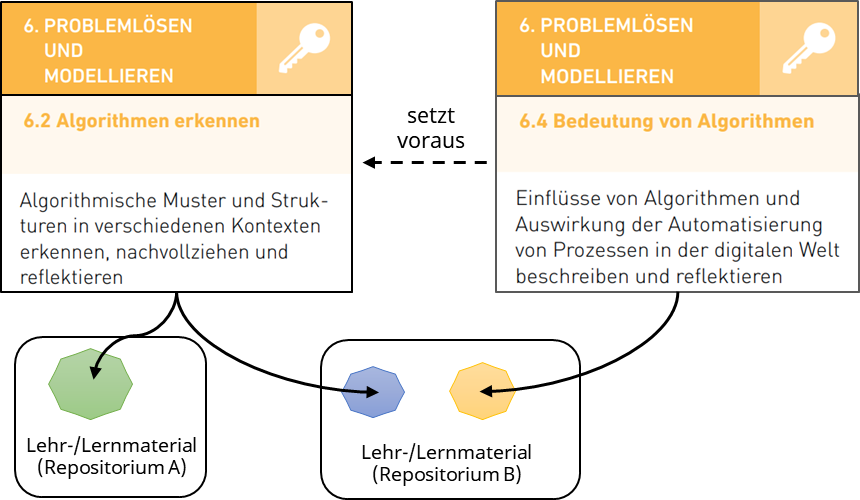
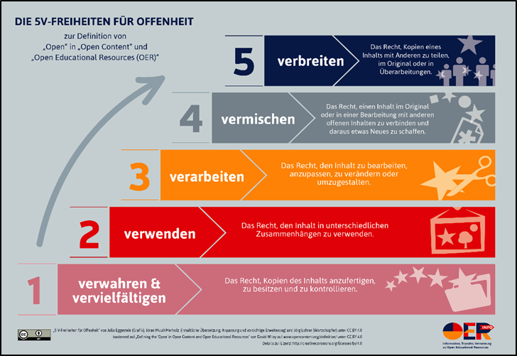
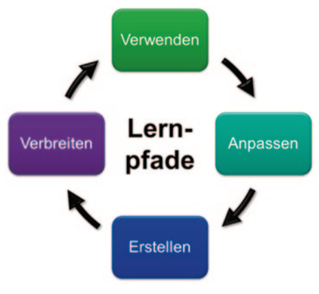
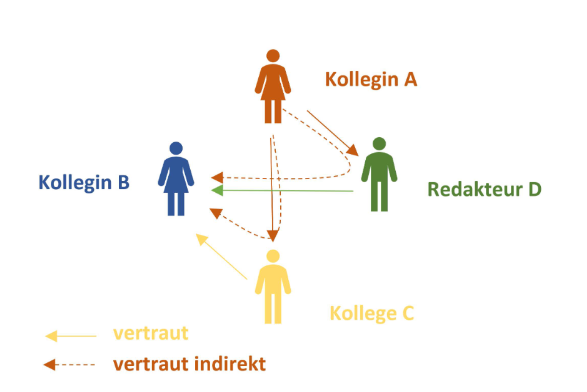

# 5 Use cases for educational metadata

Various educational metadata can be used to offer users helpful services in the field of education. The following describes exemplary use cases and shows possible applications of educational metadata. If comparable services exist, they are referenced by way of example. It should be emphasised that the use cases of an individual, specific application may require different educational metadata and, in particular, different value lists than those previously mentioned.

**Service-internal vs. standardised attributes**

Here, we refer you to the distinction made under “[What is educational metadata?](#was-sind-didaktische-metadaten)” between the use of service-internal attributes and standardised attributes. The attributes presented in the previous section mostly come from established metadata standards. They are used explicitly for data exchange, meaning that they may be underspecified, depending on how heterogeneous the group is that has agreed on the attributes and value lists for exchange. Much more detailed attributes and value lists can be used internally within the service. However, it is not always possible to reflect such variety in a data exchange.

## 5.1 Buddy finder: how to network

In the field of education, the “buddy finder” concept is used for networking and cooperation among learners. Such services aim to bring together learning partners or groups with similar educational interests or goals. They can provide the following functions:

- **Promoting networking among learners**: Educational services provide a platform that allows contacts to be made between learners based on common interests and educational goals.
- **Mutual support and collaborative learning**: The services facilitate the formation of learning communities to overcome challenges together, exchange knowledge and collaborate on projects.
- **Social inclusion:** Particularly in larger, new or distributed learning environments, educational services can support learners in establishing social connections and becoming included in the community.
- **Adaptation to specific learning needs**: Some buddy finder systems offer personalised search functions that enable users to find learning partners based on specific criteria such as language skills or fields of study.
- **Use of digital technologies**: In the context of e-learning, buddy finder systems integrate digital tools to support networking and collaboration in virtual learning environments.

Buddy finder services help to increase interaction, mutual exchange and cooperation among learners, which can have a positive impact on the learning experience and academic performance. Services for the following usage scenarios are conceivable and have already been implemented:

- Learning with and from others (peer learning)
  - Learning languages
    - With language partners
    - With a service/AI
  - Topic-based learning
    - Finding learning groups
    - Exchanging summaries
    - Exam preparation
- Support and private tutoring (online / in person)
  - Answering individual questions
- Creating a personal social network
  - Getting to know people in similar educational stages or educational institutions across different topics
  - Informal learning (leisure time)

**List of example services for the aforementioned usage scenarios**

> **Peer learning**

- Learning languages

  - [Babbel.com](https://www.babbel.com/), [Duolingo](https://de.duolingo.com/), [Interpals.net](https://www.interpals.net/), [HiLokals.com](https://www.hilokal.com/), [Speaky.com](https://www.speaky.com/), [Lingbe.com](https://www.lingbe.com/), [hellotalk.com](https://www.hellotalk.com/), [MyLanguageExchange.com](https://www.mylanguageexchange.com/), [Fluento](https://www.fluento.com/), [Preply.com](https://preply.com/), etc.

- Topic-based learning

  - General learning partners, learning groups
    - [Peer 2 Peer University](https://www.p2pu.org/en/learning-circles/) (learning circles), [StudyTogether](https://www.studytogether.com/), [Lernpartnerbörse KIT](https://lernpartnerboerse.hoc.kit.edu/), [Edukatico - WeLearning](https://www.edukatico.org/de/welearning/about), [Lerngruppen-App (FernUniversität in Hagen)](https://www.fernuni-hagen.de/studium/fernstudieren/lerngruppen-app.shtml), etc.
    - [studyprosc](https://www.studyprosc.de/), [studydrive](https://www.studydrive.net/), [unidog.de](https://www.unidog.de/), [StuDocu](https://www.studocu.com/de), etc.  
      (incl. exchange of exam preparations and summaries etc.)
  - Courses
    - [OpenHPI](https://open.hpi.de/), [LinkedIn Learning](https://de.linkedin.com/learning/), etc.

> **Support and private tutoring**

- General

  - [GoStudent](https://www.gostudent.org/), [Schülerhilfe](https://www.schuelerhilfe.de/), [Nachhilfe.de - Das Vergleichsportal](http://nachhilfe.de/), [Studienkreis](https://www.studienkreis.de/), [(eBay) Kleinanzeigen](https://www.kleinanzeigen.de/), etc.

- AI-based systems, for example, for answering individual questions

  - GPTs from [OpenAI](https://openai.com/)
  - [StuddyBuddy for professional development](https://study-buddy-research.de/) (BMBF)

> **Creating a personal social network (networking)**

- Getting to know people in similar educational stages or educational institutions across different topics

  - XING, LinkedIn, etc.

- Informal learning (leisure time)

  - [Buddy.me](http://buddy.me), [spontacts](https://spontacts.com/p/freizeitpartner-finden), [friendseek.com](http://friendseek.com), etc.

Various educational metadata can be used to implement the usage scenarios mentioned above. It is important to note that these are services that do *not* focus on data exchange. They are therefore based on attributes and value lists that are best suited to their use case. These can be based on standardised value lists, but are usually adapted and designed specifically for the service. The listed and established services are partly commercial and must provide their users with the best possible service and comprehensible user interfaces in order to assert themselves on the market. The list of example services makes it clear that most providers specialise in individual usage scenarios and do not implement all conceivable usage scenarios.

Buddy finder services operate in the social sphere by bringing together people who want to learn together or from each other.[^22](Software%20or%20AI-based%20buddy%20finders,%20which%20sometimes%20integrate%20a%20social%20component%20with%20gamification%20elements%20and%20ranking%20lists,%20represent%20an%20exception.) The educational metadata collected when using the services is quite limited and is mostly restricted to language and language level (in the case of language learning services), subject and topic and sometimes educational context or qualification (especially for tutoring). The further suitability of the respective buddies is then established among the users. In addition to this data, other personal data is often collected (name, e-mail, etc.), which, however, does not belong to the educational metadata.

**Examples of metadata**

- Learning languages: language, language level, (location)
- Finding learning groups / learning partners: subject/topic, (course)
- Tutoring: subject/topic, educational context, qualification, (price)

## 5.2 Personal learning paths: What are the next steps?

Recommendations for suitable learning paths help learners to systematically explore a learning objective or topic in order to achieve their learning goals ([Raj and Renumol 2024](#ref-rajialprmdrla2024)). But where do learning paths come from, what characterises them and how can a recommendation for a learning path be made?

### 5.2.1 Educational journey: What is a learning path?

The metaphor of the educational journey provides an initial idea for​the design of possible learning paths: On a journey, different paths can lead to the destination, experiences can be made and milestones can be reached, but hurdles may also have to be overcome and decisions made regarding specific routes, which may be more or less suitable depending on personal circumstances.

The concept can be found right at the beginning of the e-learning programme: For learners and teachers, learning paths represent a meaningful structuring of a learning process within and between learning activities and learning resources that are used to achieve a learning goal. ([Canter, Rivers, and Storrs 1985](#ref-cantercuncds1985)) ([Jih 1996](#ref-jihilplpmcal1996)).

Learning paths are discussed particularly in the mathematical and scientific fields ([Goldman 2020](#ref-goldmanlphlco2020)) ([Hillmayr et al. 2017](#ref-hillmayrdmimuseuuw2017)) ([Schmidt 2009](#ref-schmidtsldl2009)). Roth (2014) refers to example learning paths that have been provided by teachers for learners by combining individual learning aids into a coherent overall concept in order to organise learning processes ([Roth 2014, 4–5](#ref-rothldguu2014)).

Roth (2014) combines several definitions of the learning path as follows:

> *“A learning path is an internet-based learning environment that offers structured paths through interactive materials (e.g. applets) with a sequence of coordinated work assignments on which learners work towards a goal in an action-oriented, independent and autonomous manner. Since the work assignments have a modular structure, learners can select those that are suitable for their level of ability. Through individually accessible help and result controls as well as regular requests to formulate assumptions, experiment, argue as well as reflect and record the results in the work assignments, the independent engagement with the learning path is explicitly encouraged.” \[Roth ([2014](#ref-rothldguu2014)), p. 7\]*

Kerres & Buntins (2020) combine learning paths with *instructional design*, which includes sequencing of presented content, assignment of learning activities and monitoring of learning progress ([Kerres and Buntins 2020, 101f](#ref-kerresralapid2020)). The first variants of intelligent recommender systems were used to measure learning success and adapt subsequent learning experiences accordingly (Kerres & Buntins, 2020) or to generate learning paths dynamically in real time. Concrete attempts to implement such an approach in practice were barely visible in the past, achieved only minor effects in some meta-analyses and were therefore initially considered unpromising ([Kerres and Buntins 2020, 102](#ref-kerresralapid2020)). The absence of validated ontologies for the classification of learning content and learning activities and the lack of a knowledge base for the sequence of learning units were identified as the reasons for this ([Kerres and Buntins 2020, 102](#ref-kerresralapid2020)).\[^23\]

Recently, however, the question has re-emerged as to the extent to which machine-generated recommendations could also support learners in the selection of learning resources or in the learning experience. *Recommender systems* do not directly regulate the learning process, but leave the decisions to the learners and merely recommend possible learning paths ([Kerres and Buntins 2020, 103–4](#ref-kerresralapid2020)).

### 5.2.2 Linear, adaptive or recommender system: Where do the challenges for learning paths lie?

Essentially, three aspects of learning paths can be distinguished:

- Linear learning paths
- Adaptive learning paths
- Recommender systems for learning paths

Linear learning paths are designed as a static sequence of learning units that are not oriented towards the current needs of learners. Adaptive learning paths therefore offer a higher degree of individualisation by allowing learning environments to suggest different content or steps depending on the individual learning behaviour and context. In addition, recommender systems are being developed that suggest different possible learning paths to learners.

**Adaptivity of learning paths**

While Roth (2014) fails to mention adaptivity in learning paths, it is already more present in the current discourse on learning paths. Adaptivity is being researched and discussed in relation to measures to support learning processes and learner interactions ([Delaunay 2022](#ref-delaunayoglfasg2022)) ([Ezzaim et al. 2023](#ref-ezzaimaalsml2023)) ([Jing et al. 2023](#ref-jingrlalebsrp222023)) ([Kabudi, Pappas, and Olsen 2021](#ref-kabudiaalssml2021)) ([Kurilovas, Zilinskiene, and Dagiene 2014](#ref-kurilovasrslsalpisba2014)) ([Kurilovas, Zilinskiene, and Dagiene 2014](#ref-kurilovasrslsalpisba2014)) ([Normann et al. 2023](#ref-normannalpsblsns2023)) ([Pfaffmann and Roth 2022](#ref-pfaffmanneukuluzeundl2022)) ([Rahayu, Ferdiana, and Kusumawardani 2023](#ref-rahayusrlprs2023)) ([Raj and Renumol 2022](#ref-rajslracrple222022)) ([Raj and Renumol 2024](#ref-rajialprmdrla2024)).

When designing learning paths, branched learning paths can be integrated, which, for example, make it possible to differentiate subsequent tasks based on the evaluation of previous learning success, learning behaviour or other factors. The adaptive provision of content is a promising strategy for meeting the individual needs of teachers and learners.

Recommender systems for (AI-generated)\[^24\] learning paths – the functionality, possibilities and limits of which are currently being explored in the education sector – may offer a higher degree of self-determination ([Kerres and Buntins 2020](#ref-kerresralapid2020)) ([Reichow et al. 2022](#ref-reichowrbwghuhdiri2022)). These systems suggest learning paths but do not generate them independently. Ontology-based methods show promise with regard to personalised recommender systems ([Raj and Renumol 2024](#ref-rajialprmdrla2024)).

**Examples of how recommender systems work**

Recommender systems can help teachers to create successful learning paths in order to facilitate personalised learning, for example, by grouping learners based on different factors as a means of providing adaptive feedback \[Jyothi et al. ([2012](#ref-jyothirsaiblppls2012))\]. In order to classify [learning types](#lerntypen-lernstile), various educational metadata is extracted from the learning environments \[Felder and Silverman ([1988](#ref-felderltsee1988))\] \[Jamali and Mohamad ([2018](#ref-jamalidlses2018))\] \[Jyothi et al. ([2012](#ref-jyothirsaiblppls2012))\]. Recommender systems for learners sometimes also try to take learning preferences and interests into account \[Ma et al. ([2023](#ref-malrrkglsc2023))\]. The relationship between the resources is also relevant, for example, the semantic structure of a subject area, such as any similarity measures between content. Learning paths of other learners with comparable characteristics can also be taken into account \[Jyothi et al. ([2012](#ref-jyothirsaiblppls2012))\] \[Zhu et al. ([2018](#ref-zhumlprabkm2018))\]. The original methods for collecting factors for the provision of recommender systems are often based on questionnaires developed to characterise the learner. Newer methods attempt to determine these factors directly from the learning environments, for example, using learning analytics.

**Variants for generating learning paths**

The generation and analysis of individual and adaptive learning paths within digital learning environments is being investigated in numerous research projects in different contexts \[Kabudi, Pappas, and Olsen ([2021](#ref-kabudiaalssml2021))\] \[Oellers, Junker, and Holodynski ([2024](#ref-oellersilpmtpv2024))\] \[Rahayu, Ferdiana, and Kusumawardani ([2023](#ref-rahayusrlprs2023))\] \[Raj and Renumol ([2024](#ref-rajialprmdrla2024))\] \[Rivera Muñoz, Berríos, and Arias-Gonzáles ([2022](#ref-riveramunozsraltlhe2022))\], as are any potential support measures on these learning paths and the impact of various factors on learning success (see [Visible Learning MetaX](https://www.visiblelearningmetax.com/), [Hattie-Wiki:](https://web.fhnw.ch/plattformen/hattie-wiki/begriffe/Kategorie:Faktoren)[Faktoren](https://web.fhnw.ch/plattformen/hattie-wiki/begriffe/Kategorie:Faktoren)) \[Hattie ([2023](#ref-hattievlss1mra2023))\]. In addition to adaptive sequencing, learning support can be designed in a variety of ways, for example, using scaffolding, feedback, prompting or cueing in the learning process (see also [Learning environments:](#lernumgebungen-diagnostik-und-förderung)[diagnostics and support](#lernumgebungen-diagnostik-und-förderung)).

Learning paths can be generated by humans, but also by machines, even though Kerres states that the machine form of generation has so far remained more of a theoretical prototype ([Kerres and Buntins 2020, 102](#ref-kerresralapid2020)). While teachers can draw on their wealth of experience in creating learning paths to assess which work assignment follows another, machines cannot yet draw upon such experience. Although this experience could be gained by collecting concrete teaching and learning patterns, in practice it is associated with a range of hurdles, such as the unwanted learning of unproductive human learning behaviour, for example, when training artificial intelligence. Learning-enhancing sequencing by teachers may therefore be more promising.

**Prerequisites and challenges for recommender systems**

To generate a promising automated recommendation, various basic technical conditions must be met, including a reliable data basis from which the machine can learn as well as structured data that relates to the relevant data fields for a recommendation ([Reichow et al. 2022, 15–17](#ref-reichowrbwghuhdiri2022)). The creation of such a data basis is not without challenges, as not only can the machine easily learn undesirable behaviour, but also large amounts of data are needed in order to make reliable recommendations ([Reichow et al. 2022, 6–8, 16](#ref-reichowrbwghuhdiri2022)).

Yet providing high-quality structured data also comes with numerous challenges. The learning objects must be linked to educational metadata (e.g. competencies) which in turn exhibits corresponding semantic relationships, for example, dependencies such as competency requirements. Failure to identify appropriate dependencies will hinder the implementation of adaptive properties.

The linking of learning objects with competencies and the corresponding technical mapping have barely been established in practical implementations to date. In the “Mein Bildungsraum” initiative, the [CoKoMo](https://cokomo-it.de/docs/start/) project addresses this topic and develops a knowledge model as well as an application to model knowledge and competencies and then make them available in machine-readable format.

The links and dependencies between competencies are fundamental to the creation of learning paths and recommender systems in education, as they work differently to recommender systems that we use in everyday life (such as content recommendations from Spotify or Netflix or product recommendations from Amazon) ([Kerres and Buntins 2020, 107](#ref-kerresralapid2020)).

After using a specific learning object, learners should not simply move on to any other object. They need one that builds on the previous learning object and brings them a step closer to the learning goal that has been set. It should also be noted that simply because a learning object has been used, it does not necessarily mean that a learning goal has been achieved. In order to keep learners on a path that promotes learning, it is therefore necessary to continuously check whether the relevant learning objectives have been achieved (e.g. whether the necessary competencies have been acquired), on the basis of which further learning objects (or learning paths) are automatically suggested.

The technologies used for recommender systems as well as for creating learning paths range from statistical methods to complex neural networks. In the latter case, it is sometimes no longer clear why such recommendations are made, which also gives rise to ethical challenges ([Kerres and Buntins 2020, 108f](#ref-kerresralapid2020)) ([Reichow et al. 2022, 8f](#ref-reichowrbwghuhdiri2022).).

Even though technologies and theories are available to meet these challenges, it is no mean feat to develop an appropriate service:

- The competency catalogues are often not available in a machine-readable version.
- Competency catalogues sometimes differ considerably due to federal or institutional structures. In order to offer comprehensive services, appropriate mapping is required.
- Learning objects are not linked to competency metadata.

 Figure: *Relationships between competencies with elements from the Media Competence Framework NRW \[@ blodaumn2019\]. In technical terms, relationships between competencies can be defined (here: “requires”), however, this information is often not available in machine-readable form, but rather as text/graphics, for example.*

Existing implementations, such as [Aleks](https://www.aleks.com) or [Bettermarks](https://de.bettermarks.com/), often originate from the MINT sector, as the associated competencies can be easily systematised and arranged into a hierarchy. Transferring this to humanities-based subjects is viewed as challenging \[Euler et al. ([1987](#ref-eulercu1987)), p. 77\]. The tutorial language learning apps presented in the [chapter on buddy finders](#buddy-finder-ich-will-mich-vernetzen) can be regarded as highly specialised learning path finders.

**Effectiveness of adaptive learning systems**

Some controversy exists when it comes to the effectiveness of adaptive systems. While some findings suggest fairly minor effects ([Kerres and Buntins 2020, 102](#ref-kerresralapid2020)), Hillmayr et al. conclude as follows:

> “Intelligent tutoring systems that allow adaptation to the individual learning level of users and differentiated feedback on task solutions therefore demonstrate a comparatively high level of effectiveness.” ([Hillmayr et al. 2017, 24](#ref-hillmayrdmimuseuuw2017)).

The diversity of results regarding effectiveness makes it clear that the topic is currently the subject of controversial debate in research.

### 5.2.4 How can a learning path be adapted?

In the following, we look at learning theory aspects, particularly with regard to adaptivity. We then discuss potentially usable educational metadata.

A learning path is initially a structured collection of different learning units that are used to achieve a learning objective. For adaptive learning paths, characteristics of learners, learning behaviour and their context should be taken into account. Adaptive learning takes place through the individual adaptation of the learning offer or the learning environment. In this way, adaptivity can promote lifelong and self-directed learning and adapt to the changing needs of learners.

In addition to the adaptation of learning paths via the didactic sequencing of various educational resources presented above, adaptation can also take place within the individual learning activities. Learning paths can be customised taking into account various characteristics of learning and their context, including, for example:

- Motivation

- Learning prerequisites (prior knowledge, previous competencies, etc.)

- Personal learning preferences (format, time, language, sequencing, etc.)

- Previous learning progress (fulfilment of preconditions, e.g. completed tests)

- Assessment of performance, with dynamic adaptation of learning paths also based on current performance or current learning behaviour. The basis for this is prediction models from the field of predictive learning using methods such as learning analytics and educational data mining, artificial intelligence or machine learning (see [Learning environments:](#lernumgebungen-diagnostik-und-förderung)[diagnostics and support](#lernumgebungen-diagnostik-und-förderung))

By taking into account learning theories, concepts and methods, the learning process can be individually adapted and supported. These concepts include:

- Active recall and spaced repetition, for example, when learning vocabulary
- Zone of proximal development (Vygotskij)
- Cognitive load theory (Sweller & Chandler)
- Cognitive theory of multimedia learning (Mayer)
- Metacognition (Flavell)
- Scaffolding, modelling, cueing, prompting, fading, feedback
- Conceptual change approaches (Chi) \[usually in the natural sciences\]
  - Continuous: revision/expansion of current knowledge concepts
  - Discontinuous: addressing conflicting ideas or misconceptions, see also [cognitive dissonance](https://dorsch.hogrefe.com/stichwort/kognitive-dissonanz) (Piaget), Aha! moment (Bühler) and learning through insight (Köhler & Wertheimer)

Data from adaptive learning experiences can also be used in the context of the following topics:

- Optimised data analysis for diagnostics (for teachers/institutions)
- Competence-based diagnostics
- Data-driven decision-making in education

Learning systems can adapt learning objects in different ways – for example, in terms of the difficulty, instruction or format – to enable different methods of access (e.g. textual, auditory, visual) (see also [Accessibility](#zugänglichkeit-und-barrierearmut)). Adaptive testing to measure learning progress is achieved by dynamically selecting and adjusting the level of difficulty during the learning process.

### 5.2.5 Why do different learning paths exist?

Offering different learning paths to achieve individual goals serves in particular to facilitate internal differentiation and the personalisation of learning. For example, further, in-depth tasks, information or tips and assistance can be provided in an individually tailored manner and a sequence of relevant resources of different types can be presented.

The choice of difficulty level may influence the motivation to learn. Tasks that are too easy should not be presented in order to avoid under-challenging students, while tasks that are too difficult should also be avoided so as not to over-challenge students; unsolved tasks can lead to a sense of frustration or a decrease in motivation. Taking into account the individual profiles of learners can improve the learning experience and success ([Imran et al. 2016](#ref-imranpplors2016)). Intelligent recommender systems take account of the level of difficulty and select resources that best match the learner’s abilities.

Learning paths can help to achieve the desired learning goal by:

- Informing learners about their current level and showing them the next steps: Where am I in the learning process, what is still to come, how and with what do I proceed?
- Helping learners to reflect on their own learning behaviour: What previous steps have I carried out? Which resources have I already processed and analysed?

From a teacher’s point of view, such learning paths can also be used to evaluate teaching and learning success, for example, to improve incomprehensible passages in materials.

Learning paths can be designed in different ways, e.g. through:

- Internal differentiation: different learning paths within one resource (e.g. branching scenarios, user flows)
- External differentiation: various additional resources

### 5.2.6 Educational metadata for providing learning paths

Educational metadata serves as the foundation for the technical realisation of adaptive learning paths and recommender systems.

[**Learning objectives, their prerequisites and testing**](\l)

Hierarchically structured [topics and content](#fach--und-themenzuordnung) build on one another and are best learned one after the other so that a systemic understanding can be acquired in a logical sequence. Such a sequence of content is often defined in curricula. Here, structural metadata takes on a didactic function and reflects didactically relevant associative relationships between resources (see [structural metadata](#was-sind-typen-von-metadaten)), which in turn are used in a recommender system that presents individualised suggestions based on a learner’s learning level and progress.

**Individual adaptation of learning content to the learner**

By defining didactic indicators to monitor learning success (number of attempts, results of an interactive task such as a quiz or similar), the [level](#niveaustufe) can be adapted accordingly. For example, the context and the profile of a learner can be used to adapt the [language level](#sprache-und-sprachniveau) or make texts more accessible by structuring them, for example, by highlighting or using alternative wording (easy language). Adaptation to the individual needs of learners can therefore be optimised with the help of educational metadata. For example, special offers can be made available to promote desired skills or take inclusive characteristics into account.

### 5.2.7 Life cycles of resources and learning paths

Roth assumes that learning paths are created by educators and does not consider automatic generation. At the end of his section, he makes a plea for teachers to share the learning paths they have created and outlines a

<!--  -->

Hier beginnt Ihr Text, der um das Bild herum fließt. Sie können so viel Text hinzufügen, wie Sie benötigen, und er wird sich entsprechend um das Bild herum anordnen. Dies sorgt für ein ästhetisch ansprechendes Layout, das häufig in Nachrichtenartikeln, Blogs und anderen Medien verwendet wird.

“life cycle” ([Roth 2014, 20](#ref-rothldguu2014)) that is strongly reminiscent of the five freedoms of OER ([Heck et al. 2020](#ref-heckdoiecoer2020)) ([Muuß-Meerholz 2015](#ref-muuss-meerholzzdooerrndwadav2015)). Due to the freedoms granted, OER go through various development cycles beyond their creation, for example, through customisation and distribution processes (improvement of quality, adaptation for different target groups and purposes, utilisation of the OER remix right, etc.). Different versions and forks or branches are created, in particular through the freedom to mix content and thereby create new resources. In the case of educational resources, adaptations can be understood as the reuse of content across different usage scenarios (recording, archiving, searching etc.), educational levels (adaptation to target groups and difficulty), language barriers and different educational services ([Duval 2001, 458](#ref-duvalsmesr2001)). These freedoms bring with them the challenge of linking together metadata from versions and variants of the same resource ([JOINTLY.info 2020](#ref-jointly.infokmbos2020)).

Left-hand figure: *“Die 5V-Freiheiten für Offenheit” (The five freedoms of OER) by Julia Eggestein, Jöran Muuß-Merholz and Jörg Lohrer under CC BY 4.0, based on “Defining the ‘Open’ in Open Content and Open Educational Resources” by David Wiley under CC BY 4.0.*  
Right-hand figure: *Life cycle of learning paths ([Roth 2014, 20](#ref-rothldguu2014)).*

### 5.2.8 Tools, services and projects relating to learning paths

Examples of tools

- [Adaptive learning paths](https://docs.moodle.org/403/de/Einsatzszenarien_f%C3%BCr_Voraussetzungen#Adaptive_Lernpfade) in Moodle, [H5P branching scenario](https://h5p.org/branching-scenario), [Bettermarks](https://de.bettermarks.com/), [Aleks](https://www.aleks.com/)

Projects

- [Adaptive learning cloud (ALC) \[FWU](https://fwu.de/projekte/alc/)\] (project plan, implementation unknown)
- [CoKoMo – modelling of knowledge](https://cokomo-it.de/docs/)
- [E365 Maverick](https://web.archive.org/web/20231031223903/https://www.meinbildungsraum.de/vorhaben/foerderprojekte-und-partner/aktuelle-foerderprojekte/e365-maverick-ehem-eagl2-kuenstliche-intelligenz-fuer-die-automatische-generierung-von-lernpfaden):

Generating learning paths automatically using artificial intelligence

- [ITS – intelligent tutorial systems](https://www.kmk.org/de/themen/bildung-in-der-digitalen-welt/laenderuebergreifende-projekte.html)

<table>

<colgroup>

<col style="width: 6%" />

<col style="width: 93%" />

</colgroup>

<tbody>

<tr class="odd">

<td>

💡
</td>

<td>

<strong>Summary</strong>
</td>

</tr>

<tr class="even">

<td>

</td>

<td>

Learning paths facilitate:

<ul>

<li>

Self-directed, independent learning

</li>

<li>

Internal differentiation and individual support

</li>

<li>

The adaptation of activities and content to the needs of learners

</li>

<li>

The didactically pre-structured sequencing of a learning object, e.g. for the systematic development of a topic/field of knowledge

</li>

<li>

The monitoring of one's own and others' learning progress

</li>

<li>

The learning-goal-orientated recommendation of resources based on the current status of a learner

</li>

</ul>

</td>

</tr>

</tbody>

</table>

## 5.3 Searching and finding: How can I find what I’m looking for?

Searching for and finding learning resources is probably one of the most widely implemented usage scenarios for educational metadata. From international OER platforms such as [Merlot](https://www.merlot.org/merlot/index.htm) through to the national platforms [OERSI](https://oersi.org/) (university), [WirLernenOnline](https://www.wirlernenonline.de/) (school, increasingly interdisciplinary) or [MUNDO](https://mundo.schule/) (school), all platforms use educational metadata sets to direct searches to the relevant material. Commercial platforms such as [eduki](https://eduki.com/de), [4teacher](https://www.4teachers.de/) or [meinUnterricht](https://www.meinunterricht.de/) also use corresponding metadata to describe their content.

**But how do you find the right material from the abundance of offers?**

The platforms above offer a wide range of materials, often listing thousands to hundreds of thousands of entries. The services offer a number of filter options to narrow down the results. But even after setting several filters, numerous materials often remain. For example, for the filter combination “Deutsch”, “Lesen”, “1. Klasse”, “Arbeitsblätter”, “5-20 Seiten” [eduki](https://eduki.com/de) lists over 1500 results. Surprisingly, few of the platforms mentioned offer commenting or rating functions to enable users to provide feedback on a material and use this in the search. In addition, most of the platforms mentioned do not contain other social components, such as following authors for new materials – a function that is offered by eduki, for example. Such features are essential for large commercial content providers (YouTube, Instagram etc.) to connect content creators with their followers.

In the following, we explain in more detail the aspects of filtering, use of a social graph and semantic search when looking for and finding materials and demonstrate their often unexploited potential.

### 5.3.1 Finding relevant material: filtering, competence orientation and wallet

To provide users with a better search experience, search engines such as Google or Bing save personalised data in order to take it into account in the search. As this use of data is often non-transparent, the procedure has been criticised. However, such a process could also be designed to be data-efficient and self-sufficient, as the wallet concept of the “Mein Bildungsraum” initiative shows. In this case, user data is stored in the respective user’s wallet and any authorisations for use with other services are then managed by the users from there. For this usage scenario, data such as “subject interest”, “educational level” and more could be saved before being automatically preselected in the search filters. If additional administrative data were stored, the search service could see which subjects a teacher teaches and make appropriate suggestions for materials. It would also be conceivable to integrate competence-orientated data into one’s own profile, resulting in overlaps with [learning paths](#persönliche-lernpfade-wie-geht-es-jetzt-weiter). A search service could use this information to display corresponding references that indicate prerequisite competencies or competencies to be acquired. These attributes can also be used in the ranking by positioning resources that do not contain any of the targeted competencies or those that contain competencies that are above or below the targeted competence in competence hierarchies lower down in the list of results.

### 5.3.2 Using the social graph for ranking and filtering

The wealth of material on content platforms makes it clear that there is not necessarily a supply problem, but that the challenge lies in directing searchers to the material that is relevant to them. So how do you find the needle in the haystack?

Teaching/learning processes usually take place in a social context. Teachers have colleagues who teach similar subjects and topics and exchange ideas regarding approaches, methods and materials. Learners want to learn the same competencies or topics, or have to prepare for the same exam. The exchange between and within the two groups works well in analogue scenarios, be it through the collection of materials in the classroom, the exchange of notes between learners or even simple personal recommendations such as “Have a look at XY, it really helped me”.

For the most part, these personal, social mechanisms have not yet been transferred to educational platforms. This is primarily due to the fact that establishing a social graph is not insignificant, both for the provision of services and for users. The greatest difficulty for services is to build up a base of relevant users with whom others can network. This is why there is usually only one comparable “type” of successful social media platform: one Facebook, one Instagram, one Reddit, one Twitter/X, etc. It does not make sense for users to switch to a counterpart if it does not have any users or content. This is also where the difficulty lies for users: Establishing a social graph is a not insignificant process – relevant people have to be found and contacts made. The construction of these graphs is primarily designed in such a way that they cannot be transferred between services. Your Facebook friends cannot be transferred to Twitter/X, your Instagram followers cannot be transferred to Spotify etc. This results in lock-in effects, which is presumably the basis for the success of these platforms.

However, there are currently two relevant developments that address this portability challenge:

- Decentralised social media protocols (ActivityPub, Nostr)
- National central platforms with standardised identity management (for example, identity and access management from the “Mein Bildungsraum” initiative or the Norwegian Digital Learning Arena)

What both developments have in common is that services do not have to worry about identity management because this is outsourced: completely autonomous (ActivityPub, Nostr) or centralised through a platform. At the same time, these approaches also enable the formation of cross-service social networks. Such a model has been implemented on the Norwegian educational platform [NDLA](https://ndla.no/) using a central login that is available to all Norwegian teachers. Here, “circle of trust” models were introduced as part of a sub-project on the topic of quality assurance. People can classify other people as “trustworthy”. This level of trust can then be transferred transitively, in the sense of “I trust you and if you trust person B, I also trust person B”.\[^25\]

 Figure: *Circle of Trust (figure from Frank Müller) \[Müller ([2019](#ref-muellercuhsffvboabpnnnwmi2019)), p. 51\])*

Such models can be used to rank the used or positively rated material higher in searches in social contexts by including the social graphs of the searchers.

### 5.3.4 Exploratory, semantic searches

To use keyword searches effectively, searchers should be familiar with the logical structure and vocabulary. Particularly at the beginning of a search, insufficient background or domain knowledge (e.g. technical terms, complex relationships such as cause and effect chains, etc.) can make it difficult to find and access relevant resources, especially if relevant keywords are still unknown. Search queries can then only be formulated inadequately, making it almost impossible for traditional search engines to deliver relevant results for these searches. Exploratory, semantic searches can change this and also support the serendipity principle, which enables the chance discovery of suitable resources. They also prevent the relevance paradox, which otherwise limits the search for relevant information from the outset.

Addressed challenges that searchers may face:

- Ambiguous search queries (lexical or structural ambiguity)
- Language barriers (spelling, lexical hierarchy: hyponym/hyperonym, meronym/holonym)
- Unknown relationships between entities

## 5.4 Learning environments: diagnostics and support

A learning analytics approach enables the collection, aggregation, analysis and evaluation of data from educational learning contexts, especially within digital learning environments. The approach makes it possible to gain insights into learning processes, adapt the respective content to the needs of learners, determine, predict and improve their performance and identify success factors of and potential obstacles to educational resources, learning activities or individual learning behaviour ([Chatti et al. 2012](#ref-chattirmla2012)) ([Conole et al. 2011](#ref-conoleml2gpc2011)) ([Hoppe 2017](#ref-hoppecmalkbc2017)) ([Knight and Buckingham Shum 2017](#ref-knighttla2017)) ([Siemens 2013](#ref-siemenslaed2013)) ([Siemens and Baker 2012](#ref-siemenslaedmcc2012)).  
This method enables data-driven decisions to improve teaching/learning processes and materials ([Khor and K 2024](#ref-khorsrrlaspl2024)). In this context, metadata created in digital learning environments thus takes on a didactic function for learners and teachers. The data collected from learning processes can be used for adaptive learning support or individual feedback, for example, formatively in the learning process or summatively in an ePortfolio, each of which enables the monitoring of one’s own or other people’s learning processes. Teachers can use educational metadata from learning processes to obtain diagnostic information (e.g. via dashboards) in order to structure their teaching more effectively. Based on this data, various measures can support learning success, such as targeted individual coaching, exercises, scaffolding of learning environments, feedback and responses, adaptive learning support (modelling, prompting, cueing), and much more.

**Metrics and indicators for characterising learning processes**

Various metrics act as indicators to characterise learning processes ([Ahmad, Schneider, Weidlich, et al. 2022](#ref-ahmadwicsyerlair2022)) ([Ahmad, Schneider, Griffiths, et al. 2022](#ref-ahmadcdlrlaildp2022)), including:

- Number of views or attempts
- Results of individual learning success checks (e.g. test or quiz formats)
- Self-assessment
- Processing time for individual learning content (e.g. reading time)
- Processing progress
- Number of resources used or processed
- Login/logout time and frequency
- Keystrokes (e.g. free text tasks)

A comprehensive directory of learning events, learning activities, metrics and indicators can be found in the [OpenLAIR](https://edutec-tool.github.io/) project.

Moodle LMS is based on the [Community of Inquiry model](https://coi.athabascau.ca/) \[Castellanos-Reyes ([2020](#ref-castellanos-reyes2ycif2020))\] \[Garisson, Anderson, and Archer ([2000](#ref-garissoncitecche2000))\], which identifies three components of educational processes. Depending on the respective learning activities in Moodle, indicators were identified for these components \[Moodle ([2019](#ref-moodlea2019))\] \[Moodle ([2022](#ref-moodleaa2022))\], which can characterise these learning processes, including:

1.  Cognitive presence (scale: cognitive depth from 0 to 5)

    - Details of the activity were considered
    - Content relating to the activity was submitted
    - Feedback was considered
    - Feedback was submitted
    - Revised content relating to the activity was submitted

2.  Social presence (scale: social breadth from 0 to 5)

    - Interaction variants with other learners (in the context of an activity)

3.  Pedagogical presence

These indicators can be used in machine-learning-based or statistical models, for example, to make predictions (e.g. drop-out risk, difficulties with learning activities, low participation). It should be taken into account that not all learning objectives are quantifiable and feedback is therefore often of an indicative nature.

**Characteristics of learning environments**

Several characteristics can be included to classify learning environments ([Pawlowski 2001, 47](#ref-pawlowskieevzecl2001)):

- Context
- Learning situation (spatial, temporal)
- Learning content (facts/context-free rules, context-dependent rules, problem solving, complex situations, shape/pattern recognition)
- Learning objectives (cognitive, affective, psychomotor, social)
- Learning theories (behaviourism, cognitivism, constructivism, connectivism, etc.)
- Learning time (synchronous, asynchronous, mixed forms)
- Learning duration (closed, open)
- Degree of integration (communication between the teacher, learner, computer)
- Roles (learner, teacher, etc.)
- Interaction
- Presentation
- Didactic methods
- Evaluation

**Implementation and usefulness of learning analytics methods**

The implementation of learning analytics methods requires a complex interplay of learning activities and learning systems. Different learning activities make it difficult to process the learning data collected. Special attention must also be paid to data protection and data security. However, this method also poses challenges for learners and teachers, as the data collected is semantically and syntactically complex and therefore difficult to interpret. Teachers and learners can be supported in evaluating the data via easy-to-understand dashboards so that learning environments and learning analytical procedures can fulfil the expected diagnostic potential and opportunities for adaptive and individual support.

\[^23\]: The [CoKoMo project](https://cokomo-it.de/) addresses the latter as part of the “Mein Bildungsraum” initiative.

\[^24\]: For an explanation of the relationship between recommender systems and artificial intelligence, see Reichow et al. ([Reichow et al. 2022, 8–9](#ref-reichowrbwghuhdiri2022)).

\[^25\]: These and similar models are also discussed under the heading [“web of trust”](https://en.wikipedia.org/wiki/Web_of_trust).

Ahmad, Atezaz, Jan Schneider, Dai Griffiths, Daniel Biedermann, Daniel Schiffner, Wolfgang Greller, and Hendrik Drachsler. 2022. “Connecting the Dots – A Literature Review on Learning Analytics Indicators from a Learning Design Perspective.” *Journal of Computer Assisted Learning*, July, jcal.12716. <https://doi.org/10.1111/jcal.12716>.

Ahmad, Atezaz, Jan Schneider, Joshua Weidlich, Daniele Di Mitri, Jane Yau, Daniel Schiffner, and Hendrik Drachsler. 2022. “What Indicators Can I Serve You with? An Evaluation of a Research-Driven Learning Analytics Indicator Repository:” In *Proceedings of the 14th International Conference on Computer Supported Education*, 58–68. Online Streaming, --- Select a Country ---: SCITEPRESS - Science and Technology Publications. <https://doi.org/10.5220/0010995800003182>.

Canter, David, Rod Rivers, and Graham Storrs. 1985. “Characterizing User Navigation Through Complex Data Structures.” *Behaviour & Information Technology* 4 (2): 93–102. <https://doi.org/10.1080/01449298508901791>.

Castellanos-Reyes, Daniela. 2020. “20 Years of the Community of Inquiry Framework.” *TechTrends* 64 (4): 557–60. <https://doi.org/10.1007/s11528-020-00491-7>.

Chatti, Mohamed Amine, Anna Lea Dyckhoff, Ulrik Schroeder, and Hendrik Thüs. 2012. “A Reference Model for Learning Analytics.” *International Journal of Technology Enhanced Learning* 4 (5/6): 318. <https://doi.org/10.1504/IJTEL.2012.051815>.

Conole, Gráinne, Dragan Gašević, Phillip Long, and George Siemens. 2011. “Message from the LAK 2011 General & Program Chairs.” In *International Learning Analytics & Knowledge Conference 2011*. Association for Computing Machinery (ACM).

Delaunay, Alexis. 2022. “Operationalisierung Graph-basierter Lernpfade für adaptive Serious Games.” <https://web.archive.org/web/20240318110439/https://websites.fraunhofer.de/alexanderstreicher/wp-content/uploads/2022/10/BScDelaunay2022.pdf>.

Duval, Erik. 2001. “Standardized Metadata for Education: A Status Report.” *ED-MEDIA 2001 World Conference on Educational Multimedia, Hypermedia & Telecommunications. Proceedings (13th, Tampere, Finland, June 25-30, 2001)*, 458–63. <https://web.archive.org/web/20220617195250/http://files.eric.ed.gov/fulltext/ED466155.pdf>.

Euler, Dieter, Ralf Jankowski, Andreas Lenz, Paul Schmitz, and Martin Twardy. 1987. *Computerunterstützter Unterricht*. Wiesbaden: Vieweg+Teubner Verlag. <https://doi.org/10.1007/978-3-322-85464-3>.

Ezzaim, Aymane, Aziz Dahbi, Abdelfatteh Haidine, and Abdelhak Aqqal. 2023. “AI-Based Adaptive Learning: A Systematic Mapping of the Literature.” *JUCS - Journal of Universal Computer Science* 29 (10): 1161–98. <https://doi.org/10.3897/jucs.90528>.

Felder, R. M., and L. K. Silverman. 1988. “Learning and Teaching Styles in Engineering Education,” Engineering education, 78 (7): 674–81.

Garisson, D., T. Anderson, and W. Archer. 2000. “Critical Inquiry in a Text-Based Environment. Computer Conferencing in Higher Education.” *The Internet and Higher Education* 2 (2-3): 87–105. <http://web.archive.org/web/20240301135013/https://operations.du.edu/sites/default/files/2020-05/Garrison_Anderson_Archer_Critical_Inquiry_model.pdf>.

Goldman, Na’ilah Suad Nasir, Maxine McKinney de Royston, Brigid Barron, Phillip Bell, Roy Pea, Reed Stevens, Shelley. 2020. “Learning Pathways: How Learning Is Culturally Organized.” In *Handbook of the Cultural Foundations of Learning*. Routledge.

Hattie, John. 2023. *Visible Learning, the Sequel: A Synthesis of over 2,100 Meta-Analyses Relating to Achievement*. First edition. London ; New York, NY: Routledge.

Heck, Tamara, Sylvia Kullmann, Johannes Hiebl, Nadine Schröder, Daniel Otto, and Pia Sander. 2020. “Designing Open Informational Ecosystems on the Concept of Open Educational Resources.” *Open Education Studies* 2 (1): 252–646. <https://doi.org/10.1515/edu-2020-0130>.

Hillmayr, Delia, Frank Reinhold, Lisa Ziernwald, and Kristina Reiss. 2017. *Digitale Medien im mathematisch-naturwissenschaftlichen Unterricht der Sekundarstufe: Einsatzmöglichkeiten, Umsetzung und Wirksamkeit*. Edited by Zentrum für Internationale Bildungsvergleichsstudien. Münster: Waxmann.

Hoppe, H. Ulrich. 2017. “Computational Methods for the Analysis of Learning and Knowledge Building Communities.” In *Handbook of Learning Analytics*, edited by Columbia University, USA, Charles Lang, George Siemens, University of Texas at Arlington, USA, Alyssa Wise, New York University, USA, Dragan Gasevic, and University of Edinburgh, UK, First, 23–33. Society for Learning Analytics Research (SoLAR). <https://doi.org/10.18608/hla17.002>.

Imran, Hazra, Mohammad Belghis-Zadeh, Ting-Wen Chang, Kinshuk, and Sabine Graf. 2016. “PLORS: A Personalized Learning Object Recommender System.” *Vietnam Journal of Computer Science* 3 (1): 3–13. <https://doi.org/10.1007/s40595-015-0049-6>.

Jamali, A., and M. Mohamad. 2018. “Dimensions of Learning Styles Among Engineering Students.” *Journal of Physics: Conference Series* 1049 (July): 012055. <https://doi.org/10.1088/1742-6596/1049/1/012055>.

Jih, Hueyching Janice. 1996. “The Impact of Learners’ Pathways on Learning Performance in Multimedia Computer Aided Learning.” *Journal of Network and Computer Applications* 19 (4): 367–80. <https://doi.org/10.1006/jnca.1996.0025>.

Jing, Yuhui, Leying Zhao, Keke Zhu, Haoming Wang, Chengliang Wang, and Qi Xia. 2023. “Research Landscape of Adaptive Learning in Education: A Bibliometric Study on Research Publications from 2000 to 2022.” *Sustainability* 15 (4): 3115. <https://doi.org/10.3390/su15043115>.

JOINTLY.info. 2020. “Konsistenz Der Metadaten Beim OER-Remix Sicherstellen.” <https://web.archive.org/web/20240205145638/https://jointly.eduloop.de/loop/Such-_und_Informationsm%C3%B6glichkeiten_nach_und_zu_OER>.

Jyothi, Nava, Kaveri Bhan, Uday Mothukuri, Sandesh Jain, and Dhanander Jain. 2012. “A Recommender System Assisting Instructor in Building Learning Path for Personalized Learning System.” In *2012 IEEE Fourth International Conference on Technology for Education*, 228–30. Hyderabad, India: IEEE. <https://doi.org/10.1109/T4E.2012.51>.

Kabudi, Tumaini, Ilias Pappas, and Dag Håkon Olsen. 2021. “AI-Enabled Adaptive Learning Systems: A Systematic Mapping of the Literature.” *Computers and Education: Artificial Intelligence* 2: 100017. <https://doi.org/10.1016/j.caeai.2021.100017>.

Kerres, Michael, and Katja Buntins. 2020. “Recommender in AI-Enhanced Learning: An Assessment from the Perspective of Instructional Design.” *Open Education Studies* 2 (1): 101–11. <https://doi.org/10.1515/edu-2020-0119>.

Khor, Ean Teng, and Mutthulakshmi K. 2024. “A Systematic Review of the Role of Learning Analytics in Supporting Personalized Learning.” *Education Sciences* 14 (1): 51. <https://doi.org/10.3390/educsci14010051>.

Knight, Simon, and Simon Buckingham Shum. 2017. “Theory and Learning Analytics.” In *Handbook of Learning Analytics*, edited by Columbia University, USA, Charles Lang, George Siemens, University of Texas at Arlington, USA, Alyssa Wise, New York University, USA, Dragan Gasevic, and University of Edinburgh, UK, First, 17–22. Society for Learning Analytics Research (SoLAR). <https://doi.org/10.18608/hla17.001>.

Kurilovas, Eugenijus, Inga Zilinskiene, and Valentina Dagiene. 2014. “Recommending Suitable Learning Scenarios According to Learners’ Preferences: An Improved Swarm Based Approach.” *Computers in Human Behavior* 30 (January): 550–57. <https://doi.org/10.1016/j.chb.2013.06.036>.

Ma, Hua, Yuqi Tang, Xuxiang Zhang, Haibin Zhu, Peiji Huang, and Hongyu Zhang. 2023. “Learning Resource Recommendation via Knowledge Graphs and Learning Style Clustering.” *Journal of Intelligent & Fuzzy Systems* 44 (5): 8053–69. <https://doi.org/10.3233/JIFS-222627>.

Moodle, ed. 2019. “Analytics-Indikatoren.” <http://web.archive.org/web/20240301133224/https://docs.moodle.org/403/de/Analytics-Indikatoren>.

———. 2022. “Analytics API.” <http://web.archive.org/web/20231122231640/https://moodledev.io/docs/apis/subsystems/analytics>.

Müller, Frank J. 2019. “Chancen und Herausforderungen staatlich finanzierter, frei verfügbarer Bildungsmaterialien (OER) am Beispiel der Plattform ndla.no in Norwegen. Ein Weg zu mehr Inklusion?” <https://doi.org/10.25656/01:16993>.

Muuß-Meerholz, Jöran. 2015. “Zur Definition von „Open“ in „Open Educational Resources“ – die 5 R-Freiheiten nach David Wiley auf Deutsch als die 5 V-Freiheiten.” *OERinfo – Informationsstelle OER* (blog). 2015. <https://web.archive.org/web/20230607030953/https://open-educational-resources.de/5rs-auf-deutsch/>.

Normann, Marc, Jim Haug, Yeimy Valencia, Jörg Abke, and Georg Hagel. 2023. “Adaptive Learning Path Sequencing Based on Learning Styles Within N-Dimensional Spaces.” In *Proceedings of the 5th European Conference on Software Engineering Education*, 56–64. Seeon/Bavaria Germany: ACM. <https://doi.org/10.1145/3593663.3593676>.

Oellers, Manuel, Robin Junker, and Manfred Holodynski. 2024. “Individual Learning Paths Mastering Teachers’ Professional Vision.” *Frontiers in Education* 9. <https://doi.org/10.3389/feduc.2024.1305073>.

Pawlowski, Jan Martin. 2001. “Essener-Lern-Modell (ELM): Ein Vorgehensmodell zur Entwicklung computerunterstützter Lernumgebungen.” <https://nbn-resolving.org/urn:nbn:de:hbz:465-miless-010262-1>.

Pfaffmann, Christoph, and Jürgen Roth. 2022. “Entwicklung einer universellen Konfigurations- und Lehr-Lern-Umgebung (UKuLeLe) zur Erstellung und Nutzung digitaler Lernpfade.” *Digitales Lernen in Distanz und Präsenz: Herbsttagung 2021 des Arbeitskreises Mathematikunterricht und digitale Werkzeuge in der Gesellschaft für Didaktik der Mathematik am 24.09.2021*, June, p. 99. <https://doi.org/10.17185/DUEPUBLICO/76039>.

Rahayu, Nur W., Ridi Ferdiana, and Sri S. Kusumawardani. 2023. “A Systematic Review of Learning Path Recommender Systems.” *Education and Information Technologies* 28 (6): 7437–60. <https://doi.org/10.1007/s10639-022-11460-3>.

Raj, Nisha S., and V. G. Renumol. 2022. “A Systematic Literature Review on Adaptive Content Recommenders in Personalized Learning Environments from 2015 to 2020.” *Journal of Computers in Education* 9 (1): 113–48. <https://doi.org/10.1007/s40692-021-00199-4>.

———. 2024. “An Improved Adaptive Learning Path Recommendation Model Driven by Real-Time Learning Analytics.” *Journal of Computers in Education* 11: 121–48. <https://doi.org/10.1007/s40692-022-00250-y>.

Reichow, Insa, Katja Buntins, Benjamin Paaßen, Hasan Abu-Rasheed, Christian Weber, and Mareike Dornhöfer. 2022. *Recommendersysteme in der beruflichen Weiterbildung. Grundlagen, Herausforderungen und Handlungsempfehlungen. Ein Dossier im Rahmen des INVITE-Wettbewerbs*. Berlin: pedocs. <http://nbn-resolving.de/urn:nbn:de:0111-pedocs-245172>.

Rivera Muñoz, Jorge, Haydeé Berríos, and José Arias-Gonzáles. 2022. “Systematic Review of Adaptive Learning Technology for Learning in Higher Education.” *Eurasian Journal of Educational Research (EJER)* 98 (January): 221–33. <https://doi.org/10.14689/ejer.2022.98.014>.

Roth, Jürgen. 2014. “Lernpfade – Definition, Gestaltungskriterien und Unterrichtseinsatz.” In *Medienvielfalt im Mathematikunterricht*, edited by Jürgen Roth, Evelyn Süss-Stepancik, and Heike Wiesner, 3–25. Wiesbaden: Springer Fachmedien Wiesbaden. <https://doi.org/10.1007/978-3-658-06449-5_1>.

Schmidt, Reinhard. 2009. “Selbstgesteuertes Lernen durch Lernpfade.” In. Regensburg.

Siemens, George. 2013. “Learning Analytics: The Emergence of a Discipline.” *American Behavioral Scientist* 57 (10): 1380–400. <https://doi.org/10.1177/0002764213498851>.

Siemens, George, and Ryan S. J. D. Baker. 2012. “Learning Analytics and Educational Data Mining: Towards Communication and Collaboration.” In *Proceedings of the 2nd International Conference on Learning Analytics and Knowledge*, 252–54. Vancouver British Columbia Canada: ACM. <https://doi.org/10.1145/2330601.2330661>.

Zhu, Haiping, Feng Tian, Ke Wu, Nazaraf Shah, Yan Chen, Yifu Ni, Xinhui Zhang, Kuo-Ming Chao, and Qinghua Zheng. 2018. “A Multi-Constraint Learning Path Recommendation Algorithm Based on Knowledge Map.” *Knowledge-Based Systems* 143 (March): 102–14. <https://doi.org/10.1016/j.knosys.2017.12.011>.

