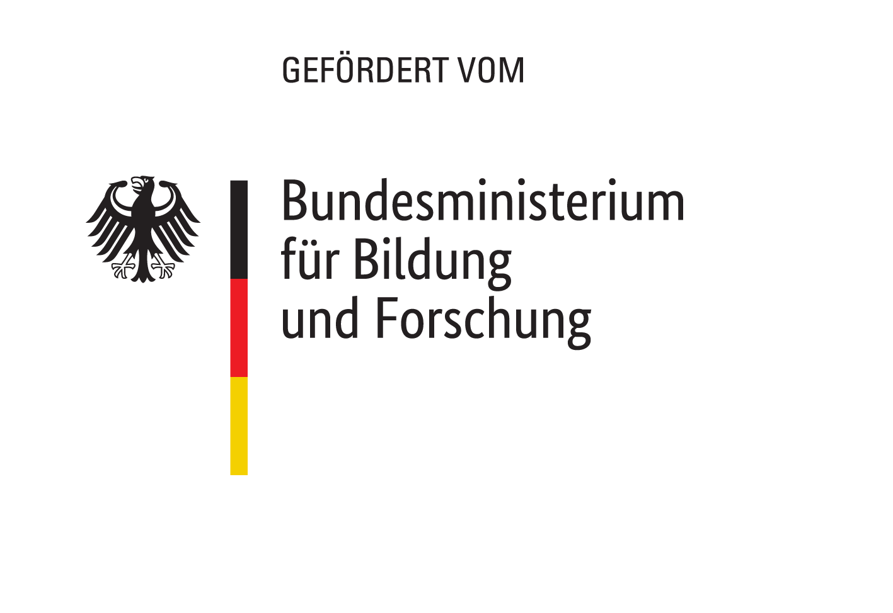

# Compendium – Educational Metadata
This repo contains the text for the "Compendium – Educational Metadata", which was created by Manuel Oellers and Steffen Rörtgen in collaboration with the "German Academic Exchange Service" ([DAAD](https://www.daad.de/de/)) in the context of the organisation's research and development project "[BIRD | Digital Education Space](https://www.daad.de/de/der-daad/was-wir-tun/digitalisierung/bird/)". The original document was published under the DOI [10.5281/zenodo.10828758](https://zenodo.org/doi/10.5281/zenodo.10828758) and can be accessed using this identifier. To facilitate reuse of the document, it was converted into the markup language "[Markdown](https://de.wikipedia.org/wiki/Markdown)".

You can view the web version of the document here: <https://w3id.org/kim/kompendium/> The corresponding Git repo can be found here: <https://github.com/dini-ag-kim/kompendium/>

## Why use Markdown in Git instead of Google Docs or a similar format?
We appreciate that the use of Markdown in combination with a Git repository may be somewhat prohibitive and that not everyone works with these tools on a day-to-day basis. For various reasons, however, this represents the most open format and also permits the broadest possible reuse:

- Google Docs is a proprietary format which, similarly to `docx` in Microsoft Word, offers limited compatibility with freely available tools.
- We use a bibliography in the document and quickly encountered limitations of the Zotero Connector in combination with Google Docs. Ultimately, the task became almost unbearable; synchronisations with Zotero took several minutes or failed to complete at all.
- A Git repo provides the perfect balance of freedom and control: Anybody can make changes and propose that these be included in the "main document". If differences of opinion should arise, a fork can be created to reflect the specific change requests. Such changes can be difficult to keep track of in Google Docs.
- But what about a wiki? This also comes with its own pros and cons. In a wiki that we do not host ourselves, we have to rely on others to ensure that the content remains where it should. Moreover, we were unable to find any wikis that were really suitable for this type of content. Perhaps it would be more beneficial to approach this from a different angle – that is, to improve Wikipedia articles based on the knowledge gained from the compendium.

There are different ways for YOU to work in this compendium even if you are not familiar with Git or Markdown:

- You can create an [issue](https://github.com/dini-ag-kim/kompendium/issues/new) and simply describe what you would like to be changed and why. Someone will then (hopefully) attend to your request and make the necessary changes.
- You learn how to use Markdown and acquire a very basic understanding of Git. We promise you will not regret it.

## How to work with Markdown and Git
*We will soon add a tutorial here that will show you how to make changes. Until then, we recommend reading this [tutorial](https://docs.github.com/de/get-started/writing-on-github/getting-started-with-writing-and-formatting-on-github/quickstart-for-writing-on-github) as well as this [introduction to the syntax of Markdown](https://docs.github.com/de/get-started/writing-on-github/getting-started-with-writing-and-formatting-on-github/basic-writing-and-formatting-syntax).*

## Funding

The views and opinions expressed are solely those of the authors and do not necessarily reflect the views of the European Union or the European Commission. Neither the European Union nor the European Commission can be held responsible for them.

 

## Contributors
- [Manuel Oellers](https://github.com/oellers)
- [Steffen Rörtgen](https://github.com/sroertgen)

## License
This work is published under the CC-BY license. Logos or other marked content are excluded.

Compendium &ndash; Educational Metadata by Oellers, Manuel; R&ouml;rtgen, Steffen is licensed under <a href="http://creativecommons.org/licenses/by/4.0/?ref=chooser-v1" target="_blank" rel="license noopener noreferrer" style="display:inline-block;">CC BY 4.0</a>
 
